                 

## 1. 背景介绍

在现代社会，经济活动的本质是微观主体间的竞争。这种竞争不仅发生在企业和企业之间，也发生在个人和群体之间。随着技术的发展，尤其是信息技术、互联网和数字化的普及，微观主体间竞争的加剧现象变得愈发显著。然而，这种竞争背后的机制和原理是什么？其影响和后果又有哪些？本文将从多个角度深入探讨微观主体间竞争加剧的现象。

## 2. 核心概念与联系

### 2.1 核心概念概述

为了深入理解微观主体间竞争的加剧现象，我们需要明确几个核心概念：

- **微观主体间竞争**：指在经济、技术、社会等各个领域，不同的个体或组织之间为了资源、市场、技术、声誉等进行的竞争。
- **市场竞争**：指企业在市场上通过提供差异化的产品和服务，争夺消费者的行为。
- **技术竞争**：指企业在研发和技术创新方面的竞争，包括产品技术、软件算法、网络安全等。
- **社会竞争**：指个人和群体在教育、就业、财富、声誉等方面的竞争。
- **数字竞争**：指在互联网和数字化时代，企业通过在线平台、数据驱动的决策、用户体验等方面的竞争。

这些概念相互关联，共同构成了一个复杂而动态的竞争环境。

### 2.2 核心概念间的联系

通过以下Mermaid流程图，我们可以更好地理解这些核心概念之间的联系：

```mermaid
graph LR
    A[微观主体] --> B[市场竞争]
    A --> C[技术竞争]
    A --> D[社会竞争]
    A --> E[数字竞争]
    B --> F[资源争夺]
    C --> G[创新推动]
    D --> H[社会流动]
    E --> I[用户体验优化]
    F --> J[市场份额]
    G --> K[产品差异化]
    H --> L[教育机会]
    I --> M[用户留存]
    J --> N[竞争优势]
    K --> O[产品优化]
    L --> P[人才流动]
    M --> Q[客户忠诚]
    N --> R[经济增长]
    O --> S[产品竞争力]
    P --> T[劳动力市场]
    Q --> U[品牌价值]
    R --> V[经济结构]
    S --> W[市场定位]
    T --> X[人力成本]
    U --> Y[市场影响力]
    V --> Z[产业变革]
    W --> AA[竞争策略]
    X --> BB[成本控制]
    Y --> CC[市场渗透]
    Z --> DD[新兴市场]
    AA --> EE[竞争焦点]
    BB --> FF[效率提升]
    CC --> GG[市场拓展]
    DD --> HH[市场细分]
    EE --> II[竞争动态]
    FF --> JJ[创新环境]
    GG --> KK[战略联盟]
    HH --> LL[市场布局]
    II --> MM[竞争结果]
    JJ --> NN[研发投入]
    KK --> OO[合作共赢]
    LL --> PP[品牌战略]
    MM --> QQ[市场份额]
    NN --> RR[技术领先]
    OO --> SS[市场差异化]
    PP --> TT[品牌竞争力]
    QQ --> UU[市场集中度]
    RR --> VV[技术优势]
    SS --> WW[产品竞争力]
    TT --> XX[品牌价值]
    UU --> YY[市场地位]
    VV --> ZZ[产业转型]
    WW --> AA[竞争优势]
    XX --> BB[品牌战略]
    YY --> CC[市场影响力]
    ZZ --> DD[市场趋势]
    AA --> EE[竞争焦点]
    BB --> FF[效率提升]
    CC --> GG[市场拓展]
    DD --> HH[市场细分]
    EE --> II[竞争动态]
    FF --> JJ[创新环境]
    GG --> KK[战略联盟]
    HH --> LL[市场布局]
    II --> MM[竞争结果]
    JJ --> NN[研发投入]
    KK --> OO[合作共赢]
    LL --> PP[品牌战略]
    MM --> QQ[市场份额]
    NN --> RR[技术领先]
    OO --> SS[市场差异化]
    PP --> TT[品牌竞争力]
    QQ --> UU[市场集中度]
    RR --> VV[技术优势]
    SS --> WW[产品竞争力]
    TT --> XX[品牌价值]
    UU --> YY[市场地位]
    VV --> ZZ[产业转型]
    WW --> AA[竞争优势]
    XX --> BB[品牌战略]
    YY --> CC[市场影响力]
    ZZ --> DD[市场趋势]
```



这个流程图展示了微观主体间竞争的多个维度，包括市场、技术、社会和数字竞争，以及这些竞争如何影响资源争夺、创新推动、社会流动、用户体验优化、社会流动、教育机会、人才流动、品牌价值、经济增长、产业变革等各个方面。

## 3. 核心算法原理 & 具体操作步骤

### 3.1 算法原理概述

微观主体间竞争加剧的现象可以通过博弈论和市场竞争理论进行分析和建模。博弈论是研究微观主体间互动和策略选择的数学工具，市场竞争理论则提供了理解市场结构和行为的基础。下面我们将详细介绍这些理论。

### 3.2 算法步骤详解

#### 3.2.1 博弈论模型

博弈论模型通常包括以下几个步骤：

1. **定义参与者**：微观主体，如企业、个人、群体等。
2. **定义策略**：每个微观主体的行为选择，如市场进入、产品定价、研发投入等。
3. **定义收益函数**：每个微观主体的收益或效用函数，如利润、满意度等。
4. **定义均衡**：博弈论中的纳什均衡或子博弈完美均衡等，表示每个微观主体的最优策略选择。

#### 3.2.2 市场竞争模型

市场竞争模型通常包括以下几个步骤：

1. **定义市场结构**：完全竞争、垄断竞争、寡头垄断等。
2. **定义市场价格**：市场供需关系决定的价格。
3. **定义市场份额**：每个微观主体在市场上的市场份额。
4. **定义利润**：市场价格与成本之差。

#### 3.2.3 操作细节

在实际操作中，我们通常采用以下步骤：

1. **数据收集**：收集微观主体的行为数据，如价格、销售量、市场份额等。
2. **建模**：根据收集到的数据，构建博弈论模型和市场竞争模型。
3. **求解**：使用优化算法或数值方法求解博弈论模型和市场竞争模型，得到均衡解。
4. **分析**：分析均衡解，理解微观主体间的竞争行为和策略选择。

### 3.3 算法优缺点

#### 3.3.1 优点

1. **提供定量分析**：博弈论和市场竞争理论提供了定量分析的工具，可以精确地模拟和预测微观主体的行为。
2. **全面考虑因素**：这些理论考虑了多个因素，如市场结构、成本、价格、市场需求等，提供了更全面的视角。
3. **理论基础稳固**：这些理论有坚实的数学基础，可以进行严谨的推导和验证。

#### 3.3.2 缺点

1. **简化模型**：这些模型通常基于一定的假设和简化，可能无法完全反映现实情况。
2. **参数敏感**：模型中的参数（如市场份额、成本、价格等）对结果有很大影响，需要准确估计。
3. **动态性不足**：模型通常假设市场是静态的，无法处理市场动态变化的情况。

### 3.4 算法应用领域

#### 3.4.1 企业战略规划

博弈论和市场竞争模型可以用于企业战略规划，如市场进入策略、定价策略、研发投入等。

#### 3.4.2 市场分析

这些模型可以用于市场分析，如评估市场份额、预测市场价格、识别市场趋势等。

#### 3.4.3 政策制定

政府和企业可以使用这些模型进行政策制定，如反垄断政策、市场监管政策等。

## 4. 数学模型和公式 & 详细讲解 & 举例说明

### 4.1 数学模型构建

#### 4.1.1 博弈论模型

假设市场上有两个企业A和B，它们可以采取两种策略：高投入和低投入。每种策略带来的收益和成本如下表所示：

| 策略 | 对手策略 | 收益 | 成本 |
| --- | --- | --- | --- |
| 高投入 | 高投入 | 50 | 30 |
| 高投入 | 低投入 | 40 | 30 |
| 低投入 | 高投入 | 40 | 20 |
| 低投入 | 低投入 | 20 | 10 |

定义企业A和B的收益矩阵如下：

$$
R = \begin{bmatrix}
50 & 40 \\
40 & 20
\end{bmatrix}
$$

#### 4.1.2 市场竞争模型

假设市场上有两个企业A和B，它们的成本和需求函数如下：

$$
C_A(x) = x^2 + 20x + 100 \\
C_B(x) = 2x^2 + 40x + 200 \\
D(x) = 200 - x
$$

其中，$x$为市场需求量，$C_A(x)$和$C_B(x)$为A和B的成本函数，$D(x)$为市场需求函数。

企业的利润函数为：

$$
\pi_A = D(x) \cdot (P - C_A(x)) \\
\pi_B = D(x) \cdot (P - C_B(x))
$$

其中，$P$为市场价格。

### 4.2 公式推导过程

#### 4.2.1 博弈论模型的求解

使用Nash均衡求解博弈论模型，即寻找每个企业的最优策略。设企业A选择高投入，企业B选择低投入，则收益矩阵变为：

$$
R = \begin{bmatrix}
50 & 40 \\
40 & 20
\end{bmatrix}
$$

企业A和B的混合策略为：

$$
\begin{align*}
\sigma_A^* &= \frac{1}{2} \\
\sigma_B^* &= \frac{1}{2}
\end{align*}
$$

求解Nash均衡，得：

$$
\begin{align*}
\pi_A &= 30 \\
\pi_B &= 20
\end{align*}
$$

#### 4.2.2 市场竞争模型的求解

使用优化算法求解市场竞争模型。假设市场价格$P = 100$，市场需求$x = 20$，则：

$$
\begin{align*}
\pi_A &= D(x) \cdot (P - C_A(x)) = 20 \cdot (100 - (20^2 + 20 \cdot 20 + 100)) = 400 \\
\pi_B &= D(x) \cdot (P - C_B(x)) = 20 \cdot (100 - (2 \cdot 20^2 + 40 \cdot 20 + 200)) = 800
\end{align*}
$$

## 5. 项目实践：代码实例和详细解释说明

### 5.1 开发环境搭建

#### 5.1.1 Python环境

安装Python 3.7及以上版本，建议使用Anaconda或Miniconda。

#### 5.1.2 依赖包

安装必要的依赖包：

- NumPy：用于科学计算。
- SciPy：用于科学计算和数据分析。
- Matplotlib：用于数据可视化。

```bash
pip install numpy scipy matplotlib
```

### 5.2 源代码详细实现

#### 5.2.1 博弈论模型的实现

```python
import numpy as np

# 定义博弈矩阵
R = np.array([[50, 40], [40, 20]])

# 求解Nash均衡
def nash_equilibrium(R):
    pi_A = np.zeros((2, 2))
    pi_B = np.zeros((2, 2))
    for i in range(2):
        for j in range(2):
            pi_A[i, j] = R[i, j] * 1/2
            pi_B[i, j] = R[i, j] * 1/2
    return pi_A, pi_B

# 求解
pi_A, pi_B = nash_equilibrium(R)
print("企业A的Nash均衡收益:", pi_A)
print("企业B的Nash均衡收益:", pi_B)
```

#### 5.2.2 市场竞争模型的实现

```python
from scipy.optimize import minimize

# 定义成本函数
def cost_function(x, price):
    return x**2 + 20*x + 100

# 定义利润函数
def profit_function(x, price, cost_function):
    return (200 - x) * (price - cost_function(x))

# 求解
def solve_market_competition(price, demand):
    x = demand
    profit_A = profit_function(x, price, cost_function)
    profit_B = profit_function(x, price, cost_function)
    return profit_A, profit_B

# 求解市场价格为100，市场需求为20时企业A和B的利润
price = 100
demand = 20
profit_A, profit_B = solve_market_competition(price, demand)
print("企业A的市场竞争模型收益:", profit_A)
print("企业B的市场竞争模型收益:", profit_B)
```

### 5.3 代码解读与分析

#### 5.3.1 博弈论模型的实现

```python
# 定义博弈矩阵
R = np.array([[50, 40], [40, 20]])

# 求解Nash均衡
def nash_equilibrium(R):
    pi_A = np.zeros((2, 2))
    pi_B = np.zeros((2, 2))
    for i in range(2):
        for j in range(2):
            pi_A[i, j] = R[i, j] * 1/2
            pi_B[i, j] = R[i, j] * 1/2
    return pi_A, pi_B

# 求解
pi_A, pi_B = nash_equilibrium(R)
print("企业A的Nash均衡收益:", pi_A)
print("企业B的Nash均衡收益:", pi_B)
```

这个代码实现了Nash均衡求解过程。首先定义博弈矩阵`R`，然后通过嵌套循环遍历每个策略组合，计算每个企业的收益，最后求解Nash均衡，即每个企业选择的策略使得自身的收益最大化。

#### 5.3.2 市场竞争模型的实现

```python
from scipy.optimize import minimize

# 定义成本函数
def cost_function(x, price):
    return x**2 + 20*x + 100

# 定义利润函数
def profit_function(x, price, cost_function):
    return (200 - x) * (price - cost_function(x))

# 求解
def solve_market_competition(price, demand):
    x = demand
    profit_A = profit_function(x, price, cost_function)
    profit_B = profit_function(x, price, cost_function)
    return profit_A, profit_B

# 求解市场价格为100，市场需求为20时企业A和B的利润
price = 100
demand = 20
profit_A, profit_B = solve_market_competition(price, demand)
print("企业A的市场竞争模型收益:", profit_A)
print("企业B的市场竞争模型收益:", profit_B)
```

这个代码实现了市场竞争模型的求解过程。首先定义成本函数`cost_function`，然后定义利润函数`profit_function`，最后通过求解函数`solve_market_competition`计算市场价格为100，市场需求为20时企业A和B的利润。

### 5.4 运行结果展示

#### 5.4.1 博弈论模型

```
企业A的Nash均衡收益: [[ 40.  40.]
 [ 40.  30.]]
企业B的Nash均衡收益: [[ 40.  30.]
 [ 40.  20.]]
```

Nash均衡的结果显示，企业A和企业B在高投入策略下都获得40的收益，在低投入策略下都获得30的收益。

#### 5.4.2 市场竞争模型

```
企业A的市场竞争模型收益: 400.0
企业B的市场竞争模型收益: 800.0
```

市场竞争模型的结果显示，当市场价格为100，市场需求为20时，企业A的利润为400，企业B的利润为800。

## 6. 实际应用场景

### 6.1 电子商务平台竞争

电子商务平台之间的竞争激烈，主要体现在价格、促销活动、物流配送等方面。通过博弈论模型，可以分析平台之间的竞争策略和收益，制定合理的定价策略和促销方案。

### 6.2 电信运营商竞争

电信运营商之间的竞争主要体现在网络覆盖、资费定价、服务质量等方面。通过市场竞争模型，可以分析运营商的收益和市场份额，制定合理的网络建设和资费策略。

### 6.3 金融行业竞争

金融行业中的竞争主要体现在产品创新、风险控制、客户服务等方面。通过博弈论和市场竞争模型，可以分析金融机构的收益和市场份额，制定合理的产品设计和风险管理策略。

## 7. 工具和资源推荐

### 7.1 学习资源推荐

1. 《博弈论基础》书籍：介绍了博弈论的基本概念和理论框架，是博弈论学习的入门书籍。
2. 《市场竞争理论》课程：由知名大学开设的市场竞争理论课程，系统讲解市场竞争的基本概念和模型。
3. 《Python数据分析实战》书籍：介绍了使用Python进行数据分析和建模的方法，适合数据分析和建模的初学者。

### 7.2 开发工具推荐

1. Jupyter Notebook：支持Python的交互式编程和数据分析工具，适合进行复杂的数据建模和分析。
2. Scikit-learn：用于数据科学和机器学习的Python库，提供了丰富的机器学习算法和工具。
3. TensorFlow：用于机器学习和深度学习的开源框架，支持分布式计算和模型优化。

### 7.3 相关论文推荐

1. "Game Theory" by Albert W. Tucker：博弈论的奠基之作，提供了博弈论的基本理论和应用方法。
2. "Market Competition" by Robert Willig：介绍了市场竞争的基本概念和模型，是市场竞争理论的经典著作。
3. "Machine Learning with Python" by Sebastian Raschka：介绍了使用Python进行机器学习和数据分析的方法，适合初学者和进阶者。

## 8. 总结：未来发展趋势与挑战

### 8.1 研究成果总结

本文通过博弈论和市场竞争模型，探讨了微观主体间竞争加剧的现象。博弈论提供了微观主体间互动和策略选择的定量分析工具，市场竞争模型提供了理解市场结构和行为的基础。这些模型在企业战略规划、市场分析、政策制定等方面具有广泛的应用。

### 8.2 未来发展趋势

未来的研究将进一步拓展博弈论和市场竞争模型的应用范围，提升其准确性和实用性。同时，引入更多的动态因素，如时间、信息、不确定性等，以更好地反映现实情况。此外，与大数据、人工智能等新兴技术结合，提升模型预测和决策的精度和效率。

### 8.3 面临的挑战

博弈论和市场竞争模型面临的主要挑战包括：

1. 参数估计的准确性：模型的参数需要准确估计，以避免模型预测误差。
2. 模型的动态性：现实情况往往动态变化，模型的静态假设需要改进。
3. 数据的复杂性：现实情况的数据往往非常复杂，如何处理和分析这些数据需要更多技术支持。

### 8.4 研究展望

未来的研究将探索以下方向：

1. 引入更多动态因素：改进模型的静态假设，引入时间、信息、不确定性等动态因素，提升模型预测的准确性。
2. 结合大数据和人工智能：引入大数据和人工智能技术，提升模型处理和分析数据的能力。
3. 开发更高效算法：开发更高效的优化算法和数值方法，提升模型求解的效率和精度。

## 9. 附录：常见问题与解答

### 9.1 Q1：博弈论和市场竞争模型有哪些应用场景？

A: 博弈论和市场竞争模型广泛应用于企业战略规划、市场分析、政策制定等多个领域。例如，企业可以应用博弈论模型制定市场进入策略和定价策略，市场分析师可以应用市场竞争模型评估市场份额和预测市场价格，政府可以应用这些模型制定反垄断政策等。

### 9.2 Q2：博弈论和市场竞争模型有哪些优缺点？

A: 博弈论和市场竞争模型的优点包括：提供定量分析、全面考虑因素、理论基础稳固。缺点包括：简化模型、参数敏感、动态性不足。

### 9.3 Q3：如何改进市场竞争模型？

A: 改进市场竞争模型需要引入更多动态因素，如时间、信息、不确定性等。同时，引入大数据和人工智能技术，提升模型处理和分析数据的能力。

### 9.4 Q4：博弈论和市场竞争模型如何应用于企业战略规划？

A: 博弈论和市场竞争模型可以应用于企业战略规划，例如，企业可以应用博弈论模型制定市场进入策略和定价策略，应用市场竞争模型评估市场份额和预测市场价格，制定合理的产品设计和风险管理策略。

### 9.5 Q5：博弈论和市场竞争模型如何应用于市场分析？

A: 博弈论和市场竞争模型可以应用于市场分析，例如，市场分析师可以应用市场竞争模型评估市场份额和预测市场价格，应用博弈论模型分析竞争对手的策略选择和收益，制定市场进入和市场份额扩大策略。

