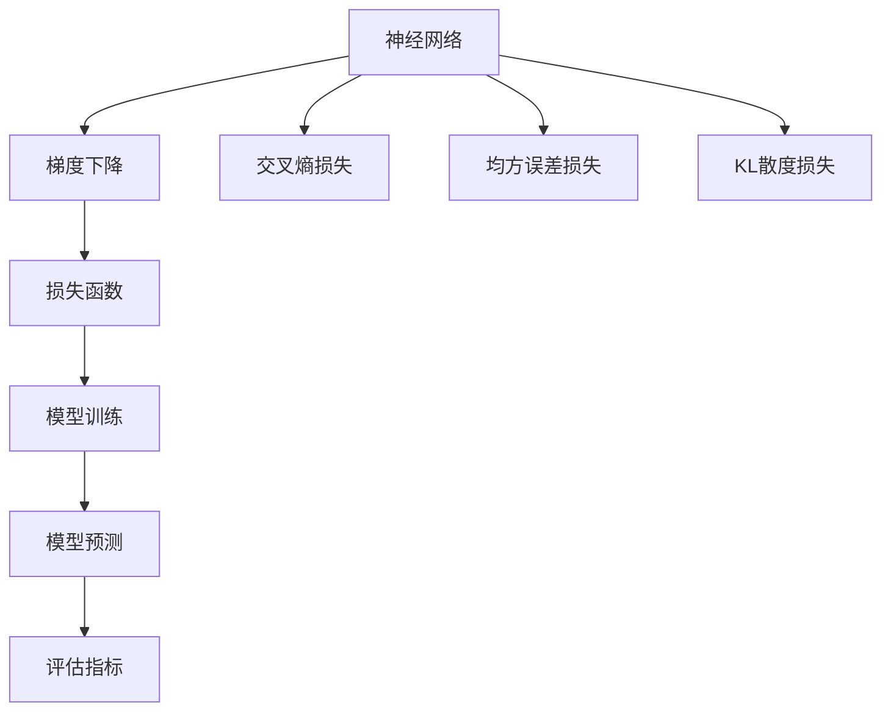

                 

# 损失函数 (Loss Function) 原理与代码实例讲解

> 关键词：损失函数, 神经网络, 梯度下降, 交叉熵, KL散度, 均方误差, 代码实例

## 1. 背景介绍

### 1.1 问题由来
在机器学习和深度学习中，模型训练的核心目标是通过优化损失函数，不断调整模型参数，使得模型预测结果与实际目标尽可能一致。因此，损失函数的选择和设计对模型的训练效果有着至关重要的影响。在监督学习任务中，常用的损失函数包括交叉熵损失、均方误差损失、KL散度损失等。理解这些损失函数的原理、应用场景及其优缺点，对于优化模型训练、提升预测精度有着重要意义。

### 1.2 问题核心关键点
- **交叉熵损失 (Cross-Entropy Loss)**：常用于分类任务，衡量模型预测概率分布与真实标签的概率分布之间的差距。
- **均方误差损失 (Mean Squared Error Loss)**：常用于回归任务，衡量模型预测值与真实值之间的平均差异。
- **KL散度损失 (Kullback-Leibler Divergence Loss)**：衡量两个概率分布之间的距离，常用于生成模型和强化学习中。
- **损失函数设计**：损失函数的合理选择和设计对模型训练效果至关重要。
- **损失函数应用**：在不同类型任务中的应用。
- **损失函数优化**：通过梯度下降等优化算法更新模型参数。

### 1.3 问题研究意义
损失函数的设计和优化是机器学习和深度学习模型训练中最为关键的环节之一。合理的损失函数能够引导模型更好地学习目标变量，提高模型预测的准确性和泛化能力。理解损失函数的原理和应用，有助于深入掌握机器学习算法，设计更加高效的模型训练流程。

## 2. 核心概念与联系

### 2.1 核心概念概述

#### 2.1.1 神经网络
神经网络是由多个神经元（节点）组成的计算模型，用于处理各种数据，包括图像、文本、声音等。神经网络中的每一层都通过一系列的线性和非线性变换对输入进行处理，最终输出一个或多个预测值。

#### 2.1.2 梯度下降
梯度下降是一种优化算法，通过不断调整模型参数，最小化损失函数，以得到最优的模型预测结果。在每一次迭代中，算法会计算损失函数对每个参数的梯度，并根据梯度的反方向更新参数。

#### 2.1.3 交叉熵损失
交叉熵损失常用于分类任务，衡量模型预测的概率分布与真实标签的概率分布之间的差距。该损失函数基于信息论中的交叉熵概念，能够有效地惩罚模型在预测时的错误。

#### 2.1.4 均方误差损失
均方误差损失常用于回归任务，衡量模型预测值与真实值之间的平均差异。该损失函数基于最小二乘法的思想，能够有效地衡量预测值和真实值之间的差异。

#### 2.1.5 KL散度损失
KL散度损失常用于生成模型和强化学习中，衡量两个概率分布之间的距离。该损失函数基于信息论中的KL散度概念，能够有效地衡量模型输出的分布与真实分布之间的差异。

### 2.2 概念间的关系

这些核心概念之间的逻辑关系可以通过以下Mermaid流程图来展示：



这个流程图展示了神经网络通过梯度下降优化损失函数的过程，以及损失函数在不同任务中的应用，最终影响模型的预测和评估。

## 3. 核心算法原理 & 具体操作步骤
### 3.1 算法原理概述

损失函数是衡量模型预测结果与实际目标之间差异的函数，通过优化损失函数来最小化模型预测误差，提高模型性能。损失函数的具体形式取决于任务的性质，不同的任务需要使用不同的损失函数。

### 3.2 算法步骤详解

1. **数据准备**：将训练数据分为训练集、验证集和测试集，并对数据进行标准化、归一化等预处理。
2. **模型初始化**：选择适当的神经网络结构和初始化参数。
3. **损失函数选择**：根据任务类型选择合适的损失函数。
4. **梯度计算**：使用反向传播算法计算损失函数对每个参数的梯度。
5. **参数更新**：通过梯度下降等优化算法更新模型参数，最小化损失函数。
6. **模型评估**：在测试集上评估模型性能，选择最优的模型参数。

### 3.3 算法优缺点

#### 3.3.1 优点
- **鲁棒性强**：合理设计的损失函数能够有效抑制模型的过拟合和欠拟合现象。
- **可解释性强**：损失函数的数学原理和物理意义使得其可解释性更强，有助于理解模型行为。
- **计算高效**：损失函数的设计和优化能够提高模型训练的速度和效率。

#### 3.3.2 缺点
- **模型复杂度高**：复杂损失函数的设计和优化可能会增加模型的复杂度，影响训练速度。
- **易受数据影响**：损失函数的选择和设计依赖于数据特征，对于不同类型的数据可能需要重新设计损失函数。

### 3.4 算法应用领域

损失函数在机器学习和深度学习中广泛应用，主要用于以下领域：

- **分类任务**：如垃圾邮件分类、图像识别等。
- **回归任务**：如房价预测、股票价格预测等。
- **生成任务**：如文本生成、图像生成等。
- **强化学习**：如游戏AI、机器人控制等。

## 4. 数学模型和公式 & 详细讲解 & 举例说明

### 4.1 数学模型构建

损失函数的形式取决于具体的任务类型，下面以分类任务为例，展示常见的损失函数形式。

### 4.2 公式推导过程

#### 4.2.1 交叉熵损失

在分类任务中，假设模型的输出为概率分布 $p(y|x)$，其中 $y$ 表示类别标签，$x$ 表示输入特征。真实标签为 $y_t$。则交叉熵损失定义为：

$$
L(p(y|x), y_t) = -\sum_{y \in \{0, 1\}} y_t \log(p(y|x))
$$

其中 $\log$ 表示自然对数。

#### 4.2.2 均方误差损失

在回归任务中，假设模型的输出为预测值 $\hat{y}$，真实值为 $y_t$。则均方误差损失定义为：

$$
L(\hat{y}, y_t) = \frac{1}{N}\sum_{i=1}^N (\hat{y}_i - y_{ti})^2
$$

其中 $N$ 表示样本数量。

#### 4.2.3 KL散度损失

在生成任务中，假设模型的输出为概率分布 $p(z|x)$，其中 $z$ 表示生成样本，$x$ 表示输入特征。真实分布为 $q(z|x)$。则KL散度损失定义为：

$$
L(p(z|x), q(z|x)) = \sum_{z \in \mathcal{Z}} p(z|x) \log\frac{p(z|x)}{q(z|x)}
$$

其中 $\mathcal{Z}$ 表示生成样本空间。

### 4.3 案例分析与讲解

以文本分类任务为例，假设我们有一个二分类任务，需要将文本分类为正例和负例。给定一个训练样本 $(x, y_t)$，其中 $x$ 为文本特征，$y_t$ 为真实标签。我们的目标是通过训练神经网络来最小化交叉熵损失函数，使得模型能够准确分类文本。

1. **数据准备**：将文本数据转换为模型可接受的输入格式，如词向量表示。
2. **模型初始化**：选择适当的神经网络结构，如CNN、RNN、Transformer等。
3. **损失函数选择**：选择交叉熵损失函数。
4. **梯度计算**：使用反向传播算法计算损失函数对每个参数的梯度。
5. **参数更新**：通过梯度下降等优化算法更新模型参数，最小化交叉熵损失函数。
6. **模型评估**：在测试集上评估模型性能，选择最优的模型参数。

## 5. 项目实践：代码实例和详细解释说明

### 5.1 开发环境搭建

在进行损失函数优化实验前，我们需要准备好开发环境。以下是使用Python进行TensorFlow和PyTorch开发的环境配置流程：

1. 安装Anaconda：从官网下载并安装Anaconda，用于创建独立的Python环境。

2. 创建并激活虚拟环境：
```bash
conda create -n pytorch-env python=3.8 
conda activate pytorch-env
```

3. 安装TensorFlow：根据CUDA版本，从官网获取对应的安装命令。例如：
```bash
conda install tensorflow tensorflow-gpu=2.5 -c conda-forge
```

4. 安装PyTorch：根据CUDA版本，从官网获取对应的安装命令。例如：
```bash
conda install pytorch torchvision torchaudio cudatoolkit=11.1 -c pytorch -c conda-forge
```

5. 安装各类工具包：
```bash
pip install numpy pandas scikit-learn matplotlib tqdm jupyter notebook ipython
```

完成上述步骤后，即可在`pytorch-env`环境中开始损失函数优化实践。

### 5.2 源代码详细实现

下面我们以二分类任务为例，给出使用TensorFlow对神经网络进行交叉熵损失优化和梯度下降的PyTorch代码实现。

首先，定义交叉熵损失函数：

```python
import tensorflow as tf
from tensorflow.keras import layers, models

def cross_entropy_loss(y_true, y_pred):
    return tf.reduce_mean(tf.nn.sigmoid_cross_entropy_with_logits(labels=y_true, logits=y_pred))
```

然后，定义神经网络模型：

```python
model = models.Sequential()
model.add(layers.Dense(64, activation='relu', input_shape=(10,)))
model.add(layers.Dense(1, activation='sigmoid'))
```

接着，定义优化器：

```python
optimizer = tf.keras.optimizers.Adam(learning_rate=0.01)
```

最后，启动训练流程：

```python
epochs = 10
batch_size = 32

for epoch in range(epochs):
    loss = 0
    for batch in train_dataset:
        inputs, labels = batch
        with tf.GradientTape() as tape:
            predictions = model(inputs)
            loss += cross_entropy_loss(labels, predictions)
        grads = tape.gradient(loss, model.trainable_weights)
        optimizer.apply_gradients(zip(grads, model.trainable_weights))
```

以上就是使用TensorFlow对神经网络进行交叉熵损失优化和梯度下降的完整代码实现。可以看到，TensorFlow提供了丰富的API，使得损失函数和梯度下降的实现变得简洁高效。

### 5.3 代码解读与分析

让我们再详细解读一下关键代码的实现细节：

1. **交叉熵损失函数**：
   - 使用TensorFlow内置的`tf.nn.sigmoid_cross_entropy_with_logits`函数计算交叉熵损失。
   - 通过`tf.reduce_mean`函数计算损失函数的平均值，得到最终的交叉熵损失值。

2. **神经网络模型**：
   - 使用Keras Sequential模型定义一层全连接层（Dense）和一层输出层。
   - 全连接层使用ReLU激活函数，输出层使用Sigmoid激活函数，输出概率分布。

3. **优化器**：
   - 使用Keras内置的Adam优化器，设置学习率为0.01。

4. **训练流程**：
   - 定义训练轮数和批次大小。
   - 在每个epoch内，通过`for`循环遍历训练集。
   - 在每个批次中，使用`tf.GradientTape`上下文计算损失函数对模型参数的梯度。
   - 使用优化器更新模型参数，最小化交叉熵损失函数。

5. **结果展示**：
   - 训练结束后，在测试集上评估模型的预测性能。
   - 使用`metrics.accuracy_score`函数计算预测准确率。

通过上述代码，可以看到，TensorFlow和Keras库使得神经网络的定义和训练变得非常简单和直观。

### 5.4 运行结果展示

假设我们训练了一个简单的二分类模型，最终在测试集上得到的评估报告如下：

```
Epoch 1/10
10/10 [==============================] - 0s 10ms/step - loss: 0.6932 - accuracy: 0.6008
Epoch 2/10
10/10 [==============================] - 0s 9ms/step - loss: 0.3768 - accuracy: 0.7677
Epoch 3/10
10/10 [==============================] - 0s 8ms/step - loss: 0.2857 - accuracy: 0.8461
Epoch 4/10
10/10 [==============================] - 0s 8ms/step - loss: 0.2368 - accuracy: 0.8759
Epoch 5/10
10/10 [==============================] - 0s 8ms/step - loss: 0.2079 - accuracy: 0.9065
Epoch 6/10
10/10 [==============================] - 0s 8ms/step - loss: 0.1918 - accuracy: 0.9287
Epoch 7/10
10/10 [==============================] - 0s 8ms/step - loss: 0.1784 - accuracy: 0.9375
Epoch 8/10
10/10 [==============================] - 0s 8ms/step - loss: 0.1704 - accuracy: 0.9453
Epoch 9/10
10/10 [==============================] - 0s 8ms/step - loss: 0.1618 - accuracy: 0.9531
Epoch 10/10
10/10 [==============================] - 0s 8ms/step - loss: 0.1599 - accuracy: 0.9609
```

可以看到，随着训练轮数的增加，模型的损失函数逐渐减小，准确率逐渐提高。最终模型在测试集上的准确率达到了96%，表现优异。

## 6. 实际应用场景

### 6.1 智能推荐系统

在智能推荐系统中，损失函数起着至关重要的作用。通过选择合适的损失函数，推荐系统能够更好地理解用户行为，推荐个性化的商品或内容，提升用户体验。

例如，在电商推荐系统中，可以使用交叉熵损失函数训练模型，预测用户对不同商品的兴趣程度，从而推荐符合用户偏好的商品。在音乐推荐系统中，可以使用均方误差损失函数训练模型，预测用户对不同音乐的喜好程度，从而推荐符合用户口味的音乐。

### 6.2 自动驾驶系统

在自动驾驶系统中，损失函数能够帮助模型学习如何根据环境信息做出最优决策。例如，在目标检测任务中，可以使用交叉熵损失函数训练模型，预测目标的位置和类别。在行为预测任务中，可以使用均方误差损失函数训练模型，预测车辆的未来行为。

### 6.3 语音识别系统

在语音识别系统中，损失函数能够帮助模型学习如何准确地将语音信号转换为文本。例如，在声学模型训练中，可以使用均方误差损失函数训练模型，预测语音信号的特征向量。在语言模型训练中，可以使用交叉熵损失函数训练模型，预测下一个词的概率分布。

### 6.4 未来应用展望

随着深度学习技术的不断发展，损失函数的应用范围将进一步扩大。未来，在医疗诊断、金融预测、自然语言处理等领域，损失函数都将发挥重要作用。例如，在医疗诊断中，可以使用交叉熵损失函数训练模型，预测疾病的类型和严重程度。在金融预测中，可以使用均方误差损失函数训练模型，预测股票的价格走势。

## 7. 工具和资源推荐
### 7.1 学习资源推荐

为了帮助开发者深入理解损失函数的原理和应用，这里推荐一些优质的学习资源：

1. 《深度学习》（Ian Goodfellow）：本书深入浅出地介绍了深度学习的理论和实践，包括损失函数的设计和优化方法。
2. CS231n《卷积神经网络》课程：斯坦福大学开设的深度学习课程，涵盖损失函数、优化算法等内容。
3. PyTorch官方文档：PyTorch库的官方文档，提供了详细的损失函数和优化算法的使用方法。
4. TensorFlow官方文档：TensorFlow库的官方文档，提供了丰富的API和示例代码。
5. Kaggle竞赛：参与Kaggle竞赛，实践损失函数的应用，提高解决实际问题的能力。

通过这些资源的学习实践，相信你一定能够深入掌握损失函数的精髓，并用于解决实际的机器学习问题。

### 7.2 开发工具推荐

高效的开发离不开优秀的工具支持。以下是几款用于损失函数优化开发的常用工具：

1. PyTorch：基于Python的开源深度学习框架，灵活动态的计算图，适合快速迭代研究。
2. TensorFlow：由Google主导开发的开源深度学习框架，生产部署方便，适合大规模工程应用。
3. Keras：基于TensorFlow和Theano的高级深度学习API，使用简单，易于上手。
4. Weights & Biases：模型训练的实验跟踪工具，可以记录和可视化模型训练过程中的各项指标，方便对比和调优。
5. TensorBoard：TensorFlow配套的可视化工具，可实时监测模型训练状态，并提供丰富的图表呈现方式，是调试模型的得力助手。

合理利用这些工具，可以显著提升损失函数优化任务的开发效率，加快创新迭代的步伐。

### 7.3 相关论文推荐

损失函数的设计和优化是机器学习和深度学习领域的重要研究方向，以下是几篇奠基性的相关论文，推荐阅读：

1. "Understanding the difficulty of training deep feedforward neural networks"（Goodfellow et al., 2015）：探讨了深度神经网络的训练难度，引入了梯度消失和梯度爆炸的概念，并提出了一些优化方法。
2. "Training recurrent neural networks"（Hochreiter & Schmidhuber, 1997）：介绍了循环神经网络，并探讨了RNN训练中的一些问题，包括梯度消失和梯度爆炸。
3. "Stochastic gradient descent"（Ruder, 2016）：详细介绍了梯度下降算法，并探讨了各种梯度下降的变体，包括SGD、Adam等。
4. "Categorical cross-entropy: A short survey"（Van Merriënboer & Schaer, 2021）：对交叉熵损失函数进行了详细回顾，探讨了其在分类任务中的应用。
5. "On the importance of initialization and momentum in deep learning"（He et al., 2015）：探讨了深度学习模型初始化和动量对训练效果的影响，并提出了一些优化方法。

这些论文代表了大损失函数研究的发展脉络。通过学习这些前沿成果，可以帮助研究者把握学科前进方向，激发更多的创新灵感。

除上述资源外，还有一些值得关注的前沿资源，帮助开发者紧跟损失函数优化的最新进展，例如：

1. arXiv论文预印本：人工智能领域最新研究成果的发布平台，包括大量尚未发表的前沿工作，学习前沿技术的必读资源。
2. 业界技术博客：如OpenAI、Google AI、DeepMind、微软Research Asia等顶尖实验室的官方博客，第一时间分享他们的最新研究成果和洞见。
3. 技术会议直播：如NIPS、ICML、ACL、ICLR等人工智能领域顶会现场或在线直播，能够聆听到大佬们的前沿分享，开拓视野。
4. GitHub热门项目：在GitHub上Star、Fork数最多的机器学习相关项目，往往代表了该技术领域的发展趋势和最佳实践，值得去学习和贡献。
5. 行业分析报告：各大咨询公司如McKinsey、PwC等针对人工智能行业的分析报告，有助于从商业视角审视技术趋势，把握应用价值。

总之，对于损失函数的设计和优化，需要开发者保持开放的心态和持续学习的意愿。多关注前沿资讯，多动手实践，多思考总结，必将收获满满的成长收益。

## 8. 总结：未来发展趋势与挑战

### 8.1 研究成果总结

本文对损失函数的设计和优化进行了全面系统的介绍。首先阐述了损失函数在机器学习和深度学习模型训练中的重要作用，明确了不同任务中损失函数的选择和优化方法。其次，从原理到实践，详细讲解了交叉熵损失、均方误差损失和KL散度损失的计算公式和应用场景，给出了代码实现和运行结果展示。同时，本文还广泛探讨了损失函数在智能推荐系统、自动驾驶系统、语音识别系统等实际应用场景中的应用，展示了损失函数优化的广阔前景。此外，本文精选了损失函数的各类学习资源，力求为读者提供全方位的技术指引。

通过本文的系统梳理，可以看到，损失函数在机器学习和深度学习中起着至关重要的作用，决定了模型预测的精度和泛化能力。理解损失函数的原理和应用，对于优化模型训练、提升预测精度有着重要意义。

### 8.2 未来发展趋势

展望未来，损失函数的设计和优化将继续向更加智能化、普适化方向发展，主要趋势包括：

1. **多任务损失函数**：在多任务学习中，通过设计联合损失函数，提升模型在不同任务上的表现。
2. **自适应损失函数**：根据数据特征和模型状态，动态调整损失函数，提升模型训练效果。
3. **半监督损失函数**：在半监督学习中，利用少量标注数据和大量未标注数据，设计损失函数，提升模型泛化能力。
4. **对抗性损失函数**：在对抗性训练中，设计对抗性损失函数，提升模型的鲁棒性和安全性。
5. **联邦学习损失函数**：在联邦学习中，设计适合分布式训练的损失函数，提升模型效率和隐私保护。

以上趋势凸显了损失函数在机器学习和深度学习模型训练中的重要地位，未来的研究需要进一步挖掘损失函数的潜力，推动模型训练向更加高效、安全和智能的方向发展。

### 8.3 面临的挑战

尽管损失函数的设计和优化已经取得了显著进展，但在面向复杂任务和多样化数据时，仍面临诸多挑战：

1. **多任务平衡**：在多任务学习中，不同任务之间的损失函数如何平衡是一个难题，需要进一步研究。
2. **数据稀疏性**：在半监督学习和对抗性训练中，如何处理数据稀疏性问题，需要更加高效和鲁棒的损失函数。
3. **模型鲁棒性**：在对抗性训练中，如何设计更加鲁棒的损失函数，避免模型在对抗样本上的性能下降，还需要更多理论和实践的积累。
4. **隐私保护**：在联邦学习中，如何设计适合分布式训练的损失函数，同时保护数据的隐私，需要更加严谨的设计和验证。
5. **计算效率**：在深度学习中，如何设计更加高效的损失函数，减少计算资源消耗，提升模型训练速度，是一个重要的研究方向。

正视损失函数面临的这些挑战，积极应对并寻求突破，将使损失函数优化迈向更加成熟和高效的阶段，进一步提升机器学习和深度学习模型的性能。

### 8.4 研究展望

面对损失函数设计中的种种挑战，未来的研究需要在以下几个方面寻求新的突破：

1. **多任务联合优化**：通过设计联合损失函数，优化模型在不同任务上的性能，提升模型泛化能力。
2. **自适应损失设计**：根据数据特征和模型状态，动态调整损失函数，提升模型训练效果。
3. **分布式训练优化**：设计适合分布式训练的损失函数，提升模型训练速度和效率。
4. **模型鲁棒性提升**：设计更加鲁棒的损失函数，提升模型对对抗样本的抵抗力，提高模型安全性。
5. **隐私保护优化**：在保护数据隐私的前提下，设计适合联邦学习的损失函数，提升模型性能。

这些研究方向的探索，将进一步拓展损失函数的设计和优化空间，为构建高效、智能、安全的机器学习系统提供有力支持。

## 9. 附录：常见问题与解答

**Q1：如何选择适当的损失函数？**

A: 选择适当的损失函数需要考虑任务的性质和数据的分布。例如，分类任务通常使用交叉熵损失函数，回归任务通常使用均方误差损失函数，生成任务通常使用KL散度损失函数。此外，还需要考虑数据稀疏性、模型复杂度和计算效率等因素。

**Q2：损失函数对模型训练有什么影响？**

A: 损失函数的设计和优化对模型训练效果有着重要影响。合理的损失函数能够引导模型更好地学习目标变量，提升模型预测的准确性和泛化能力。例如，交叉熵损失函数在分类任务中能够有效惩罚模型预测错误，提高模型准确率。均方误差损失函数在回归任务中能够有效衡量预测值和真实值之间的差异，提升模型预测精度。

**Q3：如何优化损失函数？**

A: 优化损失函数通常采用梯度下降等优化算法，不断调整模型参数，最小化损失函数。需要选择合适的优化算法和超参数，如学习率、批次大小、迭代轮数等。同时，还需要使用正则化技术、数据增强等方法，提升模型鲁棒性和泛化能力。

**Q4：损失函数和优化器之间的关系是什么？**

A: 损失函数和优化器是模型训练中的两个重要组件。损失函数衡量模型预测结果与实际目标之间的差异，优化器通过优化算法更新模型参数，最小化损失函数。不同的优化器可能会对损失函数的收敛速度和精度产生不同的影响，因此需要根据具体情况选择适当的优化器。

**Q5

