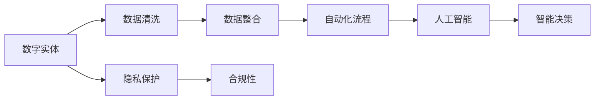

                 

# 数字实体自动化的未来前景

## 1. 背景介绍

随着信息技术的迅猛发展，数字实体（digital entities）已经深入到我们生活的方方面面。数字实体包括但不限于个人身份信息、企业注册信息、金融交易数据、社交媒体数据等，它们在数字经济的运作中扮演着重要角色。数字实体的自动化管理不仅关乎数据安全，还直接影响着企业的业务运营效率和用户体验。数字化转型的大潮下，数字实体自动化（Digital Entity Automation, DEA）正成为企业和社会的重要需求。

### 1.1 问题由来

数字实体自动化主要关注如何自动化处理和维护数字实体信息。这一过程包括但不限于身份验证、数据提取、数据更新、数据隐私保护等。传统的数字实体管理依赖于人工操作，效率低下且容易出错。而数字实体的自动化则可以利用人工智能技术，提高管理效率和准确性，降低人工干预，减少潜在的安全风险。

数字实体的自动化管理已经成为当前技术创新和业务变革的热点。尤其在金融、医疗、电商、物联网等领域，数字实体自动化技术的应用已经产生了显著的经济效益和社会价值。例如，银行和金融机构利用自动化技术进行客户身份验证，可以大幅提升用户体验；医疗机构通过自动化流程处理病历信息，可以提高诊疗效率；电商平台通过自动化的数据处理，可以提升订单处理的准确性和速度。

### 1.2 问题核心关键点

数字实体自动化的核心关键点主要包括：

- **数据来源的多样性**：数字实体数据来源广泛，包括线上和线下的各种数据源，如何整合和清洗这些数据是关键问题。
- **数据的准确性和一致性**：不同来源的数据可能在格式和内容上存在差异，如何保证数据的一致性和准确性是实现自动化管理的前提。
- **隐私保护和合规性**：数字实体数据往往涉及隐私和安全，如何在自动化过程中保护用户隐私并符合法律法规要求是核心挑战。
- **系统的可扩展性和可靠性**：数字实体的数量和类型随着业务发展不断增加，如何构建可扩展和可靠的自动化系统，保证系统的稳定运行是关键。
- **自动化流程的智能化**：如何利用人工智能技术提升自动化流程的智能化水平，例如通过自然语言处理（NLP）技术自动理解和处理文本数据，实现全流程自动化。

## 2. 核心概念与联系

### 2.1 核心概念概述

为了更好地理解数字实体自动化的过程和原理，我们先简要介绍几个核心概念：

- **数字实体（Digital Entity）**：指任何可以唯一标识的信息，包括但不限于个人身份信息、企业信息、产品信息等。
- **数据清洗（Data Cleaning）**：指去除数据中的噪声和错误，使数据质量得到提升。
- **数据整合（Data Integration）**：指将来自不同来源的数据进行统一和合并的过程。
- **自动化流程（Automated Processes）**：指通过技术手段实现的一系列自动化处理步骤。
- **人工智能（AI）**：指利用计算机模拟人类的智能行为，包括但不限于机器学习、深度学习、自然语言处理等。

### 2.2 概念间的关系

这些核心概念之间存在着紧密的联系，构成了数字实体自动化的完整框架。以下是它们之间的关系：



这个流程图展示了数字实体自动化的整体架构：

1. 数字实体首先经过数据清洗，去除噪声和错误。
2. 清洗后的数据进行整合，形成统一的数据源。
3. 统一后的数据经过一系列自动化流程处理。
4. 自动化流程利用人工智能技术进行智能化决策。
5. 整个过程中需要考虑隐私保护和合规性要求。

## 3. 核心算法原理 & 具体操作步骤

### 3.1 算法原理概述

数字实体自动化的算法原理主要基于数据清洗、数据整合、自动化流程和人工智能技术的结合。其核心在于将原始数据转化为高质量、结构化的数据，然后利用自动化流程和人工智能技术进行处理和分析，实现对数字实体的智能管理。

在实际应用中，数字实体自动化的步骤包括：

1. **数据采集与预处理**：从不同的数据源收集数字实体信息，并进行初步的清洗和预处理。
2. **数据整合与标准化**：将清洗后的数据进行统一和标准化处理，形成一致的数据格式。
3. **自动化流程设计**：根据业务需求设计自动化流程，利用人工智能技术实现自动化处理。
4. **智能决策与反馈**：利用机器学习等人工智能技术进行智能决策，并根据业务反馈不断优化流程。

### 3.2 算法步骤详解

以下是数字实体自动化的详细操作步骤：

**Step 1: 数据采集与预处理**
- **数据来源**：确定数据来源，包括线上和线下的数据源，如官网、社交媒体、交易记录、传感器等。
- **数据清洗**：去除重复、错误、不一致的数据，并处理缺失值、异常值等问题。
- **数据标注**：对清洗后的数据进行标注，确保数据质量。

**Step 2: 数据整合与标准化**
- **数据格式转换**：将不同格式的数据转换为统一格式，如将日期格式统一为标准格式。
- **数据合并**：将来自不同来源的数据合并，形成统一的数据集。
- **数据标准化**：定义数据标准，如数据命名规范、数据格式规范等。

**Step 3: 自动化流程设计**
- **流程设计**：根据业务需求设计自动化流程，包括数据抽取、数据验证、数据更新等。
- **流程优化**：通过测试和优化，确保自动化流程的高效性和可靠性。
- **流程自动化**：利用脚本、自动化工具等实现流程的自动化处理。

**Step 4: 智能决策与反馈**
- **模型训练**：利用历史数据训练机器学习模型，如分类模型、回归模型等。
- **模型部署**：将训练好的模型部署到生产环境中，实现智能决策。
- **持续优化**：根据业务反馈不断优化模型和流程。

### 3.3 算法优缺点

数字实体自动化的主要优点包括：

- **效率提升**：自动化流程能够大幅提升数据处理和管理的效率，减少人工干预。
- **准确性高**：利用人工智能技术可以显著提升数据处理和分析的准确性，减少人工错误。
- **可扩展性**：自动化流程具有较高的可扩展性，可以灵活应对业务需求的变化。
- **成本降低**：自动化流程可以降低人工成本和运营成本，提高企业的经济效益。

同时，数字实体自动化也存在一些局限性：

- **依赖数据质量**：自动化流程的效果很大程度上依赖于数据的质量和完整性。
- **技术复杂性**：数字实体自动化的实现需要较高的技术门槛，涉及数据清洗、数据整合、自动化流程等多个环节。
- **隐私和安全问题**：处理数字实体数据需要考虑隐私保护和安全问题，技术实现上较为复杂。
- **初期投资较大**：自动化系统的开发和部署需要较大的初期投资，中小型企业可能难以承受。

### 3.4 算法应用领域

数字实体自动化技术在多个领域具有广泛的应用前景：

- **金融行业**：银行和金融机构可以利用数字实体自动化进行客户身份验证、反欺诈检测、风险评估等。
- **医疗行业**：医院和医疗机构可以利用数字实体自动化进行病历管理、药品库存管理、患者信息管理等。
- **电商行业**：电商平台可以利用数字实体自动化进行用户行为分析、库存管理、订单处理等。
- **物流行业**：物流公司可以利用数字实体自动化进行货物追踪、配送路径优化等。
- **物联网行业**：物联网设备可以利用数字实体自动化进行设备管理、数据采集、异常检测等。

## 4. 数学模型和公式 & 详细讲解 & 举例说明

### 4.1 数学模型构建

数字实体自动化的数学模型主要基于机器学习、深度学习等人工智能技术。以客户身份验证为例，其数学模型可以构建为：

$$
P(\text{identity\_verified}|D, \theta)
$$

其中，$D$ 表示输入的数字实体数据，$\theta$ 表示模型参数。模型的目标是通过训练数据学习 $P(\text{identity\_verified}|D)$，即在给定数字实体数据的情况下，验证客户身份的概率。

### 4.2 公式推导过程

以客户身份验证为例，我们可以使用逻辑回归模型进行建模。假设输入数据 $D$ 包含客户的身份证号码、姓名、电话等信息，模型的输出为 $y$，其中 $y=1$ 表示验证通过，$y=0$ 表示验证失败。逻辑回归模型的目标是最小化交叉熵损失函数：

$$
L = -\frac{1}{N} \sum_{i=1}^N (y_i \log \hat{y_i} + (1-y_i) \log (1-\hat{y_i}))
$$

其中，$\hat{y_i} = \frac{1}{1+\exp(-\sum_{j=1}^k w_j x_{ij})}$ 为逻辑回归模型的预测值，$w_j$ 为模型参数。

### 4.3 案例分析与讲解

以电商平台用户行为分析为例，我们可以使用协同过滤算法（Collaborative Filtering）进行用户推荐系统的建模。假设电商平台有 $N$ 个用户和 $M$ 个商品，每个用户对商品有评分 $r_{ui}$，模型的目标是预测用户 $u$ 对商品 $i$ 的评分。

协同过滤算法的基本思想是，通过相似用户的行为来预测目标用户的评分。模型的训练目标是最小化均方误差损失函数：

$$
L = \frac{1}{N} \sum_{i=1}^M \sum_{j=1}^N (r_{ij} - \hat{r}_{ij})^2
$$

其中，$\hat{r}_{ij}$ 为协同过滤模型的预测值，$r_{ij}$ 为实际评分。

## 5. 项目实践：代码实例和详细解释说明

### 5.1 开发环境搭建

数字实体自动化的开发环境搭建主要依赖于Python编程语言和相关的数据处理、机器学习库，如Pandas、Scikit-learn、TensorFlow等。以下是具体的搭建步骤：

1. **安装Python**：下载并安装Python，建议使用Python 3.x版本。
2. **安装Pandas**：使用pip安装Pandas库，用于数据处理和清洗。
3. **安装Scikit-learn**：使用pip安装Scikit-learn库，用于机器学习模型的训练和测试。
4. **安装TensorFlow**：使用pip安装TensorFlow库，用于深度学习模型的训练和部署。
5. **环境配置**：配置Python环境，包括设置虚拟环境、安装必要的依赖库等。

### 5.2 源代码详细实现

以下是一个简单的Python代码示例，展示如何利用机器学习模型进行客户身份验证：

```python
import pandas as pd
from sklearn.linear_model import LogisticRegression

# 加载数据集
df = pd.read_csv('customer_data.csv')

# 数据清洗
df = df.drop_duplicates()
df = df.dropna()

# 数据预处理
X = df[['id_number', 'name', 'phone_number']]
y = df['identity_verified']

# 模型训练
model = LogisticRegression()
model.fit(X, y)

# 模型评估
accuracy = model.score(X, y)
print(f"模型准确率：{accuracy:.2f}")
```

这段代码展示了如何加载数据、清洗数据、预处理数据、训练模型和评估模型。完整的项目实践需要更复杂的流程和更深入的技术实现。

### 5.3 代码解读与分析

**数据清洗**：
```python
df = df.drop_duplicates()
df = df.dropna()
```
代码中使用了Pandas库的drop_duplicates和dropna方法，分别去除了重复行和缺失值。

**数据预处理**：
```python
X = df[['id_number', 'name', 'phone_number']]
y = df['identity_verified']
```
代码中提取了需要用于模型训练的数据特征和标签。

**模型训练**：
```python
model = LogisticRegression()
model.fit(X, y)
```
代码中使用了Scikit-learn库的LogisticRegression模型，并使用fit方法进行训练。

**模型评估**：
```python
accuracy = model.score(X, y)
print(f"模型准确率：{accuracy:.2f}")
```
代码中使用了模型score方法计算模型在测试集上的准确率，并输出结果。

### 5.4 运行结果展示

假设在客户身份验证任务中，模型训练后的准确率为0.9，即正确验证身份的比例为90%。在实际应用中，这一准确率可以显著提升客户身份验证的效率和准确性。

## 6. 实际应用场景

数字实体自动化在实际应用中具有广泛的应用场景：

### 6.1 金融行业

金融行业是数字实体自动化的重要应用领域。例如，银行和金融机构可以利用数字实体自动化进行客户身份验证、反欺诈检测、风险评估等。通过自动化流程，银行可以显著提升用户体验和运营效率，同时降低运营成本。

**客户身份验证**：银行可以利用数字实体自动化进行客户身份验证，确保客户的真实性和合法性。通过自动化的身份验证流程，客户可以更快捷地完成开户、转账等操作，同时银行也可以减少因人工审核带来的错误和风险。

**反欺诈检测**：银行可以利用数字实体自动化进行反欺诈检测，及时发现和阻止非法交易。通过自动化的检测流程，银行可以实时监控交易行为，检测异常交易，提高交易安全性和可信度。

**风险评估**：银行可以利用数字实体自动化进行风险评估，预测客户的信用风险和违约风险。通过自动化的评估流程，银行可以更准确地评估客户的信用状况，制定更合理的信贷策略。

### 6.2 医疗行业

医疗行业也是数字实体自动化的重要应用领域。例如，医院和医疗机构可以利用数字实体自动化进行病历管理、药品库存管理、患者信息管理等。通过自动化流程，医疗机构可以提升工作效率和患者体验，同时保障数据安全。

**病历管理**：医院可以利用数字实体自动化进行病历管理，将病历信息自动整理和归档。通过自动化的病历管理流程，医院可以更高效地处理病历数据，减少人工干预和错误。

**药品库存管理**：医院可以利用数字实体自动化进行药品库存管理，实时监控药品库存和消耗情况。通过自动化的库存管理流程，医院可以更准确地预测药品需求，避免库存过剩或缺货。

**患者信息管理**：医院可以利用数字实体自动化进行患者信息管理，将患者信息自动整理和归档。通过自动化的信息管理流程，医院可以更高效地管理患者信息，减少信息遗漏和错误。

### 6.3 电商行业

电商行业是数字实体自动化的重要应用领域。例如，电商平台可以利用数字实体自动化进行用户行为分析、库存管理、订单处理等。通过自动化流程，电商平台可以提升用户体验和运营效率，同时降低运营成本。

**用户行为分析**：电商平台可以利用数字实体自动化进行用户行为分析，了解用户的购物习惯和偏好。通过自动化的行为分析流程，电商平台可以更准确地推荐商品，提升用户的购物体验。

**库存管理**：电商平台可以利用数字实体自动化进行库存管理，实时监控库存和订单情况。通过自动化的库存管理流程，电商平台可以更高效地管理库存，避免库存积压和缺货。

**订单处理**：电商平台可以利用数字实体自动化进行订单处理，自动生成订单、发货和物流信息。通过自动化的订单处理流程，电商平台可以更高效地处理订单，提高订单处理速度和准确性。

## 7. 工具和资源推荐

### 7.1 学习资源推荐

为了帮助开发者系统掌握数字实体自动化的理论基础和实践技巧，这里推荐一些优质的学习资源：

1. **《深度学习》（周志华）**：全面介绍了深度学习的基本概念、算法和应用，是入门深度学习的经典教材。
2. **《Python数据科学手册》（Jake VanderPlas）**：详细介绍了Python在数据科学中的应用，包括数据处理、机器学习、数据可视化等。
3. **《TensorFlow实战》（Oriol Vinyals）**：深入浅出地介绍了TensorFlow的使用方法和实践技巧，适合初学者和中级开发者。
4. **《Python自然语言处理》（Hugging Face）**：介绍了Python在自然语言处理中的应用，包括文本处理、情感分析、语义理解等。
5. **Kaggle平台**：提供丰富的数据集和竞赛平台，适合学习和实践数据科学和机器学习。

### 7.2 开发工具推荐

数字实体自动化的开发工具主要依赖于Python编程语言和相关的数据处理、机器学习库，如Pandas、Scikit-learn、TensorFlow等。以下是几款常用的开发工具：

1. **Jupyter Notebook**：一款交互式编程环境，适合快速原型设计和数据探索。
2. **GitHub**：一个代码托管平台，适合代码版本控制和协作开发。
3. **TensorBoard**：一款可视化工具，可以实时监测模型训练状态，展示训练曲线和损失函数等。
4. **Weights & Biases**：一款实验跟踪工具，可以记录和可视化模型训练过程中的各项指标，方便对比和调优。

### 7.3 相关论文推荐

数字实体自动化的研究源于学界的持续研究。以下是几篇奠基性的相关论文，推荐阅读：

1. **《A Survey on Digital Identity Management》**：一篇综述性论文，总结了数字身份管理的最新进展和未来趋势。
2. **《Data Mining and Statistical Learning》**：一本书籍，全面介绍了数据挖掘和机器学习的基本概念和算法。
3. **《Machine Learning for Healthcare》**：一本书籍，介绍了机器学习在医疗领域的应用，包括疾病诊断、患者管理等。
4. **《AI for Finance》**：一本书籍，介绍了人工智能在金融领域的应用，包括客户身份验证、反欺诈检测等。
5. **《Natural Language Processing with Transformers》**：一本书籍，介绍了基于Transformer的NLP模型及其应用。

这些论文代表了数字实体自动化的前沿研究成果，值得深入学习和借鉴。

## 8. 总结：未来发展趋势与挑战

### 8.1 总结

本文对数字实体自动化的原理和应用进行了全面系统的介绍。首先阐述了数字实体自动化的背景和意义，明确了其在提升数据管理效率和准确性方面的价值。其次，从原理到实践，详细讲解了数字实体自动化的数学模型和操作步骤，给出了代码实例和详细解释。同时，本文还探讨了数字实体自动化的应用场景和未来趋势，展示了其广阔的应用前景。

### 8.2 未来发展趋势

展望未来，数字实体自动化的发展趋势包括：

1. **深度学习的应用**：随着深度学习技术的不断进步，数字实体自动化的精度和智能化水平将进一步提升。深度学习模型可以更好地处理复杂的数字实体数据，提升自动化流程的准确性和效率。
2. **多模态融合**：数字实体数据往往包含多种模态，如文本、图像、音频等。未来的数字实体自动化将实现多模态数据的融合，提升系统的综合感知能力。
3. **自动化流程优化**：自动化流程的优化是数字实体自动化的重要方向，未来的优化将更加智能化和高效化。通过人工智能技术，自动化流程将更加灵活和可扩展。
4. **隐私保护和合规性**：数字实体数据的隐私和安全是数字实体自动化的重要问题，未来的研究将更加注重隐私保护和合规性要求。通过区块链、联邦学习等技术，实现数据隐私的保护和数据共享的合规性。
5. **人机协作**：未来的数字实体自动化将更加注重人机协作，通过智能助手和机器人的辅助，提升用户体验和操作效率。

### 8.3 面临的挑战

尽管数字实体自动化技术已经取得了一定进展，但在实际应用中仍面临诸多挑战：

1. **数据质量问题**：数字实体数据的质量直接影响自动化流程的效果。如何提升数据质量，去除噪声和错误，是未来的重要研究方向。
2. **技术复杂性**：数字实体自动化的实现需要较高的技术门槛，涉及数据清洗、数据整合、自动化流程等多个环节。如何简化技术实现，降低技术门槛，是未来的重要课题。
3. **隐私和安全问题**：数字实体数据的隐私和安全是数字实体自动化的重要问题，技术实现上较为复杂。如何保护用户隐私和数据安全，是未来的重要研究方向。
4. **成本和效益问题**：数字实体自动化的实现需要较大的初期投资，如何平衡成本和效益，降低企业负担，是未来的重要课题。
5. **跨领域应用**：数字实体自动化的应用范围广泛，不同领域的需求和数据特点各不相同。如何构建可跨领域应用的通用解决方案，是未来的重要研究方向。

### 8.4 研究展望

面对数字实体自动化所面临的挑战，未来的研究需要在以下几个方面寻求新的突破：

1. **数据清洗和预处理技术**：开发更高效的数据清洗和预处理技术，提升数据质量。
2. **自动化流程优化**：通过优化算法和模型，提升自动化流程的准确性和效率。
3. **隐私保护和合规性技术**：研究更先进的隐私保护和合规性技术，保护用户隐私和数据安全。
4. **跨领域应用技术**：开发通用的数字实体自动化解决方案，适应不同领域的需求。
5. **人机协作技术**：研究更先进的人机协作技术，提升用户体验和操作效率。

这些研究方向将推动数字实体自动化技术的发展，为数字经济的持续健康发展提供有力支持。

## 9. 附录：常见问题与解答

**Q1: 数字实体自动化的应用场景有哪些？**

A: 数字实体自动化的应用场景广泛，包括金融、医疗、电商、物流、物联网等众多领域。例如，银行可以利用数字实体自动化进行客户身份验证和反欺诈检测，医院可以利用数字实体自动化进行病历管理和药品库存管理，电商平台可以利用数字实体自动化进行用户行为分析和订单处理。

**Q2: 数字实体自动化的主要优点和缺点是什么？**

A: 数字实体自动化的主要优点包括效率提升、准确性高、可扩展性和成本降低等。其缺点则主要包括依赖数据质量、技术复杂性、隐私和安全问题等。

**Q3: 如何提升数字实体自动化的数据质量？**

A: 提升数字实体自动化的数据质量主要从数据清洗、数据标注和数据标准化等方面入手。例如，可以通过去除重复、错误和异常值，进行数据标注和标准化处理，提升数据质量和一致性。

**Q4: 数字实体自动化的实现需要哪些技术？**

A: 数字实体自动化的实现需要机器学习、深度学习、自然语言处理、数据清洗、数据整合和自动化流程等多个技术。其中，机器学习和深度学习技术用于建模和训练模型，自然语言处理技术用于文本数据的处理和分析，数据清洗和整合技术用于数据预处理，自动化流程技术用于实现业务逻辑和业务规则。

**Q5: 数字实体自动化技术在未来会如何发展？**

A: 未来，数字实体自动化技术将朝着深度学习应用、多模态融合、自动化流程优化、隐私保护和合规性、人机协作等方向发展。深度学习应用将提升自动化流程的准确性和效率，多模态融合将提升系统的综合感知能力，自动化流程优化将提升流程的灵活性和可扩展性，隐私保护和合规性将提升数据安全性和合规性，人机协作将提升用户体验和操作效率。

---

作者：禅与计算机程序设计艺术 / Zen and the Art of Computer Programming

