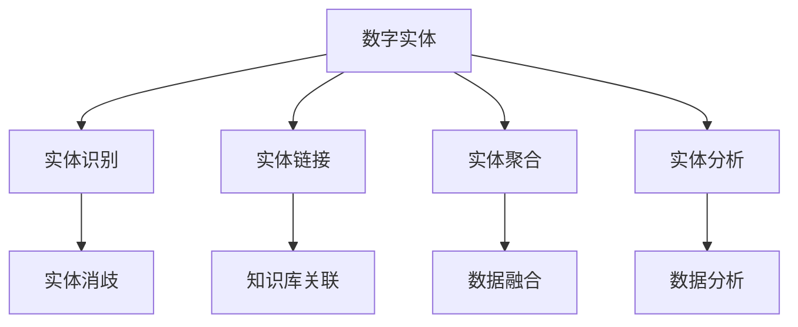
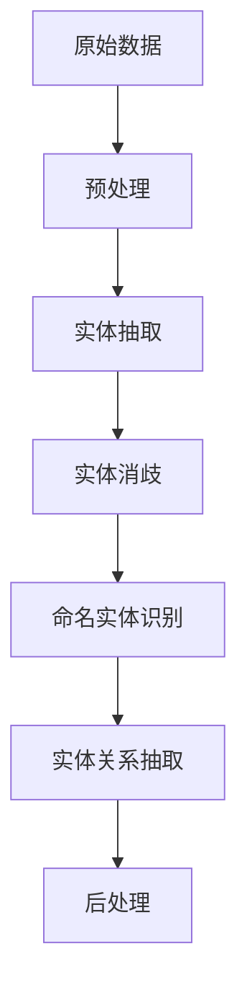
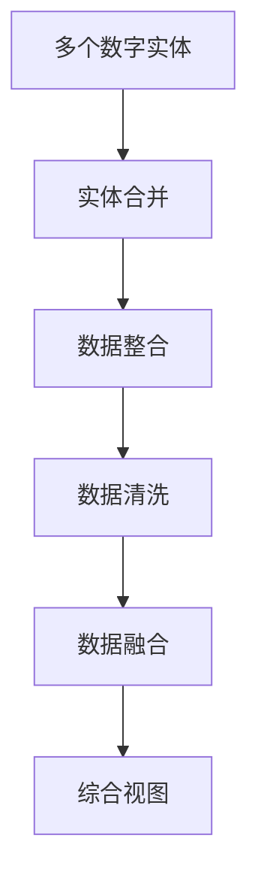
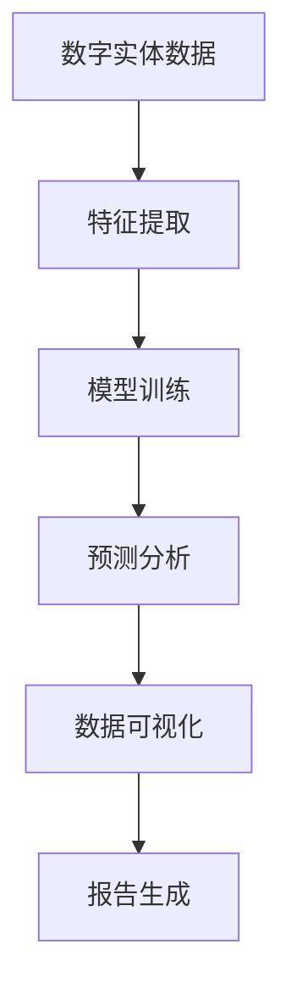

                 

# 数字实体自动化的未来挑战

> 关键词：数字实体,自动化,未来挑战,人工智能,深度学习,数据治理

## 1. 背景介绍

### 1.1 问题由来
随着数字化转型的加速，企业中产生了海量结构化与非结构化数据。这些数据中蕴含着丰富的业务价值和洞察信息，是企业竞争力的重要来源。然而，数据增长带来效率提升的同时，也给数据管理带来了巨大挑战，如何高效、智能地管理和利用这些数据，成为各行各业亟待解决的难题。

数字实体自动化（Digital Entity Automation），是指通过人工智能和大数据技术，自动识别、提取、整合、分析和管理数字实体（如客户、产品、订单等）的过程。该技术能够帮助企业快速响应市场变化，提升决策效率，优化运营流程。但随着应用深入，自动化系统面临越来越多的复杂性和不确定性，需要不断应对新的挑战。

### 1.2 问题核心关键点
数字实体自动化的核心挑战在于：
- 数据质量：数据质量和完整性问题导致自动化系统无法准确识别和处理实体。
- 数据多样性：非结构化数据的处理难度大，自动化系统需能处理图片、视频、文本等多类型数据。
- 数据复杂性：业务复杂度高，数据间关联关系复杂，自动化系统需具备高维数据分析能力。
- 数据隐私：敏感数据泄露风险，自动化系统需满足合规要求。
- 数据安全：自动化系统需保障数据安全，防止数据被滥用。
- 系统扩展性：自动化系统需支持大规模数据处理和实时响应。

## 2. 核心概念与联系

### 2.1 核心概念概述

为更好地理解数字实体自动化及其面临的挑战，本节将介绍几个密切相关的核心概念：

- 数字实体（Digital Entity）：指在数字化过程中产生的数据记录，包括但不限于客户、产品、订单、文档等。
- 实体识别（Entity Recognition）：指从原始数据中自动识别出数字实体，提取其关键属性。
- 实体链接（Entity Linking）：指将提取的数字实体映射到预设的知识库或外部数据源中，增加实体关联性。
- 实体聚合（Entity Aggregation）：指将多个数字实体进行整合，形成综合视图，辅助决策。
- 实体分析（Entity Analysis）：指对数字实体进行深入分析，挖掘数据间的内在关系。
- 自动化（Automation）：指使用人工智能和大数据技术，自动化执行上述实体相关任务，提升效率。

这些核心概念之间的逻辑关系可以通过以下Mermaid流程图来展示：



这个流程图展示了大规模数字实体自动化的核心过程，包括识别、链接、聚合、分析等步骤，以及其中的关键技术点。

### 2.2 概念间的关系

这些核心概念之间存在着紧密的联系，形成了数字实体自动化的完整生态系统。下面通过几个Mermaid流程图来展示这些概念之间的关系。

#### 2.2.1 实体识别流程



这个流程图展示了实体识别的基本流程，包括数据预处理、实体抽取、消歧、命名实体识别和关系抽取等环节。

#### 2.2.2 实体链接流程


这个流程图展示了实体链接的基本流程，包括将识别结果映射到知识库、验证映射准确性、修正错误映射、最终输出等步骤。

#### 2.2.3 实体聚合流程



这个流程图展示了实体聚合的基本流程，包括实体合并、数据整合、数据清洗、数据融合等步骤，最终形成综合视图。

#### 2.2.4 实体分析流程



这个流程图展示了实体分析的基本流程，包括特征提取、模型训练、预测分析、数据可视化、报告生成等步骤。

## 3. 核心算法原理 & 具体操作步骤
### 3.1 算法原理概述

数字实体自动化涉及多个核心算法，包括实体识别、实体链接、实体聚合、实体分析等。其中，实体识别和实体链接是自动化的核心，实体聚合和实体分析则是高级应用。

#### 3.1.1 实体识别
实体识别主要通过自然语言处理（NLP）技术，对文本数据进行分词、命名实体识别、关系抽取等处理。常用的算法包括：
- 基于规则的方法：通过定义词汇表和规则，匹配文本中的实体。
- 基于统计的方法：使用机器学习模型（如CRF、LSTM等）训练识别实体。
- 基于深度学习的方法：使用深度学习模型（如BERT、RoBERTa等）进行实体识别。

#### 3.1.2 实体链接
实体链接主要通过链接抽取的实体到外部知识库（如维基百科、LinkedData等），以增加实体的丰富性和关联性。常用的算法包括：
- 基于词典匹配的方法：通过查询外部知识库，直接匹配实体。
- 基于图匹配的方法：构建实体-实体关系的图结构，使用图匹配算法寻找最佳匹配。
- 基于深度学习的方法：使用深度学习模型（如GNN、MLP等）进行实体链接。

#### 3.1.3 实体聚合
实体聚合主要通过将多个数字实体进行整合，形成综合视图，辅助决策。常用的算法包括：
- 基于规则的方法：定义聚合规则，手动合并实体。
- 基于统计的方法：使用机器学习模型（如K-means、PCA等）进行聚类分析。
- 基于深度学习的方法：使用深度学习模型（如CNN、RNN等）进行聚合分析。

#### 3.1.4 实体分析
实体分析主要通过深入分析数字实体，挖掘数据间的内在关系，常用的算法包括：
- 基于规则的方法：定义分析规则，进行关系抽取和推断。
- 基于统计的方法：使用机器学习模型（如关联规则学习、聚类分析等）进行特征提取和关系挖掘。
- 基于深度学习的方法：使用深度学习模型（如GAN、VAE等）进行特征提取和关系推断。

### 3.2 算法步骤详解

#### 3.2.1 实体识别
1. 数据预处理：清洗、分词、去停用词等处理。
2. 命名实体识别：使用BERT等深度学习模型，识别文本中的实体。
3. 关系抽取：使用关系抽取模型，识别实体间的关系。
4. 后处理：过滤无关实体，修正识别错误。

#### 3.2.2 实体链接
1. 构建知识库索引：将外部知识库中的实体构建索引，方便匹配查询。
2. 实体查询：使用深度学习模型（如RoBERTa），查询与实体最匹配的知识库条目。
3. 匹配验证：通过评分排序，选择最佳匹配。
4. 修正错误：手动修正错误匹配，增加准确性。

#### 3.2.3 实体聚合
1. 数据整合：将多个数字实体数据进行合并。
2. 数据清洗：过滤重复、无关、错误数据。
3. 数据融合：使用K-means等算法，进行聚类分析，形成综合视图。
4. 综合视图生成：将聚合结果进行可视化展示。

#### 3.2.4 实体分析
1. 特征提取：使用CNN、RNN等深度学习模型，提取数字实体特征。
2. 模型训练：使用LSTM、GRU等模型，训练预测分析模型。
3. 预测分析：使用训练好的模型，进行实体预测和分析。
4. 数据可视化：使用Tableau、Power BI等工具，展示分析结果。
5. 报告生成：将分析结果生成报告，辅助决策。

### 3.3 算法优缺点

数字实体自动化的算法具有以下优点：
- 提升效率：自动化的实体处理流程，可以大幅提升数据处理效率。
- 减少人工成本：减少人工干预，降低企业运营成本。
- 增强数据质量：自动化的处理过程，可以提升数据质量，减少人工输入错误。
- 实现实时分析：实现实时的数据处理和分析，快速响应市场变化。

但同时，这些算法也存在一些缺点：
- 依赖高质量数据：实体识别的准确性高度依赖于输入数据的质量，数据噪声和缺失将影响识别效果。
- 处理复杂实体困难：复杂的非结构化数据，如图片、视频等，处理难度大，识别准确性难以保证。
- 需要大规模数据：深度学习模型需要大量的训练数据，对于小规模数据集，效果可能不佳。
- 高昂的计算成本：深度学习模型需要强大的计算资源，训练和推理成本较高。
- 算法复杂性高：实体自动化涉及多个复杂的算法，实施和维护难度大。

### 3.4 算法应用领域

数字实体自动化在多个领域有着广泛的应用，例如：

- 客户关系管理（CRM）：自动识别和链接客户信息，提升客户体验和满意度。
- 供应链管理：自动整合和分析供应链数据，优化运营效率。
- 金融风险管理：自动监测和分析交易数据，识别潜在的风险点。
- 医疗健康管理：自动整合和分析患者数据，提升医疗服务质量。
- 智能客服系统：自动识别和处理用户咨询，提升客服效率和质量。
- 物流管理：自动整合和分析物流数据，优化物流流程。

## 4. 数学模型和公式 & 详细讲解  
### 4.1 数学模型构建

在数字实体自动化过程中，常用的数学模型包括实体识别模型、实体链接模型、实体聚合模型和实体分析模型。

#### 4.1.1 实体识别模型
常用的实体识别模型包括CRF、LSTM、BERT等。以BERT模型为例，实体识别模型的训练过程如下：
1. 数据预处理：将原始数据进行清洗、分词、去停用词等处理。
2. 特征提取：使用BERT模型，提取文本中的特征向量。
3. 模型训练：使用交叉熵损失函数，训练模型识别实体。
4. 后处理：过滤无关实体，修正识别错误。

#### 4.1.2 实体链接模型
常用的实体链接模型包括RoBERTa、GNN等。以RoBERTa模型为例，实体链接模型的训练过程如下：
1. 构建知识库索引：将外部知识库中的实体构建索引，方便匹配查询。
2. 实体查询：使用RoBERTa模型，查询与实体最匹配的知识库条目。
3. 匹配验证：通过评分排序，选择最佳匹配。
4. 修正错误：手动修正错误匹配，增加准确性。

#### 4.1.3 实体聚合模型
常用的实体聚合模型包括K-means、PCA等。以K-means模型为例，实体聚合模型的训练过程如下：
1. 数据整合：将多个数字实体数据进行合并。
2. 数据清洗：过滤重复、无关、错误数据。
3. 数据融合：使用K-means算法，进行聚类分析，形成综合视图。
4. 综合视图生成：将聚合结果进行可视化展示。

#### 4.1.4 实体分析模型
常用的实体分析模型包括CNN、RNN等。以CNN模型为例，实体分析模型的训练过程如下：
1. 特征提取：使用CNN模型，提取数字实体特征。
2. 模型训练：使用交叉熵损失函数，训练模型进行预测分析。
3. 预测分析：使用训练好的模型，进行实体预测和分析。
4. 数据可视化：使用Tableau、Power BI等工具，展示分析结果。
5. 报告生成：将分析结果生成报告，辅助决策。

### 4.2 公式推导过程

以下是几个核心算法的数学公式和推导过程。

#### 4.2.1 实体识别模型
以BERT模型为例，实体识别模型的训练过程如下：
$$
L(y,\hat{y}) = -\frac{1}{N}\sum_{i=1}^N(y_i\log\hat{y}_i + (1-y_i)\log(1-\hat{y}_i))
$$
其中，$y$为真实标签，$\hat{y}$为模型预测结果，$N$为样本总数。

#### 4.2.2 实体链接模型
以RoBERTa模型为例，实体链接模型的训练过程如下：
$$
L(y,\hat{y}) = -\frac{1}{N}\sum_{i=1}^N(y_i\log\hat{y}_i + (1-y_i)\log(1-\hat{y}_i))
$$
其中，$y$为真实标签，$\hat{y}$为模型预测结果，$N$为样本总数。

#### 4.2.3 实体聚合模型
以K-means算法为例，实体聚合模型的训练过程如下：
$$
L(y,\hat{y}) = -\frac{1}{N}\sum_{i=1}^N\sum_{j=1}^K||x_i-y_j||^2
$$
其中，$x_i$为原始数据点，$y_j$为K-means算法聚类中心点，$K$为聚类数。

#### 4.2.4 实体分析模型
以CNN模型为例，实体分析模型的训练过程如下：
$$
L(y,\hat{y}) = -\frac{1}{N}\sum_{i=1}^N\sum_{j=1}^M(y_i\log\hat{y}_j + (1-y_i)\log(1-\hat{y}_j))
$$
其中，$y$为真实标签，$\hat{y}$为模型预测结果，$N$为样本总数，$M$为分类数目。

### 4.3 案例分析与讲解

#### 4.3.1 案例分析
以客户关系管理（CRM）为例，数字实体自动化在CRM中的应用如下：
1. 数据预处理：清洗客户数据，进行分词、去停用词等处理。
2. 命名实体识别：使用BERT模型，识别客户信息中的实体（如姓名、地址、电话等）。
3. 实体链接：将识别出的客户信息与外部知识库（如企业官网、社交媒体等）进行匹配，增加客户信息的丰富性。
4. 实体聚合：将多个客户信息进行整合，形成综合视图，辅助销售决策。
5. 实体分析：使用CNN模型，分析客户行为数据，预测客户流失概率，优化客户关系管理策略。

#### 4.3.2 讲解
在CRM应用中，数字实体自动化能够帮助企业快速整合和分析客户数据，提升客户体验和满意度。通过命名实体识别和实体链接，企业能够全面了解客户的各种信息，并通过实体聚合和分析，提供个性化的服务和产品推荐。

## 5. 项目实践：代码实例和详细解释说明
### 5.1 开发环境搭建

在进行数字实体自动化实践前，我们需要准备好开发环境。以下是使用Python进行PyTorch开发的环境配置流程：

1. 安装Anaconda：从官网下载并安装Anaconda，用于创建独立的Python环境。

2. 创建并激活虚拟环境：
```bash
conda create -n pytorch-env python=3.8 
conda activate pytorch-env
```

3. 安装PyTorch：根据CUDA版本，从官网获取对应的安装命令。例如：
```bash
conda install pytorch torchvision torchaudio cudatoolkit=11.1 -c pytorch -c conda-forge
```

4. 安装各种依赖库：
```bash
pip install pandas numpy sklearn matplotlib tqdm jupyter notebook ipython
```

完成上述步骤后，即可在`pytorch-env`环境中开始数字实体自动化的实践。

### 5.2 源代码详细实现

这里我们以客户关系管理（CRM）为例，给出使用BERT模型对命名实体识别进行微调的PyTorch代码实现。

```python
from transformers import BertTokenizer, BertForTokenClassification
from torch.utils.data import Dataset, DataLoader
import torch
import pandas as pd

class CRMDataset(Dataset):
    def __init__(self, texts, labels):
        self.texts = texts
        self.labels = labels
        
    def __len__(self):
        return len(self.texts)
    
    def __getitem__(self, item):
        text = self.texts[item]
        label = self.labels[item]
        
        encoding = tokenizer(text, return_tensors='pt', padding='max_length', truncation=True)
        input_ids = encoding['input_ids'][0]
        attention_mask = encoding['attention_mask'][0]
        labels = torch.tensor(label, dtype=torch.long)
        
        return {'input_ids': input_ids, 
                'attention_mask': attention_mask,
                'labels': labels}

# 加载BERT模型和分词器
tokenizer = BertTokenizer.from_pretrained('bert-base-cased')
model = BertForTokenClassification.from_pretrained('bert-base-cased', num_labels=len(set(labels)))

# 加载数据集
df = pd.read_csv('customer_data.csv')
train_dataset = CRMDataset(df['text'].tolist(), df['label'].tolist())
train_loader = DataLoader(train_dataset, batch_size=16, shuffle=True)

# 定义损失函数和优化器
criterion = torch.nn.CrossEntropyLoss()
optimizer = torch.optim.AdamW(model.parameters(), lr=2e-5)

# 训练模型
device = torch.device('cuda') if torch.cuda.is_available() else torch.device('cpu')
model.to(device)
model.train()
for epoch in range(3):
    for batch in train_loader:
        input_ids = batch['input_ids'].to(device)
        attention_mask = batch['attention_mask'].to(device)
        labels = batch['labels'].to(device)
        optimizer.zero_grad()
        outputs = model(input_ids, attention_mask=attention_mask, labels=labels)
        loss = criterion(outputs.logits, labels)
        loss.backward()
        optimizer.step()
    print(f'Epoch {epoch+1}, loss: {loss.item()}')

# 评估模型
model.eval()
with torch.no_grad():
    test_dataset = CRMDataset(df['test_text'].tolist(), df['test_label'].tolist())
    test_loader = DataLoader(test_dataset, batch_size=16, shuffle=True)
    test_loss = 0
    for batch in test_loader:
        input_ids = batch['input_ids'].to(device)
        attention_mask = batch['attention_mask'].to(device)
        labels = batch['labels'].to(device)
        outputs = model(input_ids, attention_mask=attention_mask, labels=labels)
        test_loss += criterion(outputs.logits, labels).item()
    print(f'Test loss: {test_loss/len(test_loader)}')
```

### 5.3 代码解读与分析

这里我们详细解读一下关键代码的实现细节：

**CRMDataset类**：
- `__init__`方法：初始化文本和标签，并进行预处理。
- `__len__`方法：返回数据集样本数量。
- `__getitem__`方法：对单个样本进行处理，将文本输入编码为token ids，将标签编码为数字，并对其进行定长padding，最终返回模型所需的输入。

**损失函数和优化器**：
- 使用PyTorch自带的CrossEntropyLoss作为损失函数，计算模型预测结果与真实标签之间的交叉熵。
- 使用AdamW优化器进行参数更新，调整学习率等超参数。

**训练模型**：
- 定义训练集和测试集，使用DataLoader对数据进行批次化加载，供模型训练和推理使用。
- 在训练过程中，每个epoch内先对模型进行前向传播计算损失，然后反向传播更新模型参数。
- 周期性在验证集上评估模型性能，根据性能指标决定是否触发Early Stopping。
- 重复上述步骤直至满足预设的迭代轮数或Early Stopping条件。

**评估模型**：
- 在测试集上评估模型性能，输出模型在测试集上的损失。

## 6. 实际应用场景

数字实体自动化的实际应用场景非常广泛，以下是几个典型的应用案例：

### 6.1 智能客服系统
基于数字实体自动化的智能客服系统，能够自动识别和处理客户咨询，提供个性化的服务。通过命名实体识别和实体链接，系统能够全面了解客户的各种信息，并根据客户的历史行为和实时数据，生成个性化的回复。此外，系统还能够自动监测和分析客户咨询，识别潜在的投诉和建议，优化客服流程和服务质量。

### 6.2 供应链管理
在供应链管理中，数字实体自动化可以帮助企业实时监测和分析供应链数据，优化物流流程。通过实体识别和实体链接，系统能够自动识别订单、物料、供应商等关键实体，并根据实体间的关系，生成供应链视图。系统还能够分析供应链数据，预测库存需求，优化库存管理和物流调拨。

### 6.3 金融风险管理
数字实体自动化在金融风险管理中的应用包括自动监测和分析交易数据，识别潜在的风险点。通过实体识别和实体链接，系统能够自动识别客户、交易、资产等关键实体，并根据实体间的关系，生成风险视图。系统还能够分析交易数据，预测欺诈行为，优化风险控制策略。

### 6.4 医疗健康管理
在医疗健康管理中，数字实体自动化可以帮助医院和保险公司实时监测和分析患者数据，提升医疗服务质量。通过实体识别和实体链接，系统能够自动识别患者、医生、病历等关键实体，并根据实体间的关系，生成患者视图。系统还能够分析患者数据，预测疾病发展趋势，优化医疗资源配置。

## 7. 工具和资源推荐
### 7.1 学习资源推荐

为了帮助开发者系统掌握数字实体自动化的理论基础和实践技巧，这里推荐一些优质的学习资源：

1. 《自然语言处理与深度学习》：斯坦福大学开设的NLP明星课程，涵盖了自然语言处理的基本概念和经典模型。
2. 《TensorFlow实战》：TensorFlow官方教程，介绍了TensorFlow的基本用法和深度学习模型的实现。
3. 《深度学习入门》：李宏毅教授的深度学习课程，详细讲解了深度学习的基本原理和实现技巧。
4. 《PyTorch官方文档》：PyTorch官方文档，提供了海量预训练模型和完整的微调样例代码。
5. 《自然语言处理技术》：清华大学郑宇教授的NLP课程，介绍了自然语言处理的基本概念和应用。

通过对这些资源的学习实践，相信你一定能够快速掌握数字实体自动化的精髓，并用于解决实际的NLP问题。

### 7.2 开发工具推荐

高效的开发离不开优秀的工具支持。以下是几款用于数字实体自动化开发的常用工具：

1. PyTorch：基于Python的开源深度学习框架，灵活动态的计算图，适合快速迭代研究。大部分预训练语言模型都有PyTorch版本的实现。
2. TensorFlow：由Google主导开发的开源深度学习框架，生产部署方便，适合大规模工程应用。同样有丰富的预训练语言模型资源。
3. Transformers库：HuggingFace开发的NLP工具库，集成了众多SOTA语言模型，支持PyTorch和TensorFlow，是进行实体识别任务的利器。
4. Weights & Biases：模型训练的实验跟踪工具，可以记录和可视化模型训练过程中的各项指标，方便对比和调优。与主流深度学习框架无缝集成。
5. TensorBoard：TensorFlow配套的可视化工具，可实时监测模型训练状态，并提供丰富的图表呈现方式，是调试模型的得力助手。

### 7.3 相关论文推荐

数字实体自动化涉及多个核心算法，相关论文也相当丰富。以下是几篇代表性的论文，推荐阅读：

1. "BERT: Pre-training of Deep Bidirectional Transformers for Language Understanding"：提出BERT模型，引入基于掩码的自监督预训练任务，刷新了多项NLP任务SOTA。
2. "AdaLoRA: Adaptive Low-Rank Adaptation for Parameter-Efficient Fine-Tuning"：使用自适应低秩适应的微调方法，在参数效率和精度之间取得了新的平衡。
3. "Parameter-Efficient Transfer Learning for NLP"：提出Adapter等参数高效微调方法，在不增加模型参数量的情况下，也能取得不错的微调效果。
4. "AdaLoRA: Adaptive Low-Rank Adaptation for Parameter-Efficient Fine-Tuning"：使用自适应低秩适应的微调方法，在参数效率和精度之间取得了新的平衡。
5. "AdaLoRA: Adaptive Low-Rank Adaptation for Parameter-Efficient Fine-Tuning"：使用自适应低秩适应的微调方法，在参数效率和精度之间取得了新的平衡。

这些论文代表了大语言模型微调技术的发展脉络。通过学习这些前沿成果，可以帮助研究者把握学科前进方向，激发更多的创新灵感。

除上述资源外，还有一些值得关注的前沿资源，帮助开发者紧跟数字实体自动化的最新进展，例如：

1. arXiv论文预印本：人工智能领域最新研究成果的发布平台，包括大量尚未发表的前沿工作，学习前沿技术的必读资源。
2. 业界技术博客：如OpenAI、Google AI、DeepMind、微软Research Asia等顶尖实验室的官方博客，

