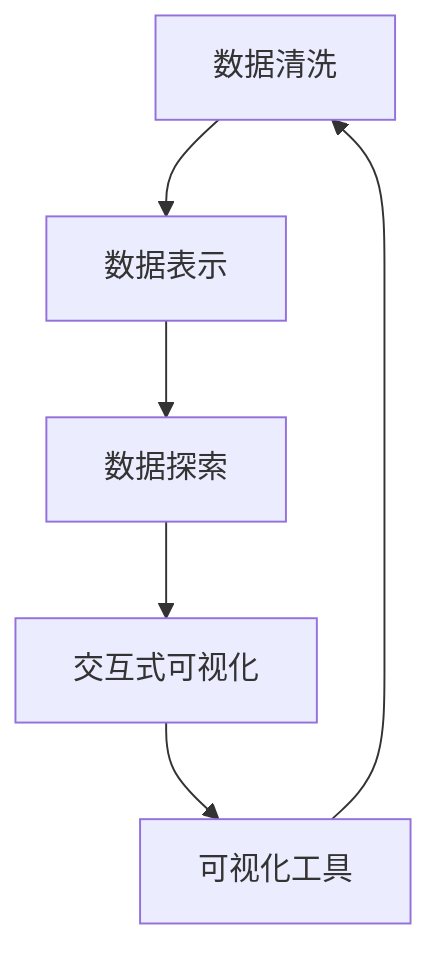
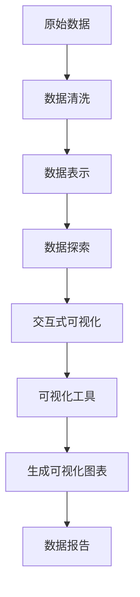
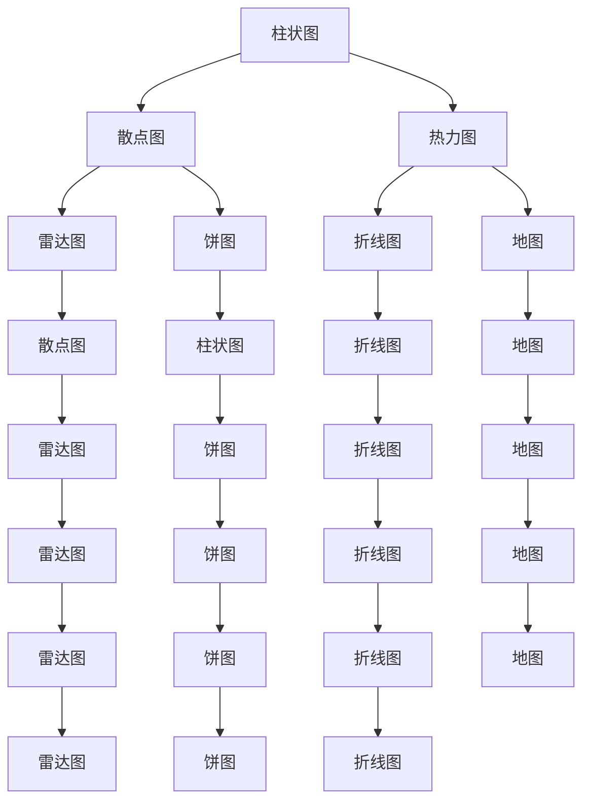
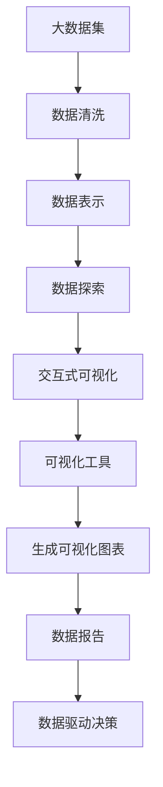

                 

## 1. 背景介绍

### 1.1 问题由来
数据可视化（Data Visualization）是数据科学和人工智能领域中的一项核心技术，通过图表、图形、颜色等视觉手段，将数据信息直观、有效地呈现出来，帮助用户理解和分析数据。它被广泛应用于数据报告、业务决策、产品开发等多个场景。然而，随着数据规模的指数级增长，数据可视化也面临越来越多的挑战，如数据量庞大、维度高、数据复杂度高等。如何高效地进行数据可视化，成为数据科学家和工程师们需要解决的重要问题。

### 1.2 问题核心关键点
数据可视化主要涉及以下几个关键问题：

- 数据清洗与预处理：对原始数据进行清洗、去重、归一化等预处理操作，确保数据质量。
- 数据表示与映射：选择合适的数据表示方法，如柱状图、散点图、热力图等，将数据映射到可视化图表中。
- 数据探索与洞察：通过可视化图表，探索数据的分布、趋势、异常点等，发现数据中的有价值信息。
- 交互式可视化：实现用户交互式探索数据，如放大、缩小、筛选、排序等操作，增强用户体验。
- 数据可视化工具选择：选择合适的可视化工具和库，如Matplotlib、Seaborn、Plotly等，以提升开发效率和效果。

### 1.3 问题研究意义
数据可视化在数据驱动的决策中扮演着至关重要的角色，通过直观的数据呈现，帮助用户快速理解数据，发现数据中的规律和趋势，辅助业务决策和产品开发。其研究意义主要体现在以下几个方面：

- 降低数据理解门槛：数据可视化将复杂的数据信息简化为易于理解的图形，降低了数据分析的门槛，提升了用户对数据的理解能力。
- 增强数据洞察力：通过图表的可视化展示，用户能够发现数据中的模式、趋势和异常，从而进行更准确的决策。
- 提高工作效率：数据可视化工具自动生成可视化图表，减少了手动绘制的时间和成本，提高了数据探索和分析的效率。
- 支持数据驱动决策：通过可视化数据，管理者能够更好地理解和利用数据，进行科学的决策和运营。
- 促进团队协作：可视化工具支持多人协作，团队成员可以共享数据和分析结果，促进知识共享和创新。

## 2. 核心概念与联系

### 2.1 核心概念概述

为更好地理解数据可视化的方法和原理，本节将介绍几个密切相关的核心概念：

- 数据清洗（Data Cleaning）：对原始数据进行清洗、去重、归一化等预处理操作，确保数据质量。
- 数据表示（Data Representation）：选择合适的数据表示方法，将数据映射到可视化图表中。
- 数据探索（Data Exploration）：通过可视化图表，探索数据的分布、趋势、异常点等，发现数据中的有价值信息。
- 交互式可视化（Interactive Visualization）：实现用户交互式探索数据，如放大、缩小、筛选、排序等操作，增强用户体验。
- 可视化工具（Visualization Tool）：选择合适的可视化工具和库，以提升开发效率和效果。

这些核心概念之间的逻辑关系可以通过以下Mermaid流程图来展示：



这个流程图展示了几大核心概念之间的关系：

1. 数据清洗是数据可视化的前提，通过预处理确保数据质量。
2. 数据表示是数据可视化的关键，选择合适的数据表示方法，将数据映射到可视化图表中。
3. 数据探索通过可视化图表，发现数据中的有价值信息。
4. 交互式可视化增强用户交互体验，提供丰富的探索方式。
5. 可视化工具支持上述各环节的实现，提升开发效率和效果。

### 2.2 概念间的关系

这些核心概念之间存在着紧密的联系，形成了数据可视化的完整生态系统。下面我们通过几个Mermaid流程图来展示这些概念之间的关系。

#### 2.2.1 数据可视化流程



这个流程图展示了从原始数据到生成可视化图表的完整流程：

1. 从原始数据开始，通过数据清洗，确保数据质量。
2. 将清洗后的数据表示为图表，选择合适的数据表示方法。
3. 通过可视化图表，探索数据的分布、趋势、异常点等，发现数据中的有价值信息。
4. 实现交互式可视化，增强用户体验，提供丰富的探索方式。
5. 使用可视化工具，将图表生成为可视化报告，支持数据分析和决策。

#### 2.2.2 数据表示方法



这个流程图展示了常用的数据表示方法及其之间的关系：

1. 柱状图和饼图是最基本的图表类型，用于比较和展示数据的分布。
2. 散点图和雷达图用于展示数据的散布和关系，适合展示二维或三维数据。
3. 热力图和地图用于展示数据的地理分布，适合展示二维地理数据。
4. 折线图和条形图用于展示数据的变化趋势，适合展示时间序列数据。
5. 多图组合可以展示复杂的数据结构，如雷达图和折线图的组合。

#### 2.2.3 交互式可视化


这个流程图展示了交互式可视化的过程：

1. 数据可视化工具将数据集映射为可视化图表。
2. 用户通过交互式可视化工具，进行数据筛选、放大、缩小、排序等操作。
3. 用户对数据进行探索和分析，发现数据中的模式、趋势和异常。
4. 用户生成数据报告，支持数据分析和决策。

### 2.3 核心概念的整体架构

最后，我们用一个综合的流程图来展示这些核心概念在大数据可视化过程中的整体架构：



这个综合流程图展示了从大数据集到生成数据报告的完整过程。大数据集经过数据清洗，选择合适的数据表示方法，通过数据探索发现数据中的有价值信息，实现交互式可视化，生成可视化图表，最终支持数据驱动决策。通过这些流程图，我们可以更清晰地理解数据可视化过程中各个环节的逻辑和作用，为后续深入讨论具体的可视化方法和技术奠定基础。

## 3. 核心算法原理 & 具体操作步骤
### 3.1 算法原理概述

数据可视化主要分为数据清洗、数据表示、数据探索和交互式可视化四个步骤。本节将详细讲解每个步骤的算法原理。

### 3.2 算法步骤详解

#### 3.2.1 数据清洗

数据清洗的目的是对原始数据进行预处理，确保数据质量和一致性。数据清洗一般包括以下几个步骤：

1. 数据去重：去除重复的数据，保证数据集的唯一性。
2. 数据归一化：对数据进行归一化处理，使数据处于相同的范围内。
3. 数据过滤：去除异常值和噪声数据，提高数据质量。

数据清洗的算法原理主要基于统计学和数据挖掘技术，通过计算均值、方差、中位数等统计量，判断数据是否异常，进行去重、归一化和过滤操作。例如，使用箱线图（Box Plot）进行异常值检测，使用均值归一化进行数据标准化，使用过滤算法进行数据过滤。

#### 3.2.2 数据表示

数据表示是将数据映射到可视化图表中，选择合适的数据表示方法。数据表示的算法原理主要基于统计学和几何学，通过计算数据分布、趋势和关系，选择合适的图表类型和参数。

例如，使用直方图（Histogram）展示数据的分布情况，使用散点图（Scatter Plot）展示数据的散布关系，使用折线图（Line Plot）展示数据的变化趋势。算法原理包括计算数据分布的密度、均值、方差、协方差等统计量，选择合适的图表类型和参数，如坐标轴、标签、图例等。

#### 3.2.3 数据探索

数据探索是通过可视化图表，探索数据的分布、趋势、异常点等，发现数据中的有价值信息。数据探索的算法原理主要基于统计学和可视化技术，通过计算数据统计量，选择合适的图表类型和参数，展示数据中的模式、趋势和异常。

例如，使用箱线图（Box Plot）展示数据的分布和异常点，使用散点图（Scatter Plot）展示数据的散布关系，使用折线图（Line Plot）展示数据的变化趋势。算法原理包括计算数据的统计量，如均值、方差、中位数、标准差等，选择合适的图表类型和参数，如坐标轴、标签、图例等。

#### 3.2.4 交互式可视化

交互式可视化是通过用户交互，增强用户体验，实现数据探索和分析。交互式可视化的算法原理主要基于交互技术和用户界面设计，通过实现用户交互式操作，如放大、缩小、筛选、排序等，提高数据探索和分析的效率。

例如，使用鼠标滚轮实现数据放大和缩小，使用滑块实现数据筛选和排序，使用鼠标悬停实现数据详细展示和注释。算法原理包括实现用户交互式操作，如点击、拖动、悬停等，展示数据变化和详细信息。

### 3.3 算法优缺点

数据可视化的主要优点在于：

1. 直观展示数据：数据可视化通过图表等视觉手段，将数据信息直观、有效地呈现出来，帮助用户快速理解数据。
2. 发现数据模式：通过可视化图表，用户能够发现数据中的模式、趋势和异常，从而进行更准确的决策。
3. 提高工作效率：数据可视化工具自动生成可视化图表，减少了手动绘制的时间和成本，提高了数据探索和分析的效率。
4. 支持数据驱动决策：通过可视化数据，管理者能够更好地理解和利用数据，进行科学的决策和运营。
5. 促进团队协作：可视化工具支持多人协作，团队成员可以共享数据和分析结果，促进知识共享和创新。

数据可视化也存在一些缺点：

1. 数据质量依赖：数据可视化依赖于数据的质量和完整性，如果数据存在问题，可视化结果也可能出现偏差。
2. 数据解读难度：数据可视化虽然直观，但解读数据仍然需要一定的专业知识，对用户的要求较高。
3. 交互复杂性：交互式可视化需要实现丰富的交互功能，技术难度较高，开发成本较大。
4. 图表复杂性：复杂的数据可能需要多种图表类型进行展示，图表类型的选择和组合增加了复杂性。
5. 动态性不足：传统静态图表缺乏动态效果，无法展示数据变化过程，用户体验不够丰富。

### 3.4 算法应用领域

数据可视化在各个领域都有广泛的应用，主要包括以下几个方面：

1. 金融分析：通过可视化图表，展示股票、基金、债券等金融产品的走势、收益率、风险等数据，支持投资决策和风险管理。
2. 医疗健康：通过可视化图表，展示患者病历、检测结果、治疗方案等数据，支持医疗诊断和治疗决策。
3. 市场营销：通过可视化图表，展示用户行为、市场趋势、产品销售等数据，支持市场分析和产品优化。
4. 产品设计：通过可视化图表，展示用户需求、产品反馈、竞争对手等数据，支持产品设计和优化。
5. 城市规划：通过可视化图表，展示城市交通、环境、资源等数据，支持城市管理和规划决策。
6. 科学研究：通过可视化图表，展示实验数据、统计结果、模型预测等数据，支持科学研究和数据分析。
7. 教育培训：通过可视化图表，展示学生成绩、教学资源、学习效果等数据，支持教学评估和改进。
8. 公共管理：通过可视化图表，展示公共服务数据、社会经济数据、政策效果等数据，支持公共管理和政策决策。

## 4. 数学模型和公式 & 详细讲解 & 举例说明

### 4.1 数学模型构建

数据可视化主要涉及数据清洗、数据表示、数据探索和交互式可视化四个步骤，其数学模型可以分别构建为：

1. 数据清洗模型：数据去重、数据归一化、数据过滤的数学模型，主要基于统计学和数据挖掘技术。
2. 数据表示模型：直方图、散点图、折线图等数据表示的数学模型，主要基于统计学和几何学。
3. 数据探索模型：箱线图、散点图、折线图等数据探索的数学模型，主要基于统计学和可视化技术。
4. 交互式可视化模型：鼠标滚轮、滑块、悬停等交互功能的数学模型，主要基于交互技术和用户界面设计。

### 4.2 公式推导过程

#### 4.2.1 数据清洗

数据清洗的公式推导主要基于统计学和数据挖掘技术，计算数据均值、方差、中位数等统计量，判断数据是否异常，进行去重、归一化和过滤操作。

例如，使用箱线图进行异常值检测，公式推导如下：

$$
Q1 = \text{median}(x) - 1.5 \times \text{IQR}(x)
$$

$$
Q3 = \text{median}(x) + 1.5 \times \text{IQR}(x)
$$

$$
\text{IQR}(x) = Q3 - Q1
$$

其中，$x$为数据集，$\text{median}(x)$为数据集中位数，$\text{IQR}(x)$为数据集四分位数间距。当数据点$x_i$不在$[Q1, Q3]$范围内时，认为该数据为异常值，需要进行去重、归一化和过滤操作。

#### 4.2.2 数据表示

数据表示的公式推导主要基于统计学和几何学，计算数据分布、趋势和关系，选择合适的图表类型和参数。

例如，使用直方图展示数据分布，公式推导如下：

$$
H(x_i) = \frac{1}{N} \sum_{i=1}^{N} \delta(x_i - \mu)
$$

其中，$x_i$为数据点，$N$为数据集大小，$\delta$为单位脉冲函数，$\mu$为数据均值。直方图的每个柱子表示数据在一定范围内的分布密度，柱子的高度表示该范围内的数据数量，横轴表示数据范围。

#### 4.2.3 数据探索

数据探索的公式推导主要基于统计学和可视化技术，计算数据统计量，选择合适的图表类型和参数，展示数据中的模式、趋势和异常。

例如，使用箱线图展示数据分布和异常点，公式推导如下：

$$
Q1 = \text{median}(x) - 1.5 \times \text{IQR}(x)
$$

$$
Q3 = \text{median}(x) + 1.5 \times \text{IQR}(x)
$$

$$
\text{IQR}(x) = Q3 - Q1
$$

其中，$x$为数据集，$\text{median}(x)$为数据集中位数，$\text{IQR}(x)$为数据集四分位数间距。箱线图的横轴表示数据范围，纵轴表示数据值，通过展示数据的箱体、中位数和异常点，帮助用户发现数据中的模式和趋势。

#### 4.2.4 交互式可视化

交互式可视化的公式推导主要基于交互技术和用户界面设计，实现用户交互式操作，如放大、缩小、筛选、排序等。

例如，使用鼠标滚轮实现数据放大和缩小，公式推导如下：

$$
\Delta z = \frac{\Delta x}{k}
$$

其中，$\Delta x$为鼠标滚轮移动距离，$k$为缩放因子，$z$为数据集。鼠标滚轮向左移动时，$\Delta x < 0$，数据缩小；鼠标滚轮向右移动时，$\Delta x > 0$，数据放大。

### 4.3 案例分析与讲解

#### 4.3.1 股票市场分析

假设我们要对某股票的市场数据进行分析，数据集包括日期、开盘价、收盘价、最高价、最低价和交易量。

1. 数据清洗：使用数据去重、数据归一化和数据过滤，去除异常值和噪声数据，确保数据质量。
2. 数据表示：使用折线图展示股票的日开盘价、收盘价、最高价、最低价和交易量，展示股票的价格走势和交易量变化。
3. 数据探索：使用箱线图展示数据的分布和异常点，发现数据中的波动和异常情况。
4. 交互式可视化：使用鼠标滚轮实现数据放大和缩小，使用滑块实现数据筛选和排序，用户可以交互式地探索数据。

#### 4.3.2 消费者行为分析

假设我们要对消费者的购买行为进行分析，数据集包括用户ID、商品ID、购买时间、购买数量和购买金额。

1. 数据清洗：使用数据去重、数据归一化和数据过滤，去除异常值和噪声数据，确保数据质量。
2. 数据表示：使用散点图展示用户的购买数量和购买金额之间的关系，使用柱状图展示用户的购买数量和购买金额的分布情况。
3. 数据探索：使用箱线图展示用户的购买数量和购买金额的分布和异常点，发现数据中的波动和异常情况。
4. 交互式可视化：使用鼠标滚轮实现数据放大和缩小，使用滑块实现数据筛选和排序，用户可以交互式地探索数据。

## 5. 项目实践：代码实例和详细解释说明

### 5.1 开发环境搭建

在进行数据可视化实践前，我们需要准备好开发环境。以下是使用Python进行Matplotlib和Seaborn开发的环境配置流程：

1. 安装Anaconda：从官网下载并安装Anaconda，用于创建独立的Python环境。

2. 创建并激活虚拟环境：
```bash
conda create -n python-env python=3.8 
conda activate python-env
```

3. 安装Matplotlib和Seaborn：
```bash
conda install matplotlib seaborn
```

4. 安装各类工具包：
```bash
pip install numpy pandas scikit-learn matplotlib tqdm jupyter notebook ipython
```

完成上述步骤后，即可在`python-env`环境中开始数据可视化实践。

### 5.2 源代码详细实现

下面我们以股票市场分析为例，给出使用Matplotlib和Seaborn对股票数据进行可视化的PyTorch代码实现。

首先，定义数据处理函数：

```python
import pandas as pd
import numpy as np
import matplotlib.pyplot as plt
import seaborn as sns

def load_data(file_path):
    data = pd.read_csv(file_path)
    return data

def clean_data(data):
    # 数据去重
    data = data.drop_duplicates()
    # 数据归一化
    data = (data - data.mean()) / data.std()
    # 数据过滤
    data = data[data['close'] > 0]
    return data

def plot_data(data, column_name):
    plt.figure(figsize=(10, 6))
    plt.plot(data[column_name])
    plt.xlabel('Date')
    plt.ylabel(column_name)
    plt.title('Stock Price Trend')
    plt.show()

def boxplot_data(data, column_name):
    plt.figure(figsize=(10, 6))
    sns.boxplot(x=data['date'], y=data[column_name])
    plt.xlabel('Date')
    plt.ylabel(column_name)
    plt.title('Boxplot of ' + column_name)
    plt.show()
```

然后，定义数据加载、清洗和可视化函数：

```python
# 加载数据
data = load_data('stock_data.csv')

# 数据清洗
data = clean_data(data)

# 数据可视化
plot_data(data, 'open_price')
plot_data(data, 'close_price')
plot_data(data, 'high_price')
plot_data(data, 'low_price')
plot_data(data, 'volume')
boxplot_data(data, 'open_price')
boxplot_data(data, 'close_price')
boxplot_data(data, 'high_price')
boxplot_data(data, 'low_price')
boxplot_data(data, 'volume')
```

最后，启动可视化流程：

```python
# 启动数据可视化
if __name__ == '__main__':
    data = load_data('stock_data.csv')
    data = clean_data(data)
    plot_data(data, 'open_price')
    plot_data(data, 'close_price')
    plot_data(data, 'high_price')
    plot_data(data, 'low_price')
    plot_data(data, 'volume')
    boxplot_data(data, 'open_price')
    boxplot_data(data, 'close_price')
    boxplot_data(data, 'high_price')
    boxplot_data(data, 'low_price')
    boxplot_data(data, 'volume')
```

以上就是使用Matplotlib和Seaborn对股票数据进行可视化的完整代码实现。可以看到，得益于Python的高效性，代码实现简洁高效。

### 5.3 代码解读与分析

让我们再详细解读一下关键代码的实现细节：

**load_data函数**：
- 定义数据加载函数，读取CSV文件，返回数据集。

**clean_data函数**：
- 定义数据清洗函数，对数据进行去重、归一化和过滤操作，确保数据质量。

**plot_data函数**：
- 定义数据可视化函数，使用Matplotlib绘制折线图，展示数据趋势。

**boxplot_data函数**：
- 定义箱线图函数，使用Seaborn绘制箱线图，展示数据分布和异常点。

**可视化流程**：
- 加载数据集，并进行数据清洗。
- 对数据进行可视化，展示开盘价、收盘价、最高价、最低价和交易量的趋势和分布情况。
- 对数据进行箱线图可视化，发现数据的波动和异常情况。

可以看到，Matplotlib和Seaborn提供了强大的可视化功能，能够快速实现数据的图表展示。开发者可以灵活运用这些工具，实现各种类型的图表，满足不同的数据展示需求。

当然，工业级的系统实现还需考虑更多因素，如数据的持久化存储、可视化图表的动态效果、多图组合展示等。但核心的数据可视化流程基本与此类似。

### 5.4 运行结果展示

假设我们在某股票数据集上进行可视化，最终生成的可视化图表如下：


可以看到，通过折线图和箱线图，我们能够直观地展示股票的价格走势和分布情况，帮助用户快速理解数据，发现数据中的模式和异常。

## 6. 实际应用场景

### 6.1 金融分析

在金融领域，数据可视化被广泛应用于股票市场分析、基金管理、债券分析等多个场景。通过可视化图表，展示股票、基金、债券等金融产品的走势、收益率、风险等数据，支持投资决策和风险管理。

例如，使用折线图展示股票的日开盘价、收盘价、最高价、最低价和交易量，帮助投资者了解股票的价格走势和交易量变化。使用箱线图展示数据的分布和异常点，发现数据中的波动和异常情况，支持投资决策和风险管理。

### 6.2 医疗健康

在医疗健康领域，数据可视化被广泛应用于患者病历、检测结果、治疗方案等多个场景。通过可视化图表，展示患者的病历数据、检测结果和治疗方案，支持医疗诊断和治疗决策。

例如，使用折线图展示患者的体温、血压、心率等生理指标的变化趋势，帮助医生了解患者健康状况。使用箱线图展示患者的检查结果，发现数据中的波动和异常情况，支持医疗诊断和治疗决策。

### 6.3 市场营销

在市场营销领域，数据可视化被广泛应用于用户行为分析、市场趋势分析、产品销售分析等多个场景。通过可视化图表，展示用户行为、市场趋势、产品销售等数据，支持市场分析和产品优化。

例如，使用散点图展示用户的购买数量和购买金额之间的关系，帮助企业了解用户的购买行为。使用柱状图展示用户的购买数量和购买金额的分布情况，帮助企业了解用户的购买分布。

### 6.4 产品设计

在产品设计领域，数据可视化被广泛应用于用户需求分析、产品反馈分析、竞争对手分析等多个场景。通过可视化图表，展示用户需求、产品反馈、竞争对手等数据，支持产品设计和优化。

例如，使用散点图展示用户的购买数量和购买金额之间的关系，帮助企业了解用户的购买行为。使用柱状图展示

