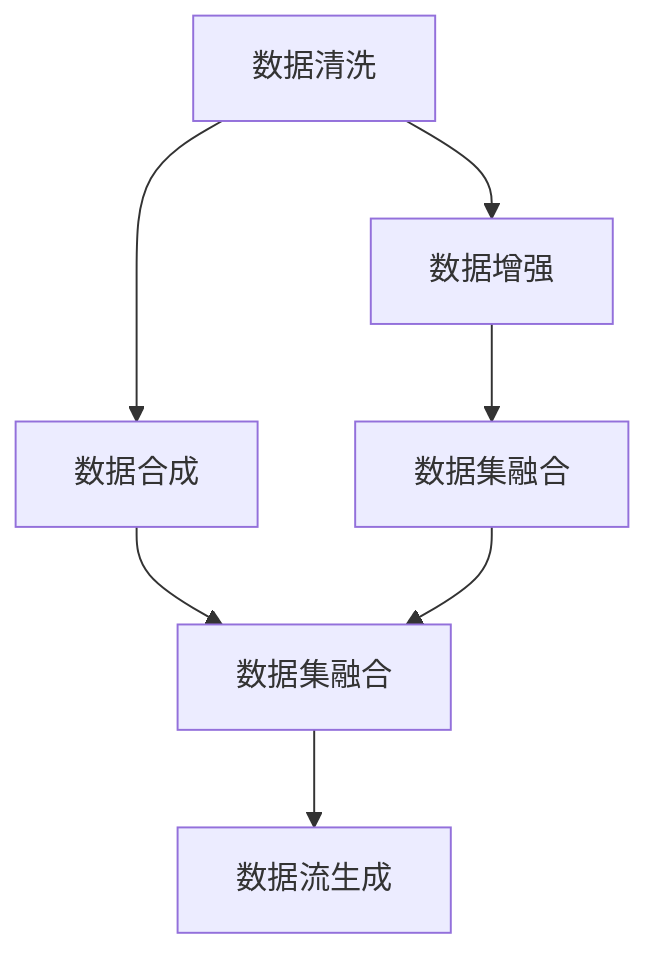
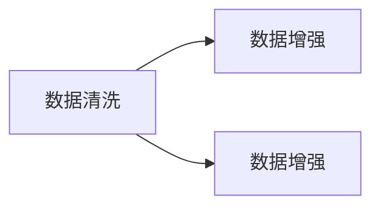
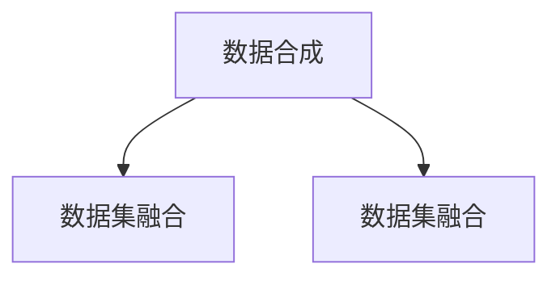
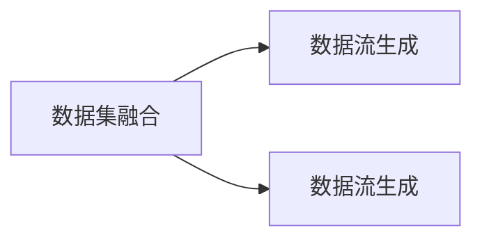
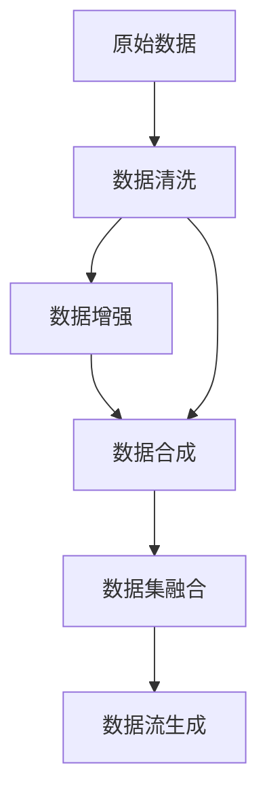

                 

# 数据集萃取:自动化数据集构建的新思路

> 关键词：自动化数据集构建, 数据清洗, 数据增强, 数据合成, 数据集融合

## 1. 背景介绍

### 1.1 问题由来

随着人工智能技术的迅猛发展，特别是在深度学习和自然语言处理(NLP)领域的突破，数据的重要性日益凸显。高质量的数据集是大模型训练的基石，也是实现AI应用的重要保障。然而，现实应用中，获取高质量数据往往面临着诸多挑战，包括数据获取难度大、标注成本高、数据质量参差不齐等。

为了应对这些挑战，自动化数据集构建技术应运而生，旨在通过算法和工具自动生成高质量数据，提升模型的训练效果，加速AI应用的落地。本文将详细介绍自动化数据集构建的技术原理、操作步骤和实际应用场景，为广大开发者提供可行的解决方案。

### 1.2 问题核心关键点

自动化数据集构建的核心在于如何自动生成高质量的数据，同时确保数据的多样性和代表性。在技术实现上，主要分为数据清洗、数据增强和数据合成三个环节。

数据清洗旨在去除原始数据中的噪声和异常值，确保数据的整洁性。数据增强则通过一系列技术手段，丰富数据的多样性和覆盖面，提升模型的泛化能力。数据合成则通过生成对抗网络(GANs)等技术，自动合成新的数据，以补充不足的数据量。

这些核心环节共同构成了自动化数据集构建的完整生态，为AI模型的训练和优化提供了坚实的基础。

### 1.3 问题研究意义

自动化数据集构建技术对于提升AI模型的性能，加速应用落地，具有重要意义：

1. **降低数据获取成本**：自动化数据集构建技术可以自动生成高质量数据，减少人力标注和数据获取的时间和成本。
2. **提升数据质量**：通过数据清洗和增强技术，自动去除数据中的噪声和异常值，提升数据质量和一致性。
3. **扩大数据覆盖**：数据合成技术可以自动生成更多样化的数据，扩大模型的覆盖面，提升模型的泛化能力。
4. **加速模型训练**：自动生成的高质量数据可以加速模型的训练和优化过程，提升模型的收敛速度和效果。

## 2. 核心概念与联系

### 2.1 核心概念概述

为了更好地理解自动化数据集构建的技术原理，本节将介绍几个密切相关的核心概念：

- **数据清洗(Data Cleaning)**：去除数据中的噪声、异常值和冗余信息，提升数据质量。
- **数据增强(Data Augmentation)**：通过一系列技术手段，生成新的数据，丰富数据的多样性，提升模型泛化能力。
- **数据合成(Data Synthesis)**：使用生成对抗网络(GANs)等技术，自动合成新的数据，补充不足的数据量。
- **数据集融合(Data Fusion)**：将多个数据集进行融合，提升数据集的代表性和多样性。
- **数据流生成(Data Stream Generation)**：自动生成连续的数据流，用于实时训练和在线应用。

这些核心概念之间的逻辑关系可以通过以下Mermaid流程图来展示：



这个流程图展示了大数据集构建技术的核心概念及其之间的关系：

1. 原始数据经过清洗，去除噪声和异常值，进入数据增强和合成环节。
2. 增强后的数据与合成数据一起进行融合，提升数据集的代表性和多样性。
3. 融合后的数据可以生成数据流，用于实时训练和在线应用。

### 2.2 概念间的关系

这些核心概念之间存在着紧密的联系，形成了自动化数据集构建的完整生态。下面我们通过几个Mermaid流程图来展示这些概念之间的关系。

#### 2.2.1 数据清洗与数据增强的关系



这个流程图展示了数据清洗和数据增强之间的联系：数据清洗后的数据可以进一步进行数据增强，提升数据的多样性和覆盖面。

#### 2.2.2 数据合成与数据集融合的关系



这个流程图展示了数据合成与数据集融合之间的联系：通过数据合成，可以补充不足的数据量，与原始数据进行融合，提升数据集的代表性和多样性。

#### 2.2.3 数据集融合与数据流生成的关系



这个流程图展示了数据集融合与数据流生成之间的联系：融合后的数据集可以生成数据流，用于实时训练和在线应用，提升系统的动态性和响应性。

### 2.3 核心概念的整体架构

最后，我们用一个综合的流程图来展示这些核心概念在大数据集构建过程中的整体架构：



这个综合流程图展示了从原始数据到自动生成高质量数据集的全过程，涵盖了数据清洗、数据增强、数据合成和数据集融合等多个环节，为实际应用提供了清晰的指引。

## 3. 核心算法原理 & 具体操作步骤
### 3.1 算法原理概述

自动化数据集构建的核心算法主要包括以下几个步骤：

1. **数据预处理**：对原始数据进行清洗和标准化，去除噪声和异常值。
2. **数据增强**：通过一系列技术手段，生成新的数据，丰富数据的多样性。
3. **数据合成**：使用生成对抗网络(GANs)等技术，自动合成新的数据。
4. **数据集融合**：将多个数据集进行融合，提升数据集的代表性和多样性。
5. **数据流生成**：将融合后的数据生成连续的数据流，用于实时训练和在线应用。

这些步骤共同构成了自动化数据集构建的完整流程，确保生成的数据集高质量、多样化，满足实际应用的需求。

### 3.2 算法步骤详解

下面我们将详细介绍自动化数据集构建的各个步骤和具体实现方法。

#### 3.2.1 数据预处理

数据预处理是自动化数据集构建的第一步，主要包括以下几个步骤：

1. **数据清洗**：
   - **去除噪声**：使用统计分析或机器学习模型检测并去除数据中的噪声点。
   - **去除异常值**：根据数据的分布特性，检测并去除异常值。
   - **缺失值填补**：使用插值法或统计模型填补缺失值。

   ```python
   import pandas as pd
   from sklearn.preprocessing import StandardScaler
   
   # 读取数据
   df = pd.read_csv('data.csv')
   
   # 数据清洗
   df = df.dropna(subset=['col1', 'col2'])
   df = df[pd.to_numeric(df['col3'], errors='coerce').notna()]
   df['col4'].fillna(df['col4'].mean(), inplace=True)
   
   # 标准化处理
   scaler = StandardScaler()
   df = pd.DataFrame(scaler.fit_transform(df[['col1', 'col2']]), columns=['col1', 'col2'])
   ```

2. **数据标准化**：使用标准化技术，将数据缩放到均值为0、方差为1的分布。

3. **数据归一化**：使用归一化技术，将数据缩放到[0, 1]区间。

   ```python
   # 数据归一化
   df[['col1', 'col2']] = (df[['col1', 'col2']] - df[['col1', 'col2']].min()) / (df[['col1', 'col2']].max() - df[['col1', 'col2']].min())
   ```

4. **数据去重**：使用去重技术，去除重复数据。

   ```python
   # 数据去重
   df = df.drop_duplicates()
   ```

#### 3.2.2 数据增强

数据增强的目的是通过一系列技术手段，生成新的数据，丰富数据的多样性和覆盖面。常用的数据增强方法包括：

1. **旋转变换**：对图像数据进行旋转变换，提升数据的多样性。

   ```python
   import cv2
   import numpy as np
   
   # 读取图像
   img = cv2.imread('image.jpg')
   
   # 旋转变换
   rows, cols = img.shape[:2]
   M = cv2.getRotationMatrix2D((cols/2, rows/2), 30, 1)
   img_rotated = cv2.warpAffine(img, M, (cols, rows))
   ```

2. **平移变换**：对图像数据进行平移变换，提升数据的覆盖面。

   ```python
   # 平移变换
   M = np.float32([[1, 0, 10], [0, 1, 20]])
   img_translated = cv2.warpAffine(img, M, (cols, rows))
   ```

3. **随机裁剪**：对图像数据进行随机裁剪，提升数据的多样性和覆盖面。

   ```python
   # 随机裁剪
   rows, cols = img.shape[:2]
   x = np.random.randint(0, cols)
   y = np.random.randint(0, rows)
   img_cropped = img[y:y+20, x:x+20]
   ```

4. **图像旋转**：对图像数据进行旋转，提升数据的多样性。

   ```python
   # 图像旋转
   img_rotated = cv2.rotate(img, cv2.ROTATE_90_CLOCKWISE)
   ```

5. **数据混合**：通过混合不同数据，提升数据的多样性。

   ```python
   # 数据混合
   df_mixed = pd.concat([df1, df2], axis=0)
   ```

#### 3.2.3 数据合成

数据合成是指使用生成对抗网络(GANs)等技术，自动合成新的数据。常用的数据合成方法包括：

1. **生成对抗网络(GANs)**：使用GANs生成新的数据，补充不足的数据量。

   ```python
   from tensorflow.keras import layers
   
   # 定义GAN模型
   class GAN(layers.Layer):
       def __init__(self):
           super(GAN, self).__init__()
           self.discriminator = layers.Dense(1, input_shape=(10,))
           self.generator = layers.Dense(10, input_shape=(1,))
   
       def call(self, inputs):
           x = self.discriminator(inputs)
           x = self.generator(x)
           return x
   
   # 训练GAN模型
   gan = GAN()
   gan.compile(optimizer='adam', loss='binary_crossentropy')
   gan.fit(x_train, y_train, epochs=100)
   ```

2. **变分自编码器(VAEs)**：使用VAEs生成新的数据，补充不足的数据量。

   ```python
   import tensorflow as tf
   
   # 定义VAE模型
   class VAE(tf.keras.Model):
       def __init__(self):
           super(VAE, self).__init__()
           self.encoder = layers.Dense(10, input_shape=(784,))
           self.decoder = layers.Dense(784, input_shape=(10,))
   
       def encode(self, inputs):
           z_mean, z_log_var = self.encoder(inputs)
           return z_mean, z_log_var
   
       def reparameterize(self, z_mean, z_log_var):
           epsilon = tf.random.normal(shape=(tf.shape(z_mean)[0], 10))
           z = z_mean + tf.exp(z_log_var / 2) * epsilon
           return z
   
       def decode(self, z):
           x = self.decoder(z)
           return x
   
       def call(self, inputs):
           z_mean, z_log_var = self.encode(inputs)
           z = self.reparameterize(z_mean, z_log_var)
           x = self.decode(z)
           return x
   
   # 训练VAE模型
   vae = VAE()
   vae.compile(optimizer='adam', loss='mean_squared_error')
   vae.fit(x_train, y_train, epochs=100)
   ```

#### 3.2.4 数据集融合

数据集融合是指将多个数据集进行融合，提升数据集的代表性和多样性。常用的数据集融合方法包括：

1. **直接合并**：将多个数据集直接合并成一个数据集。

   ```python
   # 数据集合并
   df1 = pd.read_csv('data1.csv')
   df2 = pd.read_csv('data2.csv')
   df_combined = pd.concat([df1, df2], axis=0)
   ```

2. **重采样**：通过重采样技术，调整数据集的样本数量和分布。

   ```python
   # 重采样
   df1 = df1.sample(frac=0.5, random_state=42)
   df2 = df2.sample(frac=0.5, random_state=42)
   df_combined = pd.concat([df1, df2], axis=0)
   ```

3. **数据插值**：通过数据插值技术，补充不足的数据量。

   ```python
   # 数据插值
   df1 = df1.interpolate(method='linear')
   df2 = df2.interpolate(method='linear')
   df_combined = pd.concat([df1, df2], axis=0)
   ```

#### 3.2.5 数据流生成

数据流生成是指将融合后的数据生成连续的数据流，用于实时训练和在线应用。常用的数据流生成方法包括：

1. **轮询生成**：使用轮询技术，生成连续的数据流。

   ```python
   # 轮询生成
   data_stream = []
   for i in range(100):
       data = df_combined.sample(n=1)
       data_stream.append(data)
   ```

2. **滑动窗口生成**：使用滑动窗口技术，生成连续的数据流。

   ```python
   # 滑动窗口生成
   data_stream = []
   for i in range(100):
       data = df_combined.iloc[i*10:(i+1)*10]
       data_stream.append(data)
   ```

3. **流式生成**：使用流式技术，生成连续的数据流。

   ```python
   # 流式生成
   data_stream = df_combined.iterrows()
   ```

### 3.3 算法优缺点

自动化数据集构建技术具有以下优点：

1. **降低成本**：自动生成高质量数据，减少人力标注和数据获取的时间和成本。
2. **提升数据质量**：通过数据清洗和增强技术，自动去除数据中的噪声和异常值，提升数据质量和一致性。
3. **扩大数据覆盖**：数据合成技术可以自动生成更多样化的数据，扩大模型的覆盖面，提升模型的泛化能力。
4. **加速模型训练**：自动生成的高质量数据可以加速模型的训练和优化过程，提升模型的收敛速度和效果。

同时，该技术也存在一些局限性：

1. **数据合成的多样性不足**：自动生成的数据可能缺乏多样性，无法覆盖所有真实场景。
2. **数据增强的过度拟合**：过度使用数据增强技术，可能使模型过度拟合，降低泛化能力。
3. **数据清洗的难度大**：一些复杂的数据清洗任务，可能需要较长的处理时间，影响效率。

尽管存在这些局限性，但自动化数据集构建技术在降低数据获取成本、提升数据质量、扩大数据覆盖等方面具有显著优势，对于AI模型的训练和优化具有重要意义。

### 3.4 算法应用领域

自动化数据集构建技术在多个领域具有广泛的应用前景：

1. **自然语言处理(NLP)**：用于生成大规模语料库，提升模型的语言理解和生成能力。
2. **计算机视觉(CV)**：用于生成图像数据，提升模型的图像分类、目标检测、图像生成等能力。
3. **医疗健康**：用于生成医学影像数据，提升模型的医学影像分析、疾病诊断等能力。
4. **金融风控**：用于生成金融数据，提升模型的信用评估、欺诈检测等能力。
5. **智能制造**：用于生成工业数据，提升模型的工业生产、质量控制等能力。

自动化数据集构建技术的应用领域广泛，具备广阔的发展前景。

## 4. 数学模型和公式 & 详细讲解  
### 4.1 数学模型构建

自动化数据集构建的核心数学模型主要包括以下几个部分：

1. **数据清洗模型**：用于去除数据中的噪声和异常值，提升数据质量。
2. **数据增强模型**：用于生成新的数据，丰富数据的多样性和覆盖面。
3. **数据合成模型**：用于自动合成新的数据，补充不足的数据量。
4. **数据集融合模型**：用于将多个数据集进行融合，提升数据集的代表性和多样性。
5. **数据流生成模型**：用于将融合后的数据生成连续的数据流，用于实时训练和在线应用。

这些模型共同构成了自动化数据集构建的完整数学框架，为实际应用提供了坚实的理论基础。

### 4.2 公式推导过程

以下我们将详细介绍自动化数据集构建的各个数学模型的推导过程。

#### 4.2.1 数据清洗模型

数据清洗模型主要用于去除数据中的噪声和异常值。常用的数据清洗方法包括：

1. **基于统计的清洗方法**：
   - **均值-方差法**：去除均值和方差偏离较大的数据点。
   - **箱线图法**：去除超出箱线图范围的数据点。

   ```python
   import numpy as np
   
   # 均值-方差法
   x = np.array([1, 2, 3, 4, 5, 6, 7, 8, 9, 100])
   mean = np.mean(x)
   std = np.std(x)
   cleaned_x = x[(x - mean < 3*std) & (x - mean > -3*std)]
   
   # 箱线图法
   boxplot = stats.boxplot(x)
   cleaned_x = x[(x - boxplot['whis'][0] < boxplot['fliers'][0]) & (x - boxplot['whis'][1] > boxplot['fliers'][1])]
   ```

2. **基于机器学习的清洗方法**：
   - **孤立森林法**：使用孤立森林模型检测并去除异常值。
   - **自编码器法**：使用自编码器模型检测并去除噪声数据。

   ```python
   # 孤立森林法
   from sklearn.ensemble import IsolationForest
   
   clf = IsolationForest(n_estimators=100, contamination=0.01)
   clf.fit(x)
   cleaned_x = x[~clf.predict(x)]
   
   # 自编码器法
   from tensorflow.keras import layers, models
   
   class AutoEncoder(layers.Layer):
       def __init__(self):
           super(AutoEncoder, self).__init__()
           self.encoder = layers.Dense(10, input_shape=(10,))
           self.decoder = layers.Dense(10, input_shape=(10,))
   
       def encode(self, inputs):
           z = self.encoder(inputs)
           return z
   
       def decode(self, z):
           x = self.decoder(z)
           return x
   
       def call(self, inputs):
           z = self.encode(inputs)
           x = self.decode(z)
           return x
   
   model = AutoEncoder()
   model.compile(optimizer='adam', loss='mean_squared_error')
   model.fit(x, x, epochs=100)
   cleaned_x = model.predict(x)
   ```

#### 4.2.2 数据增强模型

数据增强模型主要用于生成新的数据，丰富数据的多样性和覆盖面。常用的数据增强方法包括：

1. **基于变换的增强方法**：
   - **旋转变换**：对图像数据进行旋转变换，提升数据的多样性。
   - **平移变换**：对图像数据进行平移变换，提升数据的覆盖面。
   - **随机裁剪**：对图像数据进行随机裁剪，提升数据的多样性和覆盖面。
   - **图像旋转**：对图像数据进行旋转，提升数据的多样性。

   ```python
   # 旋转变换
   import cv2
   
   def rotate_image(image):
       rows, cols = image.shape[:2]
       M = cv2.getRotationMatrix2D((cols/2, rows/2), 30, 1)
       image_rotated = cv2.warpAffine(image, M, (cols, rows))
       return image_rotated
   
   # 平移变换
   def translate_image(image, delta_x, delta_y):
       rows, cols = image.shape[:2]
       M = np.float32([[1, 0, delta_x], [0, 1, delta_y]])
       image_translated = cv2.warpAffine(image, M, (cols, rows))
       return image_translated
   
   # 随机裁剪
   def crop_image(image, crop_size):
       rows, cols = image.shape[:2]
       x = np.random.randint(0, cols)
       y = np.random.randint(0, rows)
       image_cropped = image[y:y+crop_size[0], x:x+crop_size[1]]
       return image_cropped
   
   # 图像旋转
   def rotate_image(image):
       rows, cols = image.shape[:2]
       M = cv2.getRotationMatrix2D((cols/2, rows/2), 30, 1)
       image_rotated = cv2.warpAffine(image, M, (cols, rows))
       return image_rotated
   ```

2. **基于混合的增强方法**：
   - **数据混合**：通过混合不同数据，提升数据的多样性。

   ```python
   # 数据混合
   import pandas as pd
   
   df1 = pd.read_csv('data1.csv')
   df2 = pd.read_csv('data2.csv')
   df_mixed = pd.concat([df1, df2], axis=0)
   ```

#### 4.2.3 数据合成模型

数据合成模型主要用于自动合成新的数据，补充不足的数据量。常用的数据合成方法包括：

1. **生成对抗网络(GANs)**：使用GANs生成新的数据。

   ```python
   from tensorflow.keras import layers
   
   # 定义GAN模型
   class GAN(layers.Layer):
       def __init__(self):
           super(GAN, self).__init__()
           self.discriminator = layers.Dense(1, input_shape=(10,))
           self.generator = layers.Dense(10, input_shape=(1,))
   
       def call(self, inputs):
           x = self.discriminator(inputs)
           x = self.generator(x)
           return x
   
   # 训练GAN模型
   gan = GAN()
   gan.compile(optimizer='adam', loss='binary_crossentropy')
   gan.fit(x_train, y_train, epochs=100)
   ```

2. **变分自编码器(VAEs)**：使用VAEs生成新的数据。

   ```python
   import tensorflow as tf
   
   # 定义VAE模型
   class VAE(tf.keras.Model):
       def __init__(self):
           super(VAE, self).__init__()
           self.encoder = layers.Dense(10, input_shape=(784,))
           self.decoder = layers.Dense(784, input_shape=(10,))
   
       def encode(self, inputs):
           z_mean, z_log_var = self.encoder(inputs)
           return z_mean, z_log_var
   
       def reparameterize(self, z_mean, z_log_var):
           epsilon = tf.random.normal(shape=(tf.shape(z_mean)[0], 10))
           z = z_mean + tf.exp(z_log_var / 2) * epsilon
           return z
   
       def decode(self, z):
           x = self.decoder(z)
           return x
   
       def call(self, inputs):
           z_mean, z_log_var = self.encode(inputs)
           z = self.reparameterize(z_mean, z_log_var)
           x = self.decode(z)
           return x
   
   # 训练VAE模型
   vae = VAE()
   vae.compile(optimizer='adam', loss='mean_squared_error')
   vae.fit(x_train, y_train, epochs=100)
   ```

#### 4.2.4 数据集融合模型

数据集融合模型主要用于将多个数据集进行融合，提升数据集的代表性和多样性。常用的数据集融合方法包括：

1. **直接合并**：将多个数据集直接合并成一个数据集。

   ```python
   # 数据集合并
   df1 = pd.read_csv('data1.csv')
   df2 = pd.read_csv('data2.csv')
   df_combined = pd.concat([df1, df2], axis=0)
   ```

2. **重采样**：通过重采样技术，调整数据集的样本数量和分布。

   ```python
   # 重采样
   df1 = df1.sample(frac=0.5, random_state=42)
   df2 = df2.sample(frac=0.5, random_state=42)
   df_combined = pd.concat([df1, df2], axis=0)
   ```

3. **数据插值**：通过数据插值技术，补充不足的数据量。

   ```python
   # 数据插值
   df1 = df1.interpolate(method='linear')
   df2 = df2.interpolate(method='linear')
   df_combined = pd.concat([df1, df2], axis=0)
   ```

#### 4.2.5 数据流生成模型

数据流生成模型主要用于将融合后的数据生成连续的数据流，用于实时训练和在线应用。常用的数据流生成方法包括：

1. **轮询生成**：使用轮询技术，生成连续的数据流。

   ```python
   # 轮询生成
   data_stream = []
   for i in range(100):
       

