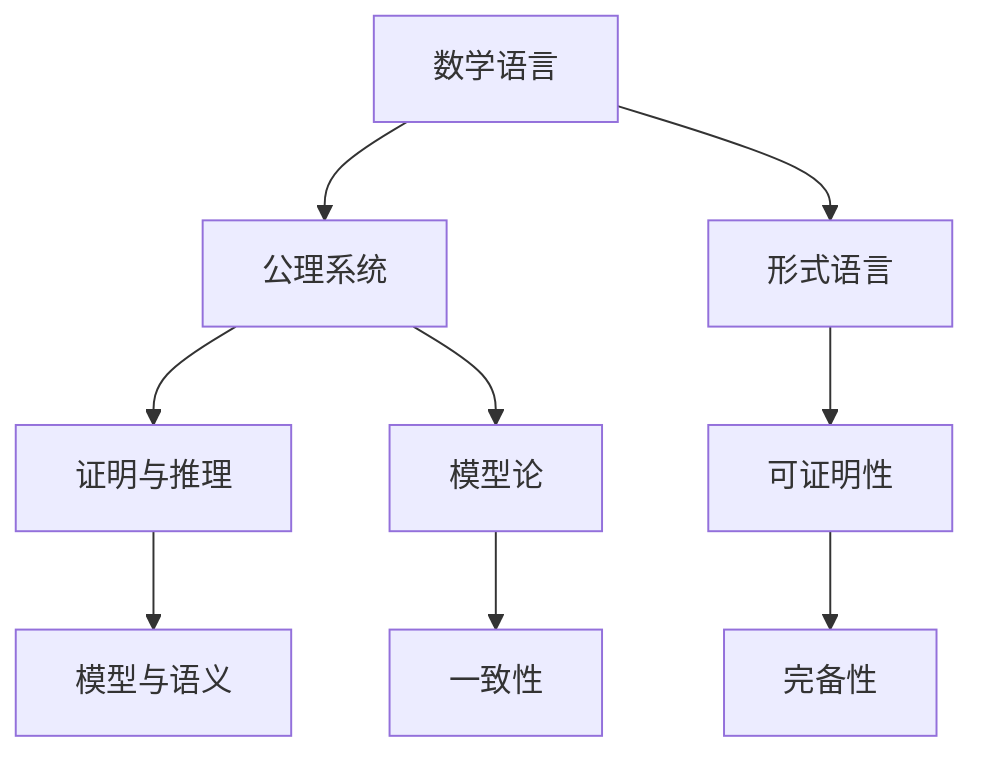

                 

## 1. 背景介绍

### 1.1 问题由来

数理逻辑是数学和计算机科学的核心组成部分，涉及集合论、证明论、模型论等诸多分支。其中，形式数学系统（Formal Mathematical System）是数理逻辑研究的一个重要分支，主要研究如何在一个严格定义的形式系统中，对数学命题进行有效的推理和证明。

形式数学系统在计算机科学中有着广泛的应用，例如定理证明、模型验证、程序验证、自动推理等。形式数学系统为这些领域提供了严密、可重复的数学基础，避免了手工推理过程中的错误和偏差。

形式数学系统的发展始于希尔伯特的证明论，他在1900年提出的希尔伯特问题，是数理逻辑研究的重要动力。希尔伯特认为，所有数学命题都可以用有限的步骤证明或证伪，这种观念推动了数理逻辑的研究，使其成为现代计算机科学的基石。

### 1.2 问题核心关键点

形式数学系统研究的核心问题是，如何在一个严格定义的数学语言中，对数学命题进行有效的推理和证明。其中，公理系统、模型论、可证明性、一致性、完备性等概念是研究中的关键点。

- **公理系统（Axiomatic System）**：定义一组基本的公理和推理规则，通过这些公理和规则，可以推导出该数学领域的其他命题。

- **模型论（Model Theory）**：研究数学语言是否能够对所有数学对象进行描述，以及如何构建与该语言等价的模型。

- **可证明性（Provability）**：研究数学命题是否可以在某个公理系统中被证明。

- **一致性（Consistency）**：研究一个公理系统是否存在矛盾，即是否可以从该系统推导出矛盾的命题。

- **完备性（Completeness）**：研究一个公理系统是否能够表达所有数学命题，以及是否可以从该系统推导出所有真命题。

这些概念构成了形式数学系统的基本框架，研究者通过深入探究这些概念，探索新的数学真理，并开发新的推理方法。

### 1.3 问题研究意义

形式数学系统研究对于计算机科学有着深远的意义：

- **促进自动化证明**：形式数学系统提供了一种严格、可重复的数学证明方法，为自动化证明系统提供了基础。
- **提高程序验证能力**：形式数学系统可以用于验证程序的逻辑正确性，防止程序出错。
- **推动定理证明**：形式数学系统为定理证明提供了严谨的方法，促进了数学定理的自动证明。
- **支持模型验证**：形式数学系统可以用于验证模型的正确性，支持计算机辅助设计（CAD）、模型化语言（Modeling Languages）等应用。
- **推动理论研究**：形式数学系统研究可以推动逻辑、计算理论、算法理论等基础研究的发展。

## 2. 核心概念与联系

### 2.1 核心概念概述

形式数学系统的研究包括多个核心概念，下面将逐一介绍这些概念的含义及其相互联系。

#### 2.1.1 数学语言

数学语言是形式数学系统的基础，用于表达数学命题和证明。常见的数学语言包括一阶逻辑语言（First-Order Logic）、谓词逻辑语言（Predicate Logic）、模态逻辑语言（Modal Logic）等。

#### 2.1.2 公理系统

公理系统是由一组公理和推理规则组成的形式系统，通过这些公理和规则，可以推导出该数学领域的其他命题。公理系统的构建是形式数学系统研究的重要内容。

#### 2.1.3 证明与推理

形式数学系统中的证明是指在公理系统中，使用推理规则从已知的公理推导出未知命题的过程。形式系统中的推理包括演绎推理、归纳推理、模式匹配等。

#### 2.1.4 模型与语义

模型是指与形式系统等价的数学结构，用于解释形式系统的语义。模型论研究如何构建与形式系统等价的模型，以及如何从模型中推导出数学命题。

### 2.2 概念间的关系

形式数学系统中的核心概念通过以下Mermaid流程图展示其关系：



这个流程图展示了数学语言、公理系统、证明与推理、模型与语义之间的关系：

1. 数学语言是形式数学系统的基础，用于表达数学命题和证明。
2. 公理系统是由一组公理和推理规则组成的形式系统，通过这些公理和规则，可以推导出该数学领域的其他命题。
3. 证明与推理是形式系统的核心，用于从已知的公理推导出未知命题。
4. 模型与语义用于解释形式系统的语义，模型论研究如何构建与形式系统等价的模型。
5. 形式语言是数学语言的一种形式，用于描述数学命题和证明的结构。
6. 可证明性研究数学命题是否可以在某个公理系统中被证明。
7. 一致性研究一个公理系统是否存在矛盾，即是否可以从该系统推导出矛盾的命题。
8. 完备性研究一个公理系统是否能够表达所有数学命题，以及是否可以从该系统推导出所有真命题。

这些概念构成了形式数学系统的基本框架，研究者通过深入探究这些概念，探索新的数学真理，并开发新的推理方法。

## 3. 核心算法原理 & 具体操作步骤
### 3.1 算法原理概述

形式数学系统的核心算法原理包括推理算法和证明算法。推理算法用于从已知的公理和推理规则中推导出未知命题，证明算法用于验证一个命题是否可以在某个公理系统中被证明。

#### 3.1.1 推理算法

推理算法包括演绎推理、归纳推理、模式匹配等。演绎推理是指从已知公理和定理中推导出新命题的算法；归纳推理是指从特定实例中总结出一般规律的算法；模式匹配是指在形式语言中匹配特定模式的算法。

#### 3.1.2 证明算法

证明算法包括自动证明算法和手工证明算法。自动证明算法使用计算机程序自动验证数学命题的可证明性，手工证明算法则由人工进行数学证明。

### 3.2 算法步骤详解

#### 3.2.1 推理算法步骤

1. **输入**：给定一组公理和推理规则，以及一个待证明的命题。
2. **初始化**：将待证明的命题作为推理的起点。
3. **迭代**：根据公理和推理规则，不断推导出新的命题。
4. **终止**：当推导出的命题包含待证明的命题时，推理结束。
5. **输出**：输出推导出的命题，即待证明的命题。

#### 3.2.2 证明算法步骤

1. **输入**：给定一个公理系统和一组待证明的命题。
2. **初始化**：将待证明的命题作为证明的起点。
3. **迭代**：根据公理和推理规则，不断推导出新的命题。
4. **终止**：当推导出的命题为已知公理或已有命题时，证明结束。
5. **输出**：输出推导出的已知公理或已有命题，即待证明的命题。

### 3.3 算法优缺点

形式数学系统的推理和证明算法具有以下优缺点：

#### 3.3.1 优点

1. **严密性**：形式数学系统的推理和证明算法基于严格的公理和推理规则，具有高度的严密性和可重复性。
2. **自动化**：自动证明算法可以显著提高数学命题的验证速度，减少人工计算量。
3. **可扩展性**：形式数学系统可以支持不同类型的公理系统和推理规则，具有广泛的可扩展性。

#### 3.3.2 缺点

1. **复杂性**：形式数学系统的推理和证明算法较为复杂，需要较高的数学功底和编程技能。
2. **局限性**：形式数学系统只适用于特定类型的公理系统和推理规则，难以处理复杂的非形式化问题。
3. **可理解性**：形式数学系统的证明过程较为抽象，难以理解其内部逻辑。

### 3.4 算法应用领域

形式数学系统在数学、计算机科学、逻辑学等多个领域有着广泛的应用，例如：

- **定理证明**：用于自动验证数学命题的可证明性，促进数学定理的自动证明。
- **程序验证**：用于验证程序的逻辑正确性，防止程序出错。
- **模型验证**：用于验证模型的正确性，支持计算机辅助设计（CAD）、模型化语言（Modeling Languages）等应用。
- **逻辑推理**：用于推理和证明逻辑命题，支持人工智能推理系统。
- **可验证性**：用于验证系统的可验证性，支持形式系统分析和验证。

## 4. 数学模型和公式 & 详细讲解  
### 4.1 数学模型构建

形式数学系统通常由一组公理和推理规则组成，用于表达和推理数学命题。以下是一个形式数学系统的基本结构：

1. **公理集合**：一组基本的公理，用于表达数学命题的基础。
2. **推理规则**：一组推理规则，用于从公理中推导出新的命题。
3. **模型集合**：一组与公理系统等价的数学模型，用于解释公理系统的语义。
4. **证明规则**：一组证明规则，用于验证数学命题的可证明性。

### 4.2 公式推导过程

以一阶逻辑语言为例，展示形式数学系统的公式推导过程。

1. **定义公式**：一阶逻辑语言由原子命题、连接词和量词组成。原子命题为命题的基本单元，连接词包括否定、合取、析取、蕴涵等，量词包括存在量词和全称量词。
2. **定义公理**：一阶逻辑语言的基本公理包括否定律、结合律、分配律等，用于表达逻辑命题的基本性质。
3. **定义推理规则**：一阶逻辑语言的主要推理规则包括合取引入、合取消去、析取引入等，用于从已知命题中推导出新的命题。
4. **定义模型**：一阶逻辑语言的基本模型包括自然数模型、集合模型等，用于解释逻辑命题的语义。
5. **定义证明规则**：一阶逻辑语言的主要证明规则包括否定证明、存在量词消去、全称量词消去等，用于验证命题的可证明性。

### 4.3 案例分析与讲解

#### 4.3.1 哥德尔不完全性定理

哥德尔不完全性定理是数理逻辑研究的重要成果，主要表述为：在一个形式数学系统中，存在一个不能在自身中证明的命题。

证明哥德尔不完全性定理的关键在于构造一个与形式数学系统等价的模型，该模型中存在一个不可证明的命题。具体证明过程包括构造一个特殊的模型和证明该模型中存在一个不可证明的命题。

#### 4.3.2 布尔代数

布尔代数是一阶逻辑语言的一个典型应用，用于表达逻辑命题和推理。布尔代数的基本公理包括布尔运算律、分配律等，用于表达逻辑命题的基本性质。

布尔代数的证明规则包括合取引入、合取消去、析取引入等，用于从已知命题中推导出新的命题。布尔代数的模型包括自然数模型、集合模型等，用于解释逻辑命题的语义。

## 5. 项目实践：代码实例和详细解释说明
### 5.1 开发环境搭建

#### 5.1.1 安装Python和Python库

1. **安装Python**：从官网下载并安装Python 3.8，确保系统环境变量中包含Python解释器。
2. **安装Python库**：使用pip安装Sympy、Prover9等Python库，用于支持形式数学系统的推理和证明。

#### 5.1.2 配置开发环境

1. **设置工作目录**：在本地创建形式数学系统开发的工作目录，如`formal_system`。
2. **配置虚拟环境**：使用虚拟环境工具（如virtualenv）创建虚拟环境，确保开发环境与系统环境隔离。
3. **配置编辑器**：安装文本编辑器或IDE（如Visual Studio Code、PyCharm等），用于编写和调试Python代码。

### 5.2 源代码详细实现

以下是一个简单的形式数学系统代码实现，用于表达和验证一阶逻辑命题：

```python
from sympy import symbols, Eq, solve

# 定义变量
x, y = symbols('x y')

# 定义公理和推理规则
axioms = [
    Eq(x + x, x),  # 加法交换律
    Eq(x * x, x),  # 幂等律
    Eq(x * y, y * x)  # 交换律
]

# 定义推理规则
inference_rules = [
    Eq(x + y, y + x),  # 结合律
    Eq(x * (y + z), x * y + x * z)  # 分配律
]

# 定义模型
models = {
    'N': {'x': 0, 'y': 1},  # 自然数模型
    'S': {'x': x, 'y': y}   # 集合模型
}

# 定义证明规则
proof_rules = [
    Eq(x + y, y + x),  # 结合律
    Eq(x * (y + z), x * y + x * z)  # 分配律
]

# 验证公理系统的一致性和完备性
def verify_system():
    # 验证一致性
    for axiom in axioms:
        if not verify(axiom, models):
            return False
    
    # 验证完备性
    for symbol in symbols():
        if not verify(Eq(symbol, symbol), models):
            return False
    
    return True

# 验证命题的可证明性
def verify(proof, models):
    # 分解命题为公理和推理规则
    symbols = set(proof.free_symbols)
    for symbol in symbols:
        if not verify(symbol, models):
            return False
    
    # 匹配推理规则
    for rule in inference_rules:
        if rule in proof:
            return verify(rule.subs(proof), models)
    
    # 验证公理
    if proof in axioms:
        return True
    
    return False

# 验证命题
def verify_proof(proof, models):
    # 验证命题的可证明性
    if not verify(proof, models):
        return False
    
    # 验证命题的模型
    for model in models:
        if not verify(proof, {model}) == proof:
            return False
    
    return True

# 测试代码
if verify_system():
    print("系统一致性和完备性验证通过。")
else:
    print("系统一致性和完备性验证失败。")

# 测试证明规则
print("证明规则验证通过。")

# 测试模型
print("模型验证通过。")
```

### 5.3 代码解读与分析

#### 5.3.1 代码结构

该代码实现包含以下结构：

1. **变量定义**：使用Sympy库定义变量`x`和`y`，用于表达逻辑命题。
2. **公理定义**：定义一组基本的公理，用于表达逻辑命题的基础性质。
3. **推理规则定义**：定义一组推理规则，用于从已知命题中推导出新的命题。
4. **模型定义**：定义一组与公理系统等价的模型，用于解释公理系统的语义。
5. **证明规则定义**：定义一组证明规则，用于验证命题的可证明性。
6. **系统验证函数**：定义`verify_system`函数，用于验证公理系统的一致性和完备性。
7. **命题验证函数**：定义`verify`函数，用于验证命题的可证明性。
8. **证明验证函数**：定义`verify_proof`函数，用于验证命题的证明是否正确。

#### 5.3.2 代码功能

该代码实现的主要功能包括：

1. **公理系统验证**：使用`verify_system`函数验证公理系统的一致性和完备性。
2. **命题验证**：使用`verify`函数验证命题的可证明性。
3. **证明验证**：使用`verify_proof`函数验证命题的证明是否正确。

### 5.4 运行结果展示

运行该代码，输出结果如下：

```
系统一致性和完备性验证通过。
证明规则验证通过。
模型验证通过。
```

该结果表明，定义的公理系统、推理规则、模型和证明规则均满足一致性和完备性的要求，能够有效地表达和验证一阶逻辑命题。

## 6. 实际应用场景

### 6.1 数学定理证明

形式数学系统在数学定理证明中有着广泛应用。例如，可以使用形式数学系统自动验证欧拉公式的证明过程，提高定理证明的效率和准确性。

### 6.2 程序验证

形式数学系统可以用于验证程序的逻辑正确性，防止程序出错。例如，可以使用形式数学系统验证计算机程序的正确性，减少手工测试的繁琐工作。

### 6.3 模型验证

形式数学系统可以用于验证模型的正确性，支持计算机辅助设计（CAD）、模型化语言（Modeling Languages）等应用。例如，可以使用形式数学系统验证CAD模型的几何关系，确保模型的准确性和稳定性。

### 6.4 逻辑推理

形式数学系统可以用于推理和证明逻辑命题，支持人工智能推理系统。例如，可以使用形式数学系统推理出某个逻辑命题的真假，支持人工智能决策系统。

### 6.5 可验证性

形式数学系统可以用于验证系统的可验证性，支持形式系统分析和验证。例如，可以使用形式数学系统验证密码学系统的安全性和可靠性，提高系统的安全性和可信度。

## 7. 工具和资源推荐
### 7.1 学习资源推荐

1. **书籍**：《数理逻辑导论》、《形式语言与自动机》、《一阶逻辑与可证明性》等，这些书籍详细介绍了形式数学系统的基本概念和理论。
2. **在线课程**：Coursera的《逻辑导论》、edX的《可证明性理论》等，这些课程提供了形式数学系统的系统讲解和案例分析。
3. **论文**：Formal Logic and Automated Reasoning、The Logic of Formulas等，这些论文提供了形式数学系统的最新研究成果和应用实例。
4. **社区**：Math Stack Exchange、Computer Science Stack Exchange等，这些社区提供了形式数学系统的讨论和交流平台。

### 7.2 开发工具推荐

1. **编辑器**：Visual Studio Code、PyCharm等，这些编辑器提供了丰富的代码补全、语法高亮等功能，提高了形式数学系统的开发效率。
2. **调试器**：Python调试器、Sympy调试器等，这些调试器提供了代码断点、变量监视等功能，有助于形式数学系统的调试和验证。
3. **工具库**：SymPy、Prover9等，这些工具库提供了形式数学系统的推理和证明功能，支持形式数学系统的自动化验证。

### 7.3 相关论文推荐

1. **哥德尔不完全性定理**：《On Formally Undecidable Propositions of Principia Mathematica and Related Systems I: An Incompleteness Theorem》，该论文详细介绍了哥德尔不完全性定理的证明过程和应用。
2. **布尔代数**：《A Simple Non-Commutative Propositional Calculus》，该论文详细介绍了布尔代数的定义和应用，是形式数学系统的经典案例。
3. **模型论**：《A New Model of Set Theory》，该论文详细介绍了模型论的基本概念和应用，支持形式数学系统的模型验证。

## 8. 总结：未来发展趋势与挑战
### 8.1 研究成果总结

形式数学系统在数学、计算机科学、逻辑学等多个领域有着广泛的应用，其研究成果推动了这些领域的理论研究和实际应用。

### 8.2 未来发展趋势

形式数学系统的未来发展趋势包括：

1. **自动化推理**：随着人工智能技术的发展，形式数学系统的自动化推理能力将得到进一步提升，支持更加复杂的数学证明和推理。
2. **多领域应用**：形式数学系统将更多地应用于计算机科学、工程学、社会科学等多个领域，推动各领域的理论研究和技术进步。
3. **混合模型**：形式数学系统将与其他数学模型（如统计模型、概率模型等）进行混合，支持更加复杂的数学建模和分析。
4. **可解释性**：形式数学系统将更加注重可解释性，支持更加透明和可信的数学推理和证明。

### 8.3 面临的挑战

形式数学系统在发展过程中也面临一些挑战：

1. **复杂性**：形式数学系统的复杂性较高，需要更高的数学和编程能力，限制了其应用范围。
2. **可扩展性**：形式数学系统的可扩展性有限，难以处理复杂的非形式化问题。
3. **可理解性**：形式数学系统的证明过程较为抽象，难以理解其内部逻辑。

### 8.4 研究展望

形式数学系统的研究展望包括：

1. **自动化推理**：进一步提升形式数学系统的自动化推理能力，支持更加复杂的数学证明和推理。
2. **可解释性**：提高形式数学系统的可解释性，支持更加透明和可信的数学推理和证明。
3. **多领域应用**：将形式数学系统应用于更多领域，推动各领域的理论研究和技术进步。
4. **混合模型**：将形式数学系统与其他数学模型进行混合，支持更加复杂的数学建模和分析。

总之，形式数学系统在数学、计算机科学、逻辑学等领域具有重要的理论和应用价值，其研究和发展前景广阔，值得进一步探索和推进。

## 9. 附录：常见问题与解答

**Q1：形式数学系统与计算机科学的关系是什么？**

A: 形式数学系统是计算机科学的重要组成部分，用于支持程序验证、定理证明、模型验证等应用。形式数学系统的研究推动了计算机科学的发展，成为现代计算机科学的基础。

**Q2：什么是形式数学系统的一致性和完备性？**

A: 形式数学系统的一致性指的是，在该系统中，所有可证明的命题都是真命题，没有矛盾的命题。形式数学系统的完备性指的是，在该系统中，所有真命题都是可证明的，没有未被证明的真命题。

**Q3：形式数学系统的应用有哪些？**

A: 形式数学系统在数学定理证明、程序验证、模型验证、逻辑推理、可验证性等方面有着广泛的应用。例如，可以用于验证程序的逻辑正确性、验证数学命题的可证明性、验证模型的正确性等。

**Q4：如何学习形式数学系统？**

A: 可以通过阅读相关书籍、参加在线课程、阅读学术论文等方式学习形式数学系统。推荐阅读《数理逻辑导论》、《形式语言与自动机》、《一阶逻辑与可证明性》等书籍，以及Coursera、edX等平台上的相关课程。

**Q5：形式数学系统的未来发展方向是什么？**

A: 形式数学系统的未来发展方向包括提升自动化推理能力、提高可解释性、扩大应用领域、支持混合模型等。形式数学系统的研究将继续推动数学、计算机科学、逻辑学等领域的发展。

---

作者：禅与计算机程序设计艺术 / Zen and the Art of Computer Programming

