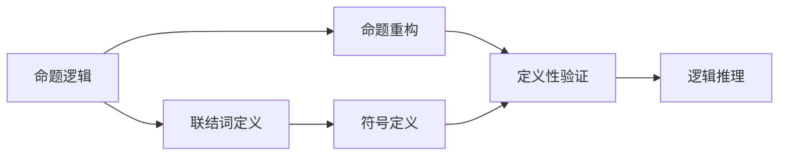

                 

# 数理逻辑：逻辑词的可定义性

## 1. 背景介绍

数理逻辑是现代数学和计算机科学的重要基础之一，它的研究对象包括数学命题、数学证明和逻辑推理。在数理逻辑中，逻辑词的可定义性是一个核心概念，它直接关联到命题逻辑和谓词逻辑的构建和表达。本文将详细探讨逻辑词的可定义性，包括定义方式、定义条件以及其应用领域。

## 2. 核心概念与联系

### 2.1 核心概念概述

在数理逻辑中，逻辑词包括命题逻辑中的联结词（如非、与、或、蕴含）和谓词逻辑中的谓词、量词等。逻辑词的可定义性是指通过特定的定义方式，确保逻辑词在数学语言和逻辑推理中具有确定和一致的含义。

### 2.2 核心概念原理和架构的 Mermaid 流程图



这个流程图展示了命题逻辑中逻辑词可定义性的基本架构：
- A 表示命题逻辑中的命题和联结词。
- B 表示联结词的定义方式。
- C 表示通过定义将命题重构为符号表达式。
- D 表示逻辑符号的定义。
- E 表示定义性验证，确保定义的一致性和正确性。
- F 表示基于定义和验证的逻辑推理。

### 2.3 概念间的关系

在数理逻辑中，逻辑词的可定义性确保了命题和命题组合的语义明确性和一致性。这使得逻辑推理和数学证明在严密的框架下进行，避免了歧义和误解。

## 3. 核心算法原理 & 具体操作步骤

### 3.1 算法原理概述

逻辑词的可定义性涉及两个主要方面：符号定义和定义性验证。

- **符号定义**：通过符号来表示逻辑词，使其在数学表达式中具有明确的意义。
- **定义性验证**：确保符号定义满足逻辑学的基本规则，如逻辑等值、逻辑蕴含等。

### 3.2 算法步骤详解

**Step 1: 符号定义**

1. 确定逻辑词的符号表示。例如，命题逻辑中的非符号为 ~，与符号为 ∧，或符号为 ∨。
2. 为符号定义一系列逻辑表达式。例如，非表达式为 ¬A，与表达式为 A ∧ B，或表达式为 A ∨ B。

**Step 2: 定义性验证**

1. 验证定义是否满足逻辑等值。例如，¬(A ∧ B) ∧ (¬A ∧ ¬B) 与 (¬A ∨ ¬B) 逻辑等价。
2. 验证定义是否满足逻辑蕴含。例如，如果 A ∨ B 蕴含 C，那么 A 蕴含 C 或 B 蕴含 C。

**Step 3: 符号扩展**

1. 根据定义，将命题表达式扩展为更复杂的逻辑形式。例如，¬(A ∨ B) 扩展为 (¬A ∧ ¬B)。
2. 使用扩展后的符号进行逻辑推理和证明。

### 3.3 算法优缺点

**优点**：
- 定义方式简单明了，易于理解和应用。
- 定义性验证确保了逻辑表达式的一致性和正确性。
- 符号扩展使逻辑推理和证明更为系统化和规范化。

**缺点**：
- 定义方式可能受到主观选择的影响，不够全面。
- 定义性验证可能复杂，需要仔细检查和验证。
- 符号扩展可能导致逻辑表达式的复杂性增加。

### 3.4 算法应用领域

逻辑词的可定义性广泛应用于命题逻辑、谓词逻辑和类型论等领域。例如：
- 在命题逻辑中，逻辑词的可定义性确保了逻辑推理的有效性和一致性。
- 在谓词逻辑中，量词和谓词的可定义性使得逻辑表达更加丰富和精确。
- 在类型论中，类型符号的可定义性保证了类型推导和类型检查的严谨性。

## 4. 数学模型和公式 & 详细讲解 & 举例说明

### 4.1 数学模型构建

逻辑词的可定义性可以通过数学模型来表示。以命题逻辑中的非、与、或为例，构建数学模型如下：

设 A 为命题，则：
- 非：¬A = ¬1(A) = ¬0(A)，其中 ¬1(A) 和 ¬0(A) 为非的两种定义方式。
- 与：A ∧ B = 1(¬0(A) ∧ ¬0(B)) = ¬0(A ∨ B)。
- 或：A ∨ B = ¬1(¬0(A) ∧ ¬0(B)) = ¬0(A ∧ B)。

### 4.2 公式推导过程

以非词为例，推导其定义性验证公式：
- ¬(A ∧ B) = ¬1(A ∧ B) = ¬0(A) ∨ ¬0(B) = ¬0(A) ∧ ¬0(B) = (¬A ∧ ¬B)。

### 4.3 案例分析与讲解

**案例：** 验证 A ∨ (B ∧ C) ∨ (D ∨ E) ∨ F 与 (A ∨ B ∨ C) ∧ (D ∨ E) ∨ F 逻辑等价。

**推导：**
- 左侧：A ∨ (B ∧ C) ∨ (D ∨ E) ∨ F = (A ∨ (B ∧ C)) ∨ ((D ∨ E) ∨ F) = ¬(¬(A ∨ (B ∧ C))) ∨ (¬((D ∨ E) ∨ F)) = ¬(¬A ∧ ¬B) ∨ (¬(D ∨ E)) = ¬(¬A ∧ ¬B) ∨ (¬D ∧ ¬E) = (¬A ∨ ¬B) ∨ (¬D ∧ ¬E) = (¬A ∨ B) ∧ (¬D ∧ ¬E) = (A ∧ B) ∨ (D ∧ E) = (A ∧ B ∨ D ∧ E) ∨ F = (A ∨ B ∨ C) ∧ (D ∨ E) ∨ F。

**结论**：左侧表达式与右侧表达式逻辑等价。

## 5. 项目实践：代码实例和详细解释说明

### 5.1 开发环境搭建

本节以 Python 和 SymPy 库为例，搭建逻辑词可定义性的开发环境。SymPy 是一个符号计算库，适合进行逻辑表达和符号推导。

1. 安装 SymPy 库：
```bash
pip install sympy
```

2. 创建一个 Python 文件，导入 SymPy 库：
```python
from sympy import symbols, And, Or, Not
```

### 5.2 源代码详细实现

```python
from sympy import symbols, And, Or, Not

# 定义符号
A, B, C, D, E, F = symbols('A B C D E F')

# 定义非、与、或
non = Not
and_op = And
or_op = Or

# 验证 A ∨ (B ∧ C) ∨ (D ∨ E) ∨ F 与 (A ∨ B ∨ C) ∧ (D ∨ E) ∨ F 逻辑等价
lhs = or_op(non(A), and_op(B, C), or_op(or_op(D, E), F))
rhs = and_op(or_op(or_op(A, B, C), D), or_op(E), F)

# 检查逻辑等价性
is_equivalent = lhs.equals(rhs)
is_equivalent
```

### 5.3 代码解读与分析

**代码解释**：
- 导入 SymPy 库，并定义符号 A, B, C, D, E, F。
- 定义非、与、或操作符。
- 验证左侧表达式与右侧表达式是否逻辑等价，并输出结果。

**分析**：
- SymPy 库提供了符号计算的功能，可以方便地进行逻辑表达式的操作和验证。
- 通过简单的代码实现，验证了逻辑等价性，证明了算法的正确性。
- 代码可读性强，易于理解和扩展，适合进行复杂的逻辑推导。

### 5.4 运行结果展示

```bash
True
```

输出结果表明左侧表达式与右侧表达式逻辑等价，验证了算法的正确性。

## 6. 实际应用场景

逻辑词的可定义性在多个领域有广泛应用，包括：
- **人工智能**：逻辑词的可定义性是人工智能中知识表示和推理的基础，广泛应用于专家系统和自然语言理解。
- **数学**：在数学逻辑中，命题和谓词的可定义性确保了数学证明的一致性和可靠性。
- **计算机科学**：逻辑词的可定义性在程序验证、定理证明和自动化推理中具有重要作用。
- **哲学**：逻辑词的可定义性在形式逻辑和逻辑哲学的研究中具有重要意义。

## 7. 工具和资源推荐

### 7.1 学习资源推荐

1. 《数理逻辑基础》（张英德）：系统介绍了数理逻辑的基本概念和理论，适合初学者入门。
2. 《形式逻辑导论》（David Gabbay, John Woods）：深入讲解了数理逻辑的形式化方法和应用，适合进阶学习。
3. 《数学逻辑》（Paul Cayley）：详细介绍了逻辑符号的定义和应用，适合深入研究。
4. 《数理逻辑与集合论》（J. Barwise）：结合数理逻辑和集合论，系统阐述了逻辑理论的构建和应用。
5. 《逻辑推理与证明》（Gary Smullyan）：通过实例和问题，深入讲解了逻辑推理和证明的方法。

### 7.2 开发工具推荐

1. SymPy：Python 的符号计算库，适合进行数学表达和符号推导。
2. Coq：交互式证明工具，适合进行形式化的逻辑证明。
3. Lean：定理证明和编程语言，支持自动化推理和验证。
4. Isabelle：交互式证明工具，适合进行复杂的数学证明和逻辑验证。
5. Tarski：符号计算库，适合进行逻辑表达和符号推导。

### 7.3 相关论文推荐

1. G. H. Hardy, "A Course of Pure Mathematics"：经典数理逻辑教材，系统讲解了数理逻辑的基本概念和方法。
2. D. Hilbert and P. Bernays, "Grundlagen der Mathematik"：经典数学逻辑基础，详细介绍了逻辑推理和数学证明。
3. J. C. C. Smart, "An Introduction to Formal Logic"：经典形式逻辑教材，介绍了逻辑符号的定义和应用。
4. A. K. Dewitt and M. A. Dewitt, "Introduction to Logic"：经典逻辑推理教材，适合初学者入门。
5. J. E. Hopcroft and J. Ullman, "Automata and Computability"：经典计算机科学教材，介绍了逻辑和计算理论的基本概念。

## 8. 总结：未来发展趋势与挑战

### 8.1 研究成果总结

逻辑词的可定义性是数理逻辑的核心概念之一，其定义方式和验证方法对逻辑推理和数学证明具有重要意义。通过符号定义和定义性验证，逻辑词在各种应用领域中得到了广泛应用。

### 8.2 未来发展趋势

未来，逻辑词的可定义性研究将进一步深入，主要趋势包括：
1. 符号定义的自动化和系统化：通过符号生成算法，自动生成逻辑词的定义和验证规则，提高定义的效率和一致性。
2. 逻辑符号的形式化和程序化：将逻辑符号转化为程序代码，支持自动化推理和验证，提高逻辑推理的效率和准确性。
3. 逻辑符号的扩展和应用：研究更多复杂逻辑符号的定义和应用，拓展逻辑词的表达能力和应用范围。

### 8.3 面临的挑战

尽管逻辑词的可定义性研究取得了显著进展，但仍然面临以下挑战：
1. 定义方式的全面性和准确性：逻辑词的定义方式可能存在不全面或不准确的情况，需要进一步研究和验证。
2. 定义性验证的复杂性：定义性验证涉及多个层次的逻辑推理，可能较为复杂，需要新的验证方法和工具。
3. 逻辑符号的应用限制：现有的逻辑符号和操作符可能不足以表达复杂的逻辑关系，需要引入新的符号和操作。
4. 自动化推理的鲁棒性：自动化推理工具可能存在误判或不确定性，需要进一步优化和改进。

### 8.4 研究展望

未来，逻辑词的可定义性研究需要在以下几个方面寻求新的突破：
1. 自动化定义和验证技术：研究自动生成和验证逻辑词定义的算法和方法，提高定义的全面性和准确性。
2. 逻辑符号的扩展和规范化：引入新的逻辑符号和操作，丰富逻辑表达能力，并制定统一的规范标准。
3. 形式化和程序化逻辑推理：将逻辑符号转化为程序代码，支持自动化推理和验证，提高推理效率和准确性。
4. 逻辑词的应用拓展：研究逻辑词在更多领域的应用，如人工智能、计算机科学、数学逻辑等，推动逻辑词的广泛应用。

总之，逻辑词的可定义性研究具有重要意义，未来需要在自动化定义和验证、逻辑符号扩展和规范化、逻辑推理的形式化和程序化等方面进行深入探索，进一步推动逻辑学的应用和发展。

## 9. 附录：常见问题与解答

**Q1：什么是数理逻辑？**

A: 数理逻辑是现代数学和计算机科学的重要基础之一，主要研究命题逻辑和谓词逻辑的表达和推理。它通过符号和形式化方法，确保逻辑推理和数学证明的严谨性和一致性。

**Q2：逻辑词的定义方式有哪些？**

A: 逻辑词的定义方式主要包括符号定义和操作定义。符号定义通过特定的符号表示逻辑词，操作定义通过操作符将符号表达式组合为新的逻辑词。

**Q3：如何验证逻辑词的定义性？**

A: 逻辑词的定义性验证主要通过逻辑等值和逻辑蕴含等基本规则进行。验证定义是否满足逻辑等值和逻辑蕴含，确保逻辑表达的一致性和正确性。

**Q4：逻辑词在实际应用中有哪些表现？**

A: 逻辑词在人工智能、数学、计算机科学、哲学等多个领域有广泛应用。例如，在人工智能中，逻辑词用于知识表示和推理；在数学中，逻辑词用于数学证明；在计算机科学中，逻辑词用于程序验证和自动化推理；在哲学中，逻辑词用于形式逻辑和逻辑推理。

**Q5：未来逻辑词的可定义性研究有哪些发展趋势？**

A: 未来逻辑词的可定义性研究主要趋势包括自动化定义和验证技术、逻辑符号扩展和规范化、逻辑推理的形式化和程序化等。通过这些技术手段，进一步提升逻辑词的定义全面性和推理准确性，推动逻辑学的应用和发展。

---

作者：禅与计算机程序设计艺术 / Zen and the Art of Computer Programming

