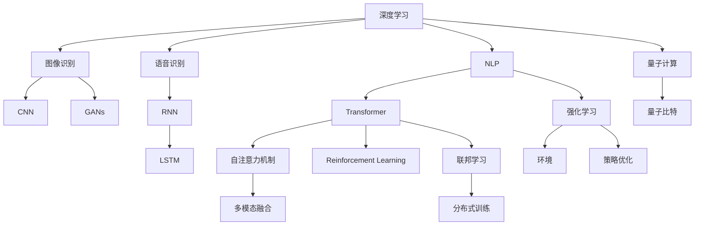
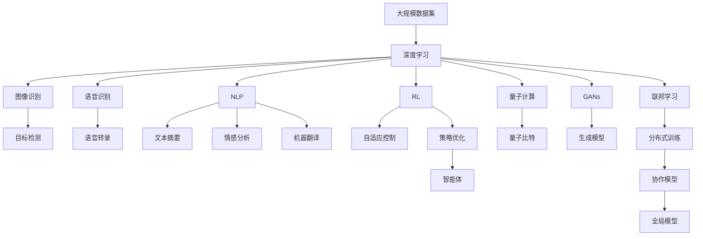

                 

# 新一代AI技术趋势与应用

## 1. 背景介绍

### 1.1 问题由来

当前，人工智能（AI）领域正处于飞速发展的时期，新一代AI技术如深度学习、自然语言处理（NLP）、计算机视觉（CV）、生成对抗网络（GANs）、强化学习（RL）等不断涌现，展现出令人瞩目的前景。然而，随着技术的不断进步，AI技术的实际应用也面临新的挑战。本文旨在探讨新一代AI技术的最新趋势及其应用，为未来的技术发展与实际应用提供有价值的见解。

### 1.2 问题核心关键点

新一代AI技术主要包括以下几个核心方面：

1. **深度学习（Deep Learning, DL）**：通过多层神经网络结构，实现对大规模数据进行高效特征提取与模型训练，广泛应用于图像识别、语音识别、自然语言处理等领域。

2. **自然语言处理（Natural Language Processing, NLP）**：利用自然语言理解与生成技术，实现人机对话、文本摘要、情感分析、机器翻译等任务。

3. **计算机视觉（Computer Vision, CV）**：通过图像识别与分析技术，实现目标检测、图像分割、姿态估计、图像生成等任务。

4. **生成对抗网络（Generative Adversarial Networks, GANs）**：通过生成器和判别器两个网络结构，实现图像、音频、文本等多种数据的生成与生成模型评估。

5. **强化学习（Reinforcement Learning, RL）**：通过奖励机制，训练智能体在复杂环境中做出最优决策，实现自动驾驶、机器人控制、游戏策略优化等任务。

6. **联邦学习（Federated Learning）**：在分布式网络中，多个设备或服务器协同训练模型，保护数据隐私的同时实现全局模型的优化。

7. **量子计算（Quantum Computing）**：利用量子位进行高效计算，实现对某些复杂问题的快速求解。

8. **跨领域融合（Cross-Domain Fusion）**：将多个领域的知识与技术进行融合，实现多模态信息的协同分析与理解。

### 1.3 问题研究意义

探讨新一代AI技术趋势与应用，对于推动AI技术的创新与产业化进程，具有重要的现实意义：

1. **提升AI应用效率与性能**：通过最新的AI技术，实现更高效、更精确、更智能的模型训练与应用。
2. **推动产业升级**：AI技术的应用能够优化企业流程、提高生产效率、改善用户体验，推动各行业数字化转型。
3. **促进科研发展**：深度学习、NLP、CV等技术的进展为科研工作提供了新的工具和方法，推动科学研究的创新。
4. **解决社会问题**：AI技术在医疗、教育、交通、环保等领域的广泛应用，有望解决诸多社会问题，提升生活质量。
5. **赋能新兴产业**：如自动驾驶、智能制造、智慧城市等新兴产业，依赖于AI技术的突破与发展。

## 2. 核心概念与联系

### 2.1 核心概念概述

以下是新一代AI技术的核心概念及其相互联系：

1. **深度学习**：通过多层神经网络结构，实现特征提取与模型训练，广泛应用于图像识别、语音识别、自然语言处理等领域。

2. **自然语言处理**：利用自然语言理解与生成技术，实现人机对话、文本摘要、情感分析、机器翻译等任务。

3. **计算机视觉**：通过图像识别与分析技术，实现目标检测、图像分割、姿态估计、图像生成等任务。

4. **生成对抗网络**：通过生成器和判别器两个网络结构，实现图像、音频、文本等多种数据的生成与生成模型评估。

5. **强化学习**：通过奖励机制，训练智能体在复杂环境中做出最优决策，实现自动驾驶、机器人控制、游戏策略优化等任务。

6. **联邦学习**：在分布式网络中，多个设备或服务器协同训练模型，保护数据隐私的同时实现全局模型的优化。

7. **量子计算**：利用量子位进行高效计算，实现对某些复杂问题的快速求解。

8. **跨领域融合**：将多个领域的知识与技术进行融合，实现多模态信息的协同分析与理解。

这些概念之间存在着紧密的联系，共同构成了新一代AI技术的核心框架。

### 2.2 概念间的关系

这些核心概念之间的关系可以通过以下Mermaid流程图来展示：

这个流程图展示了各个AI技术的相互关系及其主要方法：

1. 深度学习是基础技术，包括CNN、RNN、Transformer等方法。
2. 图像识别、语音识别、NLP等任务分别使用了不同的深度学习模型。
3. 生成对抗网络（GANs）和强化学习（RL）是深度学习的高级应用。
4. 联邦学习能够保护数据隐私，实现分布式协同训练。
5. 量子计算是未来计算的趋势，解决复杂问题的高效方法。
6. 多模态融合是AI技术发展的趋势，实现跨领域信息协同分析。

### 2.3 核心概念的整体架构

最后，我们用一个综合的流程图来展示这些核心概念在大规模AI系统中的整体架构：

这个综合流程图展示了从数据到模型，再到实际应用的全过程。通过深度学习，对大规模数据集进行处理，得到图像识别、语音识别、NLP等模型。这些模型进一步应用于目标检测、语音转录、文本摘要等任务。GANs和RL等技术用于生成模型和智能体控制。联邦学习实现分布式训练，量子计算提供高效计算方法。多模态融合实现跨领域协同分析。最终，这些技术通过实际应用，推动各行各业的数字化转型和智能化升级。

## 3. 核心算法原理 & 具体操作步骤

### 3.1 算法原理概述

新一代AI技术的核心算法原理主要包括以下几个方面：

1. **深度学习**：通过多层神经网络结构，实现特征提取与模型训练。
2. **自然语言处理**：利用自然语言理解与生成技术，实现人机对话、文本摘要、情感分析、机器翻译等任务。
3. **计算机视觉**：通过图像识别与分析技术，实现目标检测、图像分割、姿态估计、图像生成等任务。
4. **生成对抗网络**：通过生成器和判别器两个网络结构，实现图像、音频、文本等多种数据的生成与生成模型评估。
5. **强化学习**：通过奖励机制，训练智能体在复杂环境中做出最优决策。
6. **联邦学习**：在分布式网络中，多个设备或服务器协同训练模型。
7. **量子计算**：利用量子位进行高效计算，实现对某些复杂问题的快速求解。
8. **跨领域融合**：将多个领域的知识与技术进行融合，实现多模态信息的协同分析与理解。

### 3.2 算法步骤详解

以下是对这些核心算法详细步骤的详细讲解：

**深度学习**：

1. **数据预处理**：将原始数据转换为网络可以处理的张量形式。
2. **模型设计**：选择合适的深度学习模型结构，如卷积神经网络（CNN）、循环神经网络（RNN）、Transformer等。
3. **模型训练**：通过反向传播算法，最小化损失函数，更新模型参数。
4. **模型评估**：在测试集上评估模型性能，调整模型超参数，提升模型精度。

**自然语言处理**：

1. **数据预处理**：将文本数据转换为词向量，去除停用词，分词等预处理步骤。
2. **模型设计**：选择合适的NLP模型结构，如词向量模型、卷积神经网络、循环神经网络、Transformer等。
3. **模型训练**：通过反向传播算法，最小化损失函数，更新模型参数。
4. **模型评估**：在测试集上评估模型性能，调整模型超参数，提升模型精度。

**计算机视觉**：

1. **数据预处理**：将图像数据转换为网络可以处理的张量形式，进行数据增强、归一化等预处理。
2. **模型设计**：选择合适的CV模型结构，如卷积神经网络、区域卷积神经网络、残差网络等。
3. **模型训练**：通过反向传播算法，最小化损失函数，更新模型参数。
4. **模型评估**：在测试集上评估模型性能，调整模型超参数，提升模型精度。

**生成对抗网络**：

1. **数据预处理**：将数据转换为网络可以处理的张量形式，进行归一化等预处理。
2. **模型设计**：设计生成器和判别器两个网络结构，定义损失函数。
3. **模型训练**：通过对抗训练过程，优化生成器和判别器的参数。
4. **模型评估**：在测试集上评估生成模型的性能，优化生成器参数，提升生成质量。

**强化学习**：

1. **环境设计**：设计智能体所需的环境，定义状态空间、动作空间和奖励函数。
2. **模型设计**：选择合适的强化学习算法，如Q-learning、SARSA、深度强化学习等。
3. **模型训练**：通过与环境交互，收集经验，更新模型参数。
4. **模型评估**：在测试集上评估智能体的性能，调整模型超参数，提升决策效果。

**联邦学习**：

1. **网络设计**：设计分布式网络结构，定义数据划分规则。
2. **模型设计**：选择合适的联邦学习算法，如联邦平均、联邦SGD、联邦变分自编码器等。
3. **模型训练**：在分布式网络中，多个设备或服务器协同训练模型。
4. **模型评估**：在测试集上评估全局模型的性能，调整模型超参数，提升模型精度。

**量子计算**：

1. **量子电路设计**：设计量子电路，实现计算目标。
2. **量子比特准备**：准备量子比特，进行初始化。
3. **量子计算**：通过量子门操作，实现量子比特状态的演化。
4. **量子测量**：通过量子测量，获取计算结果。

**跨领域融合**：

1. **数据预处理**：将多模态数据转换为统一格式，进行归一化等预处理。
2. **模型设计**：选择合适的跨领域融合模型结构，如多模态注意力机制、融合神经网络等。
3. **模型训练**：通过联合训练，优化跨领域融合模型参数。
4. **模型评估**：在测试集上评估模型性能，调整模型超参数，提升模型精度。

### 3.3 算法优缺点

新一代AI技术的核心算法具有以下优缺点：

**深度学习**：

优点：

1. 强大的特征提取能力，适用于大规模数据处理。
2. 广泛应用于图像识别、语音识别、NLP等领域。

缺点：

1. 模型复杂，训练时间长。
2. 容易过拟合，需要大量标注数据。

**自然语言处理**：

优点：

1. 实现人机对话、文本摘要、情感分析、机器翻译等任务。
2. 提升信息处理和理解的效率。

缺点：

1. 需要大量的标注数据。
2. 模型的解释性较差，难以理解内部机制。

**计算机视觉**：

优点：

1. 实现目标检测、图像分割、姿态估计、图像生成等任务。
2. 应用于自动驾驶、安防监控等领域。

缺点：

1. 数据标注成本高。
2. 对于复杂场景的处理能力有限。

**生成对抗网络**：

优点：

1. 生成高质量的图像、音频、文本等数据。
2. 用于数据增强、图像修复、风格迁移等应用。

缺点：

1. 模型训练过程复杂，容易陷入局部最优解。
2. 生成的数据质量依赖于训练策略。

**强化学习**：

优点：

1. 实现智能体在复杂环境中的最优决策。
2. 应用于自动驾驶、机器人控制、游戏策略优化等任务。

缺点：

1. 模型训练过程耗时较长。
2. 需要大量的数据和计算资源。

**联邦学习**：

优点：

1. 保护数据隐私，实现分布式协同训练。
2. 应用于医疗、金融等领域的数据共享。

缺点：

1. 模型复杂，实现难度较大。
2. 需要处理网络通信延迟和数据传输开销。

**量子计算**：

优点：

1. 实现对某些复杂问题的快速求解。
2. 应用于密码学、化学计算等领域。

缺点：

1. 技术尚不成熟，硬件成本高。
2. 对算法和模型要求较高。

**跨领域融合**：

优点：

1. 实现多模态信息的协同分析与理解。
2. 应用于智慧城市、医疗健康等领域。

缺点：

1. 需要处理多模态数据的融合和转换。
2. 模型复杂，训练和推理成本高。

### 3.4 算法应用领域

新一代AI技术在各个领域都有广泛的应用，具体如下：

**深度学习**：

1. 图像识别：应用于医疗影像分析、安防监控、自动驾驶等领域。
2. 语音识别：应用于智能音箱、语音助手、语音翻译等领域。
3. NLP：应用于机器翻译、情感分析、文本摘要、问答系统等领域。

**自然语言处理**：

1. 人机对话：应用于智能客服、聊天机器人、虚拟助手等领域。
2. 文本摘要：应用于新闻摘要、文档摘要等领域。
3. 情感分析：应用于社交媒体情感分析、市场舆情分析等领域。

**计算机视觉**：

1. 目标检测：应用于安防监控、自动驾驶、工业检测等领域。
2. 图像分割：应用于医学影像分析、遥感图像分析等领域。
3. 姿态估计：应用于人体姿态分析、运动捕捉等领域。

**生成对抗网络**：

1. 图像生成：应用于图像修复、风格迁移、人脸生成等领域。
2. 音频生成：应用于音乐生成、语音合成等领域。
3. 文本生成：应用于自动摘要、机器翻译、对话生成等领域。

**强化学习**：

1. 自动驾驶：应用于无人驾驶车辆控制、交通流优化等领域。
2. 机器人控制：应用于工业机器人、服务机器人等领域。
3. 游戏策略优化：应用于游戏AI、游戏自动生成等领域。

**联邦学习**：

1. 医疗：应用于分布式医疗数据共享、跨机构数据协同分析等领域。
2. 金融：应用于分布式金融数据共享、跨机构风险评估等领域。
3. 工业：应用于分布式工业数据共享、跨机构生产优化等领域。

**量子计算**：

1. 密码学：应用于量子加密、量子解密等领域。
2. 化学计算：应用于药物设计、分子模拟等领域。
3. 物理模拟：应用于材料科学、天体物理学等领域。

**跨领域融合**：

1. 智慧城市：应用于城市交通管理、智慧医疗、智慧农业等领域。
2. 医疗健康：应用于智能诊断、疾病预测、健康管理等领域。
3. 安防监控：应用于智能监控、异常检测、行为分析等领域。

## 4. 数学模型和公式 & 详细讲解 & 举例说明

### 4.1 数学模型构建

以下是新一代AI技术中常见数学模型的构建方法：

**深度学习**：

1. **卷积神经网络（CNN）**：

   \[
   \text{CNN} = \text{Convolutional Layer} + \text{Pooling Layer} + \text{Fully Connected Layer}
   \]

2. **循环神经网络（RNN）**：

   \[
   \text{RNN} = \text{Recurrent Layer} + \text{Fully Connected Layer}
   \]

3. **Transformer**：

   \[
   \text{Transformer} = \text{Self-Attention Layer} + \text{Fully Connected Layer}
   \]

**自然语言处理**：

1. **词向量模型**：

   \[
   \text{Word Embedding} = \text{Dense Layer}
   \]

2. **卷积神经网络**：

   \[
   \text{CNN} = \text{Convolutional Layer} + \text{Pooling Layer} + \text{Fully Connected Layer}
   \]

3. **循环神经网络**：

   \[
   \text{RNN} = \text{Recurrent Layer} + \text{Fully Connected Layer}
   \]

4. **Transformer**：

   \[
   \text{Transformer} = \text{Self-Attention Layer} + \text{Fully Connected Layer}
   \]

**计算机视觉**：

1. **卷积神经网络**：

   \[
   \text{CNN} = \text{Convolutional Layer} + \text{Pooling Layer} + \text{Fully Connected Layer}
   \]

2. **区域卷积神经网络**：

   \[
   \text{RCNN} = \text{Region Proposal Layer} + \text{Convolutional Layer} + \text{Pooling Layer} + \text{Fully Connected Layer}
   \]

3. **残差网络**：

   \[
   \text{ResNet} = \text{Residual Block} + \text{Fully Connected Layer}
   \]

**生成对抗网络**：

1. **生成器**：

   \[
   \text{Generator} = \text{Convolutional Layer} + \text{Deconvolutional Layer} + \text{Fully Connected Layer}
   \]

2. **判别器**：

   \[
   \text{Discriminator} = \text{Convolutional Layer} + \text{Pooling Layer} + \text{Fully Connected Layer}
   \]

3. **损失函数**：

   \[
   \text{Loss Function} = \text{Cross-Entropy Loss} + \text{Adversarial Loss}
   \]

**强化学习**：

1. **Q-learning**：

   \[
   Q(s,a) \leftarrow Q(s,a) + \alpha(r + \gamma \max Q(s',a') - Q(s,a))
   \]

2. **SARSA**：

   \[
   Q(s,a) \leftarrow Q(s,a) + \alpha(r + \gamma Q(s',a) - Q(s,a))
   \]

3. **深度强化学习**：

   \[
   Q(s,a) \leftarrow Q(s,a) + \alpha(r + \gamma Q(s',a') - Q(s,a))
   \]

**联邦学习**：

1. **联邦平均**：

   \[
   \theta_{local} = \theta_{global} + \eta \nabla \mathcal{L}(\theta_{global})
   \]

2. **联邦SGD**：

   \[
   \theta_{local} = \theta_{global} + \eta \nabla \mathcal{L}(\theta_{local})
   \]

3. **联邦变分自编码器**：

   \[
   \theta_{local} = \theta_{global} + \eta \nabla \mathcal{L}(\theta_{local})
   \]

**量子计算**：

1. **量子比特**：

   \[
   qubit = |0\rangle, |1\rangle
   \]

2. **量子门**：

   \[
   \text{Quantum Gate} = \text{Hadamard Gate} + \text{Pauli-X Gate} + \text{Pauli-Y Gate} + \text{Pauli-Z Gate}
   \]

3. **量子算法**：

   \[
   \text{Quantum Algorithm} = \text{Quantum Circuit} + \text{Quantum Gate}
   \]

**跨领域融合**：

1. **多模态注意力机制**：

   \[
   \text{Multimodal Attention} = \text{Self-Attention} + \text{Cross-Attention}
   \]

2. **融合神经网络**：

   \[
   \text{Fusion Neural Network} = \text{Convolutional Layer} + \text{Fully Connected Layer} + \text{Attention Layer}
   \]

3. **多模态融合模型**：

   \[
   \text{Multimodal Fusion Model} = \text{Multimodal Attention} + \text{Fusion Neural Network}
   \]

### 4.2 公式推导过程

以下是新一代AI技术中常见公式的推导过程：

**深度学习**：

1. **卷积神经网络**：

   \[
   \text{CNN} = \text{Convolutional Layer} + \text{Pooling Layer} + \text{Fully Connected Layer}
   \]

2. **循环神经网络**：

   \[
   \text{RNN} = \text{Recurrent Layer} + \text{Fully Connected Layer}
   \]

3. **Transformer**：

   \[
   \text{Transformer} = \text{Self-Attention Layer} + \text{Fully Connected Layer}
   \]

**自然语言处理**：

1. **词向量模型**：

   \[
   \text{Word Embedding} = \text{Dense Layer}
   \]

2. **卷积神经网络**：

   \[
   \text{CNN} = \text{Convolutional Layer} + \text{Pooling Layer} + \text{Fully Connected Layer}
   \]

3. **循环神经网络**：

   \[
   \text{RNN} = \text{Recurrent Layer} + \text{Fully Connected Layer}
   \]

4. **Transformer**：

   \[
   \text{Transformer} = \text{Self-Attention Layer} + \text{Fully Connected Layer}
   \]

**计算机视觉**：

1. **卷积神经网络**：

   \[
   \text{CNN} = \text{Convolutional Layer} + \text{Pooling Layer} + \text{Fully Connected Layer}
   \]

2. **区域卷积神经网络**：

   \[
   \text{RCNN} = \text{Region Proposal Layer} + \text{Convolutional Layer} + \text{Pooling Layer} + \text{Fully Connected Layer}
   \]

3. **残差网络**：

   \[
   \text{ResNet} = \text{Residual Block} + \text{Fully Connected Layer}
   \]

**生成对抗网络**：

1. **生成器**：

   \[
   \text{Generator} = \text{Convolutional Layer} + \text{Deconvolutional Layer} + \text{Fully Connected Layer}
   \]

2. **判别器**：

   \[
   \text{Discriminator} = \text{Convolutional Layer} + \text{Pooling Layer} + \text{Fully Connected Layer}
   \]

3. **损失函数**：

   \[
   \text{Loss Function} = \text{Cross-Entropy Loss} + \text{Adversarial Loss}
   \]

**强化学习**：

1. **Q-learning**：

   \[
   Q(s,a) \leftarrow Q(s,a) + \alpha(r + \gamma \max Q(s',a') - Q(s,a))
   \]

2. **SARSA**：

   \[
   Q(s,a) \leftarrow Q(s,a) + \alpha(r + \gamma Q(s',a) - Q(s,a))
   \]

3. **深度强化学习**：

   \[
   Q(s,a) \leftarrow Q(s,a) + \alpha(r + \gamma Q(s',a') - Q(s,a))
   \]

**联邦学习**：

1. **联邦平均**：

   \[
   \theta_{local} = \theta_{global} + \eta \nabla \mathcal{L}(\theta_{global})
   \]

2. **联邦SGD**：

   \[
   \theta_{local} = \theta_{global} + \eta \nabla \mathcal{L}(\theta_{local})
   \]

3. **联邦变分自编码器**：

   \[
   \theta_{local} = \theta_{global} + \eta \nabla \mathcal{L}(\theta_{local})
   \]

**量子计算**：

1. **量子比特**：

   \[
   qubit = |0\rangle, |1\rangle
   \]

2. **量子门**：

   \[
   \text{Quantum Gate} = \text{Hadamard Gate} + \text{Pauli-X Gate} + \text{Pauli-Y Gate}

