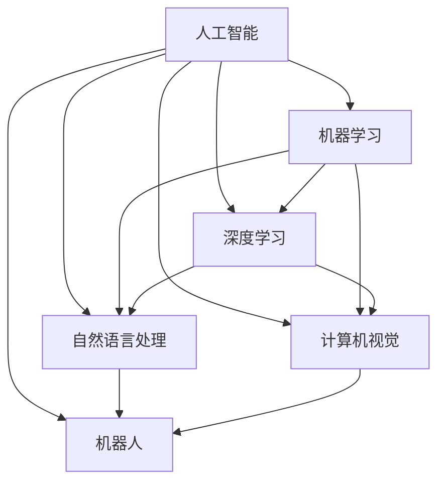
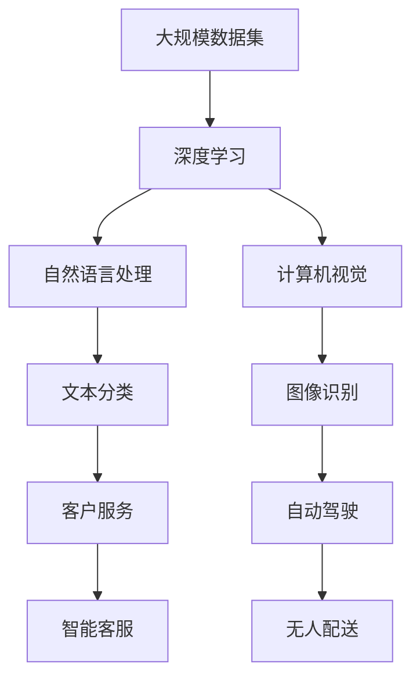
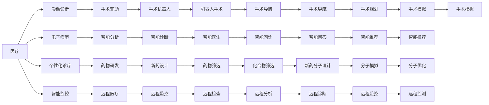

                 

# 李开复：AI 2.0 时代的开发者

## 1. 背景介绍

### 1.1 问题由来
随着人工智能技术的迅猛发展，AI 2.0时代已经到来。在这个新的时代，开发者们面临着前所未有的机遇与挑战。李开复博士作为AI领域的权威专家，以其丰富的行业经验，为开发者们描绘了一幅AI 2.0时代的图景。

### 1.2 问题核心关键点
在AI 2.0时代，开发者的角色和技能需求发生了重大变化。核心关键点包括：
1. **数据驱动的决策**：开发者需要具备处理大规模数据的能力，利用数据分析和机器学习技术，进行业务决策。
2. **跨领域协作**：AI开发需要与多个领域（如自然语言处理、计算机视觉、机器人等）协同合作，形成综合解决方案。
3. **技术集成与创新**：开发者需将最新的人工智能技术，如深度学习、强化学习、自然语言处理等，集成到应用中，并不断创新。
4. **伦理与安全**：AI系统可能涉及个人隐私、道德伦理问题，开发者需具备相应的伦理意识和技术手段。

### 1.3 问题研究意义
李开复博士认为，开发者在AI 2.0时代的重要性不言而喻。AI技术不仅在科技领域带来颠覆性变革，在医疗、金融、教育等行业也具有巨大应用潜力。开发者通过掌握AI技术，能够为各行各业注入新动力，推动社会进步。

## 2. 核心概念与联系

### 2.1 核心概念概述

为更好地理解AI 2.0时代开发者的角色，本节将介绍几个关键概念：

- **人工智能（AI）**：利用计算机算法和数据，使机器能够模拟人类智能行为的技术。
- **机器学习（ML）**：通过数据训练模型，使模型能够进行预测和决策的AI分支。
- **深度学习（DL）**：利用多层神经网络，从大量数据中提取复杂特征，进行高级别分析的技术。
- **自然语言处理（NLP）**：使计算机能够理解和处理人类语言的技术。
- **计算机视觉（CV）**：使计算机能够理解和处理图像和视频的技术。
- **机器人**：结合AI和机械设计，使机器人能够自主执行任务的技术。

这些核心概念之间的逻辑关系可以通过以下Mermaid流程图来展示：



这个流程图展示了几大AI分支之间的联系和协同关系。开发者需要综合掌握这些技术，才能实现AI应用。

### 2.2 概念间的关系

这些核心概念之间存在着紧密的联系，形成了AI应用的完整生态系统。下面我通过几个Mermaid流程图来展示这些概念之间的关系。

#### 2.2.1 AI应用的总体架构



这个流程图展示了AI应用从数据到模型再到具体场景的整个过程。开发者需要通过深度学习从数据中提取特征，利用NLP和CV处理文本和图像数据，最终实现各种应用场景。

#### 2.2.2 AI技术在不同行业的应用



这个流程图展示了AI技术在医疗、教育、金融等不同行业的应用场景。开发者需结合具体业务需求，选择合适的AI技术进行集成和创新。

### 2.3 核心概念的整体架构

最后，我们用一个综合的流程图来展示这些核心概念在大规模应用中的整体架构：

```mermaid
graph TB
    A[大规模数据] --> B[数据清洗]
    B --> C[特征工程]
    C --> D[深度学习]
    D --> E[自然语言处理]
    D --> F[计算机视觉]
    E --> G[文本生成]
    F --> H[图像识别]
    G --> I[自动摘要]
    H --> J[对象检测]
    I --> K[智能推荐]
    J --> L[场景分析]
    K --> M[个性化服务]
    L --> N[智能监控]
    M --> O[智能决策]
    N --> P[异常检测]
    O --> Q[预测分析]
    P --> R[风险评估]
    Q --> S[价值评估]
    R --> T[信用评分]
    S --> U[市场预测]
    T --> V[财务分析]
    U --> W[投资决策]
    V --> X[风险管理]
    W --> Y[资产管理]
    X --> Z[风险预警]
    Y --> AA[智能投顾]
    Z --> AB[风险控制]
    AA --> AC[智能分析]
    AB --> AD[智能风控]
    AC --> AE[智能监控]
    AD --> AF[智能决策]
    AE --> AG[智能预测]
    AF --> AH[智能定价]
    AG --> AI[智能推荐]
    AH --> AJ[智能定价]
    AI --> AK[智能优化]
    AJ --> AK
    AK --> AL[智能调度]
    AL --> AM[智能物流]
    AM --> AN[智能管理]
    AN --> AO[智能预警]
    AO --> AP[智能监测]
    AP --> AQ[智能分析]
    AQ --> AR[智能决策]
    AR --> AS[智能优化]
    AS --> AT[智能控制]
    AT --> AU[智能监控]
    AU --> AV[智能预警]
    AV --> AW[智能分析]
    AW --> AX[智能决策]
    AX --> AY[智能优化]
    AY --> AZ[智能调度]
    AZ --> BA[智能物流]
    BA --> BB[智能管理]
    BB --> BC[智能监测]
    BC --> BD[智能分析]
    BD --> BE[智能决策]
    BE --> BF[智能优化]
    BF --> BG[智能控制]
    BG --> BH[智能监控]
    BH --> BI[智能预警]
    BI --> BJ[智能监测]
    BJ --> BK[智能分析]
    BK --> BL[智能决策]
    BL --> BM[智能优化]
    BM --> BN[智能控制]
    BN --> BO[智能监控]
    BO --> BP[智能预警]
    BP --> BQ[智能监测]
    BQ --> BR[智能分析]
    BR --> BS[智能决策]
    BS --> BT[智能优化]
    BT --> BU[智能控制]
    BU --> BV[智能监控]
    BV --> BW[智能预警]
    BW --> BX[智能监测]
    BX --> BY[智能分析]
    BY --> BZ[智能决策]
    BZ --> CA[智能优化]
    CA --> CB[智能控制]
    CB --> CC[智能监控]
    CC --> CD[智能预警]
    CD --> CE[智能监测]
    CE --> CF[智能分析]
    CF --> CG[智能决策]
    CG --> CH[智能优化]
    CH --> CI[智能控制]
    CI --> CJ[智能监控]
    CJ --> CK[智能预警]
    CK --> CL[智能监测]
    CL --> CM[智能分析]
    CM --> CN[智能决策]
    CN --> CO[智能优化]
    CO --> CP[智能控制]
    CP --> CQ[智能监控]
    CQ --> CR[智能预警]
    CR --> CS[智能监测]
    CS --> CT[智能分析]
    CT --> CU[智能决策]
    CU --> CV[智能优化]
    CV --> CW[智能控制]
    CW --> CX[智能监控]
    CX --> CY[智能预警]
    CY --> CZ[智能监测]
    CZ --> DA[智能分析]
    DA --> DB[智能决策]
    DB --> DC[智能优化]
    DC --> DD[智能控制]
    DD --> DE[智能监控]
    DE --> DF[智能预警]
    DF --> DG[智能监测]
    DG --> DH[智能分析]
    DH --> DI[智能决策]
    DI --> DJ[智能优化]
    DJ --> DK[智能控制]
    DK --> DL[智能监控]
    DL --> DM[智能预警]
    DM --> DN[智能监测]
    DN --> DO[智能分析]
    DO --> DP[智能决策]
    DP --> DQ[智能优化]
    DQ --> DR[智能控制]
    DR --> DS[智能监控]
    DS --> DT[智能预警]
    DT --> DU[智能监测]
    DU --> DV[智能分析]
    DV --> DW[智能决策]
    DW --> DX[智能优化]
    DX --> DY[智能控制]
    DY --> DZ[智能监控]
    DZ --> EA[智能预警]
    EA --> EB[智能监测]
    EB --> EC[智能分析]
    EC --> ED[智能决策]
    ED --> EE[智能优化]
    EE --> EF[智能控制]
    EF --> EG[智能监控]
    EG --> EH[智能预警]
    EH --> EI[智能监测]
    EI --> EJ[智能分析]
    EJ --> EK[智能决策]
    EK --> EL[智能优化]
    EL --> EM[智能控制]
    EM --> EN[智能监控]
    EN --> EO[智能预警]
    EO --> EP[智能监测]
    EP --> EQ[智能分析]
    EQ --> ER[智能决策]
    ER --> ES[智能优化]
    ES --> ET[智能控制]
    ET --> EU[智能监控]
    EU --> EV[智能预警]
    EV --> EW[智能监测]
    EW --> EX[智能分析]
    EX --> EY[智能决策]
    EY --> EZ[智能优化]
    EZ --> FA[智能控制]
    FA --> FB[智能监控]
    FB --> FC[智能预警]
    FC --> FD[智能监测]
    FD --> FE[智能分析]
    FE --> FF[智能决策]
    FF --> FG[智能优化]
    FG --> FH[智能控制]
    FH --> FI[智能监控]
    FI --> FJ[智能预警]
    FJ --> FK[智能监测]
    FK --> FL[智能分析]
    FL --> FM[智能决策]
    FM --> FN[智能优化]
    FN --> FO[智能控制]
    FO --> FP[智能监控]
    FP --> FQ[智能预警]
    FQ --> FR[智能监测]
    FR --> FS[智能分析]
    FS --> FT[智能决策]
    FT --> FU[智能优化]
    FU --> FV[智能控制]
    FV --> FW[智能监控]
    FW --> FX[智能预警]
    FX --> FY[智能监测]
    FY --> FZ[智能分析]
    FZ --> GA[智能决策]
    GA --> GB[智能优化]
    GB --> GC[智能控制]
    GC --> GD[智能监控]
    GD --> GE[智能预警]
    GE --> GF[智能监测]
    GF --> GG[智能分析]
    GG --> GH[智能决策]
    GH --> GI[智能优化]
    GI --> GJ[智能控制]
    GJ --> GK[智能监控]
    GK --> GL[智能预警]
    GL --> GM[智能监测]
    GM --> GN[智能分析]
    GN --> GO[智能决策]
    GO --> GP[智能优化]
    GP --> GQ[智能控制]
    GQ --> GR[智能监控]
    GR --> GS[智能预警]
    GS --> GT[智能监测]
    GT --> GU[智能分析]
    GU -->GV[智能决策]
    GV --> GW[智能优化]
    GW --> GX[智能控制]
    GX --> GY[智能监控]
    GY --> GZ[智能预警]
    GZ --> HA[智能监测]
    HA --> HB[智能分析]
    HB --> HC[智能决策]
    HC --> HD[智能优化]
    HD --> HE[智能控制]
    HE --> HF[智能监控]
    HF --> HG[智能预警]
    HG --> HH[智能监测]
    HH --> HI[智能分析]
    HI --> HJ[智能决策]
    HJ --> HK[智能优化]
    HK --> HL[智能控制]
    HL --> HM[智能监控]
    HM --> HN[智能预警]
    HN --> HO[智能监测]
    HO --> HP[智能分析]
    HP --> HQ[智能决策]
    HQ --> HR[智能优化]
    HR --> HS[智能控制]
    HS --> HT[智能监控]
    HT --> HU[智能预警]
    HU --> HV[智能监测]
    HV --> HW[智能分析]
    HW --> HX[智能决策]
    HX -->HY[智能优化]
    HY --> HZ[智能控制]
    HZ --> IA[智能监控]
    IA --> IB[智能预警]
    IB --> IC[智能监测]
    IC --> ID[智能分析]
    ID --> IE[智能决策]
    IE --> IF[智能优化]
    IF --> IG[智能控制]
    IG --> IH[智能监控]
    IH --> II[智能预警]
    II --> IJ[智能监测]
    IJ --> IK[智能分析]
    IK --> IL[智能决策]
    IL --> IM[智能优化]
    IM --> IN[智能控制]
    IN --> IO[智能监控]
    IO --> IP[智能预警]
    IP --> IQ[智能监测]
    IQ --> IR[智能分析]
    IR --> IS[智能决策]
    IS --> IT[智能优化]
    IT --> IU[智能控制]
    IU --> IV[智能监控]
    IV --> IW[智能预警]
    IW --> IX[智能监测]
    IX --> IY[智能分析]
    IY --> IZ[智能决策]
    IZ -->JA[智能优化]
    JA --> JB[智能控制]
    JB --> JC[智能监控]
    JC --> JD[智能预警]
    JD --> JE[智能监测]
    JE --> JF[智能分析]
    JF --> JG[智能决策]
    JG --> JH[智能优化]
    JH --> JI[智能控制]
    JI --> JJ[智能监控]
    JJ --> JK[智能预警]
    JK --> JL[智能监测]
    JL --> JM[智能分析]
    JM --> JN[智能决策]
    JN --> JO[智能优化]
    JO --> JP[智能控制]
    JP --> JQ[智能监控]
    JQ --> JR[智能预警]
    JR --> JS[智能监测]
    JS --> JT[智能分析]
    JT --> JU[智能决策]
    JU --> JV[智能优化]
    JV --> JW[智能控制]
    JW --> JX[智能监控]
    JX --> JY[智能预警]
    JY --> JZ[智能监测]
    JZ -->KA[智能分析]
    KA --> KB[智能决策]
    KB --> KC[智能优化]
    KC --> KD[智能控制]
    KD --> KE[智能监控]
    KE --> KF[智能预警]
    KF --> KG[智能监测]
    KG --> KH[智能分析]
    KH --> KI[智能决策]
    KI --> KJ[智能优化]
    KJ --> KK[智能控制]
    KK --> KL[智能监控]
    KL --> KM[智能预警]
    KM --> KN[智能监测]
    KN --> KO[智能分析]
    KO --> KP[智能决策]
    KP --> KQ[智能优化]
    KQ --> KR[智能控制]
    KR --> KS[智能监控]
    KS -->KT[智能预警]
    KT --> KU[智能监测]
    KU --> KV[智能分析]
    KV --> KW[智能决策]
    KW --> KX[智能优化]
    KX --> KY[智能控制]
    KY --> KZ[智能监控]
    KZ -->LA[智能预警]
    LA --> LB[智能监测]
    LB --> LC[智能分析]
    LC --> LD[智能决策]
    LD --> LE[智能优化]
    LE --> LF[智能控制]
    LF --> LG[智能监控]
    LG --> LH[智能预警]
    LH --> LI[智能监测]
    LI --> LJ[智能分析]
    LJ --> LK[智能决策]
    LK --> LL[智能优化]
    LL --> LM[智能控制]
    LM --> LN[智能监控]
    LN --> LO[智能预警]
    LO --> LP[智能监测]
    LP --> LQ[智能分析]
    LQ --> LR[智能决策]
    LR --> LS[智能优化]
    LS --> LT[智能控制]
    LT --> LU[智能监控]
    LU --> LV[智能预警]
    LV --> LW[智能监测]
    LW --> LX[智能分析]
    LX --> LY[智能决策]
    LY --> LZ[智能优化]
    LZ -->MA[智能控制]
    MA --> MB[智能监控]
    MB --> MC[智能预警]
    MC --> MD[智能监测]
    MD --> ME[智能分析]
    ME --> MF[智能决策]
    MF --> MG[智能优化]
    MG --> MH[智能控制]
    MH --> MI[智能监控]
    MI --> MJ[智能预警]
    MJ --> MK[智能监测]
    MK --> ML[智能分析]
    ML --> MM[智能决策]
    MM --> MN[智能优化]
    MN --> MO[智能控制]
    MO --> MP[智能监控]
    MP --> MQ[智能预警]
    MQ --> MR[智能监测]
    MR --> MS[智能分析]
    MS --> MT[智能决策]
    MT --> MU[智能优化]
    MU --> MV[智能控制]
    MV --> MW[智能监控]
    MW --> MX[智能预警]
    MX --> MY[智能监测]
    MY --> MZ[智能分析]
    MZ --> NA[智能决策]
    NA --> NB[智能优化]
    NB --> NC[智能控制]
    NC --> ND[智能监控]
    ND --> NE[智能预警]
    NE --> NF[智能监测]
    NF --> NG[智能分析]
    NG --> NH[智能决策]
    NH --> NI[智能优化]
    NI --> NJ[智能控制]
    NJ --> NK[智能监控]
    NK --> NL[智能预警]
    NL --> NM[智能监测]
    NM --> NN[智能分析]
    NN --> NO[智能决策]
    NO --> NP[智能优化]
    NP --> NQ[智能控制]
    NQ --> NR[智能监控]
    NR --> NS[智能预警]
    NS --> NT[智能监测]
    NT --> NU[智能分析]
    NU --> NV[智能决策]
    NV --> NW[智能优化]
    NW --> NX[智能控制]
    NX --> NY[智能监控]
    NY --> NZ[智能预警]
    NZ -->OA[智能监测]
    OA --> OB[智能分析]
    OB --> OC[智能决策]
    OC --> OD[智能优化]
    OD --> OE[智能控制]
    OE --> OF[智能监控]
    OF --> OG[智能预警]
    OG --> OH[智能监测]
    OH --> OI[智能分析]
    OI --> OJ[智能决策]
    OJ --> OK[智能优化]
    OK --> OL[智能控制]
    OL --> OM[智能监控]
    OM --> ON[智能预警]
    ON --> OP[智能监测]
    OP --> OQ[智能分析]
    OQ --> OR[智能决策]
    OR --> OS[智能优化]
    OS --> OT[智能控制]
    OT --> OU[智能监控]
    OU -->OV[智能预警]
    OV --> OW[智能监测]
    OW --> OX[智能分析]
    OX --> OY[智能决策]
    OY --> OZ[智能优化]
    OZ -->PA[智能控制]
    PA --> PB[智能监控]
    PB --> PC[智能预警]
    PC --> PD[智能监测]
    PD --> PE[智能分析]
    PE --> PF[智能决策]
    PF --> PG[智能优化]
    PG --> PH[智能控制]
    PH --> PI[智能监控]
    PI --> PJ[智能预警]
    PJ --> PK[智能监测]
    PK --> PL[智能分析]
    PL --> PM[智能决策]
    PM --> PN[智能优化]
    PN --> PO[智能控制]
    PO --> PP[智能监控]
    PP --> PQ[智能预警]
    PQ --> PR[智能监测]
    PR --> PS[智能分析]
    PS --> PT[智能决策]
    PT -->PU[智能优化]
    PU --> PV[智能控制]
    PV --> PW[智能监控]
    PW --> PX[智能预警]
    PX --> PY[智能监测]
    PY --> PZ[智能分析]
    PZ -->QA[智能决策]
    QA --> QB[智能优化]
    QB --> QC[智能控制]
    QC --> QD[智能监控]
    QD --> QE[智能预警]
    QE --> QF[智能监测]
    QF --> QG[智能分析]
    QG --> QH[智能决策]
    QH --> QI[智能优化]
    QI --> QJ[智能控制]
    QJ --> QK[智能监控]
    QK --> QL[智能预警]
    QL --> QM[智能监测]
    QM --> QN[智能分析]
    QN --> QO[智能决策]
    QO --> QP[智能优化]
    QP --> QQ[智能控制]
    QQ --> QR[智能监控]
    QR --> QS[智能预警]
    QS --> QT[智能监测]
    QT --> QU[智能分析]
    QU --> QV[智能决策]
    QV --> QW[智能优化]
    QW --> QX[智能控制]
    QX --> QY[智能监控]
    QY --> QZ[智能预警]
    QZ -->RA[智能监测]
    RA --> RB[智能分析]
    RB --> RC[智能决策]
    RC --> RD[智能优化]
    RD --> RE[智能控制]
    RE --> RF[智能监控]
    RF --> RG[智能预警]
    RG --> RH[智能监测]
    RH --> RI[智能分析]
    RI --> RJ[智能决策]
    RJ --> RK[智能优化]
    RK --> RL[智能控制]
    RL --> RM[智能监控]
    RM --> RN[智能预警]
    RN --> RO[智能监测]
    RO --> RP[智能分析]
    RP --> RQ[智能决策]
    RQ --> RR[智能优化]
    RR --> RS[智能控制]
    RS --> RT[智能监控]
    RT --> RU[智能预警]
    RU --> RV[智能监测]
    RV --> RW[智能分析]
    RW --> RX[智能决策]
    RX --> RY[智能优化]
    RY --> RZ[智能控制]
    RZ -->SA[智能监控]
    SA --> SB[智能预警]
    SB --> SC[智能监测]
    SC --> SD[智能分析]
    SD --> SE[智能决策]
    SE --> SF[智能优化]
    SF --> SG[智能控制]
    SG --> SH[智能监控]
    SH --> SI[智能预警]
    SI --> SJ[智能监测]
    SJ --> SK[智能分析]
    SK --> SL[智能决策]
    SL --> SM[智能优化]
    SM --> SN[智能控制]
    SN --> SO[智能监控]
    SO --> SP[智能预警]
    SP --> SQ[智能监测]
    SQ --> SR[智能分析]
    SR --> SS[智能决策]
    SS --> ST[智能优化]
    ST --> SU[智能控制]
    SU --> SV[智能监控]
    SV --> SW[智能预警]
    SW --> SX[智能监测]
    SX --> SY[智能分析]
    SY --> SZ[智能决策]
    SZ -->TA[智能优化]
    TA --> TB[智能控制]
    TB --> TC[智能监控]
    TC --> TD[智能预警]
    TD --> TE[智能监测]
    TE --> TF[智能分析]
    TF --> TG[智能决策]
    TG --> TH[智能优化]
    TH --> TI[智能控制]
    TI --> TJ[智能监控]
    TJ --> TK[智能预警]
    TK --> TL[智能监测]
    TL --> TM[智能分析]
    TM --> TN[智能决策]
    TN --> TO[智能优化]
    TO --> TP[智能控制]
    TP --> TQ[智能监控]
    TQ --> TR[智能预警]
    TR --> TS[智能监测]
    TS --> TT[智能分析]
    TT --> TU[智能决策]
    TU --> TV[智能优化]
    TV --> TW[智能控制]
    TW --> TX[智能监控]
    TX --> TY[智能预警]
    TY --> TZ[智能监测]
    TZ -->UA[智能分析]
    UA --> UB[智能决策]
    UB --> UC[智能优化]
    UC --> UD[智能控制

