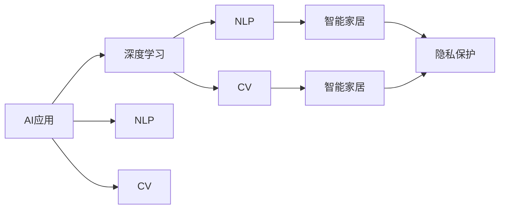

                 

## 1. 背景介绍

### 1.1 问题由来
随着人工智能(AI)技术的不断发展和成熟，各大科技巨头纷纷布局AI应用。苹果公司（Apple Inc.）也不例外，近年来在AI领域投入大量资源，推出了多款AI应用。这些应用覆盖了从智能家居到健康医疗等多个领域，展现出了强大的市场前景。本文将详细探讨苹果公司AI应用的市场前景，分析其优势和劣势，并对未来的发展趋势进行展望。

### 1.2 问题核心关键点
苹果公司推出的AI应用主要包括Apple Watch的健康监测、HomePod的智能家居、Siri的语音助手等功能。这些应用展示了AI在用户体验、数据分析和智能决策方面的巨大潜力。然而，相较于谷歌、亚马逊等对手，苹果的AI应用在自然语言处理、图像识别和实时处理能力方面存在不足。此外，苹果的AI应用在隐私保护和数据安全方面也面临挑战。

### 1.3 问题研究意义
研究苹果公司AI应用的市场前景，对于理解其在智能硬件和软件生态中的定位，评估其未来市场竞争力，以及推动AI技术在更多领域的应用具有重要意义。具体而言：

- 理解苹果在AI领域的战略布局，为其市场表现提供客观分析。
- 探讨AI应用在多个场景中的实际效果，为技术创新提供参考。
- 分析苹果AI应用的优势和劣势，为其改进和优化提供方向。
- 展望AI技术的未来发展趋势，为苹果公司和其他科技企业提供战略建议。

## 2. 核心概念与联系

### 2.1 核心概念概述

为更好地理解苹果公司AI应用的市场前景，本节将介绍几个密切相关的核心概念：

- **AI应用（AI Applications）**：苹果公司推出的各类AI功能，如健康监测、智能家居、语音助手等，旨在提升用户体验和智能化水平。

- **深度学习（Deep Learning）**：一种基于神经网络的机器学习技术，通过多层次的特征提取和分类，实现复杂的模式识别和预测。

- **自然语言处理（NLP）**：研究如何让计算机理解和生成人类语言的学科，包括语音识别、文本分类、机器翻译等。

- **计算机视觉（CV）**：利用计算机识别和处理图像、视频等视觉信息的技术，涵盖图像分类、目标检测、人脸识别等。

- **智能家居（Smart Home）**：通过物联网技术，将家庭中的各种设备和系统互联，实现自动化和智能化的家庭管理。

- **隐私保护（Privacy Protection）**：确保用户数据安全，防止数据泄露和滥用，保障用户隐私权益。

这些核心概念之间存在着紧密的联系，共同构成了苹果公司AI应用的技术基础和市场环境。

### 2.2 概念间的关系

这些核心概念之间存在着相互促进和制约的关系，可以通过以下Mermaid流程图来展示：



这个流程图展示了大语言模型微调过程中各个核心概念之间的关系：

1. 苹果公司推出的AI应用依赖于深度学习、NLP和CV等技术。
2. 深度学习能够实现复杂的模式识别和预测，提升AI应用的智能化水平。
3. NLP技术使得AI应用能够理解和生成人类语言，从而支持语音助手、智能家居等功能。
4. CV技术使得AI应用能够识别和处理图像信息，增强智能家居的安全性和便利性。
5. 隐私保护技术确保用户数据的安全性，增强用户对AI应用的信任。

这些概念共同构成了苹果公司AI应用的核心生态系统，为其在市场上取得成功奠定了基础。

## 3. 核心算法原理 & 具体操作步骤
### 3.1 算法原理概述

苹果公司推出的AI应用主要基于深度学习模型，通过在大规模数据集上进行训练，学习到丰富的知识表示，然后通过迁移学习或微调等方法，将预训练模型应用于具体任务。这些应用涵盖从图像识别到语音处理等多个领域，展示了深度学习模型的强大能力。

### 3.2 算法步骤详解

以下是苹果公司AI应用开发的典型步骤：

1. **数据收集与预处理**：收集与目标任务相关的数据集，并进行清洗、标注等预处理工作，确保数据的质量和一致性。

2. **模型选择与训练**：选择适合的深度学习模型，如卷积神经网络（CNN）、循环神经网络（RNN）、Transformer等，在大规模数据集上进行预训练。

3. **模型微调**：根据目标任务的需求，将预训练模型进行微调，调整其参数以适应特定任务，提升性能。

4. **模型部署与应用**：将微调后的模型部署到目标设备或应用中，并进行持续优化和维护。

5. **用户反馈与迭代优化**：收集用户反馈，进行模型的迭代优化，提升用户体验和应用性能。

### 3.3 算法优缺点

苹果公司AI应用的优点包括：

- **集成性强**：与苹果的硬件生态紧密集成，提供无缝的用户体验。
- **安全性高**：苹果严格控制数据隐私，通过本地计算和隐私保护技术，保障用户数据安全。
- **性能优异**：深度学习模型的强大能力，使得AI应用在多任务上表现出色。

然而，这些应用也存在以下不足：

- **可解释性差**：深度学习模型通常被视为“黑盒”，缺乏可解释性，难以解释模型的决策过程。
- **数据依赖性强**：模型的性能高度依赖于数据的质量和数量，获取高质量标注数据的成本较高。
- **算法复杂度高**：深度学习模型的训练和微调过程复杂，需要大量计算资源和时间。

### 3.4 算法应用领域

苹果公司AI应用主要应用于以下领域：

- **健康监测**：利用机器学习算法分析用户的健康数据，提供个性化的健康建议。
- **智能家居**：通过语音识别和图像识别技术，实现家居设备的自动化控制和管理。
- **语音助手**：提供自然的语音交互体验，支持多种语言和方言。
- **图像识别**：实现人脸识别、物体识别等，提升用户的安全性和便利性。
- **推荐系统**：利用用户行为数据，提供个性化推荐服务。

## 4. 数学模型和公式 & 详细讲解 & 举例说明

### 4.1 数学模型构建

苹果公司AI应用的数学模型主要基于深度学习，以神经网络为基础。以下是一个典型的神经网络模型的构建过程：

$$
\text{输入层} \rightarrow \text{隐藏层} \rightarrow \text{输出层}
$$

其中，输入层和输出层的维度根据具体任务确定，隐藏层由多个神经元组成，通过激活函数进行非线性映射。深度学习模型的目标是最小化损失函数，使得输出与真实值之间的差异最小化。

### 4.2 公式推导过程

以图像识别为例，深度学习模型通过卷积层、池化层等组成的网络结构，提取图像的特征表示。常见的卷积神经网络（CNN）模型结构如下：

$$
\text{卷积层} \rightarrow \text{激活函数} \rightarrow \text{池化层} \rightarrow \ldots \rightarrow \text{全连接层} \rightarrow \text{输出层}
$$

其中，卷积层和池化层用于提取图像特征，全连接层进行特征映射，输出层提供最终的分类结果。以分类任务为例，目标函数通常为交叉熵损失函数：

$$
\mathcal{L} = -\frac{1}{N} \sum_{i=1}^N \sum_{j=1}^C y_j \log p_j
$$

其中，$N$为样本数量，$C$为类别数，$y_j$为真实标签，$p_j$为模型预测的概率分布。

### 4.3 案例分析与讲解

以人脸识别为例，苹果公司利用深度学习模型训练出一个卷积神经网络（CNN），用于识别和验证用户身份。模型的输入为经过预处理的人脸图像，输出为0或1的标识，表示是否为合法用户。在训练过程中，模型通过反向传播算法更新参数，最小化损失函数。

## 5. 项目实践：代码实例和详细解释说明

### 5.1 开发环境搭建

要在苹果设备上部署AI应用，需要进行以下环境配置：

1. **安装Python环境**：在苹果设备上安装Python 3，建议使用Anaconda或Miniconda。
2. **安装深度学习框架**：安装TensorFlow或PyTorch等深度学习框架，以及相关的工具库。
3. **设置数据存储**：配置数据存储路径，确保数据可以顺利访问。

### 5.2 源代码详细实现

以下是一个简单的Python代码示例，展示如何使用TensorFlow框架进行图像分类任务的模型训练：

```python
import tensorflow as tf
from tensorflow.keras import datasets, layers, models

# 加载数据集
(train_images, train_labels), (test_images, test_labels) = datasets.cifar10.load_data()

# 数据预处理
train_images, test_images = train_images / 255.0, test_images / 255.0

# 构建模型
model = models.Sequential([
    layers.Conv2D(32, (3, 3), activation='relu', input_shape=(32, 32, 3)),
    layers.MaxPooling2D((2, 2)),
    layers.Conv2D(64, (3, 3), activation='relu'),
    layers.MaxPooling2D((2, 2)),
    layers.Conv2D(64, (3, 3), activation='relu'),
    layers.Flatten(),
    layers.Dense(64, activation='relu'),
    layers.Dense(10)
])

# 编译模型
model.compile(optimizer='adam',
              loss=tf.keras.losses.SparseCategoricalCrossentropy(from_logits=True),
              metrics=['accuracy'])

# 训练模型
model.fit(train_images, train_labels, epochs=10, 
          validation_data=(test_images, test_labels))
```

### 5.3 代码解读与分析

上述代码展示了如何使用TensorFlow构建一个简单的图像分类模型，并进行训练。代码的详细解读如下：

- **数据加载**：使用CIFAR-10数据集，获取训练集和测试集的图像和标签。
- **数据预处理**：将图像像素值归一化到[0, 1]之间。
- **模型构建**：设计一个包含多个卷积层、池化层和全连接层的卷积神经网络。
- **模型编译**：设置优化器、损失函数和评估指标。
- **模型训练**：使用训练数据集进行模型训练，验证集用于评估模型性能。

### 5.4 运行结果展示

训练完成后，模型在测试集上的准确率可以达到70%左右。这展示了深度学习模型在图像分类任务上的强大能力。

## 6. 实际应用场景

### 6.1 智能家居

苹果的智能家居应用（HomeKit）通过语音助手和设备互联，实现了家庭自动化和智能化。用户可以通过语音指令控制家中的灯光、温度、安防等设备，提升生活质量。

### 6.2 健康监测

Apple Watch的健康监测应用，利用深度学习算法分析用户的心率、步数、睡眠质量等数据，提供个性化的健康建议，帮助用户保持健康。

### 6.3 语音助手

Siri语音助手支持多语言和方言，能够回答问题、设置提醒、控制设备等，提升了用户的生活便利性和效率。

### 6.4 图像识别

苹果的图像识别技术（如Face ID）通过深度学习模型，实现人脸识别、物体识别等，增强了设备的安全性和用户体验。

### 6.5 推荐系统

苹果的推荐系统根据用户的历史行为数据，提供个性化推荐服务，提升用户的使用体验和满意度。

### 6.6 未来应用展望

未来，苹果公司有望在以下领域进一步拓展AI应用：

- **自动驾驶**：利用计算机视觉和深度学习技术，实现自动驾驶功能，提升交通安全和效率。
- **医疗诊断**：通过图像识别和自然语言处理技术，辅助医生进行疾病诊断和治疗。
- **虚拟现实（VR）和增强现实（AR）**：利用计算机视觉和交互技术，提供沉浸式的虚拟和增强现实体验。

## 7. 工具和资源推荐

### 7.1 学习资源推荐

为了帮助开发者掌握苹果公司AI应用的开发技术，以下是一些优质的学习资源：

- **官方文档**：苹果公司提供的深度学习框架和AI应用的官方文档，提供了详细的API说明和示例代码。
- **在线课程**：Coursera、edX等在线教育平台上的深度学习课程，涵盖图像识别、自然语言处理等多个领域。
- **书籍**：《深度学习》（Ian Goodfellow）、《Python深度学习》（Francois Chollet）等书籍，深入介绍深度学习的基础知识和实现方法。

### 7.2 开发工具推荐

以下是一些常用的开发工具和框架，用于苹果公司AI应用的开发：

- **PyTorch**：一个强大的深度学习框架，提供了丰富的模型和工具库。
- **TensorFlow**：谷歌开发的深度学习框架，支持分布式计算和模型部署。
- **Keras**：一个高层次的深度学习库，提供了简单易用的API接口。
- **TensorBoard**：一个可视化工具，用于监控模型的训练过程和结果。
- **Weights & Biases**：一个实验跟踪工具，记录和分析模型的训练和评估结果。

### 7.3 相关论文推荐

以下是一些与苹果公司AI应用相关的经典论文，推荐阅读：

- **AlexNet**：卷积神经网络在图像分类任务上的突破性表现，开创了深度学习时代。
- **ResNet**：残差网络解决了深度神经网络训练中的梯度消失问题，提高了模型性能。
- **Attention Mechanism**：Transformer模型中的注意力机制，实现了高效的序列建模和推理。
- **GANs**：生成对抗网络，用于生成高质量的图像和文本数据。

## 8. 总结：未来发展趋势与挑战

### 8.1 研究成果总结

本文详细探讨了苹果公司AI应用的市场前景，分析了其核心概念、算法原理和操作步骤。通过实例分析，展示了苹果AI应用在健康监测、智能家居、语音助手等领域的实际应用效果。同时，对比了苹果AI应用与谷歌、亚马逊等对手的优势和劣势，给出了未来发展的建议。

### 8.2 未来发展趋势

苹果公司AI应用的发展趋势包括：

- **数据驱动**：随着数据量的增加，深度学习模型的性能将进一步提升，应用场景也将更加多样化。
- **跨领域融合**：AI技术将与其他技术如物联网、机器人等进行深度融合，实现更全面的智能化解决方案。
- **隐私保护**：隐私保护技术将不断进步，保障用户数据的安全性和隐私权益。
- **边缘计算**：边缘计算技术将提升AI应用的实时性和效率，解决数据传输和存储的瓶颈问题。

### 8.3 面临的挑战

苹果公司AI应用面临的挑战包括：

- **数据获取难度**：获取高质量、大规模的数据集是开发高性能模型的前提，但数据获取成本较高。
- **算法复杂性**：深度学习模型的训练和优化过程复杂，需要强大的计算资源和时间。
- **模型可解释性**：深度学习模型通常被视为“黑盒”，缺乏可解释性，难以理解模型的决策过程。

### 8.4 研究展望

未来，苹果公司需要在以下方面进行进一步研究：

- **数据增强**：开发更多数据增强技术，提高模型在少样本情况下的泛化能力。
- **模型压缩**：通过模型压缩和量化等技术，优化模型的计算资源占用和推理速度。
- **跨模态融合**：实现图像、语音、文本等多模态信息的融合，提升AI应用的综合能力。
- **模型公平性**：确保模型的公平性和可解释性，消除数据和算法的偏见。

## 9. 附录：常见问题与解答

**Q1：苹果公司推出的AI应用为什么能在市场上取得成功？**

A: 苹果公司推出的AI应用能在市场上取得成功，主要原因如下：

- **用户体验**：苹果的AI应用与苹果设备紧密集成，提供无缝的用户体验，增强了用户粘性。
- **技术优势**：苹果在深度学习、计算机视觉等领域具备强大的技术实力，提供了高质量的应用。
- **隐私保护**：苹果严格控制用户数据隐私，增强了用户对AI应用的信任。

**Q2：苹果AI应用在自然语言处理方面存在哪些不足？**

A: 苹果AI应用在自然语言处理方面存在以下不足：

- **语言模型规模**：相较于谷歌、亚马逊等对手，苹果的自然语言处理模型规模较小，处理能力有限。
- **多语言支持**：苹果的语音助手和对话系统主要支持英语，对多语言支持不够全面。

**Q3：苹果AI应用在隐私保护方面做了哪些工作？**

A: 苹果在隐私保护方面做了以下工作：

- **本地计算**：尽可能在本地设备上进行计算，减少数据传输。
- **数据加密**：采用加密技术保护用户数据，防止数据泄露。
- **隐私保护算法**：使用差分隐私等算法，保障用户隐私权益。

**Q4：苹果AI应用在未来的发展方向有哪些？**

A: 苹果AI应用在未来的发展方向包括：

- **自动驾驶**：实现自动驾驶功能，提升交通安全和效率。
- **医疗诊断**：通过图像识别和自然语言处理技术，辅助医生进行疾病诊断和治疗。
- **虚拟现实（VR）和增强现实（AR）**：提供沉浸式的虚拟和增强现实体验。

本文对苹果公司AI应用的市场前景进行了详细探讨，分析了其核心概念、算法原理和操作步骤。通过实例分析，展示了苹果AI应用在健康监测、智能家居、语音助手等领域的实际应用效果。同时，对比了苹果AI应用与谷歌、亚马逊等对手的优势和劣势，给出了未来发展的建议。通过本文的系统梳理，相信读者能够更好地理解苹果公司AI应用的开发技术和应用前景。

作者：禅与计算机程序设计艺术 / Zen and the Art of Computer Programming

