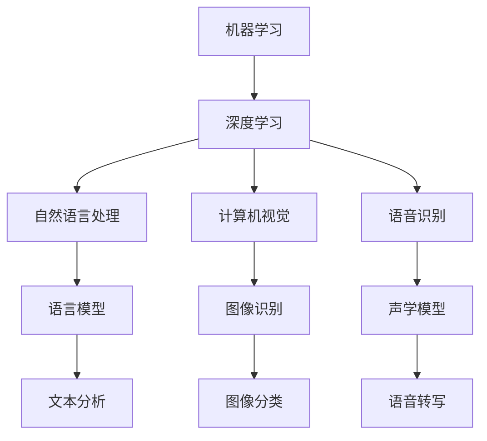

                 

# 李开复：苹果发布AI应用的机会

## 1. 背景介绍

在过去几年中，人工智能（AI）技术迅猛发展，已经从实验室走进了现实世界。许多企业，包括苹果（Apple），正在积极探索AI应用的潜力。李开复，作为全球知名的人工智能专家和投资者，一直关注着AI技术的最新动态，并对苹果未来在AI领域的潜力进行了深入分析和预测。本文将通过李开复的观点，探讨苹果发布AI应用的机会，以及这一领域的未来发展趋势。

### 1.1 李开复简介

李开复，世界著名的AI专家，曾任微软亚洲研究院院长、Google首席科学家，现任创新工场（Innovation Works）CEO。他发表了多部关于人工智能的畅销书籍，如《人工智能：一种现代方法》和《AI Superpowers：中国的挑战与机遇》。李开复在AI领域具有深厚的理论功底和丰富的实践经验，对AI应用前景有着独到见解。

## 2. 核心概念与联系

### 2.1 核心概念概述

AI应用的核心概念主要包括机器学习、深度学习、自然语言处理（NLP）、计算机视觉、语音识别等技术。这些技术相互关联，共同构成了AI技术的完整体系。

- **机器学习**：通过算法让机器从数据中学习规律，并应用于新数据上的过程。
- **深度学习**：一种机器学习技术，使用多层神经网络进行特征提取和模式识别。
- **自然语言处理**：使计算机能够理解、处理和生成人类语言的技术。
- **计算机视觉**：使计算机能够“看”和理解图像、视频的技术。
- **语音识别**：使计算机能够理解人类语音的技术。

### 2.2 核心概念的关系

AI应用的这些核心概念之间存在着紧密的联系。例如，深度学习可以应用于NLP中的语言模型，计算机视觉中的图像识别，以及语音识别中的声学模型。而自然语言处理又可以为语音识别提供语言上下文，提升识别精度。这些技术相互补充，共同推动AI应用的发展。

以下是一个简单的Mermaid流程图，展示了这些核心概念之间的关系：



这个流程图展示了各个核心概念之间的联系和应用场景。通过理解这些概念之间的关系，我们可以更好地把握AI应用的技术基础和发展潜力。

## 3. 核心算法原理 & 具体操作步骤

### 3.1 算法原理概述

AI应用的开发通常遵循以下步骤：

1. **数据收集和预处理**：收集并清洗用于训练模型的数据。
2. **模型选择和训练**：选择适合的模型架构，并使用训练数据对其进行训练。
3. **模型评估和调优**：使用验证数据评估模型性能，并进行参数调整。
4. **应用部署**：将训练好的模型部署到实际应用中，并对其进行监测和优化。

### 3.2 算法步骤详解

#### 3.2.1 数据收集和预处理

数据收集和预处理是AI应用开发的基础。数据可以来自各种来源，如传感器、摄像头、数据库等。预处理步骤包括数据清洗、归一化、特征提取等。

#### 3.2.2 模型选择和训练

选择合适的模型架构非常重要。深度学习模型如卷积神经网络（CNN）、循环神经网络（RNN）和变压器（Transformer）等，已经在计算机视觉、语音识别和自然语言处理等领域取得了显著成果。模型训练通常使用GPU或TPU等高性能设备进行，以加快训练速度。

#### 3.2.3 模型评估和调优

模型训练完成后，需要使用验证数据进行评估。常用的评估指标包括准确率、召回率、F1分数等。调优过程包括调整超参数、使用正则化技术、引入数据增强等。

#### 3.2.4 应用部署

将训练好的模型部署到实际应用中，通常需要使用框架如TensorFlow、PyTorch、MXNet等。部署过程中需要考虑性能、可扩展性和安全性。

### 3.3 算法优缺点

AI应用的开发和部署具有以下优点：

- **高精度**：深度学习模型可以学习复杂的模式和特征，提高模型的预测精度。
- **自动化**：模型训练和调优过程可以自动化进行，减少人工干预。
- **可扩展性**：模型可以部署在各种设备和平台上，实现大规模应用。

然而，AI应用开发也存在一些缺点：

- **数据需求大**：高质量的标注数据是模型训练的前提，但数据收集和标注成本较高。
- **计算资源需求高**：深度学习模型通常需要大量的计算资源，部署和维护成本较高。
- **模型复杂度高**：模型结构复杂，难以理解和调试，可能导致误诊和误报。

### 3.4 算法应用领域

AI应用在医疗、金融、零售、制造等多个领域得到了广泛应用，以下是一些典型的应用场景：

- **医疗**：使用AI进行疾病诊断、治疗方案推荐、药物研发等。
- **金融**：使用AI进行风险评估、欺诈检测、投资组合优化等。
- **零售**：使用AI进行顾客行为分析、库存管理、个性化推荐等。
- **制造**：使用AI进行质量检测、设备维护、生产优化等。

## 4. 数学模型和公式 & 详细讲解 & 举例说明

### 4.1 数学模型构建

AI应用的数学模型通常包括输入层、隐藏层和输出层。以卷积神经网络（CNN）为例，其结构如下：

```
输入层 -> 卷积层 -> 池化层 -> 隐藏层 -> 全连接层 -> 输出层
```

### 4.2 公式推导过程

以分类问题为例，CNN的输出层通常是一个softmax函数，用于将模型输出转化为概率分布。softmax函数的公式如下：

$$
softmax(x)_i = \frac{e^{x_i}}{\sum_j e^{x_j}}
$$

其中 $x$ 是输入向量，$x_i$ 是向量中的第 $i$ 个元素，$\sum_j$ 是对所有元素求和。softmax函数的输出是一个概率分布，表示每个类别的概率。

### 4.3 案例分析与讲解

以图像识别为例，CNN在图像分类任务上表现优异。例如，ImageNet数据集上的分类任务，CNN模型通过多层卷积和池化，提取图像的特征，然后通过全连接层进行分类。以下是一个简单的Python代码示例：

```python
import tensorflow as tf
from tensorflow.keras import layers, models

model = models.Sequential([
    layers.Conv2D(32, (3, 3), activation='relu', input_shape=(28, 28, 1)),
    layers.MaxPooling2D((2, 2)),
    layers.Conv2D(64, (3, 3), activation='relu'),
    layers.MaxPooling2D((2, 2)),
    layers.Conv2D(64, (3, 3), activation='relu'),
    layers.Flatten(),
    layers.Dense(64, activation='relu'),
    layers.Dense(10)
])

model.compile(optimizer='adam',
              loss=tf.keras.losses.SparseCategoricalCrossentropy(from_logits=True),
              metrics=['accuracy'])
```

## 5. 项目实践：代码实例和详细解释说明

### 5.1 开发环境搭建

开发AI应用通常需要使用深度学习框架和工具。以下是一个典型的开发环境搭建过程：

1. **安装深度学习框架**：安装TensorFlow、PyTorch、Keras等深度学习框架。
2. **安装数据处理工具**：安装Pandas、NumPy、Scikit-learn等数据处理工具。
3. **安装可视化工具**：安装Matplotlib、TensorBoard等可视化工具。
4. **安装部署工具**：安装Docker、Kubernetes等部署工具。

### 5.2 源代码详细实现

以下是一个使用TensorFlow进行图像识别的代码示例：

```python
import tensorflow as tf

model = tf.keras.models.Sequential([
    tf.keras.layers.Conv2D(32, (3, 3), activation='relu', input_shape=(28, 28, 1)),
    tf.keras.layers.MaxPooling2D((2, 2)),
    tf.keras.layers.Conv2D(64, (3, 3), activation='relu'),
    tf.keras.layers.MaxPooling2D((2, 2)),
    tf.keras.layers.Conv2D(64, (3, 3), activation='relu'),
    tf.keras.layers.Flatten(),
    tf.keras.layers.Dense(64, activation='relu'),
    tf.keras.layers.Dense(10)
])

model.compile(optimizer=tf.keras.optimizers.Adam(),
              loss=tf.keras.losses.SparseCategoricalCrossentropy(from_logits=True),
              metrics=['accuracy'])

model.fit(train_images, train_labels, epochs=10, validation_data=(val_images, val_labels))
```

### 5.3 代码解读与分析

上述代码展示了使用TensorFlow进行图像分类的过程。首先定义了一个包含多个卷积层和全连接层的神经网络模型，然后编译模型并使用Adam优化器进行训练。最后使用fit函数对模型进行训练，并在验证集上评估模型性能。

### 5.4 运行结果展示

训练完成后，可以使用evaluate函数对模型在测试集上进行评估：

```python
test_loss, test_acc = model.evaluate(test_images, test_labels)
print('Test accuracy:', test_acc)
```

## 6. 实际应用场景

### 6.1 医疗领域

AI在医疗领域的应用非常广泛，包括疾病诊断、治疗方案推荐、药物研发等。例如，IBM的Watson Health使用深度学习模型对患者数据进行分析，帮助医生制定个性化治疗方案。

### 6.2 金融领域

AI在金融领域主要用于风险评估、欺诈检测和投资组合优化。例如，Bell Labs的Anomaly Detection系统使用机器学习模型检测异常交易行为，防范金融欺诈。

### 6.3 零售领域

AI在零售领域主要用于顾客行为分析、库存管理和个性化推荐。例如，亚马逊使用深度学习模型对顾客行为进行分析，预测购买意向并提供个性化推荐。

### 6.4 制造领域

AI在制造领域主要用于质量检测、设备维护和生产优化。例如，ABB使用深度学习模型对生产线的数据进行实时分析，优化生产流程。

## 7. 工具和资源推荐

### 7.1 学习资源推荐

1. **深度学习课程**：Coursera上的《Deep Learning Specialization》课程，由Andrew Ng教授讲授。
2. **NLP书籍**：《Speech and Language Processing》，作者：Daniel Jurafsky和James H. Martin。
3. **AI博客**：李开复的博客，提供关于AI技术的最新洞见和前沿研究。

### 7.2 开发工具推荐

1. **深度学习框架**：TensorFlow、PyTorch、Keras等。
2. **数据处理工具**：Pandas、NumPy、Scikit-learn等。
3. **可视化工具**：Matplotlib、TensorBoard等。
4. **部署工具**：Docker、Kubernetes等。

### 7.3 相关论文推荐

1. **深度学习**：《Deep Learning》，作者：Ian Goodfellow、Yoshua Bengio和Aaron Courville。
2. **计算机视觉**：《Hands-On Machine Learning with Scikit-Learn, Keras, and TensorFlow》，作者：Aurélien Géron。
3. **自然语言处理**：《Neural Network Methods for Natural Language Processing》，作者：Yoshua Bengio、Isabelle Guyon和Patrick Simard。

## 8. 总结：未来发展趋势与挑战

### 8.1 研究成果总结

AI技术在过去几年取得了飞速发展，已经成为各个领域的重要工具。AI应用的成功离不开高质量的数据、高效的算法和强大的计算能力。

### 8.2 未来发展趋势

未来，AI技术将更加普及和深入，涵盖更多领域和应用场景。以下是一些未来发展趋势：

- **自动化和智能化**：越来越多的行业将采用AI技术，实现自动化和智能化。
- **多模态融合**：AI应用将更多地融合图像、语音、文本等多种模态数据，提升性能。
- **边缘计算**：随着物联网设备的普及，AI应用将更多地向边缘计算方向发展，提升实时性。
- **联邦学习**：多方协作的联邦学习技术将使AI应用更加安全和隐私保护。

### 8.3 面临的挑战

尽管AI技术取得了显著进展，但在推广和应用过程中仍面临一些挑战：

- **数据隐私和安全**：AI应用需要大量的数据，但数据隐私和安全问题亟待解决。
- **计算资源限制**：深度学习模型的训练和推理需要大量的计算资源，限制了其在资源受限环境中的应用。
- **算法透明性和可解释性**：AI应用的算法通常被视为“黑盒”，难以理解和解释。

### 8.4 研究展望

未来，需要进一步研究解决这些挑战的方法。例如：

- **数据隐私保护**：使用差分隐私等技术保护数据隐私。
- **计算资源优化**：使用模型压缩、量化加速等技术优化计算资源。
- **算法透明性**：使用可解释AI技术，提升算法的透明性和可解释性。

## 9. 附录：常见问题与解答

**Q1: AI应用在医疗领域的应用前景如何？**

A: AI在医疗领域的应用前景广阔，包括疾病诊断、治疗方案推荐、药物研发等。AI技术可以通过分析医疗数据，帮助医生制定个性化治疗方案，提升诊疗效率和准确性。

**Q2: AI应用的开发过程中需要注意哪些问题？**

A: AI应用的开发过程中需要注意数据质量、模型选择、训练成本、计算资源等问题。高质量的数据是AI应用开发的基础，模型选择和训练过程需要考虑计算资源和成本，以保证模型性能和应用效果。

**Q3: 未来AI应用的发展趋势有哪些？**

A: 未来AI应用的发展趋势包括自动化和智能化、多模态融合、边缘计算、联邦学习等。AI应用将更多地融合多种模态数据，提升性能和实时性，同时多方协作的联邦学习技术将使AI应用更加安全和隐私保护。

**Q4: 如何提高AI应用的可解释性？**

A: 提高AI应用的可解释性是未来研究的重要方向。可以使用可解释AI技术，如LIME、SHAP等，提升算法的透明性和可解释性，帮助用户理解模型的决策过程。

**Q5: 如何保护AI应用的数据隐私？**

A: 保护AI应用的数据隐私需要采用差分隐私等技术，对数据进行去标识化处理，同时采用联邦学习等技术，在多方协作中保护数据隐私。

---

作者：禅与计算机程序设计艺术 / Zen and the Art of Computer Programming

