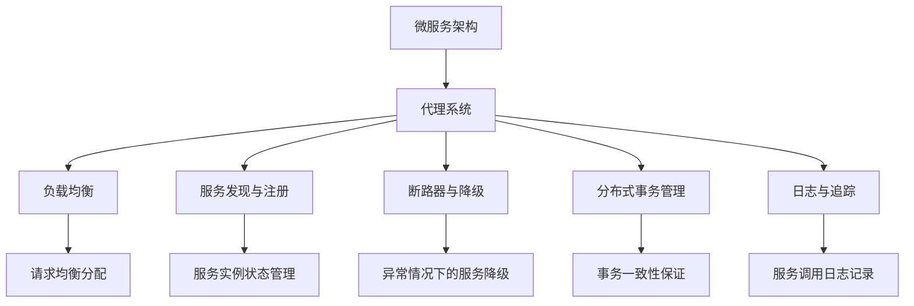
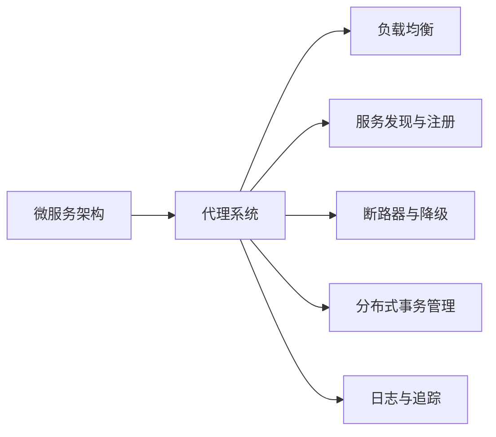
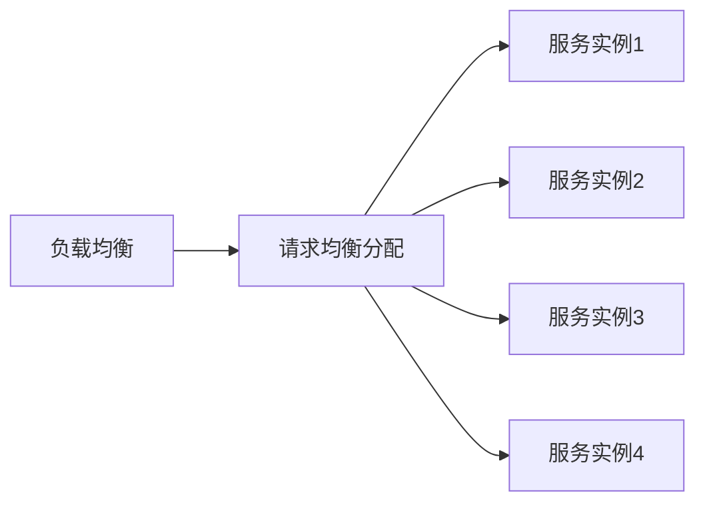
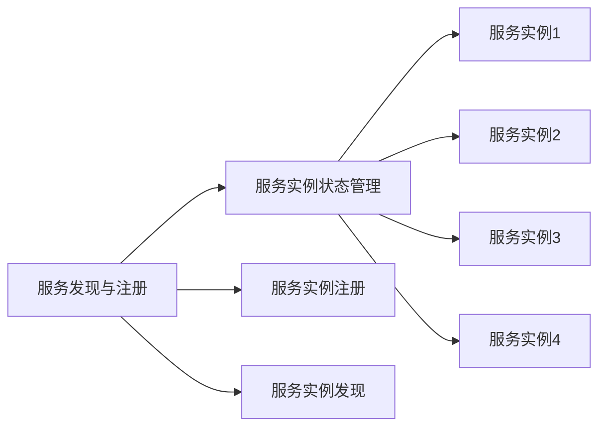
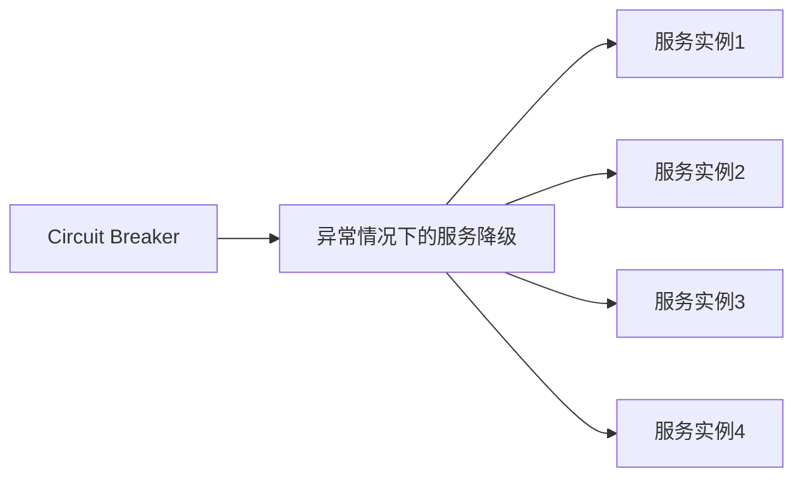
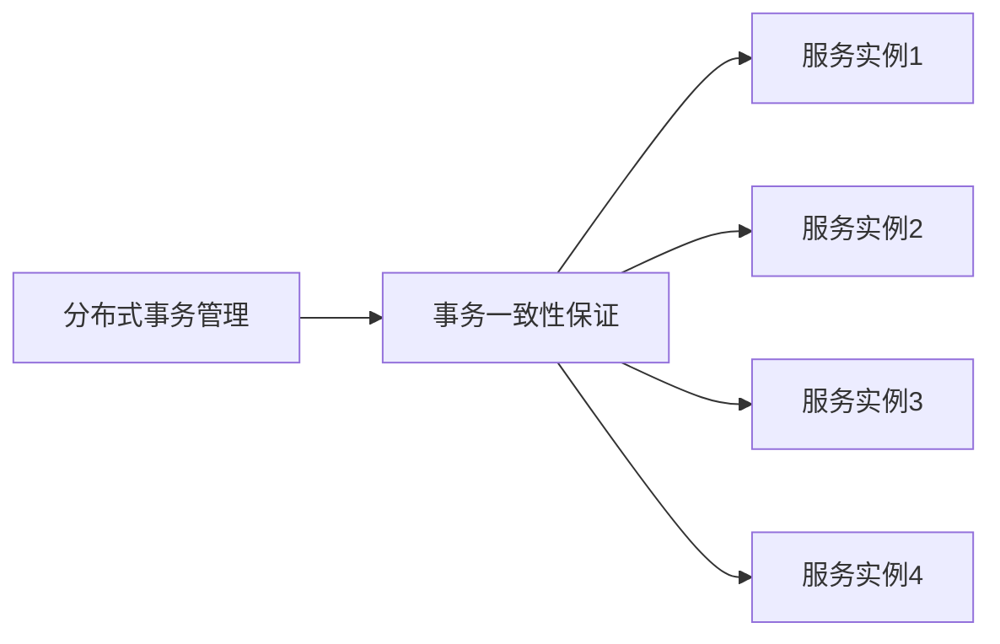
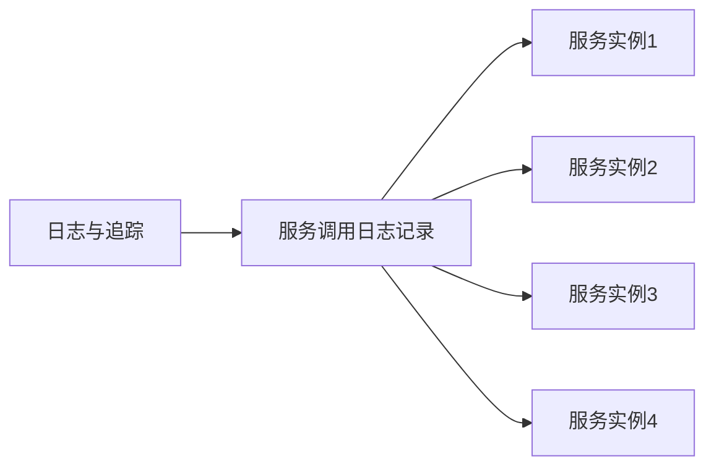

                 

# 构建复杂应用的代理系统 Agents

> 关键词：代理系统,微服务架构,分布式,负载均衡,性能优化,故障恢复,软件架构,Agent

## 1. 背景介绍

### 1.1 问题由来
在软件开发领域，随着系统规模的不断扩大和复杂度的持续提升，传统的单体架构和集中式部署模式已经难以适应需求。分布式微服务架构因其灵活、可扩展的特性，成为现代软件系统设计的基石。然而，微服务架构带来的复杂性也不可忽视，服务间的通信、依赖管理、数据一致性、故障恢复等问题亟需有效的解决方案。

代理系统(Agent System)，一种在微服务架构中广泛应用的组件模式，通过在服务节点内部或节点之间部署专用代理，可以有效解决上述问题，提升系统的稳定性和可靠性。本文将详细介绍代理系统的原理、设计及应用，希望能为微服务架构的设计和优化提供有益的参考。

### 1.2 问题核心关键点
代理系统是大规模微服务架构中不可或缺的一部分，其核心思想是通过在每个服务节点中部署专用代理，实现对服务间通信的管理、负载均衡、故障恢复等功能。代理系统能够有效简化微服务的内部管理，提升系统的灵活性和可扩展性，同时确保服务的高可用性。

代理系统的主要功能包括：
- 负载均衡：在多个服务实例之间分配请求，避免单点故障，提升服务并发能力。
- 服务发现与注册：自动检测并管理服务实例的状态，提供服务发现和注册功能，简化服务间的依赖关系。
- 断路器与降级：监控服务调用，避免异常情况下的连锁反应，提升系统稳定性。
- 分布式事务管理：协调多个服务之间的业务逻辑，确保事务的一致性。
- 日志与追踪：记录和分析服务调用日志，提高系统的可维护性和故障排查效率。

本文将重点介绍负载均衡、服务发现与注册、断路器与降级、分布式事务管理等功能，深入探讨代理系统的设计原理和应用实践。

### 1.3 问题研究意义
代理系统在大规模微服务架构中的应用，能够显著提升系统的稳定性和可靠性，降低开发和运维成本。通过深入研究和实践代理系统，我们能够更好地理解微服务架构的设计和优化方法，推动微服务技术在实际项目中的应用和落地。

代理系统还能够帮助企业构建高可用、高性能、易扩展的软件系统，助力其在激烈的市场竞争中脱颖而出。代理系统的研究和实践，对于推动微服务架构的普及和深入应用，具有重要的理论和实践意义。

## 2. 核心概念与联系

### 2.1 核心概念概述

为更好地理解代理系统的核心概念及其之间的联系，本节将介绍几个关键概念：

- **微服务架构(Microservices Architecture)**：将单体应用拆分为多个独立的服务模块，每个服务模块负责单一功能，通过轻量级通信协议进行交互的架构风格。微服务架构具有高可扩展性、高可用性、高灵活性等优点，但也会带来服务间通信、依赖管理等复杂问题。

- **代理系统(Agent System)**：在微服务架构中，每个服务节点中部署一个或多个专用代理，实现对服务间通信的管理、负载均衡、故障恢复等功能。代理系统能够简化微服务的内部管理，提升系统的稳定性和可扩展性。

- **负载均衡(Load Balancing)**：将请求均衡分配到多个服务实例上，避免单点故障，提升服务并发能力。

- **服务发现与注册(Service Discovery and Registration)**：自动检测并管理服务实例的状态，提供服务发现和注册功能，简化服务间的依赖关系。

- **断路器与降级(Circuit Breaker and Circuit Fallback)**：监控服务调用，避免异常情况下的连锁反应，提升系统稳定性。

- **分布式事务管理(Distributed Transaction Management)**：协调多个服务之间的业务逻辑，确保事务的一致性。

- **日志与追踪(Logging and Tracing)**：记录和分析服务调用日志，提高系统的可维护性和故障排查效率。

这些核心概念之间存在着紧密的联系，形成了代理系统的完整生态系统。下面通过一个Mermaid流程图来展示这些概念之间的关系：

这个流程图展示了微服务架构、代理系统及其各个组件之间的联系：

1. 微服务架构通过代理系统进行通信和功能管理，代理系统则是微服务架构的支撑工具。
2. 负载均衡、服务发现与注册、断路器与降级、分布式事务管理、日志与追踪等组件，都在代理系统中实现对微服务架构的增强和优化。

### 2.2 概念间的关系

这些核心概念之间存在着紧密的联系，形成了代理系统的完整生态系统。下面通过几个Mermaid流程图来展示这些概念之间的关系。

#### 2.2.1 代理系统在微服务架构中的位置

这个流程图展示了代理系统在微服务架构中的位置：

1. 代理系统作为微服务架构的核心组成部分，负责对服务间通信的管理和优化。
2. 负载均衡、服务发现与注册、断路器与降级、分布式事务管理、日志与追踪等功能，都在代理系统中实现。

#### 2.2.2 负载均衡的原理

这个流程图展示了负载均衡的基本原理：

1. 负载均衡将请求均衡分配到多个服务实例上，避免单点故障，提升服务并发能力。
2. 服务实例1、2、3、4接收请求，负责具体业务逻辑的处理。

#### 2.2.3 服务发现与注册的流程

这个流程图展示了服务发现与注册的基本流程：

1. 服务实例状态管理自动检测并管理服务实例的状态。
2. 服务实例1、2、3、4注册后，服务实例状态管理会维护服务实例的注册信息。
3. 服务实例状态管理在服务实例状态发生变化时，及时更新注册信息。
4. 服务实例注册后，服务实例状态管理会记录服务实例的注册信息，并支持服务实例的发现。

#### 2.2.4 断路器与降级的机制

这个流程图展示了断路器与降级的基本机制：

1. 断路器监控服务调用，避免异常情况下的连锁反应。
2. 在服务调用异常时，断路器会将服务降级到备用状态，避免连锁故障。
3. 服务实例1、2、3、4会根据断路器状态进行服务调用，断路器状态影响服务的降级决策。

#### 2.2.5 分布式事务管理的流程

这个流程图展示了分布式事务管理的基本流程：

1. 分布式事务管理协调多个服务之间的业务逻辑。
2. 服务实例1、2、3、4在执行分布式事务时，分布式事务管理会确保事务的一致性。

#### 2.2.6 日志与追踪的流程

这个流程图展示了日志与追踪的基本流程：

1. 日志与追踪记录和分析服务调用日志。
2. 服务实例1、2、3、4在执行操作时，日志与追踪会记录服务调用日志。

### 2.3 核心概念的整体架构

最后，我们用一个综合的流程图来展示这些核心概念在大规模微服务架构中的整体架构：

这个综合流程图展示了从微服务架构到代理系统，再到负载均衡、服务发现与注册、断路器与降级、分布式事务管理、日志与追踪等各个组件的完整架构：

1. 微服务架构通过代理系统进行通信和功能管理，代理系统则是微服务架构的支撑工具。
2. 负载均衡、服务发现与注册、断路器与降级、分布式事务管理、日志与追踪等组件，都在代理系统中实现对微服务架构的增强和优化。

## 3. 核心算法原理 & 具体操作步骤
### 3.1 算法原理概述

代理系统在大规模微服务架构中的应用，主要基于以下几个核心算法：

- **负载均衡算法**：通过算法将请求均衡分配到多个服务实例上，避免单点故障，提升服务并发能力。
- **服务发现与注册算法**：通过算法自动检测并管理服务实例的状态，提供服务发现和注册功能，简化服务间的依赖关系。
- **断路器与降级算法**：通过算法监控服务调用，避免异常情况下的连锁反应，提升系统稳定性。
- **分布式事务管理算法**：通过算法协调多个服务之间的业务逻辑，确保事务的一致性。
- **日志与追踪算法**：通过算法记录和分析服务调用日志，提高系统的可维护性和故障排查效率。

### 3.2 算法步骤详解

以下将详细讲解代理系统中各个算法的具体步骤：

#### 3.2.1 负载均衡算法

1. **负载均衡器**：在每个服务实例中，部署一个负载均衡器。负载均衡器负责接收来自客户端的请求，并根据负载均衡策略将请求分配到多个服务实例上。

2. **算法选择**：常用的负载均衡算法包括轮询、加权轮询、随机、IP散列等。轮询算法是最简单的一种，按照请求到达的顺序依次分配到各个服务实例上。加权轮询算法会根据服务实例的负载情况，对请求进行加权分配，避免某个服务实例过载。随机算法则是随机选择服务实例进行请求分发。IP散列算法会根据请求源IP地址和端口号进行哈希，将请求分配到指定的服务实例上。

3. **负载均衡实现**：具体实现负载均衡算法时，可以使用一致性哈希算法、随机算法、加权轮询算法等。这里以一致性哈希算法为例，其基本思想是将请求的哈希值映射到一个环状结构上，每个服务实例对应环状结构上的一个位置，请求通过哈希值落在哪个位置，就分配到对应的服务实例上。

4. **负载均衡优化**：为了进一步提升负载均衡的效率和公平性，可以引入健康检查机制，确保只有健康的服务实例被分配请求。还可以使用多维负载均衡策略，考虑服务实例的负载、延迟、可用性等因素，进行更精确的负载分配。

#### 3.2.2 服务发现与注册算法

1. **服务实例管理**：每个服务实例都有一个管理模块，用于维护服务实例的状态信息。服务实例状态信息包括服务实例的ID、地址、端口号、健康状态等。

2. **服务注册机制**：服务实例启动时，向服务注册中心注册，服务注册中心记录服务实例的状态信息。服务注册中心可以采用Consul、Etcd、Zookeeper等分布式服务发现工具。

3. **服务发现机制**：客户端通过服务注册中心查询服务实例的状态信息，获取可用的服务实例列表。服务注册中心负责维护服务实例的注册信息和状态信息，并提供服务实例发现功能。

4. **服务实例更新**：服务实例状态发生变化时，向服务注册中心更新状态信息。服务注册中心根据更新信息，更新服务实例的注册信息，并提供服务实例的发现和注册功能。

#### 3.2.3 断路器与降级算法

1. **断路器监控**：每个服务实例中，部署一个断路器模块，监控服务调用情况。断路器模块负责记录服务调用的成功率、失败率、延迟等指标。

2. **断路器状态转换**：断路器状态包括关闭、半开、全开三种状态。在服务调用成功率大于某个阈值时，断路器状态为关闭。在服务调用成功率低于某个阈值时，断路器状态转换为半开。在服务调用成功率仍然低于阈值时，断路器状态转换为全开。

3. **降级策略**：在断路器状态为全开时，降级策略将决定如何处理服务调用。常用的降级策略包括熔断、降级到备用服务实例、直接返回默认值等。

4. **断路器实现**：断路器模块可以使用Hystrix、Resilience4j等工具实现，这些工具提供了丰富的断路器配置和实现方案。

#### 3.2.4 分布式事务管理算法

1. **事务管理模块**：在每个服务实例中，部署一个事务管理模块，用于协调多个服务之间的业务逻辑。事务管理模块负责记录事务的状态信息，确保事务的一致性。

2. **分布式事务处理**：当多个服务参与同一个事务时，事务管理模块会协调各个服务的执行，确保事务的原子性和一致性。常用的分布式事务处理方案包括TCC、SAGA等。

3. **事务状态管理**：事务管理模块使用分布式事务状态机，记录事务的状态信息，包括事务的提交、回滚等操作。

4. **事务实现**：事务管理模块可以使用XA协议、TCC协议、SAGA协议等分布式事务处理协议，确保事务的一致性。

#### 3.2.5 日志与追踪算法

1. **日志记录模块**：在每个服务实例中，部署一个日志记录模块，记录服务调用的详细信息。日志记录模块使用日志框架，如Log4j、SLF4J等。

2. **日志存储与分析**：日志记录模块将日志存储到日志仓库中，日志仓库可以采用Elasticsearch、Kibana等工具。日志分析模块可以对日志进行解析、过滤、可视化等操作，帮助开发者快速定位问题。

3. **追踪链路**：日志记录模块使用分布式追踪工具，如Jaeger、Zipkin等，记录服务调用链路信息，帮助开发者追踪服务调用链路，定位问题。

4. **日志与追踪实现**：日志记录模块可以使用ELK Stack（Elasticsearch、Logstash、Kibana）、Zipkin、Jaeger等工具实现。

### 3.3 算法优缺点

代理系统在微服务架构中的应用，具有以下优点：

- **简化服务管理**：代理系统通过集中管理服务实例，简化服务实例的管理，降低开发和运维成本。
- **提升系统性能**：代理系统通过负载均衡、服务发现与注册、断路器与降级等功能，提升系统的稳定性和可扩展性，避免单点故障。
- **增强系统可维护性**：代理系统通过日志与追踪等功能，提高系统的可维护性和故障排查效率。

然而，代理系统也存在以下缺点：

- **系统复杂度增加**：代理系统增加了系统复杂度，需要开发者在系统设计时进行更多的思考和优化。
- **性能开销增加**：代理系统增加了系统性能开销，需要在性能和功能之间进行权衡。
- **学习成本增加**：代理系统的实现和使用需要一定的技术积累，开发者需要学习新的工具和技术。

### 3.4 算法应用领域

代理系统在大规模微服务架构中的应用，涉及多个领域：

- **金融服务**：金融服务领域需要高可用、高稳定的服务架构，代理系统能够提升金融服务的可靠性和安全性。
- **电商应用**：电商应用需要处理高并发请求，代理系统能够提升电商应用的负载能力和用户体验。
- **政府服务**：政府服务需要提供高可用、高可靠的服务架构，代理系统能够提升政府服务的稳定性和可扩展性。
- **医疗服务**：医疗服务需要高可靠、高安全的服务架构，代理系统能够提升医疗服务的可靠性和安全性。
- **教育培训**：教育培训需要高可靠、高安全的服务架构，代理系统能够提升教育培训的服务可靠性和用户体验。

## 4. 数学模型和公式 & 详细讲解 & 举例说明

### 4.1 数学模型构建

为了更好地理解代理系统的原理，下面将给出代理系统中各个算法的数学模型构建。

#### 4.1.1 负载均衡算法

假设系统中有N个服务实例，每个服务实例的负载为Wi，每个服务实例的负载上限为Wi_max。负载均衡算法的目标是使得每个服务实例的负载均衡，即：

$$
\min_{\{Wi\}} \sum_{i=1}^{N} \left(\frac{Wi}{Wi_max}\right)^2
$$

其中，Wi为服务实例i的负载，Wi_max为服务实例i的负载上限。

#### 4.1.2 服务发现与注册算法

假设系统中有M个服务实例，每个服务实例的状态为Si，每个服务实例的健康状态为Hi。服务发现与注册算法的目标是实时更新服务实例的状态信息，即：

$$
\min_{\{Si,Hi\}} \sum_{i=1}^{M} \left(\frac{|Si-Si_{prev}|}{Si_{prev}}\right)^2
$$

其中，Si为服务实例i的状态，Si_{prev}为服务实例i的上一状态，Hi为服务实例i的健康状态。

#### 4.1.3 断路器与降级算法

假设系统中有N个服务实例，每个服务实例的调用次数为Ci，每个服务实例的成功率为Si。断路器与降级算法的目标是实时监控服务调用情况，即：

$$
\min_{\{Ci,Si\}} \sum_{i=1}^{N} \left(\frac{Ci-S_{i-1}}{Ci}\right)^2
$$

其中，Ci为服务实例i的调用次数，Si为服务实例i的成功率，S_{i-1}为服务实例i的上一个成功次数。

#### 4.1.4 分布式事务管理算法

假设系统中有N个服务实例，每个服务实例的事务状态为Ti。分布式事务管理算法的目标是确保事务的一致性，即：

$$
\min_{\{Ti\}} \sum_{i=1}^{N} \left(\frac{Ti}{Ti_{max}}\right)^2
$$

其中，Ti为服务实例i的事务状态，Ti_{max}为服务实例i的事务状态上限。

#### 4.1.5 日志与追踪算法

假设系统中有N个服务实例，每个服务实例的调用次数为Ci，每个服务实例的日志记录次数为Li。日志与追踪算法的目标是记录和分析服务调用日志，即：

$$
\min_{\{Ci,Li\}} \sum_{i=1}^{N} \left(\frac{Li}{Ci}\right)^2
$$

其中，Ci为服务实例i的调用次数，Li为服务实例i的日志记录次数。

### 4.2 公式推导过程

以下将对上述数学模型进行推导：

#### 4.2.1 负载均衡算法的推导

负载均衡算法的目标是最小化每个服务实例的负载，可以使用拉格朗日乘子法进行推导。假设系统中有N个服务实例，每个服务实例的负载为Wi，每个服务实例的负载上限为Wi_max。

令L为拉格朗日函数，构建拉格朗日乘子方程：

$$
L = \sum_{i=1}^{N} Wi + \lambda \left(\sum_{i=1}^{N} Wi - \sum_{i=1}^{N} Wi_{max}\right)
$$

其中，$\lambda$为拉格朗日乘子。

对拉格朗日函数求偏导数，得到：

$$
\frac{\partial L}{\partial Wi} = 1 + \lambda
$$

令偏导数等于0，得到：

$$
Wi = \frac{Wi_{max}}{N}
$$

因此，每个服务实例的负载Wi为：

$$
Wi = \frac{Wi_{max}}{N}
$$

#### 4.2.2 服务发现与注册算法的推导

服务发现与注册算法的目标是最小化服务实例的状态差异，可以使用拉格朗日乘子法进行推导。假设系统中有M个服务实例，每个服务实例的状态为Si，每个服务实例的健康状态为Hi。

令L为拉格朗日函数，构建拉格朗日乘子方程：

$$
L = \sum_{i=1}^{M} \left(Si - Si_{prev}\right)^2 + \lambda \left(\sum_{i=1}^{M} Si - \sum_{i=1}^{M} Si_{prev}\right)
$$

其中，$\lambda$为拉格朗日乘子。

对拉格朗日函数求偏导数，得到：

$$
\frac{\partial L}{\partial Si} = 2(Si - Si_{prev}) + 2\lambda
$$

令偏导数等于0，得到：

$$
Si = Si_{prev}
$$

因此，服务实例的状态Si为：

$$
Si = Si_{prev}
$$

#### 4.2.3 断路器与降级算法的推导

断路器与降级算法的目标是最小化服务调用的成功率与上一次成功的成功率之差，可以使用拉格朗日乘子法进行推导。假设系统中有N个服务实例，每个服务实例的调用次数为Ci，每个服务实例的成功率为Si。

令L为拉格朗日函数，构建拉格朗日乘子方程：

$$
L = \sum_{i=1}^{N} Ci - \sum_{i=1}^{N} Si
$$

其中，$\lambda$为拉格朗日乘子。

对拉格朗日函数求偏导数，得到：

$$
\frac{\partial L}{\partial Ci} = 1 - \frac{Si}{Ci}
$$

令偏导数等于0，得到：

$$
Si = Ci
$$

因此，服务实例的成功率Si为：

$$
Si = Ci
$$

#### 4.2.4 分布式事务管理算法的推导

分布式事务管理算法的目标是最小化事务状态与事务状态上限之差，可以使用拉格朗日乘子法进行推导。假设系统中有N个服务实例，每个服务实例的事务状态为Ti。

令L为拉格朗日函数，构建拉格朗日乘子方程：

$$
L = \sum_{i=1}^{N} Ti - \sum_{i=1}^{N} Ti_{max}
$$

其中，$\lambda$为拉格朗日乘子。

对拉格朗日函数求偏导数，得到：

$$
\frac{\partial L}{\partial Ti} = 1 - \frac{Ti}{Ti_{max}}
$$

令偏导数等于0，得到：

$$
Ti = Ti_{max}
$$

因此，服务实例的事务状态Ti为：

$$
Ti = Ti_{max}
$$

#### 4.2.5 日志与追踪算法的推导

日志与追踪算法的目标是最小化日志记录次数与调用次数之比，可以使用拉格朗日乘子法进行推导。假设系统中有N个服务实例，每个服务实例的调用次数为Ci，每个服务实例的日志记录次数为Li。

令L为拉格朗日函数，构建拉格朗日乘子方程：

$$
L = \sum_{i=1}^{N} Ci - \sum_{i=1}^{N} Li
$$

其中，$\lambda$为拉格朗日乘子。

对拉格朗日函数求偏导数，得到：

$$
\frac{\partial L}{\partial Ci} = 1 - \frac{Li}{Ci}
$$

令偏导数等于0，得到：

$$
Li = Ci
$$

因此，服务实例的日志记录次数Li为：

$$
Li = Ci
$$

### 4.3 案例分析与讲解

#### 4.3.1 负载均衡算法案例

假设系统中有三个服务实例，每个服务实例的负载上限为100。负载均衡

