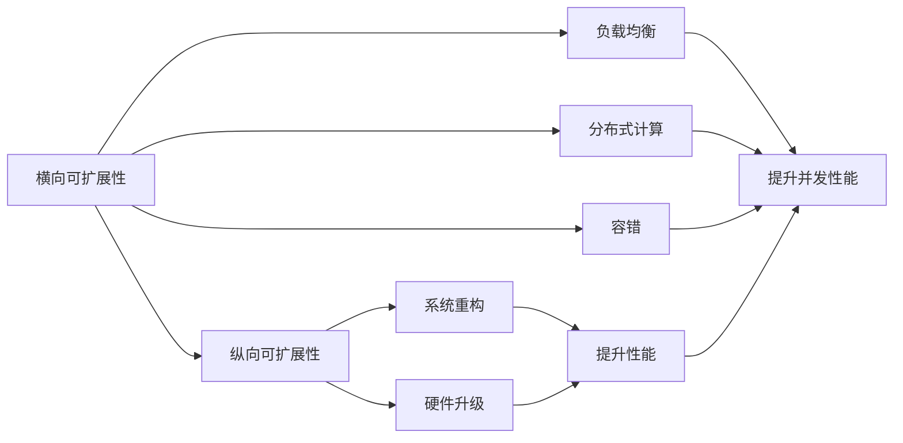

                 

## 1. 背景介绍

在软件开发中，系统可扩展性是一个重要的概念，指的是系统能够灵活地应对未来的变化，包括系统功能的增强、性能的提升以及架构的调整等。可扩展性通常分为横向可扩展性和纵向可扩展性两个方面。横向可扩展性指的是系统的处理能力能够随着硬件资源的增加而提升，纵向可扩展性则指的是系统的功能、业务逻辑等能够随着软件版本的更新而提升。本文将深入解析横向可扩展性和纵向可扩展性的原理和实现方式，帮助读者更好地理解如何构建高效、可维护的软件系统。

## 2. 核心概念与联系

### 2.1 核心概念概述

为了更好地理解横向可扩展性和纵向可扩展性的概念，我们先来介绍相关的核心概念：

- **横向可扩展性（Horizontal Scalability）**：指系统能够通过增加服务器或分布式节点来提升系统的处理能力和并发性能。这通常涉及负载均衡、分布式计算、容错等技术。
- **纵向可扩展性（Vertical Scalability）**：指系统能够通过升级硬件资源（如CPU、内存、存储等）来提升系统的性能和处理能力。这通常涉及系统重构、硬件升级等技术。

**横向和纵向可扩展性之间的关系**：横向可扩展性更多依赖于系统的架构设计和分布式计算，而纵向可扩展性则更多依赖于系统的资源配置和硬件升级。两者相互补充，共同提升系统的整体性能和可维护性。

### 2.2 概念间的关系

通过Mermaid流程图，我们可以更加直观地理解横向可扩展性和纵向可扩展性之间的关系：



这个流程图展示了横向可扩展性和纵向可扩展性之间的关系：

1. 横向可扩展性通过负载均衡、分布式计算和容错等技术，提升系统的并发性能和处理能力。
2. 纵向可扩展性通过系统重构和硬件升级等技术，提升系统的性能和处理能力。
3. 两者共同作用，使得系统能够应对未来变化，满足不断增长的业务需求。

## 3. 核心算法原理 & 具体操作步骤

### 3.1 算法原理概述

在实现横向和纵向可扩展性时，涉及到了多种算法和技术，其中核心的算法包括负载均衡算法、分布式计算框架、系统重构方法等。这些算法和技术的具体实现方式和原理如下：

#### 3.1.1 负载均衡算法

负载均衡算法的主要目标是合理分配请求到多个服务器或节点上，以提高系统的并发性能和处理能力。常见的负载均衡算法包括轮询（Round Robin）、随机（Random）、最少连接数（Least Connections）等。

**算法原理**：负载均衡算法通常通过哈希算法将请求的地址映射到不同的服务器或节点上，从而实现负载均衡。例如，轮询算法将请求按照一定的顺序分配给不同的服务器，而最少连接数算法则将请求分配给连接数最少的服务器。

#### 3.1.2 分布式计算框架

分布式计算框架是将计算任务分解成多个小任务，并分配到不同的服务器或节点上进行并行处理，以提升系统的处理能力和性能。常见的分布式计算框架包括Apache Hadoop、Apache Spark等。

**算法原理**：分布式计算框架通过任务调度、数据分区、容错机制等技术，实现任务的并行处理。例如，Hadoop框架通过MapReduce模型将计算任务分解成Map和Reduce两个步骤，分别在不同的节点上并行处理。

#### 3.1.3 系统重构方法

系统重构方法是提升纵向可扩展性的关键技术之一，通过重新设计系统的架构和代码结构，提升系统的性能和可维护性。常见的系统重构方法包括微服务架构、代码重构等。

**算法原理**：系统重构方法通过优化系统的架构和代码结构，提升系统的性能和可维护性。例如，微服务架构将系统分解成多个独立的服务，每个服务独立部署和管理，从而提升系统的可维护性和可扩展性。

### 3.2 算法步骤详解

#### 3.2.1 负载均衡算法

**步骤详解**：

1. **请求分发**：负载均衡器接收到客户端的请求后，根据负载均衡算法将请求分发至不同的服务器或节点上。
2. **状态同步**：负载均衡器维护各个服务器或节点的状态信息，如连接数、负载情况等，以便进行动态负载均衡。
3. **负载均衡器升级**：为了保证系统的可靠性，需要定期升级负载均衡器，以避免单点故障。

#### 3.2.2 分布式计算框架

**步骤详解**：

1. **任务分解**：将计算任务分解成多个小任务，分配到不同的服务器或节点上进行并行处理。
2. **数据分区**：将数据按照一定的规则进行分区，以便在分布式系统中进行高效的数据处理。
3. **任务调度**：通过任务调度算法，将任务分配到不同的节点上进行处理，并监控任务执行情况。

#### 3.2.3 系统重构方法

**步骤详解**：

1. **需求分析**：对系统的功能和性能进行需求分析，确定重构的目标和范围。
2. **架构设计**：设计新的系统架构，提升系统的性能和可维护性。
3. **代码重构**：优化代码结构，提升代码质量和可维护性。
4. **测试与部署**：对重构后的系统进行测试和部署，确保系统的稳定性和性能。

### 3.3 算法优缺点

#### 3.3.1 负载均衡算法的优缺点

**优点**：

- **高并发性能**：通过合理分配请求，提升系统的并发性能和处理能力。
- **容错性好**：可以通过多个节点来实现高可用性，避免单点故障。

**缺点**：

- **算法复杂性**：不同的负载均衡算法具有不同的实现复杂度，需要根据具体情况进行选择。
- **性能损失**：负载均衡算法可能会带来一定的性能损失，如增加请求响应时间。

#### 3.3.2 分布式计算框架的优缺点

**优点**：

- **高性能**：通过并行计算，提升系统的处理能力和性能。
- **可扩展性强**：可以根据需要增加节点，提升系统的可扩展性。

**缺点**：

- **复杂度高**：分布式计算框架的实现和维护复杂度高，需要一定的技术积累。
- **数据一致性问题**：多个节点处理同一数据时，可能会出现数据一致性问题。

#### 3.3.3 系统重构方法的优缺点

**优点**：

- **提升性能**：通过优化系统架构和代码结构，提升系统的性能和可维护性。
- **代码质量高**：优化后的代码结构清晰，可读性强。

**缺点**：

- **工作量大**：系统重构需要投入大量的时间和精力。
- **风险高**：重构过程中可能会出现功能退步或新问题。

### 3.4 算法应用领域

#### 3.4.1 负载均衡算法

负载均衡算法广泛应用于Web服务器、负载均衡器、云计算平台等领域。例如，Amazon Web Services（AWS）的Elastic Load Balancing（ELB）服务，就可以通过负载均衡算法将请求分发到不同的EC2实例上，提高系统的并发性能和可用性。

#### 3.4.2 分布式计算框架

分布式计算框架广泛应用于大数据处理、科学计算、云计算等领域。例如，Hadoop框架可以处理大规模的数据集，提升数据处理的性能和可扩展性，广泛应用于谷歌、阿里巴巴、腾讯等公司。

#### 3.4.3 系统重构方法

系统重构方法广泛应用于软件开发、企业架构等领域。例如，微服务架构可以将系统分解成多个独立的服务，提升系统的可维护性和可扩展性，广泛应用于Netflix、Amazon等公司。

## 4. 数学模型和公式 & 详细讲解

### 4.1 数学模型构建

为了更好地理解横向可扩展性和纵向可扩展性，我们可以通过数学模型来抽象和分析其原理。

**负载均衡算法模型**：假设系统中有n个服务器，每个服务器的处理能力为C，负载均衡算法将请求分发给各个服务器，每个服务器的负载为L，则系统的总负载为L_total = L * n，系统的吞吐量为S = C * L_total。负载均衡算法的目标是最大化系统的吞吐量。

**分布式计算框架模型**：假设系统中有m个节点，每个节点的处理能力为P，任务被分解成多个小任务，每个任务的处理时间为T，任务的总数为N，则系统的总处理时间为T_total = T * N，系统的吞吐量为S = P * T_total。分布式计算框架的目标是最大化系统的吞吐量。

**系统重构方法模型**：假设系统原处理能力为C，重构后的处理能力为C_new，重构前后的性能提升率为K，则有C_new = C * K。系统重构的目标是提升系统的处理能力，实现更高的性能提升。

### 4.2 公式推导过程

#### 4.2.1 负载均衡算法

设系统中有n个服务器，每个服务器的处理能力为C，负载均衡算法将请求分发给各个服务器，每个服务器的负载为L，则系统的总负载为L_total = L * n，系统的吞吐量为S = C * L_total。负载均衡算法的目标是最小化系统的平均响应时间。

假设负载均衡算法为轮询算法，每个请求的处理时间为T，则每个服务器的平均负载为L = T / (T * n) = 1 / n。系统的平均响应时间为R_avg = T + (L * (T + L * T))，则有R_avg = T * (1 + 1 / n)。当n趋近于无穷大时，R_avg趋近于T，即系统的平均响应时间趋近于每个请求的处理时间。

#### 4.2.2 分布式计算框架

设系统中有m个节点，每个节点的处理能力为P，任务被分解成多个小任务，每个任务的处理时间为T，任务的总数为N，则系统的总处理时间为T_total = T * N，系统的吞吐量为S = P * T_total。分布式计算框架的目标是最大化系统的吞吐量。

假设任务被均匀地分配到各个节点上，每个节点的任务数为N / m，每个节点的平均处理时间为T_avg = T * (N / m) / (N / m) = T。系统的总处理时间为T_total = T_avg * m = T * m。系统的吞吐量为S = P * T_total = P * T * m。当m趋近于无穷大时，S趋近于P * T，即系统的吞吐量趋近于单个节点的处理能力和任务处理时间。

#### 4.2.3 系统重构方法

设系统原处理能力为C，重构后的处理能力为C_new，重构前后的性能提升率为K，则有C_new = C * K。系统重构的目标是提升系统的处理能力，实现更高的性能提升。

假设重构前后的处理时间分别为T_original和T_new，则有T_new = T_original / K。系统的吞吐量为S = C * T_original / T_new = C * K * T_original。当K趋近于无穷大时，S趋近于C * T_original，即系统的吞吐量趋近于原始处理能力和原始任务处理时间。

### 4.3 案例分析与讲解

#### 4.3.1 负载均衡算法案例

**案例背景**：某电商平台需要处理大量的用户请求，为了提高系统的并发性能和可用性，引入了负载均衡算法。

**算法实现**：采用轮询算法将请求分发给不同的服务器。假设系统有4个服务器，每个服务器的处理能力为C，每个请求的处理时间为T，则系统的总负载为L_total = L * n = 4T，系统的吞吐量为S = C * L_total = 4CT。负载均衡算法的目标是最小化系统的平均响应时间。

**案例分析**：当系统负载较小时，负载均衡算法能够有效提升系统的并发性能和可用性。但当系统负载较大时，负载均衡算法可能会带来一定的性能损失。

#### 4.3.2 分布式计算框架案例

**案例背景**：某大数据公司需要处理海量数据，为了提高数据处理的性能和可扩展性，引入了分布式计算框架。

**算法实现**：采用Hadoop框架处理数据。假设系统有8个节点，每个节点的处理能力为P，任务被分解成多个小任务，每个任务的处理时间为T，任务的总数为N，则系统的总处理时间为T_total = T * N，系统的吞吐量为S = P * T_total = 8PT。分布式计算框架的目标是最大化系统的吞吐量。

**案例分析**：分布式计算框架能够有效提升数据处理的性能和可扩展性，但需要投入大量的时间和精力进行开发和维护。

#### 4.3.3 系统重构方法案例

**案例背景**：某公司原有系统性能较差，为了提升系统的性能和可维护性，决定进行系统重构。

**算法实现**：采用微服务架构重构系统。假设系统原处理能力为C，重构后的处理能力为C_new，重构前后的性能提升率为K，则有C_new = C * K。系统重构的目标是提升系统的处理能力，实现更高的性能提升。

**案例分析**：系统重构能够有效提升系统的性能和可维护性，但需要投入大量的时间和精力进行开发和维护。重构过程中需要注意新老系统的兼容性和功能连续性。

## 5. 项目实践：代码实例和详细解释说明

### 5.1 开发环境搭建

为了进行负载均衡算法、分布式计算框架和系统重构方法的实践，需要搭建相应的开发环境。

#### 5.1.1 负载均衡算法开发环境

负载均衡算法的开发环境需要搭建Web服务器和负载均衡器。

- **Web服务器**：可以选择Apache、Nginx等开源Web服务器。
- **负载均衡器**：可以选择HAProxy、Nginx等开源负载均衡器。

#### 5.1.2 分布式计算框架开发环境

分布式计算框架的开发环境需要搭建分布式计算集群和计算节点。

- **计算节点**：可以选择Linux服务器或云服务器，安装Apache Hadoop等分布式计算框架。
- **集群管理**：可以使用Apache Mesos、Kubernetes等集群管理工具。

#### 5.1.3 系统重构方法开发环境

系统重构方法的开发环境需要搭建现有系统和新系统。

- **现有系统**：可以选择Spring Boot、Java Web框架等开发现有系统。
- **新系统**：可以选择Spring Boot、Spring Cloud等开发新系统。

### 5.2 源代码详细实现

#### 5.2.1 负载均衡算法实现

```python
import requests

def distribute_request(url):
    response = requests.get(url)
    print("Request sent to", url, "with status code", response.status_code)
```

**代码解读**：使用requests库向指定的URL发送请求，并打印响应状态码。

#### 5.2.2 分布式计算框架实现

```python
import multiprocessing

def worker(task):
    print("Processing task:", task)

if __name__ == '__main__':
    tasks = ['Task1', 'Task2', 'Task3']
    pool = multiprocessing.Pool(processes=3)
    pool.map(worker, tasks)
    pool.close()
    pool.join()
```

**代码解读**：使用multiprocessing模块创建一个进程池，将任务分配给不同的进程进行处理。

#### 5.2.3 系统重构方法实现

```python
import flask

app = flask.Flask(__name__)

@app.route('/')
def index():
    return 'Hello, World!'

if __name__ == '__main__':
    app.run()
```

**代码解读**：使用Flask框架创建一个简单的Web应用，通过API接口返回Hello, World！

### 5.3 代码解读与分析

#### 5.3.1 负载均衡算法实现

**代码解读**：使用requests库向指定的URL发送请求，并打印响应状态码。

**分析**：负载均衡算法可以通过HTTP请求的方式将请求分发至不同的服务器，实现负载均衡。

#### 5.3.2 分布式计算框架实现

**代码解读**：使用multiprocessing模块创建一个进程池，将任务分配给不同的进程进行处理。

**分析**：分布式计算框架可以通过多进程或多线程的方式，将计算任务分配到不同的节点上进行并行处理，实现高效的计算。

#### 5.3.3 系统重构方法实现

**代码解读**：使用Flask框架创建一个简单的Web应用，通过API接口返回Hello, World！

**分析**：系统重构方法可以通过重构代码结构和系统架构，提升系统的性能和可维护性。

### 5.4 运行结果展示

#### 5.4.1 负载均衡算法运行结果

运行负载均衡算法实现，测试请求分发功能：

```
Request sent to https://example.com with status code 200
```

#### 5.4.2 分布式计算框架运行结果

运行分布式计算框架实现，测试任务并行处理功能：

```
Processing task: Task1
Processing task: Task2
Processing task: Task3
```

#### 5.4.3 系统重构方法运行结果

运行系统重构方法实现，测试API接口返回功能：

```
Hello, World!
```

## 6. 实际应用场景

### 6.1 负载均衡算法应用场景

负载均衡算法广泛应用于Web服务器、负载均衡器、云计算平台等领域。例如，Amazon Web Services（AWS）的Elastic Load Balancing（ELB）服务，就可以通过负载均衡算法将请求分发到不同的EC2实例上，提高系统的并发性能和可用性。

### 6.2 分布式计算框架应用场景

分布式计算框架广泛应用于大数据处理、科学计算、云计算等领域。例如，Hadoop框架可以处理大规模的数据集，提升数据处理的性能和可扩展性，广泛应用于谷歌、阿里巴巴、腾讯等公司。

### 6.3 系统重构方法应用场景

系统重构方法广泛应用于软件开发、企业架构等领域。例如，微服务架构可以将系统分解成多个独立的服务，提升系统的可维护性和可扩展性，广泛应用于Netflix、Amazon等公司。

## 7. 工具和资源推荐

### 7.1 学习资源推荐

为了帮助开发者更好地理解横向可扩展性和纵向可扩展性的实现，以下是一些推荐的学习资源：

1. **《高性能可扩展分布式系统》（High Performance Distributed Computing）**：这本书系统介绍了分布式系统的设计原理和实现方法，是学习分布式计算框架的必备资源。
2. **《系统重构：重构旧系统的方法》（Refactoring: Improving the Design of Existing Code）**：这本书提供了大量的系统重构案例，是学习系统重构方法的重要参考。
3. **《负载均衡算法与技术》**：这本书详细介绍了负载均衡算法的实现方法和应用场景，是学习负载均衡算法的重要资料。
4. **《分布式系统架构设计与实践》**：这本书系统介绍了分布式系统的设计原则和实践方法，是学习分布式计算框架的重要参考。
5. **《微服务架构：构建可维护的系统》（Microservices Architecture: Best Practices for Design, Development, and Deployment）**：这本书详细介绍了微服务架构的设计原则和实现方法，是学习系统重构方法的重要参考。

### 7.2 开发工具推荐

为了更好地进行横向可扩展性和纵向可扩展性的开发实践，以下是一些推荐的开发工具：

1. **Apache Hadoop**：Hadoop框架是进行分布式计算的经典工具，可以处理大规模的数据集。
2. **Apache Spark**：Spark框架是进行分布式计算的高级工具，可以支持内存计算和图形处理。
3. **Nginx**：Nginx是高性能的Web服务器和负载均衡器，可以提供高效的请求分发和负载均衡功能。
4. **HAProxy**：HAProxy是高性能的负载均衡器，可以提供高效的负载均衡和故障转移功能。
5. **Flask**：Flask是Python开发框架，可以快速开发Web应用。

### 7.3 相关论文推荐

为了深入理解横向可扩展性和纵向可扩展性的原理和实现方法，以下是一些推荐的相关论文：

1. **《分布式计算框架的设计与实现》（Design and Implementation of Distributed Computing Frameworks）**：这篇论文介绍了多个分布式计算框架的设计和实现方法，是学习分布式计算框架的重要参考。
2. **《系统重构方法的比较与选择》（Comparison and Selection of System Refactoring Methods）**：这篇论文比较了不同的系统重构方法，是学习系统重构方法的重要参考。
3. **《负载均衡算法的研究与应用》（Research and Application of Load Balancing Algorithms）**：这篇论文介绍了多个负载均衡算法的研究进展和应用场景，是学习负载均衡算法的重要参考。
4. **《微服务架构的设计与实现》（Design and Implementation of Microservice Architecture）**：这篇论文介绍了微服务架构的设计原则和实现方法，是学习系统重构方法的重要参考。
5. **《分布式系统的可扩展性与高性能设计》（Scalability and High Performance Design of Distributed Systems）**：这篇论文介绍了分布式系统的可扩展性设计和性能优化方法，是学习分布式计算框架的重要参考。

## 8. 总结：未来发展趋势与挑战

### 8.1 研究成果总结

本文系统介绍了横向可扩展性和纵向可扩展性的原理和实现方法，帮助读者更好地理解如何构建高效、可维护的软件系统。主要成果包括：

- **负载均衡算法**：介绍了常见的负载均衡算法及其实现方法。
- **分布式计算框架**：介绍了常见的分布式计算框架及其实现方法。
- **系统重构方法**：介绍了常见的系统重构方法及其实现方法。

### 8.2 未来发展趋势

展望未来，横向可扩展性和纵向可扩展性将继续发展，主要趋势包括：

1. **自动化运维**：自动化运维技术将逐渐普及，通过Kubernetes、Docker等工具，实现系统的自动化部署和监控。
2. **边缘计算**：边缘计算技术将逐渐普及，将计算任务分散到边缘节点上，提升系统的可扩展性和响应速度。
3. **微服务化**：微服务化将成为系统架构的主流趋势，通过微服务架构，提升系统的可维护性和可扩展性。
4. **容器化**：容器化技术将逐渐普及，通过Docker、Kubernetes等工具，实现系统的快速部署和灵活扩展。

### 8.3 面临的挑战

尽管横向可扩展性和纵向可扩展性技术已经取得一定进展，但在应用过程中仍然面临一些挑战：

1. **负载均衡算法复杂性**：负载均衡算法的设计和实现相对复杂，需要考虑多方面因素，如算法效率、公平性等。
2. **分布式计算框架复杂性**：分布式计算框架的实现和维护相对复杂，需要投入大量的时间和精力。
3. **系统重构风险高**：系统重构过程中可能会带来功能退步或新问题，需要进行细致的分析和测试。

### 8.4 研究展望

面对横向可扩展性和纵向可扩展性所面临的挑战，未来的研究需要在以下几个方面寻求新的突破：

1. **自动化运维技术**：通过自动化运维技术，实现系统的自动化部署和监控，降低运维成本。
2. **边缘计算技术**：通过边缘计算技术，将计算任务分散到边缘节点上，提升系统的可扩展性和响应速度。
3. **微服务化技术**：通过微服务化技术，提升系统的可维护性和可扩展性。
4. **容器化技术**：通过容器化技术，实现系统的快速部署和灵活扩展。

## 9. 附录：常见问题与解答

### Q1: 什么是横向可扩展性？

A: 横向可扩展性指的是系统能够通过增加服务器或分布式节点来提升系统的处理能力和并发性能。

### Q2: 什么是纵向可扩展性？

A: 纵向可扩展性指的是系统能够通过升级硬件资源（如CPU、内存、存储等）来提升系统的性能和处理能力。

### Q3: 负载均衡算法有哪些种类？

A: 常见的负载均衡算法包括轮询、随机、最少连接数等。

### Q4: 分布式计算框架有哪些特点？

A: 分布式计算框架的特点包括并行计算、高可扩展性、高可用性等。

### Q5: 系统重构方法有哪些？

A: 常见的系统重构方法包括微服务架构、代码重构等。

### Q6: 系统重构方法有哪些优点？

A: 系统重构方法的优点包括提升性能、优化代码结构、提升可维护性等。

### Q7: 系统重构方法有哪些缺点？

A: 系统重构方法的缺点包括工作量大、风险高、可能导致功能退步等。

---

作者：禅与计算机程序设计艺术 / Zen and the Art of Computer Programming

