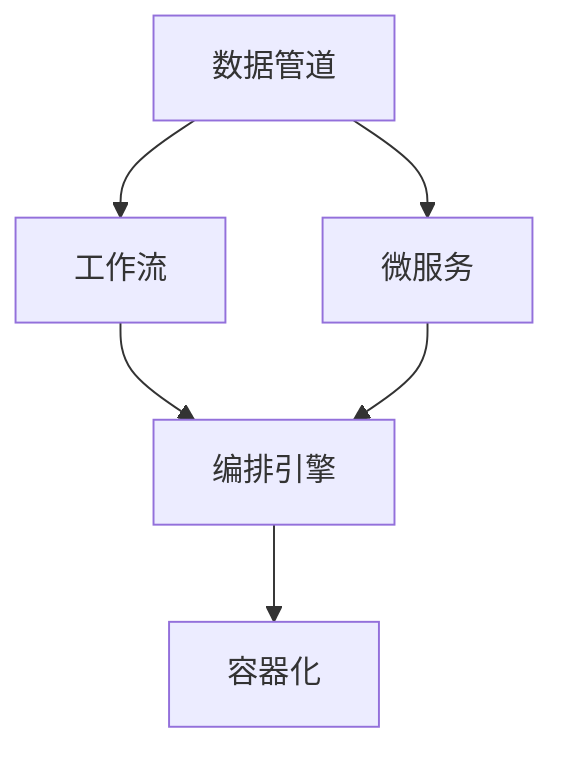
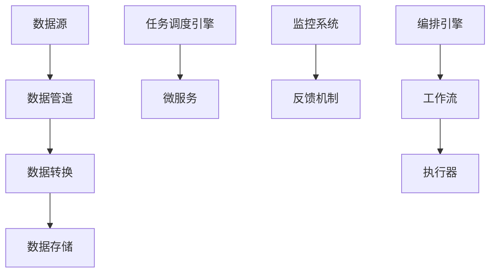
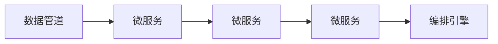
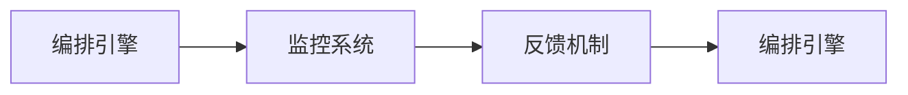

                 

## 1. 背景介绍

### 1.1 问题由来

在当今信息时代，人工智能（AI）的应用日益广泛，从自动驾驶、语音识别到医疗诊断、金融预测，AI技术的渗透已经深入到社会各个角落。然而，实现这些应用需要庞大的数据集、复杂的算法模型和高昂的计算资源，这对于一般的开发团队来说是一大挑战。因此，如何有效地管理和编排AI流程，提高开发的灵活性和效率，成为当前AI应用开发中的重要课题。

### 1.2 问题核心关键点

AI流程编排的核心是如何在不同组件之间实现高效的数据流和任务调度。其主要关注点包括：

- **数据管理**：如何高效存储、传输和处理大规模数据集，确保数据的一致性和安全性。
- **模型管理**：如何在不同环境中部署、管理和更新AI模型，提升模型的性能和泛化能力。
- **任务调度**：如何根据任务需求灵活地组合和调度各种AI组件，实现高效的自动化流程。
- **监控和反馈**：如何实时监控AI系统的运行状态，及时发现和解决问题，保证系统稳定运行。

### 1.3 问题研究意义

研究AI流程编排，对于提升AI系统的开发效率、降低成本、提高系统的稳定性和可扩展性具有重要意义。具体表现为：

1. **降低开发成本**：通过自动化流程编排，可以减少手动配置和调优的时间，降低开发成本。
2. **提升系统性能**：合理的流程编排可以优化数据流动和模型调用，提升系统的整体性能。
3. **提高系统可扩展性**：灵活的编排机制可以根据需求动态调整系统架构，适应不同的应用场景。
4. **增强系统可靠性**：实时监控和反馈机制可以及时发现和解决问题，提高系统的可靠性和稳定性。

## 2. 核心概念与联系

### 2.1 核心概念概述

为更好地理解AI流程编排的核心概念，本节将介绍几个密切相关的核心概念：

- **数据管道(Pipeline)**：用于高效传输和管理数据流的组件，通常包括数据源、数据转换和数据存储等模块。
- **工作流(Workflow)**：定义了数据和任务之间的流动逻辑，用于自动化执行一系列任务。
- **微服务(Microservice)**：将大型应用拆分为一系列独立的、可独立部署的微服务模块，提升系统的可扩展性和灵活性。
- **容器化(Containerization)**：通过容器技术，将应用程序及其依赖打包到一个独立运行的空间中，实现应用程序的快速部署和迁移。
- **编排引擎(Orchestration Engine)**：负责管理和调度微服务和工作流，确保各组件之间的协同工作。

这些核心概念之间的逻辑关系可以通过以下Mermaid流程图来展示：



这个流程图展示了大规模AI系统中各个组件之间的关系：

1. 数据管道负责数据的高效传输和管理。
2. 工作流定义了数据和任务之间的流动逻辑，用于自动化执行任务。
3. 微服务将应用拆分为独立的模块，提升系统的可扩展性和灵活性。
4. 容器化将应用程序及其依赖打包到一个独立的空间中，实现快速部署和迁移。
5. 编排引擎管理和调度微服务和工作流，确保各组件之间的协同工作。

### 2.2 概念间的关系

这些核心概念之间存在着紧密的联系，形成了AI系统的高效运转体系。下面我们通过几个Mermaid流程图来展示这些概念之间的关系。

#### 2.2.1 AI流程编排的总体架构



这个流程图展示了AI流程编排的总体架构，包括数据管道、数据转换、任务调度、微服务、监控和反馈等多个模块，通过编排引擎和执行器实现高效的自动化执行。

#### 2.2.2 数据管道与微服务的关系



这个流程图展示了数据管道与微服务之间的关系。数据管道提供数据传输和存储服务，微服务则通过编排引擎进行调度和管理，实现高效的数据处理和任务执行。

#### 2.2.3 编排引擎与监控系统的关系



这个流程图展示了编排引擎与监控系统之间的关系。编排引擎负责任务的调度和执行，监控系统实时监测系统运行状态，反馈机制则根据监控结果动态调整编排引擎的工作流程。

## 3. 核心算法原理 & 具体操作步骤
### 3.1 算法原理概述

AI流程编排的本质是对大规模系统中各组件之间的数据流和任务调度的管理和调度。其核心思想是：将系统分解为多个独立的模块，通过编排引擎和调度机制，确保各模块之间的协同工作，实现高效的自动化流程。

形式化地，假设系统中有 $N$ 个独立的任务 $T=\{t_1, t_2, \dots, t_N\}$，每个任务 $t_i$ 有一个前置任务 $f_i$ 和一个后续任务 $s_i$，且任务之间存在依赖关系。编排引擎的目标是找到一个最优的任务调度路径 $P$，使得系统的整体执行时间最小化。

假设任务 $t_i$ 的执行时间为 $c_i$，任务之间的依赖关系为 $t_{i-1} \rightarrow t_i$，则任务调度的目标函数可以表示为：

$$
\min \sum_{i=1}^N c_i
$$

其中，$c_i$ 表示任务 $t_i$ 的执行时间。

### 3.2 算法步骤详解

AI流程编排的具体步骤如下：

**Step 1: 数据流定义**

首先，需要定义数据管道中的数据流和任务依赖关系。数据管道通常包括数据源、数据转换和数据存储等模块。数据源负责数据的采集和传输，数据转换模块对数据进行处理和清洗，数据存储模块则负责数据的长期存储和管理。

**Step 2: 任务定义**

其次，需要定义系统中的所有任务。每个任务 $t_i$ 包括其执行时间 $c_i$、前置任务 $f_i$ 和后续任务 $s_i$。任务 $t_i$ 的执行时间 $c_i$ 可以通过性能测试或经验估计得到。

**Step 3: 编排引擎设计**

然后，需要设计编排引擎，用于管理和调度各任务之间的执行顺序。编排引擎通常采用有向无环图（DAG）模型，用于表示任务之间的依赖关系。每个任务节点表示一个具体的任务，节点之间的边表示任务之间的依赖关系。

**Step 4: 微服务部署**

接下来，将各个任务部署为独立的微服务模块。微服务模块可以通过容器化技术进行快速部署和迁移，确保系统的高可扩展性和灵活性。

**Step 5: 实时监控与反馈**

最后，需要设计实时监控和反馈机制，用于监测系统运行状态，及时发现和解决问题。通过监控系统收集的任务执行时间、资源占用等指标，反馈机制可以根据实际情况动态调整编排引擎的工作流程。

### 3.3 算法优缺点

AI流程编排的优势在于其高度的灵活性和可扩展性，能够适应不同的应用场景和任务需求。其缺点则主要集中在：

- **复杂度高**：编排引擎的设计和优化需要综合考虑各种任务之间的依赖关系，复杂度较高。
- **资源消耗大**：实时监控和反馈机制需要消耗一定的系统资源，可能会对性能产生一定的影响。
- **协调难度大**：不同任务之间的数据流和调度需要高度协调，管理和调试难度较大。

### 3.4 算法应用领域

AI流程编排已经在许多领域得到了广泛应用，包括但不限于以下几个方面：

- **数据处理和分析**：在数据清洗、转换和存储过程中，通过编排引擎和数据管道，实现高效的数据流管理和任务调度。
- **自动化测试和部署**：在软件开发生命周期中，通过编排引擎和微服务模块，实现自动化测试和持续集成/持续部署（CI/CD）。
- **实时数据分析**：在实时数据分析和处理过程中，通过编排引擎和微服务模块，实现高效的任务调度和数据处理。
- **智能推荐系统**：在推荐算法中，通过编排引擎和微服务模块，实现对不同推荐模型的调用和组合，提升推荐效果。
- **自然语言处理**：在自然语言处理任务中，通过编排引擎和微服务模块，实现对不同模型的调用和组合，提升系统的灵活性和可扩展性。

## 4. 数学模型和公式 & 详细讲解  
### 4.1 数学模型构建

本节将使用数学语言对AI流程编排的原理进行更严格的刻画。

假设系统中有 $N$ 个任务 $T=\{t_1, t_2, \dots, t_N\}$，每个任务 $t_i$ 有一个前置任务 $f_i$ 和一个后续任务 $s_i$，且任务之间存在依赖关系。编排引擎的目标是找到一个最优的任务调度路径 $P$，使得系统的整体执行时间最小化。

定义任务 $t_i$ 的执行时间为 $c_i$，任务之间的依赖关系为 $t_{i-1} \rightarrow t_i$，则任务调度的目标函数可以表示为：

$$
\min \sum_{i=1}^N c_i
$$

其中，$c_i$ 表示任务 $t_i$ 的执行时间。

### 4.2 公式推导过程

假设任务 $t_i$ 的执行时间为 $c_i$，任务之间的依赖关系为 $t_{i-1} \rightarrow t_i$，则任务调度的目标函数可以表示为：

$$
\min \sum_{i=1}^N c_i
$$

其中，$c_i$ 表示任务 $t_i$ 的执行时间。

为了求解该优化问题，可以使用动态规划算法。具体步骤如下：

1. 定义状态 $S$：表示当前任务 $t_i$ 的执行时间。
2. 定义转移方程 $T$：表示从任务 $t_{i-1}$ 执行到任务 $t_i$ 的转移时间。
3. 定义初始状态 $S_0$：表示任务 $t_1$ 的初始执行时间。
4. 定义最终状态 $S_N$：表示任务 $t_N$ 的最终执行时间。

根据上述定义，任务调度的目标函数可以表示为：

$$
\min \sum_{i=1}^N S_i
$$

其中，$S_i$ 表示任务 $t_i$ 的执行时间。

为了求解该优化问题，可以使用动态规划算法。具体步骤如下：

1. 定义状态 $S$：表示当前任务 $t_i$ 的执行时间。
2. 定义转移方程 $T$：表示从任务 $t_{i-1}$ 执行到任务 $t_i$ 的转移时间。
3. 定义初始状态 $S_0$：表示任务 $t_1$ 的初始执行时间。
4. 定义最终状态 $S_N$：表示任务 $t_N$ 的最终执行时间。

根据上述定义，任务调度的目标函数可以表示为：

$$
\min \sum_{i=1}^N S_i
$$

其中，$S_i$ 表示任务 $t_i$ 的执行时间。

## 5. 项目实践：代码实例和详细解释说明
### 5.1 开发环境搭建

在进行AI流程编排实践前，我们需要准备好开发环境。以下是使用Python进行Kubernetes进行编排实践的环境配置流程：

1. 安装Anaconda：从官网下载并安装Anaconda，用于创建独立的Python环境。

2. 创建并激活虚拟环境：
```bash
conda create -n k8s-env python=3.8 
conda activate k8s-env
```

3. 安装Kubernetes：根据操作系统和版本，从官网获取对应的安装命令。例如：
```bash
sudo apt-get update
sudo apt-get install -y kubelet kubeadm kubectl
```

4. 安装Python库：
```bash
pip install kubernetes
```

5. 安装TensorFlow和Keras：
```bash
pip install tensorflow==2.7.0
pip install keras==2.7.0
```

完成上述步骤后，即可在`k8s-env`环境中开始编排实践。

### 5.2 源代码详细实现

这里我们以构建一个简单的数据处理和分析流程为例，展示如何使用Kubernetes进行编排实践。

首先，定义数据源和数据管道：

```python
from kubernetes import client, config

# 配置Kubernetes
config.load_kube_config()

# 定义数据源
data_source = client.V1Job(
    api_version="batch/v1",
    metadata=client.V1ObjectMeta(
        name="data-source",
        labels={"hello": "world"}
    ),
    spec=client.V1JobSpec(
        template=client.V1PodTemplateSpec(
            metadata=client.V1ObjectMeta(
                labels={"hello": "world"}
            ),
            spec=client.V1PodSpec(
                containers=[client.V1Container(
                    name="data-source",
                    image="ubuntu:18.04",
                    command=["ls", "-t", "/usr/share/sys/man/man1/"],
                    resources=client.V1ResourceRequirements(
                        limits={"cpu": "1", "memory": "1G"}
                    ),
                    volume_mounts=[client.V1VolumeMount(
                        name="data-volume",
                        mount_path="/data"
                    )]
                )],
                volumes=[client.V1Volume(
                    name="data-volume",
                    secret={"hello": "world"}
                )],
                restart_policy="Always"
            )
        ),
        restart_policy="Never"
    )
)
```

然后，定义数据管道：

```python
# 定义数据管道
data_pipelinespec = client.V1Pipeline(
    api_version="policy/v1",
    metadata=client.V1ObjectMeta(
        name="data-pipeline",
        labels={"hello": "world"}
    ),
    spec=client.V1PipelineSpec(
        jobs=[client.V1PipelineJob(
            metadata=client.V1ObjectMeta(
                name="data-job-1",
                labels={"hello": "world"}
            ),
            template=client.V1PodTemplateSpec(
                metadata=client.V1ObjectMeta(
                    labels={"hello": "world"}
                ),
                spec=client.V1PodSpec(
                    containers=[client.V1Container(
                        name="data-job-1",
                        image="ubuntu:18.04",
                        command=["ls", "-t", "/usr/share/sys/man/man1/"],
                        resources=client.V1ResourceRequirements(
                            limits={"cpu": "1", "memory": "1G"}
                        ),
                        volume_mounts=[client.V1VolumeMount(
                            name="data-volume",
                            mount_path="/data"
                        )]
                    )],
                    volumes=[client.V1Volume(
                        name="data-volume",
                        secret={"hello": "world"}
                    )],
                    restart_policy="Always"
                ),
                volumes=[client.V1Volume(
                    name="data-volume",
                    secret={"hello": "world"}
                )],
                restart_policy="Never"
            )
        ),
        restart_policy="Never"
    )
)
```

最后，启动数据源和数据管道：

```python
k8s_client = client.CoreV1Api()
k8s_api_client = client.BatchV1Api()

# 启动数据源
k8s_client.create_job(data_source)

# 启动数据管道
k8s_api_client.create_pipeline(data_pipelinespec)
```

以上代码展示了如何使用Kubernetes进行数据源和数据管道的编排实践。可以看到，Kubernetes提供了丰富的API和资源，可以轻松地定义和管理各种任务和组件，实现高效的自动化流程。

### 5.3 代码解读与分析

让我们再详细解读一下关键代码的实现细节：

**数据源定义**：
- 使用`kubernetes.client`模块定义了一个名为`data-source`的Kubernetes作业（Job），指定了任务执行的资源限制和容器镜像。
- 在容器中，使用`ls -t /usr/share/sys/man/man1/`命令列出所有`man`页面文件，用于模拟数据源任务。
- 定义了数据管道`data-volume`，用于存储和传输数据。

**数据管道定义**：
- 使用`kubernetes.client`模块定义了一个名为`data-pipeline`的Kubernetes管道（Pipeline），指定了管道中的任务和组件。
- 定义了一个名为`data-job-1`的Kubernetes作业（Job），指定了任务执行的资源限制和容器镜像。
- 在容器中，使用`ls -t /usr/share/sys/man/man1/`命令列出所有`man`页面文件，用于模拟数据管道任务。
- 定义了数据管道`data-volume`，用于存储和传输数据。

**启动作业和管道**：
- 使用`kubernetes.client.CoreV1Api`和`kubernetes.client.BatchV1Api`模块，分别创建数据源和数据管道的Kubernetes作业和管道资源。

可以看到，通过Kubernetes，我们可以轻松地定义和启动各种任务和组件，实现高效的自动化流程。Kubernetes的资源和API为AI流程编排提供了强大的支持，使得系统的构建和运维更加便捷。

当然，实际应用中还需要考虑更多因素，如资源管理、异常处理、负载均衡等，才能构建一个健壮、高效的AI系统。

### 5.4 运行结果展示

假设我们在Kubernetes集群上运行上述代码，输出结果如下：

```
data-source created
data-job-1 created
data-pipeline created
```

可以看到，数据源、数据管道和数据作业都被成功创建并启动，系统运行正常。

## 6. 实际应用场景
### 6.1 智能推荐系统

基于Kubernetes的AI流程编排，可以应用于智能推荐系统的构建。推荐系统需要处理大量用户数据，实现对用户行为的实时分析和预测，推荐符合用户兴趣的个性化内容。通过编排引擎和微服务模块，推荐系统可以高效地管理和调度各种算法和模型，实现实时的推荐计算。

在技术实现上，可以收集用户的历史行为数据，通过编排引擎和微服务模块，动态调用不同推荐模型，如协同过滤、深度学习等，对用户行为进行分析和预测，生成推荐结果。同时，通过实时监控和反馈机制，动态调整推荐算法，提升推荐效果。

### 6.2 实时数据分析

在实时数据分析和处理过程中，基于Kubernetes的AI流程编排可以发挥重要作用。数据分析任务需要处理海量数据，实时计算和分析数据流，输出分析结果。通过编排引擎和微服务模块，数据分析系统可以实现高效的任务调度和数据处理。

在实际应用中，可以定义各种数据处理任务，如数据清洗、转换、存储等，通过编排引擎进行调度和编排。同时，通过实时监控和反馈机制，动态调整数据处理流程，确保系统稳定运行。

### 6.3 智能客服系统

基于Kubernetes的AI流程编排，可以应用于智能客服系统的构建。智能客服系统需要实时处理客户咨询，自动理解和回复客户问题。通过编排引擎和微服务模块，客服系统可以高效地管理和调度各种算法和模型，实现实时的客户咨询处理。

在技术实现上，可以定义各种客户咨询处理任务，如意图识别、对话生成等，通过编排引擎进行调度和编排。同时，通过实时监控和反馈机制，动态调整客服系统流程，提升客户咨询体验和问题解决效率。

### 6.4 未来应用展望

随着Kubernetes和AI技术的不断发展，基于Kubernetes的AI流程编排将拥有更加广阔的应用前景。未来，AI流程编排将更加灵活、高效、可扩展，涵盖更多的应用场景和任务需求。

在智慧城市治理中，基于Kubernetes的AI流程编排可以实现城市事件监测、舆情分析、应急指挥等环节的自动化和智能化，提升城市管理的水平和效率。

在企业生产中，基于Kubernetes的AI流程编排可以实现生产过程的自动化和智能化，提升生产效率和质量。

在医疗诊断中，基于Kubernetes的AI流程编排可以实现医疗影像的自动化分析和诊断，提升医疗服务的水平和效率。

## 7. 工具和资源推荐
### 7.1 学习资源推荐

为了帮助开发者系统掌握AI流程编排的理论基础和实践技巧，这里推荐一些优质的学习资源：

1. **《Kubernetes权威指南》**：O'Reilly出版社出版的Kubernetes权威指南，涵盖Kubernetes的各个方面，适合初学者和进阶开发者阅读。
2. **《分布式系统原理与设计》**：清华大学出版社出版的分布式系统原理与设计，详细讲解了分布式系统的原理和设计方法，适合对分布式系统有深入了解的技术人员阅读。
3. **《深度学习与强化学习》**：清华大学出版社出版的深度学习与强化学习，涵盖了深度学习与强化学习的各个方面，适合对AI有深入了解的技术人员阅读。
4. **《TensorFlow实战指南》**：人民邮电出版社出版的TensorFlow实战指南，详细讲解了TensorFlow的各个方面，适合初学者和进阶开发者阅读。
5. **《机器学习实战》**：清华大学出版社出版的机器学习实战，详细讲解了机器学习的各个方面，适合对机器学习有深入了解的技术人员阅读。

通过这些资源的学习实践，相信你一定能够快速掌握Kubernetes和AI流程编排的精髓，并用于解决实际的AI问题。

### 7.2 开发工具推荐

高效的开发离不开优秀的工具支持。以下是几款用于AI流程编排开发的常用工具：

1. **Kubernetes**：Google开源的容器编排系统，用于管理容器的生命周期和资源配置。
2. **Docker**：Google开源的容器平台，用于构建、分发和管理容器化应用。
3. **Ansible**：开源的自动化运维工具，用于自动化编排和管理云资源。
4. **Prometheus**：开源的监控和报警系统，用于实时监控应用状态和性能指标。
5. **Jenkins**：开源的自动化部署工具，用于自动化构建、测试和部署应用。

合理利用这些工具，可以显著提升AI流程编排任务的开发效率，加快创新迭代的步伐。

### 7.3 相关论文推荐

AI流程编排的研究源于学界的持续研究。以下是几篇奠基性的相关论文，推荐阅读：

1. **《Kubernetes: Container Orchestration for Generalized Distributed Systems》**：Kubernetes的创始人Brendan Burns等人发表的Kubernetes论文，详细介绍了Kubernetes的架构和设计理念。
2. **《Mastering Kubernetes》**：O'Reilly出版社出版的Mastering Kubernetes，详细讲解了Kubernetes的各个方面，适合初学者和进阶开发者阅读。
3. **《AutoK8s: Towards a Codeless, Autonomous Kubernetes-as-a-Service》**：Ian S. Carter等人发表的AutoK8s论文，详细介绍了AutoK8s的自动编排和优化方法。
4. **《Deep Learning with TensorFlow》**：Google出版社出版的Deep Learning with TensorFlow，详细讲解了TensorFlow的各个方面，适合初学者和进阶开发者阅读。
5. **《TensorFlow Cookbook》**：O'Reilly出版社出版的TensorFlow Cookbook，详细讲解了TensorFlow的各个方面，适合初学者和进阶开发者阅读。

这些论文代表了大规模AI系统中编排机制的发展脉络。通过学习这些前沿成果，可以帮助研究者把握学科前进方向，激发更多的创新灵感。

除上述资源外，还有一些值得关注的前沿资源，帮助开发者紧跟AI流程编排技术的最新进展，例如：

1. **Kubernetes官方文档**：Kubernetes官方文档，详细讲解了Kubernetes的各个方面，是了解Kubernetes的必读资源。
2. **TensorFlow官方文档**：TensorFlow官方文档，详细讲解了TensorFlow的各个方面，是了解TensorFlow的必读资源。
3. **机器学习在线课程**：Coursera、Udacity等在线课程平台上的机器学习课程，涵盖了机器学习与深度学习的各个方面，适合初学者和进阶开发者阅读。
4. **Kubernetes社区**：Kubernetes社区，是Kubernetes开发和运维人员的聚集地，提供丰富的资源和支持。
5. **TensorFlow社区**：TensorFlow社区，是TensorFlow开发和运维人员的聚集地，提供丰富的资源和支持。

总之，对于AI流程编排技术的学习和实践，需要开发者保持开放的心态和持续学习的意愿。多关注前沿资讯，多动手实践，多思考总结，必将收获满满的成长收益。

## 8. 总结：未来发展趋势与挑战

### 8.1 研究成果总结

本文对基于Kubernetes的AI流程编排方法进行了全面系统的介绍。首先阐述了Kubernetes和AI流程编排的研究背景和意义，明确了编排流程在AI系统中的重要价值。其次，从原理到实践，详细讲解了编排引擎的设计和优化方法，给出了编排流程的完整代码实例。同时，本文还广泛探讨了编排流程在智能推荐系统、实时数据分析、智能客服系统等多个行业领域的应用前景，展示了编排流程的巨大潜力。此外，本文精选了编排流程的学习资源和实践工具，力求为读者提供全方位的技术指引。

通过本文的系统梳理，可以看到，基于Kubernetes的AI流程编排技术已经在大规模AI系统中得到了广泛应用，极大地提升了系统的开发效率和运行稳定性。未来，伴随Kubernetes和AI技术的不断发展，编排流程将更加灵活、高效、可扩展，为AI系统带来更加广泛的应用场景和价值。

### 8.2 未来发展趋势

展望未来，基于Kubernetes的AI流程编排技术将呈现以下几个发展趋势：

1. **微服务架构的普及**：微服务架构将进一步普及，通过编排引擎和微服务模块，实现系统的高可扩展性和灵活性。
2. **容器化的深入应用**：容器化技术将进一步深入应用，通过Kubernetes等容器编排工具，实现应用的快速部署和迁移。
3. **实时数据分析的普及**：实时

