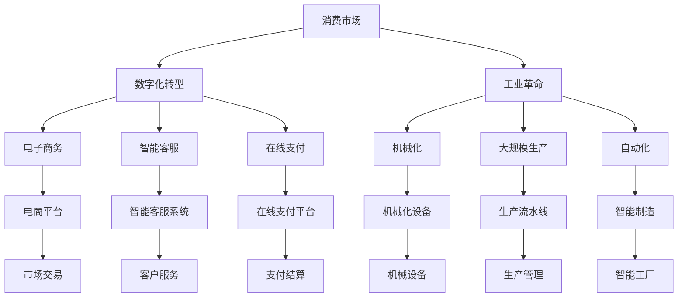
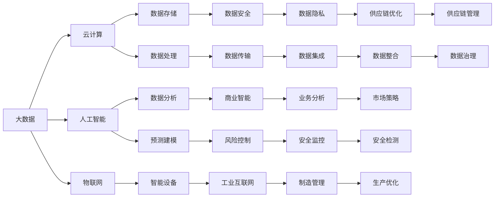
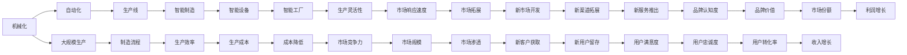

                 

# 消费市场的扩大与工业革命

## 1. 背景介绍

### 1.1 问题由来
随着互联网的普及和数字化进程的加快，消费市场迎来了前所未有的扩大。尤其是电子商务和数字营销的兴起，极大地推动了全球消费需求的增长。然而，这种增长并非没有挑战。一方面，消费者期望通过互联网获得更加丰富和个性化的产品和服务；另一方面，传统的工业模式和技术基础已经难以适应新的市场需求。因此，一场以技术创新和产业变革为核心内容的"工业革命"，在所难免。

### 1.2 问题核心关键点
工业革命的核心问题是如何利用数字技术和数据驱动，实现消费市场的更大规模、更高效、更个性化的服务。具体而言，包括以下几个方面：
1. **技术创新**：如何通过新技术推动工业制造、供应链管理、用户行为分析等方面的创新。
2. **数据驱动**：如何通过大数据和人工智能技术，实现对市场需求的精准预测和快速响应。
3. **个性化服务**：如何根据用户的行为和偏好，提供更加个性化的产品推荐和定制化服务。
4. **产业升级**：如何通过自动化、智能化手段，提升产业的整体效率和竞争力。

### 1.3 问题研究意义
研究消费市场扩大与工业革命的结合，对于推动经济增长、优化产业结构、提升消费者满意度具有重要意义：

1. **经济增长**：工业革命的数字化转型将推动传统行业创新，创造新的就业机会，促进GDP增长。
2. **产业优化**：通过新技术的应用，优化产业流程，降低成本，提升效率。
3. **消费升级**：个性化服务和智能推荐将满足消费者日益增长的需求，提升消费体验。
4. **技术突破**：推动AI、物联网、区块链等前沿技术的应用和突破，引领科技发展。

## 2. 核心概念与联系

### 2.1 核心概念概述

为了更好地理解消费市场扩大与工业革命之间的关系，本节将介绍几个密切相关的核心概念：

- **消费市场**：指消费者购买商品和服务的市场，包括在线市场和实体市场。随着互联网和数字化技术的发展，消费市场在规模和形式上都有了显著变化。

- **工业革命**：指18世纪末至19世纪初，英国率先发起的一场以机械化、大规模生产和自动化为特征的产业变革。其核心是技术创新和产业升级，对世界经济和社会产生了深远影响。

- **数字化转型**：指通过信息技术的应用，将传统产业进行数字化改造，实现自动化、智能化、网络化。在消费市场，数字化转型主要体现在电子商务、智能客服、在线支付等领域。

- **消费升级**：指消费者从基本需求向更高品质、更个性化的需求转变。主要受数字化技术、智能推荐、个性化服务等因素驱动。

- **产业互联网**：指利用信息技术和互联网技术，改造传统产业的互联网化应用。其目标是实现产业流程的优化、效率的提升和产业升级。

这些核心概念之间的逻辑关系可以通过以下Mermaid流程图来展示：



这个流程图展示了大规模消费市场与工业革命、数字化转型的关联性：

1. 消费市场通过数字化转型，利用电子商务、智能客服、在线支付等技术手段，进一步扩大市场规模。
2. 工业革命通过机械化、大规模生产、自动化等技术创新，提升了产业效率。
3. 两者结合，推动了产业互联网的发展，实现全产业链的数字化、智能化。

### 2.2 概念间的关系

这些核心概念之间存在着紧密的联系，形成了消费市场扩大与工业革命的完整生态系统。下面我们通过几个Mermaid流程图来展示这些概念之间的关系。

#### 2.2.1 消费市场扩大的技术支撑



这个流程图展示了大数据、云计算、人工智能等技术如何支撑消费市场的扩大：

1. 大数据提供了市场数据的深度挖掘和分析。
2. 云计算提供了海量数据的存储和处理能力。
3. 人工智能实现了对市场需求的精准预测和智能推荐。
4. 物联网实现了设备间的互联互通和数据采集。
5. 产业互联网实现了全产业链的数字化管理。

#### 2.2.2 工业革命对消费市场的影响



这个流程图展示了工业革命如何影响消费市场：

1. 机械化和自动化提升了生产效率和产品质量。
2. 大规模生产降低了生产成本，提升了市场竞争力。
3. 智能制造实现了生产流程的灵活性和智能化。
4. 智能设备的应用，使得生产成本进一步降低，市场响应速度提升。
5. 智能工厂的引入，提高了生产灵活性和生产效率。
6. 新市场的开发和拓展，带来了更多的用户和渠道。
7. 新服务的推出和品牌价值的提升，提高了用户满意度和忠诚度。

### 2.3 核心概念的整体架构

最后，我们用一个综合的流程图来展示这些核心概念在大规模消费市场扩大与工业革命过程中的整体架构：

```mermaid
graph TB
    A[消费市场] --> B[数字化转型]
    B --> C[电子商务]
    B --> D[智能客服]
    B --> E[在线支付]
    C --> F[电商平台]
    D --> G[智能客服系统]
    E --> H[在线支付平台]
    B --> I[大数据]
    I --> J[云计算]
    J --> K[数据存储]
    J --> L[数据处理]
    I --> M[人工智能]
    M --> N[数据分析]
    N --> O[预测建模]
    I --> P[物联网]
    P --> Q[智能设备]
    M --> R[智能推荐]
    K --> S[数据安全]
    S --> T[数据隐私]
    L --> U[数据传输]
    U --> V[数据集成]
    N --> W[商业智能]
    W --> X[业务分析]
    X --> Y[市场策略]
    Y --> Z[市场策略]
    Z --> BA[市场拓展]
    BA --> BB[新市场开发]
    BB --> BC[新渠道拓展]
    BC --> BD[新服务推出]
    BD --> BE[新用户留存]
    BE --> BF[用户满意度]
    BF --> BG[品牌认知度]
    BG --> BH[品牌价值]
    BH --> BI[用户忠诚度]
    BI --> BJ[用户转化率]
    BJ --> BK[市场份额]
    BK --> BL[收入增长]
    BL --> BM[利润增长]
    BK --> BN[成本降低]
    BN --> BO[生产灵活性]
    BO --> BP[市场响应速度]
    BP --> BQ[生产优化]
    BQ --> BR[供应链管理]
    BR --> BS[供应链优化]
    BS --> BT[制造管理]
    BT --> BU[智能工厂]
    BU --> BV[智能制造]
    BV --> BW[智能设备]
    BW --> BX[生产线]
    BX --> BY[生产流程]
    BY --> BZ[生产效率]
    BZ --> CA[生产成本]
    CA --> CB[智能设备]
    CB --> CC[智能设备]
    CC --> CD[智能工厂]
    CD --> CE[生产灵活性]
    CE --> CF[市场竞争力]
    CF --> CG[市场响应速度]
    CG --> CH[市场规模]
    CH --> CI[市场拓展]
    CI --> CJ[新市场开发]
    CJ --> CK[新渠道拓展]
    CK --> CL[新服务推出]
    CL --> CM[新用户留存]
    CM --> CN[用户满意度]
    CN --> CO[品牌认知度]
    CO --> CP[品牌价值]
    CP --> CQ[用户忠诚度]
    CQ --> CR[用户转化率]
    CR --> CS[市场份额]
    CS --> CT[收入增长]
    CT --> CU[利润增长]
    CS --> CV[成本降低]
    CV --> CW[生产灵活性]
    CW --> CX[市场响应速度]
    CX --> CY[生产优化]
    CY --> CZ[供应链管理]
    CZ --> DA[供应链优化]
    DA --> DB[制造管理]
    DB --> DC[智能工厂]
    DC --> DD[智能制造]
    DD --> DE[智能设备]
    DE --> DF[智能设备]
    DF --> DG[智能设备]
    DG --> DH[智能设备]
    DH --> DI[智能设备]
    DI --> DJ[智能设备]
    DJ --> DK[智能设备]
    DK --> DL[智能设备]
    DL --> DM[智能设备]
    DM --> DN[智能设备]
    DN --> DO[智能设备]
    DO --> DP[智能设备]
    DP --> DQ[智能设备]
    DQ --> DR[智能设备]
    DR --> DS[智能设备]
    DS --> DT[智能设备]
    DT --> DU[智能设备]
    DU --> DV[智能设备]
    DV --> DW[智能设备]
    DW --> DX[智能设备]
    DX --> DY[智能设备]
    DY --> DZ[智能设备]
    DZ --> EA[智能设备]
    EA --> EB[智能设备]
    EB --> EC[智能设备]
    EC --> ED[智能设备]
    ED --> EE[智能设备]
    EE --> EF[智能设备]
    EF --> EG[智能设备]
    EG --> EH[智能设备]
    EH --> EI[智能设备]
    EI --> EJ[智能设备]
    EJ --> EA[智能设备]
    EA --> EB[智能设备]
    EB --> EC[智能设备]
    EC --> ED[智能设备]
    ED --> EE[智能设备]
    EE --> EF[智能设备]
    EF --> EG[智能设备]
    EG --> EH[智能设备]
    EH --> EI[智能设备]
    EI --> EJ[智能设备]
    EJ --> EA[智能设备]
    EA --> EB[智能设备]
    EB --> EC[智能设备]
    EC --> ED[智能设备]
    ED --> EE[智能设备]
    EE --> EF[智能设备]
    EF --> EG[智能设备]
    EG --> EH[智能设备]
    EH --> EI[智能设备]
    EI --> EJ[智能设备]
    EJ --> EA[智能设备]
    EA --> EB[智能设备]
    EB --> EC[智能设备]
    EC --> ED[智能设备]
    ED --> EE[智能设备]
    EE --> EF[智能设备]
    EF --> EG[智能设备]
    EG --> EH[智能设备]
    EH --> EI[智能设备]
    EI --> EJ[智能设备]
    EJ --> EA[智能设备]
    EA --> EB[智能设备]
    EB --> EC[智能设备]
    EC --> ED[智能设备]
    ED --> EE[智能设备]
    EE --> EF[智能设备]
    EF --> EG[智能设备]
    EG --> EH[智能设备]
    EH --> EI[智能设备]
    EI --> EJ[智能设备]
    EJ --> EA[智能设备]
    EA --> EB[智能设备]
    EB --> EC[智能设备]
    EC --> ED[智能设备]
    ED --> EE[智能设备]
    EE --> EF[智能设备]
    EF --> EG[智能设备]
    EG --> EH[智能设备]
    EH --> EI[智能设备]
    EI --> EJ[智能设备]
    EJ --> EA[智能设备]
    EA --> EB[智能设备]
    EB --> EC[智能设备]
    EC --> ED[智能设备]
    ED --> EE[智能设备]
    EE --> EF[智能设备]
    EF --> EG[智能设备]
    EG --> EH[智能设备]
    EH --> EI[智能设备]
    EI --> EJ[智能设备]
    EJ --> EA[智能设备]
    EA --> EB[智能设备]
    EB --> EC[智能设备]
    EC --> ED[智能设备]
    ED --> EE[智能设备]
    EE --> EF[智能设备]
    EF --> EG[智能设备]
    EG --> EH[智能设备]
    EH --> EI[智能设备]
    EI --> EJ[智能设备]
    EJ --> EA[智能设备]
    EA --> EB[智能设备]
    EB --> EC[智能设备]
    EC --> ED[智能设备]
    ED --> EE[智能设备]
    EE --> EF[智能设备]
    EF --> EG[智能设备]
    EG --> EH[智能设备]
    EH --> EI[智能设备]
    EI --> EJ[智能设备]
    EJ --> EA[智能设备]
    EA --> EB[智能设备]
    EB --> EC[智能设备]
    EC --> ED[智能设备]
    ED --> EE[智能设备]
    EE --> EF[智能设备]
    EF --> EG[智能设备]
    EG --> EH[智能设备]
    EH --> EI[智能设备]
    EI --> EJ[智能设备]
    EJ --> EA[智能设备]
    EA --> EB[智能设备]
    EB --> EC[智能设备]
    EC --> ED[智能设备]
    ED --> EE[智能设备]
    EE --> EF[智能设备]
    EF --> EG[智能设备]
    EG --> EH[智能设备]
    EH --> EI[智能设备]
    EI --> EJ[智能设备]
    EJ --> EA[智能设备]
    EA --> EB[智能设备]
    EB --> EC[智能设备]
    EC --> ED[智能设备]
    ED --> EE[智能设备]
    EE --> EF[智能设备]
    EF --> EG[智能设备]
    EG --> EH[智能设备]
    EH --> EI[智能设备]
    EI --> EJ[智能设备]
    EJ --> EA[智能设备]
    EA --> EB[智能设备]
    EB --> EC[智能设备]
    EC --> ED[智能设备]
    ED --> EE[智能设备]
    EE --> EF[智能设备]
    EF --> EG[智能设备]
    EG --> EH[智能设备]
    EH --> EI[智能设备]
    EI --> EJ[智能设备]
    EJ --> EA[智能设备]
    EA --> EB[智能设备]
    EB --> EC[智能设备]
    EC --> ED[智能设备]
    ED --> EE[智能设备]
    EE --> EF[智能设备]
    EF --> EG[智能设备]
    EG --> EH[智能设备]
    EH --> EI[智能设备]
    EI --> EJ[智能设备]
    EJ --> EA[智能设备]
    EA --> EB[智能设备]
    EB --> EC[智能设备]
    EC --> ED[智能设备]
    ED --> EE[智能设备]
    EE --> EF[智能设备]
    EF --> EG[智能设备]
    EG --> EH[智能设备]
    EH --> EI[智能设备]
    EI --> EJ[智能设备]
    EJ --> EA[智能设备]
    EA --> EB[智能设备]
    EB --> EC[智能设备]
    EC --> ED[智能设备]
    ED --> EE[智能设备]
    EE --> EF[智能设备]
    EF --> EG[智能设备]
    EG --> EH[智能设备]
    EH --> EI[智能设备]
    EI --> EJ[智能设备]
    EJ --> EA[智能设备]
    EA --> EB[智能设备]
    EB --> EC[智能设备]
    EC --> ED[智能设备]
    ED --> EE[智能设备]
    EE --> EF[智能设备]
    EF --> EG[智能设备]
    EG --> EH[智能设备]
    EH --> EI[智能设备]
    EI --> EJ[智能设备]
    EJ --> EA[智能设备]
    EA --> EB[智能设备]
    EB --> EC[智能设备]
    EC --> ED[智能设备]
    ED --> EE[智能设备]
    EE --> EF[智能设备]
    EF --> EG[智能设备]
    EG --> EH[智能设备]
    EH --> EI[智能设备]
    EI --> EJ[智能设备]
    EJ --> EA[智能设备]
    EA --> EB[智能设备]
    EB --> EC[智能设备]
    EC --> ED[智能设备]
    ED --> EE[智能设备]
    EE --> EF[智能设备]
    EF --> EG[智能设备]
    EG --> EH[智能设备]
    EH --> EI[智能设备]
    EI --> EJ[智能设备]
    EJ --> EA[智能设备]
    EA --> EB[智能设备]
    EB --> EC[智能设备]
    EC --> ED[智能设备]
    ED --> EE[智能设备]
    EE --> EF[智能设备]
    EF --> EG[智能设备]
    EG --> EH[智能设备]
    EH --> EI[智能设备]
    EI --> EJ[智能设备]
    EJ --> EA[智能设备]
    EA --> EB[智能设备]
    EB --> EC[智能设备]
    EC --> ED[智能设备]
    ED --> EE[智能设备]
    EE --> EF[智能设备]
    EF --> EG[智能设备]
    EG --> EH[智能设备]
    EH --> EI[智能设备]
    EI --> EJ[智能设备]
    EJ --> EA[智能设备]
    EA --> EB[智能设备]
    EB --> EC[智能设备]
    EC --> ED[智能设备]
    ED --> EE[智能设备]
    EE --> EF[智能设备]
    EF --> EG[智能设备]
    EG --> EH[智能设备]
    EH --> EI[智能设备]
    EI --> EJ[智能设备]
    EJ --> EA[智能设备]
    EA --> EB[智能设备]
    EB --> EC[智能设备]
    EC --> ED[智能设备]
    ED --> EE[智能设备]
    EE --> EF[智能设备]
    EF --> EG[智能设备]
    EG --> EH[智能设备]
    EH --> EI[智能设备]
    EI --> EJ[智能设备]
    EJ --> EA[智能设备]
    EA --> EB[智能设备]
    EB --> EC[智能设备]
    EC --> ED[智能设备]
    ED --> EE[智能设备]
    EE --> EF[智能设备]
    EF --> EG[智能设备]
    EG --> EH[智能设备]
    EH --> EI[智能设备]
    EI --> EJ[智能设备]
    EJ --> EA[智能设备]
    EA --> EB[智能设备]
    EB --> EC[智能设备]
    EC --> ED[智能设备]
    ED --> EE[智能设备]
    EE --> EF[智能设备]
    EF --> EG[智能设备]
    EG --> EH[智能设备]
    EH --> EI[智能设备]
    EI --> EJ[智能设备]
    EJ --> EA[智能设备]
    EA --> EB[智能设备]
    EB --> EC[智能设备]
    EC --> ED[智能设备]
    ED --> EE[智能设备]
    EE --> EF[智能设备]
    EF --> EG[智能设备]
    EG --> EH[智能设备]
    EH --> EI[智能设备]
    EI --> EJ[智能设备]
    EJ --> EA[智能设备]
    EA --> EB[智能设备]
    EB --> EC[智能设备]
    EC --> ED[智能设备]
    ED --> EE[智能设备]
    EE --> EF[智能设备]
    EF --> EG[智能设备]
    EG --> EH[智能设备]
    EH --> EI[智能设备]
    EI --> EJ[智能设备]
    EJ --> EA[智能设备]
    EA --> EB[智能设备]
    EB --> EC[智能设备]
    EC --> ED[智能设备]
    ED --> EE[智能设备]
    EE --> EF[智能设备]
    EF --> EG[智能设备]
    EG --> EH[智能设备]
    EH --> EI[智能设备]
    EI --> EJ[智能设备]
    EJ --> EA[智能设备]
    EA --> EB[智能设备]
    EB --> EC[智能设备]
    EC --> ED[智能设备]
    ED --> EE[智能设备]
    EE --> EF[智能设备]
    EF --> EG[智能设备]
    EG --> EH[智能设备]
    EH --> EI[智能设备]
    EI --> EJ[智能设备]
    EJ --> EA[智能设备]
    EA --> EB[智能设备]
    EB --> EC[智能设备]
    EC --> ED[智能设备]
    ED --> EE[智能设备]
    EE --> EF[智能设备]
    EF --> EG[智能设备]
    EG --> EH[智能设备]
    EH --> EI[智能设备]
    EI --> EJ[智能设备]
    EJ --> EA[智能设备]
    EA --> EB[智能设备]
    EB --> EC[智能设备]
    EC --> ED[智能设备]
    ED --> EE[智能设备]
    EE --> EF[智能设备]
    EF --> EG[智能设备]
    EG --> EH[智能设备]
    EH --> EI[智能设备]
    EI --> EJ[智能设备]
    EJ --> EA[智能设备]
    EA --> EB[智能设备]
    EB --> EC[智能设备]
    EC --> ED[智能设备]
    ED --> EE[智能设备]
    EE --> EF[智能设备]
    EF --> EG[智能设备]
    EG --> EH[智能设备]
    EH --> EI[智能设备]
    EI --> EJ[智能设备]
    EJ --> EA[智能设备]
    EA --> EB[智能设备]
    EB --> EC[智能设备]
    EC --> ED[智能设备]
    ED --> EE[智能设备]
    EE --> EF[智能设备]
    EF --> EG[智能设备]
    EG --> EH[智能设备]
    EH --> EI[智能设备]
    EI --> EJ[智能设备]
    EJ --> EA[智能设备]
    EA --> EB[智能设备]
    EB --> EC[智能设备]
    EC --> ED[智能设备]
    ED --> EE[智能设备]
    EE --> EF[智能设备]
    EF --> EG[智能设备]
    EG --> EH[智能设备]
    EH --> EI[智能设备]
    EI --> EJ[智能设备]
    EJ --> EA[智能设备]
    EA --> EB[智能设备]
    EB --> EC[智能设备]
    EC --> ED[智能设备]
    ED --> EE[智能设备]
    EE --> EF[智能设备]
    EF --> EG[智能设备]
    EG --> EH[智能设备]
    EH --> EI[智能设备]
    EI --> EJ[智能设备]
    EJ --> EA[智能设备]
    EA --> EB[智能设备]
    EB --> EC[智能设备]
    EC --> ED[智能设备]
    ED --> EE[智能设备]
    EE --> EF[智能设备]
    EF --> EG[智能设备]
    EG --> EH[智能设备]
    EH --> EI[智能设备]
    EI --> EJ[智能设备]
    EJ --> EA[智能设备]
    EA --> EB[智能设备]
    EB --> EC[智能设备]
    EC --> ED[智能设备]
    ED --> EE[智能设备]
    EE --> EF[智能设备]
    EF --> EG[智能设备]
    EG --> EH[智能设备]
    EH --> EI[智能设备]
    EI --> EJ[智能设备]
    EJ --> EA[智能设备]
    EA --> EB[智能设备]
    EB --> EC[智能设备]
    EC --> ED[智能设备]
    ED --> EE[智能设备]
    EE --> EF[智能设备]
    EF --> EG[智能设备]
    EG --> EH[智能设备]
    EH --> EI[智能设备]
    EI --> EJ[智能设备]
    EJ --> EA[智能设备]
    EA --> EB[智能设备]
    EB --> EC[智能设备]
    EC --> ED[智能设备]
    ED --> EE[智能设备]
    EE --> EF[智能设备]
    EF --> EG[智能设备]
    EG

