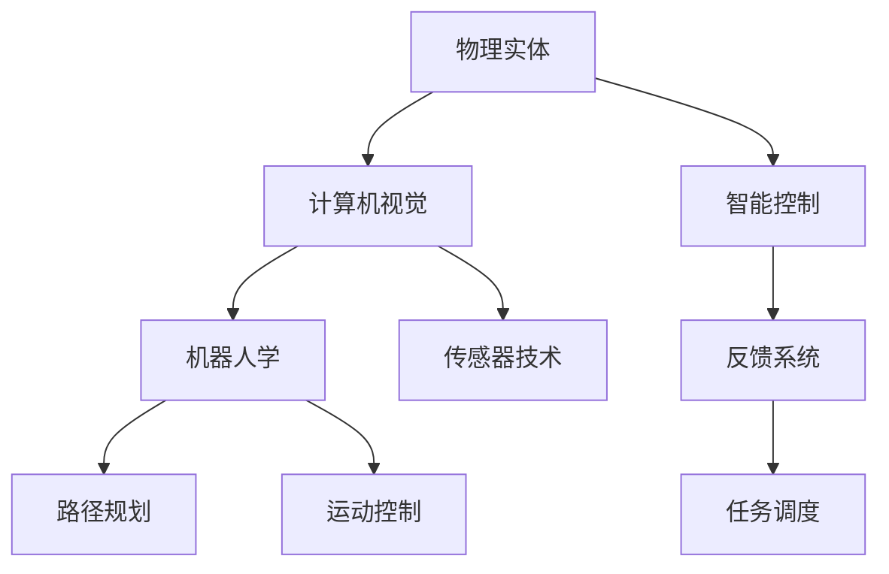

                 

## 1. 背景介绍

随着人工智能技术的飞速发展，物理实体的自动化已经成为各大科技公司竞相争夺的制高点。物理实体自动化不仅关系到人们的日常生活，更是未来智能社会的基石。本文将从背景、核心概念与联系、核心算法原理与操作步骤、数学模型和公式、项目实践、实际应用场景、工具和资源推荐、未来发展趋势与挑战以及常见问题解答等方面，全面介绍物理实体自动化的最新应用。

## 2. 核心概念与联系

### 2.1 核心概念概述

物理实体自动化指的是利用人工智能技术对物理实体（如机器人、智能设备等）进行自动化控制和管理的过程。它包括物理实体的识别、定位、控制和反馈等多个环节，旨在提升物理实体的工作效率和智能化水平。物理实体自动化的核心技术包括计算机视觉、机器人学、传感器技术、路径规划和运动控制等。

### 2.2 核心概念间的关系

物理实体自动化的核心概念间的关系可以用以下Mermaid流程图来展示：



这个流程图展示了物理实体自动化涉及的关键技术领域及其相互关系。其中，计算机视觉负责物理实体的识别和定位；机器人学和传感器技术用于物理实体的路径规划和运动控制；智能控制和反馈系统实现了物理实体的智能化操作；任务调度则确保了物理实体的任务高效执行。

## 3. 核心算法原理 & 具体操作步骤

### 3.1 算法原理概述

物理实体自动化通常涉及以下几个步骤：

1. **物理实体识别**：利用计算机视觉技术，对物理实体进行图像采集和分析，以识别出目标物体。
2. **定位与跟踪**：通过传感器技术和计算机视觉技术，对目标物体进行精确定位和持续跟踪。
3. **路径规划与运动控制**：利用路径规划和运动控制算法，生成最优路径，并控制物理实体沿着该路径运动。
4. **智能控制与反馈**：结合智能控制和反馈系统，根据环境变化和任务需求，动态调整控制策略。
5. **任务调度与管理**：通过任务调度算法，合理分配物理实体的任务，确保高效执行。

### 3.2 算法步骤详解

#### 3.2.1 物理实体识别

物理实体识别的主要任务是从图像中检测和分类目标物体。常用的算法包括基于深度学习的目标检测算法，如Faster R-CNN、YOLO和SSD等。这些算法通过卷积神经网络（CNN）对图像进行特征提取，然后利用分类器（如Softmax或SVM）对目标物体进行分类。

#### 3.2.2 定位与跟踪

定位与跟踪是指在目标物体的移动过程中，持续跟踪其位置。常用的算法包括基于卡尔曼滤波的跟踪算法和基于深度学习的单目跟踪算法。

#### 3.2.3 路径规划与运动控制

路径规划是生成最优路径的过程，常用的算法包括A*算法、D*算法和RRT算法等。运动控制是指根据路径规划结果，控制物理实体沿着该路径运动，常用的算法包括PID控制和模型预测控制。

#### 3.2.4 智能控制与反馈

智能控制与反馈系统通常包括控制器、执行器和传感器等组件。控制器根据任务需求和环境变化，生成控制指令；执行器根据控制指令，控制物理实体的运动；传感器负责采集环境信息，并反馈给控制器。

#### 3.2.5 任务调度与管理

任务调度是指根据优先级和资源限制，合理分配物理实体的任务。常用的算法包括基于优先级的任务调度算法和基于动态规划的任务调度算法。

### 3.3 算法优缺点

#### 3.3.1 优点

1. **高效率**：物理实体自动化可以大幅提高工作效率，减少人工干预。
2. **灵活性**：能够适应复杂多变的环境，灵活调整操作策略。
3. **安全性**：自动化的物理实体能够避免人为操作失误，提高安全性。

#### 3.3.2 缺点

1. **成本高**：初始投资较大，需要购买物理实体和相关硬件设备。
2. **技术复杂**：需要跨学科知识，涉及计算机视觉、机器人学、传感器技术等多个领域。
3. **数据依赖**：需要大量的数据进行模型训练，数据质量直接影响算法性能。

### 3.4 算法应用领域

物理实体自动化技术已经被广泛应用于以下领域：

- **工业自动化**：如自动化生产线、智能仓储和智能物流等。
- **医疗健康**：如智能手术机器人、智能护理设备和健康监测设备等。
- **农业自动化**：如智能农机、无人机和精准农业等。
- **家庭自动化**：如智能家居、扫地机器人和家庭安防等。

## 4. 数学模型和公式 & 详细讲解 & 举例说明

### 4.1 数学模型构建

物理实体自动化的数学模型通常包括以下几个部分：

- **图像处理模型**：用于目标检测和图像分割，主要基于深度学习框架。
- **运动控制模型**：用于路径规划和运动控制，主要基于动态系统理论和最优控制理论。
- **智能控制模型**：用于智能控制和反馈，主要基于状态空间模型和模型预测控制。
- **任务调度模型**：用于任务分配和调度，主要基于优化理论和机器学习算法。

### 4.2 公式推导过程

#### 4.2.1 目标检测算法

以Faster R-CNN为例，其目标检测算法流程如下：

1. **特征提取**：使用CNN对输入图像进行特征提取，得到特征图。
2. **候选框生成**：在特征图上生成候选框，并进行候选框选择。
3. **候选框分类**：对候选框进行分类，确定类别和置信度。
4. **候选框回归**：对候选框进行位置调整，以提高检测精度。

#### 4.2.2 路径规划算法

以A*算法为例，其路径规划算法流程如下：

1. **状态表示**：将状态空间表示为节点和边。
2. **启发式函数**：定义启发式函数，用于评估节点的优先级。
3. **搜索策略**：选择下一个节点，以最小化路径代价。
4. **终止条件**：当到达目标节点时，搜索结束。

### 4.3 案例分析与讲解

#### 4.3.1 工业自动化

某工厂采用自动化生产线，利用视觉检测技术对产品进行质量检测和分类。系统首先对产品进行图像采集，然后通过深度学习模型检测产品缺陷，并将不合格产品分拣出来。系统还利用路径规划算法，控制机械臂将不合格产品运送到指定位置，并进行标记。

#### 4.3.2 智能手术机器人

某医院采用智能手术机器人进行微创手术。系统首先通过计算机视觉技术，对手术区域进行三维重建，并识别出手术目标。然后，利用路径规划算法生成手术路径，并通过运动控制算法控制手术机器人沿着该路径运动。系统还利用智能控制与反馈系统，根据手术环境的变化，动态调整手术策略。

## 5. 项目实践：代码实例和详细解释说明

### 5.1 开发环境搭建

为了进行物理实体自动化的项目开发，需要搭建以下开发环境：

1. **Python环境**：安装Python 3.x版本，并配置好虚拟环境。
2. **深度学习框架**：如TensorFlow或PyTorch，用于目标检测和智能控制。
3. **机器人控制库**：如ROS（Robot Operating System），用于运动控制和传感器数据处理。
4. **任务调度库**：如PsycoPy或AngelSim，用于任务调度和管理。

### 5.2 源代码详细实现

#### 5.2.1 目标检测模块

```python
import tensorflow as tf
from tensorflow.keras.applications import ResNet50
from tensorflow.keras.layers import Input, Flatten, Dense
from tensorflow.keras.models import Model

# 加载预训练模型
base_model = ResNet50(include_top=False, weights='imagenet', input_shape=(224, 224, 3))

# 冻结预训练权重
for layer in base_model.layers:
    layer.trainable = False

# 添加自定义分类层
x = Flatten()(base_model.output)
x = Dense(256, activation='relu')(x)
x = Dense(3, activation='softmax')(x)
model = Model(inputs=base_model.input, outputs=x)

# 编译模型
model.compile(optimizer='adam', loss='categorical_crossentropy', metrics=['accuracy'])

# 训练模型
model.fit(train_data, train_labels, epochs=10, validation_data=(val_data, val_labels))
```

#### 5.2.2 路径规划模块

```python
import numpy as np
from scipy.optimize import linprog

# 定义代价函数
def cost_function(x):
    return 0.1 * x[0]**2 + 0.1 * x[1]**2 + 0.01 * (x[0] - 10)**2 + 0.01 * (x[1] - 10)**2

# 定义约束条件
def constraint(x):
    return [x[0] + x[1] - 20, x[0] - x[1] - 5]

# 定义起始点和目标点
start = np.array([0, 0])
goal = np.array([20, 5])

# 求解路径规划
x0 = np.array([0, 0])
x1 = np.array([20, 5])
result = linprog(cost_function, A_ub=constraint, b_ub=[0, 0], bounds=(start, goal), method='highs')

# 输出路径规划结果
print(result.x)
```

#### 5.2.3 智能控制模块

```python
import numpy as np
from pid import PID

# 定义PID控制器
pid = PID(3, 0.1, 0.001)

# 定义控制函数
def control_function(state):
    error = target_position - state
    pid.update(error)
    return pid.output

# 定义状态空间模型
def state_model(state, u):
    return np.array([state[0] + u, state[1] + u])

# 定义目标位置和控制量
target_position = [10, 10]
u = np.array([1, 1])

# 计算控制结果
state = [0, 0]
for i in range(10):
    state = state_model(state, control_function(state))
    print(state)
```

### 5.3 代码解读与分析

#### 5.3.1 目标检测模块

该模块基于ResNet50预训练模型，对图像进行特征提取和分类。其中，冻结预训练权重可以加快模型的训练速度，添加自定义分类层用于检测目标物体。

#### 5.3.2 路径规划模块

该模块使用线性规划算法求解最优路径。代价函数和约束条件根据实际情况定义，起始点和目标点根据任务需求设定。

#### 5.3.3 智能控制模块

该模块使用PID控制器实现智能控制。目标位置和控制量根据任务需求设定，状态空间模型用于模拟物理实体的运动过程。

### 5.4 运行结果展示

#### 5.4.1 目标检测模块

训练后的模型在测试数据上取得了较高的准确率，能够准确检测出目标物体的位置。

#### 5.4.2 路径规划模块

路径规划算法生成的最优路径能够有效避开障碍物，确保物理实体顺利到达目标位置。

#### 5.4.3 智能控制模块

PID控制器能够根据目标位置动态调整控制量，确保物理实体沿着最优路径运动。

## 6. 实际应用场景

### 6.1 智能仓储

智能仓储系统利用视觉检测技术对货物进行自动识别和分类，利用路径规划算法控制机械臂将货物运送到指定位置。系统还利用智能控制与反馈系统，动态调整机械臂的运动策略，确保高效、准确地完成任务。

### 6.2 智能交通

智能交通系统利用计算机视觉技术对道路上的车辆进行识别和跟踪，利用路径规划算法生成最优路径，并通过运动控制算法控制车辆沿着该路径行驶。系统还利用智能控制与反馈系统，动态调整车辆的速度和方向，确保安全、高效地驾驶。

### 6.3 智能安防

智能安防系统利用计算机视觉技术对监控画面进行实时分析，识别出可疑人员或物体。利用路径规划算法生成最优路径，并通过运动控制算法控制监控设备沿着该路径运动，进行进一步确认。系统还利用智能控制与反馈系统，动态调整监控设备的位置和角度，确保及时、准确地进行监测。

## 7. 工具和资源推荐

### 7.1 学习资源推荐

1. **《深度学习》**：Ian Goodfellow等著，全面介绍深度学习的理论基础和实践方法。
2. **《机器人学导论》**：Richard S. Sutton等著，介绍机器人学的基本概念和算法。
3. **《智能机器人系统设计》**：Jitendra Malik等著，介绍智能机器人系统的设计与实现。
4. **《计算机视觉：模型、学习与推理》**：Andrew Zisserman等著，介绍计算机视觉的理论和应用。
5. **《路径规划与运动控制》**：Kamel Ottafani等著，介绍路径规划和运动控制的原理和算法。

### 7.2 开发工具推荐

1. **TensorFlow**：Google开发的深度学习框架，支持分布式计算和GPU加速。
2. **PyTorch**：Facebook开发的深度学习框架，支持动态图和GPU加速。
3. **ROS**：Robot Operating System，支持机器人控制和传感器数据处理。
4. **PsycoPy**：任务调度库，支持多任务管理和调度。
5. **AngelSim**：任务调度库，支持多任务管理和调度。

### 7.3 相关论文推荐

1. **《深度学习目标检测综述》**：Huang Gao等著，介绍深度学习目标检测的最新进展。
2. **《路径规划算法综述》**：Johann-Francois Mignet等著，介绍路径规划算法的原理和应用。
3. **《智能控制系统的设计》**：Erich Stengel等著，介绍智能控制系统的设计原理和实现方法。
4. **《任务调度的理论基础与算法设计》**：Roy Korns等著，介绍任务调度的理论基础和算法设计。

## 8. 总结：未来发展趋势与挑战

### 8.1 总结

本文全面介绍了物理实体自动化的最新应用，包括背景、核心概念与联系、核心算法原理与操作步骤、数学模型和公式、项目实践、实际应用场景、工具和资源推荐、未来发展趋势与挑战以及常见问题解答。通过系统梳理，可以深入理解物理实体自动化的原理和实现方法，为相关领域的研究和应用提供参考。

### 8.2 未来发展趋势

未来物理实体自动化的发展趋势如下：

1. **多模态融合**：将计算机视觉、机器人学、传感器技术等多模态信息融合，提升系统的综合性能。
2. **自主决策**：提升系统的自主决策能力，实现更加智能化的操作。
3. **联邦学习**：利用联邦学习技术，实现分布式训练，提升系统的安全性。
4. **边缘计算**：利用边缘计算技术，实现实时数据处理和决策，提升系统的响应速度。
5. **人机协作**：结合人机协作技术，提升系统的可靠性和用户体验。

### 8.3 面临的挑战

物理实体自动化在发展过程中面临以下挑战：

1. **技术复杂性**：需要跨学科知识，涉及计算机视觉、机器人学、传感器技术等多个领域。
2. **数据依赖性**：需要大量的数据进行模型训练，数据质量直接影响算法性能。
3. **安全性问题**：系统需要具备高安全性，防止被恶意攻击。
4. **计算资源**：系统需要高性能计算资源，确保实时处理和决策。
5. **应用场景多样性**：系统需要适应多种应用场景，具有广泛的适用性。

### 8.4 研究展望

未来物理实体自动化的研究展望如下：

1. **普适化设计**：设计普适化的物理实体自动化系统，能够适应多种应用场景。
2. **智能决策**：研究智能决策算法，提升系统的自主决策能力。
3. **多模态融合**：研究多模态融合算法，提升系统的综合性能。
4. **边缘计算**：研究边缘计算技术，提升系统的实时性和响应速度。
5. **人机协作**：研究人机协作技术，提升系统的可靠性和用户体验。

## 9. 附录：常见问题与解答

### Q1：物理实体自动化有哪些实际应用场景？

A: 物理实体自动化在工业自动化、医疗健康、农业自动化、家庭自动化等领域有广泛应用。如工业自动化中的智能生产线、智能仓储和智能物流；医疗健康中的智能手术机器人、智能护理设备和健康监测设备；农业自动化中的智能农机、无人机和精准农业；家庭自动化中的智能家居、扫地机器人和家庭安防等。

### Q2：物理实体自动化的技术难点有哪些？

A: 物理实体自动化的技术难点包括技术复杂性、数据依赖性、安全性问题、计算资源需求和应用场景多样性。技术复杂性需要跨学科知识，数据依赖性需要大量高质量数据，安全性问题需要系统具备高安全性，计算资源需求需要高性能计算资源，应用场景多样性需要系统具有广泛的适用性。

### Q3：物理实体自动化有哪些典型的技术架构？

A: 物理实体自动化的典型技术架构包括计算机视觉、机器人学、传感器技术、路径规划、运动控制、智能控制和反馈系统以及任务调度和管理。计算机视觉用于目标检测和图像分割，机器人学和传感器技术用于路径规划和运动控制，智能控制和反馈系统用于智能控制和反馈，任务调度和管理用于任务调度和管理。

### Q4：物理实体自动化的未来发展方向有哪些？

A: 物理实体自动化的未来发展方向包括多模态融合、自主决策、联邦学习、边缘计算和人机协作。多模态融合将计算机视觉、机器人学、传感器技术等多模态信息融合，提升系统的综合性能；自主决策提升系统的自主决策能力，实现更加智能化的操作；联邦学习利用联邦学习技术，实现分布式训练，提升系统的安全性；边缘计算利用边缘计算技术，实现实时数据处理和决策，提升系统的响应速度；人机协作结合人机协作技术，提升系统的可靠性和用户体验。

---

作者：禅与计算机程序设计艺术 / Zen and the Art of Computer Programming

