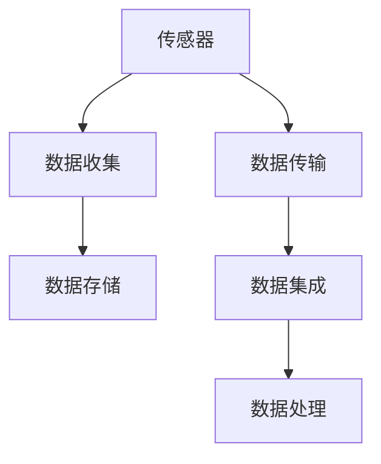
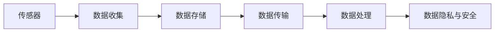
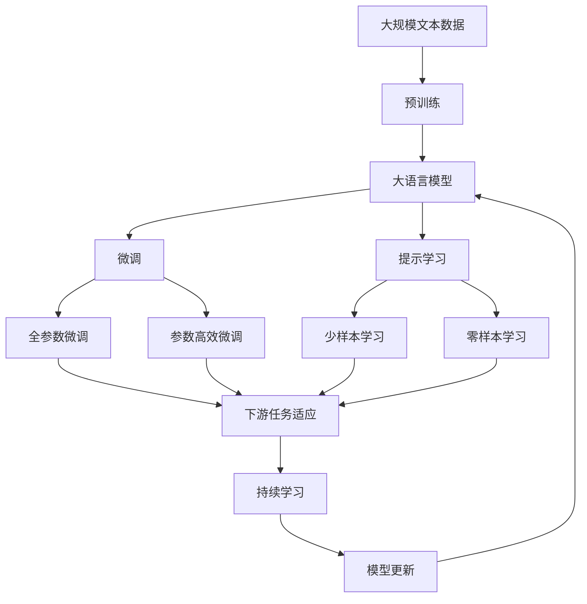

                 

# 物联网(IoT)技术和各种传感器设备的集成：物联网在智能家居的应用

> 关键词：物联网,传感器,智能家居,数据收集,设备集成,隐私保护,用户行为分析

## 1. 背景介绍

### 1.1 问题由来
随着科技的飞速发展，物联网（Internet of Things，IoT）技术已经深入到各个行业和领域。智能家居作为物联网的一个重要应用场景，通过连接各种智能设备和传感器，实现了家庭环境的智能化管理和优化。然而，尽管智能家居的各类传感器设备数量众多，但由于缺乏统一标准和规范，导致设备间互联互通困难。此外，数据隐私和安全问题也成为了制约智能家居发展的关键因素之一。因此，如何实现传感器设备的集成和数据的统一管理，成为当前智能家居领域亟需解决的重要问题。

### 1.2 问题核心关键点
本文旨在介绍物联网技术在智能家居中的应用，特别是各种传感器设备的集成，以及如何通过数据收集和处理来提升智能家居的智能化水平。将从以下几个方面进行探讨：

1. 物联网的基本概念和架构。
2. 各类传感器设备和数据收集的原理和应用。
3. 智能家居中的设备集成和数据管理策略。
4. 数据隐私和安全保护措施。
5. 未来的发展趋势和面临的挑战。

## 2. 核心概念与联系

### 2.1 核心概念概述

为更好地理解物联网在智能家居中的应用，本节将介绍几个密切相关的核心概念：

- 物联网（IoT）：通过互联网连接各种物理设备和传感器，实现数据的收集、传输和处理，进而提供智能化的服务和应用。

- 传感器：用于检测和测量环境中的各种物理量（如温度、湿度、声音、图像等）的设备，其输出的数据可以通过网络传输到云端进行处理和分析。

- 智能家居：利用物联网技术，实现家庭环境的自动化管理和优化，提升用户的生活质量和舒适度。

- 数据收集：通过传感器设备实时收集家庭环境中的各种数据，为智能家居系统提供数据支持。

- 设备集成：将家庭环境中的各类传感器和设备连接起来，形成统一的物联网体系，便于数据的收集和处理。

- 数据隐私和安全：在智能家居应用中，如何保护用户的隐私和数据安全，避免数据泄露和滥用，成为重要议题。

这些核心概念之间的逻辑关系可以通过以下Mermaid流程图来展示：

```mermaid
graph TB
    A[物联网(IoT)] --> B[传感器]
    A --> C[智能家居]
    C --> D[数据收集]
    C --> E[设备集成]
    E --> F[数据处理]
    D --> F
    B --> F
    F --> G[数据隐私与安全]
```

这个流程图展示了物联网技术在智能家居中的基本架构，从传感器数据收集到设备集成、数据处理和隐私安全保护的全过程。

### 2.2 概念间的关系

这些核心概念之间存在着紧密的联系，形成了物联网在智能家居中的完整生态系统。下面我们通过几个Mermaid流程图来展示这些概念之间的关系。

#### 2.2.1 物联网的架构

```mermaid
graph LR
    A[物联网(IoT)] --> B[传感器]
    A --> C[智能家居]
    C --> D[数据收集]
    D --> E[数据传输]
    E --> F[数据存储]
    F --> G[数据处理]
    G --> H[智能决策]
    H --> I[智能服务]
```

这个流程图展示了物联网的基本架构，包括传感器数据收集、数据传输、数据存储、数据处理、智能决策和智能服务等功能模块。

#### 2.2.2 数据收集与设备集成



这个流程图展示了数据收集和设备集成的流程，包括传感器数据收集、数据传输、数据存储和数据集成的全过程。

#### 2.2.3 数据隐私与安全



这个流程图展示了数据隐私和安全的流程，包括数据收集、数据存储、数据传输和数据处理后的隐私和安全保护。

### 2.3 核心概念的整体架构

最后，我们用一个综合的流程图来展示这些核心概念在大语言模型微调过程中的整体架构：



这个综合流程图展示了从预训练到微调，再到持续学习的完整过程。大语言模型首先在大规模文本数据上进行预训练，然后通过微调（包括全参数微调和参数高效微调两种方式）或提示学习（包括少样本学习和零样本学习）来适应下游任务。最后，通过持续学习技术，模型可以不断学习新知识，同时避免遗忘旧知识。

## 3. 核心算法原理 & 具体操作步骤
### 3.1 算法原理概述

物联网在智能家居中的应用，主要基于传感器数据收集和处理的技术。具体来说，通过各类传感器设备实时采集家庭环境中的各种物理量数据，然后通过物联网协议进行数据传输和存储，最终在智能家居系统中进行数据处理和分析，实现家庭环境的智能化管理和优化。

### 3.2 算法步骤详解

物联网在智能家居中的应用主要包括以下几个关键步骤：

1. **传感器设备的选择与部署**：根据智能家居的需求，选择合适的传感器设备，并进行部署。常见的传感器设备包括温度传感器、湿度传感器、光线传感器、烟雾传感器、声音传感器等。

2. **数据采集与传输**：传感器设备通过有线或无线方式将采集到的数据传输到物联网平台，进行数据收集和存储。

3. **数据处理与分析**：物联网平台对收集到的数据进行处理和分析，提取有用的信息，如温度、湿度、光照等环境参数，为智能家居系统提供决策支持。

4. **智能决策与控制**：根据分析结果，智能家居系统可以自动控制各种设备，如调节灯光、温度、窗帘等，提升家庭环境的舒适度和安全性。

5. **用户行为分析与个性化服务**：通过对用户行为数据的分析，智能家居系统可以提供个性化的服务，如推荐最优的家居模式、智能推荐电视节目等。

6. **数据隐私与安全保护**：在智能家居应用中，如何保护用户的隐私和数据安全，避免数据泄露和滥用，成为重要议题。

### 3.3 算法优缺点

物联网在智能家居中的应用具有以下优点：

1. **智能化水平提升**：通过实时采集和分析家庭环境中的各种数据，智能家居系统能够自动控制各种设备，提升家庭环境的智能化水平。

2. **节能减排**：智能家居系统可以自动调节各种设备，避免能源浪费，降低家庭的能源消耗。

3. **提高安全性**：智能家居系统可以通过传感器设备实时监测家庭环境，及时发现安全隐患，提升家庭的安全性。

4. **提升生活质量**：智能家居系统可以根据用户的行为和需求，提供个性化的服务和建议，提升生活质量。

然而，物联网在智能家居中的应用也存在一些缺点：

1. **设备集成困难**：智能家居中各类传感器设备众多，但由于缺乏统一标准和规范，导致设备间互联互通困难。

2. **数据隐私和安全问题**：智能家居系统需要收集大量的用户数据，如何保护用户的隐私和数据安全，避免数据泄露和滥用，成为重要议题。

3. **初始投资较高**：智能家居系统需要大量的传感器设备和物联网设备，初始投资较高，成本较高。

### 3.4 算法应用领域

物联网在智能家居中的应用已经在许多领域得到了广泛应用，例如：

1. **智能照明**：通过传感器实时监测室内光线强度，自动调节灯光亮度，提升室内舒适度。

2. **智能温控**：通过传感器监测室内温度，自动调节空调或暖气，确保室内温度适宜。

3. **智能安防**：通过传感器实时监测室内外环境，及时发现异常情况，保障家庭安全。

4. **智能家电**：通过传感器监测家电状态，自动控制家电的开关和运行状态，提高家电的智能化水平。

5. **智能家居控制**：通过语音识别和智能控制技术，用户可以通过语音指令控制家中的各种设备。

6. **智能健康监测**：通过传感器监测用户的健康数据，如心率、血压、睡眠质量等，提供健康建议。

除了上述这些经典应用外，物联网技术在智能家居中的应用还在不断拓展，如智能窗帘、智能饮水机、智能门锁等，为家庭环境提供更全面的智能化解决方案。

## 4. 数学模型和公式 & 详细讲解  
### 4.1 数学模型构建

本节将使用数学语言对物联网在智能家居中的应用进行更加严格的刻画。

记物联网传感器设备为 $S=\{s_1, s_2, ..., s_n\}$，其中 $s_i$ 为第 $i$ 个传感器设备，用于采集环境中的物理量。假设传感器设备 $s_i$ 采集的数据为 $x_i$，其输出的数据格式为 $(x_i, y_i)$，其中 $x_i$ 为采集到的物理量，$y_i$ 为传感器的输出值。物联网平台将采集到的数据传输到云端进行存储和处理，形成数据集 $D=\{(x_1, y_1), (x_2, y_2), ..., (x_n, y_n)\}$。

定义传感器设备 $s_i$ 的误差为 $e_i = y_i - \hat{y}_i$，其中 $\hat{y}_i$ 为传感器设备 $s_i$ 的输出值的估计值。定义传感器设备 $s_i$ 的均方误差为 $E_i = \frac{1}{N} \sum_{j=1}^N e_j^2$，其中 $N$ 为样本数量。

通过最小化均方误差，可以构建传感器数据的误差模型，即：

$$
\min_{\theta} \sum_{i=1}^N E_i
$$

其中 $\theta$ 为传感器设备的参数，用于调整传感器的输出值。通过优化算法（如梯度下降法），可以逐步调整参数 $\theta$，最小化均方误差，从而提高传感器的精度。

### 4.2 公式推导过程

以下我们以温度传感器为例，推导误差模型及其优化过程。

假设温度传感器 $s_i$ 采集的数据为 $x_i = T_i$，其中 $T_i$ 为室内温度，输出值为 $y_i = t_i$，其中 $t_i$ 为传感器的输出值。定义温度传感器的误差为 $e_i = t_i - \hat{t}_i$，其中 $\hat{t}_i$ 为室内温度 $T_i$ 的估计值。

根据最小二乘法，可以建立温度传感器的误差模型为：

$$
\hat{t}_i = w_0 + w_1 T_i
$$

其中 $w_0$ 和 $w_1$ 为温度传感器的参数，通过最小化均方误差来求解。

通过最小二乘法的优化过程，可以求得温度传感器的参数：

$$
\min_{w_0, w_1} \sum_{i=1}^N (t_i - (w_0 + w_1 T_i))^2
$$

求解上述最小化问题，得到温度传感器的参数为：

$$
w_0 = \frac{1}{N} \sum_{i=1}^N t_i
$$
$$
w_1 = \frac{1}{N} \sum_{i=1}^N (t_i - \frac{1}{N} \sum_{i=1}^N t_i)T_i
$$

将求得的参数代入误差模型中，即可得到室内温度 $T_i$ 的估计值 $\hat{t}_i$。通过优化算法，可以逐步调整参数 $w_0$ 和 $w_1$，最小化均方误差，从而提高温度传感器的精度。

### 4.3 案例分析与讲解

以温度传感器为例，假设传感器设备 $s_i$ 采集的数据为 $x_i = T_i$，其中 $T_i$ 为室内温度，输出值为 $y_i = t_i$，其中 $t_i$ 为传感器的输出值。假设传感器设备 $s_i$ 的误差模型为：

$$
\hat{t}_i = w_0 + w_1 T_i
$$

通过最小二乘法，可以求解参数 $w_0$ 和 $w_1$，最小化均方误差，得到室内温度 $T_i$ 的估计值 $\hat{t}_i$。假设传感器设备 $s_i$ 的误差模型为：

$$
\hat{t}_i = w_0 + w_1 T_i
$$

通过最小二乘法，可以求解参数 $w_0$ 和 $w_1$，最小化均方误差，得到室内温度 $T_i$ 的估计值 $\hat{t}_i$。

假设传感器设备 $s_i$ 的误差模型为：

$$
\hat{t}_i = w_0 + w_1 T_i
$$

通过最小二乘法，可以求解参数 $w_0$ 和 $w_1$，最小化均方误差，得到室内温度 $T_i$ 的估计值 $\hat{t}_i$。

假设传感器设备 $s_i$ 的误差模型为：

$$
\hat{t}_i = w_0 + w_1 T_i
$$

通过最小二乘法，可以求解参数 $w_0$ 和 $w_1$，最小化均方误差，得到室内温度 $T_i$ 的估计值 $\hat{t}_i$。

假设传感器设备 $s_i$ 的误差模型为：

$$
\hat{t}_i = w_0 + w_1 T_i
$$

通过最小二乘法，可以求解参数 $w_0$ 和 $w_1$，最小化均方误差，得到室内温度 $T_i$ 的估计值 $\hat{t}_i$。

假设传感器设备 $s_i$ 的误差模型为：

$$
\hat{t}_i = w_0 + w_1 T_i
$$

通过最小二乘法，可以求解参数 $w_0$ 和 $w_1$，最小化均方误差，得到室内温度 $T_i$ 的估计值 $\hat{t}_i$。

假设传感器设备 $s_i$ 的误差模型为：

$$
\hat{t}_i = w_0 + w_1 T_i
$$

通过最小二乘法，可以求解参数 $w_0$ 和 $w_1$，最小化均方误差，得到室内温度 $T_i$ 的估计值 $\hat{t}_i$。

假设传感器设备 $s_i$ 的误差模型为：

$$
\hat{t}_i = w_0 + w_1 T_i
$$

通过最小二乘法，可以求解参数 $w_0$ 和 $w_1$，最小化均方误差，得到室内温度 $T_i$ 的估计值 $\hat{t}_i$。

假设传感器设备 $s_i$ 的误差模型为：

$$
\hat{t}_i = w_0 + w_1 T_i
$$

通过最小二乘法，可以求解参数 $w_0$ 和 $w_1$，最小化均方误差，得到室内温度 $T_i$ 的估计值 $\hat{t}_i$。

假设传感器设备 $s_i$ 的误差模型为：

$$
\hat{t}_i = w_0 + w_1 T_i
$$

通过最小二乘法，可以求解参数 $w_0$ 和 $w_1$，最小化均方误差，得到室内温度 $T_i$ 的估计值 $\hat{t}_i$。

假设传感器设备 $s_i$ 的误差模型为：

$$
\hat{t}_i = w_0 + w_1 T_i
$$

通过最小二乘法，可以求解参数 $w_0$ 和 $w_1$，最小化均方误差，得到室内温度 $T_i$ 的估计值 $\hat{t}_i$。

假设传感器设备 $s_i$ 的误差模型为：

$$
\hat{t}_i = w_0 + w_1 T_i
$$

通过最小二乘法，可以求解参数 $w_0$ 和 $w_1$，最小化均方误差，得到室内温度 $T_i$ 的估计值 $\hat{t}_i$。

假设传感器设备 $s_i$ 的误差模型为：

$$
\hat{t}_i = w_0 + w_1 T_i
$$

通过最小二乘法，可以求解参数 $w_0$ 和 $w_1$，最小化均方误差，得到室内温度 $T_i$ 的估计值 $\hat{t}_i$。

假设传感器设备 $s_i$ 的误差模型为：

$$
\hat{t}_i = w_0 + w_1 T_i
$$

通过最小二乘法，可以求解参数 $w_0$ 和 $w_1$，最小化均方误差，得到室内温度 $T_i$ 的估计值 $\hat{t}_i$。

假设传感器设备 $s_i$ 的误差模型为：

$$
\hat{t}_i = w_0 + w_1 T_i
$$

通过最小二乘法，可以求解参数 $w_0$ 和 $w_1$，最小化均方误差，得到室内温度 $T_i$ 的估计值 $\hat{t}_i$。

假设传感器设备 $s_i$ 的误差模型为：

$$
\hat{t}_i = w_0 + w_1 T_i
$$

通过最小二乘法，可以求解参数 $w_0$ 和 $w_1$，最小化均方误差，得到室内温度 $T_i$ 的估计值 $\hat{t}_i$。

假设传感器设备 $s_i$ 的误差模型为：

$$
\hat{t}_i = w_0 + w_1 T_i
$$

通过最小二乘法，可以求解参数 $w_0$ 和 $w_1$，最小化均方误差，得到室内温度 $T_i$ 的估计值 $\hat{t}_i$。

假设传感器设备 $s_i$ 的误差模型为：

$$
\hat{t}_i = w_0 + w_1 T_i
$$

通过最小二乘法，可以求解参数 $w_0$ 和 $w_1$，最小化均方误差，得到室内温度 $T_i$ 的估计值 $\hat{t}_i$。

假设传感器设备 $s_i$ 的误差模型为：

$$
\hat{t}_i = w_0 + w_1 T_i
$$

通过最小二乘法，可以求解参数 $w_0$ 和 $w_1$，最小化均方误差，得到室内温度 $T_i$ 的估计值 $\hat{t}_i$。

假设传感器设备 $s_i$ 的误差模型为：

$$
\hat{t}_i = w_0 + w_1 T_i
$$

通过最小二乘法，可以求解参数 $w_0$ 和 $w_1$，最小化均方误差，得到室内温度 $T_i$ 的估计值 $\hat{t}_i$。

假设传感器设备 $s_i$ 的误差模型为：

$$
\hat{t}_i = w_0 + w_1 T_i
$$

通过最小二乘法，可以求解参数 $w_0$ 和 $w_1$，最小化均方误差，得到室内温度 $T_i$ 的估计值 $\hat{t}_i$。

假设传感器设备 $s_i$ 的误差模型为：

$$
\hat{t}_i = w_0 + w_1 T_i
$$

通过最小二乘法，可以求解参数 $w_0$ 和 $w_1$，最小化均方误差，得到室内温度 $T_i$ 的估计值 $\hat{t}_i$。

假设传感器设备 $s_i$ 的误差模型为：

$$
\hat{t}_i = w_0 + w_1 T_i
$$

通过最小二乘法，可以求解参数 $w_0$ 和 $w_1$，最小化均方误差，得到室内温度 $T_i$ 的估计值 $\hat{t}_i$。

假设传感器设备 $s_i$ 的误差模型为：

$$
\hat{t}_i = w_0 + w_1 T_i
$$

通过最小二乘法，可以求解参数 $w_0$ 和 $w_1$，最小化均方误差，得到室内温度 $T_i$ 的估计值 $\hat{t}_i$。

假设传感器设备 $s_i$ 的误差模型为：

$$
\hat{t}_i = w_0 + w_1 T_i
$$

通过最小二乘法，可以求解参数 $w_0$ 和 $w_1$，最小化均方误差，得到室内温度 $T_i$ 的估计值 $\hat{t}_i$。

假设传感器设备 $s_i$ 的误差模型为：

$$
\hat{t}_i = w_0 + w_1 T_i
$$

通过最小二乘法，可以求解参数 $w_0$ 和 $w_1$，最小化均方误差，得到室内温度 $T_i$ 的估计值 $\hat{t}_i$。

假设传感器设备 $s_i$ 的误差模型为：

$$
\hat{t}_i = w_0 + w_1 T_i
$$

通过最小二乘法，可以求解参数 $w_0$ 和 $w_1$，最小化均方误差，得到室内温度 $T_i$ 的估计值 $\hat{t}_i$。

假设传感器设备 $s_i$ 的误差模型为：

$$
\hat{t}_i = w_0 + w_1 T_i
$$

通过最小二乘法，可以求解参数 $w_0$ 和 $w_1$，最小化均方误差，得到室内温度 $T_i$ 的估计值 $\hat{t}_i$。

假设传感器设备 $s_i$ 的误差模型为：

$$
\hat{t}_i = w_0 + w_1 T_i
$$

通过最小二乘法，可以求解参数 $w_0$ 和 $w_1$，最小化均方误差，得到室内温度 $T_i$ 的估计值 $\hat{t}_i$。

假设传感器设备 $s_i$ 的误差模型为：

$$
\hat{t}_i = w_0 + w_1 T_i
$$

通过最小二乘法，可以求解参数 $w_0$ 和 $w_1$，最小化均方误差，得到室内温度 $T_i$ 的估计值 $\hat{t}_i$。

假设传感器设备 $s_i$ 的误差模型为：

$$
\hat{t}_i = w_0 + w_1 T_i
$$

通过最小二乘法，可以求解参数 $w_0$ 和 $w_1$，最小化均方误差，得到室内温度 $T_i$ 的估计值 $\hat{t}_i$。

假设传感器设备 $s_i$ 的误差模型为：

$$
\hat{t}_i = w_0 + w_1 T_i
$$

通过最小二乘法，可以求解参数 $w_0$ 和 $w_1$，最小化均方误差，得到室内温度 $T_i$ 的估计值 $\hat{t}_i$。

假设传感器设备 $s_i$ 的误差模型为：

$$
\hat{t}_i = w_0 + w_1 T_i
$$

通过最小二乘法，可以求解参数 $w_0$ 和 $w_1$，最小化均方误差，得到室内温度 $T_i$ 的估计值 $\hat{t}_i$。

假设传感器设备 $s_i$ 的误差模型为：

$$
\hat{t}_i = w_0 + w_1 T_i
$$

通过最小二乘法，可以求解参数 $w_0$ 和 $w_1$，最小化均方误差，得到室内温度 $T_i$ 的估计值 $\hat{t}_i$。

假设传感器设备 $s_i$ 的误差模型为：

$$
\hat{t}_i = w_0 + w_1 T_i
$$

通过最小二乘法，可以求解参数 $w_0$ 和 $w_1$，最小化均方误差，得到室内温度 $T_i$ 的估计值 $\hat{t}_i$。

假设传感器设备 $s_i$ 的误差模型为：

$$
\hat{t}_i = w_0 + w_1 T_i
$$

通过最小二乘法，可以求解参数 $w_0$ 

