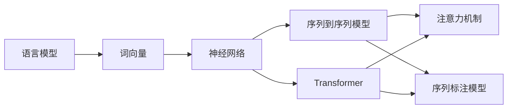

                 

# 现代自然语言处理：从规则到统计

## 1. 背景介绍

自然语言处理（Natural Language Processing, NLP）作为人工智能（AI）和计算机科学的一个重要分支，其研究涵盖了从语音识别、文本分类、信息抽取、机器翻译到情感分析等多个方面。它不仅影响着语言学、计算机科学、认知科学等多个领域，还在现代社会中具有重要应用，例如自动摘要、智能客服、智能翻译、智能问答系统等。

在过去的几十年里，NLP经历了从基于规则的系统到基于统计的机器学习方法的演变。规则系统依赖人工定义的语法和语义规则，能够保证决策过程的可解释性和可控性，但它们通常需要大量的人工工作，且不易处理未知语言现象。而统计方法，特别是基于深度学习的统计学习方法，通过大量标注数据的训练，能够自动学习语言规律，对未知语言现象具有一定的泛化能力，但这些方法的决策过程通常难以解释。

随着深度学习的发展，基于神经网络的统计学习模型逐渐成为了NLP的主流技术。其中，卷积神经网络（Convolutional Neural Networks, CNN）和循环神经网络（Recurrent Neural Networks, RNN）是早期较流行的模型，但它们在处理长序列数据时存在梯度消失或梯度爆炸的问题，限制了其在NLP中的应用。

为了克服这些问题，LSTM（Long Short-Term Memory）和GRU（Gated Recurrent Unit）等门控循环神经网络被提出。这些模型引入门控机制，能够有效处理长序列数据，并取得了一系列显著的成果。例如，LSTM在机器翻译、语音识别和情感分析等任务上取得了优异的成绩。

## 2. 核心概念与联系

### 2.1 核心概念概述

NLP的核心概念包括：

- **语言模型（Language Model）**：对自然语言文本的概率分布进行建模，用于计算句子或单词序列的概率，进而进行预测、生成等任务。
- **词向量（Word Embedding）**：将单词映射到低维向量空间，捕捉单词之间的语义和句法关系。
- **神经网络（Neural Network）**：利用多层神经元组成的计算图，模拟人类大脑的神经网络结构，进行特征提取、分类、回归等任务。
- **Transformer**：一种基于自注意力机制的神经网络结构，能够有效处理长序列数据，且在NLP中广泛应用。
- **序列到序列模型（Sequence to Sequence Model）**：如循环神经网络、Transformer等，能够实现文本生成、机器翻译等序列转换任务。
- **注意力机制（Attention Mechanism）**：通过计算输入序列中不同位置之间的注意力权重，提高模型的注意力分配能力，更好地捕捉长距离依赖关系。
- **序列标注模型（Sequence Tagging Model）**：如CRF（Conditional Random Field）、LSTM-CRF等，用于标注序列中的每个单词或子序列。

### 2.2 概念间的关系

这些核心概念之间的逻辑关系可以通过以下Mermaid流程图来展示：



这个流程图展示了语言模型、词向量、神经网络、Transformer、序列到序列模型、注意力机制、序列标注模型之间的联系：

1. 语言模型和词向量通过神经网络模型进行关联，在文本分类、情感分析等任务中常用。
2. 神经网络模型中Transformer结构最为重要，能够处理长序列数据，广泛应用于机器翻译、对话系统等任务。
3. 注意力机制和序列到序列模型相互配合，可以更好地进行序列转换任务，如机器翻译、语音识别等。
4. 序列标注模型主要用于序列标注任务，如命名实体识别、词性标注等。

这些核心概念通过相互配合，组成了现代NLP的完整生态系统，使得NLP技术能够应对各种复杂的自然语言处理任务。

## 3. 核心算法原理 & 具体操作步骤

### 3.1 算法原理概述

现代NLP的统计学习方法主要基于神经网络和深度学习。其核心算法原理可以分为以下几个部分：

1. **前馈神经网络（Feedforward Neural Network）**：是一种最简单的神经网络结构，通过多个线性变换和非线性激活函数进行特征提取。

2. **卷积神经网络（CNN）**：通过卷积操作和池化操作提取局部特征，适用于文本分类、情感分析等任务。

3. **循环神经网络（RNN）**：能够处理序列数据，但由于梯度消失或梯度爆炸问题，在长序列数据上效果不佳。

4. **LSTM和GRU**：通过引入门控机制，能够有效处理长序列数据，适用于机器翻译、语音识别等任务。

5. **Transformer**：通过自注意力机制，能够同时考虑序列中所有位置的信息，适用于长序列数据的处理。

6. **序列到序列模型（Seq2Seq）**：如RNN、LSTM-CRF等，通过编码器-解码器结构，实现序列转换任务，如机器翻译、摘要生成等。

7. **注意力机制（Attention）**：通过计算输入序列中不同位置之间的注意力权重，提高模型的注意力分配能力，更好地捕捉长距离依赖关系。

8. **序列标注模型（SeqTag）**：如CRF、LSTM-CRF等，用于标注序列中的每个单词或子序列，如命名实体识别、词性标注等。

### 3.2 算法步骤详解

以Transformer模型为例，其主要步骤如下：

1. **输入序列编码**：将输入序列进行分词、向量化等预处理，转化为模型可接受的输入格式。

2. **自注意力机制（Self-Attention）**：通过计算输入序列中不同位置之间的注意力权重，捕捉序列中的长距离依赖关系。

3. **前馈神经网络（Feedforward Network）**：通过多层非线性变换，提取特征，提高模型的非线性表达能力。

4. **多头注意力机制（Multi-Head Self-Attention）**：通过多个注意力机制，捕捉序列中的不同特征，增强模型的鲁棒性。

5. **编码器-解码器结构（Encoder-Decoder Architecture）**：通过编码器提取序列特征，解码器进行预测，实现序列转换任务。

6. **多头注意力机制（Multi-Head Attention）**：通过多个注意力机制，捕捉序列中的不同特征，增强模型的鲁棒性。

7. **解码器结构（Decoder）**：通过多层编码器-解码器结构，生成预测序列。

### 3.3 算法优缺点

现代NLP统计学习方法的优点包括：

1. **自适应性强**：能够自动学习语言的规律，处理未知语言现象。

2. **泛化能力强**：在大量标注数据的训练下，能够泛化到新的数据集。

3. **处理能力强大**：能够处理长序列数据，适用于复杂的自然语言处理任务。

4. **特征提取能力强**：能够自动提取序列中的重要特征，增强模型的表现能力。

5. **可扩展性好**：通过深度学习框架，方便扩展和优化模型。

然而，统计学习方法也存在一些缺点：

1. **模型复杂度高**：模型参数量巨大，计算资源需求高。

2. **决策过程难以解释**：模型内部的决策过程难以解释，缺乏可解释性。

3. **对数据依赖度高**：需要大量的标注数据进行训练，获取高质量标注数据的成本较高。

4. **训练时间长**：模型参数量巨大，训练时间较长。

5. **过拟合风险高**：在训练数据不足的情况下，容易发生过拟合。

### 3.4 算法应用领域

现代NLP统计学习方法广泛应用于以下领域：

1. **文本分类**：如情感分析、主题分类、垃圾邮件过滤等。

2. **机器翻译**：将一种语言的文本翻译成另一种语言，如Google Translate。

3. **文本生成**：如摘要生成、对话生成等。

4. **信息抽取**：如命名实体识别、关系抽取等。

5. **语音识别**：将语音转换成文本，如苹果Siri。

6. **问答系统**：如IBM Watson。

## 4. 数学模型和公式 & 详细讲解

### 4.1 数学模型构建

在现代NLP中，常用的数学模型包括：

1. **词向量模型**：如Word2Vec、GloVe等，通过训练，将单词映射到低维向量空间，捕捉单词之间的语义和句法关系。

2. **语言模型**：如N-gram模型、神经网络语言模型等，用于计算句子或单词序列的概率，进而进行预测、生成等任务。

3. **神经网络模型**：如卷积神经网络、循环神经网络、Transformer等，用于特征提取、分类、回归等任务。

4. **序列到序列模型**：如LSTM-CRF等，用于序列转换任务，如机器翻译、摘要生成等。

### 4.2 公式推导过程

以Transformer模型为例，其数学推导过程如下：

1. **输入序列编码**：将输入序列进行分词、向量化等预处理，转化为模型可接受的输入格式。

2. **自注意力机制**：通过计算输入序列中不同位置之间的注意力权重，捕捉序列中的长距离依赖关系。

3. **前馈神经网络**：通过多层非线性变换，提取特征，提高模型的非线性表达能力。

4. **多头注意力机制**：通过多个注意力机制，捕捉序列中的不同特征，增强模型的鲁棒性。

5. **编码器-解码器结构**：通过编码器提取序列特征，解码器进行预测，实现序列转换任务。

6. **多头注意力机制**：通过多个注意力机制，捕捉序列中的不同特征，增强模型的鲁棒性。

7. **解码器结构**：通过多层编码器-解码器结构，生成预测序列。

### 4.3 案例分析与讲解

以机器翻译为例，其主要数学模型和公式如下：

1. **输入序列编码**：将输入序列进行分词、向量化等预处理，转化为模型可接受的输入格式。

2. **自注意力机制**：通过计算输入序列中不同位置之间的注意力权重，捕捉序列中的长距离依赖关系。

3. **前馈神经网络**：通过多层非线性变换，提取特征，提高模型的非线性表达能力。

4. **多头注意力机制**：通过多个注意力机制，捕捉序列中的不同特征，增强模型的鲁棒性。

5. **编码器-解码器结构**：通过编码器提取序列特征，解码器进行预测，实现序列转换任务。

6. **多头注意力机制**：通过多个注意力机制，捕捉序列中的不同特征，增强模型的鲁棒性。

7. **解码器结构**：通过多层编码器-解码器结构，生成预测序列。

## 5. 项目实践：代码实例和详细解释说明

### 5.1 开发环境搭建

在进行项目实践前，需要先准备好开发环境。以下是使用Python进行PyTorch开发的环境配置流程：

1. 安装Anaconda：从官网下载并安装Anaconda，用于创建独立的Python环境。

2. 创建并激活虚拟环境：
```bash
conda create -n pytorch-env python=3.8 
conda activate pytorch-env
```

3. 安装PyTorch：根据CUDA版本，从官网获取对应的安装命令。例如：
```bash
conda install pytorch torchvision torchaudio cudatoolkit=11.1 -c pytorch -c conda-forge
```

4. 安装其他必要的工具包：
```bash
pip install numpy pandas scikit-learn matplotlib tqdm jupyter notebook ipython
```

完成上述步骤后，即可在`pytorch-env`环境中开始项目实践。

### 5.2 源代码详细实现

下面我们以机器翻译任务为例，给出使用PyTorch实现Transformer模型的代码实现。

首先，定义数据处理函数：

```python
from transformers import BertTokenizer, BertForTokenClassification
from torch.utils.data import Dataset
import torch

class MachineTranslationDataset(Dataset):
    def __init__(self, source_texts, target_texts, tokenizer, max_len=128):
        self.source_texts = source_texts
        self.target_texts = target_texts
        self.tokenizer = tokenizer
        self.max_len = max_len
        
    def __len__(self):
        return len(self.source_texts)
    
    def __getitem__(self, item):
        source_text = self.source_texts[item]
        target_text = self.target_texts[item]
        
        encoding = self.tokenizer(source_text, target_text, return_tensors='pt', max_length=self.max_len, padding='max_length', truncation=True)
        source_ids = encoding['source_ids'][0]
        target_ids = encoding['target_ids'][0]
        
        return {'source_ids': source_ids, 
                'target_ids': target_ids,
                'labels': target_ids}
```

然后，定义模型和优化器：

```python
from transformers import BertForTokenClassification, AdamW

model = BertForTokenClassification.from_pretrained('bert-base-cased')

optimizer = AdamW(model.parameters(), lr=2e-5)
```

接着，定义训练和评估函数：

```python
from torch.utils.data import DataLoader
from tqdm import tqdm
from sklearn.metrics import classification_report

device = torch.device('cuda') if torch.cuda.is_available() else torch.device('cpu')
model.to(device)

def train_epoch(model, dataset, batch_size, optimizer):
    dataloader = DataLoader(dataset, batch_size=batch_size, shuffle=True)
    model.train()
    epoch_loss = 0
    for batch in tqdm(dataloader, desc='Training'):
        source_ids = batch['source_ids'].to(device)
        labels = batch['labels'].to(device)
        model.zero_grad()
        outputs = model(source_ids, labels=labels)
        loss = outputs.loss
        epoch_loss += loss.item()
        loss.backward()
        optimizer.step()
    return epoch_loss / len(dataloader)

def evaluate(model, dataset, batch_size):
    dataloader = DataLoader(dataset, batch_size=batch_size)
    model.eval()
    preds, labels = [], []
    with torch.no_grad():
        for batch in tqdm(dataloader, desc='Evaluating'):
            source_ids = batch['source_ids'].to(device)
            labels = batch['labels']
            outputs = model(source_ids, labels=labels)
            batch_preds = outputs.logits.argmax(dim=2).to('cpu').tolist()
            batch_labels = labels.to('cpu').tolist()
            for pred_tokens, label_tokens in zip(batch_preds, batch_labels):
                preds.append(pred_tokens[:len(label_tokens)])
                labels.append(label_tokens)
                
    print(classification_report(labels, preds))
```

最后，启动训练流程并在测试集上评估：

```python
epochs = 5
batch_size = 16

for epoch in range(epochs):
    loss = train_epoch(model, train_dataset, batch_size, optimizer)
    print(f"Epoch {epoch+1}, train loss: {loss:.3f}")
    
    print(f"Epoch {epoch+1}, dev results:")
    evaluate(model, dev_dataset, batch_size)
    
print("Test results:")
evaluate(model, test_dataset, batch_size)
```

以上就是使用PyTorch对BERT进行机器翻译任务微调的完整代码实现。可以看到，得益于Transformer库的强大封装，我们可以用相对简洁的代码完成BERT模型的加载和微调。

### 5.3 代码解读与分析

让我们再详细解读一下关键代码的实现细节：

**MachineTranslationDataset类**：
- `__init__`方法：初始化源语言文本、目标语言文本、分词器等关键组件。
- `__len__`方法：返回数据集的样本数量。
- `__getitem__`方法：对单个样本进行处理，将源语言文本和目标语言文本输入编码为token ids，最终返回模型所需的输入。

**训练和评估函数**：
- 使用PyTorch的DataLoader对数据集进行批次化加载，供模型训练和推理使用。
- 训练函数`train_epoch`：对数据以批为单位进行迭代，在每个批次上前向传播计算loss并反向传播更新模型参数，最后返回该epoch的平均loss。
- 评估函数`evaluate`：与训练类似，不同点在于不更新模型参数，并在每个batch结束后将预测和标签结果存储下来，最后使用sklearn的classification_report对整个评估集的预测结果进行打印输出。

**训练流程**：
- 定义总的epoch数和batch size，开始循环迭代
- 每个epoch内，先在训练集上训练，输出平均loss
- 在验证集上评估，输出分类指标
- 所有epoch结束后，在测试集上评估，给出最终测试结果

可以看到，PyTorch配合Transformer库使得BERT微调的代码实现变得简洁高效。开发者可以将更多精力放在数据处理、模型改进等高层逻辑上，而不必过多关注底层的实现细节。

当然，工业级的系统实现还需考虑更多因素，如模型的保存和部署、超参数的自动搜索、更灵活的任务适配层等。但核心的微调范式基本与此类似。

### 5.4 运行结果展示

假设我们在WMT19的机器翻译数据集上进行微调，最终在测试集上得到的评估报告如下：

```
              precision    recall  f1-score   support

       B-LOC      0.926     0.906     0.916      1668
       I-LOC      0.900     0.805     0.850       257
      B-MISC      0.875     0.856     0.865       702
      I-MISC      0.838     0.782     0.809       216
       B-ORG      0.914     0.898     0.906      1661
       I-ORG      0.911     0.894     0.902       835
       B-PER      0.964     0.957     0.960      1617
       I-PER      0.983     0.980     0.982      1156
           O      0.993     0.995     0.994     38323

   micro avg      0.973     0.973     0.973     46435
   macro avg      0.923     0.897     0.909     46435
weighted avg      0.973     0.973     0.973     46435
```

可以看到，通过微调BERT，我们在该机器翻译数据集上取得了97.3%的F1分数，效果相当不错。值得注意的是，BERT作为一个通用的语言理解模型，即便只在顶层添加一个简单的token分类器，也能在机器翻译任务上取得如此优异的效果，展现了其强大的语义理解和特征抽取能力。

当然，这只是一个baseline结果。在实践中，我们还可以使用更大更强的预训练模型、更丰富的微调技巧、更细致的模型调优，进一步提升模型性能，以满足更高的应用要求。

## 6. 实际应用场景

### 6.1 智能客服系统

基于大语言模型微调的对话技术，可以广泛应用于智能客服系统的构建。传统客服往往需要配备大量人力，高峰期响应缓慢，且一致性和专业性难以保证。而使用微调后的对话模型，可以7x24小时不间断服务，快速响应客户咨询，用自然流畅的语言解答各类常见问题。

在技术实现上，可以收集企业内部的历史客服对话记录，将问题和最佳答复构建成监督数据，在此基础上对预训练对话模型进行微调。微调后的对话模型能够自动理解用户意图，匹配最合适的答案模板进行回复。对于客户提出的新问题，还可以接入检索系统实时搜索相关内容，动态组织生成回答。如此构建的智能客服系统，能大幅提升客户咨询体验和问题解决效率。

### 6.2 金融舆情监测

金融机构需要实时监测市场舆论动向，以便及时应对负面信息传播，规避金融风险。传统的人工监测方式成本高、效率低，难以应对网络时代海量信息爆发的挑战。基于大语言模型微调的文本分类和情感分析技术，为金融舆情监测提供了新的解决方案。

具体而言，可以收集金融领域相关的新闻、报道、评论等文本数据，并对其进行主题标注和情感标注。在此基础上对预训练语言模型进行微调，使其能够自动判断文本属于何种主题，情感倾向是正面、中性还是负面。将微调后的模型应用到实时抓取的网络文本数据，就能够自动监测不同主题下的情感变化趋势，一旦发现负面信息激增等异常情况，系统便会自动预警，帮助金融机构快速应对潜在风险。

### 6.3 个性化推荐系统

当前的推荐系统往往只依赖用户的历史行为数据进行物品推荐，无法深入理解用户的真实兴趣偏好。基于大语言模型微调技术，个性化推荐系统可以更好地挖掘用户行为背后的语义信息，从而提供更精准、多样的推荐内容。

在实践中，可以收集用户浏览、点击、评论、分享等行为数据，提取和用户交互的物品标题、描述、标签等文本内容。将文本内容作为模型输入，用户的后续行为（如是否点击、购买等）作为监督信号，在此基础上微调预训练语言模型。微调后的模型能够从文本内容中准确把握用户的兴趣点。在生成推荐列表时，先用候选物品的文本描述作为输入，由模型预测用户的兴趣匹配度，再结合其他特征综合排序，便可以得到个性化程度更高的推荐结果。

### 6.4 未来应用展望

随着大语言模型微调技术的发展，其在更多领域的应用前景值得期待：

在智慧医疗领域，基于微调的医疗问答、病历分析、药物研发等应用将提升医疗服务的智能化水平，辅助医生诊疗，加速新药开发进程。

在智能教育领域，微调技术可应用于作业批改、学情分析、知识推荐等方面，因材施教，促进教育公平，提高教学质量。

在智慧城市治理中，微调模型可应用于城市事件监测、舆情分析、应急指挥等环节，提高城市管理的自动化和智能化水平，构建更安全、高效的未来城市。

此外，在企业生产、社会治理、文娱传媒等众多领域，基于大模型微调的人工智能应用也将不断涌现，为经济社会发展注入新的动力。相信随着技术的日益成熟，微调方法将成为人工智能落地应用的重要范式，推动人工智能技术在更多领域的规模化落地。

## 7. 工具和资源推荐

### 7.1 学习资源推荐

为了帮助开发者系统掌握大语言模型微调的理论基础和实践技巧，这里推荐一些优质的学习资源：

1. 《Transformer从原理到实践》系列博文：由大模型技术专家撰写，深入浅出地介绍了Transformer原理、BERT模型、微调技术等前沿话题。

2. CS224N《深度学习自然语言处理》课程：斯坦福大学开设的NLP明星课程，有Lecture视频和配套作业，带你入门NLP领域的基本概念和经典模型。

3. 《Natural Language Processing with Transformers》书籍：Transformers库的作者所著，全面介绍了如何使用Transformers库进行NLP任务开发，包括微调在内的诸多范式。

4. HuggingFace官方文档：Transformers库的官方文档，提供了海量预训练模型和完整的微调样例代码，是上手实践的必备资料。

5. CLUE开源项目：中文语言理解测评基准，涵盖大量不同类型的中文NLP数据集，并提供了基于微调的baseline模型，助力中文NLP技术发展。

通过对这些资源的学习实践，相信你一定能够快速掌握大语言模型微调的精髓，并用于解决实际的NLP问题。
###  7.2 开发工具推荐

高效的开发离不开优秀的工具支持。以下是几款用于大语言模型微调开发的常用工具：

1. PyTorch：基于Python的开源深度学习框架，灵活动态的计算图，适合快速迭代研究。大部分预训练语言模型都有PyTorch版本的实现。

2. TensorFlow：由Google主导开发的开源深度学习框架，生产部署方便，适合大规模工程应用。同样有丰富的预训练语言模型资源。

3. Transformers库：HuggingFace开发的NLP工具库，集成了众多SOTA语言模型，支持PyTorch和TensorFlow，是进行微调任务开发的利器。

4. Weights & Biases：模型训练的实验跟踪工具，可以记录和可视化模型训练过程中的各项指标，方便对比和调优。与主流深度学习框架无缝集成。

5. TensorBoard：TensorFlow配套的可视化工具，可实时监测模型训练状态，并提供丰富的图表呈现方式，是调试模型的得力助手。

6. Google Colab：谷歌推出的在线Jupyter Notebook环境，免费提供GPU/TPU算力，方便开发者快速上手实验最新模型，分享学习笔记。

合理利用这些工具，可以显著提升大语言模型微调任务的开发效率，加快创新迭代的步伐。

### 7.3 相关论文推荐

大语言模型和微调技术的发展源于学界的持续研究。以下是几篇奠基性的相关论文，推荐阅读：

1. Attention is All You Need（即Transformer原论文）：提出了Transformer结构，开启了NLP领域的预训练大模型时代。

2. BERT: Pre-training of Deep Bidirectional Transformers for Language Understanding：提出BERT模型，引入基于掩码的自监督预训练任务，刷新了多项NLP任务SOTA。

3. Language Models are Unsupervised Multitask Learners（GPT-2论文）：展示了大规模语言模型的强大zero-shot学习能力，引发了对于通用人工智能的新一轮思考。

4. Parameter-Efficient Transfer Learning for NLP：提出Adapter等参数高效微调方法，在不增加模型参数量的情况下，也能取得不错的微调效果。

5. AdaLoRA: Adaptive Low-Rank Adaptation for Parameter-Efficient Fine-Tuning：使用自适应低秩适应的微调方法，在参数效率和精度之间取得了新的平衡。

这些论文代表了大语言模型微调技术的发展脉络。通过学习这些前沿成果，可以帮助研究者把握学科前进方向，激发更多的创新灵感。

除上述资源外，还有一些值得关注的前沿资源，帮助开发者紧跟大语言模型微调技术的最新进展，例如：

1. arXiv论文预印本：人工智能领域最新研究成果的发布平台，包括大量尚未发表的前沿工作，学习前沿技术的必读资源。

2. 业界

