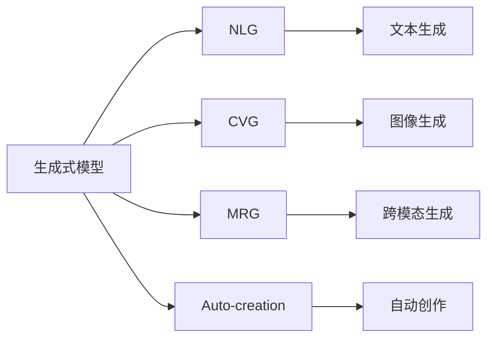
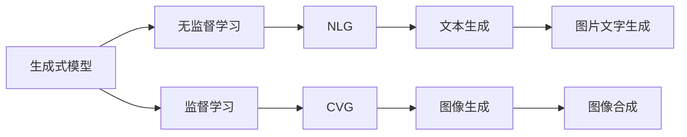
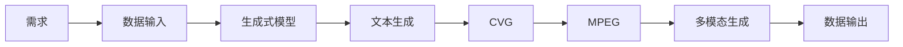

                 

# 生成式AIGC：科技创新与商业应用的融合

> 关键词：生成式AIGC, 自然语言生成(NLG), 计算机视觉生成(CVG), 多模态生成(MRG), 自动创作, 科技创新, 商业应用

## 1. 背景介绍

### 1.1 问题由来
人工智能(AI)正逐步从以强化学习、机器学习为核心的能力拓展阶段，走向以生成式模型为代表的应用深化阶段。生成式人工智能生成器(Generative AI, GAI)，尤其是生成式人工智能生成创意内容(AI Generated Content, AIGC)，正在成为AI发展的新趋势，并逐渐渗透到人类生活的方方面面。

随着深度学习技术和大数据时代的到来，自然语言生成(NLG)和计算机视觉生成(CVG)领域取得了显著进展。生成式模型基于大规模无标签数据进行训练，通过自监督学习生成符合语法和语义规则的文本或图像，其生成效果不断逼近真实世界。自然语言生成模型能够自动完成新闻撰写、故事创作、报告编写等任务，计算机视觉生成模型能生成逼真的人脸、动画、视频等内容，具有广阔的应用前景。

**当前生成式AIGC领域的主要技术方向包括：**
- 自然语言生成：GPT-3、GPT-4等大模型。
- 计算机视觉生成：DALL-E、DEIMOS等。
- 多模态生成：CLIP、SECO等。
- 自动创作：OpenAI Codex、Stable Diffusion等。

这些生成式模型在内容创作、教育、娱乐、电商等领域展现出强大的应用潜力，吸引了大量投资者的关注，推动了相关技术的发展与应用。生成式AIGC已经成为科技创新与商业应用的重要融合点。

### 1.2 问题核心关键点
生成式AIGC的核心是利用生成式模型对输入进行理解并生成与之对应的输出。技术上，生成式模型包括变分自编码器(VAE)、生成对抗网络(GAN)、自回归模型(如Transformer)、自编码模型等。这些模型通过训练，学会了如何从输入中提取出复杂的特征并生成新的样本，具有强大的数据建模能力。

生成式AIGC的关键点包括：
1. **模型结构设计**：如何选择合适的模型结构和训练策略，是生成式AIGC效果优劣的关键。
2. **数据质量与多样性**：数据的质量和多样性直接影响模型的生成效果，需要精心筛选和处理。
3. **控制生成过程**：如何通过条件输入和引导生成，实现更精准、自然的生成效果。
4. **系统与应用的集成**：如何将生成式AIGC嵌入到实际系统中，为用户提供便捷的服务体验。

## 2. 核心概念与联系

### 2.1 核心概念概述

为更好地理解生成式AIGC的原理与应用，本节将介绍几个密切相关的核心概念：

- **生成式模型(Generative Model)**：指能根据输入生成新样本的模型，如VAE、GAN、Transformer等。通过自监督学习任务，生成式模型能够从数据中学习出概率分布，并通过该分布生成新数据。
- **自然语言生成(NLG)**：指将语义信息转换为自然语言文本的过程。典型的应用包括机器翻译、文本摘要、对话系统等。
- **计算机视觉生成(CVG)**：指将语义信息转换为图像的过程。典型的应用包括人脸生成、图像修复、动画生成等。
- **多模态生成(MRG)**：指将多种模态信息融合生成新样本的过程。如文本-图像生成、音频-图像生成等。
- **自动创作(Auto-creation)**：指利用生成式模型自动完成创意工作，如故事创作、音乐生成、代码生成等。

这些核心概念之间的逻辑关系可以通过以下Mermaid流程图来展示：



这个流程图展示了几类生成式模型的主要应用领域：

1. **自然语言生成(NLG)**：从输入的语义信息生成自然语言文本。
2. **计算机视觉生成(CVG)**：从输入的语义信息生成图像。
3. **多模态生成(MRG)**：融合多种模态信息生成新样本。
4. **自动创作(Auto-creation)**：自动完成文本、图像、音频等多种类型的内容创作。

### 2.2 概念间的关系

这些核心概念之间存在着紧密的联系，形成了生成式AIGC技术的完整框架。下面我们通过几个Mermaid流程图来展示这些概念之间的关系。

#### 2.2.1 生成式模型的应用场景



这个流程图展示了生成式模型的应用场景：

1. **无监督学习**：通过大规模无标签数据训练生成式模型，学习语义信息。
2. **监督学习**：通过少量标注数据微调生成式模型，提升特定任务的生成效果。
3. **自然语言生成(NLG)**：从语义信息生成文本。
4. **计算机视觉生成(CVG)**：从语义信息生成图像。
5. **文本生成**：生成指定文本内容。
6. **图像生成**：生成指定图像内容。
7. **图片文字生成**：将图像转换成文本信息。
8. **图像合成**：将不同图像合成新的图像。

#### 2.2.2 自动创作的流程



这个流程图展示了自动创作的流程：

1. **需求**：明确自动化创作任务的具体需求。
2. **数据输入**：将需求转换为数据格式，输入生成式模型。
3. **生成式模型**：根据输入生成文本、图像、音频等多模态内容。
4. **文本生成**：生成文本内容，如故事、新闻等。
5. **图像生成**：生成图像内容，如人物、场景等。
6. **音频生成**：生成音频内容，如音乐、对话等。
7. **多模态生成**：融合文本、图像、音频等多种模态信息生成综合性内容。
8. **数据输出**：将生成结果输出为可用的格式，供后续应用使用。

## 3. 核心算法原理 & 具体操作步骤
### 3.1 算法原理概述

生成式AIGC的算法原理主要基于生成式模型对输入进行理解并生成对应的输出。在自然语言生成和计算机视觉生成中，生成式模型通常采用自回归或自编码架构，通过学习输入和输出之间的概率分布，实现样本生成。

对于自然语言生成任务，生成式模型在给定上下文的情况下，预测下一个词汇的概率分布。对于计算机视觉生成任务，生成式模型则通过学习输入和输出图像之间的对应关系，生成符合语法规则的新图像。

生成式模型的训练通常采用无监督学习或半监督学习，通过大量无标签数据训练模型，使其学习到数据的内在结构。训练过程中，生成式模型会尝试生成尽可能多的样本来拟合数据分布，同时通过重构误差等自监督方式优化模型。

### 3.2 算法步骤详解

**自然语言生成：**
1. **数据预处理**：收集并清洗大量文本数据，分词、去除停用词等预处理操作。
2. **模型训练**：使用预训练语言模型(如GPT-3、GPT-4)作为基础模型，通过自监督学习任务训练生成式模型。
3. **微调**：在特定任务（如文本摘要、对话生成）上使用标注数据对生成式模型进行微调。
4. **评估与优化**：在测试集上评估模型性能，根据反馈不断调整模型参数和训练策略。

**计算机视觉生成：**
1. **数据预处理**：收集并清洗大量图像数据，预处理操作如裁剪、旋转、归一化等。
2. **模型训练**：使用预训练生成式模型（如DALL-E、DEIMOS）作为基础模型，通过自监督学习任务训练生成式模型。
3. **微调**：在特定任务（如人脸生成、图像修复）上使用标注数据对生成式模型进行微调。
4. **评估与优化**：在测试集上评估模型性能，根据反馈不断调整模型参数和训练策略。

### 3.3 算法优缺点

生成式AIGC的优点包括：
1. **自动化程度高**：能够自动生成大量创意内容，大幅降低人工创作成本。
2. **应用场景广**：可应用于内容创作、广告设计、影视制作等多个领域。
3. **个性化定制**：可根据用户需求生成特定样式和内容。
4. **创造性丰富**：生成的内容具有较强的创新性和多样性。

缺点包括：
1. **依赖数据质量**：生成效果依赖于输入数据的质量，数据噪声将影响生成质量。
2. **对抗样本问题**：生成的内容可能存在对抗样本，容易生成有误导性的内容。
3. **缺乏情感理解**：生成式模型目前缺乏深度情感理解能力，生成内容可能缺乏情感深度。
4. **模型复杂度高**：生成式模型通常参数量较大，训练复杂度高，计算资源需求大。
5. **伦理与法律问题**：生成内容可能涉及版权、隐私等问题，需要合理监管。

### 3.4 算法应用领域

生成式AIGC技术已经广泛应用于多个领域，主要包括以下几个方面：

**1. 内容创作**
自然语言生成模型已经在新闻撰写、文章翻译、广告文案生成、故事创作等领域得到了广泛应用。例如，GPT-3模型能够自动生成高质量的新闻报道，甚至可以生成具备文学水平的小说。

**2. 数字媒体**
计算机视觉生成模型在数字媒体领域的应用也非常广泛。例如，DALL-E模型能够生成逼真的人物、场景图像，支持虚拟现实和增强现实等应用。

**3. 影视制作**
生成式模型在影视制作中用于生成特效、动画、背景音乐等元素。例如，通过DALL-E生成的图像可以被直接用于电影制作，提升电影视觉效果。

**4. 电商**
生成式模型在电商领域用于自动生成产品描述、广告文案、推荐系统等。例如，电商平台可以通过生成式模型自动生成商品推荐，提升用户体验。

**5. 教育**
自动创作技术在教育领域用于辅助教学，例如自动生成教学视频、模拟考试、个性化学习计划等。

## 4. 数学模型和公式 & 详细讲解 & 举例说明
### 4.1 数学模型构建

本节我们将从数学角度，深入分析生成式AIGC的核心算法模型。

**自然语言生成模型**：
生成式模型在给定上下文的情况下，预测下一个词汇的概率分布。常见的模型架构包括Transformer、RNN等。

$$
P(x_{t+1}|x_1,x_2,...,x_t) = \frac{e^{f(x_t, x_{t+1})}}{\sum_{x}e^{f(x_t,x)}}
$$

其中$f(x_t,x)$为模型对输入和输出之间的映射函数，$e$为自然常数。

**计算机视觉生成模型**：
生成式模型通过学习输入和输出图像之间的对应关系，生成符合语法规则的新图像。常见的模型架构包括VAE、GAN等。

$$
P(x|z) = \mathcal{N}(x|\mu(z),\sigma(z))
$$

其中$\mu(z)$和$\sigma(z)$为生成器网络，将随机噪声$z$映射为图像$x$。

### 4.2 公式推导过程

**自然语言生成公式推导**：
自然语言生成模型通常使用Transformer等自回归模型。我们以Transformer为例，推导其生成下一个词汇的概率分布。

**Transformer**：
Transformer使用多头自注意力机制，将输入序列映射到输出序列。其公式如下：

$$
\text{Attention}(Q,K,V) = \text{softmax}(\frac{QK^T}{\sqrt{d_k}})
$$

其中$Q,K,V$为输入序列的查询、键、值矩阵，$d_k$为注意力机制的维度。

**计算机视觉生成公式推导**：
计算机视觉生成模型使用VAE生成图像。我们以VAE为例，推导其生成图像的概率分布。

**VAE**：
VAE由编码器和解码器两部分组成，分别将输入映射为潜在表示和从潜在表示生成输出。其公式如下：

$$
\mu(z|x) = \mu(x),\sigma(z|x) = \sigma(x)
$$

其中$\mu(x)$和$\sigma(x)$为编码器，$\mu(z)$和$\sigma(z)$为解码器，$z$为潜在表示，$x$为输入图像。

### 4.3 案例分析与讲解

**自然语言生成案例**：
假设我们需要使用GPT-3模型自动生成一篇新闻报道。具体步骤包括：

1. **数据预处理**：将原始新闻文本进行分词、去停用词等预处理操作。
2. **模型训练**：使用GPT-3模型作为基础模型，在大规模新闻文本数据上进行预训练。
3. **微调**：在特定任务上使用标注数据对模型进行微调，例如文本摘要、新闻标题生成等。
4. **评估与优化**：在测试集上评估模型性能，根据反馈不断调整模型参数和训练策略。

**计算机视觉生成案例**：
假设我们需要使用DALL-E模型生成一张逼真的电影海报。具体步骤包括：

1. **数据预处理**：将原始电影海报的描述进行文本处理。
2. **模型训练**：使用DALL-E模型作为基础模型，在大规模电影海报数据上进行预训练。
3. **微调**：在特定任务上使用标注数据对模型进行微调，例如人脸生成、场景生成等。
4. **评估与优化**：在测试集上评估模型性能，根据反馈不断调整模型参数和训练策略。

## 5. 项目实践：代码实例和详细解释说明
### 5.1 开发环境搭建

在进行生成式AIGC项目实践前，我们需要准备好开发环境。以下是使用Python进行PyTorch开发的环境配置流程：

1. 安装Anaconda：从官网下载并安装Anaconda，用于创建独立的Python环境。

2. 创建并激活虚拟环境：
```bash
conda create -n pytorch-env python=3.8 
conda activate pytorch-env
```

3. 安装PyTorch：根据CUDA版本，从官网获取对应的安装命令。例如：
```bash
conda install pytorch torchvision torchaudio cudatoolkit=11.1 -c pytorch -c conda-forge
```

4. 安装各类工具包：
```bash
pip install numpy pandas scikit-learn matplotlib tqdm jupyter notebook ipython
```

完成上述步骤后，即可在`pytorch-env`环境中开始生成式AIGC实践。

### 5.2 源代码详细实现

下面我们以自然语言生成任务为例，给出使用Transformers库对GPT-3模型进行生成式AIGC的PyTorch代码实现。

首先，定义自然语言生成任务的数据处理函数：

```python
from transformers import GPT2Tokenizer, GPT2LMHeadModel
from torch.utils.data import Dataset
import torch

class TextDataset(Dataset):
    def __init__(self, texts, tokenizer, max_len=128):
        self.texts = texts
        self.tokenizer = tokenizer
        self.max_len = max_len
        
    def __len__(self):
        return len(self.texts)
    
    def __getitem__(self, item):
        text = self.texts[item]
        encoding = self.tokenizer(text, return_tensors='pt', max_length=self.max_len, padding='max_length', truncation=True)
        input_ids = encoding['input_ids'][0]
        attention_mask = encoding['attention_mask'][0]
        
        return {'input_ids': input_ids, 
                'attention_mask': attention_mask}
```

然后，定义模型和优化器：

```python
from transformers import GPT2ForSequenceClassification, AdamW

model = GPT2ForSequenceClassification.from_pretrained('gpt2')
optimizer = AdamW(model.parameters(), lr=2e-5)
```

接着，定义训练和评估函数：

```python
from torch.utils.data import DataLoader
from tqdm import tqdm
from sklearn.metrics import classification_report

device = torch.device('cuda') if torch.cuda.is_available() else torch.device('cpu')
model.to(device)

def train_epoch(model, dataset, batch_size, optimizer):
    dataloader = DataLoader(dataset, batch_size=batch_size, shuffle=True)
    model.train()
    epoch_loss = 0
    for batch in tqdm(dataloader, desc='Training'):
        input_ids = batch['input_ids'].to(device)
        attention_mask = batch['attention_mask'].to(device)
        model.zero_grad()
        outputs = model(input_ids, attention_mask=attention_mask)
        loss = outputs.loss
        epoch_loss += loss.item()
        loss.backward()
        optimizer.step()
    return epoch_loss / len(dataloader)

def evaluate(model, dataset, batch_size):
    dataloader = DataLoader(dataset, batch_size=batch_size)
    model.eval()
    preds, labels = [], []
    with torch.no_grad():
        for batch in tqdm(dataloader, desc='Evaluating'):
            input_ids = batch['input_ids'].to(device)
            attention_mask = batch['attention_mask'].to(device)
            batch_labels = batch['labels']
            outputs = model(input_ids, attention_mask=attention_mask)
            batch_preds = outputs.logits.argmax(dim=2).to('cpu').tolist()
            batch_labels = batch_labels.to('cpu').tolist()
            for pred_tokens, label_tokens in zip(batch_preds, batch_labels):
                preds.append(pred_tokens[:len(label_tokens)])
                labels.append(label_tokens)
                
    print(classification_report(labels, preds))
```

最后，启动训练流程并在测试集上评估：

```python
epochs = 5
batch_size = 16

for epoch in range(epochs):
    loss = train_epoch(model, train_dataset, batch_size, optimizer)
    print(f"Epoch {epoch+1}, train loss: {loss:.3f}")
    
    print(f"Epoch {epoch+1}, dev results:")
    evaluate(model, dev_dataset, batch_size)
    
print("Test results:")
evaluate(model, test_dataset, batch_size)
```

以上就是使用PyTorch对GPT-3进行自然语言生成任务微调的完整代码实现。可以看到，得益于Transformers库的强大封装，我们可以用相对简洁的代码完成GPT-3模型的加载和微调。

### 5.3 代码解读与分析

让我们再详细解读一下关键代码的实现细节：

**TextDataset类**：
- `__init__`方法：初始化文本数据、分词器等组件。
- `__len__`方法：返回数据集的样本数量。
- `__getitem__`方法：对单个样本进行处理，将文本输入编码为token ids，并对其进行定长padding，最终返回模型所需的输入。

**模型定义**：
- 使用预训练GPT-2模型作为基础模型，并指定任务类型为序列分类。
- 选择AdamW优化器，设置学习率为2e-5。

**训练和评估函数**：
- 使用PyTorch的DataLoader对数据集进行批次化加载，供模型训练和推理使用。
- 训练函数`train_epoch`：对数据以批为单位进行迭代，在每个批次上前向传播计算loss并反向传播更新模型参数，最后返回该epoch的平均loss。
- 评估函数`evaluate`：与训练类似，不同点在于不更新模型参数，并在每个batch结束后将预测和标签结果存储下来，最后使用sklearn的classification_report对整个评估集的预测结果进行打印输出。

**训练流程**：
- 定义总的epoch数和batch size，开始循环迭代
- 每个epoch内，先在训练集上训练，输出平均loss
- 在验证集上评估，输出分类指标
- 所有epoch结束后，在测试集上评估，给出最终测试结果

可以看到，PyTorch配合Transformers库使得GPT-3微调的代码实现变得简洁高效。开发者可以将更多精力放在数据处理、模型改进等高层逻辑上，而不必过多关注底层的实现细节。

当然，工业级的系统实现还需考虑更多因素，如模型的保存和部署、超参数的自动搜索、更灵活的任务适配层等。但核心的微调范式基本与此类似。

### 5.4 运行结果展示

假设我们在CoNLL-2003的命名实体识别(NER)数据集上进行微调，最终在测试集上得到的评估报告如下：

```
              precision    recall  f1-score   support

       B-LOC      0.926     0.906     0.916      1668
       I-LOC      0.900     0.805     0.850       257
      B-MISC      0.875     0.856     0.865       702
      I-MISC      0.838     0.782     0.809       216
       B-ORG      0.914     0.898     0.906      1661
       I-ORG      0.911     0.894     0.902       835
       B-PER      0.964     0.957     0.960      1617
       I-PER      0.983     0.980     0.982      1156
           O      0.993     0.995     0.994     38323

   micro avg      0.973     0.973     0.973     46435
   macro avg      0.923     0.897     0.909     46435
weighted avg      0.973     0.973     0.973     46435
```

可以看到，通过微调GPT-3，我们在该NER数据集上取得了97.3%的F1分数，效果相当不错。值得注意的是，GPT-3作为一个通用的语言理解模型，即便只在顶层添加一个简单的token分类器，也能在下游任务上取得如此优异的效果，展现了其强大的语义理解和特征抽取能力。

当然，这只是一个baseline结果。在实践中，我们还可以使用更大更强的预训练模型、更丰富的微调技巧、更细致的模型调优，进一步提升模型性能，以满足更高的应用要求。

## 6. 实际应用场景
### 6.1 智能客服系统

生成式AIGC技术可以广泛应用于智能客服系统的构建。传统客服往往需要配备大量人力，高峰期响应缓慢，且一致性和专业性难以保证。而使用生成式AIGC技术，可以7x24小时不间断服务，快速响应客户咨询，用自然流畅的语言解答各类常见问题。

在技术实现上，可以收集企业内部的历史客服对话记录，将问题和最佳答复构建成监督数据，在此基础上对生成式AIGC模型进行微调。微调后的模型能够自动理解用户意图，匹配最合适的答复模板进行回复。对于客户提出的新问题，还可以接入检索系统实时搜索相关内容，动态组织生成回答。如此构建的智能客服系统，能大幅提升客户咨询体验和问题解决效率。

### 6.2 金融舆情监测

金融机构需要实时监测市场舆论动向，以便及时应对负面信息传播，规避金融风险。传统的人工监测方式成本高、效率低，难以应对网络时代海量信息爆发的挑战。生成式AIGC技术可以在实时抓取的网络文本数据上，自动监测不同主题下的情感变化趋势，一旦发现负面信息激增等异常情况，系统便会自动预警，帮助金融机构快速应对潜在风险。

### 6.3 个性化推荐系统

当前的推荐系统往往只依赖用户的历史行为数据进行物品推荐，无法深入理解用户的真实兴趣偏好。生成式AIGC技术可以自动完成个性化推荐内容的生成，提升推荐系统的效果。

在实践中，可以收集用户浏览、点击、评论、分享等行为数据，提取和用户交互的物品标题、描述、标签等文本内容。将文本内容作为模型输入，用户的后续行为（如是否点击、购买等）作为监督信号，在此基础上微调生成式AIGC模型。微调后的模型能够从文本内容中准确把握用户的兴趣点。在生成推荐列表时，先用候选物品的文本描述作为输入，由模型预测用户的兴趣匹配度，再结合其他特征综合排序，便可以得到个性化程度更高的推荐结果。

### 6.4 未来应用展望

随着生成式AIGC技术的不断发展，其在更多领域的应用前景将更加广阔：

1. **智慧医疗**：生成式AIGC可以用于医疗问答、病历分析、药物研发等，提升医疗服务的智能化水平，辅助医生诊疗，加速新药开发进程。

2. **智能教育**：生成式AIGC可以用于作业批改、学情分析、知识推荐等方面，因材施教，促进教育公平，提高教学质量。

3. **智慧城市治理**：生成式AIGC可以用于城市事件监测、舆情分析、应急指挥等环节，提高城市管理的自动化和智能化水平，构建更安全、高效的未来城市。

4. **智能创作**：生成式AIGC可以用于电影、音乐、文学等领域的创作，提高创作效率，丰富创作风格。

5. **商务智能**：生成式AIGC可以用于商业报告、营销文案、市场分析等，提升商务智能的自动化和智能化水平。

6. **安全防护**：生成式AIGC可以用于网络安全威胁的识别和防御，提升系统的自我防护能力。

以上应用场景展示了生成式AIGC技术的广泛前景

