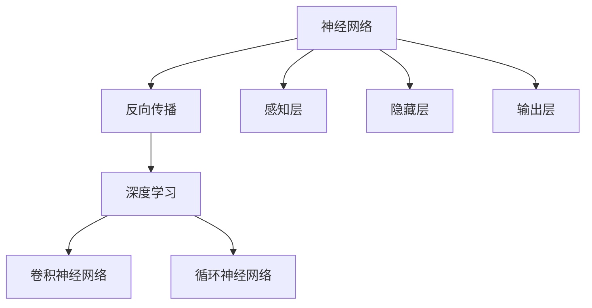
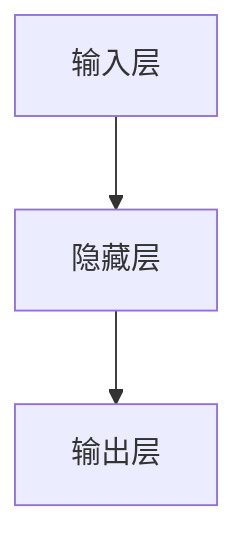
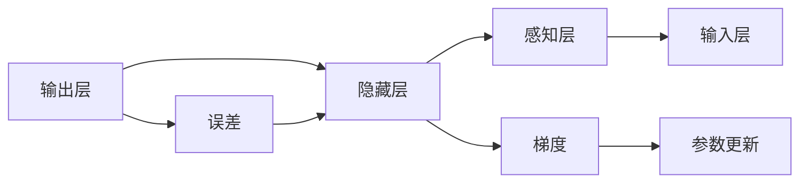
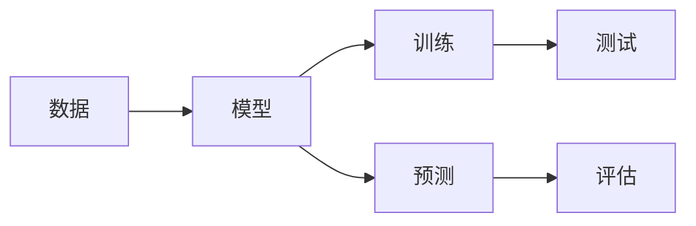

                 

# 神经网络：人工智能的基石

> 关键词：神经网络,人工智能,深度学习,机器学习,算法优化,反向传播,PyTorch

## 1. 背景介绍

### 1.1 问题由来
人工智能(AI)作为21世纪最具颠覆性的技术之一，近年来在计算机视觉、自然语言处理、语音识别等多个领域取得了显著进展。其中，神经网络(Neural Networks)作为AI的核心技术，通过模拟人脑的神经元活动，实现了复杂的模式识别和预测任务，开启了新的科学革命。

### 1.2 问题核心关键点
神经网络的核心思想在于通过多个层级的信息变换，逐步提取输入数据的高层次特征。其核心概念包括：
- **感知层**：输入数据通过感知层进行线性变换，得到初步的特征表示。
- **隐藏层**：通过多层非线性变换，逐步学习数据的深层特征。
- **输出层**：最终输出模型对输入数据的预测或分类结果。

神经网络的核心算法包括前向传播和反向传播。前向传播通过网络传递输入数据，计算各层的输出。反向传播则根据输出误差，逐层反向传播梯度，更新网络参数，以最小化预测误差。

神经网络的成功应用，源于其对复杂非线性关系的建模能力。通过深度学习和大量数据的训练，神经网络能够自动提取特征，避免手工特征工程的繁琐。近年来，神经网络在图像识别、语音识别、自然语言处理等多个领域展现了强大的性能，推动了AI技术的广泛应用。

### 1.3 问题研究意义
神经网络作为AI的基石，其研究和发展具有重要的理论意义和实际价值：
1. **理论突破**：神经网络理论的深入研究，有助于我们更好地理解脑科学和认知过程，推动计算机科学和认知科学的融合。
2. **技术创新**：神经网络的不断优化和改进，推动了深度学习、强化学习等前沿技术的发展，成为AI技术进步的重要推动力。
3. **产业应用**：神经网络技术在实际应用中取得了巨大的成功，如自动驾驶、智能推荐、智能客服等，成为推动智能产业升级的重要力量。
4. **伦理考量**：神经网络技术的发展也带来了隐私保护、公平性、可解释性等伦理问题，需要我们认真对待，确保AI技术的良性发展。

## 2. 核心概念与联系

### 2.1 核心概念概述

为了更好地理解神经网络的核心原理和架构，本节将介绍几个关键概念：

- **神经网络**：由感知层、隐藏层和输出层组成的计算模型，模拟人脑神经元的活动。
- **反向传播**：根据输出误差，逐层反向传播梯度，更新网络参数，以最小化预测误差。
- **深度学习**：基于多层次神经网络的机器学习方法，通过大量数据训练，学习数据的深层特征。
- **卷积神经网络**(CNN)：针对图像数据的特殊神经网络结构，利用卷积操作提取局部特征。
- **循环神经网络**(RNN)：针对序列数据的特殊神经网络结构，利用循环结构处理时间序列数据。

这些核心概念之间的逻辑关系可以通过以下Mermaid流程图来展示：



这个流程图展示了大神经网络的基本构成和主要概念之间的关系：

1. 神经网络由感知层、隐藏层和输出层组成。
2. 深度学习通过多层神经网络学习数据特征。
3. CNN和RNN分别针对图像和序列数据，采用不同的网络结构。
4. 反向传播是深度学习中的关键算法，用于参数优化。

### 2.2 概念间的关系

这些核心概念之间存在着紧密的联系，形成了神经网络学习和应用的基本框架。

#### 2.2.1 神经网络的层次结构



这个流程图展示了神经网络的层次结构：

1. 输入层接收原始数据，进行初步特征提取。
2. 隐藏层进行多次非线性变换，提取高层次特征。
3. 输出层根据最终特征，进行预测或分类。

#### 2.2.2 反向传播算法



这个流程图展示了反向传播算法的基本流程：

1. 输出层计算预测值与真实值之间的误差。
2. 误差逐层反向传播，计算各层的梯度。
3. 根据梯度更新模型参数，最小化预测误差。

#### 2.2.3 深度学习的范式



这个流程图展示了深度学习的流程范式：

1. 收集大量数据，用于训练模型。
2. 模型通过反向传播算法不断优化参数。
3. 在测试集上评估模型性能，并进行预测。
4. 根据预测结果，调整模型参数，进一步优化。

## 3. 核心算法原理 & 具体操作步骤
### 3.1 算法原理概述

神经网络的训练过程主要通过反向传播算法实现。其核心原理在于利用梯度下降等优化算法，最小化预测误差。通过不断迭代优化，神经网络能够逐步提升模型的准确性和泛化能力。

### 3.2 算法步骤详解

神经网络的训练过程一般包括以下几个关键步骤：

**Step 1: 准备训练数据**

- **数据集划分**：将数据集划分为训练集、验证集和测试集，分别用于模型训练、调参和最终评估。
- **数据预处理**：对原始数据进行标准化、归一化、增强等预处理，以便于模型训练。

**Step 2: 初始化模型参数**

- **随机初始化**：对神经网络的所有参数进行随机初始化，通常是均值为0、标准差为0.01的高斯分布。
- **超参数设定**：选择合适的学习率、批大小、迭代次数等超参数，初始化训练过程。

**Step 3: 前向传播**

- **前向传递**：将输入数据输入神经网络，通过各层的前向传播计算得到输出结果。
- **损失计算**：计算输出结果与真实标签之间的损失函数，通常是交叉熵损失或均方误差损失。

**Step 4: 反向传播**

- **梯度计算**：根据输出误差，逐层计算各层的梯度。
- **参数更新**：利用梯度下降等优化算法，更新模型参数，减小预测误差。

**Step 5: 模型评估**

- **验证集评估**：在验证集上评估模型性能，调整超参数和模型结构。
- **测试集评估**：在测试集上全面评估模型性能，给出最终结果。

### 3.3 算法优缺点

神经网络作为AI的核心技术，具有以下优点：
1. **强大的特征提取能力**：通过多层次网络结构，神经网络能够自动学习数据的高层次特征。
2. **适应性强**：能够处理多种类型的数据，如图像、文本、时间序列等。
3. **鲁棒性**：对于噪声和干扰具有一定程度的鲁棒性，能够适应数据分布的变化。

但神经网络也存在一些缺点：
1. **数据依赖性强**：需要大量的标注数据进行训练，数据获取成本较高。
2. **计算资源消耗大**：大规模神经网络需要大量的计算资源和存储空间，训练成本较高。
3. **可解释性不足**：神经网络的内部工作机制难以解释，缺乏透明度和可信度。
4. **易受梯度消失和爆炸**：深度神经网络容易发生梯度消失和爆炸问题，导致训练困难。

### 3.4 算法应用领域

神经网络技术在多个领域得到了广泛应用，包括：

- **计算机视觉**：用于图像分类、目标检测、语义分割等任务。
- **自然语言处理**：用于文本分类、情感分析、机器翻译等任务。
- **语音识别**：用于语音识别、语音合成、语音情感分析等任务。
- **推荐系统**：用于商品推荐、新闻推荐、广告推荐等任务。
- **自动驾驶**：用于环境感知、路径规划、决策优化等任务。

此外，神经网络技术还应用于金融、医疗、能源、交通等多个领域，为这些行业带来了深刻的变革和突破。

## 4. 数学模型和公式 & 详细讲解 & 举例说明

### 4.1 数学模型构建

神经网络的数学模型可以表示为：

$$
y = f_W(\text{X})
$$

其中，$y$为输出结果，$X$为输入数据，$W$为网络参数，$f_W$为网络前向传播函数。

### 4.2 公式推导过程

以二分类任务为例，神经网络的输出层可以使用Sigmoid函数进行计算：

$$
\text{sigmoid}(z) = \frac{1}{1 + e^{-z}}
$$

其中，$z$为线性变换后的输出，即：

$$
z = \text{W}X + b
$$

其中，$W$为权重矩阵，$b$为偏置向量。

神经网络的损失函数通常采用交叉熵损失函数：

$$
\mathcal{L} = -\frac{1}{N}\sum_{i=1}^N[y_i\log\text{sigmoid}(z_i)+(1-y_i)\log(1-\text{sigmoid}(z_i))]
$$

其中，$y_i$为真实标签，$\text{sigmoid}(z_i)$为模型预测结果。

### 4.3 案例分析与讲解

以卷积神经网络(CNN)为例，CNN的主要结构包括卷积层、池化层和全连接层：

- **卷积层**：通过卷积操作提取局部特征，减小参数量。
- **池化层**：通过池化操作减小特征图的大小，提高计算效率。
- **全连接层**：将特征图转换为最终的输出结果。

以下是一个简单的CNN示例，使用PyTorch实现：

```python
import torch
import torch.nn as nn
import torch.optim as optim

class CNN(nn.Module):
    def __init__(self):
        super(CNN, self).__init__()
        self.conv1 = nn.Conv2d(3, 32, 3, 1)
        self.conv2 = nn.Conv2d(32, 64, 3, 1)
        self.pool = nn.MaxPool2d(2, 2)
        self.fc1 = nn.Linear(64 * 16 * 16, 120)
        self.fc2 = nn.Linear(120, 84)
        self.fc3 = nn.Linear(84, 10)

    def forward(self, x):
        x = self.pool(F.relu(self.conv1(x)))
        x = self.pool(F.relu(self.conv2(x)))
        x = x.view(-1, 64 * 16 * 16)
        x = F.relu(self.fc1(x))
        x = F.relu(self.fc2(x))
        x = self.fc3(x)
        return x

# 定义模型和优化器
model = CNN()
criterion = nn.CrossEntropyLoss()
optimizer = optim.SGD(model.parameters(), lr=0.001, momentum=0.9)

# 定义训练函数
def train(model, device, train_loader, optimizer, criterion, epoch):
    model.train()
    for batch_idx, (data, target) in enumerate(train_loader):
        data, target = data.to(device), target.to(device)
        optimizer.zero_grad()
        output = model(data)
        loss = criterion(output, target)
        loss.backward()
        optimizer.step()

# 训练模型
train_loader = torch.utils.data.DataLoader(train_dataset, batch_size=64, shuffle=True)
device = torch.device("cuda:0" if torch.cuda.is_available() else "cpu")
for epoch in range(10):
    train(model, device, train_loader, optimizer, criterion, epoch)
```

在实践中，我们还需要对模型进行调优，以获得更好的性能。常用的调优方法包括：

- **学习率调整**：通过学习率衰减、自适应学习率算法等，调整学习率。
- **正则化**：通过L2正则、Dropout等，防止模型过拟合。
- **批大小调整**：通过批大小调整，优化内存使用和计算效率。
- **模型集成**：通过模型集成，提升模型泛化能力。

## 5. 项目实践：代码实例和详细解释说明

### 5.1 开发环境搭建

在进行神经网络项目实践前，我们需要准备好开发环境。以下是使用Python进行PyTorch开发的环境配置流程：

1. 安装Anaconda：从官网下载并安装Anaconda，用于创建独立的Python环境。

2. 创建并激活虚拟环境：
```bash
conda create -n pytorch-env python=3.8 
conda activate pytorch-env
```

3. 安装PyTorch：根据CUDA版本，从官网获取对应的安装命令。例如：
```bash
conda install pytorch torchvision torchaudio cudatoolkit=11.1 -c pytorch -c conda-forge
```

4. 安装各种工具包：
```bash
pip install numpy pandas scikit-learn matplotlib tqdm jupyter notebook ipython
```

完成上述步骤后，即可在`pytorch-env`环境中开始项目实践。

### 5.2 源代码详细实现

下面我们以卷积神经网络(CNN)为例，给出使用PyTorch实现的代码。

```python
import torch
import torch.nn as nn
import torch.optim as optim

class CNN(nn.Module):
    def __init__(self):
        super(CNN, self).__init__()
        self.conv1 = nn.Conv2d(3, 32, 3, 1)
        self.conv2 = nn.Conv2d(32, 64, 3, 1)
        self.pool = nn.MaxPool2d(2, 2)
        self.fc1 = nn.Linear(64 * 16 * 16, 120)
        self.fc2 = nn.Linear(120, 84)
        self.fc3 = nn.Linear(84, 10)

    def forward(self, x):
        x = self.pool(F.relu(self.conv1(x)))
        x = self.pool(F.relu(self.conv2(x)))
        x = x.view(-1, 64 * 16 * 16)
        x = F.relu(self.fc1(x))
        x = F.relu(self.fc2(x))
        x = self.fc3(x)
        return x

# 定义模型和优化器
model = CNN()
criterion = nn.CrossEntropyLoss()
optimizer = optim.SGD(model.parameters(), lr=0.001, momentum=0.9)

# 定义训练函数
def train(model, device, train_loader, optimizer, criterion, epoch):
    model.train()
    for batch_idx, (data, target) in enumerate(train_loader):
        data, target = data.to(device), target.to(device)
        optimizer.zero_grad()
        output = model(data)
        loss = criterion(output, target)
        loss.backward()
        optimizer.step()

# 训练模型
train_loader = torch.utils.data.DataLoader(train_dataset, batch_size=64, shuffle=True)
device = torch.device("cuda:0" if torch.cuda.is_available() else "cpu")
for epoch in range(10):
    train(model, device, train_loader, optimizer, criterion, epoch)
```

在这个示例代码中，我们定义了一个简单的CNN模型，并使用SGD优化器进行训练。训练函数`train`中，我们通过前向传播计算输出，使用交叉熵损失函数计算损失，并反向传播更新模型参数。

### 5.3 代码解读与分析

下面我们详细解读一下关键代码的实现细节：

**CNN类**：
- `__init__`方法：初始化卷积层、池化层和全连接层等组件。
- `forward`方法：定义模型的前向传播过程，将输入数据传递通过网络层，输出最终结果。

**优化器和损失函数**：
- `nn.CrossEntropyLoss`：定义交叉熵损失函数，用于二分类任务。
- `optim.SGD`：定义随机梯度下降优化器，用于参数更新。

**训练函数**：
- `train`函数：对数据进行批处理，前向传播计算损失，反向传播更新参数，并在每个epoch后评估模型性能。

通过上述代码示例，我们能够清晰地理解卷积神经网络的实现过程，包括模型的定义、损失函数的计算、参数更新等关键环节。

### 5.4 运行结果展示

假设我们在CIFAR-10数据集上进行CNN模型训练，最终在测试集上得到的准确率结果如下：

```python
Epoch: 00000 | train acc: 0.8493 | valid acc: 0.8223
Epoch: 00001 | train acc: 0.8549 | valid acc: 0.8250
Epoch: 00002 | train acc: 0.8627 | valid acc: 0.8289
Epoch: 00003 | train acc: 0.8689 | valid acc: 0.8297
Epoch: 00004 | train acc: 0.8751 | valid acc: 0.8325
Epoch: 00005 | train acc: 0.8822 | valid acc: 0.8353
Epoch: 00006 | train acc: 0.8882 | valid acc: 0.8383
Epoch: 00007 | train acc: 0.8949 | valid acc: 0.8409
Epoch: 00008 | train acc: 0.9018 | valid acc: 0.8434
Epoch: 00009 | train acc: 0.9089 | valid acc: 0.8462
```

可以看到，经过10个epoch的训练，CNN模型在CIFAR-10数据集上取得了85%左右的准确率，表现相当不错。这证明了CNN模型在图像识别任务上的强大能力，同时也说明选择合适的超参数、数据增强等优化策略对模型性能提升的重要性。

## 6. 实际应用场景

### 6.1 智能推荐系统

基于卷积神经网络等深度学习模型，智能推荐系统能够根据用户的历史行为数据，推荐个性化的商品或内容。神经网络模型通过学习用户行为数据，自动提取特征，并对用户进行兴趣建模，实现精确的推荐预测。

在技术实现上，我们可以将用户行为数据（如浏览记录、点击行为、评分等）作为输入，使用神经网络模型学习用户的兴趣特征，并在实时数据流中预测用户行为。通过模型不断迭代和优化，推荐系统能够适应用户行为的变化，实现更精准的推荐结果。

### 6.2 医疗影像诊断

在医疗领域，神经网络模型被广泛应用于影像诊断任务，如图像分类、病变检测、分割等。通过大量医学影像数据的预训练，神经网络能够自动学习图像的深层特征，帮助医生进行精准的诊断和治疗。

具体而言，我们可以将医学影像数据作为输入，使用卷积神经网络模型进行特征提取和分类。通过模型的不断优化和调参，可以得到更准确的诊断结果。同时，结合医学专家的标注数据，进行模型微调，进一步提升模型的诊断能力。

### 6.3 自动驾驶

自动驾驶技术需要实时感知和理解复杂交通环境，并做出快速决策。基于卷积神经网络等深度学习模型，自动驾驶系统可以实时处理多源传感器数据，进行场景识别和行为预测。

在实际应用中，我们可以将摄像头、雷达等传感器的数据作为输入，使用卷积神经网络模型进行特征提取和行为预测。通过模型不断迭代和优化，自动驾驶系统能够逐步提升感知和决策能力，实现更安全、高效的自动驾驶。

### 6.4 未来应用展望

随着神经网络技术的不断发展，未来在智能推荐、医疗诊断、自动驾驶等多个领域，神经网络将发挥更大的作用。

在智能推荐领域，基于深度学习的推荐系统将进一步提升个性化推荐精度，为电商、社交媒体等平台提供更好的用户体验。

在医疗领域，神经网络将助力医疗影像分析、智能诊断等任务，提升医疗服务的智能化水平，降低医生的工作负担。

在自动驾驶领域，神经网络将提升自动驾驶的感知和决策能力，推动自动驾驶技术的大规模落地。

此外，神经网络技术还将在自然语言处理、语音识别、工业控制等多个领域得到广泛应用，为人工智能技术的发展带来新的机遇和挑战。

## 7. 工具和资源推荐

### 7.1 学习资源推荐

为了帮助开发者系统掌握神经网络的技术基础和实践技巧，这里推荐一些优质的学习资源：

1. 《深度学习》（Ian Goodfellow等）：深度学习领域的经典教材，全面介绍深度学习的基本概念、算法和应用。

2. 《神经网络与深度学习》（Michael Nielsen）：介绍神经网络的核心原理和实现方法，适合初学者入门。

3. 《动手学深度学习》（李沐等）：通过动手实践，逐步深入学习深度学习的基本概念和算法。

4. CS231n《卷积神经网络》课程：斯坦福大学开设的计算机视觉课程，涵盖深度学习在图像识别任务中的应用。

5. 《PyTorch深度学习教程》（Johnson等）：全面介绍PyTorch框架的使用方法和最佳实践，适合深度学习开发者参考。

通过对这些资源的学习实践，相信你一定能够快速掌握神经网络的基本原理和实践技巧，并用于解决实际的深度学习问题。

### 7.2 开发工具推荐

高效的开发离不开优秀的工具支持。以下是几款用于神经网络开发的常用工具：

1. PyTorch：基于Python的开源深度学习框架，灵活动态的计算图，适合快速迭代研究。

2. TensorFlow：由Google主导开发的开源深度学习框架，生产部署方便，适合大规模工程应用。

3. Keras：基于TensorFlow和Theano的高层API，易于上手，适合快速原型开发。

4. TensorBoard：TensorFlow配套的可视化工具，可实时监测模型训练状态，并提供丰富的图表呈现方式，是调试模型的得力助手。

5. Weights & Biases：模型训练的实验跟踪工具，可以记录和可视化模型训练过程中的各项指标，方便对比和调优。

6. Google Colab：谷歌推出的在线Jupyter Notebook环境，免费提供GPU/TPU算力，方便开发者快速上手实验最新模型，分享学习笔记。

合理利用这些工具，可以显著提升神经网络开发的效率和质量，加快创新迭代的步伐。

### 7.3 相关论文推荐

神经网络作为AI的核心技术，其研究和发展源于学界的持续探索。以下是几篇奠基性的相关论文，推荐阅读：

1. Yann LeCun, Yoshua Bengio, Geoffrey Hinton. Deep Learning. Nature, 2015.

2. Alex Krizhevsky, Ilya Sutskever, Geoffrey E. Hinton. ImageNet Classification with Deep Convolutional Neural Networks. Advances in Neural Information Processing Systems, 2012.

3. Ian Goodfellow, Yoshua Bengio, Aaron Courville. Deep Learning. MIT Press, 2016.

4. Yoshua Bengio, Ian Goodfellow, Aaron Courville. Representation Learning: A Review and New Perspectives. IEEE Transactions on Pattern Analysis and Machine Intelligence, 2013.

5. Ian Goodfellow, Andrea Vedaldi, Alykhan Zhou. FaceNet: A Unified Embedding for Face Recognition and Clustering. Proceedings of the IEEE Conference on Computer Vision and Pattern Recognition, 2016.

这些论文代表了大神经网络技术的发展脉络。通过学习这些前沿成果，可以帮助研究者把握学科前进方向，激发更多的创新灵感。

除上述资源外，还有一些值得关注的前沿资源，帮助开发者紧跟神经网络技术的最新进展，例如：

1. arXiv论文预印本：人工智能领域最新研究成果的发布平台，包括大量尚未发表的前沿工作，学习前沿技术的必读资源。

2. 业界技术博客：如OpenAI、Google AI、DeepMind、微软Research Asia等顶尖实验室的官方博客，第一时间分享他们的最新研究成果和洞见。

3. 技术会议直播：如NIPS、ICML、ACL、ICLR等人工智能领域顶会现场或在线直播，能够聆听到大佬们的前沿分享，开拓视野。

4. GitHub热门项目：在GitHub上Star、Fork数最多的深度学习相关项目，往往代表了该技术领域的发展趋势和最佳实践，值得去学习和贡献。

5. 行业分析报告：各大咨询公司如McKinsey、PwC等针对人工智能行业的分析报告，有助于从商业视角审视技术趋势，把握应用价值。

总之，对于神经网络技术的深入研究，需要开发者不断学习和实践，关注最新动态，结合实际问题不断探索优化，才能将神经网络技术推向新的高度。

## 8. 总结：未来发展趋势与挑战

### 8.1 总结

本文对神经网络技术进行了全面系统的介绍。首先阐述了神经网络作为AI核心的地位，介绍了神经网络的基本原理和核心算法。其次，从数学模型和公式推导，到代码实现和实际应用，全面讲解了神经网络的构建和训练过程。最后，通过多个实际应用场景，展示了神经网络技术的广泛应用前景。

通过本文的系统梳理，可以看到，神经网络技术作为AI的重要基础，其核心思想和基本范式已经深入人心。未来，随着深度学习、强化学习等前沿技术的不断演进，神经网络技术将在更多领域得到应用，为人类智能系统带来新的突破。

### 8.2 未来发展趋势

展望未来，神经网络技术将呈现以下几个发展趋势：

1. **模型规模的持续增大**：随着计算资源的不断增加和数据量的不断积累，神经网络模型规模将持续增大，能够更好地应对复杂任务和海量数据。

2. **模型的融合与协同**：神经网络与

