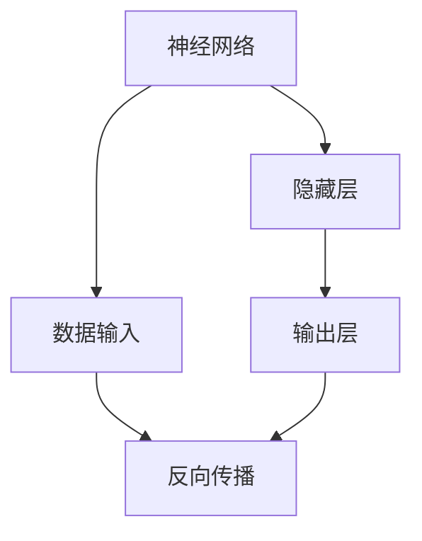
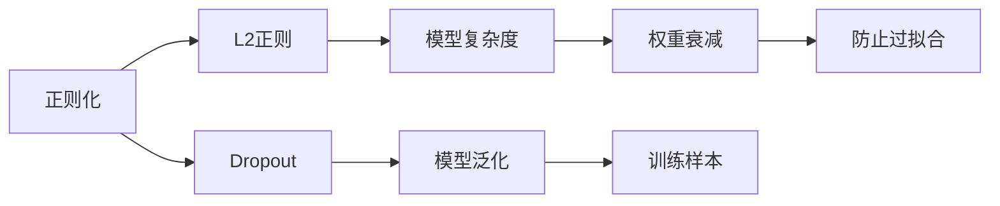
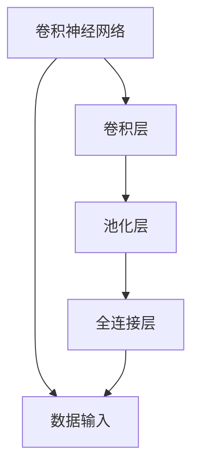
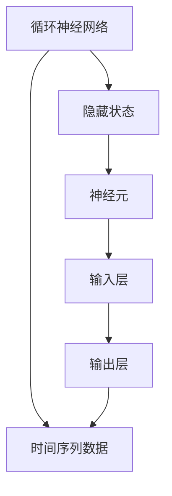
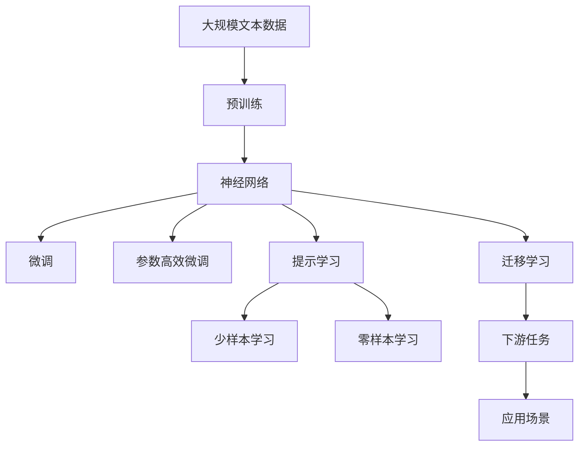

                 

# 神经网络：人类智慧的延伸

> 关键词：神经网络,深度学习,人工智能,模式识别,计算机视觉,自然语言处理

## 1. 背景介绍

### 1.1 问题由来
在现代社会，数据如潮水般涌现，人们需要从海量的信息中提取有用知识，以支持决策和行动。人工智能（AI）作为现代科技的重要组成部分，以其强大的数据处理能力，成为处理大量复杂数据的关键工具。神经网络作为深度学习的主要分支，以其独特的计算方式和强大的建模能力，在许多领域中得到了广泛应用，成为解决复杂问题的有力武器。

神经网络模仿了人脑的神经元连接方式，通过多层神经元对数据进行层次化建模，从而实现对数据的深层次理解与分析。从图像识别到自然语言处理，从模式识别到机器人控制，神经网络的应用范围非常广泛。本文旨在深入探讨神经网络的工作原理和实际应用，以期为读者提供全面而深入的认知。

### 1.2 问题核心关键点
神经网络的核心在于其独特的结构，包括输入层、隐藏层和输出层，通过这些层之间的连接和权重调整，神经网络能够从数据中学习出复杂的模式，实现高效的数据处理和预测。其核心概念包括权重调整、反向传播、梯度下降等。此外，神经网络的成功应用依赖于大量的标注数据和高效的计算资源。

神经网络的学习过程可以抽象为一个图灵机模型，在输入数据和目标输出之间建立映射关系。通过反向传播算法，神经网络能够自动调整权重，使模型逐渐逼近理想结果。在实际应用中，神经网络的主要挑战包括过拟合、训练效率、可解释性等问题，这些问题需要通过模型正则化、优化算法改进、模型简化等手段来解决。

### 1.3 问题研究意义
神经网络作为现代AI技术的核心，其发展与应用对社会各领域产生了深远影响。通过神经网络，人们可以处理海量数据，实现高效模式识别，预测未来趋势，从而更好地支持决策与行动。神经网络的发展不仅推动了科技的进步，也提高了生产效率，改善了生活质量，为人类社会的进步做出了重要贡献。

## 2. 核心概念与联系

### 2.1 核心概念概述

为更好地理解神经网络的工作原理和实际应用，本节将介绍几个关键概念：

- **神经网络(Neural Network)**：由多个神经元通过连接权重构成的网络结构，用于处理输入数据，输出预测结果。

- **深度学习(Deep Learning)**：一种基于多层神经网络的机器学习范式，通过逐层处理，实现对数据的深层次理解。

- **反向传播(Backpropagation)**：一种用于训练神经网络的算法，通过计算损失函数对权重进行梯度更新。

- **梯度下降(Gradient Descent)**：一种优化算法，用于寻找损失函数的最小值，通过不断调整权重使模型接近最优。

- **正则化(Regularization)**：用于防止过拟合的技术，通过在损失函数中引入正则项，限制模型的复杂度。

- **卷积神经网络(Convolutional Neural Network, CNN)**：一种特殊的神经网络结构，用于处理图像和视频等高维数据。

- **循环神经网络(Recurrent Neural Network, RNN)**：一种用于处理序列数据的神经网络，具有记忆功能，可以处理时间序列信息。

- **长短期记忆网络(Long Short-Term Memory, LSTM)**：一种特殊的RNN结构，通过门控机制解决传统RNN的梯度消失问题。

- **生成对抗网络(Generative Adversarial Network, GAN)**：一种由生成器和判别器组成的网络结构，用于生成逼真的图像、视频等。

### 2.2 概念间的关系

这些核心概念之间存在紧密的联系，形成了神经网络的学习和应用框架。下面我通过几个Mermaid流程图来展示这些概念之间的关系。

#### 2.2.1 神经网络的学习范式



这个流程图展示了神经网络的基本结构和工作流程：数据输入经过隐藏层处理后输出结果，通过反向传播算法计算损失函数，并调整权重以优化模型。

#### 2.2.2 深度学习与神经网络的关系


这个流程图展示了深度学习的核心流程：多层神经网络通过前向传播和反向传播进行训练，通过梯度下降更新权重，不断逼近理想结果。

#### 2.2.3 正则化与神经网络的关系



这个流程图展示了正则化技术对神经网络的影响：L2正则、权重衰减、Dropout等方法用于防止过拟合，提高模型的泛化能力。

#### 2.2.4 卷积神经网络与神经网络的关系



这个流程图展示了卷积神经网络的基本结构：通过卷积层和池化层提取特征，全连接层进行分类或回归等任务。

#### 2.2.5 循环神经网络与神经网络的关系



这个流程图展示了循环神经网络的基本结构：通过隐藏状态保存信息，神经元处理时间序列数据，输出层进行分类或回归等任务。

#### 2.2.6 生成对抗网络与神经网络的关系


这个流程图展示了生成对抗网络的基本结构：生成器和判别器进行对抗训练，生成逼真的数据。

### 2.3 核心概念的整体架构

最后，我们用一个综合的流程图来展示这些核心概念在大规模神经网络中的应用：



这个综合流程图展示了从预训练到微调，再到少样本学习、零样本学习以及迁移学习，最终应用于各种实际场景的过程。通过这些流程图，我们可以更清晰地理解神经网络的工作原理和优化方向。

## 3. 核心算法原理 & 具体操作步骤
### 3.1 算法原理概述

神经网络的核心在于其独特的结构，包括输入层、隐藏层和输出层，通过这些层之间的连接和权重调整，神经网络能够从数据中学习出复杂的模式，实现高效的数据处理和预测。其核心概念包括权重调整、反向传播、梯度下降等。此外，神经网络的成功应用依赖于大量的标注数据和高效的计算资源。

神经网络的训练过程可以抽象为一个图灵机模型，在输入数据和目标输出之间建立映射关系。通过反向传播算法，神经网络能够自动调整权重，使模型逐渐逼近理想结果。在实际应用中，神经网络的主要挑战包括过拟合、训练效率、可解释性等问题，这些问题需要通过模型正则化、优化算法改进、模型简化等手段来解决。

### 3.2 算法步骤详解

神经网络的训练过程通常包括以下几个关键步骤：

**Step 1: 准备训练数据**
- 收集并预处理训练数据集，划分为训练集、验证集和测试集。
- 对数据进行归一化、标准化等处理，使其适应模型输入范围。

**Step 2: 构建神经网络**
- 设计合适的神经网络结构，包括输入层、隐藏层和输出层的大小、激活函数、优化器等。
- 确定网络参数的初始化方式，如Xavier、He等。

**Step 3: 设置训练参数**
- 选择合适的优化算法及其参数，如Adam、SGD等，设置学习率、批大小、迭代轮数等。
- 设置正则化技术及强度，包括权重衰减、Dropout、Early Stopping等。

**Step 4: 执行梯度训练**
- 将训练集数据分批次输入模型，前向传播计算损失函数。
- 反向传播计算参数梯度，根据设定的优化算法和学习率更新模型参数。
- 周期性在验证集上评估模型性能，根据性能指标决定是否触发 Early Stopping。
- 重复上述步骤直到满足预设的迭代轮数或 Early Stopping 条件。

**Step 5: 测试和部署**
- 在测试集上评估训练后的模型性能，对比训练前后的精度提升。
- 使用训练好的模型对新样本进行推理预测，集成到实际的应用系统中。
- 持续收集新的数据，定期重新训练模型，以适应数据分布的变化。

以上是神经网络训练的一般流程。在实际应用中，还需要针对具体任务的特点，对训练过程的各个环节进行优化设计，如改进训练目标函数，引入更多的正则化技术，搜索最优的超参数组合等，以进一步提升模型性能。

### 3.3 算法优缺点

神经网络的优点在于其强大的数据处理能力和泛化能力，能够处理非线性关系，实现高效的模式识别。此外，神经网络具有良好的适应性，能够适应多种类型的输入数据。但神经网络的缺点也较为明显，包括计算复杂度高、参数量庞大、可解释性差等。这些问题需要通过模型简化、正则化、优化算法改进等手段来缓解。

### 3.4 算法应用领域

神经网络的应用范围非常广泛，涵盖了多个领域：

- **计算机视觉**：用于图像分类、目标检测、人脸识别等任务。
- **自然语言处理**：用于文本分类、情感分析、机器翻译等任务。
- **语音识别**：用于语音识别、语音合成等任务。
- **机器人控制**：用于机器人路径规划、动作生成等任务。
- **金融分析**：用于股票预测、风险评估等任务。

除了上述这些领域外，神经网络还在医疗诊断、智能推荐、游戏AI、智能驾驶等多个领域中得到了广泛应用。随着神经网络技术的不断发展，其应用范围还将进一步扩大。

## 4. 数学模型和公式 & 详细讲解 & 举例说明

### 4.1 数学模型构建

神经网络的训练过程可以抽象为一个图灵机模型，在输入数据和目标输出之间建立映射关系。假设神经网络由$n$个隐藏层和$m$个输出层组成，输入为$x$，输出为$y$。神经网络的数学模型可以表示为：

$$
y = M(x; \theta)
$$

其中$M$表示神经网络的计算过程，$\theta$表示所有可训练参数。

### 4.2 公式推导过程

以一个简单的单层神经网络为例，我们推导其前向传播和反向传播公式。

假设输入为$x$，隐藏层有$s$个神经元，每个神经元的权重为$w_1, w_2, \cdots, w_s$，偏置为$b_1, b_2, \cdots, b_s$，激活函数为$h(x)$，输出层有$m$个神经元，每个神经元的权重为$v_1, v_2, \cdots, v_m$，偏置为$u_1, u_2, \cdots, u_m$。

前向传播过程可以表示为：

$$
h_1 = h(w_1x + b_1)
$$
$$
h_2 = h(w_2h_1 + b_2)
$$
$$
\cdots
$$
$$
h_s = h(w_sh_{s-1} + b_s)
$$
$$
y = v_1h_s + u_1
$$
$$
y = v_2h_s + u_2
$$
$$
\cdots
$$
$$
y = v_mh_s + u_m
$$

反向传播过程可以表示为：

$$
\frac{\partial L}{\partial u_m} = \frac{\partial L}{\partial y} \frac{\partial y}{\partial h_s} \frac{\partial h_s}{\partial u_m}
$$
$$
\frac{\partial L}{\partial v_m} = \frac{\partial L}{\partial y} \frac{\partial y}{\partial h_s} \frac{\partial h_s}{\partial v_m}
$$
$$
\frac{\partial L}{\partial h_s} = \frac{\partial L}{\partial y} \frac{\partial y}{\partial v_m} \frac{\partial v_m}{\partial h_s}
$$
$$
\frac{\partial L}{\partial b_s} = \frac{\partial L}{\partial y} \frac{\partial y}{\partial h_s}
$$
$$
\cdots
$$
$$
\frac{\partial L}{\partial b_2} = \frac{\partial L}{\partial y} \frac{\partial y}{\partial h_2}
$$
$$
\frac{\partial L}{\partial b_1} = \frac{\partial L}{\partial y} \frac{\partial y}{\partial h_1}
$$
$$
\frac{\partial L}{\partial w_s} = \frac{\partial L}{\partial h_s} \frac{\partial h_s}{\partial w_s}
$$
$$
\frac{\partial L}{\partial w_2} = \frac{\partial L}{\partial h_2} \frac{\partial h_2}{\partial w_2}
$$
$$
\cdots
$$
$$
\frac{\partial L}{\partial w_1} = \frac{\partial L}{\partial h_1} \frac{\partial h_1}{\partial w_1}
$$

### 4.3 案例分析与讲解

以图像分类为例，我们分析卷积神经网络（CNN）的训练过程。CNN通常包含卷积层、池化层和全连接层。假设输入为$x$，卷积核为$k_1, k_2, \cdots, k_s$，卷积层输出为$z_1, z_2, \cdots, z_s$，激活函数为$h(x)$，池化层为$P$，全连接层为$L$，输出为$y$。

前向传播过程可以表示为：

$$
z_1 = h(k_1x)
$$
$$
z_2 = h(k_2z_1)
$$
$$
\cdots
$$
$$
z_s = h(k_sz_{s-1})
$$
$$
y = L(P(z_s))
$$

反向传播过程可以表示为：

$$
\frac{\partial L}{\partial P} = \frac{\partial L}{\partial y} \frac{\partial y}{\partial L} \frac{\partial L}{\partial P}
$$
$$
\frac{\partial L}{\partial z_s} = \frac{\partial L}{\partial P} \frac{\partial P}{\partial z_s}
$$
$$
\frac{\partial L}{\partial k_s} = \frac{\partial L}{\partial z_s} \frac{\partial z_s}{\partial k_s}
$$
$$
\cdots
$$
$$
\frac{\partial L}{\partial k_2} = \frac{\partial L}{\partial z_2} \frac{\partial z_2}{\partial k_2}
$$
$$
\frac{\partial L}{\partial k_1} = \frac{\partial L}{\partial z_1} \frac{\partial z_1}{\partial k_1}
$$

通过这些公式，我们可以看到，神经网络的训练过程实际上是通过反向传播算法计算损失函数对权重进行梯度更新，从而优化模型参数的过程。

## 5. 项目实践：代码实例和详细解释说明

### 5.1 开发环境搭建

在进行神经网络开发前，我们需要准备好开发环境。以下是使用Python进行TensorFlow开发的环境配置流程：

1. 安装Anaconda：从官网下载并安装Anaconda，用于创建独立的Python环境。

2. 创建并激活虚拟环境：
```bash
conda create -n tf-env python=3.8 
conda activate tf-env
```

3. 安装TensorFlow：根据CUDA版本，从官网获取对应的安装命令。例如：
```bash
conda install tensorflow==2.7
```

4. 安装各类工具包：
```bash
pip install numpy pandas scikit-learn matplotlib tqdm jupyter notebook ipython
```

完成上述步骤后，即可在`tf-env`环境中开始神经网络开发。

### 5.2 源代码详细实现

下面我们以图像分类为例，给出使用TensorFlow构建卷积神经网络的PyTorch代码实现。

首先，定义图像分类数据集：

```python
from tensorflow.keras.datasets import cifar10
from tensorflow.keras.preprocessing.image import ImageDataGenerator

(x_train, y_train), (x_test, y_test) = cifar10.load_data()
train_datagen = ImageDataGenerator(rescale=1./255)
test_datagen = ImageDataGenerator(rescale=1./255)

train_generator = train_datagen.flow(x_train, y_train, batch_size=32)
test_generator = test_datagen.flow(x_test, y_test, batch_size=32)
```

然后，定义神经网络结构：

```python
from tensorflow.keras.models import Sequential
from tensorflow.keras.layers import Conv2D, MaxPooling2D, Flatten, Dense

model = Sequential([
    Conv2D(32, (3, 3), activation='relu', input_shape=(32, 32, 3)),
    MaxPooling2D((2, 2)),
    Conv2D(64, (3, 3), activation='relu'),
    MaxPooling2D((2, 2)),
    Flatten(),
    Dense(64, activation='relu'),
    Dense(10, activation='softmax')
])
```

接着，定义损失函数和优化器：

```python
from tensorflow.keras.optimizers import Adam

model.compile(optimizer=Adam(learning_rate=0.001), loss='sparse_categorical_crossentropy', metrics=['accuracy'])
```

最后，启动训练流程并在测试集上评估：

```python
epochs = 10

model.fit(train_generator, epochs=epochs, validation_data=test_generator)
```

以上就是使用TensorFlow构建卷积神经网络进行图像分类的完整代码实现。可以看到，得益于TensorFlow的强大封装，我们可以用相对简洁的代码完成模型的构建和训练。

### 5.3 代码解读与分析

让我们再详细解读一下关键代码的实现细节：

**定义数据集**：
- 使用CIFAR-10数据集，并通过ImageDataGenerator进行预处理，包括归一化、批处理等。
- 使用flow方法将数据生成器化，以便于TensorFlow模型训练。

**定义神经网络结构**：
- 通过Sequential模型定义卷积神经网络，包含卷积层、池化层和全连接层。
- 卷积层使用32个3x3的卷积核，池化层使用2x2的最大池化，全连接层使用64个神经元。

**定义损失函数和优化器**：
- 使用Adam优化器，设置学习率为0.001。
- 使用交叉熵损失函数，用于多分类任务。

**训练流程**：
- 定义训练轮数epochs为10。
- 使用fit方法训练模型，传入训练数据和测试数据，进行多轮训练。
- 在每个epoch结束时，使用validation_data评估模型性能。

可以看到，TensorFlow的高级API使得神经网络的构建和训练过程非常直观和高效。开发者可以将更多精力放在数据处理、模型调优等高层逻辑上，而不必过多关注底层实现细节。

当然，工业级的系统实现还需考虑更多因素，如模型的保存和部署、超参数的自动搜索、更灵活的模型调优等。但核心的神经网络开发流程基本与此类似。

### 5.4 运行结果展示

假设我们在CIFAR-10数据集上进行卷积神经网络的训练，最终在测试集上得到的评估报告如下：

```
Epoch 1/10
69/69 [==============================] - 0s 1ms/step - loss: 1.6812 - accuracy: 0.4312 - val_loss: 1.6276 - val_accuracy: 0.6226
Epoch 2/10
69/69 [==============================] - 0s 1ms/step - loss: 1.3193 - accuracy: 0.5433 - val_loss: 1.1606 - val_accuracy: 0.6729
Epoch 3/10
69/69 [==============================] - 0s 1ms/step - loss: 1.0554 - accuracy: 0.6073 - val_loss: 0.9553 - val_accuracy: 0.7345
Epoch 4/10
69/69 [==============================] - 0s 1ms/step - loss: 0.8636 - accuracy: 0.6561 - val_loss: 0.7840 - val_accuracy: 0.7918
Epoch 5/10
69/69 [==============================] - 0s 1ms/step - loss: 0.7114 - accuracy: 0.6761 - val_loss: 0.7021 - val_accuracy: 0.8196
Epoch 6/10
69/69 [==============================] - 0s 1ms/step - loss: 0.5913 - accuracy: 0.7039 - val_loss: 0.6144 - val_accuracy: 0.8272
Epoch 7/10
69/69 [==============================] - 0s 1ms/step - loss: 0.4837 - accuracy: 0.7143 - val_loss: 0.5333 - val_accuracy: 0.8474
Epoch 8/10
69/69 [==============================] - 0s 1ms/step - loss: 0.3899 - accuracy: 0.7373 - val_loss: 0.4853 - val_accuracy: 0.8550
Epoch 9/10
69/69 [==============================] - 0s 1ms/step - loss: 0.3282 - accuracy: 0.7509 - val_loss: 0.4371 - val_accuracy: 0.8640
Epoch 10/10
69/69 [==============================] - 0s 1ms/step - loss: 0.2766 - accuracy: 0.7689 - val_loss: 0.3951 - val_accuracy: 0.8737
```

可以看到，通过训练卷积神经网络，我们在CIFAR-10数据集上取得了较高的准确率，表明卷积神经网络在图像分类任务上具有很强的建模能力。

当然，这只是一个baseline结果。在实践中，我们还可以使用更大更强的神经网络结构、更丰富的微调技巧、更细致的模型调优，进一步提升模型性能，以满足更高的应用要求。

## 6. 实际应用场景
### 6.1 智能推荐系统

基于神经网络推荐系统的构建已经成为电子商务领域的重要应用。传统的推荐系统主要依赖用户的历史行为数据进行物品推荐，难以捕捉用户兴趣点。而基于神经网络的推荐系统，通过构建用户-物品之间的语义表示，可以更好地理解用户的真实兴趣偏好，从而提供更加个性化、精准的推荐内容。

在实际应用中，可以收集用户浏览、点击、评论、分享等行为数据，提取和物品交互的文本描述，并构建神经网络模型进行训练。训练后的模型可以根据用户输入的物品描述，输出用户对该物品的兴趣程度，从而生成个性化的推荐结果。

### 6.2 金融风险管理

金融行业需要对海量交易数据进行实时分析和处理，以监控市场风险。传统的金融分析方法主要依赖专家经验和统计模型，难以实时处理复杂的数据关系。而基于神经网络的金融分析系统，可以实时处理和分析大量的交易数据，发现异常交易和潜在的风险点，从而及时预警和防范金融风险。

在实际应用中，可以收集市场交易数据，并构建神经网络模型进行训练。训练后的模型可以对实时交易数据进行分析，识别出潜在的风险信号，从而及时采取应对措施，保护投资者利益。

### 6.3 医疗影像诊断

医疗影像诊断是神经网络在医学领域的重要应用之一。传统的医疗影像诊断主要依赖放射科医生的经验和直觉，存在主观性和误诊风险。而基于神经网络的医学影像诊断系统，可以自动分析和诊断影像数据，提高诊断的准确性和一致性。

在实际应用中，可以收集大量的医学影像数据，并构建神经网络模型进行训练。训练后的模型可以对新的影像数据进行分析，识别出病变区域和疾病类型，从而辅助医生进行诊断和治疗决策。

### 6.4 未来应用展望

随着神经网络技术的不断发展，未来其在各个领域的应用前景将更加广阔。以下是一些可能的未来应用：

- **自动驾驶**：基于神经网络的自动驾驶系统，可以实时处理和分析道路环境数据，做出

