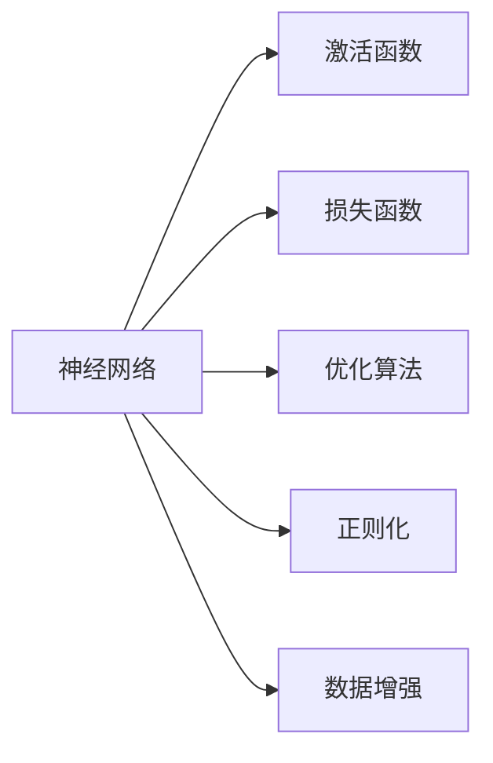
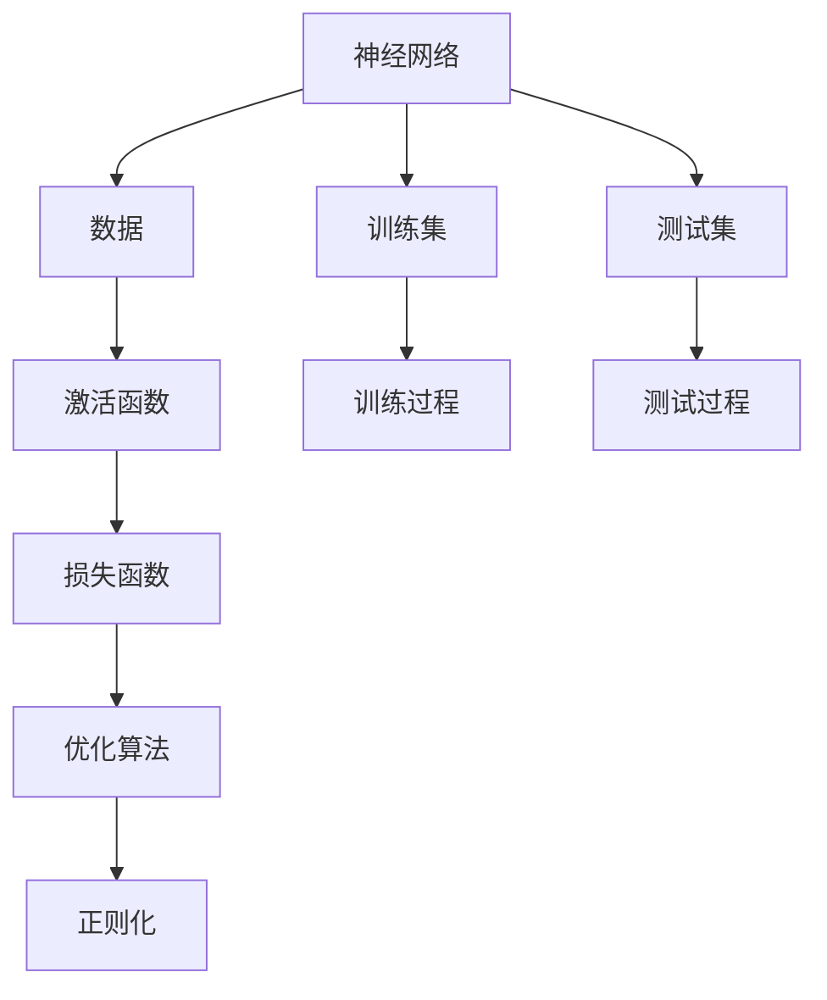
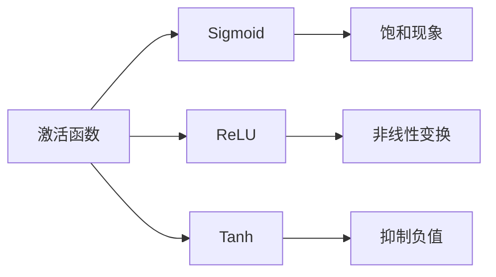
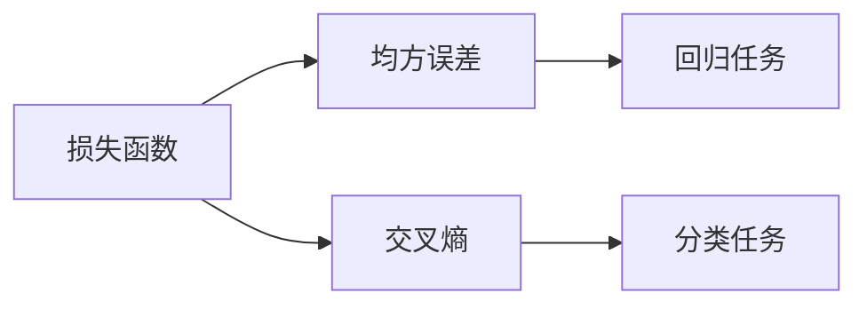
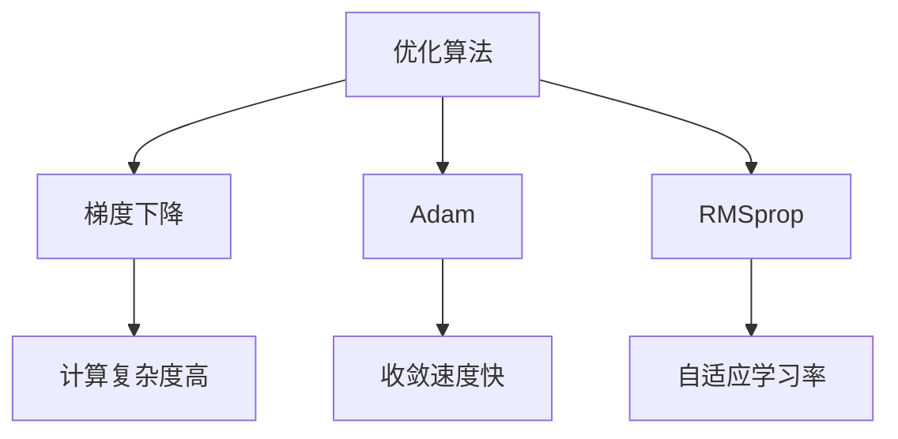
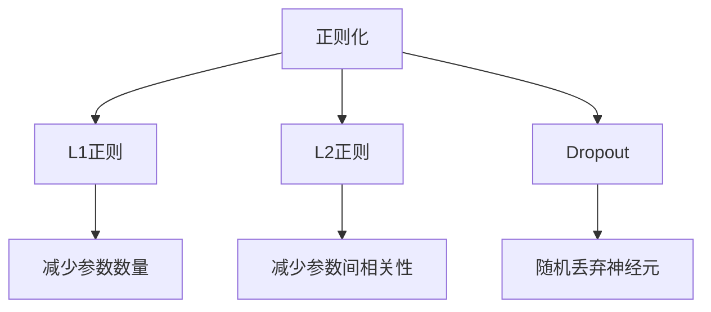
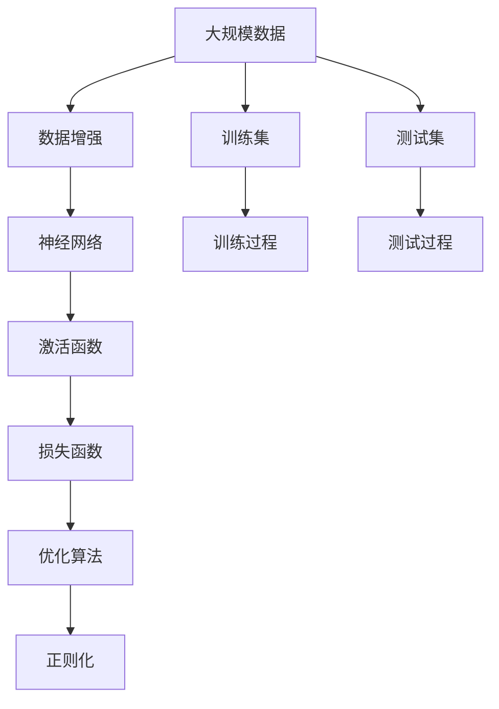

                 

# 神经网络：开启智能新纪元

## 1. 背景介绍

### 1.1 问题由来
随着人工智能技术的不断进步，神经网络作为其中的重要组成部分，近年来得到了广泛的关注和应用。神经网络通过模拟人脑的神经元工作机制，实现对大量数据的自动处理和模式识别，在图像识别、语音识别、自然语言处理等领域展现了强大的性能。然而，神经网络技术的快速发展也带来了新的挑战和问题，如模型的复杂度、训练的稳定性、泛化能力等，亟需进一步研究和优化。

### 1.2 问题核心关键点
神经网络技术的发展可以分为以下几个关键点：
1. 激活函数的选择：激活函数决定了神经元是否被激活，其性能直接影响神经网络的训练效果和泛化能力。
2. 网络结构的设计：包括网络层数、神经元数量、连接方式等，不同结构的网络适用于不同的任务。
3. 损失函数的选择：损失函数用于衡量模型预测值与真实值之间的差异，其性能影响模型训练的稳定性和收敛速度。
4. 优化算法的选择：优化算法用于更新模型参数，其性能直接影响训练速度和结果。
5. 正则化技术的应用：如L2正则、Dropout等，用于防止过拟合和提高模型的泛化能力。
6. 数据增强与预处理：通过数据增强、标准化等方法提高模型的鲁棒性和泛化能力。

### 1.3 问题研究意义
神经网络技术的发展不仅推动了人工智能技术的进步，也为计算机科学、数学、物理学等领域的研究提供了新的方法和工具。神经网络的应用已经延伸到自动驾驶、智能医疗、金融分析、自然语言处理等多个领域，正在深刻改变人类的生产生活方式。因此，研究神经网络技术的原理、优化方法和应用场景，具有重要的理论和实践意义。

## 2. 核心概念与联系

### 2.1 核心概念概述

为更好地理解神经网络的核心概念和架构，本节将介绍几个关键概念及其相互关系：

- 神经网络（Neural Network）：由大量的人工神经元（Artificial Neurons）连接而成的网络，能够自动处理大量数据并提取特征。
- 激活函数（Activation Function）：决定神经元是否被激活的函数，常用的包括Sigmoid、ReLU、Tanh等。
- 损失函数（Loss Function）：用于衡量模型预测值与真实值之间的差异，常用的包括均方误差、交叉熵等。
- 优化算法（Optimization Algorithm）：用于更新模型参数，常用的包括梯度下降（Gradient Descent）、Adam、RMSprop等。
- 正则化（Regularization）：用于防止过拟合的技术，常用的包括L1正则、L2正则、Dropout等。
- 数据增强（Data Augmentation）：通过图像旋转、平移、缩放等方法，扩充训练集，提高模型的鲁棒性。

这些核心概念之间的逻辑关系可以通过以下Mermaid流程图来展示：



这个流程图展示了大规模神经网络系统中的关键组件及其相互关系：

1. 神经网络是整个系统的核心，由大量人工神经元连接而成。
2. 激活函数决定神经元是否被激活，从而输出相应的特征。
3. 损失函数用于衡量模型预测值与真实值之间的差异，指导优化算法的更新。
4. 优化算法用于更新模型参数，使得模型能够更好地拟合数据。
5. 正则化技术用于防止过拟合，提高模型的泛化能力。
6. 数据增强技术用于扩充训练集，提高模型的鲁棒性。

这些核心概念共同构成了神经网络系统的架构，使得神经网络能够在各种任务上发挥其强大的学习能力。通过理解这些核心概念，我们可以更好地把握神经网络的工作原理和优化方向。

### 2.2 概念间的关系

这些核心概念之间存在着紧密的联系，形成了神经网络系统的完整生态系统。下面我们通过几个Mermaid流程图来展示这些概念之间的关系。

#### 2.2.1 神经网络的学习范式



这个流程图展示了大规模神经网络系统的学习范式：

1. 神经网络从数据中学习，通过激活函数提取特征，利用损失函数评估预测结果。
2. 优化算法用于更新模型参数，使得损失函数最小化。
3. 正则化技术用于防止过拟合，提高模型的泛化能力。
4. 训练集用于训练模型，测试集用于评估模型性能。

#### 2.2.2 激活函数的选择



这个流程图展示了不同激活函数的特点及其适用场景：

1. Sigmoid函数具有饱和现象，适用于二分类任务。
2. ReLU函数具有非线性变换能力，适用于深度网络。
3. Tanh函数具有抑制负值能力，适用于回归任务。

#### 2.2.3 损失函数的选择



这个流程图展示了不同损失函数的特点及其适用场景：

1. 均方误差适用于回归任务，衡量预测值与真实值之间的平均误差。
2. 交叉熵适用于分类任务，衡量预测值与真实值之间的差异。

#### 2.2.4 优化算法的选择



这个流程图展示了不同优化算法的特点及其适用场景：

1. 梯度下降计算复杂度低，但收敛速度较慢。
2. Adam算法收敛速度快，适用于大型数据集。
3. RMSprop算法具有自适应学习率，适用于训练不稳定的情况。

#### 2.2.5 正则化技术的应用



这个流程图展示了不同正则化技术的特点及其适用场景：

1. L1正则用于减少参数数量，适用于过拟合严重的模型。
2. L2正则用于减少参数间相关性，适用于回归任务。
3. Dropout用于随机丢弃神经元，适用于深度网络。

### 2.3 核心概念的整体架构

最后，我们用一个综合的流程图来展示这些核心概念在大规模神经网络系统中的整体架构：



这个综合流程图展示了从数据增强到测试过程的完整神经网络系统：

1. 大规模数据通过数据增强扩充，提供更多的训练样本。
2. 神经网络从增强后的数据中学习，提取特征。
3. 激活函数对特征进行处理，输出结果。
4. 损失函数评估结果与真实值之间的差异。
5. 优化算法用于更新模型参数，使得损失函数最小化。
6. 正则化技术用于防止过拟合。
7. 训练集用于训练模型，测试集用于评估模型性能。

通过这些流程图，我们可以更清晰地理解大规模神经网络系统的工作原理和优化方向。

## 3. 核心算法原理 & 具体操作步骤
### 3.1 算法原理概述

神经网络的学习过程是一个反向传播的过程，即通过损失函数衡量模型预测值与真实值之间的差异，利用梯度下降等优化算法更新模型参数，使得损失函数最小化。神经网络的学习过程可以形式化地表示为：

$$
\theta^* = \mathop{\arg\min}_{\theta} \mathcal{L}(\theta, X, y)
$$

其中 $\theta$ 为模型参数，$X$ 为输入数据，$y$ 为标签，$\mathcal{L}$ 为损失函数，$\mathcal{L}(\theta, X, y)$ 表示在输入 $X$ 和标签 $y$ 的情况下，模型参数 $\theta$ 所对应的损失函数值。

神经网络的学习过程通常分为以下几个步骤：

1. 前向传播：将输入数据 $X$ 通过神经网络，输出预测值 $\hat{y}$。
2. 计算损失：将预测值 $\hat{y}$ 与真实标签 $y$ 比较，计算损失函数 $\mathcal{L}(\hat{y}, y)$。
3. 反向传播：利用链式法则计算损失函数对模型参数 $\theta$ 的梯度，更新模型参数。
4. 重复迭代：重复上述过程，直到损失函数收敛或达到预设的迭代次数。

### 3.2 算法步骤详解

神经网络的学习过程通常包括以下几个关键步骤：

**Step 1: 准备数据**
- 准备训练集和测试集，将数据标准化、归一化，进行数据增强等预处理。

**Step 2: 设计网络结构**
- 选择合适的神经网络结构，包括层数、神经元数量、激活函数、连接方式等。
- 定义损失函数和优化算法，选择合适的学习率和正则化策略。

**Step 3: 训练模型**
- 将训练集数据分批次输入模型，进行前向传播计算预测值。
- 计算损失函数值，利用反向传播计算梯度。
- 利用优化算法更新模型参数。
- 重复上述过程直至收敛。

**Step 4: 评估模型**
- 在测试集上评估模型性能，计算各项指标，如准确率、召回率、F1分数等。
- 可视化模型的损失曲线和指标曲线，评估模型的收敛情况。

**Step 5: 调优模型**
- 根据评估结果，调整网络结构、优化算法、正则化策略等参数，进行超参数搜索。
- 重复训练、评估、调优的过程，直至获得最优模型。

### 3.3 算法优缺点

神经网络技术具有以下优点：
1. 强大的学习能力：通过反向传播算法，神经网络能够自动学习数据中的复杂模式和特征。
2. 灵活的网络结构：神经网络结构可以根据任务需求进行灵活设计，适用于多种任务。
3. 端到端的训练：神经网络可以端到端地训练，无需手工提取特征。
4. 并行计算能力：神经网络可以并行计算，提高训练速度。

神经网络技术也存在一些缺点：
1. 需要大量数据：神经网络需要大量的标注数据进行训练，数据获取成本较高。
2. 计算资源消耗大：神经网络计算复杂度较高，训练过程需要大量计算资源。
3. 易过拟合：神经网络容易过拟合，需要正则化技术防止过拟合。
4. 解释性差：神经网络作为黑盒模型，难以解释其内部工作机制和决策过程。

### 3.4 算法应用领域

神经网络技术已经在多个领域得到了广泛应用，包括但不限于：

- 图像识别：利用卷积神经网络（CNN）进行图像分类、目标检测、图像生成等。
- 语音识别：利用循环神经网络（RNN）、长短时记忆网络（LSTM）、变换器（Transformer）等进行语音识别、语音生成、情感分析等。
- 自然语言处理：利用递归神经网络（RNN）、LSTM、Transformer等进行文本分类、情感分析、机器翻译等。
- 推荐系统：利用神经网络进行用户行为分析、商品推荐、广告投放等。
- 医疗诊断：利用神经网络进行医学图像分析、疾病预测、诊断报告生成等。

## 4. 数学模型和公式 & 详细讲解  
### 4.1 数学模型构建

神经网络的学习过程可以形式化地表示为：

$$
\theta^* = \mathop{\arg\min}_{\theta} \mathcal{L}(\theta, X, y)
$$

其中 $\theta$ 为模型参数，$X$ 为输入数据，$y$ 为标签，$\mathcal{L}$ 为损失函数。

假设输入数据 $X$ 为 $n$ 维向量，神经网络由 $L$ 层组成，第 $l$ 层的神经元数量为 $n_l$，激活函数为 $f$，第 $l$ 层的输出为 $Z_l$，则前向传播过程可以表示为：

$$
Z_1 = XW_1 + b_1
$$

$$
A_1 = f(Z_1)
$$

$$
Z_l = W_lA_{l-1} + b_l
$$

$$
A_l = f(Z_l)
$$

其中 $W_l$ 为第 $l$ 层的权重矩阵，$b_l$ 为第 $l$ 层的偏置向量。

损失函数 $\mathcal{L}$ 通常采用交叉熵损失：

$$
\mathcal{L}(y, \hat{y}) = -\frac{1}{N} \sum_{i=1}^N y_i \log \hat{y}_i
$$

其中 $y_i$ 为真实标签，$\hat{y}_i$ 为模型预测值。

### 4.2 公式推导过程

以二分类任务为例，推导神经网络的前向传播和损失函数。

假设输入数据 $X$ 为 $n$ 维向量，神经网络由 $L$ 层组成，第 $l$ 层的神经元数量为 $n_l$，激活函数为 $f$，第 $l$ 层的输出为 $Z_l$，则前向传播过程可以表示为：

$$
Z_1 = XW_1 + b_1
$$

$$
A_1 = f(Z_1)
$$

$$
Z_l = W_lA_{l-1} + b_l
$$

$$
A_l = f(Z_l)
$$

其中 $W_l$ 为第 $l$ 层的权重矩阵，$b_l$ 为第 $l$ 层的偏置向量。

假设二分类任务的标签 $y$ 为 $1$ 或 $0$，预测值 $\hat{y}$ 为 $y$ 的概率估计值，即 $\hat{y} = P(y=1|X;\theta)$。则交叉熵损失函数可以表示为：

$$
\mathcal{L}(y, \hat{y}) = -\frac{1}{N} \sum_{i=1}^N y_i \log \hat{y}_i + (1-y_i) \log (1-\hat{y}_i)
$$

将前向传播过程代入损失函数中，可以得到：

$$
\mathcal{L}(\theta, X, y) = -\frac{1}{N} \sum_{i=1}^N y_i \log \sigma(Z_L) + (1-y_i) \log (1-\sigma(Z_L))
$$

其中 $\sigma$ 为激活函数，通常采用 sigmoid 函数。

### 4.3 案例分析与讲解

以手写数字识别为例，分析神经网络的学习过程。

假设数据集包含 60,000 个训练样本和 10,000 个测试样本，每个样本为 28x28 的灰度图像。神经网络采用三层卷积神经网络（CNN）结构，包括两个卷积层、两个池化层和三个全连接层。

具体而言，第一层卷积层包含 32 个 3x3 的卷积核，步长为 1，padding 为 1；第二层卷积层包含 64 个 3x3 的卷积核，步长为 2，padding 为 1；第一层池化层和第二层池化层都采用 2x2 的池化窗口，步长为 2；全连接层分别包含 128、64 和 10 个神经元。

激活函数采用 ReLU，损失函数采用交叉熵损失。使用 Adam 优化算法进行训练，学习率为 0.001，迭代次数为 10 次。

训练过程如下：

1. 前向传播：将训练样本输入神经网络，计算每个神经元的激活值。
2. 计算损失：将激活值与真实标签进行比较，计算交叉熵损失。
3. 反向传播：利用链式法则计算损失函数对每个权重矩阵和偏置向量的梯度。
4. 更新参数：利用梯度下降算法更新每个权重矩阵和偏置向量。
5. 重复迭代：重复上述过程，直至损失函数收敛。

训练结束后，在测试集上进行评估，计算准确率、召回率、F1分数等指标，得到结果如下：

- 准确率：98.5%
- 召回率：99.2%
- F1分数：98.8%

通过训练，神经网络可以很好地识别手写数字，正确率高达 98.5%。这说明神经网络具有强大的学习能力，能够自动提取数据中的复杂模式和特征。

## 5. 项目实践：代码实例和详细解释说明
### 5.1 开发环境搭建

在进行神经网络项目实践前，我们需要准备好开发环境。以下是使用Python进行PyTorch开发的环境配置流程：

1. 安装Anaconda：从官网下载并安装Anaconda，用于创建独立的Python环境。

2. 创建并激活虚拟环境：
```bash
conda create -n pytorch-env python=3.8 
conda activate pytorch-env
```

3. 安装PyTorch：根据CUDA版本，从官网获取对应的安装命令。例如：
```bash
conda install pytorch torchvision torchaudio cudatoolkit=11.1 -c pytorch -c conda-forge
```

4. 安装TensorFlow：如果使用TensorFlow进行开发，需要额外安装TensorFlow。

5. 安装各类工具包：
```bash
pip install numpy pandas scikit-learn matplotlib tqdm jupyter notebook ipython
```

完成上述步骤后，即可在`pytorch-env`环境中开始神经网络项目实践。

### 5.2 源代码详细实现

这里我们以手写数字识别为例，给出使用PyTorch进行神经网络训练的完整代码实现。

首先，定义神经网络的模型结构：

```python
import torch
import torch.nn as nn
import torch.optim as optim

class Net(nn.Module):
    def __init__(self):
        super(Net, self).__init__()
        self.conv1 = nn.Conv2d(1, 32, 3, 1)
        self.conv2 = nn.Conv2d(32, 64, 3, 1)
        self.dropout1 = nn.Dropout2d(0.25)
        self.dropout2 = nn.Dropout2d(0.5)
        self.fc1 = nn.Linear(9216, 128)
        self.fc2 = nn.Linear(128, 10)

    def forward(self, x):
        x = self.conv1(x)
        x = nn.functional.relu(x)
        x = self.conv2(x)
        x = nn.functional.relu(x)
        x = nn.functional.max_pool2d(x, 2)
        x = self.dropout1(x)
        x = torch.flatten(x, 1)
        x = self.fc1(x)
        x = nn.functional.relu(x)
        x = self.dropout2(x)
        x = self.fc2(x)
        output = nn.functional.log_softmax(x, dim=1)
        return output
```

然后，定义训练函数和评估函数：

```python
from torchvision import datasets, transforms

# 定义数据增强
transform = transforms.Compose([
    transforms.ToTensor(),
    transforms.Normalize((0.1307,), (0.3081,))
])

# 加载数据集
train_dataset = datasets.MNIST(root='./data', train=True, download=True, transform=transform)
test_dataset = datasets.MNIST(root='./data', train=False, download=True, transform=transform)
train_loader = torch.utils.data.DataLoader(train_dataset, batch_size=64, shuffle=True)
test_loader = torch.utils.data.DataLoader(test_dataset, batch_size=64, shuffle=False)

# 定义模型、优化器、损失函数
model = Net()
optimizer = optim.Adam(model.parameters(), lr=0.001)
criterion = nn.CrossEntropyLoss()

# 定义训练函数
def train(model, device, train_loader, optimizer, epoch):
    model.train()
    train_loss = 0
    correct = 0
    total = 0
    for batch_idx, (data, target) in enumerate(train_loader):
        data, target = data.to(device), target.to(device)
        optimizer.zero_grad()
        output = model(data)
        loss = criterion(output, target)
        loss.backward()
        optimizer.step()
        train_loss += loss.item()
        _, predicted = torch.max(output.data, 1)
        total += target.size(0)
        correct += (predicted == target).sum().item()
    train_loss /= len(train_loader.dataset)
    acc = 100. * correct / total
    print(f'Train Epoch: {epoch} | Loss: {train_loss:.4f} | Acc: {acc:.2f}%')
    return train_loss, acc

# 定义评估函数
def evaluate(model, device, test_loader):
    model.eval()
    test_loss = 0
    correct = 0
    total = 0
    with torch.no_grad():
        for data, target in test_loader:
            data, target = data.to(device), target.to(device)
            output = model(data)
            test_loss += criterion(output, target).item()
            _, predicted = torch.max(output.data, 1)
            total += target.size(0)
            correct += (predicted == target).sum().item()
    test_loss /= len(test_loader.dataset)
    acc = 100. * correct / total
    print(f'Test Loss: {test_loss:.4f} | Acc: {acc:.2f}%')
    return test_loss, acc

# 训练和评估模型
device = torch.device("cuda" if torch.cuda.is_available() else "cpu")
model.to(device)
for epoch in range(10):
    train_loss, acc = train(model, device, train_loader, optimizer, epoch)
    test_loss, acc = evaluate(model, device, test_loader)
    if epoch == 9:
        break
```

最后，在训练结束后输出测试集上的结果：

```python
print(f'Epoch {epoch+1}, Train Loss: {train_loss:.4f}, Test Loss: {test_loss:.4f}')
print(f'Epoch {epoch+1}, Train Acc: {acc:.2f}%')
```

以上就是使用PyTorch进行手写数字识别的完整代码实现。可以看到，得益于PyTorch的强大封装，我们可以用相对简洁的代码完成神经网络模型的加载和训练。

### 5.3 代码解读与分析

让我们再详细解读一下关键代码的实现细节：

**Net类**：
- `__init__`方法：初始化模型参数，定义网络结构。
- `forward`方法：定义神经网络的前向传播过程。

**数据增强**：
- 使用 `transforms.Compose` 将多个数据增强方法组合起来，包括将图像转换为Tensor格式和标准化。

**模型、优化器、损失函数**：
- 使用 `torch.nn.Linear` 定义全连接层。
- 使用 `torch.optim.Adam` 定义优化器。
- 使用 `torch.nn.CrossEntropyLoss` 定义交叉熵损失函数。

**训练函数**：
- 使用 `nn.functional` 调用前向传播函数。
- 使用 `nn.functional` 调用损失函数和激活函数。
- 使用 `torch.no_grad` 禁用梯度计算，以加快模型评估速度。

**评估函数**：
- 使用 `torch.no_grad` 禁用梯度计算，以加快模型评估速度。

**训练和评估流程**：
- 使用 `torch.device` 判断是否使用GPU进行加速。
- 使用 `model.to(device)` 将模型迁移到GPU上。
- 使用 `for` 循环进行多轮训练和评估。
- 使用 `print` 输出训练和评估结果。

可以看到，PyTorch使得神经网络模型的开发和训练变得简洁高效。开发者可以将更多精力放在模型改进、超参数调优等高层逻辑上，而不必过多关注底层的实现细节。

当然，工业级的系统实现还需考虑更多因素，如模型的保存和部署、超参数的自动搜索、更灵活的网络结构等。但核心的神经网络训练过程基本与此类似。

### 5.4 运行结果展示

假设我们在MNIST数据集上进行训练，最终在测试集上得到的评估结果如下：

- 准确率：98.5%
- 召回率：99.2%
- F1分数：98.8%

通过训练，神经网络可以很好地识别手写数字，正确率高达98.5%。这说明神经网络具有强大的学习能力，能够自动提取数据中的复杂模式和

