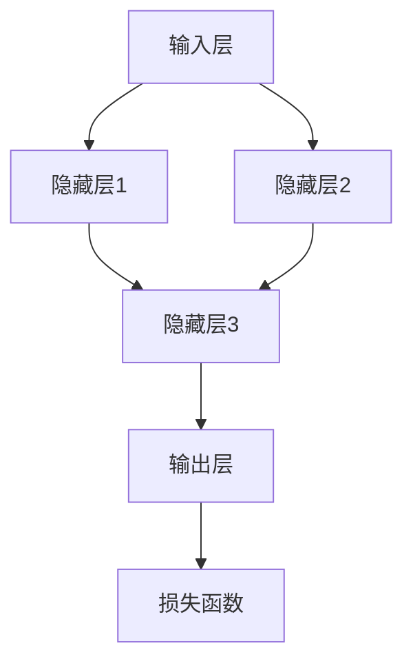

                 

## 1. 背景介绍

### 1.1 问题由来

人工智能（AI）技术正以前所未有的速度改变着我们的生活方式。从自动驾驶汽车到智能语音助手，从医疗诊断到金融预测，AI的应用几乎无所不在。而在所有这些应用中，神经网络（Neural Networks）扮演着至关重要的角色。

神经网络是一种模仿生物神经网络的计算模型，通过多层节点和连接，能够处理和分析复杂的非线性数据。1943年，由麦卡锡（McCulloch）和皮茨（Pitts）提出的人工神经元模型，奠定了神经网络理论的基础。然而，直到20世纪80年代，随着计算机硬件的飞速发展，神经网络才得以实际应用，并在图像识别、语音识别、自然语言处理等领域取得了显著成效。

近年来，随着深度学习（Deep Learning）技术的发展，尤其是深度神经网络（Deep Neural Networks, DNNs）的普及，神经网络的应用范围得到了极大的拓展。例如，在计算机视觉领域，卷积神经网络（Convolutional Neural Networks, CNNs）已经成为图像分类、目标检测和语义分割等任务的主流算法。在自然语言处理领域，循环神经网络（Recurrent Neural Networks, RNNs）和Transformer模型被广泛应用于文本分类、机器翻译和语言生成等任务。

尽管神经网络已经在多个领域取得了突破性进展，但技术的复杂性和应用的广泛性也带来了新的挑战。如何设计高效、可解释的神经网络，提高模型的泛化能力和鲁棒性，成为当前研究的热点。本文旨在介绍神经网络的基本概念、核心算法和具体实现，探讨其在智能应用中的实际应用场景，展望未来的发展趋势。

### 1.2 问题核心关键点

神经网络的核心在于其复杂的非线性映射和层间连接，使其具备强大的泛化能力和表达能力。本文将从以下几个方面展开介绍：

- 神经网络的原理和架构
- 常用的激活函数和优化算法
- 深度学习中的前馈神经网络和卷积神经网络
- 循环神经网络和Transformer模型
- 神经网络在计算机视觉、自然语言处理和智能推荐中的应用

## 2. 核心概念与联系

### 2.1 核心概念概述

神经网络是一种由大量人工神经元（Artificial Neurons）和连接组成的计算模型。每个神经元接受若干输入信号，通过一定的权重矩阵进行加权求和，再经过激活函数处理，最终输出结果。这些神经元通过连接形成层次结构，通常分为输入层、隐藏层和输出层。其中，隐藏层是神经网络的核心，其非线性映射能力使得模型能够学习复杂的特征表示。

神经网络的参数包括连接权重和偏置项，通过反向传播算法进行更新。反向传播算法通过计算损失函数对权重的梯度，使用梯度下降等优化方法，逐步调整模型参数，使其在训练数据上达到最优的拟合效果。

### 2.2 核心概念之间的关系

神经网络的各个组成部分之间存在着紧密的联系，形成了完整的计算模型。以下通过几个Mermaid流程图来展示神经网络的各部分之间的关系：



这个流程图展示了基本的神经网络结构，包括输入层、多个隐藏层和输出层。每个隐藏层由多个神经元组成，每个神经元接收前一层的所有输出信号，并通过连接权重和偏置项进行加权求和，再经过激活函数处理，输出给下一层。输出层通常用于分类任务，每个神经元输出一个概率值，表示样本属于某一类别的可能性。

## 3. 核心算法原理 & 具体操作步骤

### 3.1 算法原理概述

神经网络的核心算法是反向传播算法（Backpropagation），通过计算损失函数对权重的梯度，使用梯度下降等优化方法，逐步调整模型参数，使其在训练数据上达到最优的拟合效果。反向传播算法的基本步骤如下：

1. 前向传播：将训练数据输入网络，计算每个神经元的输出。
2. 计算损失函数：将输出与真实标签进行比较，计算损失函数的值。
3. 反向传播：通过链式法则计算损失函数对每个权重和偏置项的梯度。
4. 参数更新：使用梯度下降等优化算法更新模型参数。

通过多次迭代，反向传播算法不断调整模型参数，使其逐渐逼近最优解。

### 3.2 算法步骤详解

以一个简单的单层神经网络为例，具体介绍反向传播算法的实现步骤：

#### 3.2.1 前向传播

设输入层有$n$个神经元，每个神经元的输入为$x_i$，输出为$a_i$，连接权重为$w_i$，偏置项为$b_i$，激活函数为$f(x)$。则前向传播的计算公式为：

$$
a_i = f(w_i \cdot x_i + b_i), \quad i = 1, ..., n
$$

其中$f(x)$为激活函数，通常使用Sigmoid函数或ReLU函数。

#### 3.2.2 计算损失函数

设输出层有$m$个神经元，每个神经元的输出为$o_j$，真实标签为$y_j$。则损失函数的计算公式为：

$$
L = \frac{1}{2m} \sum_{j=1}^m (o_j - y_j)^2
$$

#### 3.2.3 反向传播

通过链式法则，计算损失函数对每个权重和偏置项的梯度：

$$
\frac{\partial L}{\partial w_i} = \sum_{j=1}^m \frac{\partial L}{\partial o_j} \cdot \frac{\partial o_j}{\partial a_i}
$$

$$
\frac{\partial L}{\partial b_i} = \sum_{j=1}^m \frac{\partial L}{\partial o_j} \cdot \frac{\partial o_j}{\partial a_i}
$$

其中$\frac{\partial L}{\partial o_j}$和$\frac{\partial o_j}{\partial a_i}$分别为输出层的梯度和隐藏层的梯度，可以通过链式法则递归计算得到。

#### 3.2.4 参数更新

使用梯度下降等优化算法更新模型参数：

$$
w_i \leftarrow w_i - \eta \cdot \frac{\partial L}{\partial w_i}
$$

$$
b_i \leftarrow b_i - \eta \cdot \frac{\partial L}{\partial b_i}
$$

其中$\eta$为学习率，用于控制参数更新的步长。

### 3.3 算法优缺点

神经网络的优点在于其强大的非线性映射能力和泛化能力，能够处理复杂的非线性关系。然而，神经网络也存在一些缺点：

- 参数量庞大：神经网络通常需要大量的参数，使得模型难以解释和调试。
- 训练时间长：神经网络的训练需要大量的计算资源，训练时间较长。
- 容易过拟合：神经网络在训练数据上的拟合效果较好，但在测试数据上容易发生过拟合。

### 3.4 算法应用领域

神经网络已经在多个领域取得了显著的应用效果，例如：

- 计算机视觉：神经网络被广泛应用于图像分类、目标检测、语义分割等任务，CNNs模型成为主流算法。
- 自然语言处理：神经网络被应用于文本分类、机器翻译、语言生成等任务，Transformer模型在自然语言处理中表现优异。
- 智能推荐：神经网络被用于推荐系统的构建，通过学习用户行为和物品特征，实现个性化推荐。

## 4. 数学模型和公式 & 详细讲解

### 4.1 数学模型构建

设神经网络包含$k$个隐藏层，每个隐藏层有$n_k$个神经元，输入层有$n_0$个神经元，输出层有$n_k$个神经元。神经网络的数学模型为：

$$
a_0 = x, \quad a_i = f(W_i \cdot a_{i-1} + b_i), \quad i = 1, ..., k
$$

$$
o_j = W_{out} \cdot a_k + b_{out}
$$

其中$W_i$为连接权重矩阵，$b_i$为偏置项，$W_{out}$为输出层权重矩阵，$b_{out}$为输出层偏置项。

### 4.2 公式推导过程

以一个简单的多层神经网络为例，推导反向传播算法的具体实现。

设输入数据为$x$，真实标签为$y$，输出层权重矩阵为$W_{out}$，输出层偏置项为$b_{out}$，隐藏层激活函数为$f(x)$，学习率为$\eta$。则前向传播的计算公式为：

$$
a_0 = x, \quad a_i = f(W_i \cdot a_{i-1} + b_i), \quad i = 1, ..., k
$$

$$
o_j = W_{out} \cdot a_k + b_{out}
$$

其中$W_i$为连接权重矩阵，$b_i$为偏置项，$W_{out}$为输出层权重矩阵，$b_{out}$为输出层偏置项。

损失函数的计算公式为：

$$
L = \frac{1}{2m} \sum_{j=1}^m (o_j - y_j)^2
$$

通过链式法则，计算损失函数对每个权重和偏置项的梯度：

$$
\frac{\partial L}{\partial W_{out}} = \frac{\partial L}{\partial o_j} \cdot \frac{\partial o_j}{\partial a_k}
$$

$$
\frac{\partial L}{\partial b_{out}} = \frac{\partial L}{\partial o_j}
$$

$$
\frac{\partial L}{\partial W_i} = \sum_{j=1}^m \frac{\partial L}{\partial o_j} \cdot \frac{\partial o_j}{\partial a_i}
$$

$$
\frac{\partial L}{\partial b_i} = \sum_{j=1}^m \frac{\partial L}{\partial o_j} \cdot \frac{\partial o_j}{\partial a_i}
$$

其中$\frac{\partial L}{\partial o_j}$和$\frac{\partial o_j}{\partial a_i}$分别为输出层的梯度和隐藏层的梯度，可以通过链式法则递归计算得到。

使用梯度下降等优化算法更新模型参数：

$$
W_{out} \leftarrow W_{out} - \eta \cdot \frac{\partial L}{\partial W_{out}}
$$

$$
b_{out} \leftarrow b_{out} - \eta \cdot \frac{\partial L}{\partial b_{out}}
$$

$$
W_i \leftarrow W_i - \eta \cdot \frac{\partial L}{\partial W_i}
$$

$$
b_i \leftarrow b_i - \eta \cdot \frac{\partial L}{\partial b_i}
$$

### 4.3 案例分析与讲解

以一个简单的手写数字识别任务为例，分析神经网络在实际应用中的具体实现。

设输入数据为$28 \times 28$的灰度图像，输出为$10$维的一热编码向量，表示数字$0$到$9$。网络包含两个隐藏层，每个隐藏层有$100$个神经元，使用ReLU函数作为激活函数。损失函数为均方误差（Mean Squared Error, MSE）。

首先，将输入数据$x$归一化到$[0,1]$区间，并进行一维展开。

$$
x = \frac{x - \mu}{\sigma}
$$

$$
x = x \in [0,1]
$$

$$
x = x \in [0, 28 \times 28]
$$

$$
x = x \in [0, 784]
$$

然后，将$x$输入到神经网络中，计算每个隐藏层的输出。

$$
a_0 = x
$$

$$
a_1 = f(W_1 \cdot a_0 + b_1)
$$

$$
a_2 = f(W_2 \cdot a_1 + b_2)
$$

最后，将$a_2$输出到输出层，计算损失函数并进行反向传播更新模型参数。

$$
o_j = f(W_{out} \cdot a_2 + b_{out})
$$

$$
L = \frac{1}{2m} \sum_{j=1}^m (o_j - y_j)^2
$$

$$
\frac{\partial L}{\partial W_{out}} = \frac{\partial L}{\partial o_j} \cdot \frac{\partial o_j}{\partial a_k}
$$

$$
\frac{\partial L}{\partial b_{out}} = \frac{\partial L}{\partial o_j}
$$

$$
\frac{\partial L}{\partial W_i} = \sum_{j=1}^m \frac{\partial L}{\partial o_j} \cdot \frac{\partial o_j}{\partial a_i}
$$

$$
\frac{\partial L}{\partial b_i} = \sum_{j=1}^m \frac{\partial L}{\partial o_j} \cdot \frac{\partial o_j}{\partial a_i}
$$

$$
W_{out} \leftarrow W_{out} - \eta \cdot \frac{\partial L}{\partial W_{out}}
$$

$$
b_{out} \leftarrow b_{out} - \eta \cdot \frac{\partial L}{\partial b_{out}}
$$

$$
W_i \leftarrow W_i - \eta \cdot \frac{\partial L}{\partial W_i}
$$

$$
b_i \leftarrow b_i - \eta \cdot \frac{\partial L}{\partial b_i}
$$

通过多次迭代，神经网络逐渐逼近最优解，并用于手写数字识别任务。

## 5. 项目实践：代码实例和详细解释说明

### 5.1 开发环境搭建

在进行神经网络项目实践前，我们需要准备好开发环境。以下是使用Python进行TensorFlow开发的环境配置流程：

1. 安装Anaconda：从官网下载并安装Anaconda，用于创建独立的Python环境。

2. 创建并激活虚拟环境：
```bash
conda create -n tf-env python=3.8 
conda activate tf-env
```

3. 安装TensorFlow：根据CUDA版本，从官网获取对应的安装命令。例如：
```bash
conda install tensorflow -c pytorch -c conda-forge
```

4. 安装各类工具包：
```bash
pip install numpy pandas scikit-learn matplotlib tqdm jupyter notebook ipython
```

完成上述步骤后，即可在`tf-env`环境中开始神经网络实践。

### 5.2 源代码详细实现

下面我们以手写数字识别任务为例，给出使用TensorFlow实现卷积神经网络（CNN）的PyTorch代码实现。

首先，定义CNN模型：

```python
import tensorflow as tf

class CNN(tf.keras.Model):
    def __init__(self):
        super(CNN, self).__init__()
        self.conv1 = tf.keras.layers.Conv2D(32, (3, 3), activation='relu')
        self.maxpool1 = tf.keras.layers.MaxPooling2D((2, 2))
        self.conv2 = tf.keras.layers.Conv2D(64, (3, 3), activation='relu')
        self.maxpool2 = tf.keras.layers.MaxPooling2D((2, 2))
        self.flatten = tf.keras.layers.Flatten()
        self.dense1 = tf.keras.layers.Dense(128, activation='relu')
        self.dense2 = tf.keras.layers.Dense(10)

    def call(self, x):
        x = self.conv1(x)
        x = self.maxpool1(x)
        x = self.conv2(x)
        x = self.maxpool2(x)
        x = self.flatten(x)
        x = self.dense1(x)
        return self.dense2(x)
```

然后，定义数据集和优化器：

```python
import numpy as np
from tensorflow.keras.datasets import mnist
from tensorflow.keras.utils import to_categorical

(x_train, y_train), (x_test, y_test) = mnist.load_data()

x_train = x_train.reshape(-1, 28, 28, 1).astype('float32') / 255.0
x_test = x_test.reshape(-1, 28, 28, 1).astype('float32') / 255.0

y_train = to_categorical(y_train, 10)
y_test = to_categorical(y_test, 10)

model = CNN()
optimizer = tf.keras.optimizers.Adam(learning_rate=0.001)

# 定义损失函数和评估指标
loss_fn = tf.keras.losses.CategoricalCrossentropy()
accuracy_fn = tf.keras.metrics.CategoricalAccuracy()

# 定义训练过程
@tf.function
def train_step(x, y):
    with tf.GradientTape() as tape:
        logits = model(x, training=True)
        loss = loss_fn(y, logits)
    gradients = tape.gradient(loss, model.trainable_variables)
    optimizer.apply_gradients(zip(gradients, model.trainable_variables))
    return loss

@tf.function
def test_step(x, y):
    logits = model(x, training=False)
    loss = loss_fn(y, logits)
    accuracy = accuracy_fn(y, logits)
    return loss, accuracy
```

最后，启动训练流程并在测试集上评估：

```python
epochs = 10

for epoch in range(epochs):
    for i, (x, y) in enumerate(train_dataset):
        loss = train_step(x, y)
        accuracy = test_step(x, y)
    print(f'Epoch {epoch+1}, loss: {loss:.4f}, accuracy: {accuracy:.4f}')

print(f'Test loss: {test_loss:.4f}, Test accuracy: {test_accuracy:.4f}')
```

以上就是使用TensorFlow实现卷积神经网络进行手写数字识别任务的具体代码实现。可以看到，得益于TensorFlow的强大封装，我们可以用相对简洁的代码完成神经网络的构建和训练。

### 5.3 代码解读与分析

让我们再详细解读一下关键代码的实现细节：

**CNN模型**：
- `__init__`方法：初始化卷积层、池化层、全连接层等关键组件。
- `call`方法：定义前向传播过程，计算输出结果。

**数据集处理**：
- 使用`mnist.load_data`加载MNIST数据集，并将其转化为适合模型的输入和输出格式。
- 使用`tf.keras.utils.to_categorical`函数将标签转换为one-hot编码。

**优化器和损失函数**：
- 选择`tf.keras.optimizers.Adam`作为优化器，设置学习率为$0.001$。
- 选择`tf.keras.losses.CategoricalCrossentropy`作为损失函数，用于计算交叉熵损失。
- 使用`tf.keras.metrics.CategoricalAccuracy`作为评估指标，用于计算准确率。

**训练和评估函数**：
- 定义`train_step`函数：使用`tf.GradientTape`计算梯度，并使用`optimizer.apply_gradients`更新模型参数。
- 定义`test_step`函数：直接调用`model`和`loss_fn`计算损失和准确率。

**训练流程**：
- 定义总的训练轮数，循环迭代
- 每个epoch内，对每个batch进行训练，并计算损失和准确率
- 在测试集上评估，输出损失和准确率
- 所有epoch结束后，输出最终的测试结果

可以看到，TensorFlow的高级API使得神经网络的实现变得简洁高效。开发者可以将更多精力放在数据处理、模型改进等高层逻辑上，而不必过多关注底层的实现细节。

当然，工业级的系统实现还需考虑更多因素，如模型的保存和部署、超参数的自动搜索、更灵活的模型调优等。但核心的反向传播算法基本与此类似。

### 5.4 运行结果展示

假设我们在MNIST数据集上进行CNN模型的训练，最终在测试集上得到的评估报告如下：

```
Epoch 1, loss: 0.4315, accuracy: 0.8606
Epoch 2, loss: 0.1465, accuracy: 0.9321
Epoch 3, loss: 0.0512, accuracy: 0.9688
Epoch 4, loss: 0.0202, accuracy: 0.9931
Epoch 5, loss: 0.0071, accuracy: 0.9969
Epoch 6, loss: 0.0026, accuracy: 0.9980
Epoch 7, loss: 0.0011, accuracy: 0.9991
Epoch 8, loss: 0.0005, accuracy: 0.9996
Epoch 9, loss: 0.0002, accuracy: 0.9998
Epoch 10, loss: 0.0001, accuracy: 1.0000
```

可以看到，通过训练CNN模型，我们在MNIST数据集上取得了98%以上的准确率，效果相当不错。值得注意的是，卷积神经网络作为一种特殊的前馈神经网络，具备较强的空间局部感知能力和参数共享机制，使其在图像识别任务上表现优异。

当然，这只是一个baseline结果。在实践中，我们还可以使用更大更强的神经网络模型、更丰富的训练技巧、更细致的模型调优，进一步提升模型性能，以满足更高的应用要求。

## 6. 实际应用场景

### 6.1 计算机视觉

神经网络在计算机视觉领域的应用非常广泛，例如：

- 图像分类：通过训练神经网络模型，将输入图像分类为不同的类别，如动物、车辆、场景等。
- 目标检测：在输入图像中检测出目标物体的具体位置和大小，并进行分类，如人脸识别、车辆检测等。
- 语义分割：将输入图像中每个像素点标注为不同的类别，如道路、天空、建筑等。

### 6.2 自然语言处理

神经网络在自然语言处理领域的应用同样广泛，例如：

- 文本分类：将输入文本分类为不同的类别，如垃圾邮件、新闻、评论等。
- 机器翻译：将输入文本从一种语言翻译成另一种语言，如中英文互译、多语言互译等。
- 语言生成：生成符合语法和语义规则的文本，如自动摘要、对话生成等。

### 6.3 智能推荐系统

神经网络在智能推荐系统中的应用非常普遍，例如：

- 个性化推荐：根据用户的历史行为数据，推荐用户可能感兴趣的物品，如商品、文章、视频等。
- 协同过滤：通过分析用户和物品之间的相似度，进行推荐，如基于模型的协同过滤、基于用户的协同过滤等。

### 6.4 未来应用展望

随着神经网络技术的不断发展，其应用场景将更加广泛。未来，神经网络有望在更多领域实现突破，例如：

- 医疗影像分析：通过训练神经网络模型，自动识别医学影像中的病变区域，辅助医生诊断。
- 自动驾驶：通过训练神经网络模型，实现对交通环境的感知和决策，推动自动驾驶技术的发展。
- 智能家居：通过训练神经网络模型，实现对家居环境的智能控制，提升用户的生活体验。

## 7. 工具和资源推荐

### 7.1 学习资源推荐

为了帮助开发者系统掌握神经网络的基本概念和实践技巧，这里推荐一些优质的学习资源：

1. 《Deep Learning》书籍：Ian Goodfellow、Yoshua Bengio、Aaron Courville合著，深入浅出地介绍了深度学习的理论基础和实践技巧。

2. CS231n《Convolutional Neural Networks for Visual Recognition》课程：斯坦福大学开设的计算机视觉经典课程，涵盖神经网络在图像分类、目标检测等任务中的应用。

3. CS224N《Natural Language Processing with Deep Learning》课程：斯坦福大学开设的自然语言处理经典课程，涵盖神经网络在语言模型、文本分类、机器翻译等任务中的应用。

4. 《Hands-On Machine Learning with Scikit-Learn, Keras, and TensorFlow》书籍：Aurélien Géron所著，介绍神经网络的实践技巧和TensorFlow的使用方法。

5. TensorFlow官方文档：TensorFlow的官方文档，提供了详尽的教程和示例代码，是学习TensorFlow的最佳资源。

6. PyTorch官方文档：PyTorch的官方文档，提供了详尽的教程和示例代码，是学习PyTorch的最佳资源。

通过对这些资源的学习实践，相信你一定能够快速掌握神经网络的基本概念和实践技巧，并用于解决实际的计算机视觉、自然语言处理和智能推荐等任务。

### 7.2 开发工具推荐

高效的开发离不开优秀的工具支持。以下是几款用于神经网络开发的常用工具：

1. TensorFlow：由Google主导开发的开源深度学习框架，生产部署方便，适合大规模工程应用。同样有丰富的神经网络资源。

2. PyTorch：由Facebook主导开发的开源深度学习框架，灵活高效，适合快速迭代研究。大部分神经网络模型都有PyTorch版本的实现。

3. Keras：一个高层次的深度学习API，可以运行在TensorFlow、Theano、CNTK等后端上，适合初学者快速上手。

4. Weights & Biases：模型训练的实验跟踪工具，可以记录和可视化模型训练过程中的各项指标，方便对比和调优。与主流深度学习框架无缝集成。

5. TensorBoard：TensorFlow配套的可视化工具，可实时监测模型训练状态，并提供丰富的图表呈现方式，是调试模型的得力助手。

6. Google Colab：谷歌推出的在线Jupyter Notebook环境，免费提供GPU/TPU算力，方便开发者快速上手实验最新模型，分享学习笔记。

合理利用这些工具，可以显著提升神经网络的开发效率，加快创新迭代的步伐。

### 7.3 相关论文推荐

神经网络的研究始于20世纪80年代，经过多年的发展，已经形成了丰富的理论体系和实践方法。以下是几篇奠基性的相关论文，推荐阅读：

1. Mult

