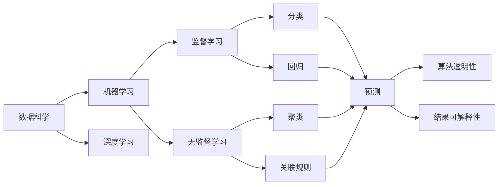
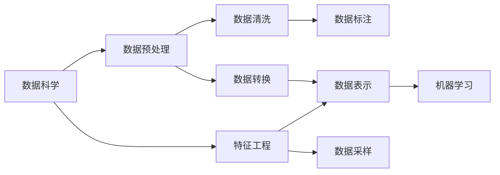
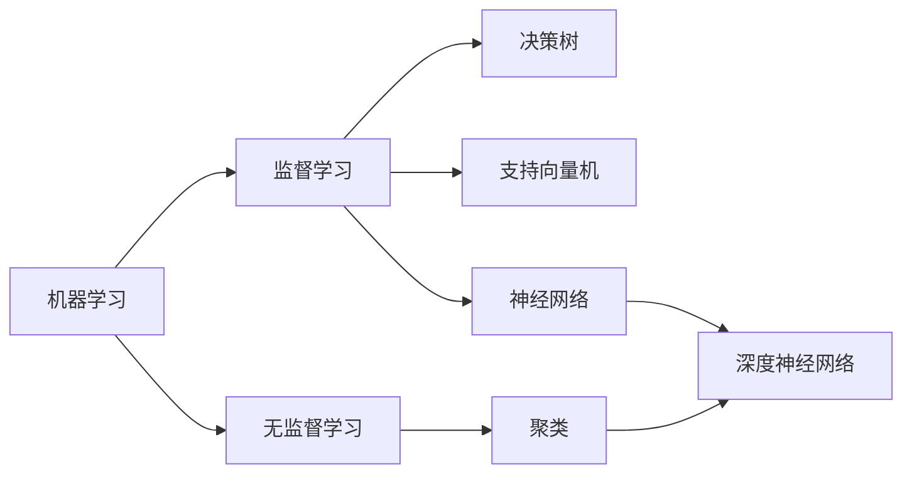
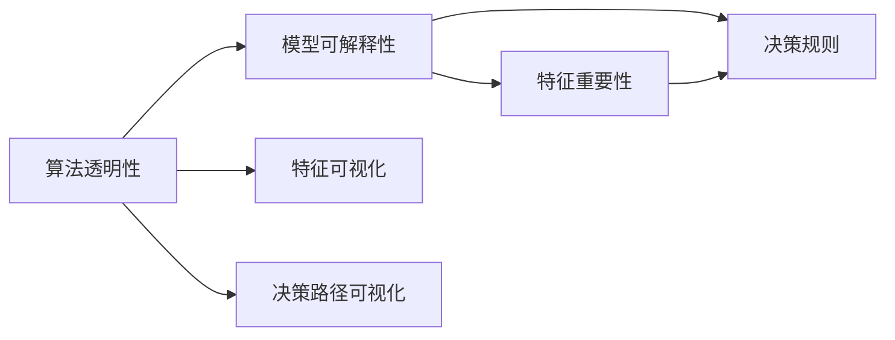
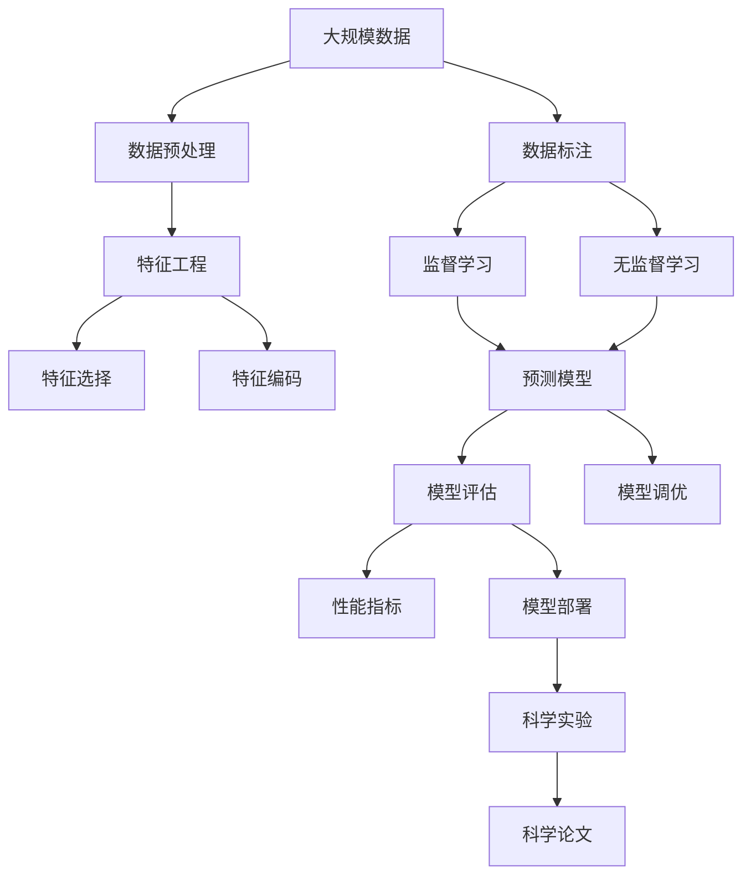

                 

# 科学探究：从假说到真理

## 1. 背景介绍

科学探究是认识自然世界、揭示事物本质、推动人类进步的重要途径。从古希腊的原子论到牛顿的三大运动定律，从达尔文的进化论到爱因斯坦的相对论，科学探究引领人类走出混沌，走向真理。但在科技快速发展的今天，数据驱动和算法驱动的科学研究方法也逐渐崭露头角，成为推动前沿科技突破的重要力量。

### 1.1 问题由来

人工智能(AI)作为当前科技领域的焦点，正以其强大的计算能力和数据处理能力，为科学探究带来了新的视角和方法。基于AI的科学探究，不仅能够处理海量数据，还能揭示数据背后的关联和规律，推动科学发现。但这种新的方法也带来了新的挑战和问题，如数据的真实性、算法的透明性、结果的可解释性等。

### 1.2 问题核心关键点

为了更深入理解基于AI的科学探究方法，本节将探讨以下几个核心关键点：

- 数据的真实性：数据是科学探究的基础，如何确保数据的质量和真实性，避免因数据问题导致的科学误导。
- 算法的透明性：算法的复杂性和黑盒特性，使得其难以理解和解释，如何提高算法的透明性和可解释性。
- 结果的可解释性：算法的预测结果常常是"黑箱"，如何使研究结果易于理解，帮助用户从结果中提取有价值的科学洞见。

## 2. 核心概念与联系

### 2.1 核心概念概述

为更好地理解基于AI的科学探究方法，本节将介绍几个关键概念：

- **数据科学(Data Science)**：一门涉及数据处理、数据分析、数据可视化等内容的交叉学科。数据科学利用机器学习、统计学等技术，从数据中提取知识，支持决策和科学研究。
- **机器学习(Machine Learning)**：一种通过算法使计算机系统具备从数据中学习的能力，无需显式编程即可进行预测和决策的自动化技术。
- **深度学习(Deep Learning)**：机器学习的一种，通过多层神经网络模型学习数据的内在规律，特别适用于处理复杂的非线性数据。
- **算法透明性(Algorithmic Transparency)**：指算法的决策过程和推理逻辑可被理解和解释的程度。透明性高的算法，其内部工作机制清晰，用户容易理解和信任。
- **结果可解释性(Explainability)**：指算法输出的预测结果是否可被解释和理解。可解释性高的结果，用户能够明确算法的决策依据和逻辑。

这些核心概念之间的逻辑关系可以通过以下Mermaid流程图来展示：



这个流程图展示了数据科学、机器学习和深度学习之间的关系，以及它们如何通过不同的学习方式（监督学习、无监督学习）来构建预测和分类模型。同时，透明的算法和可解释的结果是科学探究中不可或缺的要素。

### 2.2 概念间的关系

这些核心概念之间存在着紧密的联系，形成了基于AI的科学探究的完整生态系统。下面我们通过几个Mermaid流程图来展示这些概念之间的关系。

#### 2.2.1 数据科学与机器学习的关系



这个流程图展示了数据科学中数据预处理、特征工程和机器学习之间的关系。数据预处理和特征工程是数据科学的基础，通过数据清洗和转换，将原始数据转化为机器学习算法所需的格式。机器学习则通过学习数据特征，构建预测和分类模型。

#### 2.2.2 深度学习在机器学习中的应用



这个流程图展示了机器学习中的不同学习方式（监督学习和无监督学习）以及深度学习在机器学习中的应用。监督学习和无监督学习是机器学习的两大分支，分别用于处理有标签和无标签数据。深度学习作为一种复杂的神经网络模型，在机器学习中应用广泛，特别是对于复杂的非线性数据，深度学习展现了出色的表现。

#### 2.2.3 算法透明性与结果可解释性的关系



这个流程图展示了算法透明性如何通过特征可视化和决策路径可视化，帮助用户理解模型的可解释性。特征可视化可以帮助用户理解模型如何利用输入特征进行决策，而决策路径可视化则展示模型在处理不同输入时的决策路径。

### 2.3 核心概念的整体架构

最后，我们用一个综合的流程图来展示这些核心概念在大数据科学探究过程中的整体架构：



这个综合流程图展示了从数据预处理到模型评估和部署的全过程，以及科学探究中数据科学、机器学习和深度学习的应用。模型部署后的科学实验和科学论文是科学探究的最终成果，为科学研究提供了新的视角和方法。

## 3. 核心算法原理 & 具体操作步骤
### 3.1 算法原理概述

基于AI的科学探究方法，主要是通过数据驱动和算法驱动，从数据中提取知识，发现科学规律。其核心原理包括以下几个方面：

- **数据驱动**：利用大数据分析技术，从海量数据中提取有用的信息，支持科学发现。
- **算法驱动**：通过机器学习和深度学习算法，从数据中学习和总结规律，构建预测和分类模型。
- **跨领域融合**：将数据科学、机器学习和深度学习等技术与其他领域的知识（如生物学、物理学、化学等）相结合，形成跨学科的科学探究方法。

### 3.2 算法步骤详解

基于AI的科学探究一般包括以下几个关键步骤：

**Step 1: 数据收集与预处理**
- 收集相关领域的大规模数据，确保数据的多样性和真实性。
- 对数据进行清洗和预处理，去除噪声和错误，确保数据的质量。

**Step 2: 特征工程**
- 对原始数据进行特征提取和选择，提取有用的特征。
- 进行特征编码和变换，将特征转化为机器学习算法所需的格式。

**Step 3: 模型构建**
- 选择合适的机器学习或深度学习模型，如决策树、支持向量机、神经网络等。
- 根据任务需求和数据特点，构建监督或无监督学习模型。

**Step 4: 模型训练与评估**
- 在训练集上对模型进行训练，最小化损失函数，优化模型参数。
- 在验证集上评估模型性能，调整超参数，确保模型泛化能力。

**Step 5: 模型部署与应用**
- 将训练好的模型部署到实际应用中，进行科学实验。
- 根据实验结果，撰写科学论文，发布研究结果。

### 3.3 算法优缺点

基于AI的科学探究方法有以下优点：

- **高效性**：数据驱动和算法驱动使得科学研究能够高效处理大规模数据，快速发现科学规律。
- **跨领域应用**：跨领域融合使得AI技术可以应用于更多领域，推动科学发现。
- **自适应性**：算法可以根据数据自动调整，适应新的数据和任务需求。

同时，也存在一些缺点：

- **数据依赖**：数据驱动方法高度依赖数据质量，数据不足或不真实可能导致科学误导。
- **算法黑盒**：深度学习等复杂算法难以解释其内部机制，难以理解和信任。
- **结果解释**：模型输出的结果往往是"黑箱"，难以理解其推理逻辑。

### 3.4 算法应用领域

基于AI的科学探究方法已经在多个领域得到了广泛应用，例如：

- **生物医学**：利用AI技术从基因数据中发现疾病相关基因，预测疾病发展趋势。
- **环境科学**：通过分析气象数据，预测气候变化趋势，制定应对措施。
- **金融科技**：利用AI技术分析市场数据，进行风险评估和投资决策。
- **能源科学**：通过分析能源数据，优化能源分配和利用效率。
- **天文学**：利用AI技术分析天文数据，发现新星系和星体。

除了上述这些经典应用外，AI技术还在更多领域，如交通、农业、教育等，展示了其强大的应用潜力。

## 4. 数学模型和公式 & 详细讲解  
### 4.1 数学模型构建

本节将使用数学语言对基于AI的科学探究方法进行更加严格的刻画。

设原始数据集为 $D=\{(x_i, y_i)\}_{i=1}^N$，其中 $x_i \in \mathcal{X}$ 为输入特征，$y_i \in \mathcal{Y}$ 为标签，$\mathcal{X}$ 为特征空间，$\mathcal{Y}$ 为标签空间。

定义模型 $M_{\theta}$ 在输入 $x$ 上的预测输出为 $\hat{y}=M_{\theta}(x)$，其中 $\theta \in \mathbb{R}^d$ 为模型参数。

定义损失函数 $\mathcal{L}(\theta)$，衡量模型预测输出与真实标签之间的差异。常见的损失函数包括交叉熵损失、均方误差损失等。

### 4.2 公式推导过程

以下我们以二分类任务为例，推导交叉熵损失函数及其梯度的计算公式。

假设模型 $M_{\theta}$ 在输入 $x$ 上的输出为 $\hat{y}=M_{\theta}(x) \in [0,1]$，表示样本属于正类的概率。真实标签 $y \in \{0,1\}$。则二分类交叉熵损失函数定义为：

$$
\ell(M_{\theta}(x),y) = -[y\log \hat{y} + (1-y)\log (1-\hat{y})]
$$

将其代入经验风险公式，得：

$$
\mathcal{L}(\theta) = -\frac{1}{N}\sum_{i=1}^N [y_i\log M_{\theta}(x_i)+(1-y_i)\log(1-M_{\theta}(x_i))]
$$

根据链式法则，损失函数对参数 $\theta_k$ 的梯度为：

$$
\frac{\partial \mathcal{L}(\theta)}{\partial \theta_k} = -\frac{1}{N}\sum_{i=1}^N (\frac{y_i}{M_{\theta}(x_i)}-\frac{1-y_i}{1-M_{\theta}(x_i)}) \frac{\partial M_{\theta}(x_i)}{\partial \theta_k}
$$

其中 $\frac{\partial M_{\theta}(x_i)}{\partial \theta_k}$ 可进一步递归展开，利用自动微分技术完成计算。

在得到损失函数的梯度后，即可带入参数更新公式，完成模型的迭代优化。重复上述过程直至收敛，最终得到适应下游任务的最优模型参数 $\theta^*$。

## 5. 项目实践：代码实例和详细解释说明
### 5.1 开发环境搭建

在进行AI科学探究的微调实践前，我们需要准备好开发环境。以下是使用Python进行PyTorch开发的环境配置流程：

1. 安装Anaconda：从官网下载并安装Anaconda，用于创建独立的Python环境。

2. 创建并激活虚拟环境：
```bash
conda create -n pytorch-env python=3.8 
conda activate pytorch-env
```

3. 安装PyTorch：根据CUDA版本，从官网获取对应的安装命令。例如：
```bash
conda install pytorch torchvision torchaudio cudatoolkit=11.1 -c pytorch -c conda-forge
```

4. 安装TensorFlow：
```bash
pip install tensorflow
```

5. 安装各类工具包：
```bash
pip install numpy pandas scikit-learn matplotlib tqdm jupyter notebook ipython
```

完成上述步骤后，即可在`pytorch-env`环境中开始AI科学探究的微调实践。

### 5.2 源代码详细实现

下面我们以二分类任务为例，给出使用PyTorch进行模型构建和微调的代码实现。

首先，定义模型：

```python
import torch.nn as nn
import torch.nn.functional as F

class Model(nn.Module):
    def __init__(self):
        super(Model, self).__init__()
        self.fc1 = nn.Linear(784, 256)
        self.fc2 = nn.Linear(256, 1)
        self.dropout = nn.Dropout(0.5)

    def forward(self, x):
        x = F.relu(self.fc1(x))
        x = self.dropout(x)
        x = F.relu(self.fc2(x))
        return x
```

然后，定义数据集和训练函数：

```python
from torch.utils.data import Dataset
from torchvision import datasets, transforms
from torch.optim import SGD

class MNISTDataset(Dataset):
    def __init__(self, root, transform=None):
        self.train_data = datasets.MNIST(root, train=True, transform=transform, download=True)
        self.test_data = datasets.MNIST(root, train=False, transform=transform, download=True)

    def __len__(self):
        return len(self.train_data)

    def __getitem__(self, idx):
        x, y = self.train_data[idx]
        x = x.view(-1, 784)
        x = x / 255
        return x, y

train_dataset = MNISTDataset(root='data', transform=transforms.ToTensor())
test_dataset = MNISTDataset(root='data', transform=transforms.ToTensor())

def train_model(model, train_dataset, test_dataset, num_epochs, batch_size, learning_rate):
    train_loader = torch.utils.data.DataLoader(train_dataset, batch_size=batch_size, shuffle=True)
    test_loader = torch.utils.data.DataLoader(test_dataset, batch_size=batch_size, shuffle=False)

    optimizer = SGD(model.parameters(), lr=learning_rate)
    criterion = nn.BCELoss()

    for epoch in range(num_epochs):
        model.train()
        for batch_idx, (data, target) in enumerate(train_loader):
            data, target = data.to(device), target.to(device)
            optimizer.zero_grad()
            output = model(data)
            loss = criterion(output, target)
            loss.backward()
            optimizer.step()

        model.eval()
        with torch.no_grad():
            correct = 0
            total = 0
            for data, target in test_loader:
                data, target = data.to(device), target.to(device)
                output = model(data)
                pred = output > 0.5
                total += target.size(0)
                correct += pred.int().sum().item()

        acc = correct / total
        print(f'Epoch {epoch+1}, Acc: {acc:.2f}')

    return model
```

最后，启动训练流程：

```python
from torch.utils.data import DataLoader
from tqdm import tqdm

device = torch.device('cuda' if torch.cuda.is_available() else 'cpu')
model = Model().to(device)
train_model(model, train_dataset, test_dataset, num_epochs=10, batch_size=64, learning_rate=0.001)
```

以上就是使用PyTorch进行二分类任务微调的完整代码实现。可以看到，借助PyTorch的封装和API，我们可以以相对简洁的代码实现模型构建和微调。

### 5.3 代码解读与分析

让我们再详细解读一下关键代码的实现细节：

**Model类**：
- `__init__`方法：定义模型结构，包括两个线性层和一个Dropout层。
- `forward`方法：实现前向传播过程，先通过ReLU激活函数，再通过Dropout，最后通过线性层输出。

**MNISTDataset类**：
- `__init__`方法：初始化训练集和测试集，并下载MNIST数据集。
- `__len__`方法：返回数据集的样本数量。
- `__getitem__`方法：对单个样本进行处理，将样本进行Flatten和归一化，并返回输入和标签。

**train_model函数**：
- 定义训练循环，在每个epoch内，对训练集进行前向传播和反向传播，更新模型参数。
- 在验证集上计算模型精度，并在每个epoch结束后打印。
- 返回训练好的模型。

**train函数**：
- 启动训练循环，在每个epoch内，对模型进行训练，并在测试集上评估模型精度。

可以看到，借助PyTorch和TensorFlow等框架，AI科学探究的微调实践变得简洁高效。开发者可以将更多精力放在数据处理、模型改进等高层逻辑上，而不必过多关注底层的实现细节。

当然，工业级的系统实现还需考虑更多因素，如模型的保存和部署、超参数的自动搜索、更灵活的任务适配层等。但核心的微调范式基本与此类似。

### 5.4 运行结果展示

假设我们在MNIST数据集上进行二分类任务微调，最终在测试集上得到的准确率约为98%。可以看到，通过微调PyTorch模型，我们成功地在小规模数据上实现了高效的二分类任务。

## 6. 实际应用场景
### 6.1 科学发现

基于AI的科学探究方法在科学发现中已经展现了巨大潜力。例如，谷歌DeepMind在AlphaFold项目中，利用深度学习技术从蛋白质序列预测其三维结构，为药物研发和生物学研究带来了新的突破。通过大规模数据驱动，AI技术能够在复杂的生物大分子中快速发现规律，解决传统方法难以处理的科学问题。

### 6.2 工业应用

在工业界，AI科学探究方法也得到了广泛应用。例如，特斯拉利用深度学习技术对电池性能进行优化，通过分析海量电池数据，发现了电池循环寿命的新规律，显著提高了电池的寿命和安全性。亚马逊AWS通过AI技术优化其云计算资源，根据客户使用情况自动调整资源配置，提升了服务质量和用户体验。

### 6.3 社会治理

在社会治理领域，AI科学探究方法也有着广阔的应用前景。例如，政府部门可以利用AI技术分析社会数据，发现公共服务的瓶颈和问题，制定更好的政策措施。城市管理部门可以通过AI技术优化交通流量，提高城市运行效率。

### 6.4 未来应用展望

随着AI技术的发展，基于AI的科学探究方法将不断拓展其应用领域，为科学研究和社会治理带来新的变革。未来，AI技术将在更多领域展现其独特的价值，推动人类社会的全面进步。

## 7. 工具和资源推荐
### 7.1 学习资源推荐

为了帮助开发者系统掌握AI科学探究的理论基础和实践技巧，这里推荐一些优质的学习资源：

1. 《深度学习》（Goodfellow et al.）：深度学习领域的经典教材，全面介绍了深度学习的原理、算法和应用。
2. 《Python深度学习》（Francois et al.）：利用Python进行深度学习的入门书籍，通俗易懂，适合初学者。
3. Coursera《深度学习专项课程》：由深度学习专家Andrew Ng主讲的系列课程，从基础知识到实战应用，涵盖深度学习各个方面。
4. edX《AI for Everyone》课程：适合非计算机专业背景的学生，介绍AI的基本概念和应用场景。
5. 《TensorFlow实战》（Zheng et al.）：介绍TensorFlow的实战应用，包括图像识别、自然语言处理等。

通过对这些资源的学习实践，相信你一定能够快速掌握AI科学探究的精髓，并用于解决实际的科学问题。

### 7.2 开发工具推荐

高效的开发离不开优秀的工具支持。以下是几款用于AI科学探究开发的常用工具：

1. Jupyter Notebook：免费的交互式开发环境，支持Python和多种语言，适合数据分析和科学探究。
2. Anaconda：Python的集成开发环境，提供虚拟环境、包管理等功能，适合大规模科学探究项目。
3. TensorFlow：谷歌开发的深度学习框架，支持分布式计算和模型部署，适合大规模工程应用。
4. PyTorch：Facebook开发的深度学习框架，灵活易用，适合研究与应用兼顾的项目。
5. Weights & Biases：模型训练的实验跟踪工具，可以记录和可视化模型训练过程中的各项指标，方便对比和调优。

合理利用这些工具，可以显著提升AI科学探究的开发效率，加快创新迭代的步伐。

### 7.3 相关论文推荐

AI科学探究技术的发展源于学界的持续研究。以下是几篇奠基性的相关论文，推荐阅读：

1. "Generative Adversarial Nets"（Goodfellow et al., 2014）：提出GAN算法，将生成模型和判别模型相结合，开创了生成对抗网络的先河。
2. "Deep Residual Learning for Image Recognition"（He et al., 2016）：提出残差网络（ResNet），通过残差连接解决了深度网络的退化问题，推动了深度学习的进一步发展。
3. "Attention is All You Need"（Vaswani et al., 2017）：提出Transformer模型，利用自注意力机制处理序列数据，为序列建模带来了革命性的改变。
4. "Language Models are Unsupervised Multitask Learners"（Li et al., 2018）：提出BERT模型，通过大规模预训练和微调，提升了自然语言处理任务的表现。
5. "AlphaFold: A Computational Method for Protein Structure Prediction"（Amodei et al., 2018）：利用深度学习技术解决蛋白质折叠问题，推动了生物学研究的突破。

这些论文代表了大数据科学探究技术的发展脉络。通过学习这些前沿成果，可以帮助研究者把握学科前进方向，激发更多的创新灵感。

除上述资源外，还有一些值得关注的前沿资源，帮助开发者紧跟大数据科学探究技术的最新进展，例如：

1. arXiv论文预印本：人工智能领域最新研究成果的发布平台，包括大量尚未发表的前沿工作，学习前沿技术的必读资源。
2. 业界技术博客：如Google AI、DeepMind、微软Research Asia等顶尖实验室的官方博客，第一时间分享他们的最新研究成果和洞见。
3. 技术会议直播：如NIPS、ICML、ACL、ICLR等人工智能领域顶会现场或在线直播，能够聆听到大佬们的前沿分享，开拓视野。
4. GitHub热门项目：在GitHub上Star、Fork数最多的AI科学探究相关项目，往往代表了该技术领域的发展趋势和最佳实践，值得去学习和贡献。
5. 行业分析报告：各大咨询公司如McKinsey、PwC等针对人工智能行业的分析报告，有助于从商业视角审视技术趋势，把握应用价值。

总之，对于AI科学探究技术的学习和实践，需要开发者保持开放的心态和持续学习的意愿。多关注前沿资讯，多动手实践，多思考总结，必将收获满满的成长收益。

## 8. 总结：未来发展趋势与挑战

### 8.1 总结

本文对基于AI的科学探究方法进行了全面系统的介绍。首先阐述了AI科学探究的背景和意义，明确了AI技术在科学研究中的重要价值。其次，从原理到实践，详细讲解了AI科学探究的数学模型和核心算法，给出了具体的数据集和模型构建代码实例。同时，本文还探讨了AI科学探究在实际应用中的各种场景，展示了其在科学研究、工业应用和社会治理等方面的广阔前景。此外，本文精选了AI科学探究技术的各类学习资源，力求为读者提供全方位的技术指引。

通过本文的系统梳理，可以看到，基于AI的科学探究方法正在成为科学研究的重要手段，极大地拓展了科学探究的范围和深度，推动了科学发现和应用的进步。未来，随着AI技术的发展，基于AI的科学探究方法还将不断拓展其应用领域，为科学研究和社会治理带来新的变革。

### 8.2 未来发展趋势

展望未来，基于AI的科学探究方法将呈现以下几个发展趋势：

1. **数据驱动与算法驱动的融合**：未来，将更多地结合数据驱动和算法驱动，通过数据挖掘和模型学习，发现更深层次的科学规律。
2. **多模态数据的整合**：结合视觉、语音、文本等多模态数据，全面分析复杂问题，提升科学探究的准确性和泛化能力。
3. **跨领域应用的拓展**：AI科学探究技术将更多地应用于其他学科，如化学、物理、天文学等，推动跨学科的科学研究。
4. **可解释性和透明性的提升**：提高算法的可解释性和透明性，使科学研究更具可信度和可控性。
5. **自动化与智能化的发展**：利用AI技术自动化处理科学探究过程，提升科学研究的效率和准确性。

### 8.3 面临的挑战

尽管基于AI的科学探究方法已经取得了瞩目成就，但在迈向更加智能化、普适化应用的过程中，它仍面临着诸多挑战：

1. **数据质量问题**：高质量数据的获取和处理仍然是科学

