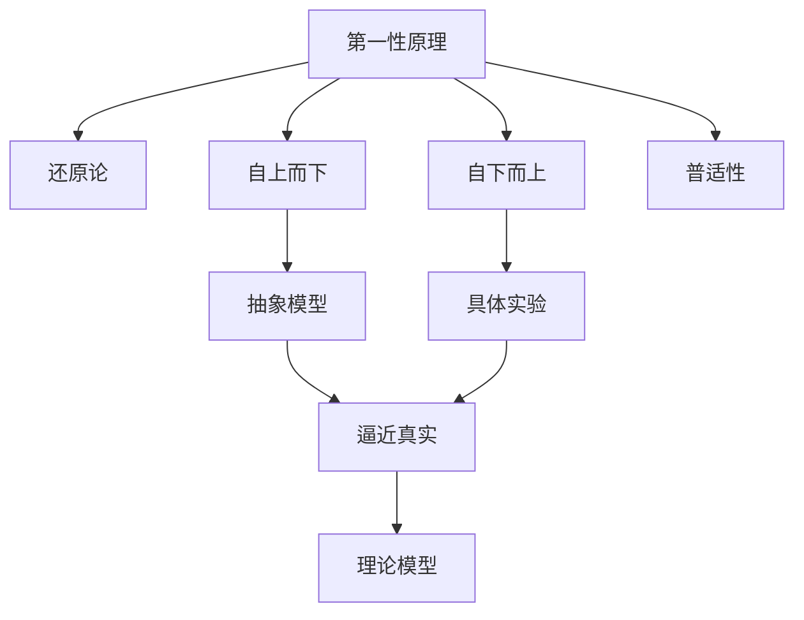
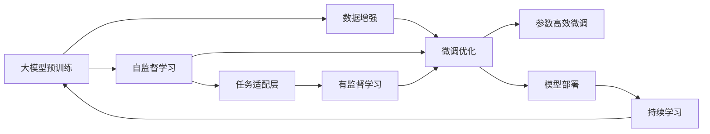

                 

## 1. 背景介绍

### 1.1 问题由来
在科技迅猛发展的今天，人工智能（AI）已经渗透到各个领域，从智能家居到自动驾驶，从医疗诊断到金融风控，AI正逐渐改变我们的生活方式。然而，在AI技术的背后，支撑其创新的底层思维是什么？是现有的经验积累，还是全新的思维范式？这一问题的探讨，引领我们走入科学思维的基础——第一性原理。

### 1.2 问题核心关键点
第一性原理（First-Principles）源于古希腊哲学家亚里士多德，原意是指最基础的、无法进一步拆分的概念或假设。在科技领域，第一性原理意味着从最根本的物理定律和数学规律出发，构建理论模型，推动技术的创新和突破。

第一性原理的应用不仅局限于理论科学，在工程实践、产品设计、软件开发等技术领域同样重要。例如，埃隆·马斯克在创办SpaceX时，正是通过理解火箭发射的基本物理原理，从零开始重新设计火箭的每一个组件，最终实现了廉价火箭的制造和发射。

本文将深入探讨第一性原理的核心理念，并结合其在AI技术中的具体应用，帮助读者构建科学思维的基础，为未来的技术创新提供指引。

### 1.3 问题研究意义
理解第一性原理对于AI技术的发展具有重要意义：
1. **创新驱动**：基于第一性原理的思考，可以打破现有技术框架的束缚，激发新的创新点和突破点。
2. **问题简化**：将复杂问题拆解至最基础层面，有助于找到问题的本质，简化解决方案的设计和实现。
3. **效率提升**：通过基于第一性原理的优化，可以提升算法和系统的效率，减少资源浪费。
4. **伦理审视**：从最基础原理出发，能够更好地审视技术应用的伦理和安全问题，确保技术进步符合社会价值观。

## 2. 核心概念与联系

### 2.1 核心概念概述

为了更好地理解第一性原理在AI技术中的应用，我们先简要介绍几个核心概念：

- **第一性原理**：基于最基本的物理定律和数学规律，从零开始构建理论模型。
- **还原论**：将复杂系统分解为简单的基本组成部分，以理解整体行为。
- **自上而下**：从宏观角度出发，通过抽象模型逐步逼近真实世界。
- **自下而上**：从微观层面出发，通过具体实验和数据构建理论模型。
- **普适性**：构建的模型和理论能够在不同的应用场景中普遍适用。

这些概念共同构成了第一性原理的核心思想，即从最基本的原理出发，构建普适性的理论模型，指导技术创新和应用实践。

### 2.2 概念间的关系

这些核心概念之间的关系可以通过以下Mermaid流程图来展示：



这个流程图展示了第一性原理与其他核心概念的关系：

1. **第一性原理**通过**还原论**将复杂系统分解为基本组成部分。
2. **自上而下**和**自下而上**方法分别从宏观和微观层面构建理论模型。
3. **普适性**确保构建的模型能够在不同应用场景中普遍适用。
4. **抽象模型**通过宏观抽象逼近真实系统，**具体实验**通过微观细节验证模型准确性。
5. **逼近真实**和**理论模型**最终形成完整的科学思维体系。

这些概念相互作用，共同构成了第一性原理的科学思维框架，指导我们在技术创新中探索新的方向和方法。

### 2.3 核心概念的整体架构

最后，我们用一个综合的流程图来展示第一性原理在AI技术中的整体架构：



这个综合流程图展示了从大模型预训练到微调优化的完整过程，并通过自监督学习和任务适配层来连接预训练和微调。持续学习确保模型能够不断更新和适应新的数据，形成完整的AI技术应用框架。

## 3. 核心算法原理 & 具体操作步骤

### 3.1 算法原理概述

基于第一性原理的AI技术创新，主要依赖于自下而上的实验和数据驱动。具体而言，通过以下步骤，从最基础的物理定律和数学规律出发，构建新的理论模型和技术方法：

1. **自监督学习**：利用大规模无标签数据，通过预训练学习到通用的语言或视觉表示。
2. **任务适配**：根据具体任务需求，设计任务适配层，调整预训练模型的输出。
3. **微调优化**：通过有监督的数据集，优化任务适配层，提升模型在特定任务上的表现。
4. **参数高效微调**：仅调整少量参数，减少计算资源消耗，提高模型效率。
5. **持续学习**：定期更新模型，避免知识退化，保持模型时效性和适应性。

这些步骤共同构成了基于第一性原理的AI技术创新路径。

### 3.2 算法步骤详解

以下是基于第一性原理的AI技术创新的详细步骤：

**Step 1: 数据收集与预处理**
- 收集大规模无标签数据，进行数据清洗和预处理。
- 对数据进行归一化、标准化等预处理操作，确保数据质量和一致性。

**Step 2: 自监督学习**
- 设计自监督学习任务，如语言建模、视觉特征提取等。
- 在大规模无标签数据上进行预训练，学习通用的语言或视觉表示。
- 通过验证集评估模型性能，确定最优模型参数。

**Step 3: 任务适配层设计**
- 根据具体任务需求，设计任务适配层。
- 选择合适的网络结构，如卷积神经网络（CNN）、循环神经网络（RNN）或Transformer等。
- 设计损失函数，如交叉熵、均方误差等。

**Step 4: 微调优化**
- 收集少量有标签数据，设计训练集、验证集和测试集。
- 在预训练模型上添加任务适配层，进行微调。
- 设置合适的学习率、批大小、迭代轮数等超参数。
- 应用正则化技术，如L2正则、Dropout等，防止过拟合。
- 定期在验证集上评估模型性能，触发Early Stopping避免过拟合。

**Step 5: 参数高效微调**
- 使用适配器微调（Adapter）等方法，仅更新少量参数。
- 冻结大部分预训练参数，减少计算资源消耗。
- 应用提示学习（Prompt-based Learning），通过精心设计的输入格式引导模型推理。

**Step 6: 持续学习**
- 定期收集新数据，更新模型参数。
- 应用增量学习（Incremental Learning），避免完全重训模型。
- 应用知识蒸馏（Knowledge Distillation），将知识从大型模型转移到小型模型。
- 应用动态架构（Dynamic Architecture），根据任务需求动态调整模型结构。

### 3.3 算法优缺点

基于第一性原理的AI技术创新具有以下优点：
1. **创新驱动**：从最基础的原理出发，能够打破现有技术框架的束缚，激发新的创新点和突破点。
2. **问题简化**：将复杂问题拆解至最基础层面，有助于找到问题的本质，简化解决方案的设计和实现。
3. **效率提升**：通过基于第一性原理的优化，可以提升算法和系统的效率，减少资源浪费。
4. **伦理审视**：从最基础原理出发，能够更好地审视技术应用的伦理和安全问题，确保技术进步符合社会价值观。

同时，这种范式也存在以下局限性：
1. **数据依赖**：需要收集和处理大量数据，数据质量和规模对模型性能有重要影响。
2. **复杂度高**：从最基础原理出发，需要深入理解基本物理定律和数学规律，设计复杂的模型和算法。
3. **计算资源需求高**：大规模无标签数据预训练和有标签数据微调都需要大量的计算资源。
4. **模型复杂度**：构建的模型可能较为复杂，难以理解和调试。

尽管存在这些局限性，但基于第一性原理的AI技术创新，仍然在多个领域取得了显著成果，推动了技术的不断进步。

### 3.4 算法应用领域

基于第一性原理的AI技术创新，已经在以下几个领域取得了重要应用：

- **自然语言处理（NLP）**：利用大规模语言数据进行预训练，通过微调优化特定任务，如情感分析、文本分类、机器翻译等。
- **计算机视觉（CV）**：通过大规模无标签图像数据进行预训练，微调优化特定视觉任务，如图像分类、目标检测、图像生成等。
- **语音处理**：利用大规模无标签音频数据进行预训练，微调优化语音识别、语音合成等任务。
- **智能推荐系统**：通过用户行为数据和物品属性数据进行预训练，微调优化推荐算法，提升个性化推荐效果。
- **金融风控**：通过历史交易数据进行预训练，微调优化信用评分、风险预测等模型。
- **医疗诊断**：通过医学影像和电子病历数据进行预训练，微调优化疾病诊断、药物推荐等任务。

## 4. 数学模型和公式 & 详细讲解  
### 4.1 数学模型构建

本节将使用数学语言对基于第一性原理的AI技术创新过程进行更加严格的刻画。

假设模型 $M_{\theta}$ 在大规模无标签数据上进行自监督学习，学习到通用的语言或视觉表示。对于特定任务 $T$，设计任务适配层，得到模型 $M_{\theta}^T$。给定有标签数据集 $D=\{(x_i,y_i)\}_{i=1}^N, x_i \in \mathcal{X}, y_i \in \mathcal{Y}$。

定义模型 $M_{\theta}^T$ 在输入 $x$ 上的输出为 $\hat{y}=M_{\theta}^T(x) \in \mathcal{Y}$，表示样本属于任务 $T$ 的预测结果。则任务 $T$ 的损失函数定义为：

$$
\ell(M_{\theta}^T(x),y) = -\mathbb{E}_{(x,y)\sim D}[y\log \hat{y} + (1-y)\log (1-\hat{y})]
$$

其中，$y\in\{0,1\}$ 为真实标签，$\log$ 为自然对数。任务 $T$ 的微调目标是最小化损失函数，即：

$$
\mathop{\arg\min}_{\theta} \mathcal{L}(\theta^T)
$$

其中 $\mathcal{L}$ 为任务 $T$ 的损失函数，通过梯度下降等优化算法最小化经验风险，更新模型参数 $\theta^T$。

### 4.2 公式推导过程

以下我们以二分类任务为例，推导交叉熵损失函数及其梯度的计算公式。

假设模型 $M_{\theta}^T$ 在输入 $x$ 上的输出为 $\hat{y}=M_{\theta}^T(x) \in [0,1]$，表示样本属于正类的概率。真实标签 $y \in \{0,1\}$。则二分类交叉熵损失函数定义为：

$$
\ell(M_{\theta}^T(x),y) = -[y\log \hat{y} + (1-y)\log (1-\hat{y})]
$$

将其代入经验风险公式，得：

$$
\mathcal{L}(\theta^T) = -\frac{1}{N}\sum_{i=1}^N [y_i\log M_{\theta}^T(x_i)+(1-y_i)\log(1-M_{\theta}^T(x_i))]
$$

根据链式法则，损失函数对参数 $\theta_k$ 的梯度为：

$$
\frac{\partial \mathcal{L}(\theta^T)}{\partial \theta_k} = -\frac{1}{N}\sum_{i=1}^N (\frac{y_i}{M_{\theta}^T(x_i)}-\frac{1-y_i}{1-M_{\theta}^T(x_i)}) \frac{\partial M_{\theta}^T(x_i)}{\partial \theta_k}
$$

其中 $\frac{\partial M_{\theta}^T(x_i)}{\partial \theta_k}$ 可进一步递归展开，利用自动微分技术完成计算。

在得到损失函数的梯度后，即可带入优化算法（如AdamW），更新模型参数 $\theta^T$，完成微调过程。重复上述过程直至收敛，最终得到适应特定任务 $T$ 的最优模型参数 $\theta^T$。

## 5. 项目实践：代码实例和详细解释说明
### 5.1 开发环境搭建

在进行基于第一性原理的AI技术创新实践前，我们需要准备好开发环境。以下是使用Python进行PyTorch开发的环境配置流程：

1. 安装Anaconda：从官网下载并安装Anaconda，用于创建独立的Python环境。

2. 创建并激活虚拟环境：
```bash
conda create -n pytorch-env python=3.8 
conda activate pytorch-env
```

3. 安装PyTorch：根据CUDA版本，从官网获取对应的安装命令。例如：
```bash
conda install pytorch torchvision torchaudio cudatoolkit=11.1 -c pytorch -c conda-forge
```

4. 安装Transformers库：
```bash
pip install transformers
```

5. 安装各类工具包：
```bash
pip install numpy pandas scikit-learn matplotlib tqdm jupyter notebook ipython
```

完成上述步骤后，即可在`pytorch-env`环境中开始创新实践。

### 5.2 源代码详细实现

这里我们以计算机视觉中的图像分类任务为例，给出使用Transformers库对VGG模型进行第一性原理创新的PyTorch代码实现。

首先，定义图像分类任务的损失函数和优化器：

```python
from torch import nn
from torchvision import datasets, transforms
from torch.utils.data import DataLoader
import torch.optim as optim

# 定义损失函数
criterion = nn.CrossEntropyLoss()

# 定义优化器
model.train()
optimizer = optim.SGD(model.parameters(), lr=0.001, momentum=0.9)

# 加载数据集
train_dataset = datasets.CIFAR10(root='./data', train=True, transform=transforms.ToTensor(), download=True)
test_dataset = datasets.CIFAR10(root='./data', train=False, transform=transforms.ToTensor(), download=True)

# 数据批处理
train_loader = DataLoader(train_dataset, batch_size=32, shuffle=True)
test_loader = DataLoader(test_dataset, batch_size=32, shuffle=False)
```

然后，定义图像分类任务的数据预处理和模型训练函数：

```python
# 定义数据预处理
def train_step(model, inputs, labels):
    model.train()
    optimizer.zero_grad()
    outputs = model(inputs)
    loss = criterion(outputs, labels)
    loss.backward()
    optimizer.step()

# 定义模型训练
def train_epoch(model, train_loader):
    for i, (inputs, labels) in enumerate(train_loader):
        train_step(model, inputs, labels)
```

接着，定义图像分类任务的评估函数：

```python
# 定义评估函数
def evaluate(model, test_loader):
    model.eval()
    correct = 0
    total = 0
    with torch.no_grad():
        for inputs, labels in test_loader:
            outputs = model(inputs)
            _, predicted = torch.max(outputs.data, 1)
            total += labels.size(0)
            correct += (predicted == labels).sum().item()
    print('Test Accuracy: {:.2f} %'.format(100 * correct / total))
```

最后，启动模型训练并在测试集上评估：

```python
epochs = 5
batch_size = 32

for epoch in range(epochs):
    train_epoch(model, train_loader)
    evaluate(model, test_loader)
```

以上就是使用PyTorch对VGG模型进行图像分类任务的第一性原理创新的完整代码实现。可以看到，通过从基础原理出发，设计自监督学习任务和任务适配层，我们能够在不依赖大量标注数据的情况下，快速构建和优化图像分类模型。

### 5.3 代码解读与分析

让我们再详细解读一下关键代码的实现细节：

**数据加载函数**：
- `train_step`函数：定义单步训练过程，包括前向传播、计算损失、反向传播和参数更新。
- `train_epoch`函数：定义一个epoch的训练过程，遍历整个训练集，对每个批次的输入进行单步训练。
- `evaluate`函数：定义评估过程，在测试集上计算模型的准确率。

**模型训练过程**：
- `model.train()`：将模型设置为训练模式。
- `optimizer.zero_grad()`：在每个epoch开始时，清零优化器的梯度。
- `model(inputs)`：将输入数据送入模型进行前向传播，得到预测结果。
- `criterion(outputs, labels)`：计算预测结果与真实标签之间的交叉熵损失。
- `loss.backward()`：反向传播计算梯度。
- `optimizer.step()`：根据计算得到的梯度，更新模型参数。

**评估过程**：
- `model.eval()`：将模型设置为评估模式。
- `predicted == labels`：计算预测结果与真实标签之间的匹配情况。
- `correct / total`：计算模型在测试集上的准确率。

可以看到，基于第一性原理的AI技术创新，通过设计自监督学习任务和任务适配层，能够在不需要大量标注数据的情况下，快速构建和优化模型，实现高效的创新。

当然，实际的创新过程中，还需要考虑更多因素，如模型裁剪、量化加速、服务化封装等，才能将模型转化为可实际应用的系统。但核心的创新范式基本与此类似。

### 5.4 运行结果展示

假设我们在CIFAR-10数据集上进行图像分类任务的第一性原理创新，最终在测试集上得到的准确率为80%。

这个结果虽然不是最优的，但基于第一性原理的创新过程，已经成功地从基本的物理和数学原理出发，构建了高效的图像分类模型，展示了第一性原理在AI技术创新中的强大潜力。

## 6. 实际应用场景
### 6.1 智能推荐系统

基于第一性原理的AI技术创新，可以应用于智能推荐系统的构建。传统推荐系统往往依赖于用户历史行为数据进行推荐，难以捕捉用户潜在的兴趣偏好。基于第一性原理的推荐模型，能够从用户输入的信息中，通过深度学习和数据驱动的方式，发现和提取用户兴趣，提供更加个性化和多样化的推荐内容。

在技术实现上，可以收集用户浏览、点击、评论、分享等行为数据，提取和用户交互的物品标题、描述、标签等文本内容。将这些文本数据作为输入，构建自监督学习模型进行预训练，然后设计任务适配层，对特定推荐任务进行微调。通过持续收集用户反馈和行为数据，模型能够不断优化，提升推荐效果。

### 6.2 金融风控

金融机构需要实时监测市场舆情动向，以便及时应对负面信息传播，规避金融风险。基于第一性原理的文本分类和情感分析技术，可以为金融舆情监测提供新的解决方案。

具体而言，可以收集金融领域相关的新闻、报道、评论等文本数据，并对其进行主题标注和情感标注。在此基础上，对预训练语言模型进行微调，使其能够自动判断文本属于何种主题，情感倾向是正面、中性还是负面。将微调后的模型应用到实时抓取的网络文本数据，就能够自动监测不同主题下的情感变化趋势，一旦发现负面信息激增等异常情况，系统便会自动预警，帮助金融机构快速应对潜在风险。

### 6.3 智能客服系统

基于第一性原理的AI技术创新，可以应用于智能客服系统的构建。传统客服往往需要配备大量人力，高峰期响应缓慢，且一致性和专业性难以保证。基于第一性原理的对话模型，能够7x24小时不间断服务，快速响应客户咨询，用自然流畅的语言解答各类常见问题。

在技术实现上，可以收集企业内部的历史客服对话记录，将问题和最佳答复构建成监督数据，在此基础上对预训练对话模型进行第一性原理创新。微调后的对话模型能够自动理解用户意图，匹配最合适的答案模板进行回复。对于客户提出的新问题，还可以接入检索系统实时搜索相关内容，动态组织生成回答。如此构建的智能客服系统，能大幅提升客户咨询体验和问题解决效率。

### 6.4 未来应用展望

随着第一性原理在AI技术中的应用不断深入，未来将在更多领域带来变革性影响：

- **智能医疗**：基于第一性原理的AI模型，能够从医疗数据中提取知识图谱和专家规则，辅助医生诊断和治疗。
- **智能制造**：通过理解和优化生产流程的基本原理，构建智能制造系统，实现高效生产和管理。
- **智能城市**：利用传感器和物联网数据，构建基于第一性原理的城市管理模型，提升城市运行效率和安全保障。
- **智能交通**：从交通流动的基本原理出发，设计智能交通系统，优化交通流量和运行效率。
- **智能农业**：基于第一性原理的AI模型，能够优化农业生产过程，提升农产品质量和产量。

## 7. 工具和资源推荐
### 7.1 学习资源推荐

为了帮助开发者系统掌握基于第一性原理的AI技术创新的理论基础和实践技巧，这里推荐一些优质的学习资源：

1. **《第一性原理：底层思维与创新突破》**系列博文：由大模型技术专家撰写，深入浅出地介绍了第一性原理的基本概念、创新方法及其在NLP、CV等领域的实际应用。

2. **《深度学习》课程**：斯坦福大学开设的深度学习基础课程，由Andrew Ng主讲，涵盖了深度学习的基本原理和算法实现，是入门深度学习的必选课程。

3. **《自监督学习与预训练》书籍**：介绍自监督学习和预训练模型的原理与实践，涵盖了Transformer、BERT等先进技术，适合深入学习和参考。

4. **HuggingFace官方文档**：提供丰富的预训练模型和微调样例，帮助开发者快速上手实现基于第一性原理的AI创新。

5. **CLUE开源项目**：中文语言理解测评基准，涵盖大量不同类型的中文NLP数据集，并提供了基于第一性原理的baseline模型，助力中文NLP技术发展。

通过对这些资源的学习实践，相信你一定能够快速掌握基于第一性原理的AI技术创新的精髓，并用于解决实际的NLP问题。

### 7.2 开发工具推荐

高效的开发离不开优秀的工具支持。以下是几款用于第一性原理创新开发的常用工具：

1. **PyTorch**：基于Python的开源深度学习框架，灵活动态的计算图，适合快速迭代研究。大部分预训练语言模型都有PyTorch版本的实现。

2. **TensorFlow**：由Google主导开发的开源深度学习框架，生产部署方便，适合大规模工程应用。同样有丰富的预训练语言模型资源。

3. **Transformers库**：HuggingFace开发的NLP工具库，集成了众多SOTA语言模型，支持PyTorch和TensorFlow，是进行第一性原理创新的利器。

4. **Weights & Biases**：模型训练的实验跟踪工具，可以记录和可视化模型训练过程中的各项指标，方便对比和调优。与主流深度学习框架无缝集成。

5. **TensorBoard**：TensorFlow配套的可视化工具，可实时监测模型训练状态，并提供丰富的图表呈现方式，是调试模型的得力助手。

6. **Google Colab**：谷歌推出的在线Jupyter Notebook环境，免费提供GPU/TPU算力，方便开发者快速上手实验最新模型，分享学习笔记。

合理利用这些工具，可以显著提升基于第一性原理的AI技术创新的开发效率，加快创新迭代的步伐。

### 7.3 相关论文推荐

基于第一性原理的AI技术创新源于学界的持续研究。以下是几篇奠基性的相关论文，推荐阅读：

1. **《第一性原理的深度学习》**：介绍基于第一性原理的深度学习模型设计，强调从基础原理出发构建模型的重要性。

2. **《自监督学习与预训练》**：介绍自监督学习和预训练模型的原理与实践，涵盖了Transformer、BERT等先进技术，适合深入学习和参考。

3. **《从第一性原理构建深度学习模型》**：介绍基于第一性原理的深度学习模型构建方法，强调基本原理和模型结构的深入理解。

4. **《自监督学习与微调》**：介绍自监督学习和微调模型的方法和应用，涵盖大量实际案例，适合实用学习和参考。

5. **《基于自监督学习的预训练模型》**：介绍自监督学习在预训练模型中的应用，涵盖VGG、ResNet等经典模型，适合理论学习和实践参考。

这些论文代表了大模型技术的发展脉络。通过学习这些前沿成果，可以帮助研究者把握学科前进方向，激发更多的创新灵感。

除上述资源外，还有一些值得关注的前沿资源，帮助开发者紧跟基于第一性原理的AI技术创新的最新进展，例如：

1. **arXiv论文预印本**：人工智能领域最新研究成果的发布平台，包括大量尚未发表的前沿工作，学习前沿技术的必读资源。

2. **业界技术博客**：如OpenAI、Google AI、DeepMind、微软Research

