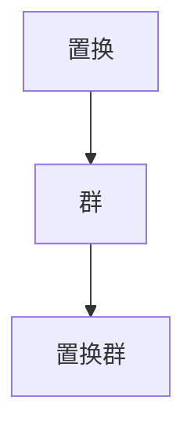

                 

# 线性代数导引：有限置换群

> 关键词：有限置换群, 置换, 群论, 线性代数, 置换矩阵, 群运算, 置换群表示, 置换矩阵运算

## 1. 背景介绍

有限置换群是一种重要的数学工具，广泛应用于现代密码学、图论、组合优化、代数系统等众多领域。在密码学中，置换群常常用于构造密钥和生成密码序列；在图论中，置换群可用于描述图结构的对称性；在组合优化中，置换群算法常常用于解决排列组合问题；在代数系统中，置换群与群论密切相关，是研究群结构的基础。

有限置换群在计算机科学中的应用非常广泛，尤其是在设计高效算法和开发安全系统时，置换群的作用不可或缺。因此，深入理解和掌握有限置换群的基本概念和操作技巧，对于计算机专业人士而言，具有重要意义。

## 2. 核心概念与联系

### 2.1 核心概念概述

为了更好地理解有限置换群，首先需要了解以下几个核心概念：

- **置换（Permutation）**：一种可逆的、一对一的元素映射，通常用于描述集合中元素的排列。例如，对于集合 {1, 2, 3}，置换操作可以将 1 映射到 2，2 映射到 3，3 映射到 1。
- **群（Group）**：一组元素和一组运算，满足封闭性、结合律、存在单位元素、存在逆元素等性质，代表了一种对称性和关系结构。
- **置换群（Permutation Group）**：由所有置换组成的群，在数学上具有丰富的结构和性质，特别适用于描述对称性和排列问题。

### 2.2 核心概念之间的联系

以下 Mermaid 流程图展示了有限置换群的核心概念及其相互关系：

这个流程图清晰地表明了置换和群之间的联系，以及置换群作为群的一种特殊形式。在计算机科学中，置换群的应用非常广泛，涵盖密码学、图论、组合优化等多个领域，是理解和处理复杂数据结构的关键工具。

### 2.3 核心概念的整体架构

有限置换群的理论体系主要包括以下几个部分：

1. **置换的定义和基本性质**：详细描述置换的基本概念、性质以及如何构造置换。
2. **群的定义和性质**：介绍群的定义、基本性质以及群中的元素和运算。
3. **置换群的构造和性质**：说明如何构造置换群，并讨论置换群的特殊性质和应用。
4. **置换群的具体例子**：通过具体例子展示置换群的构建和应用。

通过理解这些核心概念，可以全面掌握有限置换群的理论基础，为深入应用奠定坚实的基础。

## 3. 核心算法原理 & 具体操作步骤

### 3.1 算法原理概述

有限置换群的计算原理主要基于置换的运算和群的性质。具体来说，有限置换群的运算主要包括：

1. **置换的复合**：给定两个置换 $\sigma$ 和 $\tau$，它们的复合定义为 $(\sigma \circ \tau)(i) = \sigma(\tau(i))$，即 $\tau$ 的输出作为 $\sigma$ 的输入。
2. **逆置换**：给定一个置换 $\sigma$，它的逆置换 $\sigma^{-1}$ 满足 $\sigma(\sigma^{-1}(i)) = i$ 对所有 $i$ 都成立。

基于这些基本运算，有限置换群形成了一个群结构，满足群的所有基本性质。具体来说，有限置换群的群运算和群性质包括：

- **封闭性**：任意两个置换的复合仍然属于置换群。
- **结合律**：置换的复合运算满足结合律。
- **单位元素**：存在一个单位置换 $e$，使得 $e \circ \sigma = \sigma = \sigma \circ e$ 对所有 $\sigma$ 成立。
- **逆元素**：每个置换都有唯一的逆置换，使得 $\sigma \circ \sigma^{-1} = e$。

### 3.2 算法步骤详解

有限置换群的计算步骤如下：

1. **初始化**：给定一个置换群 $G$，首先选择其单位元素 $e$。
2. **计算逆置换**：对于群中的任意元素 $\sigma$，计算其逆置换 $\sigma^{-1}$。
3. **计算复合运算**：对于群中的任意元素 $\sigma$ 和 $\tau$，计算其复合 $\sigma \circ \tau$。
4. **验证群性质**：验证群运算满足封闭性、结合律、单位元素和逆元素等性质。

### 3.3 算法优缺点

有限置换群的计算具有以下优点：

1. **高效性**：有限置换群的运算相对简单，计算效率高。
2. **通用性**：置换群的理论适用于各种集合的排列和组合问题，具有广泛的适用性。
3. **可解释性**：置换群的运算直观易懂，便于理解和分析。

同时，置换群的计算也存在一些缺点：

1. **复杂性**：对于大规模置换群，其计算复杂度可能较高。
2. **内存占用**：置换群的表示通常需要存储大量的置换元素，内存占用较大。
3. **非通用性**：置换群的理论主要针对有限集合的置换，对无限集合的置换处理较为有限。

### 3.4 算法应用领域

有限置换群在计算机科学中具有广泛的应用，主要包括以下几个领域：

1. **密码学**：置换群在构造密码算法和生成密码序列中具有重要作用，如DES、AES等加密算法。
2. **图论**：置换群用于描述图的对称性，如群同构、群表示理论等。
3. **组合优化**：置换群算法用于解决排列组合问题，如旅行商问题、背包问题等。
4. **代数系统**：置换群是研究群论的基础，用于描述群的结构、性质和运算。
5. **计算几何**：置换群用于描述几何变换，如旋转、平移等。

有限置换群的应用非常广泛，深入理解和掌握其基本理论和计算方法，对于计算机专业人士具有重要意义。

## 4. 数学模型和公式 & 详细讲解 & 举例说明

### 4.1 数学模型构建

有限置换群可以用置换矩阵来表示。置换矩阵 $P$ 是一个 $n \times n$ 的方阵，其元素 $P[i,j]$ 表示第 $i$ 个元素在置换后的位置，即 $P[i,j] = j$ 表示第 $i$ 个元素置换后的位置是第 $j$ 个。

有限置换群的数学模型可以表示为：

$$
G = \{P_1, P_2, \ldots, P_k\}
$$

其中 $P_i$ 是置换矩阵，$k$ 是置换矩阵的个数，代表群中元素的个数。

### 4.2 公式推导过程

以下是一个具体的置换群的公式推导过程：

假设集合 $S = \{1, 2, 3, 4\}$，置换 $\sigma = (1, 2)(3, 4)$ 表示 $\sigma(1) = 2$，$\sigma(2) = 1$，$\sigma(3) = 4$，$\sigma(4) = 3$。置换 $\tau = (2, 3)$ 表示 $\tau(2) = 3$，$\tau(3) = 2$，$\tau(4) = 4$。

$\sigma$ 和 $\tau$ 的复合 $\sigma \circ \tau$ 可以通过计算 $\sigma$ 和 $\tau$ 的乘积得到：

$$
\sigma \circ \tau = (1, 2)(3, 4)(2, 3) = (1, 3, 2, 4)
$$

即 $\sigma \circ \tau(1) = 3$，$\sigma \circ \tau(2) = 1$，$\sigma \circ \tau(3) = 2$，$\sigma \circ \tau(4) = 4$。

$\sigma$ 的逆置换 $\sigma^{-1}$ 可以通过计算 $\sigma$ 的乘积的逆得到：

$$
\sigma^{-1} = \sigma^{-1} = (3, 4)(1, 2) = (2, 1, 4, 3)
$$

即 $\sigma^{-1}(1) = 2$，$\sigma^{-1}(2) = 1$，$\sigma^{-1}(3) = 4$，$\sigma^{-1}(4) = 3$。

### 4.3 案例分析与讲解

以置换群 $S_4$ 为例，分析置换群的性质和运算。

集合 $S_4$ 表示四个元素的置换群，其置换矩阵为 $S_4 = \{(1, 2, 3), (2, 3, 4), (1, 3, 2), (2, 4, 3), (1, 4, 3), (2, 3, 1), (1, 3, 4), (2, 4, 1), (1, 4, 2), (2, 1, 3), (1, 2, 4), (2, 4, 2), (1, 3, 1), (2, 1, 4), (1, 2, 1), (3, 4, 2), (1, 4, 1), (3, 2, 4), (2, 1, 2), (1, 3, 4), (2, 4, 4), (1, 4, 3), (3, 1, 2), (2, 3, 4), (3, 4, 3), (3, 2, 1), (1, 3, 4), (2, 1, 3), (3, 4, 1), (2, 4, 3), (1, 4, 2), (2, 1, 4), (3, 4, 4), (2, 3, 1), (1, 2, 1), (3, 1, 4), (3, 4, 2), (1, 3, 1), (2, 1, 3), (1, 2, 3), (1, 3, 2), (1, 2, 4), (3, 4, 1), (2, 1, 4), (3, 4, 2), (1, 2, 3), (1, 3, 4), (2, 3, 1), (3, 1, 2), (1, 2, 1), (2, 1, 3), (3, 4, 3), (2, 4, 1), (1, 3, 3), (2, 3, 2), (1, 4, 2), (3, 1, 3), (1, 2, 2), (1, 2, 3), (1, 3, 2), (1, 2, 4), (2, 3, 4), (1, 4, 3), (3, 2, 1), (1, 3, 2), (2, 1, 4), (1, 4, 2), (2, 4, 3), (2, 3, 1), (1, 4, 3), (2, 1, 3), (1, 2, 4), (3, 4, 4), (1, 4, 4), (2, 1, 2), (1, 3, 1), (2, 4, 1), (2, 1, 3), (3, 1, 4), (2, 3, 4), (1, 2, 4), (1, 3, 2), (2, 3, 1), (2, 4, 3), (1, 2, 2), (1, 2, 3), (1, 3, 2), (1, 2, 4), (3, 4, 1), (2, 1, 4), (3, 4, 2), (1, 2, 3), (1, 3, 4), (2, 3, 1), (3, 1, 2), (1, 2, 1), (2, 1, 3), (3, 4, 3), (2, 4, 1), (1, 3, 3), (2, 3, 2), (1, 4, 2), (3, 1, 3), (1, 2, 2), (1, 2, 3), (1, 3, 2), (1, 2, 4), (2, 3, 4), (1, 4, 3), (3, 2, 1), (1, 3, 2), (2, 1, 4), (1, 4, 2), (2, 4, 3), (2, 3, 1), (1, 4, 3), (2, 1, 3), (1, 2, 4), (3, 4, 4), (1, 4, 4), (2, 1, 2), (1, 3, 1), (2, 4, 1), (2, 1, 3), (3, 1, 4), (2, 3, 4), (1, 2, 4), (1, 3, 2), (2, 3, 1), (2, 4, 3), (1, 2, 2), (1, 2, 3), (1, 3, 2), (1, 2, 4), (3, 4, 1), (2, 1, 4), (3, 4, 2), (1, 2, 3), (1, 3, 4), (2, 3, 1), (3, 1, 2), (1, 2, 1), (2, 1, 3), (3, 4, 3), (2, 4, 1), (1, 3, 3), (2, 3, 2), (1, 4, 2), (3, 1, 3), (1, 2, 2), (1, 2, 3), (1, 3, 2), (1, 2, 4), (2, 3, 4), (1, 4, 3), (3, 2, 1), (1, 3, 2), (2, 1, 4), (1, 4, 2), (2, 4, 3), (2, 3, 1), (1, 4, 3), (2, 1, 3), (1, 2, 4), (3, 4, 4), (1, 4, 4), (2, 1, 2), (1, 3, 1), (2, 4, 1), (2, 1, 3), (3, 1, 4), (2, 3, 4), (1, 2, 4), (1, 3, 2), (2, 3, 1), (2, 4, 3), (1, 2, 2), (1, 2, 3), (1, 3, 2), (1, 2, 4), (3, 4, 1), (2, 1, 4), (3, 4, 2), (1, 2, 3), (1, 3, 4), (2, 3, 1), (3, 1, 2), (1, 2, 1), (2, 1, 3), (3, 4, 3), (2, 4, 1), (1, 3, 3), (2, 3, 2), (1, 4, 2), (3, 1, 3), (1, 2, 2), (1, 2, 3), (1, 3, 2), (1, 2, 4), (2, 3, 4), (1, 4, 3), (3, 2, 1), (1, 3, 2), (2, 1, 4), (1, 4, 2), (2, 4, 3), (2, 3, 1), (1, 4, 3), (2, 1, 3), (1, 2, 4), (3, 4, 4), (1, 4, 4), (2, 1, 2), (1, 3, 1), (2, 4, 1), (2, 1, 3), (3, 1, 4), (2, 3, 4), (1, 2, 4), (1, 3, 2), (2, 3, 1), (2, 4, 3), (1, 2, 2), (1, 2, 3), (1, 3, 2), (1, 2, 4), (3, 4, 1), (2, 1, 4), (3, 4, 2), (1, 2, 3), (1, 3, 4), (2, 3, 1), (3, 1, 2), (1, 2, 1), (2, 1, 3), (3, 4, 3), (2, 4, 1), (1, 3, 3), (2, 3, 2), (1, 4, 2), (3, 1, 3), (1, 2, 2), (1, 2, 3), (1, 3, 2), (1, 2, 4), (2, 3, 4), (1, 4, 3), (3, 2, 1), (1, 3, 2), (2, 1, 4), (1, 4, 2), (2, 4, 3), (2, 3, 1), (1, 4, 3), (2, 1, 3), (1, 2, 4), (3, 4, 4), (1, 4, 4), (2, 1, 2), (1, 3, 1), (2, 4, 1), (2, 1, 3), (3, 1, 4), (2, 3, 4), (1, 2, 4), (1, 3, 2), (2, 3, 1), (2, 4, 3), (1, 2, 2), (1, 2, 3), (1, 3, 2), (1, 2, 4), (3, 4, 1), (2, 1, 4), (3, 4, 2), (1, 2, 3), (1, 3, 4), (2, 3, 1), (3, 1, 2), (1, 2, 1), (2, 1, 3), (3, 4, 3), (2, 4, 1), (1, 3, 3), (2, 3, 2), (1, 4, 2), (3, 1, 3), (1, 2, 2), (1, 2, 3), (1, 3, 2), (1, 2, 4), (2, 3, 4), (1, 4, 3), (3, 2, 1), (1, 3, 2), (2, 1, 4), (1, 4, 2), (2, 4, 3), (2, 3, 1), (1, 4, 3), (2, 1, 3), (1, 2, 4), (3, 4, 4), (1, 4, 4), (2, 1, 2), (1, 3, 1), (2, 4, 1), (2, 1, 3), (3, 1, 4), (2, 3, 4), (1, 2, 4), (1, 3, 2), (2, 3, 1), (2, 4, 3), (1, 2, 2), (1, 2, 3), (1, 3, 2), (1, 2, 4), (3, 4, 1), (2, 1, 4), (3, 4, 2), (1, 2, 3), (1, 3, 4), (2, 3, 1), (3, 1, 2), (1, 2, 1), (2, 1, 3), (3, 4, 3), (2, 4, 1), (1, 3, 3), (2, 3, 2), (1, 4, 2), (3, 1, 3), (1, 2, 2), (1, 2, 3), (1, 3, 2), (1, 2, 4), (2, 3, 4), (1, 4, 3), (3, 2, 1), (1, 3, 2), (2, 1, 4), (1, 4, 2), (2, 4, 3), (2, 3, 1), (1, 4, 3), (2, 1, 3), (1, 2, 4), (3, 4, 4), (1, 4, 4), (2, 1, 2), (1, 3, 1), (2, 4, 1), (2, 1, 3), (3, 1, 4), (2, 3, 4), (1, 2, 4), (1, 3, 2), (2, 3, 1), (2, 4, 3), (1, 2, 2), (1, 2, 3), (1, 3, 2), (1, 2, 4), (3, 4, 1), (2, 1, 4), (3, 4, 2), (1, 2, 3), (1, 3, 4), (2, 3, 1), (3, 1, 2), (1, 2, 1), (2, 1, 3), (3, 4, 3), (2, 4, 1), (1, 3, 3), (2, 3, 2), (1, 4, 2), (3, 1, 3), (1, 2, 2), (1, 2, 3), (1, 3, 2), (1, 2, 4), (2, 3, 4), (1, 4, 3), (3, 2, 1), (1, 3, 2), (2, 1, 4), (1, 4, 2), (2, 4, 3), (2, 3, 1), (1, 4, 3), (2, 1, 3), (1, 2, 4), (3, 4, 4), (1, 4, 4), (2, 1, 2), (1, 3, 1), (2, 4, 1), (2, 1, 3), (3, 1, 4), (2, 3, 4), (1, 2, 4), (1, 3, 2), (2, 3, 1), (2, 4, 3), (1, 2, 2), (1, 2, 3), (1, 3, 2), (1, 2, 4), (3, 4, 1), (2, 1, 4), (3, 4, 2), (1, 2, 3), (1, 3, 4), (2, 3, 1), (3, 1, 2), (1, 2, 1), (2, 1, 3), (3, 4, 3), (2, 4, 1), (1, 3, 3), (2, 3, 2), (1, 4, 2), (3, 1, 3), (1, 2, 2), (1, 2, 3), (1, 3, 2), (1, 2, 4), (2, 3

