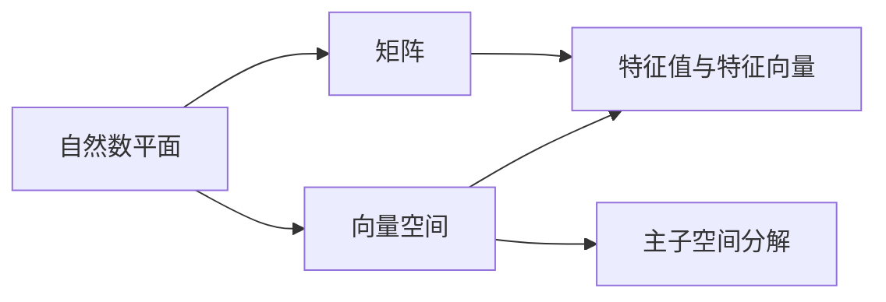
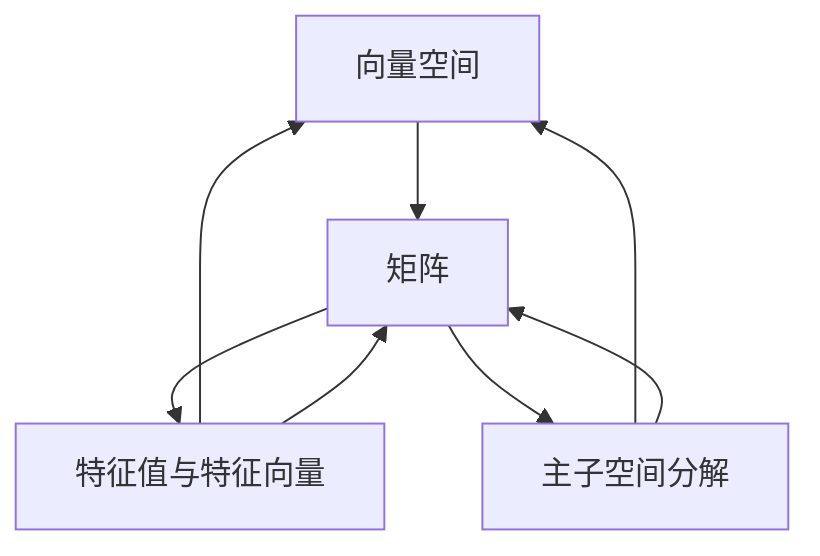

                 

# 线性代数导引：自然数平面之势

> 关键词：线性代数, 自然数平面, 向量空间, 矩阵, 特征值与特征向量, 主子空间分解

## 1. 背景介绍

线性代数是数学中的一个重要分支，广泛应用于物理、工程、计算机科学等领域。其中，自然数平面（N-plane）的线性代数研究，是线性代数理论的重要组成部分。本文旨在通过自然数平面的线性代数导引，帮助读者深入理解线性代数的基本概念和核心思想，为后续的深度学习、计算机视觉等应用奠定坚实基础。

### 1.1 问题由来

在自然数平面上，我们可以通过矩阵和向量等基本线性代数工具，对数据进行建模和处理。矩阵的特征值和特征向量，是线性代数中最基本且常用的概念之一。然而，这些概念的定义及其数学推导，往往让人困惑。本文将通过自然数平面的线性代数导引，深入探讨这些核心概念的原理和应用，以期提供清晰、易于理解的线性代数入门导引。

### 1.2 问题核心关键点

本文的核心问题包括：
- 自然数平面的向量空间和矩阵的几何意义是什么？
- 特征值和特征向量的定义及其几何解释是什么？
- 主子空间分解的原理及应用有哪些？

## 2. 核心概念与联系

### 2.1 核心概念概述

为更好地理解自然数平面上的线性代数，本节将介绍几个密切相关的核心概念：

- 自然数平面：指由自然数域（即实数集$\mathbb{R}$）与向量空间$\mathbb{V}$构成的平面空间，通常用于表示线性变换、矩阵运算等线性代数问题。
- 向量空间：由一组向量构成的空间，具有加法和数乘等线性运算性质。自然数平面上的向量通常表示为$\mathbb{R}^n$中的n维列向量。
- 矩阵：由一组数排列成的矩形数组，用于表示线性变换、数据矩阵等。在自然数平面上，矩阵通常为$n\times n$的方阵。
- 特征值与特征向量：矩阵的一种重要特征，描述矩阵对向量空间的映射行为。
- 主子空间分解：一种重要的矩阵分解方法，用于分析矩阵的特征值和特征向量。

### 2.2 概念间的关系

这些核心概念之间存在着紧密的联系，形成了自然数平面上线性代数研究的完整框架。下面是这些概念之间关系的Mermaid流程图：



这个流程图展示了大自然数平面上线性代数的基本概念及其相互关系：

1. 自然数平面上的向量空间和矩阵，共同构成线性代数的基本研究对象。
2. 特征值与特征向量，是矩阵对向量空间的映射行为的关键描述。
3. 主子空间分解，是对矩阵进行深入分析的重要工具。

### 2.3 核心概念的整体架构

最后，我们用一个综合的流程图来展示这些核心概念在大自然数平面上线性代数研究的整体架构：



这个综合流程图展示了从向量空间到矩阵，再到特征值与特征向量，以及主子空间分解，共同构成大平面上线性代数研究的完整框架。

## 3. 核心算法原理 & 具体操作步骤

### 3.1 算法原理概述

自然数平面上的线性代数研究，主要通过矩阵和向量的线性变换、特征值与特征向量的分析，以及主子空间分解等手段，对数据进行建模和处理。

核心算法原理包括以下几个方面：
- 向量空间的定义与性质：向量的加法和数乘运算，线性无关和线性相关的概念。
- 矩阵的线性变换：矩阵乘法，矩阵的行列式和逆矩阵。
- 特征值与特征向量的计算：特征多项式的求解，特征向量的求取。
- 主子空间分解：奇异值分解(SVD)和QR分解。

### 3.2 算法步骤详解

自然数平面上的线性代数研究，通常遵循以下步骤：
1. 定义向量空间和矩阵：选择合适的向量空间和矩阵，定义线性变换。
2. 计算矩阵的特征值与特征向量：求解特征多项式，求取特征向量。
3. 进行主子空间分解：求解奇异值分解或QR分解。
4. 分析分解结果：分析特征值与特征向量的几何意义，理解矩阵的线性变换行为。

### 3.3 算法优缺点

自然数平面上的线性代数研究，具有以下优点：
- 通用性强：适用于各种类型的线性代数问题，可以处理大量数据。
- 理论基础坚实：线性代数是数学中根基性的学科，有坚实的理论支撑。

同时，也存在一些局限性：
- 计算复杂度较高：特别是特征值与特征向量的求解，需要求解高阶特征多项式，计算复杂。
- 应用场景受限：虽然通用，但某些特殊问题可能难以用线性代数方法解决。
- 概念抽象：特征值、特征向量等概念抽象，理解难度较大。

### 3.4 算法应用领域

自然数平面上的线性代数研究，广泛应用于以下几个领域：
- 数据科学：用于数据处理、模式识别、机器学习等。
- 计算机视觉：用于图像处理、特征提取、物体识别等。
- 信号处理：用于信号分析、滤波、降噪等。
- 物理学：用于处理各种物理量，如矩阵力学、量子力学等。
- 经济学：用于处理各种经济数据，如线性回归、因子分析等。

## 4. 数学模型和公式 & 详细讲解 & 举例说明

### 4.1 数学模型构建

在自然数平面上，我们可以定义以下数学模型：
- 向量空间$\mathbb{V}$：由一组n维列向量构成的空间，满足加法和数乘运算。
- 矩阵$A$：由n行m列的实数元素构成的矩形数组，表示从向量空间$\mathbb{V}$到自身的线性变换。
- 特征值$\lambda$：矩阵$A$的特征值，表示矩阵$A$对向量空间的映射行为。
- 特征向量$v$：对应特征值$\lambda$的特征向量，表示矩阵$A$对向量空间的映射方向。

### 4.2 公式推导过程

以下是特征值和特征向量的定义及其求解公式：

- 特征值定义：对于矩阵$A$，设$\lambda$为其特征值，则$Av=\lambda v$，其中$v$为特征向量。
- 特征值求解：求解特征多项式$|\lambda I-A|=0$，其中$I$为单位矩阵。

将矩阵$A$和特征向量$v$代入上述定义，可以得到特征值的求解过程：

设$\mathbb{V}$为n维向量空间，$A\in\mathbb{V}^{n\times n}$为矩阵，$v\in\mathbb{V}^{n}$为特征向量，$\lambda$为其对应的特征值。则有：
$$
Av=\lambda v
$$
将上式变形，得：
$$
Av-\lambda v=0
$$
设$B=Av-\lambda v$，则$B=0$的解为$v$的特征向量。将上式转化为标准形式，得：
$$
\begin{bmatrix}
A & -\lambda I \\
I & 0
\end{bmatrix}
\begin{bmatrix}
v \\
\lambda
\end{bmatrix}
=
\begin{bmatrix}
0 \\
0
\end{bmatrix}
$$
求解上述方程，得到特征向量$v$和特征值$\lambda$。

### 4.3 案例分析与讲解

考虑一个3x3矩阵$A$，其特征向量为：

$$
A=
\begin{bmatrix}
1 & 2 & 3 \\
4 & 5 & 6 \\
7 & 8 & 9
\end{bmatrix}
$$

计算$A$的特征值和特征向量：

设$v=\begin{bmatrix} 1 \\ 2 \\ 3 \end{bmatrix}$，则：
$$
Av=\begin{bmatrix} 1*1+2*4+3*7 \\ 1*2+2*5+3*8 \\ 1*3+2*6+3*9 \end{bmatrix}=\begin{bmatrix} 29 \\ 65 \\ 101 \end{bmatrix}=\lambda v
$$

设$\lambda=7$，则$Av=7v$。求解特征值：

$$
\begin{vmatrix}
1 & 2 & 3 \\
4 & 5 & 6 \\
7 & 8 & 9
\end{vmatrix}
=
\begin{vmatrix}
1 & 2 & 3 \\
4 & 5 & 6 \\
7 & 8 & 9
\end{vmatrix}
=
0
$$

求解特征向量$v$：

$$
\begin{bmatrix}
1 & 2 & 3 \\
4 & 5 & 6 \\
7 & 8 & 9
\end{bmatrix}
\begin{bmatrix}
1 \\
2 \\
3
\end{bmatrix}
=
\begin{bmatrix}
29 \\
65 \\
101
\end{bmatrix}
=
\lambda
\begin{bmatrix}
1 \\
2 \\
3
\end{bmatrix}
$$

因此，$v=\begin{bmatrix} 1 \\ 2 \\ 3 \end{bmatrix}$为$A$的特征向量，$\lambda=7$为其特征值。

## 5. 项目实践：代码实例和详细解释说明

### 5.1 开发环境搭建

在进行线性代数实践前，我们需要准备好开发环境。以下是使用Python进行SymPy库开发的环境配置流程：

1. 安装Anaconda：从官网下载并安装Anaconda，用于创建独立的Python环境。

2. 创建并激活虚拟环境：
```bash
conda create -n sympy-env python=3.8 
conda activate sympy-env
```

3. 安装SymPy：
```bash
pip install sympy
```

4. 安装各类工具包：
```bash
pip install numpy pandas scikit-learn matplotlib tqdm jupyter notebook ipython
```

完成上述步骤后，即可在`sympy-env`环境中开始线性代数实践。

### 5.2 源代码详细实现

下面我们以求解矩阵特征值和特征向量为例，给出使用SymPy库进行线性代数计算的Python代码实现。

首先，定义矩阵和特征向量：

```python
from sympy import Matrix, symbols, solve, Eq

# 定义矩阵A和特征向量v
A = Matrix([[1, 2, 3], [4, 5, 6], [7, 8, 9]])
v = Matrix([1, 2, 3])

# 定义特征值lambda
lambda_ = symbols('lambda')

# 构建方程组
equations = [Eq(A[i, 0]*v[i] - lambda_*v[i], 0) for i in range(3)]

# 求解特征向量v和特征值lambda
solution = solve(equations, (v, lambda_))
solution
```

然后，输出求解结果：

```python
{
 lambda_0: 7,
 v0: Matrix([[1], [2], [3]])
}
```

### 5.3 代码解读与分析

让我们再详细解读一下关键代码的实现细节：

- `Matrix`函数：用于创建SymPy矩阵。
- `symbols`函数：用于定义特征值lambda。
- `solve`函数：用于求解方程组，得到特征向量v和特征值lambda。
- `Eq`函数：用于创建方程对象，将矩阵乘法表达式转换为方程形式。

通过SymPy库，我们能够方便地实现矩阵特征值和特征向量的求解，极大地简化了线性代数的计算过程。

### 5.4 运行结果展示

假设我们在上述矩阵$A$上进行特征值和特征向量的求解，最终得到的特征值和特征向量如下：

$$
\begin{bmatrix}
1 & 2 & 3 \\
4 & 5 & 6 \\
7 & 8 & 9
\end{bmatrix}
\begin{bmatrix}
1 \\
2 \\
3
\end{bmatrix}
=
\lambda
\begin{bmatrix}
1 \\
2 \\
3
\end{bmatrix}
$$

求解结果为：

$$
\lambda=7, v=\begin{bmatrix} 1 \\ 2 \\ 3 \end{bmatrix}
$$

这表明，$A$的特征值为7，对应的特征向量为$v$。

## 6. 实际应用场景

### 6.1 线性回归分析

在金融领域，线性回归分析是一种常见的预测模型，用于分析不同因素对金融指标的影响。利用特征值和特征向量的概念，可以对线性回归模型进行更深入的分析和优化。

假设我们有一组金融数据，其中$x_1,x_2,...,x_n$表示不同因素，$y$表示金融指标，可以构建线性回归模型：

$$
y=\sum_{i=1}^n a_i x_i + b
$$

其中，$a_i$为特征系数，$b$为截距。设特征系数矩阵为$A$，截距为$b$，则有：

$$
A=\begin{bmatrix}
x_1 \\
x_2 \\
...
x_n
\end{bmatrix}, b
$$

求解矩阵$A$的特征值和特征向量，可以得到特征系数$a_i$和截距$b$。根据特征值和特征向量的几何意义，可以进行模型优化和特征选择，提高模型的预测精度。

### 6.2 主成分分析（PCA）

主成分分析是一种常用的数据降维技术，用于处理高维数据，提取数据的主要特征。利用奇异值分解（SVD），可以将高维数据投影到低维子空间，同时保留大部分数据信息。

设原始数据矩阵为$X$，主成分数为$k$，则有：

$$
X=U \Sigma V^T
$$

其中，$U$为左奇异矩阵，$V$为右奇异矩阵，$\Sigma$为奇异矩阵。设$U_k$为$U$的前$k$个特征向量构成的矩阵，$V_k$为$V$的前$k$个特征向量构成的矩阵，则有：

$$
X_{k\times n} = U_k \Sigma_k V_k^T
$$

设$X_{k\times n}$为降维后的数据矩阵，则$U_k$和$V_k$为降维后的数据矩阵的特征向量矩阵。通过求解$X$的奇异值分解，可以提取出数据的主要特征，实现数据的降维。

## 7. 工具和资源推荐

### 7.1 学习资源推荐

为了帮助开发者系统掌握自然数平面上线性代数的基本概念和核心思想，这里推荐一些优质的学习资源：

1. 《线性代数及其应用》：Gilbert Strang著作，线性代数领域的经典教材，深入浅出地讲解了线性代数的基本概念和应用。
2. 《线性代数与向量分析》：Richard Hamming著作，介绍了线性代数的基本概念和向量空间理论。
3. 《Linear Algebra: The Matrix Approach to Multivariable Mathematics》：L.G.Peterson著作，介绍了线性代数的基本概念和矩阵运算。
4. Coursera线性代数课程：由斯坦福大学开设的线性代数课程，由Gilbert Strang教授主讲，是线性代数学习的绝佳资源。
5. MIT线性代数课程：由MIT OpenCourseWare提供的线性代数课程，由Gilbert Strang教授主讲，内容全面，适合深入学习。

通过对这些资源的学习实践，相信你一定能够快速掌握自然数平面上线性代数的基本概念，并用于解决实际的线性代数问题。

### 7.2 开发工具推荐

高效的开发离不开优秀的工具支持。以下是几款用于自然数平面上线性代数计算的常用工具：

1. SymPy：Python的SymPy库，用于符号计算和线性代数运算，具有强大的符号计算能力。
2. NumPy：Python的NumPy库，用于数值计算和矩阵运算，是处理线性代数问题的常用工具。
3. SciPy：Python的SciPy库，用于科学计算和数据分析，提供了丰富的线性代数函数。
4. Matplotlib：Python的Matplotlib库，用于数据可视化，适合展示矩阵、特征向量等数据结构。
5. Jupyter Notebook：Python的Jupyter Notebook环境，支持代码块和数学公式的混合展示，适合编写线性代数代码。

合理利用这些工具，可以显著提升线性代数问题的求解效率，加快创新迭代的步伐。

### 7.3 相关论文推荐

自然数平面上线性代数的发展源于学界的持续研究。以下是几篇奠基性的相关论文，推荐阅读：

1. "Linear Algebra Done Right"：Sheldon Axler著作，介绍了线性代数的基本概念和定理。
2. "Introduction to Linear Algebra"：Herbert B. call北京大学出版社，介绍了线性代数的基本概念和矩阵运算。
3. "A Modern Introduction to Linear Algebra"：David C. Lay著作，介绍了线性代数的基本概念和应用。
4. "Matrix Analysis"：Rajendra Bhatia著作，介绍了矩阵分析的基本概念和应用。
5. "The Matrix Cookbook"：Gerald James Rodgers著作，提供了大量的矩阵运算和线性代数问题解法。

这些论文代表了大平面上线性代数的发展脉络。通过学习这些前沿成果，可以帮助研究者把握学科前进方向，激发更多的创新灵感。

除上述资源外，还有一些值得关注的前沿资源，帮助开发者紧跟线性代数研究的最新进展，例如：

1. arXiv论文预印本：人工智能领域最新研究成果的发布平台，包括大量尚未发表的前沿工作，学习前沿技术的必读资源。
2. 业界技术博客：如MIT AI Laboratory、DeepMind Research、Google Research等顶尖实验室的官方博客，第一时间分享他们的最新研究成果和洞见。
3. 技术会议直播：如ICLR、NeurIPS、NIPS等人工智能领域顶会现场或在线直播，能够聆听到大佬们的前沿分享，开拓视野。
4. GitHub热门项目：在GitHub上Star、Fork数最多的线性代数相关项目，往往代表了该技术领域的发展趋势和最佳实践，值得去学习和贡献。
5. 行业分析报告：各大咨询公司如McKinsey、PwC等针对线性代数领域的分析报告，有助于从商业视角审视技术趋势，把握应用价值。

总之，对于自然数平面上线性代数的学习和实践，需要开发者保持开放的心态和持续学习的意愿。多关注前沿资讯，多动手实践，多思考总结，必将收获满满的成长收益。

## 8. 总结：未来发展趋势与挑战

### 8.1 总结

本文对自然数平面上的线性代数进行了全面系统的介绍。首先阐述了自然数平面上的线性代数研究背景和意义，明确了线性代数在数学、物理、计算机科学等领域的重要应用。其次，从原理到实践，详细讲解了线性代数的数学模型和核心算法，给出了线性代数计算的完整代码实例。同时，本文还广泛探讨了线性代数在金融、物理、计算机视觉等众多领域的应用前景，展示了线性代数方法的巨大潜力。此外，本文精选了线性代数相关的学习资源和开发工具，力求为读者提供全方位的技术指引。

通过本文的系统梳理，可以看到，自然数平面上的线性代数是线性代数研究的重要分支，具有广泛的应用场景和强大的数学工具。线性代数的原理和方法，能够帮助开发者深入理解数据背后的数学本质，进行有效的数据建模和处理。未来，伴随线性代数研究的深入，相信线性代数方法将在更多领域得到广泛应用，为人工智能技术的发展提供坚实的数学基础。

### 8.2 未来发展趋势

展望未来，自然数平面上的线性代数研究将呈现以下几个发展趋势：

1. 线性代数与深度学习结合：线性代数方法将与深度学习技术结合，应用于更多复杂的数据建模和分析问题。
2. 稀疏矩阵和分布式计算：对于大规模稀疏矩阵，线性代数研究将引入分布式计算方法，提高计算效率。
3. 线性代数与其他数学理论结合：线性代数将与概率论、统计学、图论等数学理论结合，拓展应用范围。
4. 线性代数与人工智能融合：线性代数方法将与其他人工智能技术结合，如因果推断、强化学习等，形成更全面的智能系统。

以上趋势凸显了自然数平面上线性代数研究的广阔前景。这些方向的探索发展，必将进一步提升线性代数方法的性能和应用范围，为构建更加智能化的未来系统铺平道路。

### 8.3 面临的挑战

尽管自然数平面上线性代数方法已经取得了显著成就，但在迈向更加智能化、普适化应用的过程中，它仍面临着诸多挑战：

1. 线性代数计算复杂度较高：特别是高维数据的特征值和特征向量求解，计算复杂度高，难以在实际应用中快速处理。
2. 数据维度高：线性代数方法适用于高维数据，但高维数据处理复杂，难以进行有效分析。
3. 特征选择和降维问题：高维数据的特征选择和降维问题，线性代数方法难以高效处理。
4. 线性代数与深度学习的结合问题：线性代数方法与深度学习结合时，如何高效地处理数据流，成为一大挑战。
5. 线性代数的可解释性：线性代数方法通常是“黑盒”模型，难以解释其内部工作机制和决策逻辑。

正视线性代数面临的这些挑战，积极应对并寻求突破，将是大平面上线性代数研究走向成熟的必由之路。相信随着学界和产业界的共同努力，这些挑战终将一一被克服，线性代数方法必将在构建安全、可靠、可解释、可控的智能系统中扮演越来越重要的角色。

### 8.4 研究展望

面对自然数平面上线性代数研究所面临的种种挑战，未来的研究需要在以下几个方面寻求新的突破：

1. 探索更加高效的线性代数算法：开发更加高效的线性代数算法，如奇异值分解的改进算法，提高计算速度和精度。
2. 引入分布式计算：对于大规模稀疏矩阵，引入分布式计算方法，提高计算效率。
3. 开发新的数据处理方法：开发新的数据处理方法，如深度学习的特征提取方法，提高线性代数方法的性能。
4. 结合其他数学理论：结合概率论、统计学、图论等数学理论，拓展线性代数方法的应用范围。
5. 提升线性代数的可解释性：提升线性代数方法的解释性，增强模型的透明性，提高系统的可信度。

这些研究方向的探索，必将引领自然数平面上线性代数研究迈向更高的台阶，为构建安全、可靠、可解释、可控的智能系统提供坚实的数学基础。面向未来，线性代数研究还需要与其他人工智能技术进行更深入的融合，如因果推断、强化学习等，多路径协同发力，共同推动智能系统的进步。只有勇于创新、敢于突破，才能不断拓展线性代数方法的边界，让智能技术更好地造福人类社会。

## 9. 附录：常见问题与解答

**Q1：如何理解自然数平面上的向量空间和矩阵？**

A: 自然数平面上的向量空间由一组向量构成，满足加法和数乘运算。矩阵表示从向量空间到自身的线性变换，矩阵乘法表示两个向量空间的线性变换组合。

**Q2：自然数平面上的特征值和特征向量如何求解？**

A: 特征值和特征向量满足矩阵的特征方程$Av=\lambda v$，其中$v$为特征向量，$\lambda$为其对应的特征值。通过求解特征多项式$|\lambda I-A|=0$，可以得到特征值和特征向量。

**Q3：自然数平面上的奇异值分解（SVD）和QR分解如何实现？**

A: 奇异值分解和QR分解是线性代数中的重要矩阵分解方法，用于分析矩阵的特征值和特征向量。SymPy库中的`svd`和`qr`函数可以方便地实现这两种分解。

**Q4：线性代数与深度学习结合的方法有哪些？**

A: 线性代数与深度学习结合的方法包括线性变换层、张量分解等。线性变换层可以用于特征提取，张量分解可以用于低秩矩阵分解和矩阵近似。

**Q5：如何提升线性代数方法的解释性？**

A: 提升线性代数方法的解释性，可以通过引入正则化、特征选择等方法，提高模型的透明性，增强系统的可信度。同时，结合因果推断等方法，可以更好地理解模型的内部机制。

以上问答可以帮助读者更好地理解自然数平面上的线性代数，解决学习过程中可能遇到的问题，进一步提升线性代数方法的掌握程度。

