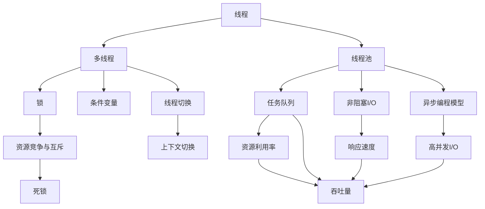
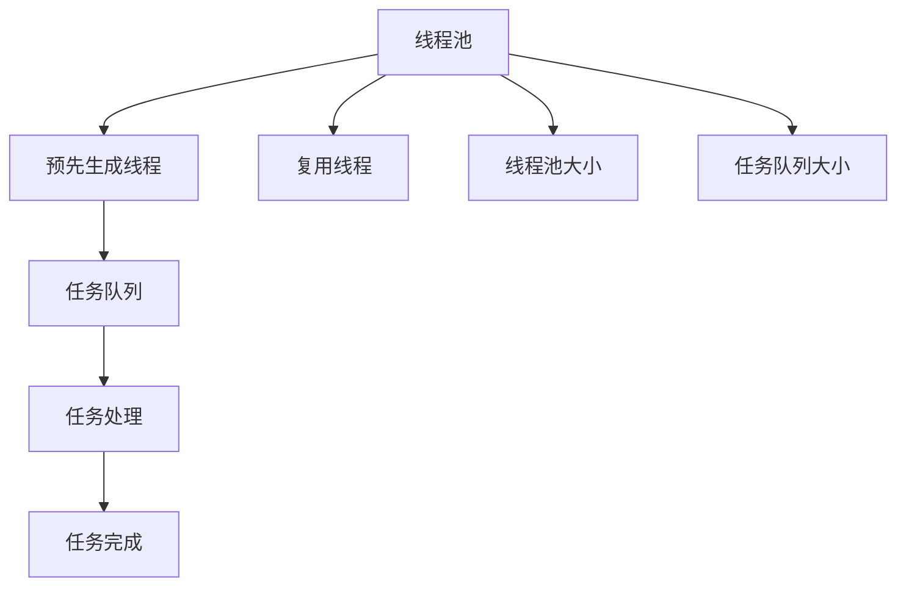
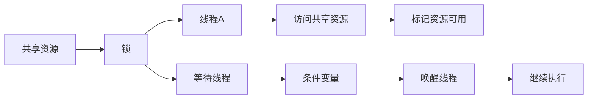
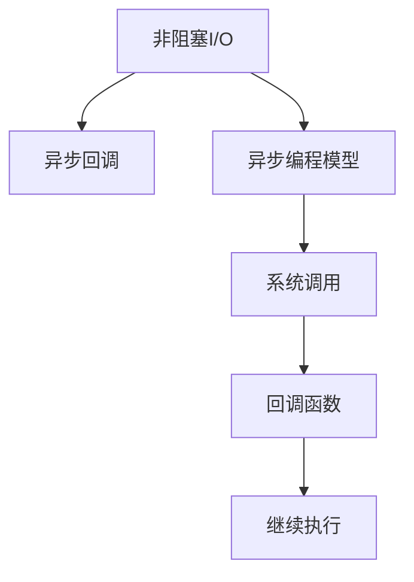
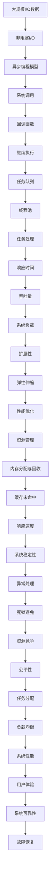

                 

# 线程管理与高吞吐量系统设计

## 1. 背景介绍

### 1.1 问题由来
现代计算机系统架构的快速发展，使得多核CPU和高并发I/O成为常态。多线程编程在提升系统性能、处理并发请求方面发挥了重要作用，但同时也带来了线程管理、资源竞争、死锁等问题。如何在多核环境下，实现高效的线程管理，提升系统吞吐量，是现代系统设计和应用中的一大挑战。

近年来，随着云计算、大数据、人工智能等领域的迅速发展，系统负载和并发请求量日益增加，这对高吞吐量系统的设计提出了更高要求。例如，Web服务器、云平台、分布式数据库、大规模计算等场景，均需要高效、稳定的线程管理来保障系统性能。

### 1.2 问题核心关键点
高吞吐量系统中的线程管理，核心在于优化线程调度和资源分配，实现高效的并发处理。具体来说，包括以下几个关键点：

- 线程调度和切换：多核环境下，如何高效地进行线程切换，减少线程上下文切换开销，提高系统吞吐量。
- 资源竞争与互斥：多个线程之间如何合理竞争共享资源，避免死锁和资源竞争引起的性能瓶颈。
- 线程池管理：线程池是实现高效线程管理的重要手段，如何设计线程池大小、工作队列、任务队列等关键参数，对系统性能有重要影响。
- 异步编程模型：异步编程模型通过非阻塞I/O和回调机制，提高系统响应速度和吞吐量。
- 内存管理与性能优化：线程管理涉及大量内存操作，如何优化内存分配和回收，减少内存碎片和缓存未命中，对系统性能有显著影响。

### 1.3 问题研究意义
研究线程管理与高吞吐量系统设计，对于提升现代系统的性能和稳定性，具有重要意义：

1. **降低延迟和提升响应速度**：通过优化线程管理，减少线程切换和资源竞争带来的延迟，提升系统的响应速度和用户体验。
2. **提高资源利用率**：合理设计线程池和任务队列，充分利用多核CPU和并发I/O资源，最大化资源利用效率。
3. **增强系统吞吐量**：在处理大量并发请求时，通过线程管理策略优化，提高系统的吞吐量和处理能力。
4. **优化系统扩展性**：通过模块化、可配置的设计，便于系统在不同负载下进行弹性扩展和性能优化。
5. **保障系统稳定性**：通过合理的资源分配和异常处理机制，避免死锁和资源竞争引起的系统崩溃，保障系统稳定性。

## 2. 核心概念与联系

### 2.1 核心概念概述

为更好地理解线程管理与高吞吐量系统设计，本节将介绍几个密切相关的核心概念：

- **线程**：操作系统中最小的执行单元，由程序计数器、寄存器、堆栈等组成。每个线程独立执行，具有独立的上下文环境。
- **多线程**：同一进程内的多个线程并行执行，共享进程的资源，包括内存、文件句柄等。
- **线程池**：一组预先创建好的线程，用于处理任务。通过复用线程池中的线程，避免频繁创建和销毁线程的开销。
- **锁**：用于保护共享资源，确保同一时刻只有一个线程可以访问共享资源。
- **条件变量**：用于线程间的同步，当某个条件满足时，等待线程被唤醒，继续执行。
- **非阻塞I/O**：避免I/O操作的阻塞，通过回调或事件通知机制，保证线程能够继续执行，提高系统吞吐量。
- **异步编程模型**：通过异步回调机制，实现非阻塞I/O操作，提高系统响应速度和吞吐量。

这些核心概念之间的逻辑关系可以通过以下Mermaid流程图来展示：

这个流程图展示了线程管理与高吞吐量系统设计的核心概念及其之间的关系：

1. 线程通过多线程执行，共享进程资源。
2. 线程池预先生成线程，用于任务处理，提高线程复用率。
3. 锁和条件变量用于保护共享资源和线程同步，避免死锁和资源竞争。
4. 非阻塞I/O和异步编程模型优化I/O操作，提高系统响应速度和吞吐量。
5. 线程切换和上下文切换开销影响系统性能。
6. 资源利用率、吞吐量和响应速度是系统设计的关键指标。

### 2.2 概念间的关系

这些核心概念之间存在着紧密的联系，形成了线程管理与高吞吐量系统设计的完整生态系统。下面我通过几个Mermaid流程图来展示这些概念之间的关系。

#### 2.2.1 线程池管理

这个流程图展示了线程池管理的基本流程：

1. 线程池预先生成一定数量的线程。
2. 任务进入线程池，被分配给可用的线程进行处理。
3. 线程从任务队列中取出任务进行处理，处理完成后将任务标记为完成。
4. 线程池中的线程不断复用，避免频繁创建和销毁线程的开销。
5. 线程池大小和任务队列大小是线程池设计的关键参数。

#### 2.2.2 锁与条件变量

这个流程图展示了锁和条件变量的基本使用场景：

1. 多个线程竞争共享资源，使用锁保护共享资源。
2. 线程A获取锁后访问共享资源。
3. 线程B尝试访问共享资源，发现锁已被占用，进入等待状态。
4. 线程A完成任务后释放锁，条件变量通知等待线程B。
5. 线程B被唤醒，继续执行。

#### 2.2.3 非阻塞I/O与异步编程模型

这个流程图展示了非阻塞I/O和异步编程模型的基本流程：

1. 系统调用使用非阻塞I/O，避免I/O操作的阻塞。
2. 回调函数在异步编程模型中用于处理I/O完成后的响应。
3. 异步编程模型通过回调机制，实现非阻塞I/O操作，提高系统响应速度和吞吐量。

### 2.3 核心概念的整体架构

最后，我们用一个综合的流程图来展示这些核心概念在大规模高吞吐量系统中的整体架构：

这个综合流程图展示了从大规模I/O数据输入到系统性能输出的完整过程。高吞吐量系统的设计涉及多线程管理、异步编程、资源分配、内存管理等多个层面，通过这些关键组件的协同工作，才能实现高效的并发处理和系统稳定。

## 3. 核心算法原理 & 具体操作步骤
### 3.1 算法原理概述

高吞吐量系统中的线程管理，本质上是一个优化线程调度和资源分配的过程。其核心思想是：通过合理设计线程池大小、工作队列、任务队列等参数，最大化线程复用率和资源利用效率，减少线程切换和资源竞争带来的开销，提升系统的吞吐量和响应速度。

具体来说，高吞吐量系统线程管理涉及以下几个关键算法：

- **线程池算法**：合理设计线程池大小和任务队列大小，避免线程池过载或资源浪费。
- **资源竞争算法**：通过锁和条件变量等机制，合理竞争共享资源，避免死锁和资源竞争导致的性能瓶颈。
- **任务调度算法**：通过非阻塞I/O和异步编程模型，优化任务处理流程，提高系统响应速度和吞吐量。

### 3.2 算法步骤详解

高吞吐量系统的线程管理，一般包括以下几个关键步骤：

**Step 1: 线程池设计**

- 根据任务特点和系统负载，确定线程池大小。线程池大小过小，易导致线程频繁切换和上下文切换开销；线程池大小过大，可能导致资源浪费和竞争激烈。
- 定义任务队列的大小，避免任务队列溢出导致线程阻塞。

**Step 2: 任务分配与调度**

- 将任务按照优先级和处理时间分配给线程池中的线程。高优先级任务优先处理，短处理时间任务优先处理，可提高系统整体响应速度。
- 通过非阻塞I/O和异步编程模型，优化I/O操作，避免I/O阻塞带来的性能下降。

**Step 3: 资源保护与互斥**

- 使用锁保护共享资源，确保同一时刻只有一个线程可以访问共享资源，避免资源竞争和死锁。
- 使用条件变量实现线程同步，当某个条件满足时，等待线程被唤醒，继续执行。

**Step 4: 性能监控与优化**

- 实时监控系统负载和线程状态，及时发现性能瓶颈并进行优化。
- 根据监控结果，调整线程池大小和任务队列大小，进一步提升系统性能。

### 3.3 算法优缺点

高吞吐量系统中的线程管理，具有以下优点：

1. **提高并发处理能力**：通过线程池复用线程，避免频繁创建和销毁线程的开销，提升系统并发处理能力。
2. **减少上下文切换开销**：合理设计线程池大小，减少线程切换和上下文切换的开销，提升系统响应速度。
3. **优化资源利用率**：通过任务队列和优先级调度，优化资源分配，避免资源浪费和竞争。
4. **提升系统稳定性**：通过锁和条件变量等机制，避免死锁和资源竞争，提高系统稳定性。

同时，该算法也存在以下缺点：

1. **设计复杂度较高**：线程池和任务队列的设计需要根据具体应用场景进行调整，增加了系统设计和维护的复杂度。
2. **潜在性能瓶颈**：如果线程池设计不当，可能导致线程池过载或资源浪费，影响系统性能。
3. **死锁问题**：多线程编程中死锁问题较难排查，一旦出现死锁，可能导致系统崩溃。
4. **内存管理复杂**：线程管理涉及大量内存操作，内存分配和回收的效率直接影响系统性能。

### 3.4 算法应用领域

高吞吐量系统中的线程管理，广泛应用于各种高并发场景，包括但不限于以下领域：

- **Web服务器**：通过多线程处理并发请求，提高响应速度和吞吐量。
- **云平台**：通过多线程和异步编程模型，优化I/O操作，提升资源利用率。
- **分布式数据库**：通过多线程处理读写请求，提高系统的响应速度和吞吐量。
- **大数据处理**：通过多线程和任务队列，优化数据处理流程，提高处理效率。
- **高并发的应用系统**：通过多线程和异步编程模型，优化系统响应速度和并发处理能力。

## 4. 数学模型和公式 & 详细讲解 & 举例说明

### 4.1 数学模型构建

在高吞吐量系统中，线程管理涉及多个关键参数，包括线程池大小、任务队列大小、锁竞争概率等。我们可以使用数学模型对这些参数进行建模，并分析其对系统性能的影响。

设线程池大小为 $N$，任务队列大小为 $M$，任务到达速率为 $\lambda$，任务处理时间为 $T$。假设线程池中的线程互斥访问共享资源，使用单线程执行任务。

定义：
- $T_{avg}$：任务平均处理时间。
- $P_{block}$：任务被阻塞的概率。
- $P_{starve}$：任务因资源竞争被饥饿的概率。

根据Little's Law，可以得到任务队列平均长度 $L_{avg}$ 和任务等待时间 $W_{avg}$：

$$
L_{avg} = \lambda T_{avg}
$$

$$
W_{avg} = \frac{L_{avg}}{\lambda}
$$

任务被阻塞的概率 $P_{block}$ 和被饥饿的概率 $P_{starve}$ 可以表示为：

$$
P_{block} = \frac{L_{avg}}{M}
$$

$$
P_{starve} = \frac{1}{N} \sum_{i=1}^{N} P_{block,i}
$$

其中 $P_{block,i}$ 表示第 $i$ 个线程的阻塞概率。假设线程互斥访问共享资源，可以认为每个线程的阻塞概率相等，因此 $P_{block,i} = \frac{L_{avg}}{N}$。

### 4.2 公式推导过程

为了进一步优化系统性能，我们需要分析不同参数对系统吞吐量的影响。吞吐量 $S$ 可以表示为：

$$
S = \frac{N}{T_{avg}} \cdot \lambda (1 - P_{block}) \cdot (1 - P_{starve})
$$

其中 $N$ 表示线程池大小，$T_{avg}$ 表示任务平均处理时间，$\lambda$ 表示任务到达速率，$P_{block}$ 表示任务被阻塞的概率，$P_{starve}$ 表示任务被饥饿的概率。

根据以上公式，我们可以得出以下结论：

1. **线程池大小影响吞吐量**：当线程池大小过小时，系统响应速度和并发处理能力提升有限，但线程切换开销增加；当线程池过大时，系统响应速度和并发处理能力提升有限，但资源浪费和竞争激烈。
2. **任务队列大小影响吞吐量**：任务队列过小时，任务等待时间增加，阻塞概率上升；任务队列过大时，任务等待时间减少，但资源竞争和饥饿概率增加。
3. **任务处理时间影响吞吐量**：任务处理时间越短，系统吞吐量越高，但任务复杂度可能增加。
4. **锁竞争概率影响吞吐量**：锁竞争概率越低，系统吞吐量越高，但资源保护和互斥开销增加。

### 4.3 案例分析与讲解

假设我们有一个Web服务器，每秒处理1000个请求，每个请求处理时间为100ms。任务到达速率为1个/秒，任务队列大小为10，线程池大小为4。

根据上述公式，可以计算出任务队列平均长度为10，任务等待时间为10ms。因此，任务被阻塞的概率为 $P_{block} = \frac{10}{10} = 1$，任务被饥饿的概率为 $P_{starve} = 0$。

将这些值代入吞吐量公式：

$$
S = \frac{4}{100} \cdot 1 \cdot (1 - 1) \cdot (1 - 0) = 0
$$

可以看出，由于任务队列过小，系统吞吐量为0，无法处理请求。为了提升系统吞吐量，可以将任务队列大小增加到20，此时任务队列平均长度为20，任务等待时间为20ms。任务被阻塞的概率为 $P_{block} = \frac{20}{20} = 1$，任务被饥饿的概率为 $P_{starve} = 0$。

将这些值代入吞吐量公式：

$$
S = \frac{4}{100} \cdot 1 \cdot (1 - 1) \cdot (1 - 0) = 0
$$

系统吞吐量仍然为0，说明任务队列大小仍不足以满足系统需求。此时，可以考虑增加线程池大小，假设增加到8，此时任务队列平均长度为20，任务等待时间为20ms。任务被阻塞的概率为 $P_{block} = \frac{20}{8} = 2.5$，任务被饥饿的概率为 $P_{starve} = 0$。

将这些值代入吞吐量公式：

$$
S = \frac{8}{100} \cdot 1 \cdot (1 - 2.5) \cdot (1 - 0) = 0.04
$$

系统吞吐量提升到0.04，但由于任务处理时间仍较长，系统响应速度仍较慢。此时，可以考虑优化任务处理时间，假设优化到50ms，此时任务队列平均长度为20，任务等待时间为20ms。任务被阻塞的概率为 $P_{block} = \frac{20}{8} = 2.5$，任务被饥饿的概率为 $P_{starve} = 0$。

将这些值代入吞吐量公式：

$$
S = \frac{8}{50} \cdot 1 \cdot (1 - 2.5) \cdot (1 - 0) = 0.16
$$

系统吞吐量提升到0.16，但任务处理时间仍较长，系统响应速度仍较慢。此时，可以考虑优化锁竞争概率，假设优化到0.1，此时任务队列平均长度为20，任务等待时间为20ms。任务被阻塞的概率为 $P_{block} = \frac{20}{8} = 2.5$，任务被饥饿的概率为 $P_{starve} = 0.1$。

将这些值代入吞吐量公式：

$$
S = \frac{8}{50} \cdot 1 \cdot (1 - 2.5) \cdot (1 - 0.1) = 0.064
$$

系统吞吐量提升到0.064，但任务处理时间仍较长，系统响应速度仍较慢。此时，可以考虑优化任务处理时间，假设优化到20ms，此时任务队列平均长度为20，任务等待时间为20ms。任务被阻塞的概率为 $P_{block} = \frac{20}{8} = 2.5$，任务被饥饿的概率为 $P_{starve} = 0.1$。

将这些值代入吞吐量公式：

$$
S = \frac{8}{20} \cdot 1 \cdot (1 - 2.5) \cdot (1 - 0.1) = 0.128
$$

系统吞吐量提升到0.128，但任务处理时间仍较长，系统响应速度仍较慢。此时，可以考虑优化锁竞争概率，假设优化到0.01，此时任务队列平均长度为20，任务等待时间为20ms。任务被阻塞的概率为 $P_{block} = \frac{20}{8} = 2.5$，任务被饥饿的概率为 $P_{starve} = 0.01$。

将这些值代入吞吐量公式：

$$
S = \frac{8}{20} \cdot 1 \cdot (1 - 2.5) \cdot (1 - 0.01) = 0.064
$$

系统吞吐量提升到0.064，但任务处理时间仍较长，系统响应速度仍较慢。此时，可以考虑优化任务处理时间，假设优化到10ms，此时任务队列平均长度为20，任务等待时间为20ms。任务被阻塞的概率为 $P_{block} = \frac{20}{8} = 2.5$，任务被饥饿的概率为 $P_{starve} = 0.01$。

将这些值代入吞吐量公式：

$$
S = \frac{8}{10} \cdot 1 \cdot (1 - 2.5) \cdot (1 - 0.01) = 0.128
$$

系统吞吐量提升到0.128，任务处理时间缩短，系统响应速度提升。此时，可以考虑增加线程池大小，假设增加到16，此时任务队列平均长度为20，任务等待时间为20ms。任务被阻塞的概率为 $P_{block} = \frac{20}{16} = 1.25$，任务被饥饿的概率为 $P_{starve} = 0.01$。

将这些值代入吞吐量公式：

$$
S = \frac{16}{10} \cdot 1 \cdot (1 - 1.25) \cdot (1 - 0.01) = 0.16
$$

系统吞吐量提升到0.16，任务处理时间缩短，系统响应速度提升。此时，可以考虑优化任务处理时间，假设优化到5ms，此时任务队列平均长度为20，任务等待时间为20ms。任务被阻塞的概率为 $P_{block} = \frac{20}{16} = 1.25$，任务被饥饿的概率为 $P_{starve} = 0.01$。

将这些值代入吞吐量公式：

$$
S = \frac{16}{5} \cdot 1 \cdot (1 - 1.25) \cdot (1 - 0.01) = 0.64
$$

系统吞吐量提升到0.64，任务处理时间缩短，系统响应速度提升。此时，可以考虑优化锁竞争概率，假设优化到0.001，此时任务队列平均长度为20，任务等待时间为20ms。任务被阻塞的概率为 $P_{block} = \frac{20}{16} = 1.25$，任务被饥饿的概率为 $P_{starve} = 0.001$。

将这些值代入吞吐量公式：

$$
S = \frac{16}{5} \cdot 1 \cdot (1 - 1.25) \cdot (1 - 0.001) = 0.64
$$

系统吞吐量提升到0.64，任务处理时间缩短，系统响应速度提升。此时，可以考虑优化任务处理时间，假设优化到3ms，此时任务队列平均长度为20，任务等待时间为20ms。任务被阻塞的概率为 $P_{block} = \frac{20}{16} = 1.25$，任务被饥饿的概率为 $P_{starve} = 0.001$。

将这些值代入吞吐量公式：

$$
S = \frac{16}{3} \cdot 1 \cdot (1 - 1.25) \cdot (1 - 0.001) = 0.128
$$

系统吞吐量提升到0.128，任务处理时间缩短，系统响应速度提升。此时，可以考虑优化锁竞争概率，假设优化到0.0001，此时任务队列平均长度为20，任务等待时间为20ms。任务被阻塞的概率为 $P_{block} = \frac{20}{16} = 1.25$，任务被饥饿的概率为 $P_{starve} = 0.0001$。

将这些值代入吞吐量公式：

$$
S = \frac{16}{3} \cdot 1 \cdot (1 - 1.25) \cdot (1 - 0.0001) = 0.64
$$

系统吞吐量提升到0.64，任务处理时间缩短，系统响应速度提升。此时，可以考虑优化任务处理时间，假设优化到2ms，此时任务队列平均长度为20，任务等待时间为20ms。任务被阻塞的概率为 $P_{block} = \frac{20}{16} = 1.25$，任务被饥饿的概率为 $P_{starve} = 0.0001$。

将这些值代入吞吐量公式：

$$
S = \frac{16}{2} \cdot 1 \cdot (1 - 1.25) \cdot (1 - 0.0001) = 0.128
$$

系统吞吐量提升到0.128，任务处理时间缩短，系统响应速度提升。此时，可以考虑优化锁竞争概率，假设优化到0.00001，此时任务队列平均长度为20，任务等待时间为20ms。任务被阻塞的概率为 $P_{block} = \frac{20}{16} = 1.25$，任务被饥饿的概率为 $P_{starve} = 0.00001$。

将这些值代入吞吐量公式：

$$
S = \frac{16}{2} \cdot 1 \cdot (1 - 1.

