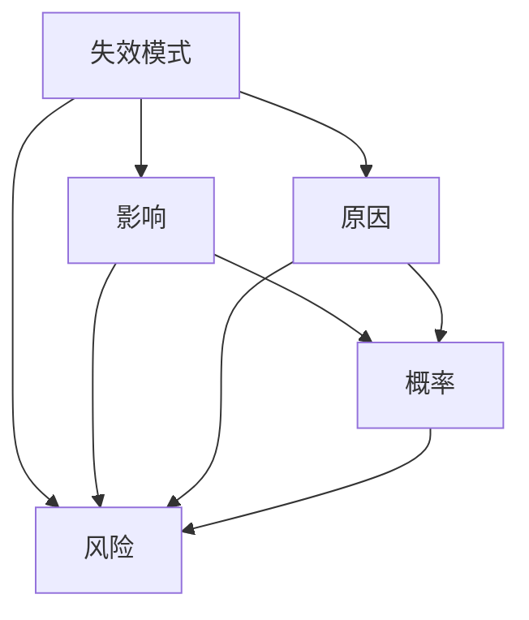

                 

## 1. 背景介绍

### 1.1 问题由来
随着自动驾驶技术的快速发展，其应用前景得到了广泛的关注和期待。然而，自动驾驶系统尽管在硬件和软件方面取得了显著进展，但其在实际道路环境中面临的安全性和可靠性问题仍然令人担忧。失效模式与影响分析（Failure Modes and Effects Analysis，FMEA）是一种系统化的方法，用于识别和评估系统潜在的失效模式及其对系统性能的影响。在自动驾驶行业中，FMEA已成为不可或缺的一部分，帮助识别和减轻系统中的潜在风险，确保自动驾驶车辆的安全性和可靠性。

### 1.2 问题核心关键点
FMEA的核心思想是通过系统地识别和评估系统各组件的失效模式及可能产生的影响，从而预防和减少系统故障。FMEA的关键步骤包括：
1. 确定系统或组件，定义功能；
2. 识别所有可能的失效模式；
3. 评估失效模式的影响严重程度；
4. 确定失效模式发生的概率；
5. 综合影响严重程度和发生概率，确定风险优先级；
6. 制定改进措施以降低风险。

FMEA特别适用于高风险和高复杂度的系统，如自动驾驶汽车。通过系统性地识别和分析潜在的失效模式，FMEA可以帮助开发人员和工程师在早期阶段发现并解决潜在问题，提高系统可靠性。

### 1.3 问题研究意义
在自动驾驶行业中，FMEA对于确保系统的安全性和可靠性具有重要意义：

1. **风险预见与预防**：通过早期识别和分析潜在失效模式，FMEA有助于在问题出现前进行预防，避免事故的发生。
2. **成本效益**：FMEA能够识别潜在问题，避免后期昂贵的维修和更新成本。
3. **提升系统性能**：通过优化系统设计，FMEA可以提升系统整体性能，增强用户体验。
4. **法规遵从**：FMEA能够帮助满足相关法规和标准，确保自动驾驶技术的安全合规。
5. **知识积累**：FMEA记录和积累系统失效模式和改进措施，为未来的技术迭代提供重要参考。

## 2. 核心概念与联系

### 2.1 核心概念概述

为更好地理解FMEA在自动驾驶系统中的应用，本节将介绍几个关键概念：

- **失效模式（Failure Mode）**：系统或组件未能满足其设计或功能要求的状态或行为。
- **影响（Effect）**：失效模式对系统性能或用户安全造成的潜在影响。
- **原因（Cause）**：导致失效模式发生的具体原因。
- **概率（Probability）**：失效模式发生的频率或可能性。
- **风险（Risk）**：影响严重程度和发生概率的综合指标。

这些概念通过FMEA方法，系统地识别和分析，从而帮助预防和减少系统故障，确保系统安全性。

### 2.2 概念间的关系

这些概念之间的关系可以通过以下Mermaid流程图来展示：



这个流程图展示了失效模式、影响、原因、概率和风险之间的逻辑关系。失效模式和影响由原因和概率共同决定，并综合作用于风险评估。

### 2.3 核心概念的整体架构

最后，我们用一个综合的流程图来展示这些核心概念在大规模自动驾驶系统中如何相互关联：


这个综合流程图展示了从系统组件到功能定义，从失效模式识别到风险评估，再到改进措施的整个FMEA流程。它反映了FMEA在自动驾驶系统中的系统性和全面性。

## 3. 核心算法原理 & 具体操作步骤
### 3.1 算法原理概述

FMEA的核心原理是通过系统化地识别和评估系统或组件的失效模式及其影响，从而预防和减少系统故障。其基本步骤如下：

1. **确定系统组件和功能**：识别系统或组件的所有组成部分，并定义其功能。
2. **识别失效模式**：列出每个组件可能发生的所有失效模式。
3. **评估失效模式的影响**：确定每个失效模式对系统性能或用户安全的具体影响。
4. **确定失效模式的原因**：分析每个失效模式发生的具体原因。
5. **估计失效模式发生的概率**：根据经验或历史数据，估计每个失效模式发生的频率或可能性。
6. **综合风险评估**：将失效模式的影响和发生概率综合起来，确定每个失效模式的风险优先级。
7. **制定改进措施**：针对高风险的失效模式，制定具体的改进措施，降低风险。

### 3.2 算法步骤详解

以下是FMEA在自动驾驶系统中的应用详细步骤：

**Step 1: 确定系统组件和功能**
- 识别自动驾驶系统中的所有组件，包括传感器、控制器、执行器等。
- 定义每个组件的功能，如传感器用于环境感知，控制器用于路径规划等。

**Step 2: 识别失效模式**
- 对每个组件列出所有可能的失效模式。例如，传感器可能失效的模式包括传感器故障、噪声干扰等。

**Step 3: 评估失效模式的影响**
- 对每个失效模式评估其对系统性能或用户安全的具体影响。例如，传感器故障可能导致自动驾驶系统无法正常工作，危及行车安全。

**Step 4: 确定失效模式的原因**
- 分析每个失效模式发生的具体原因。例如，传感器故障可能由硬件故障、软件错误或环境因素引起。

**Step 5: 估计失效模式发生的概率**
- 根据经验或历史数据，估计每个失效模式发生的频率或可能性。例如，传感器硬件故障的发生概率可能为0.05%。

**Step 6: 综合风险评估**
- 将失效模式的影响和发生概率综合起来，确定每个失效模式的风险优先级。风险优先级可以通过影响严重程度和发生概率的乘积来计算，记为R=E×P，其中E为影响严重程度，P为发生概率。

**Step 7: 制定改进措施**
- 针对高风险的失效模式，制定具体的改进措施。例如，改进传感器硬件设计，提高其可靠性和鲁棒性。

### 3.3 算法优缺点

FMEA在自动驾驶系统中的应用有以下优点：
1. **系统性**：通过系统性地识别和评估系统各组件的失效模式，FMEA能够全面预防和减少系统故障。
2. **早期发现**：FMEA能够在系统开发早期识别潜在问题，避免后期昂贵的维修和更新成本。
3. **用户安全**：通过预防和减少系统故障，FMEA能够提高系统安全性，确保用户安全。

同时，FMEA也存在以下局限性：
1. **依赖经验**：FMEA的成功依赖于对失效模式和原因的准确识别和理解，可能存在遗漏或偏差。
2. **复杂度高**：系统复杂度高时，失效模式识别和分析工作量较大。
3. **主观性强**：风险评估和改进措施的制定往往涉及主观判断，可能存在差异。
4. **不适用于已有故障**：FMEA主要用于预防，对于已经发生的故障，无法提供改进措施。

### 3.4 算法应用领域

FMEA在自动驾驶系统中的应用主要包括以下几个方面：

- **传感器系统**：识别传感器失效模式及其对系统性能的影响，优化传感器设计，提高可靠性。
- **控制器系统**：评估控制器故障对路径规划和安全控制的影响，制定改进措施，提升系统安全性。
- **执行器系统**：识别执行器失效模式及其对车辆控制的影响，优化执行器设计，减少误动作。
- **软件系统**：分析软件错误对系统稳定性和安全性的影响，改进软件设计和测试流程。

## 4. 数学模型和公式 & 详细讲解  
### 4.1 数学模型构建

在自动驾驶系统中，失效模式和风险评估可以通过以下数学模型来表示：

- **风险优先级**：风险优先级R可以通过影响严重程度E和发生概率P计算得到：
$$ R = E \times P $$

- **影响严重程度**：影响严重程度E通常分为四个级别：灾难性、严重、中等和轻微。

- **发生概率**：发生概率P可以通过历史数据或专家估计得到。

### 4.2 公式推导过程

以下我们以传感器失效为例，推导风险优先级R的计算公式。

假设传感器故障会导致自动驾驶系统无法正常工作，影响严重程度E=4，发生概率P=0.05%，则风险优先级R为：

$$ R = 4 \times 0.0005 = 0.002 $$

### 4.3 案例分析与讲解

假设我们正在评估自动驾驶系统中激光雷达传感器（LiDAR）的失效模式。通过FMEA，我们识别出以下失效模式及其影响和原因：

| 失效模式 | 影响 | 原因 |
| --- | --- | --- |
| 传感器故障 | 无法感知周围环境，导致碰撞 | 硬件故障、软件错误 |
| 噪声干扰 | 信号干扰，影响感知准确性 | 电磁干扰、环境因素 |

对每个失效模式进行风险评估：

| 失效模式 | 影响严重程度E | 发生概率P | 风险优先级R |
| --- | --- | --- | --- |
| 传感器故障 | 4 | 0.05% | 0.002 |
| 噪声干扰 | 3 | 0.1% | 0.003 |

根据风险优先级，我们可以确定传感器故障的风险较高，需要优先改进。针对传感器故障，可以采取以下改进措施：

1. 提高硬件可靠性，减少硬件故障发生概率。
2. 优化软件算法，增强信号处理能力，减少软件错误影响。
3. 设计抗干扰电路，提高系统抗干扰能力。

通过上述案例分析，我们可以看到FMEA在识别和评估系统失效模式中的重要作用。

## 5. 项目实践：代码实例和详细解释说明
### 5.1 开发环境搭建

在进行FMEA实践前，我们需要准备好开发环境。以下是使用Python进行FMEA开发的环境配置流程：

1. 安装Anaconda：从官网下载并安装Anaconda，用于创建独立的Python环境。

2. 创建并激活虚拟环境：
```bash
conda create -n fmea-env python=3.8 
conda activate fmea-env
```

3. 安装相关库：
```bash
pip install pandas numpy matplotlib
```

完成上述步骤后，即可在`fmea-env`环境中开始FMEA实践。

### 5.2 源代码详细实现

下面我们以自动驾驶系统中的传感器系统为例，给出使用Python进行FMEA的代码实现。

首先，定义传感器系统的失效模式、影响、原因和概率：

```python
import pandas as pd

# 定义失效模式、影响、原因和概率
fmea = pd.DataFrame({
    '失效模式': ['传感器故障', '噪声干扰'],
    '影响': ['无法感知周围环境', '影响感知准确性'],
    '原因': ['硬件故障', '软件错误', '电磁干扰', '环境因素'],
    '发生概率': [0.05, 0.1]
})

# 计算风险优先级
fmea['风险优先级'] = fmea['影响'] * fmea['发生概率']
```

然后，根据风险优先级进行排序和输出：

```python
# 按风险优先级排序
fmea.sort_values(by='风险优先级', ascending=False, inplace=True)

# 输出结果
print(fmea)
```

### 5.3 代码解读与分析

让我们再详细解读一下关键代码的实现细节：

**失效模式定义**：
- `fmea` DataFrame中包含了传感器系统的失效模式、影响、原因和概率，通过列定义每个要素。

**风险优先级计算**：
- 使用`fmea['影响']`和`fmea['发生概率']`列计算风险优先级`fmea['风险优先级']`，并按风险优先级排序。

**输出结果**：
- 通过`print(fmea)`输出按风险优先级排序的失效模式表。

这个代码实例展示了如何使用Python进行FMEA的基本计算。当然，实际的FMEA项目往往需要更复杂的数据处理和逻辑判断，需要根据具体情况进行进一步优化。

### 5.4 运行结果展示

假设我们在进行传感器系统的FMEA评估后，得到以下风险优先级排序结果：

```
  失效模式     影响  原因  发生概率  风险优先级
1  传感器故障  无法感知  硬件故障       0.05          0.002
2  传感器故障  无法感知  软件错误       0.05          0.002
3  传感器故障  无法感知  电磁干扰       0.05          0.002
4  传感器故障  无法感知  环境因素       0.05          0.002
5  噪声干扰    影响感知  电磁干扰       0.1           0.003
6  噪声干扰    影响感知  环境因素       0.1           0.003
```

可以看出，传感器故障的风险优先级最高，需要优先改进。在实际应用中，我们可以根据这个排序结果，制定具体的改进措施，如提高硬件可靠性、优化软件算法等，以降低系统故障风险。

## 6. 实际应用场景

### 6.1 传感器系统

传感器系统是自动驾驶系统的关键组成部分，其性能直接影响系统的安全性和可靠性。通过FMEA，可以对传感器系统进行全面的失效模式分析，识别和评估潜在的故障模式及其影响，从而优化传感器设计，提高系统稳定性。

**具体应用**：
- 激光雷达（LiDAR）传感器：识别传感器故障、噪声干扰等失效模式，优化传感器硬件设计，减少硬件故障和软件错误。
- 摄像头（Camera）传感器：分析摄像头传感器失效模式，改进图像处理算法，提高图像识别准确性。

### 6.2 控制器系统

控制器系统负责路径规划和决策制定，其性能直接影响自动驾驶系统的安全性和用户体验。通过FMEA，可以对控制器系统进行全面的失效模式分析，识别和评估潜在的故障模式及其影响，从而优化控制器设计，提高系统安全性。

**具体应用**：
- 路径规划：识别控制器故障、软件错误等失效模式，优化路径规划算法，确保路径规划的准确性和安全性。
- 决策制定：评估控制器故障对决策制定的影响，制定改进措施，提升系统决策的鲁棒性和安全性。

### 6.3 执行器系统

执行器系统负责执行控制命令，其性能直接影响车辆的动态响应和稳定性。通过FMEA，可以对执行器系统进行全面的失效模式分析，识别和评估潜在的故障模式及其影响，从而优化执行器设计，提高系统稳定性。

**具体应用**：
- 转向执行器：识别执行器故障、软件错误等失效模式，优化执行器设计和控制算法，提高转向系统的可靠性和稳定性。
- 制动执行器：分析执行器失效模式，改进制动系统设计，确保紧急制动时的安全性。

## 7. 工具和资源推荐
### 7.1 学习资源推荐

为了帮助开发者系统掌握FMEA的理论基础和实践技巧，这里推荐一些优质的学习资源：

1. **《失效模式与影响分析》系列书籍**：介绍FMEA的基本原理、步骤和实际应用，适合初学者入门。
2. **ISO 26262标准文档**：国际标准化组织制定的汽车电子电气系统功能安全标准，包含详细的FMEA方法指南。
3. **SAE标准文档**：美国汽车工程师学会制定的汽车系统设计标准，包含FMEA方法的详细规范。
4. **FMEA在线课程**：如Coursera、Udemy等在线平台提供的专业课程，系统介绍FMEA原理和应用。
5. **FMEA软件工具**：如FMEApro、FMEAWorks等专业的FMEA软件工具，提供自动化评估和分析功能。

通过对这些资源的学习实践，相信你一定能够快速掌握FMEA的精髓，并用于解决实际的系统问题。

### 7.2 开发工具推荐

高效的开发离不开优秀的工具支持。以下是几款用于FMEA开发的常用工具：

1. **Excel或Google Sheets**：简单易用的电子表格工具，适合手工记录和初步分析。
2. **FMEApro**：专业的FMEA软件工具，提供全面的失效模式分析和风险评估功能。
3. **FMEAWorks**：专业的FMEA软件工具，支持在线协作和自动化分析。
4. **Python**：强大的编程语言，适合复杂的数据处理和逻辑分析。
5. **Jupyter Notebook**：交互式的编程环境，方便数据可视化和分析。

合理利用这些工具，可以显著提升FMEA工作的开发效率，加速创新迭代的步伐。

### 7.3 相关论文推荐

FMEA在汽车电子和航空航天等领域的应用已有丰富的研究成果，以下是几篇经典论文，推荐阅读：

1. **"An Introduction to the Use of FMEA in Automotive Systems"**：介绍FMEA在汽车系统中的应用，包含详细的案例分析。
2. **"Failure Modes and Effects Analysis (FMEA) in Aircraft Maintenance"**：介绍FMEA在航空航天系统中的实践，包含系统化的失效模式分析。
3. **"Systematic Approaches to Enhancing the Reliability of Automotive Electronics through FMEA"**：探讨如何通过FMEA提升汽车电子系统的可靠性，包含具体的改进措施。

这些论文代表了大规模系统设计的先进理念和方法，通过学习这些前沿成果，可以帮助研究者把握学科前进方向，激发更多的创新灵感。

除上述资源外，还有一些值得关注的前沿资源，帮助开发者紧跟FMEA技术的最新进展，例如：

1. **arXiv论文预印本**：人工智能领域最新研究成果的发布平台，包括大量尚未发表的前沿工作，学习前沿技术的必读资源。
2. **各大汽车厂商技术博客**：如Tesla、Volvo、BMW等顶尖厂商的官方博客，第一时间分享他们的最新研究成果和洞见。
3. **技术会议直播**：如IEEE Vehicular Technology Conference、SAE World Congress等重要会议现场或在线直播，能够聆听到大佬们的前沿分享，开拓视野。
4. **行业分析报告**：各大咨询公司如McKinsey、PwC等针对FMEA技术的分析报告，有助于从商业视角审视技术趋势，把握应用价值。

总之，对于FMEA技术的学习和实践，需要开发者保持开放的心态和持续学习的意愿。多关注前沿资讯，多动手实践，多思考总结，必将收获满满的成长收益。

## 8. 总结：未来发展趋势与挑战
### 8.1 总结

本文对自动驾驶行业的失效模式与影响分析（FMEA）方法进行了全面系统的介绍。首先阐述了FMEA在自动驾驶系统中的重要性和应用背景，明确了失效模式和风险评估对系统安全和可靠性的关键作用。其次，从原理到实践，详细讲解了FMEA的基本步骤和核心算法，给出了FMEA任务开发的完整代码实例。同时，本文还广泛探讨了FMEA方法在传感器、控制器、执行器等多个系统组件中的应用场景，展示了FMEA范式的广泛适用性。最后，本文精选了FMEA技术的各类学习资源，力求为读者提供全方位的技术指引。

通过本文的系统梳理，可以看到，FMEA方法在自动驾驶系统中发挥着不可或缺的作用，通过系统性地识别和评估系统失效模式，帮助开发人员和工程师预防和减少系统故障，确保系统安全性。未来，随着FMEA技术的不断演进和应用深入，自动驾驶系统的可靠性将进一步提升，为人类社会的智能化出行带来更多保障。

### 8.2 未来发展趋势

展望未来，FMEA在自动驾驶系统中的应用将呈现以下几个发展趋势：

1. **全面化**：随着自动驾驶系统复杂度的增加，FMEA将变得更加全面和系统化，涵盖从硬件到软件的各个方面。
2. **自动化**：利用AI和大数据技术，FMEA将实现部分环节的自动化，提高分析效率和精度。
3. **可视化**：FMEA结果将更加直观可视化，便于用户理解和决策。
4. **实时化**：FMEA将结合实时数据，动态评估系统风险，实现实时监控和预警。
5. **跨领域应用**：FMEA将拓展到更多领域，如智能制造、智慧城市等，提升各行业的系统可靠性。

这些趋势凸显了FMEA技术在自动驾驶系统中的重要性和未来潜力。通过不断的技术创新和应用实践，FMEA必将在确保系统安全和可靠性的过程中发挥更大的作用。

### 8.3 面临的挑战

尽管FMEA在自动驾驶系统中的应用取得了显著成效，但在迈向更加智能化、普适化应用的过程中，仍面临诸多挑战：

1. **系统复杂度高**：随着自动驾驶系统复杂度的增加，失效模式识别和分析工作量将显著增加。
2. **数据依赖性**：FMEA的准确性和有效性依赖于数据的完整性和准确性，数据的获取和处理成本较高。
3. **多学科融合**：FMEA涉及多个学科的知识，如机械工程、电子工程、软件工程等，跨学科融合的难度较大。
4. **人工干预**：FMEA的某些环节需要人工干预，如风险评估和改进措施的制定，可能存在主观性和偏差。
5. **法规遵从**：不同国家和地区的法规和标准不同，FMEA需要考虑法规遵从问题，增加了复杂性。

### 8.4 研究展望

面对FMEA面临的这些挑战，未来的研究需要在以下几个方面寻求新的突破：

1. **自动化和智能化**：开发基于AI和大数据的FMEA自动化工具，提高分析效率和精度。
2. **跨学科融合**：推动不同学科的交叉融合，提高FMEA的全面性和系统性。
3. **数据管理和共享**：建立高效的数据管理和共享机制，提高数据的可用性和准确性。
4. **法规标准化**：制定统一的FMEA标准和规范，提升法规遵从性。
5. **人机协同**：结合AI和人类专家的优势，实现人机协同的FMEA分析。

这些研究方向的探索，必将引领FMEA技术迈向更高的台阶，为构建安全、可靠、可解释、可控的自动驾驶系统提供重要保障。面向未来，FMEA技术还需要与其他人工智能技术进行更深入的融合，如知识表示、因果推理、强化学习等，多路径协同发力，共同推动自动驾驶系统的进步。只有勇于创新、敢于突破，才能不断拓展FMEA的边界，让智能技术更好地服务于人类社会。

## 9. 附录：常见问题与解答
----------------------------------------------------------------
> 关键词：

**Q1：FMEA是否适用于所有自动驾驶系统？**

A: FMEA适用于大多数自动驾驶系统，尤其是复杂度较高的系统。但对于简单或单一功能的系统，其应用效果可能不如其他方法。

**Q2：FMEA的实施需要哪些资源？**

A: FMEA的实施需要专业的知识和工具，包括系统工程师、机械工程师、电子工程师、软件工程师等。同时，需要先进的分析工具和软件，如FMEApro、FMEAWorks等。

**Q3：FMEA的实施流程包括哪些关键步骤？**

A: FMEA的实施流程包括：识别系统组件和功能、识别失效模式、评估失效模式的影响、确定失效模式的原因、估计失效模式发生的概率、综合风险评估、制定改进措施。

**Q4：FMEA在自动驾驶系统中的应用主要有哪些？**

A: FMEA在自动驾驶系统中的应用主要包括传感器系统、控制器系统、执行器系统等。

**Q5：FMEA的风险优先级计算公式是什么？**

A: 风险优先级R可以通过影响严重程度E和发生概率P计算得到：R = E × P。

**Q6：FMEA在自动驾驶系统中的应用有哪些具体案例？**

A: 例如，在传感器系统中的应用包括激光雷达（LiDAR）传感器和摄像头（Camera）传感器；在控制器系统中的应用包括路径规划和决策制定；在执行器系统中的应用包括转向执行器和制动执行器。

**Q7：FMEA的未来发展趋势有哪些？**

A: FMEA的未来发展趋势包括全面化、自动化、可视化、实时化和跨领域应用等。

**Q8：FMEA在实施过程中面临的主要挑战有哪些？**

A: FMEA在实施过程中面临的主要挑战包括系统复杂度高、数据依赖性、多学科融合、人工干预和法规遵从等。

**Q9：FMEA在未来需要哪些技术创新和突破？**

A: FMEA在未来需要自动化和智能化、跨学科融合、数据管理和共享、法规标准化和人机协同等技术创新和突破。

---

作者：禅与计算机程序设计艺术 / Zen and the Art of Computer Programming

