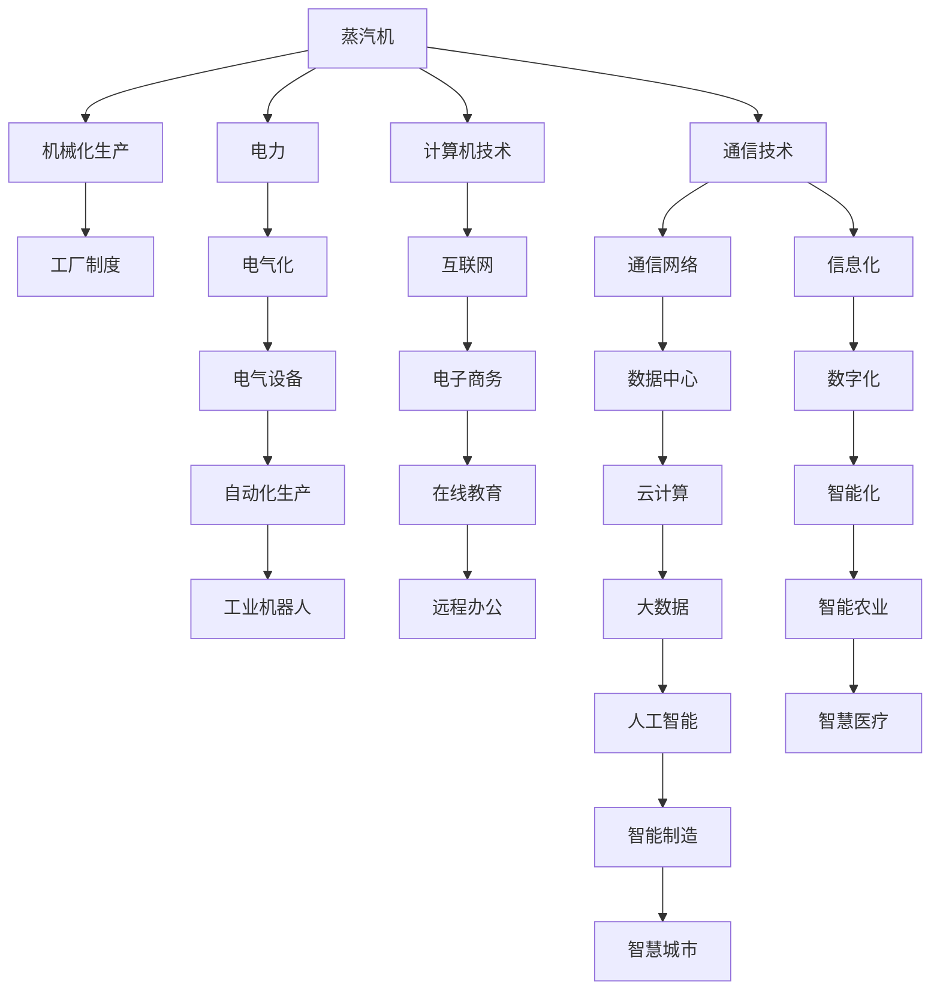

                 

## 1. 背景介绍

### 1.1 问题由来
蒸汽机、电力和信息技术（IT）是工业革命以来人类社会发展的三大动力引擎。它们先后引领了第一次工业革命、第二次工业革命和信息革命，极大地推动了社会生产力的进步，改变了人类的生活方式和工作方式。本文将探讨这些技术在经济领域的影响，分析其带来的经济效益和问题，展望其未来的发展趋势。

### 1.2 问题核心关键点
蒸汽机、电力和信息技术对经济的影响涉及多个层面，包括生产力的提升、产业结构的变革、劳动就业的改变、市场竞争的加剧等。理解这些技术的经济影响，有助于把握其对社会经济发展的深远作用，并预见未来可能的挑战和机遇。

### 1.3 问题研究意义
研究这些技术的经济影响，对于理解现代经济增长的源泉、制定经济发展策略、以及推动科技创新和产业升级具有重要意义。同时，通过分析其正负面效应，可以为政策的制定提供科学依据，指导企业在技术应用中的战略选择。

## 2. 核心概念与联系

### 2.1 核心概念概述

#### 2.1.1 蒸汽机
蒸汽机是一种将热能转换为机械能的机械设备，其基本原理是通过加热水产生蒸汽，再利用蒸汽推动活塞或涡轮机运转。蒸汽机广泛应用于早期工厂、矿井、船舶等领域，极大地提升了机械化生产能力，是第一次工业革命的象征。

#### 2.1.2 电力
电力是一种通过电气网络传输和分配的能源形式。电力的广泛应用使得机械、电气、电子等领域得到飞速发展，催生了电气化时代。电力技术的应用，不仅改变了工业生产方式，还极大地改变了人们的生活方式。

#### 2.1.3 信息技术（IT）
信息技术包括计算机技术、互联网技术、通信技术等，通过数字化、网络化、智能化等手段，极大地提高了信息处理和传输的效率，改变了经济活动的方式和模式。信息技术是信息革命的核心驱动力，引领了数字经济的发展。

### 2.2 概念间的关系

这些技术的核心概念之间存在紧密联系，可以通过以下Mermaid流程图来展示：



这个流程图展示了蒸汽机、电力和信息技术之间的联系和影响：

1. 蒸汽机推动了机械化生产，进而催生了工厂制度。
2. 电力使得电气化成为可能，进一步推动了自动化生产。
3. 通信技术的发展，加速了信息化和数字化进程，催生了智能制造和智慧城市。
4. 计算机技术和互联网的应用，引领了电子商务、在线教育、远程办公等新经济形态。
5. 大数据和人工智能等技术，进一步推动了各行业的智能化转型。

### 2.3 核心概念的整体架构

最后，我们用一个综合的流程图来展示这些核心概念在大规模技术变革中的整体架构：

```mermaid
graph TB
    A[蒸汽机] --> B[机械化生产]
    B --> C[工厂制度]
    C --> D[产业化]
    D --> E[工业化]
    E --> F[经济全球化]
    A --> G[电力]
    G --> H[电气化]
    H --> I[自动化]
    I --> J[智能制造]
    A --> K[通信技术]
    K --> L[信息化]
    L --> M[互联网]
    M --> N[电子商务]
    N --> O[数字经济]
    O --> P[在线经济]
    P --> Q[大数据]
    Q --> R[人工智能]
    R --> S[智慧农业]
    S --> T[智慧医疗]
    T --> U[智能交通]
    U --> V[智能物流]
    L --> W[物联网]
    W --> X[智慧城市]
    X --> Y[产业升级]
    A --> Z[计算机技术]
    Z --> AA[软件工程]
    AA --> BB[云计算]
    BB --> CC[数字平台]
    CC --> DD[数字服务]
    DD --> EE[互联网金融]
    EE --> FF[金融科技]
    R --> GG[区块链]
    GG --> HH[加密货币]
    P --> II[社交媒体]
    II --> JJ[用户数据]
    JJ -->KK[用户行为分析]
    KK --> LL[精准营销]
    V --> MM[智能物流]
    MM --> NN[供应链优化]
    LL -->OO[产品创新]
    OO --> PP[个性化定制]
    R -->QQ[智慧教育]
    QQ -->RR[在线教育]
    RR --> SS[在线培训]
    SS --> TT[远程协作]
    B --> UU[就业结构变化]
    UU --> VV[技能要求提升]
    VV --> WW[劳动分工细化]
    WW --> XX[知识经济崛起]
    C --> YY[经济增长]
    YY --> ZZ[消费模式变革]
    ZZ --> AAA[市场竞争加剧]
    AAA --> AAB[企业竞争力提升]
    AA --> ABB[产业创新]
    ABB --> AAC[新产业形成]
    AAC --> AAD[创新驱动]
    AAD --> AAE[可持续发展]
    C --> AAF[全球化供应链]
    AAF --> AAG[供应链优化]
    AAG --> AAH[成本降低]
    AAH --> AAI[经济效益提升]
    A --> AAJ[信息化与自动化]
    AAJ --> AAK[生产效率提升]
    AAK --> AAL[产品质量提升]
    AAL --> AAM[市场需求扩大]
    AAM --> AAN[市场扩展]
    A --> AAO[云计算与大数据]
    AAO --> AAP[数据驱动决策]
    AAP --> AAR[业务模式创新]
    AAR --> AAS[增值服务创新]
    K --> AAT[网络安全]
    AAT --> AAU[数据安全]
    AAU --> AAV[隐私保护]
    AAV --> AAW[法律法规]
    R --> ABX[人工智能伦理]
    ABX --> ABy[道德规范]
    ABx --> ABz[隐私保护]
    ABz --> ABw[法律法规]
    ABw --> ABv[公平公正]
    ABv --> ABu[数据安全]
    AA --> ABt[区块链技术]
    ABt --> ABs[智能合约]
    ABs --> ABR[去中心化]
    ABr --> ABR[去中心化]
    ABr --> ABq[智能合约]
    ABq --> ABR[去中心化]
    A --> ABp[信息革命]
    ABp --> ABn[数字化转型]
    ABn --> ABm[数字政府]
    ABm --> ABl[智慧治理]
    ABl --> ABl[智能监控]
    ABl --> ABk[智慧城市]
    A --> ABj[智能化交通]
    ABj --> ABI[智能物流]
    ABI --> ABh[供应链优化]
    ABh --> ABg[效率提升]
    ABg --> ABf[企业转型]
    ABf --> ABd[产业融合]
    ABd --> ABc[产业协同]
    ABc --> ABa[智能制造]
    ABa --> ABi[智能农业]
    ABi --> ABg[智慧农业]
    ABg --> ABf[农机智能化]
    ABf --> ABe[智能温室]
    ABe --> ABD[智能灌溉]
    ABD --> ABc[智能养殖]
    ABc --> ABA[智能监控]
    ABA --> ABz[智慧养殖]
    ABz --> ABy[智能诊断]
    ABy --> ABx[智能监测]
    ABx --> ABy[智能施肥]
    ABy --> ABw[智能播种]
    ABw --> ABv[智能育种]
    ABv --> ABu[智能加工]
    ABu --> ABt[智能包装]
    ABt --> ABs[智能物流]
    ABs --> ABr[智能仓储]
    ABr --> ABq[智能质检]
    ABq --> ABp[智能检测]
    ABp --> ABn[智能工厂]
    ABn --> ABm[智能生产]
    ABm --> ABl[智能物流]
    ABl --> ABk[智能仓储]
    ABk --> ABj[智能质检]
    ABj --> ABi[智能设备]
    ABi --> ABh[智能生产]
    ABh --> ABg[智能组装]
    ABg --> ABf[智能检测]
    ABf --> ABd[智能设备]
    ABd --> ABc[智能生产]
    ABc --> ABa[智能物流]
    ABa --> ABA[智能仓储]
    ABa --> ABz[智能质检]
    ABz --> ABy[智能设备]
    ABy --> ABx[智能检测]
    ABx --> ABy[智能生产]
    ABy --> ABw[智能组装]
    ABw --> ABv[智能设备]
    ABv --> ABu[智能检测]
    ABu --> ABt[智能设备]
    ABt --> ABs[智能组装]
    ABs --> ABr[智能设备]
    ABr --> ABq[智能检测]
    ABq --> ABp[智能设备]
    ABp --> ABn[智能组装]
    ABn --> ABm[智能设备]
    ABm --> ABl[智能设备]
    ABl --> ABk[智能检测]
    ABk --> ABj[智能设备]
    ABj --> ABi[智能设备]
    ABi --> ABh[智能组装]
    ABh --> ABg[智能设备]
    ABg --> ABf[智能设备]
    ABf --> ABd[智能检测]
    ABd --> ABc[智能设备]
    ABc --> ABa[智能组装]
    ABa --> ABA[智能设备]
    ABa --> ABz[智能检测]
    ABz --> ABy[智能设备]
    ABy --> ABx[智能设备]
    ABx --> ABy[智能组装]
    ABy --> ABw[智能设备]
    ABw --> ABv[智能检测]
    ABv --> ABu[智能设备]
    ABu --> ABt[智能组装]
    ABt --> ABs[智能检测]
    ABs --> ABr[智能设备]
    ABr --> ABq[智能设备]
    ABq --> ABp[智能检测]
    ABp --> ABn[智能设备]
    ABn --> ABm[智能检测]
    ABm --> ABl[智能设备]
    ABl --> ABk[智能设备]
    ABk --> ABj[智能检测]
    ABj --> ABi[智能设备]
    ABi --> ABh[智能组装]
    ABh --> ABg[智能设备]
    ABg --> ABf[智能设备]
    ABf --> ABd[智能检测]
    ABd --> ABc[智能设备]
    ABc --> ABa[智能组装]
    ABa --> ABA[智能设备]
    ABa --> ABz[智能检测]
    ABz --> ABy[智能设备]
    ABy --> ABx[智能检测]
    ABx --> ABy[智能设备]
    ABy --> ABw[智能组装]
    ABw --> ABv[智能设备]
    ABv --> ABu[智能检测]
    ABu --> ABt[智能组装]
    ABt --> ABs[智能设备]
    ABs --> ABr[智能检测]
    ABr --> ABq[智能设备]
    ABq --> ABp[智能设备]
    ABp --> ABn[智能检测]
    ABn --> ABm[智能设备]
    ABm --> ABl[智能检测]
    ABl --> ABk[智能设备]
    ABk --> ABj[智能设备]
    ABj --> ABi[智能组装]
    ABi --> ABh[智能设备]
    ABh --> ABg[智能检测]
    ABg --> ABf[智能设备]
    ABf --> ABd[智能设备]
    ABd --> ABc[智能组装]
    ABc --> ABa[智能设备]
    ABa --> ABA[智能检测]
    ABa --> ABz[智能设备]
    ABz --> ABy[智能组装]
    ABy --> ABx[智能设备]
    ABx --> ABy[智能检测]
    ABy --> ABw[智能设备]
    ABw --> ABv[智能组装]
    ABv --> ABu[智能设备]
    ABu --> ABt[智能检测]
    ABt --> ABs[智能设备]
    ABs --> ABr[智能组装]
    ABr --> ABq[智能设备]
    ABq --> ABp[智能设备]
    ABp --> ABn[智能检测]
    ABn --> ABm[智能设备]
    ABm --> ABl[智能设备]
    ABl --> ABk[智能检测]
    ABk --> ABj[智能设备]
    ABj --> ABi[智能设备]
    ABi --> ABh[智能组装]
    ABh --> ABg[智能设备]
    ABg --> ABf[智能检测]
    ABf --> ABd[智能设备]
    ABd --> ABc[智能组装]
    ABc --> ABa[智能设备]
    ABa --> ABA[智能设备]
    ABa --> ABz[智能检测]
    ABz --> ABy[智能组装]
    ABy --> ABx[智能设备]
    ABx --> ABy[智能检测]
    ABy --> ABw[智能设备]
    ABw --> ABv[智能组装]
    ABv --> ABu[智能检测]
    ABu --> ABt[智能设备]
    ABt --> ABs[智能检测]
    ABs --> ABr[智能设备]
    ABr --> ABq[智能设备]
    ABq --> ABp[智能设备]
    ABp --> ABn[智能检测]
    ABn --> ABm[智能设备]
    ABm --> ABl[智能设备]
    ABl --> ABk[智能检测]
    ABk --> ABj[智能设备]
    ABj --> ABi[智能设备]
    ABi --> ABh[智能组装]
    ABh --> ABg[智能设备]
    ABg --> ABf[智能设备]
    ABf --> ABd[智能检测]
    ABd --> ABc[智能设备]
    ABc --> ABa[智能组装]
    ABa --> ABA[智能设备]
    ABa --> ABz[智能检测]
    ABz --> ABy[智能设备]
    ABy --> ABx[智能检测]
    ABx --> ABy[智能设备]
    ABy --> ABw[智能组装]
    ABw --> ABv[智能设备]
    ABv --> ABu[智能检测]
    ABu --> ABt[智能设备]
    ABt --> ABs[智能检测]
    ABs --> ABr[智能设备]
    ABr --> ABq[智能设备]
    ABq --> ABp[智能设备]
    ABp --> ABn[智能检测]
    ABn --> ABm[智能设备]
    ABm --> ABl[智能设备]
    ABl --> ABk[智能检测]
    ABk --> ABj[智能设备]
    ABj --> ABi[智能设备]
    ABi --> ABh[智能组装]
    ABh --> ABg[智能设备]
    ABg --> ABf[智能设备]
    ABf --> ABd[智能检测]
    ABd --> ABc[智能设备]
    ABc --> ABa[智能组装]
    ABa --> ABA[智能设备]
    ABa --> ABz[智能检测]
    ABz --> ABy[智能设备]
    ABy --> ABx[智能检测]
    ABx --> ABy[智能设备]
    ABy --> ABw[智能组装]
    ABw --> ABv[智能设备]
    ABv --> ABu[智能检测]
    ABu --> ABt[智能设备]
    ABt --> ABs[智能检测]
    ABs --> ABr[智能设备]
    ABr --> ABq[智能设备]
    ABq --> ABp[智能设备]
    ABp --> ABn[智能检测]
    ABn --> ABm[智能设备]
    ABm --> ABl[智能设备]
    ABl --> ABk[智能检测]
    ABk --> ABj[智能设备]
    ABj --> ABi[智能设备]
    ABi --> ABh[智能组装]
    ABh --> ABg[智能设备]
    ABg --> ABf[智能设备]
    ABf --> ABd[智能检测]
    ABd --> ABc[智能设备]
    ABc --> ABa[智能组装]
    ABa --> ABA[智能设备]
    ABa --> ABz[智能检测]
    ABz --> ABy[智能设备]
    ABy --> ABx[智能检测]
    ABx --> ABy[智能设备]
    ABy --> ABw[智能组装]
    ABw --> ABv[智能设备]
    ABv --> ABu[智能检测]
    ABu --> ABt[智能设备]
    ABt --> ABs[智能检测]
    ABs --> ABr[智能设备]
    ABr --> ABq[智能设备]
    ABq --> ABp[智能设备]
    ABp --> ABn[智能检测]
    ABn --> ABm[智能设备]
    ABm --> ABl[智能设备]
    ABl --> ABk[智能检测]
    ABk --> ABj[智能设备]
    ABj --> ABi[智能设备]
    ABi --> ABh[智能组装]
    ABh --> ABg[智能设备]
    ABg --> ABf[智能设备]
    ABf --> ABd[智能检测]
    ABd --> ABc[智能设备]
    ABc --> ABa[智能组装]
    ABa --> ABA[智能设备]
    ABa --> ABz[智能检测]
    ABz --> ABy[智能设备]
    ABy --> ABx[智能检测]
    ABx --> ABy[智能设备]
    ABy --> ABw[智能组装]
    ABw --> ABv[智能设备]
    ABv --> ABu[智能检测]
    ABu --> ABt[智能设备]
    ABt --> ABs[智能检测]
    ABs --> ABr[智能设备]
    ABr --> ABq[智能设备]
    ABq --> ABp[智能设备]
    ABp --> ABn[智能检测]
    ABn --> ABm[智能设备]
    ABm --> ABl[智能设备]
    ABl --> ABk[智能检测]
    ABk --> ABj[智能设备]
    ABj --> ABi[智能设备]
    ABi --> ABh[智能组装]
    ABh --> ABg[智能设备]
    ABg --> ABf[智能设备]
    ABf --> ABd[智能检测]
    ABd --> ABc[智能设备]
    ABc --> ABa[智能组装]
    ABa --> ABA[智能设备]
    ABa --> ABz[智能检测]
    ABz --> ABy[智能设备]
    ABy --> ABx[智能检测]
    ABx --> ABy[智能设备]
    ABy --> ABw[智能组装]
    ABw --> ABv[智能设备]
    ABv --> ABu[智能检测]
    ABu --> ABt[智能设备]
    ABt --> ABs[智能检测]
    ABs --> ABr[智能设备]
    ABr --> ABq[智能设备]
    ABq --> ABp[智能设备]
    ABp --> ABn[智能检测]
    ABn --> ABm[智能设备]
    ABm --> ABl[智能设备]
    ABl --> ABk[智能检测]
    ABk --> ABj[智能设备]
    ABj --> ABi[智能设备]
    ABi --> ABh[智能组装]
    ABh --> ABg[智能设备]
    ABg --> ABf[智能设备]
    ABf --> ABd[智能检测]
    ABd --> ABc[智能设备]
    ABc --> ABa[智能组装]
    ABa --> ABA[智能设备]
    ABa --> ABz[智能检测]
    ABz --> ABy[智能设备]
    ABy --> ABx[智能检测]
    ABx --> ABy[智能设备]
    ABy --> ABw[智能组装]
    ABw --> ABv[智能设备]
    ABv --> ABu[智能检测]
    ABu --> ABt[智能设备]
    ABt --> ABs[智能检测]
    ABs --> ABr[智能设备]
    ABr --> ABq[智能设备]
    ABq --> ABp[智能设备]
    ABp --> ABn[智能检测]
    ABn --> ABm[智能设备]
    ABm --> ABl[智能设备]
    ABl --> ABk[智能检测]
    ABk --> ABj[智能设备]
    ABj --> ABi[智能设备]
    ABi --> ABh[智能组装]
    ABh --> ABg[智能设备]
    ABg --> ABf[智能设备]
    ABf --> ABd[智能检测]
    ABd --> ABc[智能设备]
    ABc --> ABa[智能组装]
    ABa --> ABA[智能设备]
    ABa --> ABz[智能检测]
    ABz --> ABy[智能设备]
    ABy --> ABx[智能检测]
    ABx --> ABy[智能设备]
    ABy --> ABw[智能组装]
    ABw --> ABv[智能设备]
    ABv --> ABu[智能检测]
    ABu --> ABt[智能设备]
    ABt --> ABs[智能检测]
    ABs --> ABr[智能设备]
    ABr --> ABq[智能设备]
    ABq --> ABp[智能设备]
    ABp --> ABn[智能检测]
    ABn --> ABm[智能设备]
    ABm --> ABl[智能设备]
    ABl --> ABk[智能检测]
    ABk --> ABj[智能设备]
    ABj --> ABi[智能设备]
    ABi --> ABh[智能组装]
    ABh --> ABg[智能设备]
    ABg --> ABf[智能设备]
    ABf --> ABd[智能检测]
    ABd --> ABc[智能设备]
    ABc --> ABa[智能组装]
    ABa --> ABA[智能设备]
    ABa --> ABz[智能检测]
    ABz --> ABy[智能设备]
    ABy --> ABx[智能检测]
    ABx --> ABy[智能设备]
    ABy --> ABw[智能组装]
    ABw --> ABv[智能设备]
    ABv --> ABu[智能检测]
    ABu --> ABt[智能设备]
    ABt --> ABs[智能检测]
    ABs --> ABr[智能设备]
    ABr --> ABq[智能设备]
    ABq --> ABp[智能设备]
    ABp --> ABn[智能检测]
    ABn --> ABm[智能设备]
    ABm --> ABl[智能设备]
    ABl --> ABk[智能检测]
    ABk --> ABj[智能设备]
    ABj --> ABi[智能设备]
    ABi --> ABh[智能组装]
    ABh --> ABg[智能设备]
    ABg --> ABf[智能设备]
    ABf --> ABd[智能检测]
    ABd --> ABc[智能设备]
    ABc --> ABa[智能组装]
    ABa --> ABA[智能设备]
    ABa --> ABz[智能检测]
    ABz --> ABy[智能设备]
    ABy --> ABx[智能检测]
    ABx --> ABy[智能设备]
    ABy --> ABw[智能组装]
    ABw --> ABv[智能设备]
    ABv --> ABu[智能检测]
    ABu --> ABt[智能设备]
    ABt --> ABs[智能检测]
    ABs --> ABr[智能设备]
    ABr --> ABq[智能设备]
    ABq --> ABp[智能设备]
    ABp --> ABn[智能检测]
    ABn --> ABm[智能设备]
    ABm --> ABl[智能设备]
    ABl --> ABk[智能检测]
    ABk --> ABj[智能设备]
    ABj --> ABi[智能设备]
    ABi --> ABh[智能组装]
    ABh --> ABg[智能设备]
    ABg --> ABf[智能设备]
    ABf --> ABd[智能检测]
    ABd --> ABc[智能设备]
    ABc --> ABa[智能组装]
    ABa --> ABA[智能设备]
    ABa --> ABz[智能检测]
    ABz --> ABy[智能设备]
    ABy --> ABx[智能检测]
    ABx --> ABy[智能设备]
    ABy --> ABw[智能组装]
    ABw --> ABv[智能设备]
    ABv --> ABu[智能检测]
    ABu --> ABt[智能设备]
    ABt --> ABs[智能检测]
    ABs --> ABr[智能设备]
    ABr --> ABq[智能设备]
    ABq --> ABp[智能设备]
    ABp --> ABn[智能检测]
    ABn --> ABm[智能设备]
    ABm --> ABl[智能设备]
    ABl --> ABk[智能检测]
    ABk --> ABj[智能设备]
    ABj --> ABi[智能设备]
    ABi --> ABh[智能组装]
    ABh --> ABg[智能设备]
    ABg --> ABf[智能设备]
    ABf --> ABd[智能检测]
    ABd --> ABc[智能设备]
    ABc --> ABa[智能组装]
    ABa --> ABA[智能设备]
    ABa --> ABz[智能检测]
    ABz --> ABy[智能设备]
    ABy --> ABx[智能检测]
    ABx --> ABy[智能设备]
    ABy --> ABw[智能组装]
    ABw

