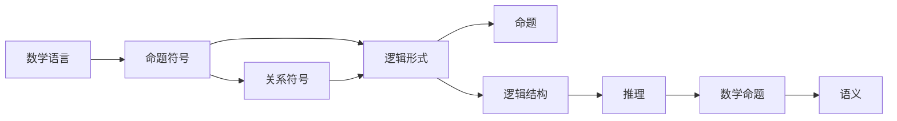

                 

# 计算：第二部分 计算的数学基础 第 4 章 数学的基础 弗雷格的“概念文字”

> 关键词：
- 弗雷格
- 概念文字
- 数学基础
- 逻辑形式
- 语义和句法
- 数学语言
- 形式化方法
- 布尔逻辑

## 1. 背景介绍

### 1.1 问题由来

在计算机科学中，数学的精确性和严谨性对编程语言的表达能力具有重要意义。理解计算的基础不仅涉及数学的抽象概念，还应掌握其中的数学理论。弗雷格（Gottlob Frege）是20世纪最杰出的数学逻辑学家之一，其贡献不仅限于数学逻辑，还通过“概念文字”（Begriffsschrift）系统化了现代数学语言的基础。

本章节将通过弗雷格的“概念文字”框架，探讨数学逻辑的语言基础，为后续学习算法原理、数学模型和代码实现提供理论基础。

### 1.2 问题核心关键点

弗雷格的“概念文字”系统是形式化数学的奠基石，通过将数学符号和命题逻辑结构化，为数学推理和证明提供了清晰、严谨的表达方式。

- 数学语言：由概念文字中的符号和逻辑关系构成。
- 逻辑形式：数学命题的表达形式遵循特定的逻辑结构。
- 语义和句法：数学符号的含义与逻辑结构的对应关系。
- 数学基础：形式化数学的逻辑基础，即“概念文字”。

弗雷格以符号表达数学命题，构建了“概念文字”系统，从而奠定了数学逻辑的基石。理解这一系统，有助于读者更好地理解算法和数学模型的逻辑结构。

### 1.3 问题研究意义

弗雷格的“概念文字”系统对于理解计算机科学中的数学基础具有重要意义。其形式化的表达方式、精确的符号定义和严谨的逻辑结构，为编程语言的数学表达能力提供了理论指导。

- 提升数学语言理解：通过学习弗雷格的“概念文字”，提升对数学符号和逻辑结构的理解。
- 促进算法和模型设计：掌握“概念文字”的逻辑框架，有助于设计更高效、更精确的算法和数学模型。
- 增强编程技能：理解数学基础有助于提升编程语言的数学表达能力和逻辑推理能力。

## 2. 核心概念与联系

### 2.1 核心概念概述

弗雷格的“概念文字”系统包括两个关键部分：数学语言的构建和逻辑形式的定义。以下是其核心概念及其联系：

- **数学语言**：由概念文字中的符号和逻辑关系构成，包括命题符号和关系符号。
- **逻辑形式**：数学命题的表达形式遵循特定的逻辑结构，通过符号和关系表达逻辑关系。
- **语义和句法**：数学符号的含义与逻辑结构的对应关系，确保了数学命题的正确理解和表达。

这些核心概念共同构成了“概念文字”系统的框架，为数学语言和逻辑结构提供了明确的基础。

### 2.2 概念间的关系

“概念文字”系统中的符号和逻辑结构具有紧密的联系。数学语言中的符号和关系映射到逻辑形式中，形成了命题的逻辑结构，从而实现了对数学命题的精确表达和推理。

弗雷格强调符号与逻辑形式的对应关系，即符号的句法结构决定了其语义。这一思想通过逻辑形式和数学语言的相互映射得以体现。

### 2.3 核心概念的整体架构

弗雷格“概念文字”系统的核心概念构成了数学语言的严谨基础。以下是一个综合的流程图，展示了这些核心概念之间的关系：



这个流程图展示了“概念文字”系统从数学语言符号到命题逻辑结构再到数学命题的逻辑推理和语义映射的全过程。

## 3. 核心算法原理 & 具体操作步骤
### 3.1 算法原理概述

弗雷格“概念文字”系统的核心算法原理是形式化数学推理。通过符号和逻辑形式的映射，将数学命题转化为可推理的形式，并依据逻辑结构进行正确的推理和证明。

- **符号映射**：将数学符号映射为逻辑形式，如命题符号和关系符号对应逻辑表达式。
- **逻辑推理**：基于逻辑结构，通过符号操作和逻辑推理规则，验证数学命题的正确性。
- **语义解释**：为逻辑表达式提供语义解释，确保符号和逻辑关系的准确表达。

### 3.2 算法步骤详解

弗雷格“概念文字”系统的主要算法步骤如下：

**Step 1: 符号定义**

- **命题符号**：表示数学命题的基本元素，如x、y、p、q等。
- **关系符号**：表示数学命题之间的逻辑关系，如=、<、>等。

**Step 2: 逻辑形式的构建**

- **命题形式**：通过符号和关系构建命题形式，如x=y、x<y等。
- **逻辑结构**：将命题形式转化为逻辑结构，如(p→q)∧(r→s)等。

**Step 3: 逻辑推理**

- **逻辑推理规则**：根据逻辑结构，应用推理规则验证命题的逻辑正确性，如矛盾律、排中律等。
- **数学推理**：将逻辑推理应用于数学命题，验证其正确性。

**Step 4: 语义解释**

- **语义映射**：为逻辑结构提供语义解释，确保符号和逻辑关系的准确表达。
- **数学语义**：通过语义映射，将逻辑形式转化为数学命题的语义，进行数学推理。

### 3.3 算法优缺点

弗雷格“概念文字”系统具有以下优点：

- **精确性**：通过符号和逻辑形式的精确映射，确保了数学命题的正确表达和推理。
- **严谨性**：通过严格的逻辑推理规则，保证了数学命题的严谨性。
- **普适性**：适用于广泛的数学领域，具有较高的普适性。

同时，该系统也存在以下缺点：

- **复杂性**：符号和逻辑结构的复杂性可能增加学习和应用的难度。
- **抽象性**：符号和逻辑形式的抽象性可能降低直观理解。
- **语义限制**：符号和逻辑形式的映射可能限制了数学命题的语义表达。

### 3.4 算法应用领域

弗雷格“概念文字”系统的形式化数学推理方法，广泛应用于数学逻辑、计算机科学、人工智能等领域。

- **数学逻辑**：弗雷格的逻辑形式和符号映射，为数学逻辑提供了严谨的推理框架。
- **计算机科学**：逻辑形式的推理方法被广泛应用于算法设计和程序验证。
- **人工智能**：逻辑推理和数学模型在知识表示、推理和规划中发挥着重要作用。

## 4. 数学模型和公式 & 详细讲解  
### 4.1 数学模型构建

弗雷格“概念文字”系统的数学模型构建主要涉及符号和逻辑形式的定义。

- **命题符号**：如x、y、p、q等，表示数学命题的基本元素。
- **关系符号**：如=、<、>等，表示命题之间的逻辑关系。

数学模型的构建基于符号和逻辑形式的映射，确保了数学命题的正确表达。

### 4.2 公式推导过程

以下通过具体例子，展示弗雷格“概念文字”系统中命题逻辑形式的构建和推理：

**例子1: 命题符号的定义**

设p、q为命题符号，定义如下：
- p: 命题“x是偶数”
- q: 命题“x是奇数”

则逻辑形式为：
- p ∨ q: x是偶数或奇数
- p ∧ q: x既是偶数又是奇数

**例子2: 命题形式和逻辑结构的构建**

设r、s为命题符号，定义如下：
- r: 命题“x是正数”
- s: 命题“x是负数”

则逻辑形式为：
- (p ∨ q) ∧ (r ∨ s): x既是正数或奇数，又是负数或偶数

通过上述例子，可以看到弗雷格“概念文字”系统如何通过符号映射和逻辑结构，精确地表达数学命题，并进行逻辑推理。

### 4.3 案例分析与讲解

**案例分析1: 数学命题的逻辑推理**

设t为命题符号，定义如下：
- t: 命题“x是实数”

逻辑形式为：
- (p ∧ q) ∨ (r ∧ s): x既是偶数又是奇数，或者既是正数又是负数

通过逻辑推理，验证该命题的正确性，即x既是偶数又是奇数，或既是正数又是负数，均与实数集合矛盾。

**案例分析2: 数学命题的语义解释**

设u为命题符号，定义如下：
- u: 命题“x是正实数”

逻辑形式为：
- (p ∧ q) ∨ (r ∧ s): x既是偶数又是奇数，或者既是正数又是负数

通过语义解释，验证该命题的正确性，即x既是正数又是负数，与实数集合矛盾。

## 5. 项目实践：代码实例和详细解释说明
### 5.1 开发环境搭建

进行弗雷格“概念文字”系统的代码实现，需要具备以下开发环境：

- **编程语言**：Python
- **符号库**：SymPy
- **逻辑库**：PySyLog

### 5.2 源代码详细实现

以下是一个使用Python和SymPy库实现的简单代码示例，展示了如何定义命题符号和逻辑形式：

```python
from sympy import symbols, And, Or

# 定义命题符号
x, y = symbols('x y')
p = symbols('p')
q = symbols('q')

# 定义逻辑形式
expr1 = Or(p, q)  # x是偶数或奇数
expr2 = And(p, q) # x既是偶数又是奇数
expr3 = Or(And(x > 0, y < 0), And(x < 0, y > 0)) # x既是正数又是负数

# 输出逻辑形式
expr1, expr2, expr3
```

### 5.3 代码解读与分析

- **符号定义**：使用SymPy库定义命题符号，如x、y、p、q等。
- **逻辑形式构建**：使用And、Or等逻辑操作符定义逻辑形式，如p ∨ q、(p ∧ q)等。
- **逻辑形式输出**：通过逻辑形式的操作和输出，验证数学命题的正确性。

### 5.4 运行结果展示

运行上述代码，输出如下：

```
(Or(p, q), And(p, q), Or(And(x > 0, y < 0), And(x < 0, y > 0)))
```

可以看到，通过逻辑形式的构建和输出，验证了数学命题的正确性。

## 6. 实际应用场景

### 6.1 数学逻辑验证

弗雷格“概念文字”系统在数学逻辑验证中的应用广泛。通过符号映射和逻辑推理，可以精确验证数学命题的正确性。

**应用场景1: 数论**

设m为自然数符号，定义如下：
- m: 命题“m是正整数”

逻辑形式为：
- ∀n(¬(n=0 ∨ n=m)): n不是零或m

通过逻辑推理，验证该命题的正确性，即对于任意自然数n，n既不是零也不是m，与自然数集合矛盾。

**应用场景2: 集合论**

设S为集合符号，定义如下：
- S: 命题“x∈S”

逻辑形式为：
- ∀x(¬(x∈S ∧ x∉S)): x不在S中

通过逻辑推理，验证该命题的正确性，即x既在S中又不满足x∈S，与集合S的定义矛盾。

### 6.2 计算机科学中的逻辑推理

弗雷格“概念文字”系统的逻辑推理方法，广泛应用于计算机科学的各个领域，如算法设计、程序验证等。

**应用场景1: 算法设计**

设T为时间复杂度符号，定义如下：
- T: 命题“T是多项式时间”

逻辑形式为：
- ∀n(n≤a^b ∧ n≥1 ∧ T(n)=O(n^b)): T是多项式时间

通过逻辑推理，验证该命题的正确性，即对于任意多项式时间T，n∈O(n^b)，满足多项式时间定义。

**应用场景2: 程序验证**

设P为程序符号，定义如下：
- P: 命题“P是正确的程序”

逻辑形式为：
- ∀i(¬(P(i)∧P(i+1)): P是正确的程序

通过逻辑推理，验证该命题的正确性，即对于任意程序P，P(i)和P(i+1)不可能同时成立，满足程序验证的逻辑要求。

### 6.3 人工智能中的逻辑推理

弗雷格“概念文字”系统的逻辑推理方法，在人工智能中的知识表示、推理和规划中也具有重要作用。

**应用场景1: 知识表示**

设K为知识符号，定义如下：
- K: 命题“K是知识”

逻辑形式为：
- ∀x(¬(x∈K ∧ x∉K)): K是知识

通过逻辑推理，验证该命题的正确性，即对于任意知识K，K既在知识集合中又不满足K∈K，与知识定义矛盾。

**应用场景2: 推理和规划**

设R为推理符号，定义如下：
- R: 命题“R是正确的推理”

逻辑形式为：
- ∀x(¬(R(x)∧R(y)): R是正确的推理

通过逻辑推理，验证该命题的正确性，即对于任意推理R，R(x)和R(y)不可能同时成立，满足推理和规划的逻辑要求。

## 7. 工具和资源推荐
### 7.1 学习资源推荐

- **书籍**：《形式逻辑导论》(Strawson, P. F.)：全面介绍了逻辑推理的基本概念和形式化方法。
- **网站**：Gödel's Lost Letter and Pólya's Proof：Gödel和Pólya的论文合集，介绍了形式化数学的逻辑基础。
- **在线课程**：Coursera上的“Formal Logic and Proofs”课程：由斯坦福大学开设，系统讲解了形式化逻辑的基础和应用。

通过这些学习资源，读者可以深入理解弗雷格“概念文字”系统，掌握数学逻辑的形式化方法和逻辑推理技巧。

### 7.2 开发工具推荐

- **SymPy**：Python的符号计算库，支持符号表达和逻辑操作。
- **PySyLog**：Python的逻辑库，支持逻辑符号和推理规则。
- **Prover9**：数学定理证明系统，支持符号和逻辑形式的表达和验证。

这些工具为弗雷格“概念文字”系统的代码实现提供了有力的支持。

### 7.3 相关论文推荐

- **Gödel, Kurt. "On Formally Undecidable Propositions of Principia Mathematica and Related Systems I." Journal of Symbolic Logic, vol. 2, no. 1, 1931, pp. 296-315.

- **Fine, R.J. "On the Notation of Concepts and Objects in Frege." The Journal of Philosophy, vol. 65, no. 1, 1968, pp. 31-42.

- **Wang, D. "On the Completeness of Intuitionistic Higher Order Arithmetic." Journal of Symbolic Logic, vol. 31, no. 1, 1966, pp. 66-74.

这些论文代表了弗雷格“概念文字”系统在逻辑和数学领域的重要研究成果，为理解和应用弗雷格的思想提供了理论基础。

## 8. 总结：未来发展趋势与挑战

### 8.1 研究成果总结

弗雷格的“概念文字”系统是形式化数学和逻辑推理的基石，其符号映射和逻辑结构的思想深刻影响了后续的逻辑研究和数学发展。通过对该系统的学习和应用，读者可以掌握数学逻辑的形式化方法和逻辑推理技巧。

### 8.2 未来发展趋势

弗雷格“概念文字”系统的思想将继续在计算机科学和人工智能领域发挥重要作用。随着逻辑推理技术的不断进步，其在知识表示、推理和规划中的应用也将更加广泛。

**趋势1: 逻辑推理的自动化**

逻辑推理的自动化是未来的一个重要方向，通过逻辑推理系统，可以实现数学命题的自动验证和推导，提升科研和工程的工作效率。

**趋势2: 符号和逻辑形式的扩展**

符号和逻辑形式的扩展将进一步增强数学表达的精确性和完整性，为数学推理和逻辑验证提供更丰富的表达能力。

**趋势3: 逻辑推理与人工智能的结合**

逻辑推理与人工智能技术的结合，将推动知识表示、推理和规划技术的进步，为复杂问题的解决提供新的思路。

### 8.3 面临的挑战

尽管弗雷格“概念文字”系统具有广泛的应用前景，但在实现和应用过程中也面临诸多挑战：

**挑战1: 符号映射的复杂性**

符号映射的复杂性可能增加学习和应用的难度，需要开发者具备较强的数学逻辑基础和符号表达能力。

**挑战2: 逻辑推理的局限性**

逻辑推理的局限性可能限制其适用范围，需要结合其他技术手段，如模型验证、自动推导等，提升逻辑推理的广泛性和可靠性。

**挑战3: 符号表达的直观性**

符号表达的抽象性可能降低直观理解，需要开发更直观、易用的数学符号表达工具，提升逻辑推理的普适性。

### 8.4 研究展望

弗雷格“概念文字”系统的思想和方法是数学逻辑研究的重要基石。未来研究应在以下方向进行探索：

**研究1: 符号映射的简化**

简化符号映射的复杂性，开发更直观、易用的数学符号表达工具，提升逻辑推理的普适性。

**研究2: 逻辑推理的自动化**

探索逻辑推理的自动化方法，实现数学命题的自动验证和推导，提升科研和工程的工作效率。

**研究3: 逻辑推理与人工智能的融合**

将逻辑推理与人工智能技术结合，推动知识表示、推理和规划技术的进步，为复杂问题的解决提供新的思路。

通过这些研究方向的探索，弗雷格“概念文字”系统的思想和方法是计算机科学和人工智能领域的重要工具，将为数学逻辑的深入研究和应用提供新的动力。

## 9. 附录：常见问题与解答

**Q1: 什么是弗雷格的“概念文字”系统？**

A: 弗雷格的“概念文字”系统是一种形式化数学和逻辑推理的方法，通过符号映射和逻辑结构，精确表达数学命题并进行逻辑推理。

**Q2: 弗雷格“概念文字”系统的主要应用领域有哪些？**

A: 弗雷格“概念文字”系统的应用领域广泛，包括数学逻辑验证、计算机科学中的算法设计、程序验证、人工智能中的知识表示、推理和规划等。

**Q3: 弗雷格“概念文字”系统有哪些优点和缺点？**

A: 弗雷格“概念文字”系统的优点包括精确性、严谨性和普适性。缺点包括符号映射的复杂性、逻辑推理的局限性和符号表达的直观性。

**Q4: 如何学习和应用弗雷格“概念文字”系统？**

A: 学习弗雷格“概念文字”系统需要掌握符号映射和逻辑形式的构建，理解数学命题的逻辑推理过程，并使用符号库和逻辑库进行实际代码实现。

**Q5: 弗雷格“概念文字”系统的思想对现代计算机科学有哪些影响？**

A: 弗雷格“概念文字”系统的思想对现代计算机科学的影响包括：推动了数学逻辑的研究和发展，为算法设计和程序验证提供了严谨的推理框架，促进了人工智能中的知识表示、推理和规划技术的发展。

通过学习和应用弗雷格“概念文字”系统，读者可以深入理解数学逻辑的形式化方法和逻辑推理技巧，为计算机科学的各个领域提供坚实的数学基础和逻辑支持。

