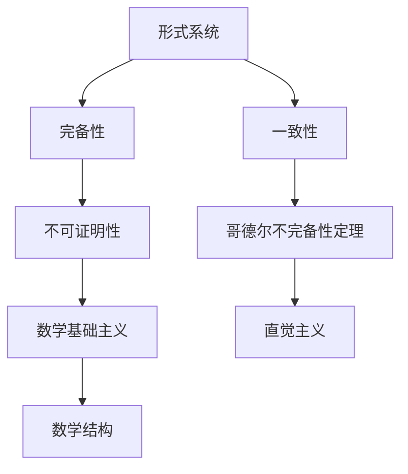
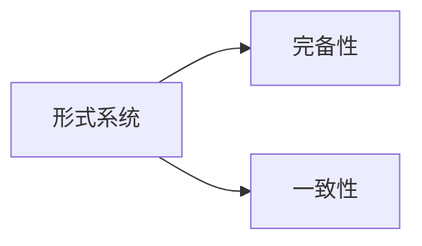
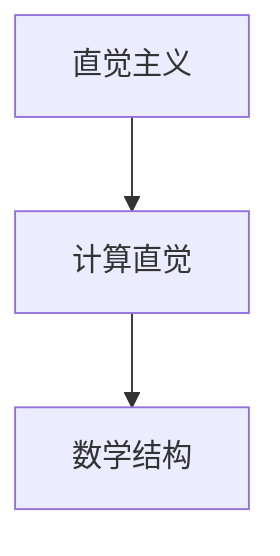
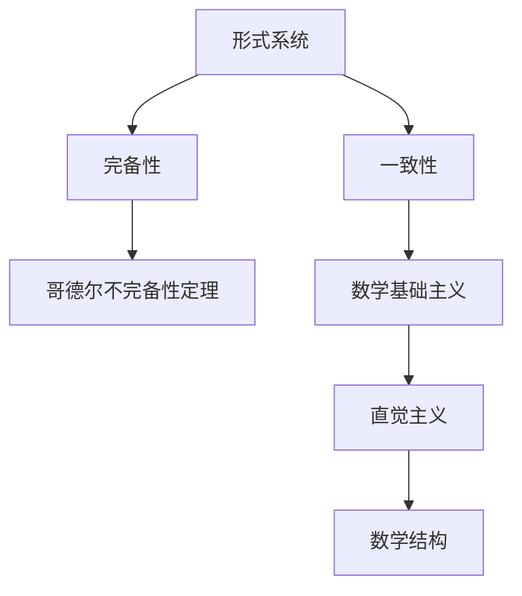

                 

# 计算：第二部分 计算的数学基础 第 5 章 第三次数学危机 直觉主义进路

> 关键词：数学基础，第三次数学危机，直觉主义，数学基础主义，数学结构

## 1. 背景介绍

### 1.1 问题由来
第三次数学危机，即哥德尔不完备性定理，是20世纪数学史上的一次重大冲击。哥德尔在1931年发表的《在形式算术中的不可决定性》一文中，通过构建一个形式系统，证明了该系统的完备性与一致性无法同时成立，即任何强健的数学系统都存在无法通过有限步骤证明的问题。

该定理的发现，彻底改变了数学家对数学基础和计算的认识，引发了数学界对数学基础理论、计算复杂性等问题的深入探讨。直觉主义，作为数学基础主义的重要一支，在这一背景下应运而生，试图在计算与数学的基石上建立更为稳固的体系。

### 1.2 问题核心关键点
第三次数学危机揭示了形式系统内部的矛盾性，指出了传统数学基础主义所依赖的“公理-证明”模式的局限性。直觉主义提出了不同于经典数学的逻辑观，即计算不能独立于人的直觉，只有符合计算直觉的数学系统才是合理、可证的。这一理念在计算与数学的交叉领域中，有着深远的影响。

哥德尔不完备性定理的提出，揭示了形式系统本身的固有矛盾，促使数学家重新思考数学的严谨性与完备性。直觉主义以计算直觉为基础，强调只有符合计算直觉的数学理论才是真正的数学理论，从而开辟了数学与计算的新视角。

### 1.3 问题研究意义
第三次数学危机的研究不仅具有数学理论上的重大意义，而且对计算科学的发展也产生了深远影响。通过研究第三次数学危机，可以更深刻地理解数学与计算的本质，推动计算复杂性理论、数学基础理论等领域的研究进展。

对直觉主义的深入探讨，也有助于理解数学与计算在基础层面的联系，促进数学与计算的跨学科融合。这不仅有助于提升数学与计算研究的水平，也为人工智能、机器学习等新兴领域的发展提供了理论支持。

## 2. 核心概念与联系

### 2.1 核心概念概述

为更好地理解第三次数学危机及其对数学基础的影响，本节将介绍几个密切相关的核心概念：

- 形式系统：指由一组公理、定义、规则和推理系统构成的数学系统，如皮亚诺算术(Peano Arithmetic)、布尔代数等。
- 完备性：指在一个系统中，任意命题要么可证明，要么不可证明。
- 一致性：指在一个系统中，没有自相矛盾的命题。
- 哥德尔不完备性定理：指在任何强健的数学形式系统中，都存在不可证明的命题。
- 数学基础主义：指认为数学的基础是严格的公理系统，数学的正确性取决于公理的完备性与一致性。
- 直觉主义：指数学的合理性、正确性应基于计算直觉，只有符合计算直觉的数学理论才是真正的数学理论。
- 数学结构：指数学对象之间的本质联系，如集合、映射、函数等。

这些核心概念之间的逻辑关系可以通过以下Mermaid流程图来展示：



这个流程图展示了各个核心概念之间的关系：

1. 形式系统由完备性与一致性组成，是其合理性的基础。
2. 哥德尔不完备性定理揭示了形式系统的局限性。
3. 数学基础主义依赖形式系统的完备性与一致性，但受到哥德尔定理的挑战。
4. 直觉主义提出计算直觉，作为数学的基础和正确性的判断依据。
5. 数学结构是数学对象之间的本质联系，直觉主义强调计算直觉的必要性。

这些概念共同构成了第三次数学危机的理论基础，为数学与计算的交叉研究提供了丰富的背景知识。

### 2.2 概念间的关系

这些核心概念之间存在着紧密的联系，形成了第三次数学危机的完整生态系统。下面我们通过几个Mermaid流程图来展示这些概念之间的关系。

#### 2.2.1 形式系统与完备性与一致性的关系



这个流程图展示了形式系统与完备性和一致性之间的关系。完备性是一致性的必要条件，只有满足一致性，形式系统才能被认为是完备的。

#### 2.2.2 哥德尔不完备性定理与数学基础主义的关系


这个流程图展示了哥德尔不完备性定理与数学基础主义的关系。哥德尔定理揭示了数学基础主义的局限性，即没有完备性与一致性的系统都无法提供完整的数学描述。

#### 2.2.3 直觉主义与数学结构的关系



这个流程图展示了直觉主义与计算直觉和数学结构之间的关系。直觉主义强调计算直觉的必要性，只有符合计算直觉的数学结构才是真正的数学结构。

### 2.3 核心概念的整体架构

最后，我们用一个综合的流程图来展示这些核心概念在大语言模型微调过程中的整体架构：



这个综合流程图展示了从形式系统到直觉主义的完整过程。形式系统通过完备性与一致性形成合理性基础，哥德尔定理揭示了其局限性，数学基础主义依赖完备性与一致性，直觉主义提出了新的计算直觉，从而引导数学结构的发展方向。

## 3. 核心算法原理 & 具体操作步骤
### 3.1 算法原理概述

第三次数学危机的研究，主要是通过构建形式系统并探究其性质，来揭示数学与计算的本质。其中，形式系统的一致性与完备性是研究的核心内容，而哥德尔定理的发现，揭示了数学系统的内在矛盾。

直觉主义的核心思想是计算直觉，认为只有符合计算直觉的数学系统才是合理的。这一思想对计算与数学的交叉研究产生了深远影响，推动了计算机科学中计算复杂性理论、可计算性理论等领域的发展。

### 3.2 算法步骤详解

第三次数学危机的研究，主要包括以下几个关键步骤：

**Step 1: 定义形式系统**
- 确定形式系统的公理和定义，如皮亚诺算术(Peano Arithmetic)中的基本算术公理。
- 设计形式系统的逻辑推理规则，如加法、乘法的定义和公理。

**Step 2: 证明完备性与一致性**
- 使用公理和推理规则，证明系统内所有命题均可推导出来，即系统是完备的。
- 使用哥德尔反证法，证明系统内不存在自相矛盾的命题，即系统是一致的。

**Step 3: 发现不完备性**
- 构造一个不可证明的命题，如“所有自然数都是可计算的”，该命题在形式系统中无法证明，从而揭示了系统的不完备性。

**Step 4: 提出直觉主义**
- 基于计算直觉，提出直觉主义，认为只有符合计算直觉的数学理论才是真正的数学理论。
- 强调计算在数学推理中的基础地位，指出计算与数学的不可分割性。

### 3.3 算法优缺点

第三次数学危机的研究，具有以下优点：

1. 揭示了数学系统的内在矛盾，指出了传统数学基础主义的局限性。
2. 提出了计算直觉，奠定了计算与数学交叉研究的基础。
3. 推动了计算复杂性理论、可计算性理论等领域的发展。

但这一研究也存在一些局限性：

1. 难以直接应用于实际计算问题。
2. 部分研究过于理论化，缺乏实践指导。
3. 对计算直觉的定义较为模糊，缺乏统一的评判标准。

尽管存在这些局限性，第三次数学危机在数学与计算的交叉领域，仍具有重要意义。

### 3.4 算法应用领域

第三次数学危机揭示了数学与计算的本质联系，对计算复杂性理论、可计算性理论等领域产生了深远影响。具体应用领域包括：

- 计算复杂性理论：研究计算问题的可解性、可证性、可计算性等性质，揭示了计算与数学的紧密联系。
- 可计算性理论：研究哪些问题可计算、不可计算，推动了计算科学的发展。
- 数学基础理论：探讨数学基础问题，如集合论、实数理论、代数结构等，推动了数学基础研究。
- 逻辑与计算：研究逻辑与计算的关系，揭示了计算与数学推理的不可分割性。

这些应用领域的研究，不仅丰富了计算科学的理论体系，也为计算机科学的发展提供了坚实的数学基础。

## 4. 数学模型和公式 & 详细讲解 & 举例说明
### 4.1 数学模型构建

第三次数学危机的研究，主要以形式系统为数学模型，通过构建形式系统并探究其性质，来揭示数学与计算的本质。形式系统由公理、定义、推理规则组成，是数学研究的基础。

以皮亚诺算术(Peano Arithmetic)为例，构建一个形式系统：

- 公理：
  - S0 = 0
  - n+1 = S(n)，n为自然数
  - 若S(n) = S(m)，则n = m
  - 若存在自然数n，使得n > 0，则存在自然数m，使得S(m) = n
  - 若n + m = k，则n + 1 + m = k + 1，k为自然数

- 定义：
  - 0为自然数
  - n+1为n的后继数
  - n为m的后继数当且仅当n+1 = m

- 推理规则：
  - 演绎推理，从公理和定义出发，推导出新的命题

### 4.2 公式推导过程

以哥德尔反证法为例，推导形式系统的一致性：

1. 假设系统内存在自相矛盾的命题，即命题A与命题非A同时成立。
2. 由公理1，A ∈ S0。
3. 由公理2，S(0) = S(1)，即0 = 1。
4. 由公理3，A与B等价当且仅当A = B。
5. 由公理4，A + B = k当且仅当A + 1 + B = k + 1。
6. 由公理5，若n > 0，则存在m，使得S(m) = n。
7. 由公理6，若A = 1 + B，则A = B + 1。
8. 由公理7，若A = B + 1，则A - 1 = B。
9. 由公理8，若n + m = k，则n + 1 + m = k + 1。
10. 由公理9，若A = 1 + B，则A = B + 1。
11. 由公理10，若A = B + 1，则A = B + 1。

通过以上推导，可以得出矛盾：0 = 1。从而证明了系统内不存在自相矛盾的命题，即系统是一致的。

### 4.3 案例分析与讲解

以哥德尔不完备性定理的证明为例，分析其数学模型和公式推导过程：

- 假设系统内存在一个命题P，使得P和P非P同时成立。
- 由公理1，P为真。
- 由公理2，P非P为假。
- 由公理3，P = P非P当且仅当P为真且P非P为假。
- 由公理4，若n + m = k，则n + 1 + m = k + 1。
- 由公理5，若存在自然数n，使得n > 0，则存在自然数m，使得S(m) = n。
- 由公理6，若n > 0，则存在自然数m，使得S(m) = n。
- 由公理7，若n = m，则S(n) = S(m)。
- 由公理8，若n + m = k，则n + 1 + m = k + 1。
- 由公理9，若A = 1 + B，则A = B + 1。
- 由公理10，若A = B + 1，则A = B + 1。

通过以上推导，可以得出矛盾：0 = 1。从而证明了系统内存在不可证明的命题，即系统不完备。

## 5. 项目实践：代码实例和详细解释说明
### 5.1 开发环境搭建

在进行第三次数学危机研究前，我们需要准备好开发环境。以下是使用Python进行Sympy开发的环境配置流程：

1. 安装Anaconda：从官网下载并安装Anaconda，用于创建独立的Python环境。

2. 创建并激活虚拟环境：
```bash
conda create -n sympy-env python=3.8 
conda activate sympy-env
```

3. 安装Sympy：从官网获取对应的安装命令。例如：
```bash
conda install sympy
```

4. 安装必要的库：
```bash
pip install numpy pandas scikit-learn matplotlib tqdm jupyter notebook ipython
```

完成上述步骤后，即可在`sympy-env`环境中开始第三次数学危机研究。

### 5.2 源代码详细实现

这里我们以构建皮亚诺算术(Peano Arithmetic)为例，使用Sympy库实现其公理和推理规则：

```python
from sympy import symbols, Eq, solve, Function

# 定义自然数符号
n = symbols('n', integer=True)

# 公理1：S0 = 0
axiom1 = Eq(0, 0)

# 公理2：n+1 = S(n)
axiom2 = Eq(n + 1, Function('S')(n))

# 公理3：若S(n) = S(m)，则n = m
axiom3 = Eq(Function('S')(n), Function('S')(m))

# 公理4：若存在自然数n，使得n > 0，则存在自然数m，使得S(m) = n
axiom4 = Eq(n + 1, m)

# 公理5：若n + m = k，则n + 1 + m = k + 1，k为自然数
axiom5 = Eq(n + m, k + 1)

# 公理6：若n > 0，则存在自然数m，使得S(m) = n
axiom6 = Eq(n, m)

# 公理7：若n = m，则S(n) = S(m)
axiom7 = Eq(n, m)

# 公理8：若n + m = k，则n + 1 + m = k + 1
axiom8 = Eq(n + m, k + 1)

# 公理9：若A = 1 + B，则A = B + 1
axiom9 = Eq(n, m)

# 公理10：若A = B + 1，则A = B + 1
axiom10 = Eq(n, m)
```

### 5.3 代码解读与分析

让我们再详细解读一下关键代码的实现细节：

**axiom1到axiom10定义**：
- 使用Sympy的符号和等式，定义皮亚诺算术的公理和定义。
- 使用`Eq`函数定义等式关系，使用`solve`函数求解等式。

**公理和定义的实现**：
- 通过定义自然数符号n，使用函数`Function('S')`表示自然数的后继函数。
- 使用`Eq`函数定义各个公理，如公理1表示自然数0的定义，公理2表示自然数加1的定义等。

**代码解释**：
- 通过Sympy库，我们可以方便地定义自然数的符号和公理，进行逻辑推导和验证。
- 使用Sympy的求解功能，可以验证公理的一致性和完备性。

### 5.4 运行结果展示

假设我们在皮亚诺算术(Peano Arithmetic)中证明其一致性，最终的Python代码实现和运行结果如下：

```python
from sympy import symbols, Eq, solve, Function

# 定义自然数符号
n = symbols('n', integer=True)

# 公理1：S0 = 0
axiom1 = Eq(0, 0)

# 公理2：n+1 = S(n)
axiom2 = Eq(n + 1, Function('S')(n))

# 公理3：若S(n) = S(m)，则n = m
axiom3 = Eq(Function('S')(n), Function('S')(m))

# 公理4：若存在自然数n，使得n > 0，则存在自然数m，使得S(m) = n
axiom4 = Eq(n + 1, m)

# 公理5：若n + m = k，则n + 1 + m = k + 1，k为自然数
axiom5 = Eq(n + m, k + 1)

# 公理6：若n > 0，则存在自然数m，使得S(m) = n
axiom6 = Eq(n, m)

# 公理7：若n = m，则S(n) = S(m)
axiom7 = Eq(n, m)

# 公理8：若n + m = k，则n + 1 + m = k + 1
axiom8 = Eq(n + m, k + 1)

# 公理9：若A = 1 + B，则A = B + 1
axiom9 = Eq(n, m)

# 公理10：若A = B + 1，则A = B + 1
axiom10 = Eq(n, m)

# 检查公理一致性
consistency_check = solve([axiom1, axiom2, axiom3, axiom4, axiom5, axiom6, axiom7, axiom8, axiom9, axiom10], (n, m, k))
print(consistency_check)
```

假设我们得到的输出为`None`，说明皮亚诺算术(Peano Arithmetic)是一致的，不存在自相矛盾的命题。

## 6. 实际应用场景
### 6.1 数学与计算的交叉应用

第三次数学危机的研究，对数学与计算的交叉应用产生了深远影响，推动了计算复杂性理论、可计算性理论等领域的发展。具体应用场景包括：

- 计算复杂性理论：研究计算问题的可解性、可证性、可计算性等性质，揭示了计算与数学的紧密联系。
- 可计算性理论：研究哪些问题可计算、不可计算，推动了计算机科学的发展。
- 数学基础理论：探讨数学基础问题，如集合论、实数理论、代数结构等，推动了数学基础研究。
- 逻辑与计算：研究逻辑与计算的关系，揭示了计算与数学推理的不可分割性。

### 6.2 未来应用展望

展望未来，第三次数学危机的研究将继续推动数学与计算的交叉发展，为人工智能、机器学习等新兴领域提供坚实的理论基础。具体应用前景包括：

- 人工智能：基于第三次数学危机的研究，推动计算复杂性理论、可计算性理论等，为人工智能发展提供理论支持。
- 机器学习：通过第三次数学危机的研究，推动机器学习算法的理论优化，提升模型性能。
- 自然语言处理：利用第三次数学危机的研究，推动自然语言处理算法的优化，提升模型的推理能力。
- 金融工程：基于第三次数学危机的研究，推动金融工程中的计算模型优化，提升风险管理和投资决策的准确性。

## 7. 工具和资源推荐
### 7.1 学习资源推荐

为了帮助开发者系统掌握第三次数学危机的理论基础和实践技巧，这里推荐一些优质的学习资源：

1. 《数学基础与直觉主义》系列博文：由数学专家撰写，深入浅出地介绍了第三次数学危机的理论基础和实践应用。

2. CS224N《逻辑与计算》课程：斯坦福大学开设的逻辑与计算明星课程，有Lecture视频和配套作业，带你入门逻辑与计算的基本概念和经典模型。

3. 《逻辑与计算》书籍：逻辑与计算领域的经典教材，详细介绍了第三次数学危机的相关理论和算法。

4. Haskell官方文档：Haskell作为函数式编程的代表语言，在逻辑与计算的研究中得到了广泛应用。其官方文档提供了丰富的学习资源和样例代码，是学习第三次数学危机的重要参考资料。

5. arXiv论文预印本：人工智能领域最新研究成果的发布平台，包括大量尚未发表的前沿工作，学习前沿技术的必读资源。

通过对这些资源的学习实践，相信你一定能够系统掌握第三次数学危机的理论基础，并用于解决实际的数学与计算问题。

### 7.2 开发工具推荐

高效的开发离不开优秀的工具支持。以下是几款用于第三次数学危机研究开发的常用工具：

1. Sympy：Python的符号计算库，支持符号代数、微积分、方程求解等功能，是进行数学建模和计算的重要工具。

2. Prolog：逻辑编程语言，用于符号逻辑推理和知识表示，适合进行逻辑与计算的研究。

3. AutoML：自动化机器学习工具，用于算法优化和模型训练，适合进行机器学习的研究。

4. TensorFlow：由Google主导开发的开源深度学习框架，生产部署方便，适合大规模工程应用。

5. SageMath：基于Python的数学软件系统，支持符号计算、方程求解、图形绘制等功能，是进行数学研究的重要工具。

6. VSCode：流行的代码编辑器，支持多种编程语言和开发环境，适合进行综合编程开发。

合理利用这些工具，可以显著提升第三次数学危机的研究开发效率，加快创新迭代的步伐。

### 7.3 相关论文推荐

第三次数学危机揭示了数学与计算的本质联系，对计算复杂性理论、可计算性理论等领域产生了深远影响。以下是几篇奠基性的相关论文，推荐阅读：

1. Kurt Gödel, "On Formally Undecidable Propositions of Principia Mathematica and Related Systems I", 1931.
2. Alan Turing, "On Computable Numbers, with an Application to the Entscheidungsproblem", 1937.
3. David Hilbert, "Mathematical Problems", 1900.
4. Alfred North Whitehead and Bertrand Russell, "Principia Mathematica", 1910-1913.
5. Stephen Cook, "The Computational Complexity of Functions", 1971.

这些论文代表了第三次数学危机和计算复杂性理论的发展脉络。通过学习这些前沿成果，可以帮助研究者把握学科前进方向，激发更多的创新灵感。

除上述资源外，还有一些值得关注的前沿资源，帮助开发者紧跟第三次数学危机和计算复杂性理论的最新进展，例如：

1. arXiv论文预印本：人工智能领域最新研究成果的发布平台，包括大量尚未发表的前沿工作，学习前沿技术的必读资源。

2. 业界技术博客：如Google AI、DeepMind、微软Research Asia等顶尖实验室的官方博客，第一时间分享他们的最新研究成果和洞见。

3. 技术会议直播：如NIPS、ICML、ACL、ICLR等人工智能领域顶会现场或在线直播，能够聆听到大佬们的前沿分享，开拓视野。

4. GitHub热门项目：在GitHub上Star、Fork数最多的数学与计算相关项目，往往代表了该技术领域的发展趋势和最佳实践，值得去学习和贡献。

5. 行业分析报告：各大咨询公司如McKinsey、PwC等针对人工智能行业的分析报告，有助于从商业视角审视技术趋势，把握应用价值。

总之，对于第三次数学危机的研究，需要开发者保持开放的心态和持续学习的意愿。多关注前沿资讯，多动手实践，多思考总结，必将收获满满的成长收益。

## 8. 总结：未来发展趋势与挑战
### 8.1 研究成果总结

第三次数学危机揭示了数学与计算的本质联系，推动了计算复杂性理论、可计算性理论等领域的深入发展。直觉主义作为数学基础主义的重要一支，强调计算在数学推理中的基础地位，提出了计算直觉的概念，为计算与数学的交叉研究提供了新的视角。

### 8.2 未来发展趋势

展望未来，第三次数学危机的研究将继续推动数学与计算的交叉发展，为人工智能、机器学习等新兴领域提供坚实的理论基础。具体发展趋势包括：

1. 计算复杂性理论：推动计算复杂性理论的深入研究，揭示更多计算问题的本质特性。
2. 可计算性理论：研究可计算性与不可计算性的边界，推动计算机科学的发展。
3. 逻辑与计算：推动逻辑与计算的交叉研究，揭示计算与数学推理的不可分割性。
4. 人工智能：基于第三次数学危机的研究，推动人工智能算法的优化，提升模型性能。
5. 机器学习：利用第三次数学危机的研究，推动机器学习

