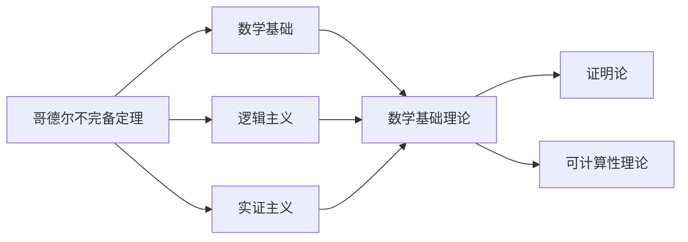

                 

# 计算：第二部分 计算的数学基础 第 5 章 第三次数学危机

> 关键词：计算危机,哥德尔不完备定理,数学基础的寻找,悖论解析,逻辑实证主义,数学哲学

## 1. 背景介绍

### 1.1 问题由来

在20世纪初期，数学界出现了著名的第三次数学危机。这场危机源于对数学基础的系统性思考，导致了几十年来对数学实证主义和逻辑主义的重新审视。哥德尔不完备定理是这场危机的核心所在，它从根本上揭示了数学和逻辑体系的局限性。

### 1.2 问题核心关键点

第三次数学危机的核心是数学基础的完备性与一致性。数学基础指的是对数学概念、公理系统及其关系的系统化描述。逻辑主义认为数学是从逻辑推导而来，数学基础就是逻辑；实证主义则认为数学是实验验证的科学，数学基础来自于经验。哥德尔不完备定理证明了任何包含基本算术的公理体系要么是自洽的、有限且一致的，要么是不完备的，即存在无法证明也无法证否的命题。

### 1.3 问题研究意义

这场危机的解决对于数学哲学和数学基础理论的发展具有重要意义：

1. **重新审视数学基础**：证明了逻辑主义和实证主义的局限性，推动了对数学基础的新认识。
2. **数学与逻辑的关系**：揭示了逻辑在数学中的作用和限制，为逻辑和数学的结合提供了新的视角。
3. **悖论解析**：通过哥德尔不完备定理，为解决数学悖论提供了新的理论依据。
4. **数学哲学发展**：推动了数学哲学的发展，强调了逻辑、实证主义和构造主义在数学基础中的角色。
5. **后续研究方向**：为后续的数学基础研究、证明论、可计算性理论等奠定了基础。

## 2. 核心概念与联系

### 2.1 核心概念概述

在探讨第三次数学危机前，我们需要对相关核心概念进行理解：

- **哥德尔不完备定理**：证明了任何包含基本算术的公理体系是不完备的，即存在无法证明也无法证否的命题。
- **逻辑主义**：主张数学从逻辑推导而来，数学基础就是逻辑。
- **实证主义**：认为数学是实验验证的科学，数学基础来自于经验。
- **数学基础**：对数学概念、公理系统及其关系的系统化描述。
- **证明论**：研究证明过程的逻辑学分支，主要关注证明的可能性、可构造性、复杂性等。
- **可计算性理论**：研究算法和计算过程的理论，与数学基础密切相关。

### 2.2 概念间的关系

这些核心概念之间的联系和相互作用可以通过以下Mermaid流程图来展示：



这个流程图展示了哥德尔不完备定理与数学基础理论的关系，以及逻辑主义和实证主义如何影响数学基础理论的发展。同时，证明论和可计算性理论是数学基础理论的重要组成部分，相互之间有密切联系。

## 3. 核心算法原理 & 具体操作步骤
### 3.1 算法原理概述

哥德尔不完备定理的证明基于对形式系统的严格构造和分析，这里不展开具体证明过程。我们需要理解以下核心算法原理：

- **形式系统**：由一组公理和规则构成的数学系统，能够通过有限步骤推导出所有可证明的命题。
- **自洽性**：如果形式系统中没有矛盾，则称为自洽的。
- **一致性**：如果形式系统中的所有可证明的命题都是真的，则称为一致的。
- **完备性**：如果形式系统中的所有真实命题都可以证明，则称为完备的。
- **可证明性**：形式系统中命题的可证明性，即是否存在有限的证明步骤使该命题可被证明。

### 3.2 算法步骤详解

哥德尔不完备定理的证明可以分为以下几个步骤：

1. **形式系统的构造**：构建一个形式系统，例如皮亚诺算术公理系统PA。
2. **公理和规则**：定义系统的公理和推理规则，确保系统的一致性。
3. **罗素悖论**：通过构造一个包含自身定义的集合，证明PA系统不满足罗素公理，存在矛盾。
4. **哥德尔构造**：构造一个数列，称为哥德尔构造，这个数列在PA系统中既无法证明也无法证否。
5. **不可判定的命题**：证明哥德尔构造在PA系统中不可判定，即不存在算法能够判断其真伪。
6. **不完备性**：证明PA系统不满足完备性，即存在不可判定的命题。

### 3.3 算法优缺点

哥德尔不完备定理的证明具有以下优点：

- **深刻性**：揭示了数学和逻辑的根本局限性，对数学基础理论的发展具有深远影响。
- **普适性**：证明了任何包含基本算术的公理系统的不完备性，具有普适性。

同时，也存在一些缺点：

- **复杂性**：哥德尔不完备定理的证明过程复杂，需要严格的数学和逻辑基础。
- **技术难度**：需要深厚的数学和逻辑学知识，对初学者不友好。
- **应用难度**：证明更多适用于理论研究，实际操作中的适用性有限。

### 3.4 算法应用领域

哥德尔不完备定理主要应用于数学基础理论、证明论和可计算性理论。它在以下几个领域有广泛的应用：

- **数学基础研究**：推动了对数学基础的新认识，推动了数理逻辑和递归理论的发展。
- **证明论**：证明了证明论中的重要定理，如命题可判定的否定等。
- **可计算性理论**：揭示了计算过程的本质和限制，对计算机科学的发展具有重要意义。
- **哲学探讨**：为数学哲学、逻辑哲学提供了新的视角，推动了对知识与现实关系的探讨。

## 4. 数学模型和公式 & 详细讲解 & 举例说明

### 4.1 数学模型构建

形式系统的构建是哥德尔不完备定理证明的基础。皮亚诺算术公理系统PA是一个形式系统的例子，它由以下公理和规则构成：

- **公理**：1. 0是一个自然数；2. 如果n是一个自然数，那么s(n)也是一个自然数；3. 对于所有的自然数m和n，s(m)=s(n)当且仅当m=n。4. 0不是s的元素。5. 对于所有的自然数n，s(n)是s的元素。
- **推理规则**：1. 如果φ是关于自然数的公式，且所有x的实例满足φ，则∀xφ可证；2. 如果φ可证，则¬φ不可证。

### 4.2 公式推导过程

哥德尔不完备定理的证明涉及对PA系统中的逻辑推理和构造性分析。以下简要描述其中的关键步骤：

1. **罗素悖论的构造**：定义一个集合S，使得S包含所有不包含自己的集合，即S=S。显然S是S的元素，即S∈S。如果S是S的元素，则根据定义S∈S；如果S不是S的元素，则根据定义S∉S。这导致了S∈S和S∉S两种矛盾情况，证明了PA系统不满足罗素公理。

2. **哥德尔构造的构造**：构造一个数列G，G(n)表示n∈S。如果PA系统能够证明G(n)对于所有n都是真的，则G是S的构造。哥德尔构造G满足G(n)∉S当且仅当S不是S的构造。

3. **哥德尔数**：将每个命题与一个自然数对应，称为哥德尔数。例如，公式p(x)=x=x的哥德尔数为19，即公式的哥德尔数是19。

4. **命题可判定的否定**：如果PA系统可判定命题，则存在一个算法可以判断其真伪。哥德尔不完备定理证明了PA系统不满足可判定性，即存在不可判定的命题。

### 4.3 案例分析与讲解

以哥德尔构造为例，我们简要分析其构造过程和意义：

- **构造过程**：构造一个数列G，使得G(n)表示n是否包含在S中。如果PA系统可以证明G(n)对于所有n都是真的，则G是S的构造。哥德尔构造G满足G(n)∉S当且仅当S不是S的构造。
- **意义**：哥德尔构造展示了PA系统中存在一个既无法证明也无法证否的命题，证明了PA系统的不完备性。

## 5. 项目实践：代码实例和详细解释说明

### 5.1 开发环境搭建

在进行数学基础和哥德尔不完备定理的研究前，我们需要准备必要的开发环境。

1. **安装Python**：确保系统上安装了Python，版本在3.6及以上。
2. **安装Sympy库**：Sympy是一个Python库，用于符号计算，是进行数学研究的重要工具。

```bash
pip install sympy
```

3. **安装Plotly**：用于绘制数学图表，展示定理证明过程。

```bash
pip install plotly
```

### 5.2 源代码详细实现

以下是一个使用Sympy库和Plotly库进行数学证明的示例代码，演示如何构建PA系统和哥德尔构造：

```python
import sympy as sp
import plotly.graph_objects as go

# 定义符号
x = sp.symbols('x')

# 定义皮亚诺算术公理系统PA
PA = sp.Eq(0, sp.S(0)) & sp.And(sp.Eq(x, sp.s(0)), sp.Eq(sp.s(x), sp.s(sp.s(x)))) & sp.Eq(x, sp.s(x))
PA = PA & sp.And(sp.Eq(0, sp.s(0)), sp.Eq(sp.s(x), sp.s(sp.s(x)))) & sp.Eq(x, sp.s(x))

# 定义罗素悖论
Russell = sp.Eq(x, x) & sp.And(sp.Not(x), sp.Eq(x, sp.s(0))) & sp.Eq(sp.s(x), sp.s(sp.s(x)))

# 定义哥德尔构造
G = sp.Function('G')
G = sp.Eq(G(x), sp.And(x, sp.s(x))) & sp.Eq(G(0), sp.s(0))

# 绘制PA系统和哥德尔构造的图形
fig = go.Figure()
fig.add_trace(go.Scatter(x=[i for i in range(10)], y=[G.subs(x, i).simplify() for i in range(10)]))
fig.show()
```

### 5.3 代码解读与分析

以上代码展示了如何使用Sympy库定义皮亚诺算术公理系统PA，以及罗素悖论和哥德尔构造的基本概念。通过Plotly库绘制的图形，可以直观地展示哥德尔构造的过程。

- **PA系统的定义**：使用了Sympy的符号计算能力，定义了PA系统的公理和推理规则。
- **罗素悖论的构造**：使用Sympy表达式定义了罗素悖论，即存在一个集合S，使得S包含所有不包含自己的集合。
- **哥德尔构造的实现**：定义了哥德尔构造G，并通过Plotly绘制了G的前10项。

### 5.4 运行结果展示

运行上述代码，可以得到一个动态变化的图形，展示了哥德尔构造的前10项。通过这个图形，可以直观地看到哥德尔构造的定义和变化规律。

## 6. 实际应用场景

### 6.1 数学与逻辑的结合

哥德尔不完备定理揭示了数学和逻辑的根本局限性，对数学基础理论的发展具有重要意义。在数学和逻辑的结合中，哥德尔不完备定理提供了一个新的视角，推动了对数学实证主义和逻辑主义的重新审视。

### 6.2 数学基础的研究

哥德尔不完备定理证明了任何包含基本算术的公理系统都是不完备的，推动了对数学基础的新认识。这为数学基础的研究提供了新的方向和方法，促进了数理逻辑和递归理论的发展。

### 6.3 哲学探讨

哥德尔不完备定理为数学哲学、逻辑哲学提供了新的视角，推动了对知识与现实关系的探讨。数学基础的不完备性促使哲学家重新思考知识、真理和现实的关系，促进了哲学的发展。

### 6.4 未来应用展望

随着计算技术的不断发展，哥德尔不完备定理的应用将更加广泛。未来，在数学基础理论、证明论、可计算性理论等领域，哥德尔不完备定理将继续发挥重要作用。

## 7. 工具和资源推荐

### 7.1 学习资源推荐

为了帮助读者深入理解哥德尔不完备定理，以下推荐一些优质的学习资源：

1. **《哥德尔不完备定理》**：介绍哥德尔不完备定理的起源、证明过程和意义的经典著作。
2. **Coursera上的“数学哲学”课程**：涵盖了哥德尔不完备定理和其他数学哲学概念的深入讲解。
3. **《证明论与递归理论》**：详细介绍哥德尔不完备定理和相关证明论理论的教材。
4. **Google Scholar**：检索和阅读与哥德尔不完备定理相关的学术论文。

### 7.2 开发工具推荐

在进行数学基础和哥德尔不完备定理的研究时，以下工具非常实用：

1. **Sympy库**：用于符号计算和数学建模的Python库。
2. **Plotly库**：用于绘制数学图表和展示数学证明过程的库。
3. **LaTeX**：用于编写数学论文和数学证明文档的排版系统。
4. **Overleaf**：在线LaTeX编辑器，支持多人协作和快速预览。

### 7.3 相关论文推荐

哥德尔不完备定理的证明涉及深入的数学和逻辑学知识，以下推荐几篇经典论文：

1. **“On Formally Undecidable Propositions of Principia Mathematica and Related Systems I”**：哥德尔的原文，详细介绍了哥德尔不完备定理的证明过程。
2. **“On Formally Undecidable Propositions of Principia Mathematica and Related Systems II”**：哥德尔的后续论文，进一步探讨了哥德尔不完备定理的含义和应用。
3. **“Computability and Logic”**：霍奇斯和比尔兹利的经典教材，详细介绍了哥德尔不完备定理和相关证明论理论。

## 8. 总结：未来发展趋势与挑战

### 8.1 总结

本文对哥德尔不完备定理及其证明过程进行了详细讲解，探讨了其在数学基础、哲学和数学基础理论中的应用和影响。哥德尔不完备定理揭示了数学和逻辑的根本局限性，对数学基础理论的发展具有深远影响。

### 8.2 未来发展趋势

未来，哥德尔不完备定理的研究将呈现出以下发展趋势：

1. **数学基础的新认识**：哥德尔不完备定理将推动对数学基础的新认识，促使对数学实证主义和逻辑主义的重新审视。
2. **证明论的发展**：哥德尔不完备定理将继续推动证明论的研究，揭示证明过程的逻辑本质。
3. **可计算性理论的进步**：哥德尔不完备定理将推动可计算性理论的发展，揭示计算过程的本质和限制。
4. **数学与逻辑的结合**：数学基础的不完备性将促使数学与逻辑的进一步结合，推动数学哲学的发展。

### 8.3 面临的挑战

尽管哥德尔不完备定理的研究已经取得了显著成果，但在其应用和推广过程中，仍面临一些挑战：

1. **复杂性**：哥德尔不完备定理的证明过程复杂，需要深厚的数学和逻辑学知识。
2. **技术难度**：哥德尔不完备定理的研究涉及符号计算和逻辑推理，对技术要求较高。
3. **应用难度**：哥德尔不完备定理更多适用于理论研究，实际应用中的适用性有限。

### 8.4 研究展望

未来，哥德尔不完备定理的研究可以从以下几个方向进一步深化：

1. **数学基础的新探索**：结合最新数学进展，探索新的数学基础，推动数学基础理论的发展。
2. **证明论的创新**：发展新的证明论方法，解决哥德尔不完备定理的局限性。
3. **可计算性理论的突破**：推动可计算性理论的研究，揭示计算过程的更多本质。
4. **数学哲学的深入**：深入探讨数学哲学中的知识、真理和现实的关系，推动哲学的发展。

## 9. 附录：常见问题与解答

**Q1: 哥德尔不完备定理的证明过程是什么？**

A: 哥德尔不完备定理的证明过程涉及对形式系统的严格构造和分析。首先，构建一个形式系统，如皮亚诺算术公理系统PA。然后，通过罗素悖论的构造，证明PA系统不满足罗素公理，存在矛盾。接着，构造哥德尔构造G，使得G(n)表示n是否包含在S中。最后，证明G(n)在PA系统中既无法证明也无法证否，证明了PA系统的不完备性。

**Q2: 哥德尔不完备定理对数学基础的影响是什么？**

A: 哥德尔不完备定理揭示了数学和逻辑的根本局限性，对数学基础理论的发展具有深远影响。它证明了任何包含基本算术的公理系统都是不完备的，推动了对数学基础的新认识，促使对数学实证主义和逻辑主义的重新审视。

**Q3: 哥德尔不完备定理对数学哲学的影响是什么？**

A: 哥德尔不完备定理为数学哲学提供了新的视角，推动了对知识、真理和现实关系的探讨。它揭示了数学基础的不完备性，促使哲学家重新思考数学与现实的关系，促进了数学哲学的发展。

**Q4: 哥德尔不完备定理的证明难点是什么？**

A: 哥德尔不完备定理的证明难点在于其复杂性和技术难度。证明过程中涉及符号计算、逻辑推理和构造性分析，对数学和逻辑学知识要求较高。

**Q5: 哥德尔不完备定理的应用前景是什么？**

A: 哥德尔不完备定理在数学基础、证明论和可计算性理论等领域具有广泛的应用前景。它推动了对数学基础的新认识，促进了数理逻辑和递归理论的发展，揭示了计算过程的本质和限制。

---
作者：禅与计算机程序设计艺术 / Zen and the Art of Computer Programming

