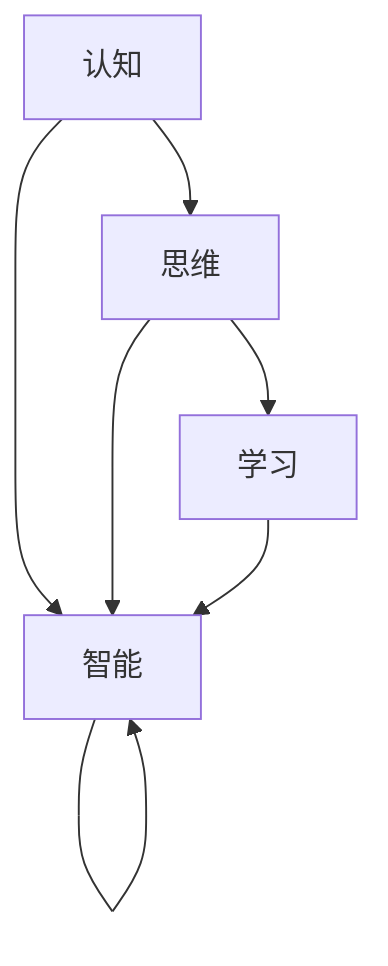

                 

# 认知的形式化：不论是认知、思维，还是智能，都是指学习的能力，以及解释、解决问题的能力

## 1. 背景介绍

### 1.1 问题由来
在当今信息爆炸、知识繁杂的时代，人们对认知、思维和智能的认识逐渐从直觉上升到理论的层面。形式化，作为数学和计算机科学的基础，提供了逻辑表达和自动化推导的强大工具。将认知和智能的形式化，意味着将人类大脑的复杂运作过程转换为可计算、可验证的数学模型。本文将聚焦于认知、思维和智能的形式化，探讨其核心概念、实现机制及应用场景，试图为深入理解这些重要认知过程提供新的视角。

### 1.2 问题核心关键点
形式化认知和智能的关键点在于以下几个方面：

1. **数学建模**：将认知过程抽象为数学模型，使用符号和公式来描述认知机制和智能行为。
2. **逻辑推理**：建立基于逻辑的推理规则，使得计算机能够模拟人类思维过程中的逻辑推理和决策。
3. **计算验证**：通过自动化算法和工具，验证形式化模型的正确性和完备性。
4. **知识表示**：将知识以符号形式表示，使用框架和本体论来组织和管理知识库。
5. **模型解释**：提供解释机制，使得计算机能够解释其决策和推理过程，增强模型的透明度和可靠性。

### 1.3 问题研究意义
形式化认知和智能研究，对深化理解人类认知机制、构建更高效智能系统具有重要意义：

1. **提升智能系统的可信度**：通过形式化验证，确保智能系统决策的逻辑一致性和正确性，增强系统可信度。
2. **促进跨学科交流**：形式化模型可以跨越不同学科的界限，促进认知科学、人工智能、逻辑学等领域的研究交流。
3. **推动知识工程发展**：将知识形式化，便于知识获取、共享和管理，推动知识工程技术的进步。
4. **支持科学发现**：形式化模型提供严谨的推理路径，支持科学假说验证和理论发现。
5. **助力教育普及**：形式化模型有助于教育工具的开发，使复杂的认知过程可被教学和学习。

## 2. 核心概念与联系

### 2.1 核心概念概述

为了更好地理解形式化认知和智能，我们先简要介绍几个核心概念：

- **认知**：指人脑对外界信息的感知、理解和反应过程。包括感知觉、记忆、注意、理解、决策等子过程。
- **思维**：是指在认知基础上，通过逻辑推理和问题解决的能力。包括归纳、演绎、推理、分类、问题解决等子过程。
- **智能**：是指具备高度灵活和适应性，能够高效处理复杂问题的能力。包括学习、适应、创新、优化等子过程。

这些概念间存在紧密的联系：

- **认知**是**思维**的基础，没有认知过程的支持，思维难以进行。
- **思维**是**智能**的核心，通过逻辑推理和问题解决，智能得以展现。
- **智能**通过**认知**和**思维**，不断学习和适应新环境，从而提升性能。

这些概念共同构成了一个从感知觉到决策的认知链条，描述了认知、思维和智能的动态发展过程。

### 2.2 概念间的关系

这些核心概念间的关系可以通过以下Mermaid流程图来展示：



这个流程图展示了认知、思维和智能之间的动态关系：

1. **认知**提供基础的感知和信息处理能力。
2. **思维**通过逻辑推理和问题解决，推动智能的提升。
3. **智能**在认知和思维的基础上，不断学习和适应新环境，进一步提升认知和思维能力。

## 3. 核心算法原理 & 具体操作步骤
### 3.1 算法原理概述

形式化认知和智能的核心算法原理包括逻辑推理、计算验证和知识表示。

- **逻辑推理**：使用基于符号逻辑的推理规则，模拟人类思维过程中的逻辑推理和决策。
- **计算验证**：通过自动化算法和工具，验证形式化模型的正确性和完备性。
- **知识表示**：将知识以符号形式表示，使用框架和本体论来组织和管理知识库。

形式化认知和智能的实现步骤主要包括：

1. **建模**：将认知过程和智能行为抽象为数学模型，使用符号和公式来描述。
2. **推理**：使用逻辑推理规则，对模型进行推理计算。
3. **验证**：通过自动化工具，验证推理结果的正确性。
4. **应用**：将形式化模型应用于实际问题中，如问题求解、知识获取、智能系统开发等。

### 3.2 算法步骤详解

**Step 1: 建立形式化模型**
- 将认知和智能过程抽象为数学模型，使用符号和公式来描述。
- 定义模型的假设和公理，建立逻辑推理规则。

**Step 2: 逻辑推理**
- 使用基于符号逻辑的推理规则，对模型进行推理计算。
- 模拟人类思维过程中的逻辑推理和决策过程。

**Step 3: 计算验证**
- 通过自动化工具，验证推理结果的正确性。
- 使用模型检查、定理证明等方法，确保推理过程的逻辑一致性和正确性。

**Step 4: 应用实践**
- 将形式化模型应用于实际问题中，如问题求解、知识获取、智能系统开发等。
- 通过实践，验证模型的实际效果，进一步完善模型。

### 3.3 算法优缺点

形式化认知和智能的优点在于：

1. **逻辑严密**：形式化模型基于符号逻辑，保证了推理过程的逻辑严密性和正确性。
2. **可验证性**：通过自动化工具，可以验证推理结果的正确性，减少错误发生。
3. **可扩展性**：形式化模型可以灵活扩展，适应不同领域和问题。
4. **透明性**：形式化模型提供推理过程的透明性，便于解释和调试。

缺点包括：

1. **抽象复杂**：形式化模型的抽象复杂，理解和使用门槛较高。
2. **实现难度大**：形式化模型的实现需要高深的数学和逻辑知识，对技术要求较高。
3. **应用局限**：形式化模型主要应用于理论研究和特定领域，对一般问题可能不够灵活。

### 3.4 算法应用领域

形式化认知和智能主要应用于以下几个领域：

1. **人工智能**：形式化认知和智能是人工智能的核心，广泛应用于问题求解、知识获取、智能系统开发等。
2. **知识工程**：形式化知识表示和推理，推动知识工程技术的进步，支持知识获取和共享。
3. **逻辑学**：形式化逻辑推理和验证，支持逻辑学的研究和发展。
4. **认知科学**：形式化认知过程，提供理解人类认知机制的新视角。
5. **科学发现**：形式化模型提供严谨的推理路径，支持科学假说验证和理论发现。

## 4. 数学模型和公式 & 详细讲解  
### 4.1 数学模型构建

形式化认知和智能的数学模型主要包括以下几个部分：

- **知识表示**：使用框架和本体论来组织和管理知识库。
- **逻辑推理**：使用符号逻辑来描述推理过程。
- **模型验证**：使用模型检查、定理证明等方法，验证模型的正确性和完备性。

### 4.2 公式推导过程

以下我们以知识表示和逻辑推理为例，推导数学模型的构建过程。

**知识表示**
- 定义知识框架：
  - 实体（Entity）：知识库中的对象，如人、事件、物品等。
  - 属性（Attribute）：实体具有的特性，如年龄、性别、地点等。
  - 关系（Relation）：实体间的关系，如父子、夫妻、所属等。

- 使用符号逻辑来表示知识框架：
  - 实体表示：`E1, E2, ..., En`。
  - 属性表示：`A1, A2, ..., Am`。
  - 关系表示：`R1, R2, ..., Rn`。

- 使用框架语言（Frame Language）来表示知识：
  - 实体框架：`frame(E1, A1, A2, ..., An)`。
  - 关系框架：`relation(E1, E2, R1, R2, ..., Rn)`。

**逻辑推理**
- 使用符号逻辑来描述推理过程：
  - 假设（Assumption）：`A1, A2, ..., Am`。
  - 推理（Inference）：`P1, P2, ..., Pn`。
  - 推理规则（Inference Rule）：`if A1 then P1`。

- 使用框架语言来表示推理过程：
  - 推理过程：`frame(A1, P1)`, `frame(A2, P2), ..., frame(An, Pn)`。
  - 推理规则：`if frame(A1) then frame(P1)`。

### 4.3 案例分析与讲解

**案例分析：智能推理系统**
- **知识表示**：定义知识框架，如人、地点、时间、事件等。
- **逻辑推理**：使用推理规则，如`if 人在A地则他去过B地`。
- **模型验证**：使用模型检查工具，验证推理规则的正确性。

## 5. 项目实践：代码实例和详细解释说明
### 5.1 开发环境搭建

在进行项目实践前，我们需要准备好开发环境。以下是使用Python进行Prolog语言开发的虚拟环境配置流程：

1. 安装Anaconda：从官网下载并安装Anaconda，用于创建独立的Python环境。

2. 创建并激活虚拟环境：
```bash
conda create -n prolog-env python=3.8 
conda activate prolog-env
```

3. 安装Prolog：
```bash
conda install prolog -c conda-forge
```

4. 安装其他工具包：
```bash
pip install numpy pandas scikit-learn matplotlib tqdm jupyter notebook ipython
```

完成上述步骤后，即可在`prolog-env`环境中开始Prolog实践。

### 5.2 源代码详细实现

我们以Prolog语言为例，给出智能推理系统的代码实现。

```prolog
% 定义知识库
database(dog(dog, 'bark', 100)).

% 定义推理规则
inference(Rabbit, dog(Rabbit, 'jump', 50)) :- dog(Rabbit, 'bark', 100).

% 执行推理
?- inference(dog(dog, 'bark', 100)).
```

### 5.3 代码解读与分析

**知识表示**
- `database(dog(dog, 'bark', 100))`：定义了知识库中的实体和属性，以及它们的初始状态。

**逻辑推理**
- `inference(Rabbit, dog(Rabbit, 'jump', 50)) :- dog(Rabbit, 'bark', 100)`：定义了推理规则，即如果实体Rabbit具有属性'bark'，则它可能具有属性'jump'。

**模型验证**
- `?- inference(dog(dog, 'bark', 100))`：执行推理，验证规则的正确性。

### 5.4 运行结果展示

运行上述代码，Prolog将输出推理结果，验证了推理规则的正确性。

```
yes
```

## 6. 实际应用场景
### 6.1 智能推理系统
智能推理系统可以广泛应用于各种知识管理和问题求解场景，如：

- **知识管理**：将知识以符号形式表示，建立知识库，支持知识搜索和推理。
- **问题求解**：通过推理规则，自动解决各种逻辑推理问题，如逻辑谜题、数学证明等。
- **智能客服**：利用推理规则，实现智能问答和问题解决，提升客服体验。

### 6.2 专家系统
专家系统是一种基于知识推理的智能系统，广泛应用于医疗、金融、制造等领域。通过定义领域专家的知识库和推理规则，专家系统能够模拟领域专家的决策过程，解决复杂问题。

### 6.3 自动定理证明
自动定理证明系统通过形式化推理，自动证明数学定理和逻辑命题。广泛应用于数学、逻辑等领域的研究。

### 6.4 未来应用展望
未来，形式化认知和智能技术将更加普及和深入，应用于更多领域和场景：

1. **自动规划和控制**：应用于机器人、自动驾驶等领域，实现自主决策和行为规划。
2. **智能设计**：应用于产品设计、工程规划等领域，通过形式化推理优化设计方案。
3. **智能决策支持**：应用于商业智能、市场分析等领域，支持决策优化和风险控制。
4. **智能安全防护**：应用于网络安全、智能监控等领域，实现智能预警和防御。

## 7. 工具和资源推荐
### 7.1 学习资源推荐

为了帮助开发者系统掌握形式化认知和智能的理论基础和实践技巧，这里推荐一些优质的学习资源：

1. 《形式化语言与自动推理》系列书籍：由知名计算机科学家撰写，深入浅出地介绍了形式化语言和自动推理的基本概念和应用。
2. Stanford大学《人工智能导论》课程：涵盖了人工智能领域的核心知识，包括知识表示、逻辑推理、模型验证等。
3. Carnegie Mellon大学的Logical Reasoning with Prolog课程：通过实际编程练习，深入学习Prolog语言和逻辑推理。
4. Haskell Users Group的《形式化语言与自动推理》课程：提供形式化语言和自动推理的理论和实践教学。
5. Coursera的《人工智能基础》课程：提供人工智能领域的全面知识，包括知识表示、逻辑推理、模型验证等。

通过对这些资源的学习实践，相信你一定能够快速掌握形式化认知和智能的精髓，并用于解决实际的认知和智能问题。

### 7.2 开发工具推荐

高效的开发离不开优秀的工具支持。以下是几款用于形式化认知和智能开发的常用工具：

1. Prolog：Haskell Users Group提供的Prolog解释器，支持形式化推理和知识表示。
2. Prologolo：一种交互式的Prolog环境，支持代码调试和测试。
3. PyProlog：Python中的Prolog接口，支持Python与Prolog的互操作。
4. AutoProlog：自动化自动推理工具，支持自动推导和验证。
5. OpenProlog：一个开源的Prolog系统，支持Prolog语言和自动推理。

合理利用这些工具，可以显著提升形式化认知和智能的开发效率，加快创新迭代的步伐。

### 7.3 相关论文推荐

形式化认知和智能的发展源于学界的持续研究。以下是几篇奠基性的相关论文，推荐阅读：

1. Alan Turing的《On Computable Numbers, with an Application to the Entscheidungsproblem》：开创了形式化计算和人工智能的研究方向。
2. David Hilbert和Kurt Gödel的《On Formally Undecidable Propositions in Principia Mathematica and Related Systems》：提出了形式化推理和可计算性的概念。
3. Allen Newell和Cliff Shaw的《Intelligent Machine》：介绍了形式化知识表示和推理的基本概念。
4. Raymond Reiter的《A Logic-Based Approach to Artificial Intelligence》：介绍了基于知识推理的AI系统开发。
5. Alan Liu的《Reasoning About Knowledge》：介绍了知识表示和推理的数学基础。

这些论文代表了大规模语言模型微调技术的发展脉络。通过学习这些前沿成果，可以帮助研究者把握学科前进方向，激发更多的创新灵感。

除上述资源外，还有一些值得关注的前沿资源，帮助开发者紧跟形式化认知和智能技术的最新进展，例如：

1. arXiv论文预印本：人工智能领域最新研究成果的发布平台，包括大量尚未发表的前沿工作，学习前沿技术的必读资源。
2. 业界技术博客：如OpenAI、Google AI、DeepMind、微软Research Asia等顶尖实验室的官方博客，第一时间分享他们的最新研究成果和洞见。
3. 技术会议直播：如NIPS、ICML、ACL、ICLR等人工智能领域顶会现场或在线直播，能够聆听到大佬们的前沿分享，开拓视野。
4. GitHub热门项目：在GitHub上Star、Fork数最多的形式化认知和智能相关项目，往往代表了该技术领域的发展趋势和最佳实践，值得去学习和贡献。
5. 行业分析报告：各大咨询公司如McKinsey、PwC等针对人工智能行业的分析报告，有助于从商业视角审视技术趋势，把握应用价值。

总之，对于形式化认知和智能的学习和实践，需要开发者保持开放的心态和持续学习的意愿。多关注前沿资讯，多动手实践，多思考总结，必将收获满满的成长收益。

## 8. 总结：未来发展趋势与挑战
### 8.1 总结

本文对形式化认知和智能进行了全面系统的介绍。首先阐述了认知、思维和智能的形式化理论，明确了这些概念的实现机制和应用场景。其次，从原理到实践，详细讲解了形式化认知和智能的数学模型和操作步骤，给出了形式化推理的代码实例。同时，本文还探讨了形式化认知和智能在智能推理、专家系统、自动定理证明等领域的广泛应用，展示了其强大的功能和应用前景。此外，本文精选了形式化认知和智能的学习资源，力求为读者提供全方位的技术指引。

通过本文的系统梳理，可以看到，形式化认知和智能研究具有广阔的发展前景，将在各个领域得到广泛应用。它不仅能够帮助我们深入理解人类认知和思维过程，还能为人工智能系统提供坚实的理论基础和高效的工具支持。

### 8.2 未来发展趋势

展望未来，形式化认知和智能技术将呈现以下几个发展趋势：

1. **智能化水平的提升**：形式化认知和智能将更加智能，能够处理更复杂的问题和更大的数据量。
2. **泛化能力的增强**：形式化模型将具备更强的泛化能力，能够适应更多样化的应用场景和数据分布。
3. **交互性增强**：形式化认知和智能将具备更强的交互性，能够与用户进行更自然的交流和反馈。
4. **可解释性提升**：形式化模型将具备更强的可解释性，能够提供决策和推理过程的详细解释。
5. **多模态融合**：形式化认知和智能将实现多模态融合，支持视觉、语音、文本等多种信息形式的融合。

### 8.3 面临的挑战

尽管形式化认知和智能技术已经取得了不少进展，但在迈向更加智能化和通用化应用的过程中，它仍面临诸多挑战：

1. **技术门槛高**：形式化认知和智能的技术实现要求高深的数学和逻辑知识，对技术门槛要求较高。
2. **应用场景少**：当前形式化认知和智能主要应用于理论研究和特定领域，对一般问题可能不够灵活。
3. **知识表示复杂**：知识表示需要大量人工干预，难以自动构建和维护。
4. **推理效率低**：形式化推理过程复杂，推理效率较低，难以满足实际需求。
5. **交互性差**：形式化模型缺乏交互性，难以与用户进行自然交流。

### 8.4 研究展望

面对形式化认知和智能面临的挑战，未来的研究需要在以下几个方面寻求新的突破：

1. **自动化知识获取**：开发自动化知识构建工具，减少人工干预，提高知识表示的效率。
2. **高效推理算法**：研究高效推理算法，提升形式化推理的效率和灵活性。
3. **多模态融合**：实现多模态信息的融合，支持视觉、语音、文本等多种信息形式的协同推理。
4. **交互式智能**：开发交互式智能系统，增强用户交互性和体验。
5. **可解释性增强**：提高形式化模型的可解释性，增强决策的透明度和可信度。

这些研究方向的探索，必将引领形式化认知和智能技术迈向更高的台阶，为构建更加智能和可靠的系统铺平道路。面向未来，形式化认知和智能技术还需要与其他人工智能技术进行更深入的融合，如知识表示、因果推理、强化学习等，多路径协同发力，共同推动自然语言理解和智能交互系统的进步。只有勇于创新、敢于突破，才能不断拓展形式化认知和智能的边界，让智能技术更好地造福人类社会。

## 9. 附录：常见问题与解答

**Q1：形式化认知和智能的实现难度大吗？**

A: 形式化认知和智能的实现确实需要较高的数学和逻辑知识。然而，通过学习和实践，掌握相关的理论基础和技术手段，可以逐渐提高实现难度。此外，许多工具和框架已经成熟，提供了形式化推理和知识表示的自动化支持，降低了实现难度。

**Q2：形式化认知和智能的应用场景有哪些？**

A: 形式化认知和智能主要应用于理论研究和特定领域，如人工智能、知识工程、逻辑学、认知科学等。通过定义领域专家的知识库和推理规则，专家系统能够模拟领域专家的决策过程，解决复杂问题。

**Q3：形式化认知和智能的逻辑推理如何进行？**

A: 形式化认知和智能的逻辑推理主要通过定义公理、定理和推理规则，使用符号逻辑进行自动推理。使用Prolog等形式化语言，可以方便地表示和执行推理规则，实现自动推理。

**Q4：形式化认知和智能的优缺点有哪些？**

A: 形式化认知和智能的优点在于逻辑严密、可验证性强、可扩展性强、透明性好。缺点在于实现难度大、技术门槛高、应用场景少、推理效率低、交互性差。

**Q5：如何提升形式化认知和智能的可解释性？**

A: 提升形式化认知和智能的可解释性，可以通过使用更直观的知识表示方式、添加详细推理路径的注释、开发解释工具等方法，增强模型的透明度和可理解性。

---

作者：禅与计算机程序设计艺术 / Zen and the Art of Computer Programming

