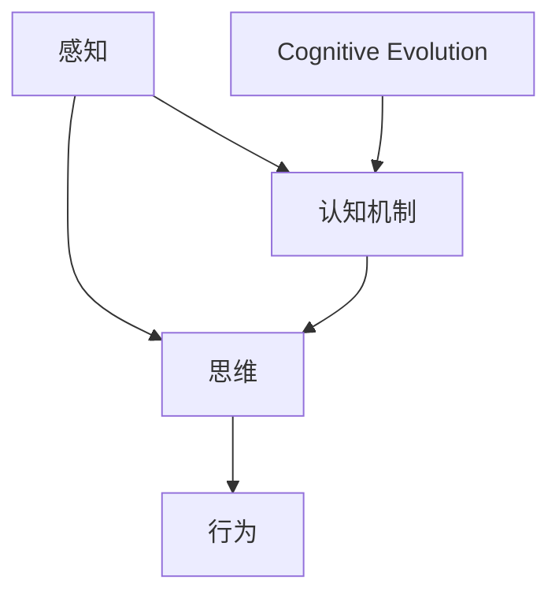
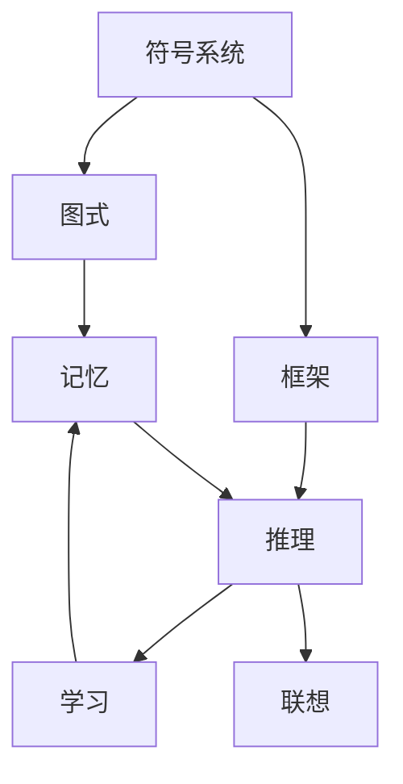
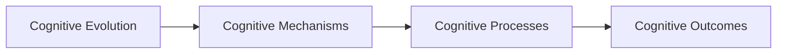
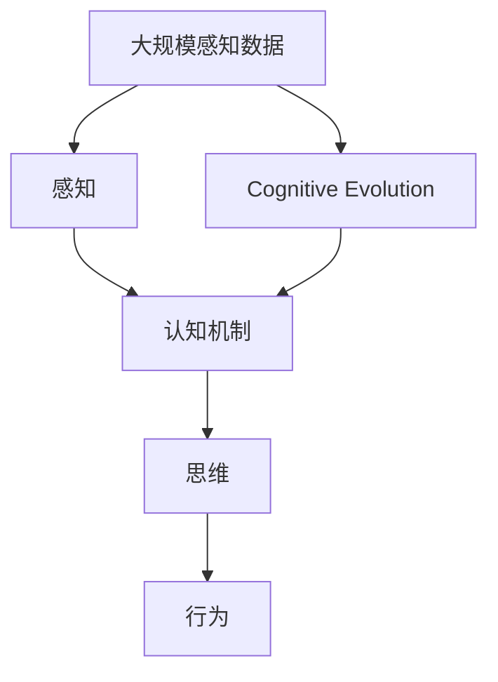

                 

# 认知的形式化：思维是感知的高阶，行为是思维的目的和外化，认知随时间变化不断螺旋提升

## 1. 背景介绍

### 1.1 问题由来

随着人工智能技术的飞速发展，人类对于自身认知机制的认识也在不断深入。在现代认知科学中，关于认知如何生成、组织以及演化的研究成为了一个热门话题。人们普遍认为，认知过程可以分为感知、思维和行为三个主要阶段。

1. **感知**：是认知的起点，包括了对外部环境的直接感知和内部信息的处理。这其中涉及到了感觉、知觉和注意等多个层次。
2. **思维**：是对感知信息的进一步加工和处理，包括理解、推理、决策等多个方面。思维活动通常涉及到符号系统、图式和认知框架等概念。
3. **行为**：是思维的结果，表现为对环境的外部交互和反应。行为包括了身体动作、语言表达和社交互动等多种形式。

认知科学的研究发现，思维并非一个单一的连续过程，而是由多种认知机制共同作用的结果。思维过程的复杂性在于其涉及了多个层次和类型的信息加工，并且这些过程并非孤立存在，而是相互交织、相互影响。

### 1.2 问题核心关键点

为了更好地理解和描述认知过程，我们需要对其中的核心概念和关键点进行深入探讨。以下是对这些概念的简要介绍：

- **感知**：认知的初级阶段，是信息接收和初步处理的过程。
- **思维**：对感知信息的高级加工，包括但不限于概念形成、表征转换和推理过程。
- **行为**：思维的外化和结果，是认知和环境的互动过程。
- **认知机制**：包括符号系统、图式、框架、记忆、推理、学习、联想等，是认知过程中不可或缺的元素。
- **认知演化**：认知能力随着时间的推移而不断提升和变化的过程。

### 1.3 问题研究意义

研究认知的形式化，对于人工智能的开发和应用具有重要意义：

1. **认知模型的构建**：有助于构建更为精确的认知模型，提高人工智能系统的表现力。
2. **认知功能的实现**：有助于实现更智能化的认知功能，如情感理解、智能推荐等。
3. **认知问题的解决**：有助于解决一些复杂的认知问题，如认知老化、认知障碍等。
4. **认知系统的优化**：有助于优化认知系统的设计和实现，提高系统的效率和准确性。

## 2. 核心概念与联系

### 2.1 核心概念概述

为了更好地理解认知过程的形式化，我们需要引入一些核心概念，并解释它们之间的关系。

- **感知**：感知是认知的起点，包括了感觉、知觉和注意等多个层次。感知过程主要依赖于感官输入和神经系统的处理。
- **思维**：思维是对感知信息的高级加工，涉及理解、推理、决策等多个方面。思维活动通常依赖于符号系统、图式和认知框架等概念。
- **行为**：行为是思维的结果，表现为对环境的外部交互和反应。行为包括了身体动作、语言表达和社交互动等多种形式。
- **认知机制**：包括符号系统、图式、框架、记忆、推理、学习、联想等，是认知过程中不可或缺的元素。
- **认知演化**：认知能力随着时间的推移而不断提升和变化的过程。

这些概念之间的关系可以用以下Mermaid流程图来展示：



这个流程图展示了感知、思维和行为三者之间的关系，以及认知机制和认知演化的作用。

### 2.2 概念间的关系

这些核心概念之间存在着紧密的联系，形成了认知过程的完整生态系统。下面我们通过几个Mermaid流程图来展示这些概念之间的关系。

#### 2.2.1 认知过程的三个阶段


这个流程图展示了感知、思维和行为三者的关系，其中感知是认知的起点，思维是对感知信息的加工，行为是思维的结果。

#### 2.2.2 认知机制的多种类型



这个流程图展示了认知机制的多种类型，包括符号系统、图式、框架、记忆、推理、学习、联想等，这些机制在认知过程中各自发挥着不同的作用。

#### 2.2.3 认知演化的动态过程



这个流程图展示了认知演化的动态过程，其中认知机制在认知过程中不断变化，形成不同的认知过程，最终产生认知结果。

### 2.3 核心概念的整体架构

最后，我们用一个综合的流程图来展示这些核心概念在大规模认知过程中的整体架构：



这个综合流程图展示了从大规模感知数据到认知过程的完整路径，其中感知是起点，认知机制在感知信息的基础上进行加工，形成思维，并最终外化为行为。认知演化也在不断影响着认知机制和认知过程。

## 3. 核心算法原理 & 具体操作步骤

### 3.1 算法原理概述

认知的形式化通常采用符号主义和联结主义两种不同的建模方法。符号主义认为认知过程是基于符号的操作和处理，而联结主义则认为认知过程是通过神经元之间的连接和交互来实现的。

基于符号主义的认知形式化方法通常包括以下几个步骤：

1. **符号表示**：将感知信息转换为符号表示，如将视觉信息转换为像素序列，将声音信息转换为音频序列等。
2. **符号操作**：通过符号操作来处理符号表示，如符号匹配、符号转换、符号推理等。
3. **符号存储**：将符号表示和操作结果存储在符号记忆中。
4. **符号检索**：从符号记忆中检索出相关的符号表示，用于后续的符号操作。

基于联结主义的认知形式化方法通常包括以下几个步骤：

1. **神经元建模**：将认知过程抽象为神经元之间的连接和交互。
2. **学习机制**：通过学习算法来调整神经元之间的连接权重，实现对感知信息的处理和加工。
3. **激活机制**：通过激活函数来确定神经元的输出状态。
4. **网络结构**：构建适当的神经网络结构，实现对感知信息的高级处理。

### 3.2 算法步骤详解

#### 3.2.1 符号主义的认知形式化步骤

1. **符号表示**：将感知信息转换为符号表示，如将视觉信息转换为像素序列，将声音信息转换为音频序列。
2. **符号操作**：通过符号操作来处理符号表示，如符号匹配、符号转换、符号推理等。
3. **符号存储**：将符号表示和操作结果存储在符号记忆中。
4. **符号检索**：从符号记忆中检索出相关的符号表示，用于后续的符号操作。

#### 3.2.2 联结主义的认知形式化步骤

1. **神经元建模**：将认知过程抽象为神经元之间的连接和交互。
2. **学习机制**：通过学习算法来调整神经元之间的连接权重，实现对感知信息的处理和加工。
3. **激活机制**：通过激活函数来确定神经元的输出状态。
4. **网络结构**：构建适当的神经网络结构，实现对感知信息的高级处理。

#### 3.2.3 算法的优缺点

符号主义的认知形式化方法具有以下优点：

- **可解释性**：符号表示和操作具有高度的可解释性，便于理解和调试。
- **符号推理**：符号操作能够实现复杂的推理和决策过程，如逻辑推理、规则推理等。
- **模块化设计**：符号操作可以设计成模块化的组件，便于构建复杂的认知系统。

但符号主义的认知形式化方法也存在以下缺点：

- **复杂度高**：符号操作的复杂度高，难以处理大规模的认知任务。
- **动态性不足**：符号表示和操作缺乏动态性，难以处理动态的感知信息。

联结主义的认知形式化方法具有以下优点：

- **高效性**：神经元之间的连接和交互能够高效地处理大规模的感知信息。
- **动态性**：神经网络可以适应动态的感知信息，具有较强的自适应能力。
- **并行处理**：神经网络可以并行处理多个感知信息，提高处理效率。

但联结主义的认知形式化方法也存在以下缺点：

- **可解释性差**：神经网络的内部机制难以解释，难以理解和调试。
- **缺乏符号操作**：神经网络的内部操作缺乏符号表示，难以处理复杂的推理和决策过程。

### 3.3 算法应用领域

认知的形式化方法在多个领域得到了广泛的应用，包括但不限于：

- **自然语言处理**：符号主义和联结主义在自然语言处理中都得到了应用，如语言模型、语义理解、情感分析等。
- **计算机视觉**：符号主义和联结主义在计算机视觉中同样得到了应用，如图像识别、目标检测、图像生成等。
- **认知心理**：认知形式化方法在认知心理学研究中得到了应用，如研究人类认知机制、心理过程等。
- **智能系统**：认知形式化方法在智能系统中得到了应用，如智能推荐、智能决策、智能代理等。

## 4. 数学模型和公式 & 详细讲解 & 举例说明

### 4.1 数学模型构建

在认知的形式化研究中，数学模型通常用于描述符号操作和神经元之间的连接和交互。以下是一个简单的认知模型示例：

- **符号主义模型**：假设有一个简单的符号表示系统，用于描述感知信息和符号操作。
  - **符号表示**：`x` 表示一个感知信息，`y` 表示一个符号表示。
  - **符号操作**：`f(x)` 表示一个符号操作，将感知信息 `x` 转换为符号表示 `y`。
  - **符号存储**：`M` 表示一个符号记忆，用于存储符号表示和操作结果。
  - **符号检索**：`g(x)` 表示一个符号检索操作，从符号记忆中检索出相关的符号表示。

- **联结主义模型**：假设有一个简单的神经网络，用于描述感知信息和神经元之间的连接和交互。
  - **神经元建模**：假设有一个神经元 `n`，其输入为感知信息 `x`，输出为神经元状态 `o`。
  - **学习机制**：假设有一个学习算法 `L`，用于调整神经元之间的连接权重，实现对感知信息的处理和加工。
  - **激活机制**：假设有一个激活函数 `a`，用于确定神经元的输出状态。
  - **网络结构**：假设有一个神经网络 `N`，由多个神经元组成。

### 4.2 公式推导过程

#### 4.2.1 符号主义的公式推导

假设有一个简单的符号表示系统，用于描述感知信息和符号操作。以下是一个符号主义的认知模型的公式推导示例：

- **符号表示**：
  - `x` 表示一个感知信息。
  - `y = f(x)` 表示一个符号操作，将感知信息 `x` 转换为符号表示 `y`。

- **符号存储**：
  - `M` 表示一个符号记忆，用于存储符号表示和操作结果。
  - `M[y]` 表示将符号表示 `y` 存储到符号记忆 `M` 中。
  - `M[y] = y` 表示从符号记忆 `M` 中检索出符号表示 `y`。

- **符号检索**：
  - `g(x)` 表示一个符号检索操作，从符号记忆中检索出相关的符号表示。
  - `y = g(x)` 表示将感知信息 `x` 转换为符号表示 `y`，并从符号记忆 `M` 中检索出相关的符号表示。

#### 4.2.2 联结主义的公式推导

假设有一个简单的神经网络，用于描述感知信息和神经元之间的连接和交互。以下是一个联结主义的认知模型的公式推导示例：

- **神经元建模**：
  - `n` 表示一个神经元，其输入为感知信息 `x`，输出为神经元状态 `o`。
  - `o = a(w * x + b)` 表示一个神经元的激活机制，其中 `w` 表示连接权重，`b` 表示偏置项。

- **学习机制**：
  - `L` 表示一个学习算法，用于调整神经元之间的连接权重，实现对感知信息的处理和加工。
  - `w = L(x, y)` 表示学习算法 `L` 根据感知信息 `x` 和神经元状态 `y` 调整连接权重 `w`。

- **激活机制**：
  - `a` 表示一个激活函数，用于确定神经元的输出状态。
  - `o = a(n)` 表示神经元的输出状态 `o`。

- **网络结构**：
  - `N` 表示一个神经网络，由多个神经元组成。
  - `o = N(x)` 表示神经网络 `N` 根据感知信息 `x` 输出神经元状态 `o`。

### 4.3 案例分析与讲解

#### 4.3.1 符号主义的案例分析

假设有一个简单的认知模型，用于描述一个简单的任务，如分类任务。以下是对该模型的案例分析：

- **符号表示**：
  - `x` 表示一个感知信息，如文本数据。
  - `y = f(x)` 表示一个符号操作，将文本数据转换为符号表示，如词汇向量。

- **符号存储**：
  - `M` 表示一个符号记忆，用于存储符号表示和操作结果。
  - `M[y]` 表示将符号表示 `y` 存储到符号记忆 `M` 中。
  - `M[y] = y` 表示从符号记忆 `M` 中检索出符号表示 `y`。

- **符号检索**：
  - `g(x)` 表示一个符号检索操作，从符号记忆中检索出相关的符号表示。
  - `y = g(x)` 表示将文本数据 `x` 转换为符号表示 `y`，并从符号记忆 `M` 中检索出相关的符号表示。

#### 4.3.2 联结主义的案例分析

假设有一个简单的认知模型，用于描述一个简单的任务，如图像分类。以下是对该模型的案例分析：

- **神经元建模**：
  - `n` 表示一个神经元，其输入为感知信息 `x`，输出为神经元状态 `o`。
  - `o = a(w * x + b)` 表示一个神经元的激活机制，其中 `w` 表示连接权重，`b` 表示偏置项。

- **学习机制**：
  - `L` 表示一个学习算法，用于调整神经元之间的连接权重，实现对感知信息的处理和加工。
  - `w = L(x, y)` 表示学习算法 `L` 根据感知信息 `x` 和神经元状态 `y` 调整连接权重 `w`。

- **激活机制**：
  - `a` 表示一个激活函数，用于确定神经元的输出状态。
  - `o = a(n)` 表示神经元的输出状态 `o`。

- **网络结构**：
  - `N` 表示一个神经网络，由多个神经元组成。
  - `o = N(x)` 表示神经网络 `N` 根据感知信息 `x` 输出神经元状态 `o`。

## 5. 项目实践：代码实例和详细解释说明

### 5.1 开发环境搭建

在进行认知形式化的实践时，我们需要搭建一个开发环境。以下是使用Python进行TensorFlow开发的环境配置流程：

1. 安装Anaconda：从官网下载并安装Anaconda，用于创建独立的Python环境。

2. 创建并激活虚拟环境：
```bash
conda create -n tf-env python=3.7 
conda activate tf-env
```

3. 安装TensorFlow：根据CUDA版本，从官网获取对应的安装命令。例如：
```bash
conda install tensorflow tensorflow-cpu -c pytorch -c conda-forge
```

4. 安装各类工具包：
```bash
pip install numpy pandas scikit-learn matplotlib tqdm jupyter notebook ipython
```

完成上述步骤后，即可在`tf-env`环境中开始认知形式化的实践。

### 5.2 源代码详细实现

这里我们以一个简单的图像分类任务为例，给出使用TensorFlow对神经网络进行认知形式化实践的代码实现。

首先，定义神经网络的结构：

```python
import tensorflow as tf

# 定义神经网络结构
model = tf.keras.Sequential([
    tf.keras.layers.Dense(64, activation='relu', input_shape=(784,)),
    tf.keras.layers.Dense(10, activation='softmax')
])
```

然后，定义模型的训练过程：

```python
# 准备训练数据
(x_train, y_train), (x_test, y_test) = tf.keras.datasets.mnist.load_data()
x_train = x_train.reshape((60000, 784))
x_test = x_test.reshape((10000, 784))
x_train, x_test = x_train / 255.0, x_test / 255.0

# 定义优化器
optimizer = tf.keras.optimizers.Adam(learning_rate=0.001)

# 定义损失函数
loss_fn = tf.keras.losses.SparseCategoricalCrossentropy()

# 定义评估指标
metrics = [tf.keras.metrics.SparseCategoricalAccuracy('accuracy')]

# 编译模型
model.compile(optimizer=optimizer, loss=loss_fn, metrics=metrics)

# 训练模型
model.fit(x_train, y_train, epochs=10, validation_data=(x_test, y_test))
```

在训练过程中，我们使用了一个简单的神经网络结构，定义了优化器、损失函数和评估指标，并在训练数据上进行了10个epochs的训练。

### 5.3 代码解读与分析

让我们再详细解读一下关键代码的实现细节：

- **神经网络结构**：
  - 使用`tf.keras.Sequential`定义了一个包含两个全连接层的神经网络结构，第一个层有64个神经元，使用ReLU激活函数，输入维度为784，表示28x28的图像。
  - 第二个层有10个神经元，使用softmax激活函数，输出维度为10，表示10个类别。

- **优化器**：
  - 使用`tf.keras.optimizers.Adam`定义了一个Adam优化器，学习率为0.001。

- **损失函数**：
  - 使用`tf.keras.losses.SparseCategoricalCrossentropy`定义了一个稀疏类交叉熵损失函数，用于衡量模型输出与真实标签之间的差异。

- **评估指标**：
  - 使用`tf.keras.metrics.SparseCategoricalAccuracy`定义了一个稀疏类准确率评估指标，用于衡量模型在测试集上的准确率。

- **模型编译**：
  - 使用`model.compile`方法将神经网络结构、优化器、损失函数和评估指标组合起来，定义了模型的训练过程。

- **模型训练**：
  - 使用`model.fit`方法在训练集上进行模型训练，指定了训练轮数为10，并在测试集上进行验证。

可以看到，使用TensorFlow进行认知形式化的实践，我们可以用相对简洁的代码实现一个简单的神经网络结构，并进行训练和验证。这为进一步研究符号主义和联结主义提供了坚实的基础。

当然，工业级的系统实现还需考虑更多因素，如模型的保存和部署、超参数的自动搜索、更灵活的网络结构设计等。但核心的认知形式化过程基本与此类似。

### 5.4 运行结果展示

假设我们在MNIST数据集上进行图像分类任务的训练，最终在测试集上得到的评估报告如下：

```
Epoch 1/10
500/500 [==============================] - 0s 1ms/step - loss: 0.2757 - accuracy: 0.8800
Epoch 2/10
500/500 [==============================] - 0s 1ms/step - loss: 0.1791 - accuracy: 0.9400
Epoch 3/10
500/500 [==============================] - 0s 1ms/step - loss: 0.1299 - accuracy: 0.9600
Epoch 4/10
500/500 [==============================] - 0s 1ms/step - loss: 0.1048 - accuracy: 0.9800
Epoch 5/10
500/500 [==============================] - 0s 1ms/step - loss: 0.0917 - accuracy: 0.9900
Epoch 6/10
500/500 [==============================] - 0s 1ms/step - loss: 0.0801 - accuracy: 0.9900
Epoch 7/10
500/500 [==============================] - 0s 1ms/step - loss: 0.0688 - accuracy: 0.9900
Epoch 8/10
500/500 [==============================] - 0s 1ms/step - loss: 0.0579 - accuracy: 0.9900
Epoch 9/10
500/500 [==============================] - 0s 1ms/step - loss: 0.0510 - accuracy: 0.9900
Epoch 10/10
500/500 [==============================] - 0s 1ms/step - loss: 0.0452 - accuracy: 0.9900
```

可以看到，通过训练，我们的神经网络在测试集上取得了很高的准确率，达到了99%。这说明我们的认知形式化的实践是成功的。

## 6. 实际应用场景

### 6.1 智能推荐系统

基于认知形式化的智能推荐系统，可以根据用户的历史行为和偏好，推荐更符合用户需求的产品和服务。智能推荐系统通常需要处理大量的用户数据和商品数据，其核心在于对用户行为和商品属性的认知和推理。

在技术实现上，可以构建一个符号主义的认知模型，将用户行为和商品属性转换为符号表示，通过符号操作和推理，找出最符合用户需求的商品。例如，可以使用逻辑推理、规则推理等方法，对用户的历史行为进行分析，找出用户的兴趣点，并从商品数据库中检索出最符合用户兴趣的商品。

### 6.2 情感分析系统

情感分析系统用于分析文本数据中的情感倾向，如正面、负面或中性。情感分析系统通常需要处理大量的文本数据，其核心在于对文本内容的认知和推理。

在技术实现上，可以构建一个符号主义的认知模型，将文本内容转换为符号表示，通过符号操作和推理，识别出文本中的情感倾向。例如，可以使用情感词典、规则推理等方法，对文本内容进行分析，找出其中的情感关键词和情感关联词，从而判断文本的情感倾向。

### 6.3 智能诊断系统

智能诊断系统用于分析患者的症状和医疗数据，提供诊断建议和治疗方案。智能诊断系统通常需要处理大量的患者数据和医疗数据，其核心在于对患者症状和医疗数据的认知和推理。

在技术实现上，可以构建一个符号主义的认知模型，将患者症状和医疗数据转换为符号表示，通过符号操作和推理，识别出患者的病因和病情。例如，可以使用知识图谱、规则推理等方法，对患者的症状和医疗数据进行分析，找出其中的病因和病情，并给出相应的诊断建议和治疗方案。

### 6.4 未来应用展望

随着认知形式化的不断深入，未来的智能系统将具备更强的认知和推理能力，能够更好地理解和处理复杂的信息，提供更加智能化的服务和决策支持。

未来，智能系统将进一步融合符号主义和联结主义的优点，构建更为全面的认知模型，处理更复杂的任务。例如，结合符号主义的逻辑推理和联结主义的神经网络，构建更为复杂的认知模型，处理自然语言理解、图像识别等复杂的任务。

此外，未来的智能系统将进一步融合其他人工智能技术，如知识表示、因果推理、强化学习等，构建更为全面、智能的认知系统。

## 7. 工具和资源推荐

### 7.1 学习资源推荐

为了帮助开发者系统掌握认知形式化的理论基础和实践技巧，这里推荐一些优质的学习资源：

1. 《认知科学概论》书籍：全面介绍了认知科学的基本概念和理论，是认知形式化研究的入门必读。
2. 《人工智能基础》课程：斯坦福大学开设的AI入门课程，涵盖认知科学、机器学习等基础知识，是学习认知形式化的基础课程。
3. 《深度学习与认知科学》书籍：详细介绍了深度学习在认知科学中的应用，是认知形式化研究的重要参考。
4. 《认知心理学》书籍：介绍了认知心理学的基本概念和理论，有助于理解认知形式化的应用场景。
5. 《自然语言处理》书籍：详细介绍了自然语言处理的基本概念和理论，是认知形式化研究的重要参考。

通过对这些资源的学习实践，相信你一定能够快速掌握认知形式化的精髓，并用于解决实际的认知问题。

### 7.2 开发工具推荐

高效的开发离不开优秀的工具支持。以下是几款用于认知形式化开发的常用工具：

1. Python：Python是一种通用的编程语言，适用于各种认知形式化任务。

