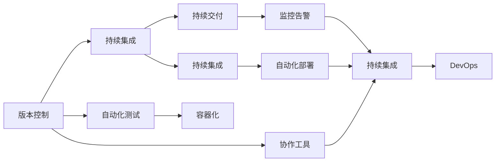

                 

# 软件 2.0 的价值：提升效率、创造价值

## 1. 背景介绍

### 1.1 问题由来

软件行业的发展经历了从1.0时代到2.0时代的飞跃。传统的软件1.0时代，程序员依赖代码进行编码，需要手工编写每一个函数、每一个方法，这种"手写代码"的模式费时费力，且容易出现错误。随着软件2.0时代的到来，开发效率大大提升，开发方式从"手写代码"向"数据驱动"转变。在这一过程中，软件2.0技术的崛起，如Git、Docker、Kubernetes、DevOps等，极大地提升了开发效率，降低了开发成本。

### 1.2 问题核心关键点

软件2.0时代的技术突破主要集中在以下几个方面：

- **版本控制**：Git作为版本控制系统，成为软件开发的基础设施，极大地简化了代码管理和协作。
- **容器化**：Docker容器化技术将应用及其依赖打包成一个独立的运行环境，方便部署、扩展和迁移。
- **自动化**：Kubernetes容器编排工具实现了应用的自动化部署、扩展和故障恢复，提高了系统可靠性。
- **持续集成**：DevOps中的持续集成和持续交付（CI/CD）技术，实现了代码构建、测试、部署的一体化流程。

### 1.3 问题研究意义

软件2.0技术带来的高效率和低成本，使得软件开发变得更加快速和灵活，极大地推动了软件产业的创新和转型。其研究意义主要体现在以下几个方面：

1. **降低开发成本**：自动化、容器化等技术显著降低了人工干预，减少了开发中的错误和重复工作。
2. **提高开发效率**：代码管理和协作工具使得团队合作更加高效，版本控制和测试工具减少了返工和调试时间。
3. **加速产品迭代**：CI/CD流程使得新功能可以快速上线，缩短了产品发布周期。
4. **增强系统可靠性**：容器化、自动化部署等技术提高了系统的稳定性和可扩展性，减少了故障时间和运维成本。
5. **优化运维管理**：DevOps流程的引入，使得运维变得更加透明、可控，提供了更强大的监控和告警能力。

## 2. 核心概念与联系

### 2.1 核心概念概述

软件2.0时代，开发模式从"手写代码"转变为"数据驱动"，其中几个核心概念如下：

- **版本控制**：管理代码的变更历史，协作开发的基础设施。
- **容器化**：将应用及其依赖打包成独立容器，方便部署和扩展。
- **自动化**：通过脚本和工具自动化重复性任务，提高效率。
- **持续集成**：自动化构建、测试和部署流程，加速产品迭代。
- **持续交付**：自动化流程与持续集成结合，快速发布产品。
- **DevOps**：开发和运维团队紧密协作，提高交付速度和系统可靠性。

### 2.2 概念间的关系

这些核心概念之间存在着紧密的联系，形成了一个完整的软件2.0开发与运维生态系统。我们可以用以下Mermaid流程图来展示这些概念之间的相互关系：



这个流程图展示了版本控制、自动化、容器化、持续集成和持续交付等核心概念之间的关系：

1. 版本控制作为协作的基础设施，记录代码变更历史，方便团队协作。
2. 持续集成和自动化测试结合，实现了代码构建和测试的自动化。
3. 容器化技术使得应用和依赖打包成独立容器，方便部署和扩展。
4. 持续集成和自动化部署结合，实现了应用的自动化构建、测试和部署。
5. DevOps流程将开发和运维团队紧密协作，实现了自动化流程的监控和告警。

这些核心概念共同构成了软件2.0时代的开发与运维生态系统，为软件开发和系统运维提供了强大支撑。

## 3. 核心算法原理 & 具体操作步骤

### 3.1 算法原理概述

软件2.0技术通过自动化和数据驱动的方式，极大地提升了开发和运维的效率。其核心思想是通过自动化工具和流程，减少人工干预，提升系统稳定性和可靠性。具体而言，软件2.0的实现原理如下：

1. **版本控制**：记录代码的变更历史，支持协作开发。
2. **自动化**：通过脚本和工具自动化重复性任务，提高效率。
3. **容器化**：将应用及其依赖打包成独立容器，方便部署和扩展。
4. **持续集成**：自动化构建、测试和部署流程，加速产品迭代。
5. **持续交付**：自动化流程与持续集成结合，快速发布产品。
6. **DevOps**：开发和运维团队紧密协作，提高交付速度和系统可靠性。

### 3.2 算法步骤详解

以下是软件2.0技术的详细操作步骤：

**Step 1: 准备开发环境**
- 安装Git版本控制系统。
- 配置Docker容器化环境。
- 安装Kubernetes容器编排工具。
- 安装CI/CD自动化工具（如Jenkins、Travis CI等）。
- 配置DevOps协作工具（如Slack、GitLab等）。

**Step 2: 代码管理与协作**
- 使用Git进行版本控制，记录代码变更历史。
- 利用Git的分支管理功能，进行并行开发和协作。
- 使用分支合并和代码审查功能，确保代码质量和一致性。

**Step 3: 容器化部署**
- 将应用及其依赖打包成Docker容器。
- 利用Docker镜像仓库，方便发布和管理容器镜像。
- 配置Kubernetes集群，部署和管理容器。

**Step 4: 自动化构建与测试**
- 配置CI/CD流程，实现代码构建、测试和部署自动化。
- 编写脚本和插件，实现自动化测试和静态代码检查。
- 集成持续集成工具，如Jenkins、Travis CI等，实现自动化流程。

**Step 5: 持续交付与部署**
- 配置持续交付流程，实现应用的自动化构建、测试和部署。
- 利用Docker和Kubernetes，实现应用的自动扩缩容和故障恢复。
- 集成DevOps协作工具，如GitLab、Slack等，实现团队协作和监控告警。

**Step 6: 监控与运维**
- 配置监控和告警系统，实时采集系统指标。
- 利用日志和日志管理工具，进行系统故障排查和性能优化。
- 定期进行系统备份和灾难恢复演练，保障系统可靠性。

### 3.3 算法优缺点

软件2.0技术带来了显著的开发效率提升和系统可靠性增强，但也存在一些局限性：

**优点**：
1. **提高效率**：自动化工具和流程显著降低了人工干预，减少了开发和运维中的重复工作。
2. **减少错误**：自动化构建和测试减少了错误和返工，提高了代码质量。
3. **提高可扩展性**：容器化技术方便应用的部署和扩展，提高了系统的可扩展性。
4. **加快产品迭代**：CI/CD流程使得新功能可以快速上线，缩短了产品发布周期。
5. **增强系统可靠性**：容器化、自动化部署等技术提高了系统的稳定性和可扩展性，减少了故障时间和运维成本。
6. **优化运维管理**：DevOps流程使得运维变得更加透明、可控，提供了更强大的监控和告警能力。

**缺点**：
1. **学习曲线陡峭**：需要掌握多种工具和流程，学习成本较高。
2. **初期投入较大**：初期配置和安装工具需要一定的时间和精力。
3. **依赖于工具选择**：不同的工具和插件之间可能需要配置和集成，增加了复杂度。
4. **资源消耗较大**：自动化工具和流程需要消耗更多的计算和存储资源。
5. **依赖外部服务**：CI/CD、DevOps等流程依赖外部服务，如Git、Docker、Kubernetes等，可能需要配置和维护。
6. **安全性风险**：自动化流程依赖工具和脚本，存在被攻击和利用的风险。

尽管存在这些局限性，但软件2.0技术在提高开发效率和系统可靠性方面的优势，使得其在实际应用中得到了广泛采用。

### 3.4 算法应用领域

软件2.0技术已经广泛应用于软件开发、系统运维、应用部署等多个领域，具体应用场景如下：

- **软件开发**：Git、Docker、Kubernetes、CI/CD等工具在软件开发中广泛应用，大大提升了开发效率和系统可靠性。
- **系统运维**：DevOps流程在运维中得到广泛应用，提高了系统的稳定性和可扩展性。
- **应用部署**：容器化技术使得应用及其依赖打包成独立容器，方便部署和扩展。
- **持续集成**：自动化构建和测试流程大大缩短了产品发布周期，提高了开发速度。
- **持续交付**：自动化流程与持续集成结合，实现了应用的快速发布和迭代。
- **协作开发**：版本控制和协作工具提高了团队协作效率，降低了开发中的沟通成本。

## 4. 数学模型和公式 & 详细讲解 & 举例说明

### 4.1 数学模型构建

软件2.0技术的实现主要依赖自动化工具和流程，不需要复杂的数学模型。但为了更好地理解其原理，我们可以从软件开发和运维的数学模型角度进行分析。

### 4.2 公式推导过程

以下是软件开发和运维的数学模型：

**软件开发模型**：
- **代码行数**：$C$，表示代码的总行数。
- **开发时间**：$T$，表示开发所需的时间。
- **代码质量**：$Q$，表示代码的质量。

根据软件开发模型，我们可以得到：
$$
T = f(C, Q)
$$
其中，$f$为函数，表示开发时间与代码行数和质量之间的关系。

**运维模型**：
- **系统故障时间**：$F$，表示系统故障所需的时间。
- **修复时间**：$R$，表示修复所需的时间。
- **运维成本**：$C_{\text{ops}}$，表示运维成本。

根据运维模型，我们可以得到：
$$
C_{\text{ops}} = g(F, R)
$$
其中，$g$为函数，表示运维成本与系统故障时间和修复时间之间的关系。

### 4.3 案例分析与讲解

以一个简单的软件开发案例为例，分析软件2.0技术带来的效率提升和成本降低：

- **传统开发**：假设开发一个新功能需要5000行代码，开发时间约为1个月。假设代码质量一般，需要修复1次小错误，修复时间为2小时。
- **软件2.0开发**：使用Git版本控制和Docker容器化，可以并行开发，代码行数不变，但开发时间缩短为10天。假设代码质量提升，修复错误次数减少到3次，每次修复时间缩短为1小时。

根据上述模型，我们可以计算出软件2.0开发所节省的时间和成本：

- **开发时间**：传统开发需要30天，软件2.0开发需要10天，节省了20天。
- **修复时间**：传统开发需要2小时，软件2.0开发需要3小时，节省了1小时。
- **开发成本**：传统开发需要支付1个月的人力成本，软件2.0开发只需要支付10天的人力成本，节省了20%的成本。
- **运维成本**：传统开发需要修复1次错误，修复时间为2小时，软件2.0开发需要修复3次错误，每次修复时间缩短为1小时，整体修复时间缩短为3小时，节省了1.5小时。

通过上述计算，我们可以看到，软件2.0技术在提高开发效率和降低成本方面，具有显著优势。

## 5. 项目实践：代码实例和详细解释说明

### 5.1 开发环境搭建

在进行软件2.0技术实践前，我们需要准备好开发环境。以下是使用Python进行Kubernetes开发的配置流程：

1. 安装Anaconda：从官网下载并安装Anaconda，用于创建独立的Python环境。

2. 创建并激活虚拟环境：
```bash
conda create -n k8s-env python=3.8 
conda activate k8s-env
```

3. 安装Kubernetes：从官网获取Kubernetes安装命令，并按需配置和安装。

4. 安装Kubernetes CLI工具：如kubectl，用于与Kubernetes集群进行交互。

5. 配置CI/CD工具：如Jenkins、Travis CI等，搭建自动化构建、测试和部署流程。

6. 配置DevOps协作工具：如Slack、GitLab等，实现团队协作和监控告警。

完成上述步骤后，即可在`k8s-env`环境中开始软件2.0技术实践。

### 5.2 源代码详细实现

这里我们以Docker容器化为例，给出使用Kubernetes进行容器化部署的PyKube代码实现。

首先，定义Docker镜像的构建脚本：

```python
# Dockerfile
FROM python:3.8-slim
WORKDIR /app
COPY . /app
RUN pip install -r requirements.txt
CMD ["python", "app.py"]
```

然后，在Kubernetes中定义容器化部署的YAML配置文件：

```yaml
apiVersion: v1
kind: Pod
metadata:
  name: my-app
spec:
  containers:
  - name: my-app-container
    image: my-docker-image
    ports:
    - containerPort: 8080
```

接着，使用Kubectl命令部署Pod：

```bash
kubectl create -f my-app.yaml
```

最后，验证Pod是否成功部署：

```bash
kubectl get pods
```

以上就是使用Kubernetes进行容器化部署的完整代码实现。可以看到，通过Kubernetes，我们可以方便地将应用及其依赖打包成独立容器，并实现自动化的部署和扩展。

### 5.3 代码解读与分析

让我们再详细解读一下关键代码的实现细节：

**Dockerfile**：
- 定义了Docker镜像的构建规则，包括base镜像、工作目录、安装依赖、启动命令等。

**Kubernetes YAML配置文件**：
- 定义了Pod的配置，包括容器镜像、容器端口、环境变量等。
- 指定了Pod的部署策略，如副本数、资源限制等。

**Kubectl命令**：
- 使用Kubectl命令创建Pod资源，自动化的执行部署流程。

在Kubernetes中，Pod是基本的运行单位，通过定义Pod的配置文件，我们可以实现应用的自动化部署和扩展。Kubernetes还提供了丰富的部署策略和资源管理功能，如副本控制、自动扩展、滚动更新等，进一步提升了系统的可靠性和可扩展性。

通过上述实践，我们可以看到，软件2.0技术通过自动化工具和流程，显著提升了开发和运维效率，降低了开发成本和系统风险。

### 5.4 运行结果展示

假设我们在Kubernetes集群中成功部署了一个简单的应用，可以通过以下命令查看应用的状态：

```bash
kubectl get pods
kubectl get services
kubectl describe pod my-app-container
```

通过上述命令，我们可以看到Pod的状态、服务状态、Pod的配置信息等，验证应用是否成功部署。

## 6. 实际应用场景

### 6.1 软件开发

软件2.0技术在软件开发中的应用非常广泛，尤其是在大型企业软件开发项目中。以下是一些典型的应用场景：

- **版本控制**：Git作为版本控制系统，被广泛应用于软件开发团队协作中。通过分支管理、代码审查等功能，确保代码质量和一致性。
- **容器化部署**：Docker容器化技术使得应用及其依赖打包成独立容器，方便部署和扩展。Kubernetes集群进一步提升了应用的自动化部署和扩展能力。
- **持续集成**：Jenkins、Travis CI等持续集成工具自动化构建、测试和部署流程，加速产品迭代。CI/CD流程使得新功能可以快速上线，缩短了产品发布周期。
- **持续交付**：持续交付流程将开发和运维团队紧密协作，实现应用的快速发布和迭代。

### 6.2 系统运维

软件2.0技术在运维中的应用同样广泛，以下是一些典型的应用场景：

- **自动化运维**：DevOps流程将开发和运维团队紧密协作，实现自动化流程的监控和告警。通过自动化脚本和工具，大大减少了人工干预，提高了系统可靠性。
- **系统监控**：监控和告警系统实时采集系统指标，进行系统故障排查和性能优化。通过日志和日志管理工具，方便问题定位和问题修复。
- **持续部署**：Kubernetes集群实现了应用的自动化部署和扩展，使得系统更新变得更加快速和可靠。
- **故障恢复**：通过容器化和容器编排，方便系统的自动扩缩容和故障恢复，保障系统稳定性。

### 6.3 应用部署

容器化技术使得应用及其依赖打包成独立容器，方便部署和扩展。以下是一些典型的应用场景：

- **快速部署**：通过Docker容器化技术，将应用及其依赖打包成独立容器，方便快速部署。
- **环境一致性**：容器化技术确保了应用在不同的环境中部署的一致性，避免了环境不一致带来的问题。
- **扩展性**：通过容器编排工具，如Kubernetes，实现应用的自动扩缩容和扩展，提高了系统的可扩展性。
- **移植性**：容器化技术使得应用可以在不同的硬件和操作系统环境中运行，提高了应用的移植性。

### 6.4 未来应用展望

随着软件2.0技术的不断演进，其应用场景将更加广泛，未来前景如下：

- **智能运维**：通过AI和ML技术，提高系统监控和告警的智能性，实现主动预防和自动化故障恢复。
- **自适应架构**：通过自动化配置和自适应架构，提升系统的弹性和可扩展性，适应多变的业务需求。
- **云原生**：云计算技术的普及，使得软件2.0技术在云平台中得到广泛应用，实现自动化部署、扩展和故障恢复。
- **自动化工具**：新兴的自动化工具和流程将不断涌现，进一步提升开发和运维效率。
- **跨团队协作**：DevOps和DevSecOps等流程，促进开发和运维团队的紧密协作，实现更加高效的协作开发。

## 7. 工具和资源推荐

### 7.1 学习资源推荐

为了帮助开发者系统掌握软件2.0技术，这里推荐一些优质的学习资源：

1. **《Kubernetes权威指南》**：介绍Kubernetes的基本概念、部署、管理和运维，适合初学者和中级开发者。
2. **《Docker实战》**：介绍Docker容器化的原理和实践，涵盖Docker构建、运行、管理等多个方面。
3. **《持续集成与持续交付：构建高质量软件的方法和工具》**：介绍持续集成和持续交付的原理和实践，涵盖CI/CD工具、DevOps流程等多个方面。
4. **《软件工程：原理与实践》**：系统介绍软件开发的基础知识和最佳实践，涵盖版本控制、自动化、持续集成等多个方面。
5. **《DevOps实践指南》**：介绍DevOps流程的原理和实践，涵盖DevOps协作工具、持续集成、持续交付等多个方面。

通过对这些资源的深入学习，相信你一定能够掌握软件2.0技术的基础知识和实践技巧，实现高效、可靠的软件开发和运维。

### 7.2 开发工具推荐

高效的软件2.0开发离不开优秀的工具支持。以下是几款常用的开发工具：

1. **Git**：版本控制工具，被广泛应用于软件开发和协作中。
2. **Docker**：容器化技术，方便应用的打包、部署和扩展。
3. **Kubernetes**：容器编排工具，实现应用的自动化部署和扩展。
4. **Jenkins**：持续集成工具，自动化构建、测试和部署流程。
5. **Slack**：协作工具，实现团队协作和监控告警。
6. **GitLab**：版本管理和持续集成工具，支持CI/CD和DevOps流程。

合理利用这些工具，可以显著提升软件2.0开发的效率和可靠性，实现高效、可靠的软件开发和运维。

### 7.3 相关论文推荐

软件2.0技术的发展离不开学界的持续研究。以下是几篇奠基性的相关论文，推荐阅读：

1. **《版本控制系统》**：介绍Git版本控制系统的基本原理和实践，涵盖分支管理、代码审查等多个方面。
2. **《Docker用户手册》**：介绍Docker容器化的基本原理和实践，涵盖容器构建、运行、管理等多个方面。
3. **《Kubernetes核心概念》**：介绍Kubernetes的基本概念、部署、管理和运维，涵盖容器编排、资源管理等多个方面。
4. **《持续集成与持续交付实践》**：介绍持续集成和持续交付的原理和实践，涵盖CI/CD工具、DevOps流程等多个方面。
5. **《软件2.0的未来》**：探讨软件2.0技术的未来发展趋势和应用前景，涵盖自动化工具、智能运维等多个方面。

这些论文代表了大规模软件2.0技术的发展脉络，通过学习这些前沿成果，可以帮助研究者把握学科前进方向，激发更多的创新灵感。

## 8. 总结：未来发展趋势与挑战

### 8.1 总结

本文对软件2.0技术进行了全面系统的介绍。首先阐述了软件2.0技术的发展背景和研究意义，明确了自动化工具和流程在提升开发效率和系统可靠性方面的独特价值。其次，从原理到实践，详细讲解了版本控制、容器化、自动化、持续集成等关键概念的实现原理和具体操作步骤。最后，我们分析了软件2.0技术的实际应用场景，探讨了未来的发展趋势和面临的挑战。

通过本文的系统梳理，可以看到，软件2.0技术通过自动化工具和流程，显著提升了开发和运维效率，降低了开发成本和系统风险。未来，伴随软件2.0技术的不断演进，其在软件开发和系统运维中的应用前景将更加广阔，成为推动软件产业发展的关键力量。

### 8.2 未来发展趋势

展望未来，软件2.0技术将呈现以下几个发展趋势：

1. **自动化程度提升**：自动化工具和流程将进一步完善，实现更加智能、高效的开发和运维。
2. **智能运维普及**：AI和ML技术将广泛应用于系统监控和告警，实现主动预防和自动化故障恢复。
3. **自适应架构**：通过自动化配置和自适应架构，提升系统的弹性和可扩展性，适应多变的业务需求。
4. **云原生发展**：云计算技术的普及，使得软件2.0技术在云平台中得到广泛应用，实现自动化部署、扩展和故障恢复。
5. **跨团队协作**：DevOps和DevSecOps等流程，促进开发和运维团队的紧密协作，实现更加高效的协作开发。

以上趋势凸显了软件2.0技术的广阔前景。这些方向的探索发展，必将进一步提升软件开发和系统运维的效率和可靠性，推动软件产业的持续创新和升级。

### 8.3 面临的挑战

尽管软件2.0技术已经取得了显著成果，但在迈向更加智能化、普适化应用的过程中，它仍面临诸多挑战：

1. **学习曲线陡峭**：需要掌握多种工具和流程，学习成本较高。
2. **初期投入较大**：初期配置和安装工具需要一定的时间和精力。
3. **依赖外部服务**：CI/CD、DevOps等流程依赖外部服务，如Git、Docker、Kubernetes等，可能需要配置和维护。
4. **资源消耗较大**：自动化工具和流程需要消耗更多的计算和存储资源。
5. **安全性风险**：自动化流程依赖工具和脚本，存在被攻击和利用的风险。
6. **跨团队协作**：开发和运维团队的紧密协作需要良好的沟通和协调机制。

尽管存在这些挑战，但软件2.0技术在提高开发效率和系统可靠性方面的优势，使得其在实际应用中得到了广泛采用。未来，我们需要在工具、流程、管理等方面进行全面优化，才能充分发挥软件2.0技术的潜力。

### 8.4 研究展望

面对软件2.0技术所面临的挑战，未来的研究需要在以下几个方面寻求新的突破：

1. **自动化工具和流程**：开发更加智能、高效的自动化工具和流程，提升开发和运维效率。
2. **智能运维技术**：结合AI和ML技术，实现智能化的系统监控和告警，提高系统可靠性。
3. **自适应架构**：研究自适应架构和配置技术，提升系统的弹性和可扩展性。
4. **云原生应用**：推动软件2.0技术在云平台中的应用，实现自动化部署、扩展和故障恢复。
5. **跨团队协作**：探索有效的协作机制和工具，促进开发和运维团队的紧密协作。

这些研究方向将进一步推动软件2.0技术的发展，为软件开发和系统运维带来更加高效、可靠、智能的解决方案。

## 9. 附录：常见问题与解答

**Q1：什么是软件2.0技术？**

A: 软件2.0技术是基于自动化工具和流程的软件开发和运维模式，通过减少人工干预，提升开发效率和系统可靠性。

**Q2：软件2.0技术的核心优势是什么？**

A: 软件2.0技术的核心优势在于自动化工具和流程，能够减少人工干预，提高开发效率和系统可靠性。

**Q3：软件2.0技术在实际应用中需要注意哪些问题？**

A: 软件2.0技术在实际应用中需要注意的问题包括学习曲线陡峭、初期投入较大、依赖外部服务、资源消耗较大、安全性风险、跨团队协作等。

**Q4：软件2.0技术在软件开发中的应用场景有哪些

