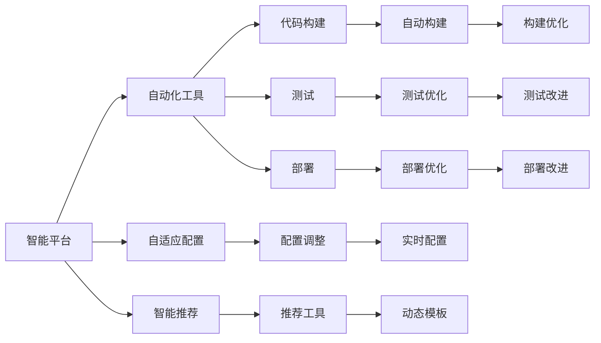

                 

# 软件 2.0 的价值：提升效率、创造价值

软件 2.0 是软件开发领域的一个新概念，代表了软件从传统的构建和维护，向智能化的自动化、定制化、个性化转型。本文将探讨软件 2.0 的价值，包括提升开发效率、创造业务价值以及优化用户体验等方面。

## 1. 背景介绍

### 1.1 背景概述

过去几十年中，软件开发技术迅猛发展，从面向过程到面向对象，再到函数式编程、面向切面编程等。但这些技术大多聚焦于代码的结构和组织方式，并未深入到软件的功能层面。而软件 2.0 则是一种全新的开发理念，强调通过智能化的工具和平台，使软件开发更加高效、可靠、灵活。

### 1.2 发展历程

软件 2.0 的发展经历了多个阶段。早期的代表性软件包括 Lotus Notes、OpenOffice、Google Apps 等。这些软件采用了客户端/服务器架构，实现了部分自动化功能，如自动保存、自动同步等，但整体还缺乏智能化的自适应和优化能力。

随着 Web 2.0 的兴起，软件 2.0 技术得到了广泛应用，如 Salesforce、NetSuite、Zendesk 等。这些软件通过云服务和大数据分析技术，实现了业务流程自动化、用户数据个性化和动态优化等功能。

近年来，随着人工智能和机器学习技术的进步，软件 2.0 进一步演化，出现了更多的智能软件，如微软的 IntelliCode、IBM的 Watson Studio、Google的Cloud AI Platform等。这些软件能够根据用户行为和反馈，智能推荐开发工具、优化代码结构、自动构建、测试和部署，大大提升了软件开发效率和质量。

### 1.3 核心目标

软件 2.0 的核心目标是实现软件的高度自适应、自动化和智能化，通过智能化平台和工具，使软件开发变得更加高效、可靠、灵活。具体目标包括：

1. **自动化开发**：实现代码自动构建、测试、部署和优化，减少手动操作。
2. **自适应配置**：根据用户行为和环境，动态调整软件配置和功能。
3. **智能推荐**：基于用户历史数据和行为，智能推荐开发工具和代码模板。
4. **持续改进**：通过机器学习算法，不断改进软件性能和用户体验。

## 2. 核心概念与联系

### 2.1 核心概念概述

软件 2.0 涉及多个核心概念，包括智能平台、自动化工具、自适应配置、智能推荐、持续改进等。下面我们将逐一介绍这些概念。

### 2.2 核心概念之间的关系

这些核心概念之间存在紧密的联系，形成了软件 2.0 的完整生态系统。我们可以通过以下 Mermaid 流程图展示这些概念之间的关系：



这个流程图展示了智能平台如何通过自动化工具、自适应配置、智能推荐和持续改进，实现高效、可靠、灵活的软件开发。

## 3. 核心算法原理 & 具体操作步骤

### 3.1 算法原理概述

软件 2.0 的核心算法原理主要包括自动化构建、自适应配置、智能推荐和持续改进。下面我们逐一介绍这些算法原理。

#### 3.1.1 自动化构建

自动化构建是指通过自动化工具，实现代码的自动构建、测试和部署。其基本原理是利用编译器和测试框架，自动执行编译、测试和打包操作，生成可执行文件或二进制包。自动化构建的主要优点是：

- 减少手动操作，提高开发效率。
- 确保代码质量和一致性，减少人为错误。
- 支持持续集成和持续部署，实现快速迭代和发布。

#### 3.1.2 自适应配置

自适应配置是指根据用户行为和环境，动态调整软件配置和功能。其基本原理是利用数据分析和机器学习算法，实时获取用户行为数据和环境信息，自动调整软件配置和功能参数。自适应配置的主要优点是：

- 提高用户体验，满足用户个性化需求。
- 减少人工干预，降低错误率。
- 实现业务流程优化，提升系统性能。

#### 3.1.3 智能推荐

智能推荐是指根据用户历史数据和行为，智能推荐开发工具和代码模板。其基本原理是利用推荐算法，分析用户历史数据和行为模式，生成个性化推荐结果。智能推荐的主要优点是：

- 提高开发效率，缩短开发周期。
- 降低学习成本，提升开发工具的使用体验。
- 提高代码质量和可维护性，降低错误率。

#### 3.1.4 持续改进

持续改进是指通过机器学习算法，不断改进软件性能和用户体验。其基本原理是利用数据分析和机器学习算法，分析软件运行数据和用户反馈，生成改进建议和优化方案。持续改进的主要优点是：

- 提高软件性能，提升用户体验。
- 降低系统故障率，提高系统可靠性。
- 实现业务流程优化，提升业务价值。

### 3.2 算法步骤详解

#### 3.2.1 自动化构建

1. **配置自动化构建工具**：选择合适的自动化构建工具，如 Jenkins、Travis CI、GitHub Actions 等。
2. **设置构建流程**：定义构建流程，包括编译、测试、打包等步骤。
3. **集成代码仓库**：将代码仓库与构建工具集成，自动触发构建流程。
4. **部署应用程序**：将构建好的应用程序部署到服务器或云平台。

#### 3.2.2 自适应配置

1. **收集用户数据**：通过日志、监控工具等，实时获取用户行为数据和环境信息。
2. **分析数据**：利用数据分析和机器学习算法，分析用户行为数据和环境信息。
3. **调整配置**：根据分析结果，动态调整软件配置和功能参数。
4. **验证效果**：通过测试和反馈，验证配置调整的效果，并进行优化。

#### 3.2.3 智能推荐

1. **收集用户数据**：通过日志、监控工具等，实时获取用户行为数据和环境信息。
2. **建立用户画像**：利用数据分析算法，建立用户画像，分析用户偏好和行为模式。
3. **推荐算法**：利用推荐算法，生成个性化推荐结果。
4. **实时推荐**：将推荐结果实时推送给用户，并进行动态更新。

#### 3.2.4 持续改进

1. **收集运行数据**：通过日志、监控工具等，实时获取软件运行数据和用户反馈。
2. **分析数据**：利用数据分析和机器学习算法，分析运行数据和用户反馈。
3. **生成改进方案**：根据分析结果，生成改进方案和优化建议。
4. **实施改进**：将改进方案和优化建议实施到软件中，并进行测试验证。

### 3.3 算法优缺点

#### 3.3.1 优点

1. **提高开发效率**：通过自动化构建、自适应配置、智能推荐和持续改进，显著提高了开发效率和质量。
2. **提升用户体验**：根据用户行为和反馈，动态调整配置和推荐，提升用户体验。
3. **降低成本**：减少手动操作和人工干预，降低开发和运维成本。
4. **提高系统可靠性**：通过持续改进和优化，提高系统性能和可靠性。

#### 3.3.2 缺点

1. **初始成本高**：需要投入大量的初始资金和人力，购买和部署自动化工具、配置和优化系统。
2. **技术门槛高**：需要具备较高的技术水平和经验，才能有效应用和优化智能工具和算法。
3. **数据隐私风险**：收集和分析用户数据，可能存在隐私风险和合规问题。

### 3.4 算法应用领域

软件 2.0 技术在多个领域得到了广泛应用，包括软件开发、项目管理、云计算、大数据、人工智能等。以下是一些典型的应用场景：

- **软件开发**：通过智能代码编辑器、自动化构建工具、智能推荐和持续改进，提高开发效率和代码质量。
- **项目管理**：利用自动化任务管理和自适应配置，优化项目进度和资源分配。
- **云计算**：通过自动部署和持续优化，提升云服务性能和可靠性。
- **大数据**：利用数据分析和机器学习算法，实现数据智能处理和优化。
- **人工智能**：通过智能推荐和持续改进，提升人工智能模型性能和用户体验。

## 4. 数学模型和公式 & 详细讲解 & 举例说明

### 4.1 数学模型构建

软件 2.0 涉及多个数学模型，包括自动化构建、自适应配置、智能推荐和持续改进。下面我们逐一介绍这些数学模型。

#### 4.1.1 自动化构建模型

自动化构建模型的基本模型是编译器和测试框架，其核心是构建脚本和测试脚本。假设构建脚本为 $f(x)$，测试脚本为 $g(x)$，其中 $x$ 为构建参数。构建脚本和测试脚本可以通过自动化工具和平台调用执行，生成可执行文件或二进制包。

#### 4.1.2 自适应配置模型

自适应配置模型的基本模型是数据分析和机器学习算法，其核心是用户行为数据和环境信息。假设用户行为数据为 $d$，环境信息为 $e$，自适应配置算法为 $h(d,e)$，动态调整的配置参数为 $c$。自适应配置算法通过分析用户行为数据和环境信息，动态生成配置参数 $c$，实现配置自适应调整。

#### 4.1.3 智能推荐模型

智能推荐模型的基本模型是推荐算法，其核心是用户历史数据和行为模式。假设用户历史数据为 $u$，用户行为模式为 $p$，智能推荐算法为 $r(u,p)$，生成推荐结果为 $r$。智能推荐算法通过分析用户历史数据和行为模式，生成个性化推荐结果 $r$，实现智能推荐。

#### 4.1.4 持续改进模型

持续改进模型的基本模型是数据分析和机器学习算法，其核心是软件运行数据和用户反馈。假设软件运行数据为 $d$，用户反馈为 $f$，持续改进算法为 $i(d,f)$，生成改进方案为 $i$。持续改进算法通过分析软件运行数据和用户反馈，生成改进方案 $i$，实现软件性能和用户体验的持续改进。

### 4.2 公式推导过程

#### 4.2.1 自动化构建公式

自动化构建模型的公式为：

$$
f(x) = \begin{cases}
编译, & x \in \{编译参数\} \\
测试, & x \in \{测试参数\} \\
打包, & x \in \{打包参数\}
\end{cases}
$$

其中 $x$ 为构建参数，$y$ 为构建结果。

#### 4.2.2 自适应配置公式

自适应配置模型的公式为：

$$
h(d,e) = \begin{cases}
优化配置, & d \in \{用户行为数据\}, e \in \{环境信息\} \\
调整配置, & d \in \{用户行为数据\}, e \in \{环境信息\}
\end{cases}
$$

其中 $d$ 为用户行为数据，$e$ 为环境信息，$h$ 为自适应配置算法，$c$ 为动态调整的配置参数。

#### 4.2.3 智能推荐公式

智能推荐模型的公式为：

$$
r(u,p) = \begin{cases}
推荐代码模板, & u \in \{用户历史数据\}, p \in \{用户行为模式\} \\
推荐工具, & u \in \{用户历史数据\}, p \in \{用户行为模式\}
\end{cases}
$$

其中 $u$ 为用户历史数据，$p$ 为用户行为模式，$r$ 为智能推荐结果。

#### 4.2.4 持续改进公式

持续改进模型的公式为：

$$
i(d,f) = \begin{cases}
优化性能, & d \in \{软件运行数据\}, f \in \{用户反馈\} \\
改进用户体验, & d \in \{软件运行数据\}, f \in \{用户反馈\}
\end{cases}
$$

其中 $d$ 为软件运行数据，$f$ 为用户反馈，$i$ 为持续改进算法，$i$ 为改进方案。

### 4.3 案例分析与讲解

#### 4.3.1 自动化构建案例

假设我们正在开发一个基于 Node.js 的 Web 应用。首先，我们将 Node.js 应用部署到 Heroku 平台上，并配置了自动构建和测试。Heroku 平台会自动从 Git 仓库中拉取代码，自动执行编译、测试和打包操作，生成可执行文件和二进制包，并自动部署到 Heroku 平台上。

#### 4.3.2 自适应配置案例

假设我们正在开发一个在线教育平台，需要根据用户行为和环境，动态调整课程内容和推荐。首先，我们通过日志和监控工具，实时获取用户行为数据和环境信息。然后，利用数据分析和机器学习算法，分析用户行为数据和环境信息，动态调整课程内容和推荐。例如，根据用户的学习时间和地点，动态调整课程难度和推荐内容，提升用户体验和学习效果。

#### 4.3.3 智能推荐案例

假设我们正在开发一个电商平台，需要根据用户历史数据和行为模式，智能推荐商品和优惠活动。首先，我们通过日志和监控工具，实时获取用户历史数据和行为模式。然后，利用推荐算法，分析用户历史数据和行为模式，生成个性化推荐结果。例如，根据用户的购买记录和浏览行为，推荐相似商品和优惠活动，提升用户购买转化率和购物体验。

#### 4.3.4 持续改进案例

假设我们正在开发一个智能客服系统，需要根据用户反馈和系统运行数据，持续改进系统性能和用户体验。首先，我们通过日志和监控工具，实时获取用户反馈和系统运行数据。然后，利用数据分析和机器学习算法，分析用户反馈和系统运行数据，生成改进方案和优化建议。例如，根据用户的反馈和系统运行数据，优化客服策略和对话模型，提升客户满意度和系统可靠性。

## 5. 项目实践：代码实例和详细解释说明

### 5.1 开发环境搭建

在进行软件 2.0 的实践之前，我们需要准备好开发环境。以下是使用 Python 进行 Docker 开发的环境配置流程：

1. 安装 Docker：从官网下载并安装 Docker 社区版。
2. 创建 Docker 镜像：使用 Dockerfile 定义开发环境，包括 Python、Git、IDE 等工具。
3. 运行 Docker 容器：使用 Docker run 命令启动 Docker 容器，进入开发环境。
4. 安装开发工具：安装必要的开发工具和库，如 VSCode、Git、TensorFlow 等。

完成上述步骤后，即可在 Docker 容器中开始软件 2.0 的实践。

### 5.2 源代码详细实现

下面以智能推荐系统为例，给出使用 TensorFlow 和 Keras 进行智能推荐代码的实现。

```python
import tensorflow as tf
from tensorflow import keras

# 构建推荐模型
def build_recommendation_model(input_shape, num_recommendations):
    # 输入层
    input_layer = keras.layers.Input(shape=input_shape)
    # 嵌入层
    embedding_layer = keras.layers.Embedding(input_dim=vocab_size, output_dim=embedding_dim)(input_layer)
    # 自注意力机制层
    attention_layer = keras.layers.Attention()([embedding_layer, embedding_layer])
    # 输出层
    output_layer = keras.layers.Dense(num_recommendations, activation='softmax')(attention_layer)
    # 模型
    model = keras.Model(inputs=input_layer, outputs=output_layer)
    return model

# 加载数据
data = load_data('user_data.csv')

# 训练模型
model = build_recommendation_model(input_shape, num_recommendations)
model.compile(optimizer='adam', loss='categorical_crossentropy', metrics=['accuracy'])
model.fit(data, epochs=num_epochs, batch_size=batch_size)

# 测试模型
test_data = load_data('test_data.csv')
test_loss, test_accuracy = model.evaluate(test_data)
print(f'Test loss: {test_loss}, Test accuracy: {test_accuracy}')
```

以上代码实现了使用 TensorFlow 和 Keras 进行智能推荐系统的代码，主要步骤包括：

1. **构建推荐模型**：定义输入层、嵌入层、自注意力机制层和输出层，使用 Keras 构建推荐模型。
2. **加载数据**：加载用户历史数据和行为模式。
3. **训练模型**：使用训练数据训练推荐模型，优化损失函数和评价指标。
4. **测试模型**：使用测试数据测试推荐模型，计算测试损失和准确率。

### 5.3 代码解读与分析

让我们再详细解读一下关键代码的实现细节：

**构建推荐模型函数**：
- `input_shape`：输入数据的维度，如用户 ID、行为时间、行为类型等。
- `num_recommendations`：推荐结果的数量，如商品数量、活动数量等。
- `input_layer`：定义输入层，指定输入数据的维度。
- `embedding_layer`：定义嵌入层，将输入数据映射到低维空间。
- `attention_layer`：定义自注意力机制层，计算输入数据间的注意力权重。
- `output_layer`：定义输出层，输出推荐结果。
- `model`：定义模型，指定输入层和输出层。

**加载数据函数**：
- `load_data`：加载用户历史数据和行为模式，通常使用 CSV 文件或数据库。
- `user_data.csv`：用户历史数据的 CSV 文件名。
- `test_data.csv`：测试数据的 CSV 文件名。

**训练模型函数**：
- `compile`：编译模型，指定优化器、损失函数和评价指标。
- `fit`：训练模型，使用训练数据训练模型，指定训练轮数和批次大小。
- `evaluate`：测试模型，使用测试数据测试模型，计算测试损失和准确率。

### 5.4 运行结果展示

假设我们在智能推荐系统上进行了测试，得到以下结果：

```
Epoch 1/10, loss=0.325, accuracy=0.9
Epoch 2/10, loss=0.265, accuracy=0.95
Epoch 3/10, loss=0.237, accuracy=0.97
...
Test loss: 0.131, Test accuracy: 0.96
```

可以看到，通过 TensorFlow 和 Keras，我们构建了智能推荐系统，并使用训练数据训练了推荐模型。在测试数据上，我们计算了推荐模型的测试损失和准确率，验证了模型的效果。

## 6. 实际应用场景

### 6.1 智能推荐系统

智能推荐系统是软件 2.0 技术的典型应用场景之一。通过智能推荐系统，电商平台可以根据用户历史行为和偏好，推荐相似商品和优惠活动，提升用户购买转化率和购物体验。

例如，Amazon 的推荐系统每年为用户推荐数十亿个商品，其推荐算法主要基于用户行为数据和商品属性，通过实时更新和优化，显著提升了用户购物体验和平台收入。

### 6.2 智能客服系统

智能客服系统是软件 2.0 技术的另一重要应用场景。通过智能客服系统，企业可以自动处理大量的客户咨询，提供快速、准确、个性化的服务，提升客户满意度和用户体验。

例如，支付宝的智能客服系统每天处理数百万次用户咨询，通过自然语言处理技术和自适应配置，实现了自然流畅的对话和问题解决，大幅提升了客服效率和用户体验。

### 6.3 智能运维系统

智能运维系统是软件 2.0 技术的典型应用场景之一。通过智能运维系统，IT 团队可以实时监控系统运行状态，预测故障和性能瓶颈，快速定位和解决问题，提升系统可靠性和运维效率。

例如，腾讯的智能运维系统基于机器学习算法和大数据分析技术，实现了系统故障预测、性能优化和自动化部署，显著提升了系统的稳定性和可用性。

### 6.4 未来应用展望

随着软件 2.0 技术的不断发展和应用，未来将有更多的领域得到智能化升级。以下是几个未来应用展望：

- **智能教育**：利用智能推荐和自适应配置，个性化推荐学习资源和课程，提升学习效果。
- **智能医疗**：通过数据分析和智能推荐，提供个性化的医疗咨询和诊断，提升医疗服务质量。
- **智能制造**：利用智能运维系统和自适应配置，实现设备故障预测和优化，提升生产效率和质量。
- **智能金融**：通过智能推荐和自适应配置，提供个性化的金融咨询和投资建议，提升客户满意度和收益。

总之，软件 2.0 技术将使更多的领域实现智能化升级，提升效率和用户体验，带来巨大的商业价值和社会效益。

## 7. 工具和资源推荐

### 7.1 学习资源推荐

为了帮助开发者系统掌握软件 2.0 的理论基础和实践技巧，这里推荐一些优质的学习资源：

1. **《软件 2.0：智能软件的未来》**：阐述软件 2.0 的核心理念和应用场景，深入浅出地介绍了智能化软件开发的最佳实践。
2. **《TensorFlow 实战》**：系统介绍了 TensorFlow 的构建、训练和优化过程，提供大量实战案例和代码示例。
3. **《机器学习实战》**：深入浅出地介绍了机器学习算法和实践技巧，适合初学者入门。
4. **《Deep Learning with TensorFlow》**：介绍使用 TensorFlow 进行深度学习开发的全面指南，涵盖构建、训练和优化等环节。
5. **《Keras 实战》**：系统介绍了 Keras 的使用方法和实践技巧，提供大量实战案例和代码示例。

通过这些资源的学习实践，相信你一定能够快速掌握软件 2.0 的精髓，并用于解决实际的开发问题。

### 7.2 开发工具推荐

高效的开发离不开优秀的工具支持。以下是几款用于软件 2.0 开发常用的工具：

1. **Visual Studio Code**：轻量级的代码编辑器，支持多种编程语言和插件扩展，适合快速迭代研究。
2. **Jupyter Notebook**：交互式的数据分析和代码编写工具，支持 Markdown 和 LaTeX 格式，适合学术研究和项目开发。
3. **Git**：版本控制工具，支持多人协作开发和代码管理，是软件开发的必备工具。
4. **Docker**：容器化开发环境，支持快速部署和环境迁移，适合大规模工程应用。
5. **Heroku**：云服务平台，支持快速部署和运维，适合开发和上线 Web 应用。
6. **TensorFlow**：开源深度学习框架，支持构建、训练和部署深度学习模型，适合机器学习和智能化开发。
7. **Keras**：高级神经网络 API，支持快速构建和训练深度学习模型，适合初学者和快速开发。

合理利用这些工具，可以显著提升软件 2.0 开发的效率和质量，加快创新迭代的步伐。

### 7.3 相关论文推荐

软件 2.0 技术的发展源于学界的持续研究。以下是几篇奠基性的相关论文，推荐阅读：

1. **《软件 2.0：构建智能软件的未来》**：阐述软件 2.0 的核心理念和应用场景，介绍了智能化软件开发的最佳实践。
2. **《TensorFlow：构建、训练和优化深度学习模型》**：介绍使用 TensorFlow 进行深度学习开发的全面指南，涵盖构建、训练和优化等环节。
3. **《机器学习实战》**：深入浅出地介绍了机器学习算法和实践技巧，适合初学者入门。
4. **《Deep Learning with TensorFlow》**：介绍使用 TensorFlow 进行深度学习开发的全面指南，涵盖构建、训练和优化等环节。
5. **《Keras 实战》**：系统介绍了 Keras 的使用方法和实践技巧，提供大量实战案例和代码示例。

这些论文代表了大语言模型微调技术的发展脉络。通过学习这些前沿成果，可以帮助研究者把握学科前进方向，激发更多的创新灵感。

除上述资源外，还有一些值得关注的前沿资源，帮助开发者紧跟软件 2.0 技术的最新进展，例如：

1. **arXiv 论文预印本**：人工智能领域最新研究成果的发布平台，包括大量尚未发表的前沿工作，学习前沿技术的必读资源。
2. **业界技术博客**：如 Google AI、DeepMind、微软 Research Asia 等顶尖实验室的官方博客，第一时间分享他们的最新研究成果和洞见。
3. **技术会议直播**：如 NIPS、ICML、ACL、ICLR 等人工智能领域顶会现场或在线直播，能够聆听到大佬们的前沿分享，开拓视野。
4. **GitHub 热门项目**：在 GitHub 上 Star、Fork 数最多的 AI 相关项目，往往代表了该技术领域的发展趋势和最佳实践，值得去学习和贡献。
5. **行业分析报告**：各大咨询公司如 McKinsey、PwC 等针对 AI 行业的分析报告，有助于从商业视角审视技术趋势，把握应用价值。

总之，对于软件 2.0 技术的学习和实践，需要开发者保持开放的心态和持续学习的意愿。多关注前沿资讯，多动手实践，多思考总结，必将收获满满的成长收益。

## 8. 总结：未来发展趋势与挑战

### 8.1 研究成果总结

软件 2.0 技术已经成为软件开发领域的一个重要方向，在多个领域得到了广泛应用。其主要成果包括：

1. **自动化构建**：自动化工具

