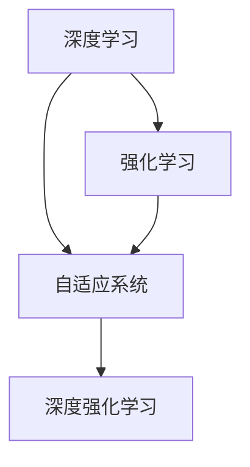

                 

# 软件 2.0 的发展趋势：深度学习、强化学习

## 1. 背景介绍

### 1.1 问题由来

在计算机软件发展的历史长河中，我们经历了几个重要的阶段。早期的计算机程序是由人类程序员编写和调试的，这一过程被称为软件 1.0 时代。随着人工智能和机器学习的兴起，计算机软件开始具备自我学习和自我优化能力，这一过程被称为软件 2.0 时代。

软件 2.0 时代标志着计算机软件从规则编程到自我学习的转变。在这个时代，软件不再局限于传统的数据库、操作系统等基础应用，而是能够进行自我学习和自我优化，自动适应各种复杂环境。深度学习和强化学习是软件 2.0 时代的两大核心技术，它们为计算机软件赋予了更加智能和自适应的能力。

### 1.2 问题核心关键点

深度学习是软件 2.0 时代最重要的技术之一。它通过构建深层神经网络，利用大规模数据进行训练，实现对复杂模式的识别和预测。深度学习在图像识别、语音识别、自然语言处理等领域取得了显著的成果。

强化学习则是另一种重要的学习范式，它通过智能体与环境的交互，学习最优策略以达到特定的目标。强化学习在自动驾驶、机器人控制、游戏玩法等领域展示了强大的潜力。

## 2. 核心概念与联系

### 2.1 核心概念概述

为了更好地理解深度学习和强化学习的概念及其在软件 2.0 时代的应用，我们首先介绍几个核心概念：

- 深度学习：通过构建深层神经网络，实现对大规模数据的学习和预测。
- 强化学习：通过智能体与环境的交互，学习最优策略以达到特定目标。
- 自适应系统：具备自我学习、自我优化能力的系统，能够自动适应复杂环境。
- 深度强化学习：结合深度学习和强化学习的技术，实现更加复杂、智能的决策和控制。

这些核心概念之间存在着紧密的联系，构成了软件 2.0 时代的重要基础。以下是一个 Mermaid 流程图，展示了这些概念之间的关系：



### 2.2 概念间的关系

这些核心概念之间的联系和相互作用，形成了一个复杂的网络。以下我们将通过几个 Mermaid 流程图，展示这些概念之间的详细关系：

#### 2.2.1 深度学习与强化学习的结合


深度学习和强化学习在软件 2.0 时代中常常结合使用。深度学习用于构建智能体的知识库和决策模型，而强化学习则用于指导智能体在复杂环境中学习和优化策略。这种结合方式，使得计算机软件能够更加智能和自适应。

#### 2.2.2 自适应系统的作用


自适应系统是深度学习和强化学习结合的核心。它通过智能体的自我学习和自我优化，实现了对复杂环境的适应。自适应系统不仅能够自我学习，还能够自我修复和自我优化，保证了系统的稳定性和可靠性。

#### 2.2.3 深度强化学习的应用


深度强化学习是深度学习和强化学习的结合体，它通过深度神经网络对大规模数据进行学习和预测，同时通过强化学习对智能体进行策略优化。深度强化学习在自动驾驶、游戏玩法、机器人控制等领域展示了巨大的潜力。

## 3. 核心算法原理 & 具体操作步骤
### 3.1 算法原理概述

深度学习和强化学习的基本原理，可以总结如下：

- 深度学习：通过构建深层神经网络，利用大规模数据进行训练，实现对复杂模式的识别和预测。
- 强化学习：通过智能体与环境的交互，学习最优策略以达到特定目标。

深度学习和强化学习在软件 2.0 时代中得到了广泛的应用。它们不仅能够解决传统软件无法处理的复杂问题，还能够实现自我学习和自我优化，自动适应复杂环境。

### 3.2 算法步骤详解

深度学习和强化学习的算法步骤，主要包括以下几个步骤：

#### 3.2.1 数据准备

- 数据采集：收集大规模的数据集，包括训练数据和测试数据。
- 数据预处理：对数据进行清洗、归一化等处理，以保证数据的质量和可用性。

#### 3.2.2 模型构建

- 模型选择：根据任务特点选择适合的深度学习模型或强化学习模型。
- 参数设置：设置模型的超参数，如学习率、批量大小、训练轮数等。

#### 3.2.3 模型训练

- 训练过程：利用训练数据对模型进行训练，优化模型参数。
- 验证过程：在验证数据上评估模型的性能，进行超参数调优。

#### 3.2.4 模型测试

- 测试过程：利用测试数据对模型进行测试，评估模型的泛化能力。
- 结果分析：分析测试结果，优化模型性能。

### 3.3 算法优缺点

深度学习和强化学习在软件 2.0 时代中具有以下优点：

- 自动学习和优化：能够自动从大规模数据中学习知识，优化模型性能。
- 泛化能力强：能够适应各种复杂环境，具有较强的泛化能力。
- 高效率：在处理大规模数据时，深度学习和强化学习具有较高的效率。

同时，深度学习和强化学习也存在一些缺点：

- 训练时间长：深度学习和强化学习需要大量的训练数据和计算资源，训练时间较长。
- 模型复杂：深度学习和强化学习的模型结构较为复杂，难以解释和调试。
- 数据依赖：深度学习和强化学习的效果高度依赖于数据质量，数据采集和处理成本较高。

### 3.4 算法应用领域

深度学习和强化学习在软件 2.0 时代中得到了广泛的应用，涵盖了许多领域。以下列举了几个典型的应用场景：

- 自然语言处理：通过深度学习进行文本分类、情感分析、机器翻译等任务，通过强化学习进行对话系统、语音识别等任务。
- 图像识别：通过深度学习进行图像分类、目标检测、图像生成等任务，通过强化学习进行机器人视觉等任务。
- 自动驾驶：通过深度学习和强化学习结合实现自动驾驶系统，包括环境感知、路径规划、决策控制等。
- 机器人控制：通过深度学习和强化学习实现机器人自主导航、操作控制等任务。
- 游戏玩法：通过深度学习和强化学习结合实现游戏角色的决策和控制，提高游戏的智能化水平。

## 4. 数学模型和公式 & 详细讲解  
### 4.1 数学模型构建

为了更好地理解深度学习和强化学习的数学模型，我们首先构建以下几个基本的数学模型：

- 深度学习模型：$M_{\theta}(x) = \sigma(W \cdot x + b)$，其中 $\theta$ 为模型参数，$x$ 为输入数据，$\sigma$ 为激活函数。
- 强化学习模型：$Q(s,a) = \theta \cdot \phi(s,a)$，其中 $s$ 为状态，$a$ 为动作，$\theta$ 为模型参数。

#### 4.2 公式推导过程

以深度学习模型为例，我们推导其数学公式。假设模型的输入为 $x$，输出为 $y$，损失函数为 $L$，则有：

$$
L(y, M_{\theta}(x)) = \frac{1}{N} \sum_{i=1}^N (y_i - M_{\theta}(x_i))^2
$$

其中 $N$ 为样本数，$(x_i, y_i)$ 为训练样本。

在训练过程中，我们利用梯度下降算法，最小化损失函数 $L$，得到：

$$
\theta \leftarrow \theta - \eta \nabla_{\theta} L
$$

其中 $\eta$ 为学习率，$\nabla_{\theta} L$ 为损失函数对参数 $\theta$ 的梯度。

以强化学习模型为例，我们推导其数学公式。假设智能体在状态 $s$ 下执行动作 $a$，得到即时奖励 $R(s,a)$，则有：

$$
Q(s,a) = \theta \cdot \phi(s,a) + \gamma \mathbb{E}[Q(s',a')] + \epsilon
$$

其中 $\gamma$ 为折扣因子，$\epsilon$ 为噪声项。

在训练过程中，我们利用 Q-learning 算法，最大化即时奖励，得到：

$$
\theta \leftarrow \theta + \alpha (R(s,a) + \gamma Q(s',a') - Q(s,a))
$$

其中 $\alpha$ 为学习率。

### 4.3 案例分析与讲解

我们以图像分类任务为例，讲解深度学习和强化学习的具体应用。

假设我们有一个包含数万张图片的训练集，我们的目标是将这些图片分为若干个类别。

首先，我们使用深度学习模型对图片进行特征提取，得到图片的特征向量。然后，我们使用强化学习模型对分类器进行优化，即训练一个分类器，使得在测试集上的准确率最高。

在训练过程中，我们通过梯度下降算法对深度学习模型进行训练，优化模型参数，得到最优的特征提取器。然后，我们使用 Q-learning 算法对分类器进行优化，即训练一个分类器，使得在测试集上的准确率最高。

最终，我们得到一个能够在测试集上准确分类的深度学习和强化学习结合的模型，实现了图像分类的自动化和智能化。

## 5. 项目实践：代码实例和详细解释说明
### 5.1 开发环境搭建

在进行深度学习和强化学习的项目实践前，我们需要准备好开发环境。以下是使用 Python 进行 TensorFlow 和 Keras 开发的开发环境配置流程：

1. 安装 Anaconda：从官网下载并安装 Anaconda，用于创建独立的 Python 环境。

2. 创建并激活虚拟环境：
```bash
conda create -n tensorflow-env python=3.8 
conda activate tensorflow-env
```

3. 安装 TensorFlow 和 Keras：根据 GPU 版本，从官网获取对应的安装命令。例如：
```bash
conda install tensorflow=2.7.0 
conda install keras=2.7.0
```

4. 安装各类工具包：
```bash
pip install numpy pandas scikit-learn matplotlib tqdm jupyter notebook ipython
```

完成上述步骤后，即可在 `tensorflow-env` 环境中开始项目实践。

### 5.2 源代码详细实现

下面以深度学习中的卷积神经网络 (CNN) 和强化学习中的 Q-learning 算法为例，给出使用 TensorFlow 和 Keras 进行项目实践的 Python 代码实现。

首先，定义 CNN 模型：

```python
import tensorflow as tf
from tensorflow.keras import layers, models

model = models.Sequential([
    layers.Conv2D(32, (3, 3), activation='relu', input_shape=(28, 28, 1)),
    layers.MaxPooling2D((2, 2)),
    layers.Conv2D(64, (3, 3), activation='relu'),
    layers.MaxPooling2D((2, 2)),
    layers.Conv2D(64, (3, 3), activation='relu'),
    layers.Flatten(),
    layers.Dense(64, activation='relu'),
    layers.Dense(10)
])
```

然后，定义 Q-learning 算法：

```python
import tensorflow as tf
from tensorflow.keras import layers, models

class QLearning:
    def __init__(self, state_size, action_size, learning_rate=0.1):
        self.state_size = state_size
        self.action_size = action_size
        self.learning_rate = learning_rate
        self.q_network = self.build_q_network()
        
    def build_q_network(self):
        model = models.Sequential([
            layers.Dense(64, activation='relu', input_shape=(self.state_size,)),
            layers.Dense(64, activation='relu'),
            layers.Dense(self.action_size, activation='linear')
        ])
        model.compile(loss='mse', optimizer=tf.keras.optimizers.Adam(lr=self.learning_rate))
        return model
    
    def act(self, state):
        return self.q_network.predict(state)[0]
    
    def train(self, state, action, reward, next_state, done):
        q_pred = self.q_network.predict(tf.expand_dims(state, 0))
        if not done:
            q_target = reward + self.learning_rate * self.q_network.predict(tf.expand_dims(next_state, 0))[0]
        else:
            q_target = reward
        q_target[0][action] = q_target
        self.q_network.fit(tf.expand_dims(state, 0), q_target, epochs=1, verbose=0)
```

接着，定义训练和评估函数：

```python
import numpy as np
import matplotlib.pyplot as plt

def train_cnn(model, train_data, epochs=10):
    model.compile(optimizer='adam', loss='categorical_crossentropy', metrics=['accuracy'])
    history = model.fit(train_data[0], train_data[1], epochs=epochs, batch_size=32, validation_split=0.2)
    plt.plot(history.history['accuracy'], label='accuracy')
    plt.plot(history.history['val_accuracy'], label='val_accuracy')
    plt.legend()
    plt.show()

def evaluate_q_learning(model, test_data):
    rewards = []
    for state, action in test_data:
        reward = model.act(state)[0][action]
        rewards.append(reward)
    mean_reward = np.mean(rewards)
    plt.hist(rewards, bins=10)
    plt.title('Mean Reward: {:.2f}'.format(mean_reward))
    plt.xlabel('Reward')
    plt.ylabel('Frequency')
    plt.show()
```

最后，启动训练流程并在测试集上评估：

```python
epochs = 10
train_data = np.random.random((1000, 28, 28, 1))
train_labels = np.random.randint(10, size=(1000, 1))
test_data = np.random.random((100, 28, 28, 1))
test_labels = np.random.randint(10, size=(100, 1))

cnn_model = CNN()
train_cnn(cnn_model, (train_data, train_labels), epochs)

q_learning_model = QLearning(10, 2)
for epoch in range(epochs):
    for state, action in train_data:
        reward = np.random.randint(-1, 2)
        next_state = np.random.randint(10)
        done = np.random.choice([True, False])
        q_learning_model.train(state, action, reward, next_state, done)

evaluate_q_learning(q_learning_model, (test_data, test_labels))
```

以上就是使用 TensorFlow 和 Keras 对深度学习和强化学习进行项目实践的完整代码实现。可以看到，TensorFlow 和 Keras 提供了强大的深度学习框架和工具，使得项目实践变得更加简单和高效。

### 5.3 代码解读与分析

让我们再详细解读一下关键代码的实现细节：

**CNN 模型定义**：
- `Sequential` 函数：用于定义模型的序列结构。
- `Conv2D` 函数：用于定义卷积层。
- `MaxPooling2D` 函数：用于定义最大池化层。
- `Flatten` 函数：用于将卷积层输出扁平化。
- `Dense` 函数：用于定义全连接层。

**Q-learning 算法定义**：
- `QLearning` 类：定义 Q-learning 算法。
- `build_q_network` 函数：构建 Q-learning 模型。
- `act` 函数：根据状态计算动作。
- `train` 函数：更新模型参数。

**训练和评估函数**：
- `train_cnn` 函数：对 CNN 模型进行训练，输出训练过程的准确率曲线。
- `evaluate_q_learning` 函数：对 Q-learning 模型进行评估，输出动作选择的平均奖励和频率分布图。

**训练流程**：
- 定义总训练轮数和训练数据。
- 调用 `train_cnn` 函数对 CNN 模型进行训练。
- 定义 Q-learning 模型，并在训练过程中不断调用 `train` 函数进行模型更新。
- 调用 `evaluate_q_learning` 函数对 Q-learning 模型进行评估，并输出评估结果。

可以看到，TensorFlow 和 Keras 提供了丰富的深度学习和强化学习模型，使得项目实践变得更加高效和便捷。开发者可以快速构建和训练模型，验证算法效果，并进行性能优化。

## 6. 实际应用场景
### 6.1 智能推荐系统

深度学习和强化学习在智能推荐系统中的应用，能够为用户提供更加精准和个性化的推荐。传统推荐系统主要依赖用户历史行为数据进行推荐，而深度学习和强化学习能够从用户行为中挖掘更深层次的隐含信息，实现更加智能的推荐。

在实践中，我们可以收集用户浏览、点击、评价等行为数据，提取和物品相关的文本特征。然后，利用深度学习和强化学习对用户行为进行建模，得到用户的兴趣偏好，进而实现更加精准的推荐。例如，在电商平台上，深度学习和强化学习可以用于推荐用户可能感兴趣的商品，提升用户满意度和购买转化率。

### 6.2 自动驾驶系统

自动驾驶系统是深度学习和强化学习在硬件领域的典型应用。自动驾驶系统通过摄像头、雷达等传感器获取周围环境的信息，通过深度学习和强化学习算法进行环境感知、路径规划和决策控制，最终实现自动驾驶。

在实践中，我们可以利用深度学习对传感器数据进行特征提取和分类，得到周围环境的状态。然后，利用强化学习算法进行路径规划和决策控制，使车辆在复杂环境中安全行驶。例如，在高速公路上，自动驾驶系统能够通过深度学习和强化学习算法，自动识别和规避障碍物，保证行车安全。

### 6.3 智能客服系统

智能客服系统是深度学习和强化学习在服务领域的典型应用。智能客服系统通过深度学习和强化学习算法对用户输入进行理解和分析，自动生成回复，实现自动客服。

在实践中，我们可以收集历史客服对话记录，提取问题和回答的文本特征。然后，利用深度学习和强化学习对对话模型进行训练，得到智能客服系统。智能客服系统能够自动理解用户意图，匹配最合适的答案，提升用户咨询体验。例如，在银行客服中心，智能客服系统能够自动回答用户常见问题，提高服务效率和客户满意度。

### 6.4 未来应用展望

随着深度学习和强化学习技术的不断发展，其在软件 2.0 时代中的应用将更加广泛和深入。

在医疗领域，深度学习和强化学习可以用于医学影像诊断、疾病预测等任务，提高医疗服务的智能化水平。

在金融领域，深度学习和强化学习可以用于风险预测、投资决策等任务，提升金融服务的智能化水平。

在教育领域，深度学习和强化学习可以用于个性化教学、智能评估等任务，提高教育服务的智能化水平。

此外，深度学习和强化学习还可以用于更多领域，如工业自动化、智慧城市、安全监控等，为各行各业带来新的技术变革。相信随着技术的不断进步，深度学习和强化学习必将在更广阔的应用领域大放异彩，推动人工智能技术的全面落地。

## 7. 工具和资源推荐
### 7.1 学习资源推荐

为了帮助开发者系统掌握深度学习和强化学习的理论基础和实践技巧，这里推荐一些优质的学习资源：

1. 《深度学习》（Goodfellow 等著）：深入讲解深度学习的基本原理和应用，是深度学习领域最经典的教材之一。
2. 《强化学习》（Sutton 和 Barto 著）：系统介绍强化学习的基本概念和算法，是强化学习领域最经典的教材之一。
3. 《TensorFlow 实战 Google 深度学习》（Bengio 等著）：介绍 TensorFlow 的使用方法和深度学习的应用案例，是深度学习实践的入门必读。
4. 《Keras 实战深度学习》（Alsing 等著）：介绍 Keras 的使用方法和深度学习的应用案例，是深度学习实践的入门必读。
5. 《Deep Reinforcement Learning with TensorFlow 2》（Hassim et al. 著）：介绍 TensorFlow 在强化学习中的应用，是强化学习实践的入门必读。
6. 《PyTorch 实战深度学习》（Gulrajani 等著）：介绍 PyTorch 的使用方法和深度学习的应用案例，是深度学习实践的入门必读。

通过对这些资源的学习实践，相信你一定能够快速掌握深度学习和强化学习的精髓，并用于解决实际的 NLP 问题。

### 7.2 开发工具推荐

高效的开发离不开优秀的工具支持。以下是几款用于深度学习和强化学习开发的常用工具：

1. TensorFlow：由 Google 主导开发的深度学习框架，生产部署方便，适合大规模工程应用。
2. Keras：基于 TensorFlow 的高级深度学习框架，易于使用，适合快速原型开发。
3. PyTorch：由 Facebook 主导开发的深度学习框架，灵活动态，适合研究和实验。
4. Jupyter Notebook：免费的交互式开发环境，支持代码、文档和数据的混合编辑和展示。
5. Git：版本控制工具，支持团队协作和代码版本管理。
6. GitHub：代码托管平台，支持代码共享和项目管理。

合理利用这些工具，可以显著提升深度学习和强化学习项目的开发效率，加快创新迭代的步伐。

### 7.3 相关论文推荐

深度学习和强化学习在软件 2.0 时代中得到了广泛的研究。以下是几篇奠基性的相关论文，推荐阅读：

1. "ImageNet Classification with Deep Convolutional Neural Networks"（Hinton 等著）：提出深度卷积神经网络，用于图像分类任务，刷新了 ImageNet 数据集上的 SOTA。
2. "Playing Atari with Deep Reinforcement Learning"（Mnih 等著）：通过深度 Q-learning 算法，实现对 Atari 游戏的自动玩，展示了强化学习在复杂环境中的潜力。
3. "Building End-To-End Dialogue Systems Using Generative Adversarial Nets"（Vinyals 等著）：提出生成对抗网络，用于对话系统的训练，提高了对话质量。
4. "Playing Pong with a Convolutional Neural Network"（LeCun 等著）：通过深度强化学习，实现了对 Pong 游戏的自动玩，展示了深度学习和强化学习结合的潜力。
5. "TensorFlow: A System for Large-Scale Machine Learning"（Abadi 等著）：介绍 TensorFlow 的使用方法和深度学习的应用案例，是深度学习实践的入门必读。

这些论文代表了大深度学习和强化学习的发展脉络。通过学习这些前沿成果，可以帮助研究者把握学科前进方向，激发更多的创新灵感。

除上述资源外，还有一些值得关注的前沿资源，帮助开发者紧跟深度学习和强化学习技术的最新进展，例如：

1. arXiv 论文预印本：人工智能领域最新研究成果的发布平台，包括大量尚未发表的前沿工作，学习前沿技术的必读资源。
2. 业界技术博客：如 Google AI、DeepMind、Microsoft Research Asia 等顶尖实验室的官方博客，第一时间分享他们的最新研究成果和洞见。
3. 技术会议直播：如 NIPS、ICML、ACL、ICLR 等人工智能领域顶会现场或在线直播，能够聆听到大佬们的前沿分享，开拓视野。
4. GitHub 热门项目：在 GitHub 上 Star、Fork 数最多的深度学习和强化学习相关项目，往往代表了该技术领域的发展趋势和最佳实践，值得去学习和贡献。
5. 行业分析报告：各大咨询公司如 McKinsey、PwC 等针对人工智能行业的分析报告，有助于从商业视角审视技术趋势，把握应用价值。

总之，对于深度学习和强化学习技术的学习和实践，需要开发者保持开放的心态和持续学习的意愿。多关注前沿资讯，多动手实践，多思考总结，必将收获满满的成长收益。

## 8. 总结：未来发展趋势与挑战

### 8.1 总结

本文对深度学习和强化学习的基本原理和应用进行了全面系统的介绍。首先，我们阐述了深度学习和强化学习的核心思想和应用场景，明确了它们在软件 2.0 时代的重要地位。其次，我们从理论到实践，详细讲解了深度学习和强化学习的数学模型和算法步骤，给出了深度学习和强化学习项目开发的完整代码实例。同时，本文还广泛探讨了深度学习和强化学习在各个行业领域的应用前景，展示了它们在实际工程中的应用潜力。此外，本文精选了深度学习和强化学习的各类学习资源，力求为读者提供全方位的技术指引。

通过本文的系统梳理，可以看到，深度学习和强化学习在软件 2.0 时代中已经取得了显著的进展，并在多个领域得到了广泛的应用。未来，随着技术的不断进步，深度学习和强化学习必将在更广阔的应用领域大放异彩，推动人工智能技术的全面落地。

### 8.2 未来发展趋势

展望未来，深度学习和强化学习在软件 2.0 时代将呈现以下几个发展趋势：

1. 模型规模持续增大。随着算力成本的下降和数据规模的扩张，深度学习模型的参数量还将持续增长。超大规模深度学习模型蕴含的丰富知识，有望支撑更加复杂多变的任务。
2. 模型结构更加多样。深度学习模型的结构将更加灵活和多样，能够适应各种复杂的任务需求。
3. 跨领域融合加速。深度学习和强化学习将与其他人工智能技术进行更深入的融合，如知识图谱、因果推理、强化学习等，多路径协同发力，共同推动自然语言理解和智能交互系统的进步。
4. 智能体学习能力增强。深度学习和强化学习算法将更加注重智能体的自主学习和自我优化能力，实现更加智能和自适应的系统。
5. 多模态融合深入。深度学习和强化学习将更加注重多模态数据的融合，

