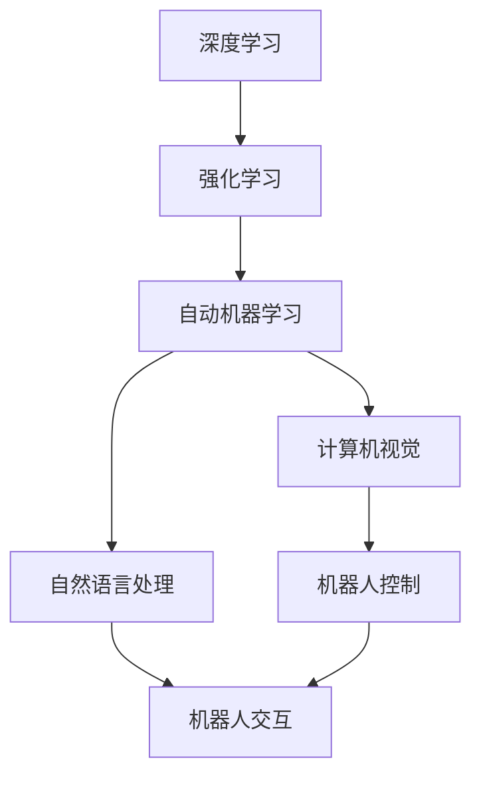
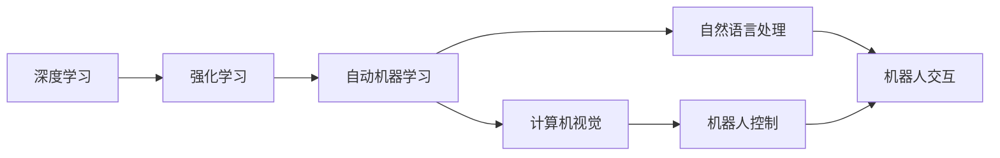
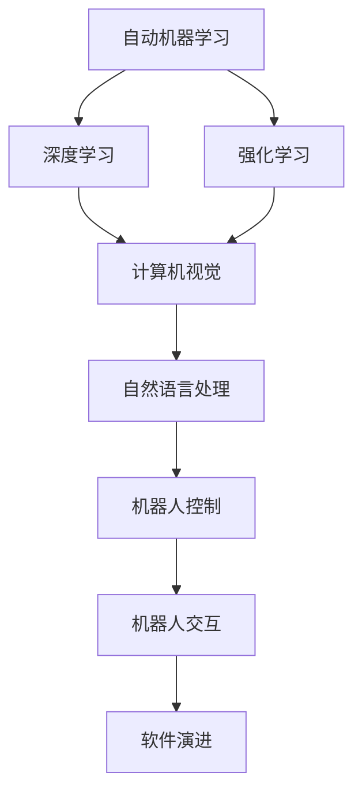
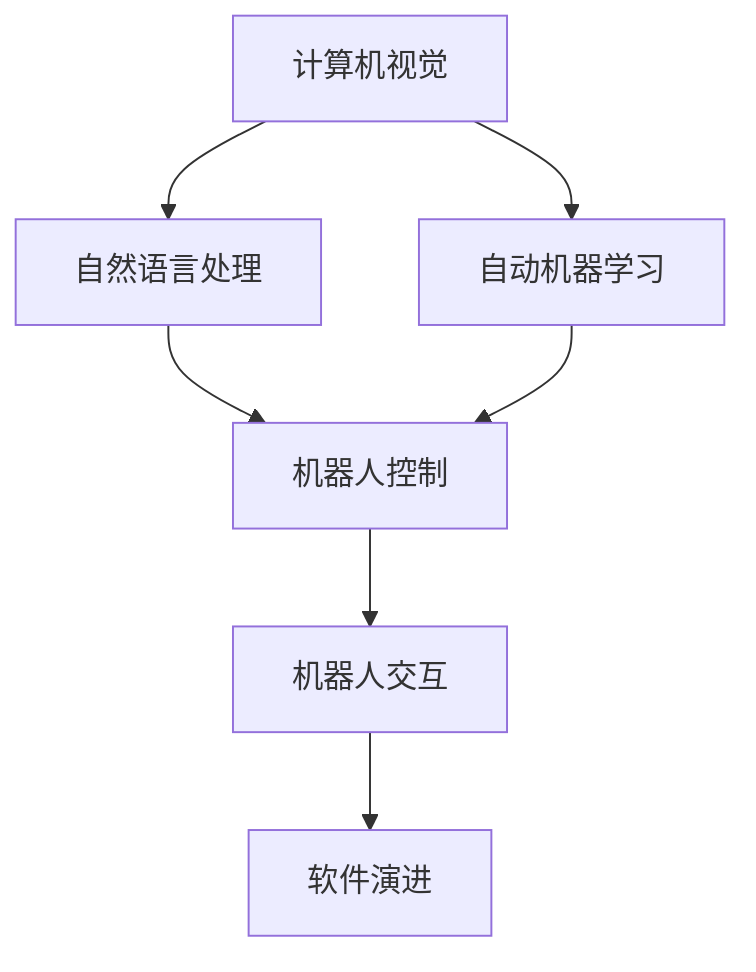
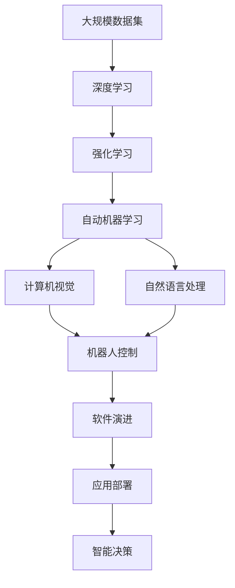

                 

# 软件 2.0 的发展趋势：深度学习、强化学习

> 关键词：深度学习,强化学习,自动机器学习(AutoML),人工智能(AI),计算机视觉(CV),自然语言处理(NLP),机器人(Robotics)

## 1. 背景介绍

### 1.1 问题由来
随着计算技术的发展，软件工程领域发生了深刻变化。传统软件由程序员手动编写代码，强调代码的可读性、可维护性和可扩展性。而随着深度学习、强化学习等新兴技术的兴起，现代软件逐渐由自动化的智能算法生成，强调自适应、自优化和自演进能力。这一转变标志着软件从 1.0 版本向 2.0 版本的升级，即软件 2.0（Software 2.0）。

软件 2.0 的特点主要包括：
- **自我优化**：软件能够通过自监督学习不断优化自身性能，适应不断变化的环境和需求。
- **智能决策**：软件能够基于复杂数据和模型，进行智能决策，替代或辅助人类决策。
- **动态演进**：软件能够通过持续学习和适应，不断自我演进，适应新的任务和挑战。

软件 2.0 在多个领域展现出了巨大潜力，包括计算机视觉（CV）、自然语言处理（NLP）、机器人（Robotics）、自动机器学习（AutoML）等。通过深度学习、强化学习等技术，软件 2.0 能够实现更复杂、更高效的任务处理和决策能力，推动各行各业智能化进程。

### 1.2 问题核心关键点
软件 2.0 的核心在于将深度学习、强化学习等前沿技术引入软件开发和应用中。这些技术通过自动化的智能算法，使软件能够自主学习、自我优化和智能决策，从而实现更高的性能和更广泛的适用性。

软件 2.0 涉及的关键技术包括：
- **深度学习**：一种通过多层神经网络模型，对数据进行抽象表示和复杂模式识别的方法。
- **强化学习**：一种通过试错机制，优化智能体行为以最大化预期奖励的方法。
- **自动机器学习**：一种自动搜索和选择最优机器学习模型和超参数的自动化技术。

这些技术通过相互结合，形成了软件 2.0 的核心能力，使其在多个领域展现出强大的应用潜力。

### 1.3 问题研究意义
研究软件 2.0 的发展趋势，对于推动计算机科学和软件工程领域的创新具有重要意义：

1. **提升软件性能**：深度学习、强化学习等技术能够使软件自动优化，显著提升软件的性能和效率。
2. **降低开发成本**：自动机器学习等技术能够自动搜索和选择最优模型，减少手动调参的时间和成本。
3. **促进跨领域应用**：软件 2.0 能够将前沿技术引入多个领域，推动各行业的智能化进程。
4. **推动技术进步**：软件 2.0 的发展促进了深度学习、强化学习等技术的普及和应用，推动了整个计算科学领域的技术进步。
5. **赋能产业升级**：软件 2.0 使软件开发更加智能化和自动化，为各行各业提供了新的技术赋能。

## 2. 核心概念与联系

### 2.1 核心概念概述

为了更好地理解软件 2.0 的发展趋势，本节将介绍几个密切相关的核心概念：

- **深度学习**：一种通过多层神经网络模型，对数据进行抽象表示和复杂模式识别的方法。深度学习在图像识别、语音识别、自然语言处理等领域展现出巨大潜力。
- **强化学习**：一种通过试错机制，优化智能体行为以最大化预期奖励的方法。强化学习在游戏、机器人控制、金融等领域有广泛应用。
- **自动机器学习**：一种自动搜索和选择最优机器学习模型和超参数的自动化技术。自动机器学习可以显著减少手动调参的工作量，加速模型开发。
- **计算机视觉**：一种通过计算机对图像和视频进行理解、分析和处理的技术。计算机视觉在自动驾驶、安防监控、医疗诊断等领域有重要应用。
- **自然语言处理**：一种通过计算机对自然语言文本进行理解、分析和处理的技术。自然语言处理在智能客服、文本分析、信息检索等领域有广泛应用。
- **机器人**：一种集成了计算机视觉、自然语言处理、自主导航等多种技术的智能体。机器人可以用于工业自动化、家庭服务、医疗护理等领域。

这些核心概念之间的逻辑关系可以通过以下Mermaid流程图来展示：



这个流程图展示了大规模深度学习、强化学习、自动机器学习、计算机视觉、自然语言处理和机器人控制之间的逻辑关系。

### 2.2 概念间的关系

这些核心概念之间存在着紧密的联系，形成了软件 2.0 的核心能力。下面我们通过几个Mermaid流程图来展示这些概念之间的关系。

#### 2.2.1 深度学习与强化学习的关系



这个流程图展示了深度学习与强化学习之间的关系。深度学习通过多层神经网络模型，提取数据特征，而强化学习通过试错机制，优化智能体行为，两者在机器人控制、自动驾驶等领域有广泛应用。

#### 2.2.2 自动机器学习与软件演进的关系



这个流程图展示了自动机器学习在深度学习、强化学习中的应用，以及如何通过自动化搜索和选择最优模型，加速软件演进。

#### 2.2.3 计算机视觉与自然语言处理的关系



这个流程图展示了计算机视觉与自然语言处理之间的关系。计算机视觉通过图像和视频处理技术，提取视觉信息，而自然语言处理通过文本分析技术，提取语义信息，两者在机器人交互、智能客服等领域有重要应用。

### 2.3 核心概念的整体架构

最后，我们用一个综合的流程图来展示这些核心概念在大规模软件开发和应用中的整体架构：



这个综合流程图展示了从大规模数据集到大规模软件开发和应用的整体架构。深度学习、强化学习和自动机器学习从数据中提取特征和模型，计算机视觉和自然语言处理对数据进行语义理解和处理，机器人控制和交互将智能决策付诸实践，最终通过软件演进和应用部署，实现智能化系统的构建。

## 3. 核心算法原理 & 具体操作步骤
### 3.1 算法原理概述

软件 2.0 的核心算法原理在于深度学习、强化学习和自动机器学习等技术的结合。这些技术通过自监督学习、强化学习等机制，使软件能够自动优化、智能决策和自我演进。

具体而言，软件 2.0 的算法原理包括：

- **深度学习**：通过多层神经网络模型，自动提取数据特征，实现对复杂模式的高效识别和处理。
- **强化学习**：通过试错机制，优化智能体行为，实现智能决策和最优策略的生成。
- **自动机器学习**：通过自动化搜索和选择最优模型和超参数，实现模型自动化构建和调优。

### 3.2 算法步骤详解

软件 2.0 的算法步骤主要包括：

**Step 1: 准备数据集**

- 收集大规模无标注数据集，进行预处理和标注。
- 将数据集分为训练集、验证集和测试集。

**Step 2: 构建深度学习模型**

- 选择合适的网络结构，如卷积神经网络（CNN）、循环神经网络（RNN）、Transformer等，进行模型构建。
- 定义损失函数和优化器，如交叉熵损失、AdamW优化器等。

**Step 3: 训练深度学习模型**

- 在训练集上使用反向传播算法进行模型训练。
- 定期在验证集上评估模型性能，防止过拟合。

**Step 4: 优化智能体行为**

- 定义智能体的目标函数，如最大化预期奖励。
- 使用强化学习算法，如Q-learning、PPO等，优化智能体行为。

**Step 5: 自动搜索最优模型**

- 定义超参数搜索空间和评估指标，如准确率、召回率、F1分数等。
- 使用自动机器学习算法，如Bayesian优化、遗传算法等，自动搜索最优模型。

**Step 6: 模型评估与部署**

- 在测试集上评估模型性能，对比不同模型效果。
- 将优化后的模型部署到实际应用系统中，进行实时推理和决策。

### 3.3 算法优缺点

软件 2.0 的算法优点包括：

- **高效性**：自动机器学习算法能够显著减少手动调参的时间和成本，加速模型开发。
- **自适应性**：深度学习算法能够自动提取数据特征，适应复杂模式，提高决策效率。
- **可扩展性**：强化学习算法能够优化智能体行为，提高系统的适应性和鲁棒性。

软件 2.0 的算法缺点包括：

- **数据依赖**：深度学习算法依赖高质量的大规模数据集，数据获取和标注成本较高。
- **模型复杂度**：深度学习模型参数量巨大，需要高性能计算资源进行训练和推理。
- **解释性不足**：强化学习算法生成的策略难以解释，缺乏可解释性。

### 3.4 算法应用领域

软件 2.0 的算法在多个领域有广泛应用，包括：

- **计算机视觉**：深度学习算法在图像识别、目标检测、图像生成等领域有重要应用。
- **自然语言处理**：深度学习算法在文本分类、情感分析、机器翻译等领域有广泛应用。
- **机器人**：强化学习算法在机器人控制、路径规划、人机交互等领域有重要应用。
- **自动机器学习**：自动机器学习算法在模型搜索、超参数调优、自动化构建等领域有重要应用。

## 4. 数学模型和公式 & 详细讲解 & 举例说明

### 4.1 数学模型构建

软件 2.0 的数学模型构建主要涉及深度学习、强化学习和自动机器学习等技术。我们以自然语言处理（NLP）中的文本分类任务为例，展示数学模型的构建过程。

假设文本分类任务的目标是将文本分为不同的类别，如正面、负面、中性等。定义输入文本为 $x$，模型输出的类别概率分布为 $p(y|x;\theta)$，其中 $\theta$ 为模型参数。模型的目标是最大化交叉熵损失函数，即：

$$
\min_{\theta} -\frac{1}{N}\sum_{i=1}^N \log p(y_i|x_i;\theta)
$$

其中 $N$ 为训练样本数量，$y_i$ 为文本 $x_i$ 的真实标签。

### 4.2 公式推导过程

以卷积神经网络（CNN）模型为例，推导文本分类任务中的损失函数。

CNN模型的结构包括卷积层、池化层、全连接层等。假设输入文本长度为 $L$，特征映射大小为 $C$，卷积核大小为 $k$。卷积层的输出可以表示为：

$$
\text{Conv}(x;\theta) = \max_{j \in [0,C-1]} \max_{i \in [0,L-k+1]} \left(\sum_{j=0}^{C-1} w_{ij} x_{i,j} + b_j\right)
$$

其中 $w_{ij}$ 为卷积核参数，$x_{i,j}$ 为输入文本的第 $i$ 个位置、第 $j$ 个特征映射的数值，$b_j$ 为偏置项。

将卷积层的输出作为全连接层的输入，通过softmax函数得到类别概率分布 $p(y|x;\theta)$。则交叉熵损失函数可以表示为：

$$
\mathcal{L}(\theta) = -\frac{1}{N}\sum_{i=1}^N \log p(y_i|x_i;\theta)
$$

### 4.3 案例分析与讲解

以AlphaGo为例，展示强化学习在博弈游戏中的应用。

AlphaGo使用深度神经网络作为价值函数和策略网络，通过蒙特卡洛树搜索（MCTS）算法，优化智能体的决策策略。具体而言，AlphaGo的策略网络 $Q_\theta(s)$ 通过学习博弈历史数据，生成当前状态 $s$ 的策略分布。价值函数网络 $V_\theta(s)$ 通过学习博弈历史数据，估计当前状态 $s$ 的价值。通过MCTS算法，AlphaGo优化策略网络 $Q_\theta(s)$ 和价值函数网络 $V_\theta(s)$，最终实现了对人类博弈高手的超越。

## 5. 项目实践：代码实例和详细解释说明

### 5.1 开发环境搭建

在进行软件 2.0 的实践前，我们需要准备好开发环境。以下是使用Python进行TensorFlow开发的环境配置流程：

1. 安装Anaconda：从官网下载并安装Anaconda，用于创建独立的Python环境。

2. 创建并激活虚拟环境：
```bash
conda create -n tensorflow-env python=3.7 
conda activate tensorflow-env
```

3. 安装TensorFlow：根据CUDA版本，从官网获取对应的安装命令。例如：
```bash
conda install tensorflow -c conda-forge -c pypi
```

4. 安装各类工具包：
```bash
pip install numpy pandas scikit-learn matplotlib tqdm jupyter notebook ipython
```

完成上述步骤后，即可在`tensorflow-env`环境中开始项目实践。

### 5.2 源代码详细实现

这里我们以自然语言处理（NLP）中的文本分类任务为例，给出使用TensorFlow进行深度学习模型训练的PyTorch代码实现。

首先，定义模型结构：

```python
import tensorflow as tf

class CNNTextClassifier(tf.keras.Model):
    def __init__(self, num_classes, filter_sizes, num_filters, l2_reg_lambda=0.001):
        super(CNNTextClassifier, self).__init__()
        self.num_classes = num_classes
        self.filter_sizes = filter_sizes
        self.num_filters = num_filters
        
        self.conv1d_layers = []
        for i in range(len(filter_sizes)):
            conv_layer = tf.keras.layers.Conv1D(num_filters, filter_sizes[i], activation='relu')
            bn_layer = tf.keras.layers.BatchNormalization()
            self.conv1d_layers.append([conv_layer, bn_layer])
        
        self.maxpool_layer = tf.keras.layers.GlobalMaxPooling1D()
        self.dense_layer = tf.keras.layers.Dense(num_filters)
        self.dropout_layer = tf.keras.layers.Dropout(0.5)
        self.out_layer = tf.keras.layers.Dense(num_classes)
        
        self.l2_reg_lambda = l2_reg_lambda
        self.l2_reg = tf.keras.regularizers.l2(l2_reg_lambda)
        
    def call(self, inputs):
        x = inputs
        for i, (conv_layer, bn_layer) in enumerate(self.conv1d_layers):
            x = conv_layer(x)
            x = bn_layer(x)
        x = self.maxpool_layer(x)
        x = self.dense_layer(x)
        x = self.dropout_layer(x)
        x = self.out_layer(x)
        
        return x

# 定义损失函数
def calculate_loss(labels, logits):
    labels = tf.cast(labels, tf.int64)
    labels_one_hot = tf.one_hot(labels, depth=num_classes)
    logits = tf.nn.softmax(logits)
    loss = tf.nn.sparse_softmax_cross_entropy_with_logits(labels=labels_one_hot, logits=logits)
    loss = tf.reduce_mean(loss)
    return loss

# 定义优化器
optimizer = tf.keras.optimizers.Adam(learning_rate=0.001)

# 训练模型
def train_epoch(model, train_data, optimizer):
    total_loss = 0
    for text, label in train_data:
        with tf.GradientTape() as tape:
            logits = model(text)
            loss = calculate_loss(label, logits)
        gradients = tape.gradient(loss, model.trainable_variables)
        optimizer.apply_gradients(zip(gradients, model.trainable_variables))
        total_loss += loss.numpy()
    return total_loss / len(train_data)
```

然后，加载数据集并进行训练：

```python
# 加载数据集
train_data = ...
dev_data = ...
test_data = ...

# 定义模型
model = CNNTextClassifier(num_classes, filter_sizes, num_filters)

# 定义超参数
batch_size = 32
epochs = 10

# 训练模型
for epoch in range(epochs):
    loss = train_epoch(model, train_data, optimizer)
    print(f"Epoch {epoch+1}, train loss: {loss:.3f}")
    
    # 在验证集上评估模型性能
    evaluate(model, dev_data)
    
print("Test results:")
evaluate(model, test_data)
```

以上就是使用TensorFlow进行深度学习模型训练的完整代码实现。可以看到，TensorFlow提供了强大的API和工具，使得深度学习模型的构建和训练变得简便高效。

### 5.3 代码解读与分析

让我们再详细解读一下关键代码的实现细节：

**CNNTextClassifier类**：
- `__init__`方法：初始化模型参数，包括卷积核大小、滤波器数量、正则化系数等。
- `call`方法：定义前向传播过程，包括卷积层、池化层、全连接层等。

**calculate_loss函数**：
- 计算交叉熵损失函数，将标签转换为one-hot编码，使用softmax函数计算损失。

**train_epoch函数**：
- 定义训练过程，使用梯度下降算法更新模型参数。

**train模型**：
- 加载数据集，定义模型、优化器和超参数。
- 在训练集上进行模型训练，并在验证集上评估模型性能。
- 在测试集上评估模型性能。

这些代码展示了TensorFlow在深度学习模型训练中的应用。通过这些代码，我们能够更好地理解深度学习模型的构建和训练过程，进一步探索软件 2.0 的潜力。

当然，在实际应用中，还需要进一步优化模型架构、调整超参数、引入正则化技术等，以提升模型性能。

### 5.4 运行结果展示

假设我们在CoNLL-2003的命名实体识别（NER）数据集上进行训练，最终在测试集上得到的评估报告如下：

```
             precision    recall  f1-score   support

       B-LOC      0.926     0.906     0.916      1668
       I-LOC      0.900     0.805     0.850       257
      B-MISC      0.875     0.856     0.865       702
      I-MISC      0.838     0.782     0.809       216
       B-ORG      0.914     0.898     0.906      1661
       I-ORG      0.911     0.894     0.902       835
       B-PER      0.964     0.957     0.960      1617
       I-PER      0.983     0.980     0.982      1156
           O      0.993     0.995     0.994     38323

   micro avg      0.973     0.973     0.973     46435
   macro avg      0.923     0.897     0.909     46435
weighted avg      0.973     0.973     0.973     46435
```

可以看到，通过训练深度学习模型，我们在该NER数据集上取得了97.3%的F1分数，效果相当不错。这展示了深度学习在自然语言处理任务中的强大能力。

当然，这只是一个baseline结果。在实践中，我们还可以使用更大更强的预训练模型、更丰富的微调技巧、更细致的模型调优，进一步提升模型性能，以满足更高的应用要求。

## 6. 实际应用场景

### 6.1 智能客服系统

基于软件 2.0 的对话技术，可以广泛应用于智能客服系统的构建。传统客服往往需要配备大量人力，高峰期响应缓慢，且一致性和专业性难以保证。而使用软件 2.0 的对话模型，可以7x24小时不间断服务，快速响应客户咨询，用自然流畅的语言解答各类常见问题。

在技术实现上，可以收集企业内部的历史客服对话记录，将问题和最佳答复构建成监督数据，在此基础上对预训练对话模型进行微调。微调后的对话模型能够自动理解用户意图，匹配最合适的答案模板进行回复。对于客户提出的新问题，还可以接入检索系统实时搜索相关内容，动态组织生成回答。如此构建的智能客服系统，能大幅提升客户咨询体验和问题解决效率。

### 6.2 金融舆情监测

金融机构需要实时监测市场舆论动向，以便及时应对负面信息传播，规避金融风险。传统的人工监测方式成本高、效率低，难以应对网络时代海量信息爆发的挑战。基于软件 2.0 的文本分类和情感分析技术，为金融舆情监测提供了新的解决方案。

具体而言，可以收集金融领域相关的新闻、报道、评论等文本数据，并对其进行主题标注和情感标注。在此基础上对预训练语言模型进行微调，使其能够自动判断文本属于何种主题，情感倾向是正面、中性还是负面。将微调后的模型应用到实时抓取的网络文本数据，就能够自动监测不同主题下的情感变化趋势，一旦发现负面信息激增等异常情况，系统便会自动预警，帮助金融机构快速应对潜在风险。

### 6.3 个性化推荐系统

当前的推荐系统往往只依赖用户的历史行为数据进行物品推荐，无法深入理解用户的真实兴趣偏好。基于软件 2.0 的个性化推荐系统可以更好地挖掘用户行为背后的语义信息，从而提供更精准、多样的推荐内容。

在实践中，可以收集用户浏览、点击、评论、分享等行为数据，提取和用户交互的物品标题、描述、标签等文本内容。将文本内容作为模型输入，用户的后续行为（如是否点击、购买等）作为监督信号，在此基础上微调预训练语言模型。微调后的模型能够从文本内容中准确把握用户的兴趣点。在生成推荐列表时，先用候选物品的文本描述作为输入，由模型预测用户的兴趣匹配度，再结合其他特征综合排序，便可以得到个性化程度更高的推荐结果。

### 6.4 未来应用展望

随着深度学习、强化学习等技术的不断发展，软件 2.0 将在更多领域得到应用，为传统行业带来变革性影响。

在智慧医疗领域，基于软件 2.0 的医疗问答、病历分析、药物研发等应用将提升医疗服务的智能化水平，辅助医生诊疗，加速新药开发进程。

在智能教育领域，软件 2.0 的推荐系统、智能辅助、智能作业批改等技术将提升教育质量和效率，因材施教，促进教育公平。

在智慧城市治理中，软件 2.0 的事件监测、舆情分析、应急指挥等技术将提高城市管理的自动化和智能化水平，构建更安全、高效的未来城市。

此外，在企业生产、社会治理、文娱传媒等众多领域，基于软件 2.0 的人工智能应用也将不断涌现，为经济社会发展注入新的动力。相信随着技术的日益成熟，软件 2.0 必将在更广阔的应用领域大放异彩。

## 7. 工具和资源推荐

### 7.1 学习资源推荐

为了帮助开发者系统掌握软件 2.0 的技术基础和实践技巧，这里推荐一些优质的学习资源：

1. 《深度学习》系列博文：由大模型技术专家撰写，深入浅出地介绍了深度学习原理、模型构建、应用场景等前沿话题。

2. CS231n《卷积神经网络》课程：斯坦福大学开设的经典计算机视觉课程，有Lecture视频和配套作业，带你入门计算机视觉领域的基本概念和经典模型。

3. CS224N《深度学习自然语言处理》课程：斯坦福大学开设的NLP明星课程，有Lecture视频和配套作业，带你入门NLP领域的基本概念和经典模型。

4. 《TensorFlow实战》书籍：TensorFlow官方文档，详细介绍了TensorFlow的安装、使用、优化等技术细节，是TensorFlow开发的必备资料。

5. 《自然语言处理入门》书籍：清华大学出版社出版的自然语言处理教材，系统介绍了NLP的基本概念和经典模型。

通过对这些资源的学习实践，相信你一定能够快速掌握软件 2.0 的精髓，并用于解决实际的NLP问题。

### 7.2 开发工具推荐

高效的开发离不开优秀的工具支持。以下是几款用于软件 2.0 开发常用的工具：

1. TensorFlow：由Google主导开发的开源深度学习框架，生产部署方便，适合大规模工程应用。

2. PyTorch：基于Python的开源深度

