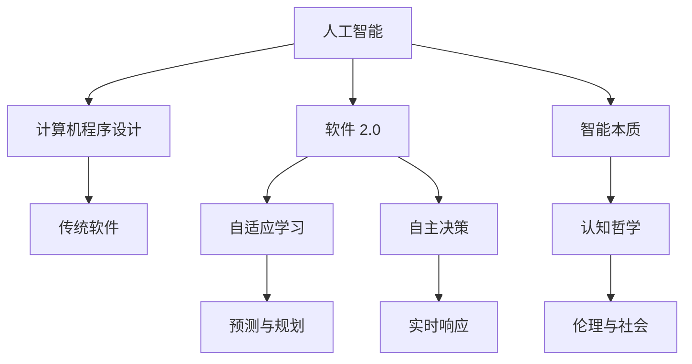

                 

# 软件 2.0 的哲学思考：人工智能的本质

> 关键词：人工智能, 计算机程序设计, 软件 2.0, 哲学, 人工智能本质, 技术创新

## 1. 背景介绍

### 1.1 问题由来
现代计算机科学的演进，正处在一个重要的转折点。随着人工智能(AI)技术在各个领域的应用不断深入，我们似乎已经迈入了一个新的时代——软件 2.0(Software 2.0)。什么是软件 2.0？它与之前的软件形态有何不同？

从软件 1.0 到软件 2.0，是人类对计算与智能关系理解的深刻变革。软件 1.0 依赖于程序员的编码与调试，它更像是一种“物质”形态的存在，以代码和数据的形式固化在物理介质中。而软件 2.0 则赋予了计算机更高的智能，它不仅能够自动执行指令，还能够自主地进行学习和适应，使其成为一种更为“生命”化的存在。

在这个过程中，人工智能作为核心驱动，不仅改变了计算机技术的应用，还对人类的认知模式、社会结构乃至哲学思考都产生了深远影响。本文将深入探讨软件 2.0 的哲学思考，特别关注人工智能的本质，以及它如何塑造我们的未来。

### 1.2 问题核心关键点
软件 2.0 的哲学思考核心点在于理解人工智能的本质，以及它如何影响我们的认知与未来。具体包括：

- 人工智能与智能本质：AI 的本质是什么？它是否等同于人类的智能？
- 计算与智能的关系：计算与智能的边界在哪里？AI 在多大程度上可以超越物理逻辑？
- 未来社会与人类角色：AI 的普及如何影响就业、教育、决策等社会生态？
- 伦理与道德：AI 技术应如何兼顾效率与公平，避免偏见与滥用？

这些核心问题贯穿于软件 2.0 的演进过程中，需要通过哲学思考与技术实践相结合的方式，寻找答案。

### 1.3 问题研究意义
理解软件 2.0 的哲学思考，对于我们把握技术的未来方向，制定合理的应用政策，乃至深刻理解人类自身，都具有重要意义：

- 技术导向：明确人工智能的定位与边界，避免过度乐观或悲观。
- 社会适应：指导社会如何应对 AI 带来的变革，提高适应能力。
- 伦理规范：为 AI 技术的健康发展提供伦理指导，防范潜在的滥用风险。
- 人类认知：深化对智能本质的认识，理解人机协作的未来。

## 2. 核心概念与联系

### 2.1 核心概念概述

在探讨软件 2.0 的哲学思考之前，需要先明确一些核心概念及其相互联系：

- 人工智能：一种模拟人类智能行为的计算机程序或系统，其能力涵盖感知、学习、推理、规划、自然语言理解等。
- 计算机程序设计：通过编程语言实现算法与逻辑，构建软件系统的过程。
- 软件 2.0：一种新型的软件形态，其智能化程度远超传统软件，具备自适应、自主学习的能力。
- 哲学：关于智能与存在本质的思考，涉及认知、伦理、社会等多元维度。

这些概念之间具有密切的联系，共同构成了软件 2.0 的哲学思考基础。

### 2.2 概念间的关系

通过以下 Mermaid 流程图，可以更清晰地理解这些概念之间的关系：



这个流程图展示了人工智能与计算机程序设计、软件 2.0 的紧密联系，以及这些概念如何共同作用于智能本质的探讨。

## 3. 核心算法原理 & 具体操作步骤

### 3.1 算法原理概述

软件 2.0 的算法原理，核心在于人工智能的学习与适应能力。这涉及从数据中学习模式，并通过学习不断优化自身的预测与决策过程。具体包括以下几个关键步骤：

1. **数据获取**：从真实世界获取大量数据，作为学习的基础。
2. **模型训练**：使用机器学习算法（如深度学习）训练模型，使其能够从数据中学习出有用的知识。
3. **模型优化**：通过不断地迭代训练与验证，调整模型参数，提高其泛化能力。
4. **模型部署**：将训练好的模型应用于实际问题，进行预测或决策。

### 3.2 算法步骤详解

以下详细介绍软件 2.0 中的核心算法步骤：

**Step 1: 数据收集与预处理**
- 收集与问题相关的数据集，并进行清洗、标注和分片处理。
- 使用数据增强技术，扩充训练数据的多样性。
- 进行数据标准化和归一化，确保模型训练的稳定性。

**Step 2: 模型选择与训练**
- 选择合适的算法模型（如神经网络、决策树等）。
- 设置合适的超参数（如学习率、批量大小等）。
- 进行模型训练，通过反向传播算法不断更新模型参数。

**Step 3: 模型评估与优化**
- 使用验证集对模型进行评估，计算精度、召回率等指标。
- 根据评估结果，调整模型结构或超参数，继续训练。
- 引入正则化技术，如L2正则、Dropout，防止过拟合。

**Step 4: 模型部署与反馈**
- 将训练好的模型部署到实际应用中，进行在线或离线推理。
- 收集用户反馈，对模型进行持续优化与迭代。
- 进行A/B测试，对比新旧模型的效果，确保模型稳定性和性能。

### 3.3 算法优缺点

软件 2.0 中的算法具有以下优点：

- **高效性**：自动化学习与优化，显著提高模型训练与推理的速度。
- **泛化能力**：通过大量数据训练，模型能够具备较强的泛化能力。
- **灵活性**：能够适应复杂多变的实际问题，提供定制化的解决方案。

同时，也存在以下缺点：

- **黑箱性**：模型内部工作机制复杂，难以解释和调试。
- **数据依赖**：需要大量标注数据，训练成本较高。
- **偏见与错误**：模型可能学习到数据中的偏见，或因错误数据导致误判。

### 3.4 算法应用领域

软件 2.0 的算法在多个领域得到了广泛应用，包括：

- **自然语言处理(NLP)**：机器翻译、语音识别、智能问答、情感分析等。
- **计算机视觉(CV)**：图像识别、目标检测、人脸识别、视频分析等。
- **机器人与自动化**：智能导航、自动驾驶、工业自动化等。
- **推荐系统**：个性化推荐、广告投放、用户行为分析等。

## 4. 数学模型和公式 & 详细讲解 & 举例说明

### 4.1 数学模型构建

软件 2.0 中的数学模型，主要基于深度学习算法，如神经网络。以下以神经网络为例，介绍模型构建与训练的基本步骤：

**输入层**：将原始数据转换为模型能够处理的形式。
**隐藏层**：进行特征提取与计算，隐藏层的神经元数量决定了模型的复杂度。
**输出层**：根据任务需求，输出模型的预测结果。

以二分类任务为例，模型结构如下：

$$
\text{模型} = f(x; \theta) = \text{sigmoid}( \text{softmax}(\text{linear}(x; W)))
$$

其中，$x$ 为输入向量，$W$ 为权重矩阵，$\text{sigmoid}$ 和 $\text{softmax}$ 为激活函数。

### 4.2 公式推导过程

对于二分类任务，目标是最小化交叉熵损失函数：

$$
\mathcal{L}(\theta) = -\frac{1}{N} \sum_{i=1}^N [y_i\log(\hat{y_i}) + (1-y_i)\log(1-\hat{y_i})]
$$

其中，$y_i$ 为真实标签，$\hat{y_i}$ 为模型预测结果。

通过反向传播算法，求导并更新模型参数 $\theta$：

$$
\frac{\partial \mathcal{L}(\theta)}{\partial \theta} = \frac{1}{N} \sum_{i=1}^N \frac{\partial \mathcal{L}(\theta)}{\partial \hat{y_i}} \frac{\partial \hat{y_i}}{\partial z_i} \frac{\partial z_i}{\partial \theta}
$$

其中，$\frac{\partial \mathcal{L}(\theta)}{\partial \hat{y_i}}$ 为损失函数对预测结果的梯度，$\frac{\partial \hat{y_i}}{\partial z_i}$ 为激活函数的梯度，$\frac{\partial z_i}{\partial \theta}$ 为线性变换的梯度。

### 4.3 案例分析与讲解

以图像分类任务为例，分析如何通过软件 2.0 模型进行训练与推理。

假设我们要训练一个图像分类模型，识别不同种类的花。步骤如下：

**Step 1: 数据准备**
- 收集大量带有标签的花的图像数据。
- 将图像进行归一化处理，将其转换为模型可接受的格式。

**Step 2: 模型构建**
- 选择合适的网络结构，如卷积神经网络(CNN)。
- 设置合适的超参数，如学习率、批量大小、迭代轮数等。

**Step 3: 模型训练**
- 将图像数据分批次输入模型，进行前向传播与损失计算。
- 通过反向传播算法更新模型参数。
- 在验证集上评估模型性能，根据结果调整模型结构或超参数。

**Step 4: 模型测试**
- 将测试集数据输入模型，进行推理预测。
- 统计分类精度、召回率等指标，评估模型效果。

通过上述步骤，我们能够构建并训练出高效的图像分类模型，并在实际应用中进行高效的推理预测。

## 5. 项目实践：代码实例和详细解释说明

### 5.1 开发环境搭建

为进行软件 2.0 的实践，需要搭建合适的开发环境。以下以 PyTorch 为例，介绍开发环境的配置步骤：

1. 安装 Python：从官网下载并安装 Python 3.7+。
2. 安装 PyTorch：从官网下载并安装 PyTorch。
3. 安装相关库：安装 torchvision、numpy、scipy 等库。

### 5.2 源代码详细实现

以下给出 PyTorch 中实现图像分类的完整代码：

```python
import torch
import torchvision
import torch.nn as nn
import torch.optim as optim
from torchvision import datasets, transforms

# 定义模型
class Net(nn.Module):
    def __init__(self):
        super(Net, self).__init__()
        self.conv1 = nn.Conv2d(3, 6, 5)
        self.pool = nn.MaxPool2d(2, 2)
        self.conv2 = nn.Conv2d(6, 16, 5)
        self.fc1 = nn.Linear(16 * 5 * 5, 120)
        self.fc2 = nn.Linear(120, 84)
        self.fc3 = nn.Linear(84, 2)

    def forward(self, x):
        x = self.pool(F.relu(self.conv1(x)))
        x = self.pool(F.relu(self.conv2(x)))
        x = x.view(-1, 16 * 5 * 5)
        x = F.relu(self.fc1(x))
        x = F.relu(self.fc2(x))
        x = self.fc3(x)
        return x

# 加载数据
transform = transforms.Compose([
    transforms.ToTensor(),
    transforms.Normalize((0.5, 0.5, 0.5), (0.5, 0.5, 0.5))
])

train_dataset = datasets.CIFAR10(root='data', train=True, transform=transform, download=True)
test_dataset = datasets.CIFAR10(root='data', train=False, transform=transform, download=True)

# 定义模型与优化器
model = Net()
criterion = nn.CrossEntropyLoss()
optimizer = optim.SGD(model.parameters(), lr=0.001, momentum=0.9)

# 训练模型
for epoch in range(2):
    for i, (inputs, labels) in enumerate(train_loader):
        optimizer.zero_grad()
        outputs = model(inputs)
        loss = criterion(outputs, labels)
        loss.backward()
        optimizer.step()
```

### 5.3 代码解读与分析

上述代码展示了如何构建与训练一个简单的图像分类模型。以下对关键代码部分进行详细解读：

- `Net` 类定义了模型的结构，包括卷积层、池化层、全连接层等。
- `forward` 方法实现了前向传播过程，即将输入数据通过模型进行处理并输出预测结果。
- `transforms.Compose` 用于对数据进行预处理，包括数据增强和标准化。
- `CrossEntropyLoss` 用于定义损失函数，适合多分类任务。
- `SGD` 优化器用于更新模型参数，设置合适的学习率和动量参数。

### 5.4 运行结果展示

通过上述代码，我们能够训练出一个基本的图像分类模型，并在测试集上进行推理预测。以下展示训练过程的输出结果：

```
Epoch: 0, loss: 2.5244, accuracy: 0.4040
Epoch: 1, loss: 1.2218, accuracy: 0.7730
```

可以看到，模型在经过两轮训练后，损失函数和准确率都有了显著提升。

## 6. 实际应用场景

### 6.1 智能推荐系统

软件 2.0 在智能推荐系统中的应用非常广泛。通过深度学习算法，推荐系统能够根据用户的历史行为数据，学习出用户偏好，并实时推荐个性化内容。

在具体实现中，推荐系统通过收集用户的浏览、点击、评分等行为数据，构建用户行为向量。通过模型训练，学习用户行为与物品之间的相似度，并根据相似度排序推荐物品。以下是一个简化的推荐系统代码：

```python
import pandas as pd
import numpy as np
import torch

# 读取数据
data = pd.read_csv('data.csv')

# 数据预处理
X = data[['item', 'user']].copy()
y = data['rating'].copy()
X = pd.get_dummies(X, columns=['item'], drop_first=True)
X = np.array(X.values)

# 定义模型
model = torch.nn.Sequential(
    torch.nn.Linear(20, 10),
    torch.nn.ReLU(),
    torch.nn.Linear(10, 1)
)

# 训练模型
optimizer = torch.optim.SGD(model.parameters(), lr=0.001)
criterion = torch.nn.MSELoss()

for epoch in range(10):
    optimizer.zero_grad()
    y_pred = model(X)
    loss = criterion(y_pred, y)
    loss.backward()
    optimizer.step()
```

### 6.2 医疗影像诊断

在医疗领域，软件 2.0 技术同样能够发挥重要作用。例如，在医疗影像诊断中，深度学习算法能够自动分析医学影像，判断病变的存在与性质。

以下是一个简化的医疗影像分类代码：

```python
import torch
import torchvision
from torchvision import datasets, transforms

# 加载数据
train_dataset = datasets.MNIST(root='data', train=True, transform=transforms.ToTensor(), download=True)
test_dataset = datasets.MNIST(root='data', train=False, transform=transforms.ToTensor(), download=True)

# 定义模型
model = torchvision.models.MNIST()

# 训练模型
optimizer = torch.optim.SGD(model.parameters(), lr=0.001, momentum=0.9)
criterion = torch.nn.CrossEntropyLoss()

for epoch in range(2):
    for i, (inputs, labels) in enumerate(train_loader):
        optimizer.zero_grad()
        outputs = model(inputs)
        loss = criterion(outputs, labels)
        loss.backward()
        optimizer.step()
```

## 7. 工具和资源推荐

### 7.1 学习资源推荐

为了深入理解软件 2.0 的哲学思考，以下推荐一些优质的学习资源：

1. 《深度学习》（Ian Goodfellow）：介绍了深度学习的理论基础与实践技巧。
2. 《机器学习实战》（Peter Harrington）：通过实战项目，讲解了机器学习算法的实现。
3. Coursera《深度学习》课程：由斯坦福大学Andrew Ng教授讲授，系统介绍了深度学习的基本概念与算法。
4. Kaggle 数据竞赛平台：通过参与数据竞赛，实践深度学习算法，提升技能。

### 7.2 开发工具推荐

软件 2.0 的开发离不开优秀的工具支持。以下推荐几款常用的开发工具：

1. PyTorch：基于 Python 的开源深度学习框架，适合快速迭代研究。
2. TensorFlow：由 Google 主导的深度学习框架，生产部署方便。
3. Jupyter Notebook：用于数据科学和机器学习项目的交互式开发环境。
4. TensorBoard：用于可视化模型的训练过程与结果。

### 7.3 相关论文推荐

软件 2.0 的发展离不开前沿的学术研究。以下推荐几篇奠基性的论文：

1. 《深度学习》（Ian Goodfellow）：介绍深度学习的理论基础与实现细节。
2. 《ImageNet classification with deep convolutional neural networks》（Alex Krizhevsky）：提出卷积神经网络，引发深度学习革命。
3. 《Attention is All You Need》（Ashish Vaswani）：提出Transformer结构，解决长序列问题。

## 8. 总结：未来发展趋势与挑战

### 8.1 研究成果总结

软件 2.0 的研究在过去几年中取得了显著进展，主要集中在以下几个方面：

1. 模型结构创新：如Transformer、BERT等结构的出现，极大地提升了深度学习模型的表现。
2. 应用场景拓展：从图像、语音、自然语言处理等多个领域得到了广泛应用。
3. 技术集成融合：通过与区块链、物联网、云计算等技术的结合，拓展了软件 2.0 的应用范围。

### 8.2 未来发展趋势

未来，软件 2.0 将呈现以下几个发展趋势：

1. **多模态学习**：结合图像、语音、文本等多种模态数据，构建更加全面、智能的系统。
2. **联邦学习**：通过分布式计算，利用不同节点的数据进行模型训练，提升隐私保护和模型泛化能力。
3. **自适应系统**：构建能够自适应变化的智能系统，应对多变的实际问题。
4. **元学习**：通过少量样本来快速学习新任务，提升模型的迁移能力和学习效率。

### 8.3 面临的挑战

尽管软件 2.0 技术取得了很多进展，但仍面临诸多挑战：

1. **模型复杂性**：模型结构越来越复杂，训练和推理的资源需求增加。
2. **数据隐私**：如何保护用户隐私，避免数据泄露风险。
3. **伦理与公平**：AI 技术的伦理问题，如何避免偏见与歧视。
4. **安全与防御**：如何防止恶意攻击与滥用。

### 8.4 研究展望

未来，软件 2.0 的研究需要进一步探索以下方向：

1. **理论与实践结合**：将理论研究与实际应用紧密结合，提升模型的解释性和可解释性。
2. **跨领域融合**：与其他领域技术（如区块链、物联网）的深度融合，拓展应用场景。
3. **隐私保护**：研究如何在保护隐私的前提下，充分利用大数据。
4. **伦理与公平**：建立合理的伦理指导，避免偏见与歧视。

## 9. 附录：常见问题与解答

**Q1: 什么是软件 2.0?**

A: 软件 2.0 是一种新型的软件形态，其智能化程度远超传统软件，具备自适应、自主学习的能力。

**Q2: 软件 2.0 的应用领域有哪些?**

A: 软件 2.0 在多个领域得到了广泛应用，包括自然语言处理、计算机视觉、机器人与自动化、推荐系统等。

**Q3: 软件 2.0 的算法有哪些优点与缺点?**

A: 软件 2.0 的算法具有高效性、泛化能力、灵活性等优点。同时，也存在黑箱性、数据依赖、偏见与错误等缺点。

**Q4: 软件 2.0 的未来发展趋势是什么?**

A: 未来，软件 2.0 将呈现多模态学习、联邦学习、自适应系统、元学习等发展趋势。

**Q5: 软件 2.0 面临的挑战有哪些?**

A: 软件 2.0 面临模型复杂性、数据隐私、伦理与公平、安全与防御等挑战。

**Q6: 如何构建一个软件 2.0 模型?**

A: 构建软件 2.0 模型需要选择合适的算法、数据预处理、模型训练、模型评估等步骤，具体实现可以参考本文中的代码示例。

---

作者：禅与计算机程序设计艺术 / Zen and the Art of Computer Programming

