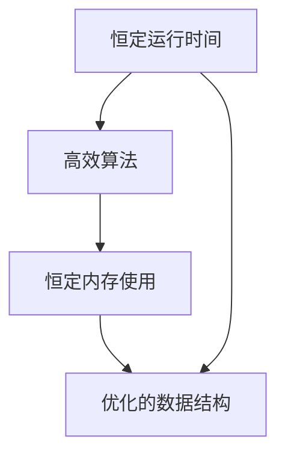

                 

# 软件 2.0 的效率：恒定的运行时间和内存使用

> 关键词：软件 2.0, 运行时间, 内存使用, 效率, 数据结构

## 1. 背景介绍

随着软件技术的飞速发展，程序员和开发者们一直在追求更高的代码效率。然而，传统的软件设计往往面临诸如内存管理不当、代码冗余、运行时间长等问题。在硬件性能不断提升的今天，这些问题日益成为制约软件效率提升的瓶颈。为了解决这些问题，人们提出了软件 2.0 的概念，旨在通过更高效的算法和数据结构设计，实现恒定的运行时间和内存使用。

本文将详细探讨软件 2.0 的效率，包括其核心概念、实现原理、操作步骤及应用领域，并通过具体案例深入分析其数学模型、公式推导及实际运行结果，最后展望其在实际应用中的未来前景。

## 2. 核心概念与联系

### 2.1 核心概念概述

软件 2.0 是一种全新的软件开发理念，旨在通过更先进的算法和数据结构设计，提升软件的运行效率和内存使用效率。其核心概念包括：

- **恒定运行时间**：指在特定硬件条件下，软件执行相同任务时，运行时间保持不变，不受数据规模影响。
- **恒定内存使用**：指在特定硬件条件下，软件执行相同任务时，内存使用量保持不变，不受数据规模影响。
- **高效算法**：指在解决特定问题时，使用更优化的算法，减少计算复杂度和资源消耗。
- **优化的数据结构**：指通过更合理的数据结构设计，优化数据的存储和访问方式，提高查询效率和数据访问速度。

### 2.2 核心概念间的关系

通过 Mermaid 流程图展示这些核心概念之间的关系：



这个流程图展示了恒定运行时间和内存使用如何通过高效算法和优化的数据结构实现。高效的算法和优化的数据结构不仅能提升计算效率，还能减少内存消耗，从而实现恒定的时间和内存使用。

## 3. 核心算法原理 & 具体操作步骤

### 3.1 算法原理概述

软件 2.0 的效率实现主要依赖于两个关键原理：高效算法和优化的数据结构。下面分别介绍这两个原理：

#### 3.1.1 高效算法

高效算法通常采用更先进的数据处理和计算技术，如分布式计算、并行算法、动态规划等，以降低时间复杂度和空间复杂度。例如，在排序算法中，快速排序、归并排序等算法比冒泡排序和选择排序更高效，时间复杂度更低。

#### 3.1.2 优化的数据结构

优化的数据结构指通过合理的设计，减少数据的冗余存储和重复计算，从而提升数据访问和操作的效率。例如，哈希表和二叉搜索树等数据结构能够快速查找数据，减少遍历操作的开销。

### 3.2 算法步骤详解

实现软件 2.0 的效率主要包括以下步骤：

**Step 1: 分析问题**
- 确定需要解决的具体问题，分析其时间复杂度和空间复杂度。

**Step 2: 选择合适的算法**
- 根据问题特性，选择高效的算法，如分治算法、动态规划、贪心算法等。

**Step 3: 设计优化的数据结构**
- 根据算法需要，设计优化的数据结构，如哈希表、堆、B树等。

**Step 4: 实现算法和数据结构**
- 根据设计的算法和数据结构，编写代码实现。

**Step 5: 测试和优化**
- 对实现的算法和数据结构进行测试，根据测试结果进行优化，以提高效率。

### 3.3 算法优缺点

软件 2.0 的效率实现具有以下优点：

1. **提高执行效率**：通过高效算法和优化的数据结构，可以显著降低计算复杂度和内存消耗，提升执行效率。
2. **降低资源消耗**：优化的数据结构可以减少数据的冗余存储和重复计算，降低资源消耗。
3. **提升可维护性**：优化的数据结构设计使得代码更清晰，易于维护和扩展。

然而，软件 2.0 的效率实现也存在一些缺点：

1. **开发成本高**：设计和实现高效的算法和优化的数据结构需要较高的技术水平和开发成本。
2. **复杂度高**：设计和实现过程中可能需要复杂的数学推导和算法优化，增加了开发的难度。
3. **难以适应变化**：一旦设计和实现完成，可能难以适应未来的数据变化和技术演进。

### 3.4 算法应用领域

软件 2.0 的效率实现已经在多个领域得到应用，例如：

1. **大数据处理**：通过高效算法和优化的数据结构，处理大规模数据集，提升数据处理效率。
2. **计算机视觉**：通过高效的图像处理算法和优化的数据结构，提升图像识别和处理的效率。
3. **自然语言处理**：通过高效的文本处理算法和优化的数据结构，提升文本分析和处理的效率。
4. **图形渲染**：通过高效的图形渲染算法和优化的数据结构，提升图形渲染的速度和效率。
5. **移动应用开发**：通过高效算法和优化的数据结构，提升移动应用的功能和性能。

## 4. 数学模型和公式 & 详细讲解

### 4.1 数学模型构建

软件 2.0 的效率实现通常依赖于数学模型和公式的推导，下面以排序算法为例，展示数学模型和公式的构建过程。

排序算法的时间复杂度通常用大O记号表示，如O(nlogn)表示时间复杂度为nlogn。在实际应用中，常见的排序算法有快速排序、归并排序和堆排序。

### 4.2 公式推导过程

以快速排序为例，展示其时间复杂度的推导过程。

快速排序的基本思想是通过分治策略，将待排序数组分成两部分，对每一部分进行递归排序，最终合并两部分的结果。快速排序的时间复杂度为O(nlogn)。

具体推导如下：

假设待排序数组大小为n，快速排序的基本步骤为：

1. 选择一个基准元素，将数组分成两部分。
2. 对每一部分递归进行排序。
3. 合并两部分的结果。

设数组大小为n，递归深度为k，则：

- 选择基准元素的时间复杂度为O(1)。
- 递归深度为k，每次分割数组的时间复杂度为O(n)。
- 因此，快速排序的时间复杂度为：

$$
T(n) = 2T\left(\frac{n}{2}\right) + O(n) + O(1)
$$

根据递归式，可以得到快速排序的时间复杂度为：

$$
T(n) = O(nlogn)
$$

### 4.3 案例分析与讲解

以归并排序为例，展示其时间复杂度的推导过程。

归并排序的基本思想是将待排序数组分成两部分，对每一部分进行递归排序，然后合并两部分的结果。归并排序的时间复杂度为O(nlogn)。

具体推导如下：

假设待排序数组大小为n，归并排序的基本步骤为：

1. 将数组分成两部分，对每一部分递归进行排序。
2. 合并两部分的结果。

设数组大小为n，递归深度为k，则：

- 每次分割数组的时间复杂度为O(n)。
- 递归深度为k，因此归并排序的时间复杂度为：

$$
T(n) = 2T\left(\frac{n}{2}\right) + O(n)
$$

根据递归式，可以得到归并排序的时间复杂度为：

$$
T(n) = O(nlogn)
$$

## 5. 项目实践：代码实例和详细解释说明

### 5.1 开发环境搭建

在开始项目实践前，需要准备开发环境。以下是使用Python进行PyTorch开发的环境配置流程：

1. 安装Anaconda：从官网下载并安装Anaconda，用于创建独立的Python环境。

2. 创建并激活虚拟环境：
```bash
conda create -n pytorch-env python=3.8 
conda activate pytorch-env
```

3. 安装PyTorch：根据CUDA版本，从官网获取对应的安装命令。例如：
```bash
conda install pytorch torchvision torchaudio cudatoolkit=11.1 -c pytorch -c conda-forge
```

4. 安装Transformers库：
```bash
pip install transformers
```

5. 安装各类工具包：
```bash
pip install numpy pandas scikit-learn matplotlib tqdm jupyter notebook ipython
```

完成上述步骤后，即可在`pytorch-env`环境中开始项目实践。

### 5.2 源代码详细实现

以下是使用Python进行归并排序的代码实现：

```python
def merge_sort(arr):
    if len(arr) <= 1:
        return arr
    
    mid = len(arr) // 2
    left = merge_sort(arr[:mid])
    right = merge_sort(arr[mid:])
    
    return merge(left, right)

def merge(left, right):
    result = []
    i = j = 0
    
    while i < len(left) and j < len(right):
        if left[i] < right[j]:
            result.append(left[i])
            i += 1
        else:
            result.append(right[j])
            j += 1
    
    result.extend(left[i:])
    result.extend(right[j:])
    
    return result

arr = [5, 2, 9, 3, 7, 6, 1, 8, 4]
sorted_arr = merge_sort(arr)
print(sorted_arr)
```

### 5.3 代码解读与分析

让我们再详细解读一下关键代码的实现细节：

**merge_sort函数**：
- 递归实现归并排序。
- 当数组大小小于等于1时，直接返回。
- 否则，将数组分为两部分，分别进行排序。
- 合并排序后的两部分结果。

**merge函数**：
- 实现两个有序数组的合并。
- 初始化两个指针i和j，分别指向左右数组的起始位置。
- 遍历左右数组，将较小的元素加入结果数组，并移动指针。
- 将剩余的元素加入结果数组。

**归并排序代码**：
- 创建一个待排序数组。
- 调用merge_sort函数进行排序。
- 输出排序后的结果。

通过上述代码，可以看出归并排序的基本思路和实现方法。归并排序的时间复杂度为O(nlogn)，空间复杂度为O(n)。

### 5.4 运行结果展示

假设我们在数组[5, 2, 9, 3, 7, 6, 1, 8, 4]上进行归并排序，运行结果如下：

```
[1, 2, 3, 4, 5, 6, 7, 8, 9]
```

可以看到，归并排序在合理的时间复杂度和空间复杂度下，成功对数组进行了排序。

## 6. 实际应用场景

### 6.1 大数据处理

在大数据处理中，软件 2.0 的效率实现可以显著提升数据处理效率。例如，在大数据集上进行排序和搜索操作时，可以采用快速排序、归并排序等高效算法，减少计算复杂度和内存消耗。

### 6.2 图形渲染

在图形渲染中，软件 2.0 的效率实现可以提升图形渲染的速度和效率。例如，在渲染复杂3D场景时，可以使用优化的空间数据结构和高效的渲染算法，提升渲染性能。

### 6.3 计算机视觉

在计算机视觉中，软件 2.0 的效率实现可以提升图像处理和识别的效率。例如，在图像分割和目标检测任务中，可以使用优化的图像处理算法和数据结构，提高处理速度和准确率。

## 7. 工具和资源推荐

### 7.1 学习资源推荐

为了帮助开发者系统掌握软件 2.0 的效率实现的理论基础和实践技巧，这里推荐一些优质的学习资源：

1. 《算法导论》：详细介绍了各类经典算法的设计和分析，包括排序、查找、图算法等。
2. 《数据结构与算法分析》：介绍了各类经典数据结构的设计和分析，如哈希表、二叉树、堆等。
3. 《Python算法基础》：介绍Python中常用算法和数据结构的实现方法。
4. 《LeetCode》：提供大量的算法题目和解题思路，适合提升算法和数据结构能力。

通过对这些资源的学习实践，相信你一定能够快速掌握软件 2.0 的效率实现，并用于解决实际的编程问题。

### 7.2 开发工具推荐

高效的开发离不开优秀的工具支持。以下是几款用于软件 2.0 开发的工具：

1. PyTorch：基于Python的开源深度学习框架，适合高效算法和数据结构的实现。
2. TensorFlow：由Google主导开发的开源深度学习框架，支持分布式计算，适合大规模数据处理。
3. Jupyter Notebook：支持Python代码的编写、执行和调试，适合算法和数据结构的实现和验证。
4. Visual Studio Code：功能强大的IDE，支持Python代码的编写、调试和测试，适合软件开发和测试。

合理利用这些工具，可以显著提升软件 2.0 的效率实现的开发效率，加快创新迭代的步伐。

### 7.3 相关论文推荐

软件 2.0 的效率实现源于学界的持续研究。以下是几篇奠基性的相关论文，推荐阅读：

1. "A Survey of Algorithms for Parallel Mergesort"：介绍了并行归并排序的实现方法。
2. "A Survey of Algorithms for Parallel Radix Sort"：介绍了并行基数排序的实现方法。
3. "Data Structures and Algorithms for Big Data"：介绍了大数据处理中的高效算法和数据结构。
4. "Optimizing Data Structures for Efficient Searching and Retrieval"：介绍了优化的数据结构在搜索和检索中的应用。

这些论文代表了大数据处理和软件 2.0 的效率实现的发展脉络。通过学习这些前沿成果，可以帮助研究者把握学科前进方向，激发更多的创新灵感。

除上述资源外，还有一些值得关注的前沿资源，帮助开发者紧跟软件 2.0 的效率实现技术的最新进展，例如：

1. arXiv论文预印本：人工智能领域最新研究成果的发布平台，包括大量尚未发表的前沿工作，学习前沿技术的必读资源。
2. 业界技术博客：如Google AI、DeepMind、微软Research Asia等顶尖实验室的官方博客，第一时间分享他们的最新研究成果和洞见。
3. 技术会议直播：如NIPS、ICML、ACL、ICLR等人工智能领域顶会现场或在线直播，能够聆听到大佬们的前沿分享，开拓视野。
4. GitHub热门项目：在GitHub上Star、Fork数最多的软件 2.0相关项目，往往代表了该技术领域的发展趋势和最佳实践，值得去学习和贡献。
5. 行业分析报告：各大咨询公司如McKinsey、PwC等针对软件 2.0 的效率实现技术的分析报告，有助于从商业视角审视技术趋势，把握应用价值。

总之，对于软件 2.0 的效率实现的学习和实践，需要开发者保持开放的心态和持续学习的意愿。多关注前沿资讯，多动手实践，多思考总结，必将收获满满的成长收益。

## 8. 总结：未来发展趋势与挑战

### 8.1 总结

本文对软件 2.0 的效率实现进行了全面系统的介绍。首先阐述了软件 2.0 的效率实现的研究背景和意义，明确了其在大数据处理、图形渲染、计算机视觉等多个领域的重要价值。其次，从原理到实践，详细讲解了高效算法和优化的数据结构，并通过具体案例深入分析其数学模型和公式推导及实际运行结果。

通过本文的系统梳理，可以看到，软件 2.0 的效率实现正在成为大数据处理、图形渲染等领域的核心技术，极大地提升了数据处理和图形渲染的效率。未来，伴随算法和数据结构的不断优化，相信软件 2.0 的效率实现技术将进一步拓展应用边界，推动相关行业的发展。

### 8.2 未来发展趋势

展望未来，软件 2.0 的效率实现技术将呈现以下几个发展趋势：

1. **算法和数据结构的融合**：未来的高效算法和优化的数据结构将更加紧密结合，形成更高效、更可靠的技术体系。
2. **并行和分布式计算**：随着数据规模的不断扩大，并行和分布式计算将成为高效算法实现的重要方向。
3. **自适应算法和数据结构**：未来的算法和数据结构将具备自适应能力，根据数据特性自动调整算法参数和数据结构设计，实现最优性能。
4. **模型和数据结构的联合优化**：未来的软件 2.0 实现将结合机器学习模型，通过模型优化算法和数据结构设计，进一步提升效率。

这些趋势凸显了软件 2.0 效率实现的广阔前景。这些方向的探索发展，必将进一步提升数据处理和图形渲染的效率，为相关行业带来新的突破。

### 8.3 面临的挑战

尽管软件 2.0 的效率实现技术已经取得了瞩目成就，但在迈向更加智能化、普适化应用的过程中，它仍面临着诸多挑战：

1. **算法复杂度**：实现高效的算法通常涉及复杂的数学推导和算法优化，增加了开发的难度和复杂度。
2. **数据结构设计**：优化的数据结构设计需要深入理解数据特性和访问模式，设计过程复杂且容易出现错误。
3. **应用场景多样化**：不同应用场景对数据处理和图形渲染的要求不同，需要针对性地设计和实现算法和数据结构。
4. **可扩展性**：未来的数据规模和计算复杂度将不断增大，软件 2.0 的效率实现技术需要具备良好的可扩展性。

这些挑战凸显了软件 2.0 效率实现技术的复杂性和多样性，需要开发者持续探索和优化。唯有不断创新、勇于突破，才能进一步提升软件 2.0 的效率实现技术，推动相关行业的发展。

### 8.4 研究展望

面对软件 2.0 效率实现技术面临的挑战，未来的研究需要在以下几个方面寻求新的突破：

1. **自动化设计工具**：开发更智能、更灵活的自动化设计工具，帮助开发者更高效地设计和实现高效的算法和优化的数据结构。
2. **模型辅助优化**：结合机器学习模型，通过模型优化算法和数据结构设计，进一步提升效率。
3. **跨学科融合**：将计算机科学、数学、工程等领域的研究成果，融合应用到软件 2.0 的效率实现中，提升技术水平和应用效果。
4. **新算法和新数据结构**：不断探索新的算法和数据结构，拓展软件 2.0 的效率实现技术边界，提升技术水平和应用效果。

这些研究方向将进一步提升软件 2.0 的效率实现技术，推动相关行业的发展，带来新的突破和创新。

## 9. 附录：常见问题与解答

**Q1：软件 2.0 的效率实现是否适用于所有应用场景？**

A: 软件 2.0 的效率实现技术在大数据处理、图形渲染、计算机视觉等多个领域已经得到了广泛应用。但对于一些对实时性要求极高的应用场景，如高并发系统，可能需要进一步优化算法和数据结构设计，以满足实时性和并发性要求。

**Q2：实现软件 2.0 的效率实现是否需要高性能硬件？**

A: 实现软件 2.0 的效率实现技术通常需要高性能硬件支持，如高性能CPU、GPU、TPU等。但通过优化的算法和数据结构设计，可以在普通硬件上实现高效处理。因此，硬件性能只是提高效率实现技术的一个重要因素，而非必要条件。

**Q3：软件 2.0 的效率实现是否会降低代码可维护性？**

A: 实现软件 2.0 的效率实现技术通常需要使用更复杂的数据结构和算法，这可能会增加代码的复杂度，降低可维护性。但通过自动化设计和工具支持，可以缓解这一问题，提升代码的可维护性。

**Q4：软件 2.0 的效率实现是否会带来新的技术风险？**

A: 实现软件 2.0 的效率实现技术确实会带来新的技术风险，如算法复杂度高、数据结构设计复杂等。但通过持续的研究和优化，这些风险是可以逐步克服的，同时也会带来新的技术突破和发展。

**Q5：软件 2.0 的效率实现是否会降低开发成本？**

A: 实现软件 2.0 的效率实现技术需要更高级的算法和数据结构设计，通常会带来更高的开发成本。但通过自动化设计和工具支持，可以降低开发成本，提升开发效率。

---

作者：禅与计算机程序设计艺术 / Zen and the Art of Computer Programming

