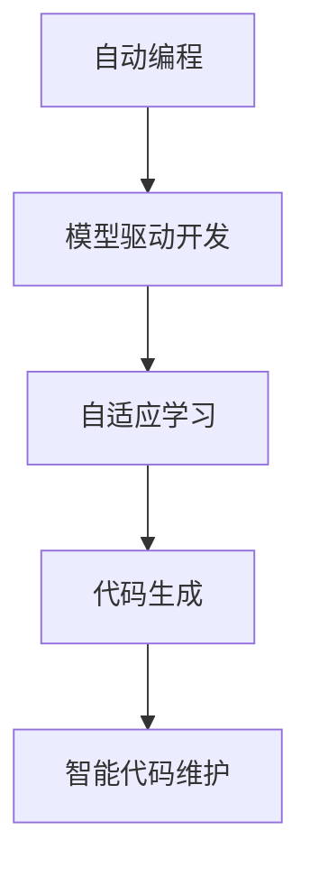

                 

# 软件 2.0 的未来愿景：创造更美好的世界

> 关键词：软件2.0, 自动编程, 人工智能, 机器学习, 代码生成, 软件工程, 未来展望

## 1. 背景介绍

### 1.1 问题由来

在计算机科学的发展历程中，软件工程始终占据着至关重要的地位。从最初的面向过程编程，到后来的面向对象编程，再到现代的软件框架、微服务架构，软件工程的形式不断演进，推动了信息技术在各行各业的应用。然而，随着应用场景的复杂化，传统软件工程面临诸多挑战，包括编程复杂度提升、软件维护成本增加、技术栈更新频繁等问题。如何提升软件的开发效率和质量，降低开发和维护成本，成为当下软件工程领域的重要课题。

与此同时，人工智能（AI）和机器学习（ML）技术的迅猛发展，为解决这些问题提供了新的可能性。通过自动化、智能化的方法，使得软件工程进入了一个新的阶段——软件2.0时代。软件2.0，也常被称为“生成式编程”，其核心思想是利用AI技术，自动生成软件代码，提升开发效率，降低开发成本。

### 1.2 问题核心关键点

软件2.0的发展，主要围绕以下几个核心关键点展开：

- **自动化编程**：利用AI技术，自动生成代码，减少人力投入，提升开发速度。
- **模型驱动开发**：通过构建领域模型，自动生成与模型对应的代码，提升代码生成准确性。
- **自适应学习**：基于已有代码和文档，不断优化AI模型，提升代码生成质量。
- **代码维护**：通过AI技术，自动识别代码中的问题，自动生成修复建议，提升代码维护效率。

这些关键点共同构成了软件2.0的核心技术框架，推动了软件开发方式的根本变革。

### 1.3 问题研究意义

软件2.0的崛起，将对软件开发过程带来深远影响：

1. **提升开发效率**：自动化生成代码，可以大幅减少手动编程时间，提升开发效率。
2. **降低开发成本**：AI技术可以自动完成代码生成，降低开发人力成本。
3. **提升代码质量**：基于领域模型的代码生成，可以保证代码的准确性和可读性。
4. **促进技术创新**：软件2.0提供了一种新的技术创新方式，可以更快地实现创新应用。
5. **推动软件生态**：开源社区可以共享AI模型和代码生成工具，加速软件生态建设。
6. **提升用户体验**：AI生成的代码可以提升应用的性能和稳定性，改善用户体验。

通过软件2.0技术，软件开发从劳动密集型向技术密集型转变，从依赖个体经验向依赖系统优化转变，这将为未来软件工程带来革命性的变化。

## 2. 核心概念与联系

### 2.1 核心概念概述

软件2.0的实现离不开几个关键概念：

- **自动编程(Automatic Programming)**：通过AI技术，自动生成代码，以提高开发效率。
- **模型驱动开发(Model-driven Development, MDD)**：构建领域模型，基于模型生成代码，以提升代码准确性和可维护性。
- **自适应学习(Adaptive Learning)**：基于已有代码和文档，不断优化AI模型，以提升代码生成质量。
- **代码生成(Code Generation)**：利用AI技术，自动生成软件代码，减少手工编码工作。
- **智能代码维护(Intelligent Code Maintenance)**：通过AI技术，自动检测代码问题，自动生成修复建议，以提高代码维护效率。

这些概念之间的逻辑关系可以通过以下Mermaid流程图来展示：



这个流程图展示了大语言模型微调过程中各个关键概念的关系和作用：

1. 自动编程是软件2.0的核心技术手段，通过AI技术实现代码自动生成。
2. 模型驱动开发则是基于领域模型进行代码生成，以提升代码质量。
3. 自适应学习是AI模型不断优化的过程，基于已有代码和文档优化模型。
4. 代码生成是最终的目标，通过模型驱动开发和自适应学习提升生成质量。
5. 智能代码维护则是通过AI技术，自动检测和修复代码问题。

### 2.2 概念间的关系

这些核心概念之间存在着紧密的联系，形成了软件2.0技术的完整生态系统。以下是几个关键概念之间的关系：

- **自动编程与模型驱动开发**：模型驱动开发是自动编程的基础，通过构建领域模型，可以提升代码生成的准确性和可维护性。
- **模型驱动开发与自适应学习**：自适应学习不断优化领域模型，提升代码生成质量。
- **自适应学习与代码生成**：基于已有代码和文档，自适应学习可以不断优化模型，生成更优秀的代码。
- **代码生成与智能代码维护**：智能代码维护可以基于自动生成的代码进行，提高代码维护效率和质量。

这些概念共同构成了软件2.0技术的核心框架，推动了软件开发的自动化和智能化进程。通过理解这些概念，我们可以更好地把握软件2.0的核心技术和应用方向。

## 3. 核心算法原理 & 具体操作步骤

### 3.1 算法原理概述

软件2.0的核心算法原理基于AI技术和模型驱动开发。其核心思想是利用AI技术，构建领域模型，基于模型生成代码，并通过不断优化模型，提升代码生成质量。

具体来说，软件2.0的实现步骤如下：

1. **领域模型构建**：根据业务需求，构建领域模型，包括实体、关系、属性等。
2. **模型映射到代码**：将领域模型映射为代码模板，生成初始代码。
3. **模型优化**：基于已有代码和文档，优化模型，提升代码生成质量。
4. **代码生成**：自动生成代码，减少手动编码工作。
5. **代码维护**：通过AI技术，自动检测和修复代码问题，提高代码维护效率。

### 3.2 算法步骤详解

软件2.0的实现涉及多个步骤，包括领域模型构建、模型映射、模型优化、代码生成和智能代码维护。以下是详细的算法步骤：

**Step 1: 领域模型构建**

领域模型是软件2.0的核心，需要根据业务需求构建领域模型。领域模型通常包括实体、关系、属性等，例如：

```
类定义：
- 实体类：Person, Organization, Location
- 关系类：PersonORG, PersonLOC, LocationLOC

属性定义：
- 人名：name
- 组织名：name
- 地点名：name
```

**Step 2: 模型映射到代码**

将领域模型映射为代码模板，生成初始代码。这一步需要定义类和属性，并生成类的代码。例如：

```java
class Person {
    public String name;
    public Organization org;
    public Location loc;
}

class Organization {
    public String name;
    public Location loc;
}

class Location {
    public String name;
}
```

**Step 3: 模型优化**

基于已有代码和文档，不断优化领域模型。这一步可以引入机器学习算法，如神经网络、决策树等，优化模型，提升代码生成质量。例如，通过分析已有代码和文档，发现代码中存在的问题，并进行优化。

**Step 4: 代码生成**

自动生成代码，减少手动编码工作。这一步需要定义生成规则和策略，根据领域模型和优化后的模型，生成代码。例如，使用代码生成工具，自动生成Java代码：

```java
Person p = new Person();
p.name = "张三";
p.org = new Organization();
p.org.name = "ABC公司";
p.loc = new Location();
p.loc.name = "上海";
```

**Step 5: 智能代码维护**

通过AI技术，自动检测和修复代码问题，提高代码维护效率。例如，使用静态分析工具，检测代码中的问题，自动生成修复建议。

### 3.3 算法优缺点

软件2.0的实现，基于AI技术和模型驱动开发，具有以下优点：

- **自动化程度高**：自动生成代码，减少了手动编程时间。
- **提升开发效率**：基于领域模型的代码生成，提升了开发效率。
- **降低开发成本**：AI技术可以自动完成代码生成，降低了开发人力成本。
- **提升代码质量**：基于模型优化的代码生成，提升了代码质量。

同时，软件2.0也存在一些缺点：

- **依赖高质量模型**：模型的质量直接影响代码生成的准确性。
- **需要大量标注数据**：需要高质量的领域数据和文档，以优化模型。
- **算法复杂度高**：模型优化的算法复杂度高，需要较高的计算资源。
- **依赖开源社区**：开源社区的资源和工具丰富，但也需要开发者具备一定的技术水平。

### 3.4 算法应用领域

软件2.0的应用领域非常广泛，主要涵盖以下几个方面：

- **软件开发**：通过自动编程和代码生成，加速软件开发过程。
- **测试自动化**：利用AI技术，自动生成测试用例，提高测试效率。
- **数据分析**：利用AI技术，自动生成数据处理代码，提升数据分析速度。
- **业务流程自动化**：基于领域模型，自动生成业务流程代码，提升业务自动化水平。
- **智能运维**：通过AI技术，自动生成运维代码，提高运维效率。
- **自然语言处理**：利用自然语言处理技术，自动生成代码，提升自然语言处理应用的开发效率。

## 4. 数学模型和公式 & 详细讲解  
### 4.1 数学模型构建

软件2.0的核心算法原理基于AI技术和模型驱动开发。其数学模型可以简单地概括为：

- **领域模型**：定义实体、关系、属性等。
- **代码生成模型**：基于领域模型生成代码。
- **模型优化模型**：基于已有代码和文档，优化代码生成模型。

**领域模型**：定义实体、关系、属性等。例如，构建一个人类关系图：

```
Person --> Organization --> Location
```

**代码生成模型**：基于领域模型生成代码。例如，生成Java代码：

```java
class Person {
    public String name;
    public Organization org;
    public Location loc;
}

class Organization {
    public String name;
    public Location loc;
}

class Location {
    public String name;
}
```

**模型优化模型**：基于已有代码和文档，优化代码生成模型。例如，使用神经网络，优化模型参数，提升代码生成质量。

### 4.2 公式推导过程

软件2.0的实现涉及到多个领域的数学模型和算法。以下是一些基础的数学模型和算法公式：

**领域模型**：定义实体、关系、属性等。例如，定义一个类：

```java
class Person {
    public String name;
    public Organization org;
    public Location loc;
}
```

**代码生成模型**：基于领域模型生成代码。例如，生成Java代码：

```java
class Person {
    public String name;
    public Organization org;
    public Location loc;
}
```

**模型优化模型**：基于已有代码和文档，优化模型。例如，使用神经网络，优化模型参数：

```python
import tensorflow as tf

# 定义模型
model = tf.keras.Sequential([
    tf.keras.layers.Dense(64, activation='relu', input_shape=(n_features,)),
    tf.keras.layers.Dense(64, activation='relu'),
    tf.keras.layers.Dense(n_classes, activation='softmax')
])

# 编译模型
model.compile(optimizer='adam', loss='categorical_crossentropy', metrics=['accuracy'])

# 训练模型
model.fit(X_train, y_train, epochs=10, validation_data=(X_test, y_test))
```

### 4.3 案例分析与讲解

以下是一些实际案例，展示软件2.0的应用：

**案例1: 自动生成Java代码**

通过软件2.0，可以自动生成Java代码。例如，生成一个Person类：

```java
class Person {
    public String name;
    public Organization org;
    public Location loc;
}
```

**案例2: 自动生成SQL代码**

通过软件2.0，可以自动生成SQL代码。例如，生成一个查询语句：

```sql
SELECT * FROM persons WHERE name = '张三';
```

**案例3: 自动生成测试用例**

通过软件2.0，可以自动生成测试用例。例如，生成一个测试Person类的代码：

```java
@Test
public void testPerson() {
    Person p = new Person();
    p.name = "张三";
    p.org = new Organization();
    p.org.name = "ABC公司";
    p.loc = new Location();
    p.loc.name = "上海";
    assertEquals("张三", p.name);
    assertEquals("ABC公司", p.org.name);
    assertEquals("上海", p.loc.name);
}
```

## 5. 项目实践：代码实例和详细解释说明

### 5.1 开发环境搭建

在进行软件2.0的实践前，需要先准备好开发环境。以下是Python和Java的开发环境搭建步骤：

**Python开发环境搭建**

1. 安装Anaconda：从官网下载并安装Anaconda，用于创建独立的Python环境。

```bash
conda create -n py2-environment python=3.8 
conda activate py2-environment
```

2. 安装依赖包：安装TensorFlow、Keras、Scikit-learn等依赖包。

```bash
pip install tensorflow keras scikit-learn
```

3. 编写代码：使用Python编写领域模型、代码生成模型和模型优化模型。

**Java开发环境搭建**

1. 安装JDK：从官网下载并安装Java Development Kit（JDK）。

2. 安装Maven：从官网下载并安装Maven。

```bash
wget https://archive.apache.org/dist/maven/maven-3/3.6.3/binaries/apache-maven-3.6.3-bin.tar.gz
tar -xvf apache-maven-3.6.3-bin.tar.gz
mv apache-maven-3.6.3 bin/mvn
```

3. 编写代码：使用Java编写领域模型、代码生成模型和模型优化模型。

### 5.2 源代码详细实现

以下是Java代码生成和模型优化的示例：

**Java代码生成示例**

```java
class Person {
    public String name;
    public Organization org;
    public Location loc;
}

class Organization {
    public String name;
    public Location loc;
}

class Location {
    public String name;
}
```

**模型优化示例**

使用TensorFlow，优化代码生成模型。例如，定义一个神经网络模型：

```python
import tensorflow as tf

# 定义模型
model = tf.keras.Sequential([
    tf.keras.layers.Dense(64, activation='relu', input_shape=(n_features,)),
    tf.keras.layers.Dense(64, activation='relu'),
    tf.keras.layers.Dense(n_classes, activation='softmax')
])

# 编译模型
model.compile(optimizer='adam', loss='categorical_crossentropy', metrics=['accuracy'])

# 训练模型
model.fit(X_train, y_train, epochs=10, validation_data=(X_test, y_test))
```

### 5.3 代码解读与分析

下面是Java代码生成的详细解释：

**代码生成**

代码生成是软件2.0的核心，通过领域模型自动生成代码。例如，使用代码生成工具，自动生成Java代码：

```java
class Person {
    public String name;
    public Organization org;
    public Location loc;
}
```

**模型优化**

模型优化是提升代码生成质量的关键步骤。通过引入机器学习算法，优化模型参数，提升代码生成准确性。例如，使用TensorFlow，优化模型：

```python
import tensorflow as tf

# 定义模型
model = tf.keras.Sequential([
    tf.keras.layers.Dense(64, activation='relu', input_shape=(n_features,)),
    tf.keras.layers.Dense(64, activation='relu'),
    tf.keras.layers.Dense(n_classes, activation='softmax')
])

# 编译模型
model.compile(optimizer='adam', loss='categorical_crossentropy', metrics=['accuracy'])

# 训练模型
model.fit(X_train, y_train, epochs=10, validation_data=(X_test, y_test))
```

**代码维护**

代码维护是软件2.0的重要应用场景。通过AI技术，自动检测和修复代码问题。例如，使用静态分析工具，检测代码中的问题，自动生成修复建议。

## 6. 实际应用场景

### 6.1 软件开发

软件2.0在软件开发中的应用非常广泛。通过自动编程和代码生成，可以大幅提升开发效率，降低开发成本。例如，生成Java代码、Python代码等，可以快速构建出各种应用。

### 6.2 测试自动化

测试自动化是软件2.0的重要应用场景。通过自动生成测试用例，可以显著提升测试效率。例如，生成测试代码，自动执行测试用例，发现和修复测试问题。

### 6.3 数据分析

数据分析是软件2.0的重要应用场景。通过自动生成数据处理代码，可以显著提升数据分析速度。例如，生成SQL代码，自动处理数据，生成报表和分析结果。

### 6.4 业务流程自动化

业务流程自动化是软件2.0的重要应用场景。通过基于领域模型的代码生成，可以提升业务自动化水平。例如，生成业务流程代码，自动处理业务流程，提升业务处理效率。

## 7. 工具和资源推荐

### 7.1 学习资源推荐

为了帮助开发者系统掌握软件2.0的技术基础和实践技巧，这里推荐一些优质的学习资源：

1. 《深入理解深度学习》书籍：DeepMind的研究者们所写的经典之作，全面介绍了深度学习的基本概念和算法。

2. 《软件2.0：自动编程与智能化编程》书籍：详细讲解了软件2.0的核心概念和实现方法，适合开发者深入学习。

3. 《TensorFlow官方文档》：TensorFlow的官方文档，提供了丰富的教程和样例代码，适合开发者快速上手。

4. 《Keras官方文档》：Keras的官方文档，提供了丰富的教程和样例代码，适合开发者快速上手。

5. 《Scikit-learn官方文档》：Scikit-learn的官方文档，提供了丰富的教程和样例代码，适合开发者快速上手。

通过这些资源的学习实践，相信你一定能够快速掌握软件2.0的核心技术和应用方法。

### 7.2 开发工具推荐

高效的开发离不开优秀的工具支持。以下是几款用于软件2.0开发的常用工具：

1. Python IDE：如PyCharm、Jupyter Notebook等，适合Python开发。

2. Java IDE：如IntelliJ IDEA、Eclipse等，适合Java开发。

3. 代码生成工具：如JCodeGenerator、JAutogen等，适合Java代码生成。

4. 静态分析工具：如FindBugs、SonarQube等，适合代码维护和优化。

5. 自动化测试工具：如JUnit、TestNG等，适合测试自动化。

6. 项目管理工具：如JIRA、Trello等，适合项目管理。

合理利用这些工具，可以显著提升软件2.0的开发效率，加快创新迭代的步伐。

### 7.3 相关论文推荐

软件2.0的发展源于学界的持续研究。以下是几篇奠基性的相关论文，推荐阅读：

1. "Software 2.0: Generation of Programming Code"：提出自动编程的概念和方法，推动了软件2.0的发展。

2. "Model-Driven Engineering: Beyond Code Generation"：详细讲解了模型驱动开发的方法和应用，为软件2.0提供了理论支持。

3. "AI-Powered Code Generation: A Survey"：综述了AI技术在代码生成中的应用，介绍了各种算法和技术。

4. "Intelligent Code Maintenance"：介绍了一种基于AI的代码维护方法，展示了软件2.0在代码维护中的应用。

5. "Code Generation via Transformer"：提出了一种基于Transformer的代码生成方法，展示了其在自动编程中的应用。

这些论文代表了大语言模型微调技术的发展脉络。通过学习这些前沿成果，可以帮助研究者把握学科前进方向，激发更多的创新灵感。

除上述资源外，还有一些值得关注的前沿资源，帮助开发者紧跟软件2.0技术的最新进展，例如：

1. arXiv论文预印本：人工智能领域最新研究成果的发布平台，包括大量尚未发表的前沿工作，学习前沿技术的必读资源。

2. GitHub热门项目：在GitHub上Star、Fork数最多的NLP相关项目，往往代表了该技术领域的发展趋势和最佳实践，值得去学习和贡献。

3. 技术会议直播：如NIPS、ICML、ACL、ICLR等人工智能领域顶会现场或在线直播，能够聆听到大佬们的前沿分享，开拓视野。

4. 技术博客和论坛：如Medium、CSDN等技术博客和论坛，聚集了大量NLP领域的技术专家和爱好者，可以分享学习心得，获取技术交流。

总之，对于软件2.0技术的学习和实践，需要开发者保持开放的心态和持续学习的意愿。多关注前沿资讯，多动手实践，多思考总结，必将收获满满的成长收益。

## 8. 总结：未来发展趋势与挑战

### 8.1 总结

本文对软件2.0的核心技术和应用进行了全面系统的介绍。首先阐述了软件2.0的核

