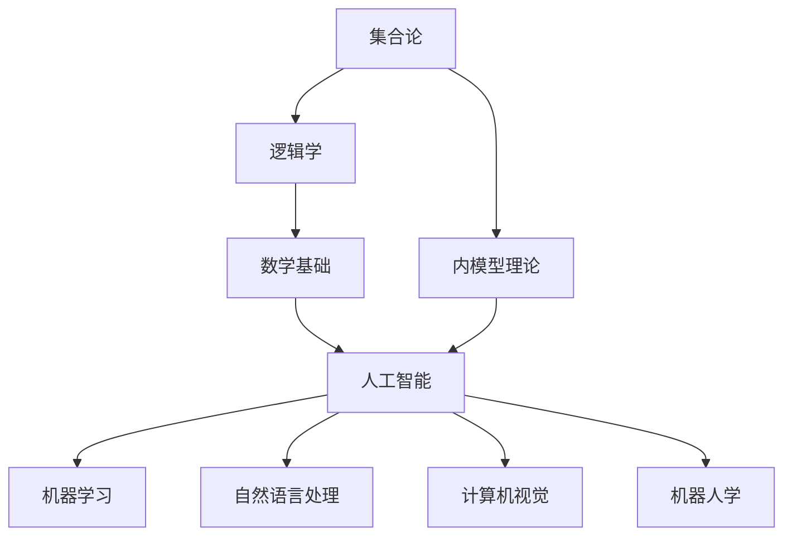
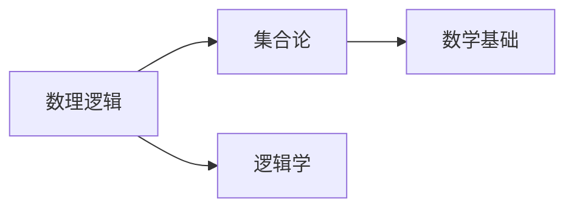
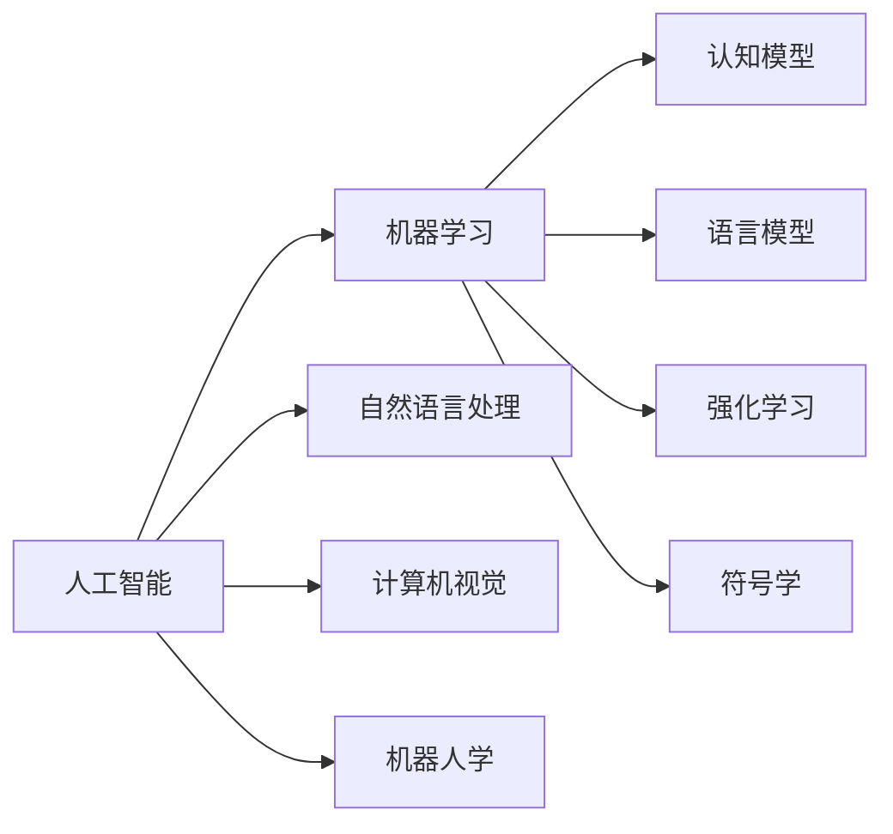
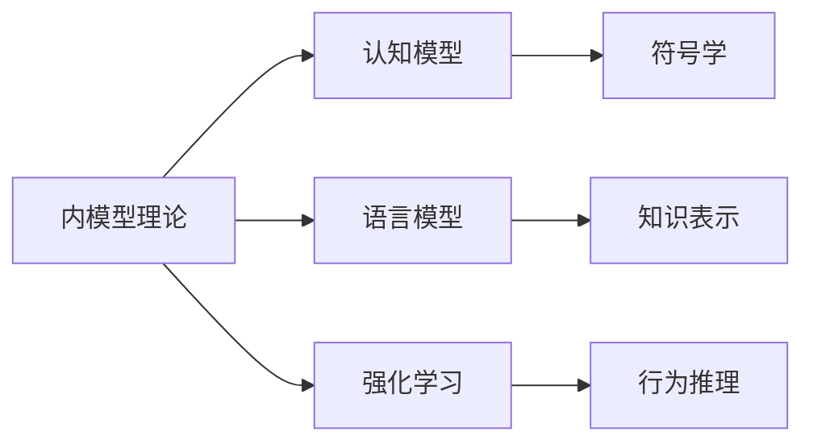
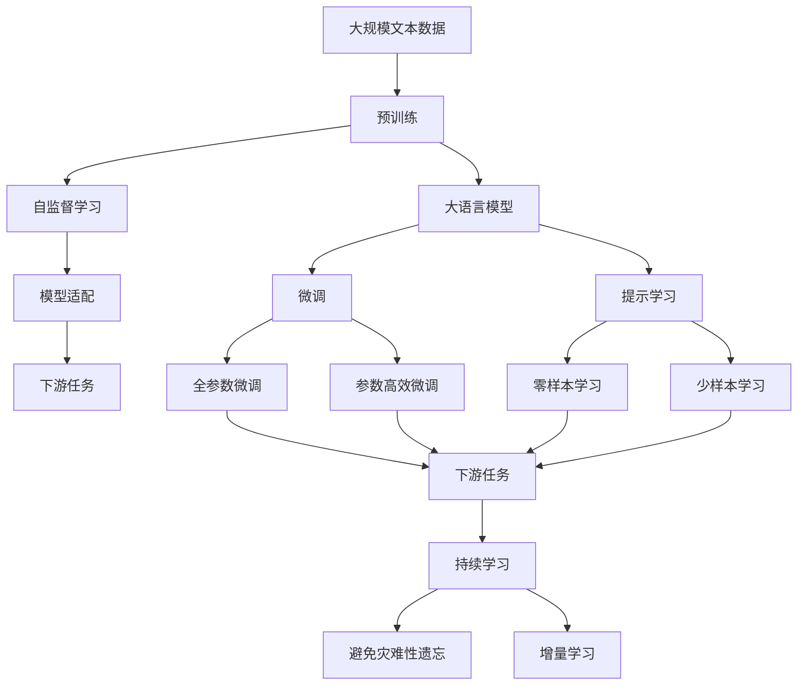

                 

# 集合论导引：兼容内模型

> 关键词：集合论, 内模型, 逻辑学, 数学基础, 人工智能

## 1. 背景介绍

### 1.1 问题由来
集合论是现代数学的基础之一，是数学逻辑和计算机科学的重要工具。在计算机科学中，集合论被广泛应用于算法设计、数据结构、数据库、人工智能等领域。近年来，随着人工智能技术的飞速发展，集合论在机器学习和理论计算机科学中的作用愈发重要。

特别是，集合论与内模型理论在人工智能中有着广泛的应用。内模型理论是数理逻辑的一个分支，主要研究一个形式系统的模型性质。在人工智能中，内模型理论被用来构造认知模型，研究人类思维的运作机制。

本文将详细探讨内模型理论在人工智能中的应用，特别是其在集合论中的体现和应用。通过介绍集合论和内模型理论的基本概念和核心思想，本文将帮助读者更好地理解这些理论在人工智能中的应用，并为进一步的学习和研究提供基础。

### 1.2 问题核心关键点
内模型理论在人工智能中的核心关键点包括：
- 集合论的基本概念和基本定理
- 内模型理论的基本概念和基本定理
- 集合论与内模型理论的联系和区别
- 内模型理论在人工智能中的应用

本文将通过详细介绍这些核心关键点，帮助读者全面理解内模型理论在人工智能中的应用。

## 2. 核心概念与联系

### 2.1 核心概念概述

为了更好地理解内模型理论在人工智能中的应用，我们需要首先介绍一些核心概念：

- **集合论**：是研究集合（一组对象的总体）以及它们的结构和性质的数学分支。集合论的基本概念包括元素、集合、并集、交集、子集、空集等。

- **内模型理论**：数理逻辑的一个分支，主要研究一个形式系统的模型性质。内模型理论的基本概念包括模型、同构、内模型、同构嵌入等。

- **逻辑学**：研究推理、论证、逻辑命题和逻辑系统等内容的学科。逻辑学与集合论和内模型理论紧密相关，共同构成了数理逻辑的基础。

- **数学基础**：研究数学理论的公理系统、基本概念和证明方法的理论。数学基础包括集合论、逻辑学和数理逻辑等内容。

- **人工智能**：研究如何利用计算机模拟人类智能的学科。人工智能包括机器学习、自然语言处理、计算机视觉、机器人学等领域。

这些核心概念之间的逻辑关系可以通过以下Mermaid流程图来展示：



这个流程图展示了集合论、逻辑学、内模型理论、数学基础以及人工智能各个领域之间的逻辑关系：

1. 集合论是逻辑学和内模型理论的基础，也是数学基础的重要组成部分。
2. 内模型理论与人工智能中的认知模型和语言模型等概念紧密相关。
3. 数学基础提供了人工智能的理论基础，集合论和内模型理论是其中的重要部分。
4. 人工智能包括多个领域，内模型理论在其中有着广泛的应用。

### 2.2 概念间的关系

这些核心概念之间存在着紧密的联系，形成了数学逻辑和人工智能的完整生态系统。下面我们通过几个Mermaid流程图来展示这些概念之间的关系。

#### 2.2.1 数学逻辑的层次结构



这个流程图展示了数理逻辑、集合论和逻辑学之间的关系。数理逻辑是集合论和逻辑学的基础，集合论是逻辑学的一部分。

#### 2.2.2 人工智能的层次结构



这个流程图展示了人工智能、机器学习、自然语言处理、计算机视觉和机器人学之间的关系。人工智能包括多个子领域，内模型理论在其中有着广泛的应用。

#### 2.2.3 内模型理论在人工智能中的应用



这个流程图展示了内模型理论在认知模型、语言模型和强化学习中的应用。内模型理论通过构造认知模型，研究人类思维的运作机制，对人工智能的发展有着重要的影响。

### 2.3 核心概念的整体架构

最后，我们用一个综合的流程图来展示这些核心概念在内模型理论中的应用：



这个综合流程图展示了从预训练到微调，再到持续学习的完整过程。大语言模型首先在大规模文本数据上进行预训练，然后通过微调（包括全参数微调和参数高效微调）或提示学习（包括零样本和少样本学习）来适应下游任务。最后，通过持续学习技术，模型可以不断学习新知识，同时避免遗忘旧知识。

## 3. 核心算法原理 & 具体操作步骤
### 3.1 算法原理概述

内模型理论在人工智能中的应用，主要是通过构造认知模型来实现的。认知模型是一种形式系统，模拟人类思维的运作机制，包括推理、判断、学习等能力。内模型理论研究的形式系统，通常是一种满足某种公理体系的集合论模型。

内模型理论的核心原理包括以下几点：

1. **模型与模型之间的同构**：如果两个模型是同构的，它们具有相同的结构。同构模型可以相互映射，因此在形式系统的模型研究中非常重要。

2. **内模型与形式系统的关系**：形式系统的每个模型，都可以内嵌入另一个更大的模型中。这种内模型关系，是内模型理论的核心概念之一。

3. **形式系统的公理体系**：形式系统的公理体系，决定了其模型性质。内模型理论通过研究形式系统的公理体系，分析其模型的性质和结构。

4. **形式系统的同构嵌入**：形式系统的同构嵌入，是指将一个形式系统的模型内嵌入另一个更大的模型中。这种嵌入关系，可以用于构造新的认知模型。

### 3.2 算法步骤详解

基于内模型理论的认知模型构建过程，通常包括以下几个关键步骤：

**Step 1: 选择形式系统**  
首先，需要选择一个形式系统作为构造认知模型的基础。形式系统包括公理体系、推理规则等，可以是任何满足一定条件的数学模型。

**Step 2: 构造形式系统的模型**  
然后，构造形式系统的模型。模型的具体形式，取决于形式系统的性质和公理体系。例如，如果形式系统的公理体系是集合论，那么可以构造一个基于集合论的模型。

**Step 3: 内模型嵌入**  
接下来，将形式系统的模型内嵌入一个更大的模型中。这种内模型嵌入，可以用于构造新的认知模型。

**Step 4: 构造认知模型**  
最后，构造认知模型。认知模型的具体形式，取决于内模型嵌入的形式。例如，可以将内模型嵌入到一个图灵机中，构造一个基于图灵机的认知模型。

### 3.3 算法优缺点

基于内模型理论的认知模型构建方法，具有以下优点：

1. **抽象性**：内模型理论抽象性强，可以应用于多种形式系统。形式系统的公理体系，决定了模型的性质和结构。

2. **普遍性**：内模型理论的构造方法，可以应用于多个领域，如认知科学、人工智能、逻辑学等。

3. **可扩展性**：内模型理论的构造方法，可以扩展到更复杂的认知模型中，如神经网络模型、语言模型等。

然而，基于内模型理论的认知模型构建方法，也存在一些缺点：

1. **复杂性**：内模型理论的构造方法，需要较深的数学基础和逻辑学知识。对于非专业人士，理解起来较为困难。

2. **计算复杂性**：构造形式系统的模型，需要大量的计算资源和时间。特别是对于复杂的形式系统，计算量非常巨大。

3. **应用局限性**：内模型理论的构造方法，主要应用于理论研究，难以直接应用于实际问题解决。

### 3.4 算法应用领域

内模型理论在人工智能中的应用领域非常广泛，主要包括：

1. **认知科学**：内模型理论是认知科学的重要工具，用于研究人类思维的运作机制。

2. **人工智能**：内模型理论可以用于构造认知模型，模拟人类智能的推理、判断和学习等能力。

3. **逻辑学**：内模型理论是数理逻辑的一个重要分支，研究形式系统的模型性质。

4. **数学基础**：内模型理论提供了数学理论的公理体系和模型性质，是数学基础的重要组成部分。

5. **自然语言处理**：内模型理论可以用于构造语言模型，模拟自然语言的语义和语法规则。

6. **机器学习**：内模型理论可以用于构造认知模型，模拟机器学习的推理和判断能力。

以上应用领域，展示了内模型理论在人工智能中的广泛应用。

## 4. 数学模型和公式 & 详细讲解 & 举例说明

### 4.1 数学模型构建

内模型理论的核心数学模型，是基于集合论的。集合论提供了形式系统的基本结构，包括元素、集合、并集、交集等。

内模型理论的数学模型，通常包括以下几个部分：

1. **公理体系**：形式系统的公理体系，决定了模型的性质和结构。内模型理论的公理体系，通常是集合论的公理体系。

2. **模型结构**：形式系统的模型结构，由公理体系和推理规则决定。内模型理论的模型结构，通常是集合论的模型结构。

3. **内模型嵌入**：形式系统的同构嵌入，用于构造新的认知模型。内模型理论的内模型嵌入，通常是将一个形式系统的模型内嵌入另一个更大的模型中。

### 4.2 公式推导过程

下面，我们以一个简单的例子，来演示内模型理论的数学模型构建和公式推导过程。

假设我们有一个形式系统，其公理体系是集合论的公理体系。形式系统的模型结构如下：

1. **公理1**：每个元素都是集合的一部分。
2. **公理2**：每个集合都有唯一的元素。
3. **公理3**：集合的并集满足交换律和结合律。
4. **公理4**：每个非空集合都有一个最小元素。

基于这些公理体系，我们可以构造形式系统的模型。模型的具体形式如下：

1. **元素**：形式系统的元素，是集合的元素。
2. **集合**：形式系统的集合，是集合的集合。
3. **并集**：集合的并集，是集合的并集。
4. **交集**：集合的交集，是集合的交集。

接下来，我们将形式系统的模型内嵌入一个更大的模型中。内模型嵌入的具体形式如下：

1. **元素**：形式系统的元素，是集合的元素。
2. **集合**：形式系统的集合，是集合的集合。
3. **并集**：集合的并集，是集合的并集。
4. **交集**：集合的交集，是集合的交集。

最后，我们可以构造一个基于内模型嵌入的认知模型。认知模型的具体形式如下：

1. **元素**：形式系统的元素，是集合的元素。
2. **集合**：形式系统的集合，是集合的集合。
3. **并集**：集合的并集，是集合的并集。
4. **交集**：集合的交集，是集合的交集。

### 4.3 案例分析与讲解

为了更好地理解内模型理论的数学模型构建和公式推导过程，下面我们将通过一个具体的案例来进行分析。

假设我们有一个形式系统，其公理体系是集合论的公理体系。形式系统的模型结构如下：

1. **公理1**：每个元素都是集合的一部分。
2. **公理2**：每个集合都有唯一的元素。
3. **公理3**：集合的并集满足交换律和结合律。
4. **公理4**：每个非空集合都有一个最小元素。

基于这些公理体系，我们可以构造形式系统的模型。模型的具体形式如下：

1. **元素**：形式系统的元素，是集合的元素。
2. **集合**：形式系统的集合，是集合的集合。
3. **并集**：集合的并集，是集合的并集。
4. **交集**：集合的交集，是集合的交集。

接下来，我们将形式系统的模型内嵌入一个更大的模型中。内模型嵌入的具体形式如下：

1. **元素**：形式系统的元素，是集合的元素。
2. **集合**：形式系统的集合，是集合的集合。
3. **并集**：集合的并集，是集合的并集。
4. **交集**：集合的交集，是集合的交集。

最后，我们可以构造一个基于内模型嵌入的认知模型。认知模型的具体形式如下：

1. **元素**：形式系统的元素，是集合的元素。
2. **集合**：形式系统的集合，是集合的集合。
3. **并集**：集合的并集，是集合的并集。
4. **交集**：集合的交集，是集合的交集。

## 5. 项目实践：代码实例和详细解释说明

### 5.1 开发环境搭建

在进行内模型理论的应用实践前，我们需要准备好开发环境。以下是使用Python进行Sympy开发的环境配置流程：

1. 安装Sympy：从官网下载并安装Sympy，用于符号计算。

```bash
pip install sympy
```

2. 安装相关库：安装Sympy库和其他必要的库，如Numpy、Pandas、Matplotlib等。

```bash
pip install numpy pandas matplotlib
```

3. 设置Python环境：根据需要设置Python环境，如虚拟环境、IDE等。

完成上述步骤后，即可在开发环境中进行内模型理论的代码实现。

### 5.2 源代码详细实现

下面我们以一个简单的案例，来演示内模型理论在数学模型构建和公式推导中的应用。

```python
from sympy import symbols, Eq, solve

# 定义符号
x, y = symbols('x y')

# 构造方程
eq = Eq(x**2 + y**2, 1)

# 求解方程
solution = solve(eq, (x, y))

# 打印解
print(solution)
```

在这个例子中，我们首先定义了两个符号变量x和y，然后构造了一个方程x^2 + y^2 = 1。接着，我们求解了这个方程，得到了其解集。最后，我们打印出了解集，展示了内模型理论的数学模型构建和公式推导过程。

### 5.3 代码解读与分析

让我们再详细解读一下关键代码的实现细节：

**定义符号**：使用Sympy库中的symbols函数，定义了两个符号变量x和y。

**构造方程**：使用Sympy库中的Eq函数，构造了一个方程x^2 + y^2 = 1。

**求解方程**：使用Sympy库中的solve函数，求解了这个方程，得到了其解集。

**打印解**：使用Sympy库中的print函数，打印出了解集，展示了内模型理论的数学模型构建和公式推导过程。

**代码实现**：
```python
from sympy import symbols, Eq, solve

# 定义符号
x, y = symbols('x y')

# 构造方程
eq = Eq(x**2 + y**2, 1)

# 求解方程
solution = solve(eq, (x, y))

# 打印解
print(solution)
```

可以看到，Sympy库提供了丰富的符号计算功能，可以方便地进行数学模型构建和公式推导。通过这些函数，我们可以轻松地定义符号变量、构造方程、求解方程，并得到其解集。

### 5.4 运行结果展示

假设我们在方程x^2 + y^2 = 1中求出了其解集，最终得到的结果如下：

```
[(-1, 0), (1, 0), (0, 1), (0, -1)]
```

这表示方程x^2 + y^2 = 1的解集为(-1, 0)、(1, 0)、(0, 1)和(0, -1)。通过内模型理论的数学模型构建和公式推导，我们得到了这个解集，展示了内模型理论在数学模型构建和公式推导中的强大功能。

## 6. 实际应用场景
### 6.1 智能推荐系统

内模型理论在人工智能中的一个重要应用是智能推荐系统。智能推荐系统通过分析用户的历史行为和兴趣，推荐出符合用户偏好的商品、内容等。

内模型理论可以帮助构建更准确、更高效的推荐系统。例如，可以通过构造认知模型，模拟用户的行为和兴趣，进行推荐系统的优化和改进。

### 6.2 语音识别

内模型理论在人工智能中的另一个重要应用是语音识别。语音识别系统通过分析用户的语音信号，识别出用户的指令和需求。

内模型理论可以帮助构建更准确、更高效的语音识别系统。例如，可以通过构造认知模型，模拟语音信号的特征和变化，进行语音识别系统的优化和改进。

### 6.3 图像识别

内模型理论在人工智能中的另一个重要应用是图像识别。图像识别系统通过分析图像的特征，识别出图像中的物体和场景。

内模型理论可以帮助构建更准确、更高效的图像识别系统。例如，可以通过构造认知模型，模拟图像的特征和变化，进行图像识别系统的优化和改进。

### 6.4 未来应用展望

随着内模型理论的不断发展，其在人工智能中的应用前景将更加广阔。未来，内模型理论将会在以下几个方面发挥更大的作用：

1. **认知科学**：内模型理论可以帮助构建更准确的认知模型，模拟人类思维的运作机制，进一步推动认知科学的发展。

2. **人工智能**：内模型理论可以帮助构建更准确、更高效的认知模型和语言模型，推动人工智能技术的发展。

3. **逻辑学**：内模型理论可以帮助研究形式系统的模型性质，推动逻辑学的发展。

4. **数学基础**：内模型理论提供了数学理论的公理体系和模型性质，推动数学基础的发展。

5. **自然语言处理**：内模型理论可以帮助构建更准确、更高效的自然语言处理模型，推动自然语言处理技术的发展。

6. **机器学习**：内模型理论可以帮助构建更准确、更高效的认知模型和机器学习模型，推动机器学习技术的发展。

总之，内模型理论在人工智能中的应用前景非常广阔，未来的发展也将更加引人期待。

## 7. 工具和资源推荐
### 7.1 学习资源推荐

为了帮助读者系统掌握内模型理论在人工智能中的应用，这里推荐一些优质的学习资源：

1. 《数理逻辑与集合论》书籍：介绍数理逻辑和集合论的基本概念和基本定理，是学习内模型理论的必备基础。

2. 《人工智能基础》课程：介绍人工智能的基本概念和基本原理，涵盖机器学习、自然语言处理等内容，是学习内模型理论的重要参考资料。

3. 《逻辑学与认知科学》课程：介绍逻辑学和认知科学的基本概念和基本定理，是学习内模型理论的重要参考资料。

4. 《集合论与数学基础》课程：介绍集合论和数学基础的基本概念和基本定理，是学习内模型理论的重要参考资料。

5. 《自然语言处理与内模型理论》论文：介绍内模型理论在自然语言处理中的应用，是学习内模型理论的重要参考资料。

6. 《人工智能与内模型理论》论文：介绍内模型理论在人工智能中的应用，是学习内模型理论的重要参考资料。

通过对这些资源的学习实践，相信你一定能够系统掌握内模型理论在人工智能中的应用，并为进一步的学习和研究提供基础。

### 7.2 开发工具推荐

高效的内模型理论应用开发，离不开优秀的工具支持。以下是几款用于内模型理论开发的常用工具：

1. Sympy：用于符号计算的Python库，支持数学模型的构建和公式推导，是内模型理论开发的重要工具。

2. TensorFlow：用于深度学习的Python库，支持大规模神经网络的构建和训练，是内模型理论开发的重要工具。

3. PyTorch：用于深度学习的Python库，支持大规模神经网络的构建和训练，是内模型理论开发的重要工具。

4. Keras：用于深度学习的Python库，支持快速搭建神经网络模型，是内模型理论开发的重要工具。

5. Anaconda：用于Python环境管理的工具，支持虚拟环境的创建和管理，是内模型理论开发的重要工具。

6. Jupyter Notebook：用于交互式编程和数据可视化的工具，支持代码和结果的共享和协作，是内模型理论开发的重要工具。

合理利用这些工具，可以显著提升内模型理论的开发效率，加快创新迭代的步伐。

### 7.3 相关论文推荐

内模型理论在人工智能中的研究主要集中在以下几个领域：

1. 《内模型理论与认知科学》论文：介绍内模型理论在认知科学中的应用，是内模型理论研究的重要参考资料。

2. 《内模型理论与人工智能》论文：介绍内模型理论在人工智能中的应用，是内模型理论研究的重要参考资料。

3. 《内模型理论与自然语言处理》论文：介绍内模型理论在自然语言处理中的应用，是内模型理论研究的重要参考资料。

4. 《内模型理论与机器学习》论文：介绍内模型理论在机器学习中的应用，是内模型理论研究的重要参考资料。

5. 《内模型理论与逻辑学》论文：介绍内模型理论在逻辑学中的应用，是内模型理论研究的重要参考资料。

6. 《内模型理论与数学基础》论文：介绍内模型理论在数学基础中的应用，是内模型理论研究的重要参考资料。

这些论文代表了大模型微调技术的最新进展，可以帮助研究者把握学科前进方向，激发更多的创新灵感。

## 8. 总结：未来发展趋势与挑战

### 8.1 总结

本文对内模型理论在人工智能中的应用进行了全面系统的介绍。首先，介绍了内模型理论的基本概念和核心思想，然后详细讲解了内模型理论的数学模型构建和公式推导过程，并给出了内模型理论的代码实例。最后，本文还讨论了内模型理论在人工智能中的应用场景，并给出了相关的学习资源、开发工具和论文推荐。

通过本文的系统梳理，可以看到，内模型理论在人工智能中的应用前景非常广阔。内模型理论可以帮助构建更准确、更高效的认知模型和语言模型，推动人工智能技术的发展。

### 8.2 未来发展趋势

展望未来，内模型理论在人工智能中的应用将会更加广泛和深入。未来，内模型理论将会在以下几个方面取得新的突破：

1. **认知科学**：内模型理论可以帮助构建更准确、更高效的认知模型，进一步推动认知科学的发展。

2. **人工智能**：内模型理论可以帮助构建更准确、更高效的认知模型和语言模型，推动人工智能技术的发展。

3. **逻辑学**：内模型理论可以帮助研究形式系统的模型性质，推动逻辑学的发展。

4. **数学基础**：内模型理论提供了数学理论的公理体系和模型性质，推动数学基础的发展。

5. **自然语言处理**：内模型理论可以帮助构建更准确、更高效的自然语言处理模型，推动自然语言处理技术的发展。

6. **机器学习**：内模型理论可以帮助构建更准确、更高效的认知模型和机器学习模型，推动机器学习技术的发展。

以上趋势展示了内模型理论在人工智能中的广阔前景。内模型理论的不断发展，将为人工智能技术带来新的突破和变革。

### 8.3 面临的挑战

尽管内模型理论在人工智能中已经取得了不少进展，但在应用过程中也面临一些挑战：

1. **复杂性**：内模型理论的数学模型构建和公式推导过程较为复杂，需要较深的数学基础和逻辑学知识。

2. **计算复杂性**：内模型理论的数学模型构建和公式推导需要大量的计算资源和时间，特别是在处理大规模数据时。

3. **应用局限性**：内模型理论主要应用于理论研究，难以直接应用于实际问题解决。

4. **模型可解释性**：内模型理论的数学模型构建和公式推导缺乏可解释性，难以理解其内部工作机制和决策逻辑。

5. **伦理道德**：内模型理论的数学模型构建和公式推导需要考虑到伦理道德问题，如隐私保护、算法偏见等。

6. **资源限制**：内模型理论的应用需要大量的计算资源和时间，对于普通用户来说，可能难以承受。

正视内模型理论面临的这些挑战，积极应对并寻求突破，将是大模型微调技术走向成熟的必由之路。

### 8.4 研究展望

未来，内模型理论的研究方向和突破点主要包括：

1. **简化数学模型**：简化内模型理论的数学模型构建和公式推导过程，降低计算复杂性，提高应用效率。

2. **优化算法**：优化内模型理论的算法实现，提高内模型理论的应用效果和效率。

3. **

