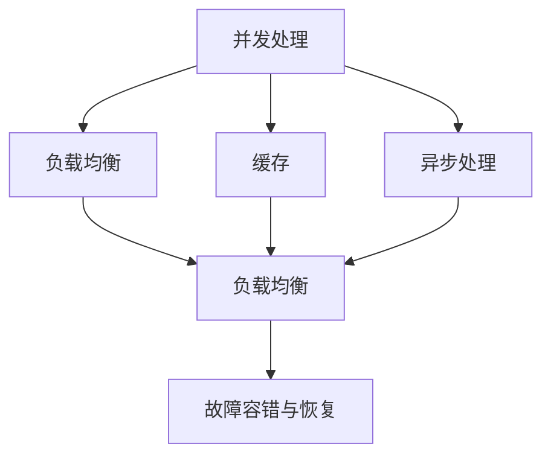
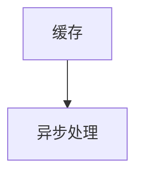
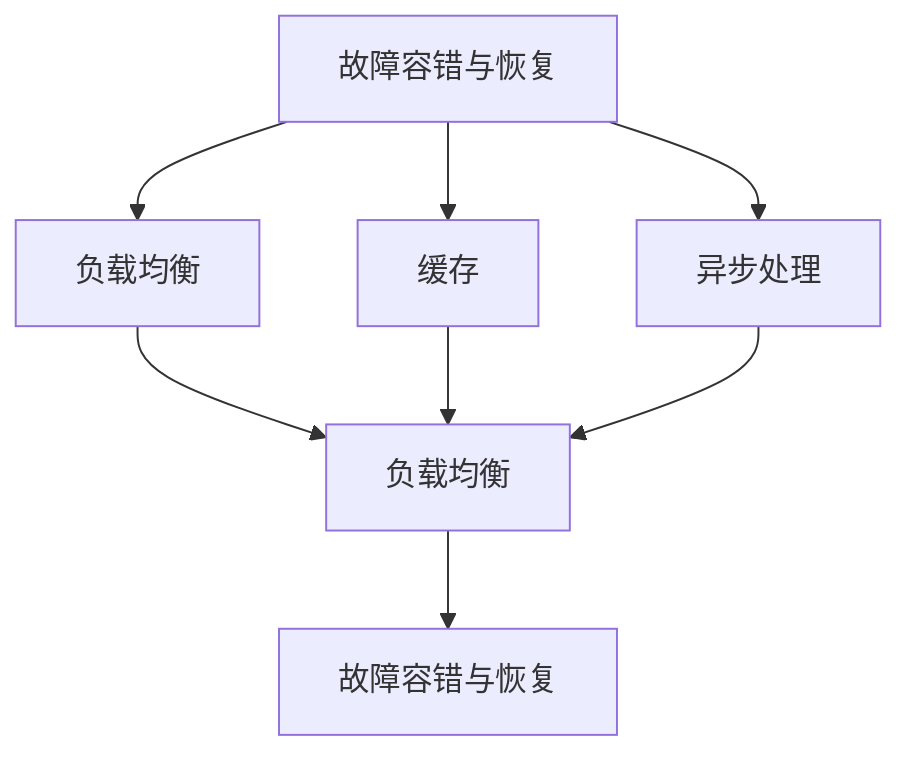

                 

# 高吞吐量系统设计的关键要素

## 1. 背景介绍

在信息技术领域，系统的高吞吐量（High Throughput）设计始终是一个热门话题。高吞吐量系统指的是能够高效处理大量并发请求的系统，它们通常用于搜索引擎、云计算平台、在线交易系统等对实时性和响应速度要求极高的场景。系统设计者需要深入理解高吞吐量系统架构和实现机制，才能保证系统的稳定性和可扩展性。本文将系统地介绍高吞吐量系统设计的关键要素，以及这些要素在实际应用中的具体实现。

### 1.1 问题由来

随着互联网的普及和数字经济的快速发展，各类网络服务对系统的吞吐量提出了越来越高的要求。在搜索引擎、电商平台、金融交易等场景中，每秒处理数千乃至数百万请求已经成为了常态。在这样的背景下，如何设计出能够高效、稳定地处理大量并发请求的系统，成为了IT行业的重要挑战。

现代高吞吐量系统的设计依赖于多个关键技术要素，包括并发处理、负载均衡、缓存、异步处理等。理解这些要素的工作原理和实现方式，对于构建可靠、高效的在线系统至关重要。本文将详细介绍这些要素，并探讨其在实际系统中的应用。

### 1.2 问题核心关键点

高吞吐量系统设计的主要目标是在保证系统高可用性和稳定性的前提下，尽可能提升系统的并发处理能力。为了实现这一目标，设计者需要考虑以下几个关键点：

1. **并发处理机制**：如何高效处理大量并发请求，避免因请求拥塞导致的系统崩溃。
2. **负载均衡策略**：如何合理分配请求到多个服务器或集群，实现负载均衡。
3. **缓存策略**：如何通过缓存减少对底层数据库的访问，提升系统响应速度。
4. **异步处理技术**：如何利用异步机制提高处理效率，提升系统吞吐量。
5. **故障容错与恢复**：在系统出现故障时，如何保证数据的完整性和系统的快速恢复。

理解并掌握这些关键点，对于构建高吞吐量系统至关重要。本文将深入探讨这些要素，并结合实际应用场景，给出详细的实施方案。

## 2. 核心概念与联系

### 2.1 核心概念概述

要深入理解高吞吐量系统设计，首先需要掌握一些核心概念：

- **并发处理（Concurrency）**：指在多线程或多进程环境下，同时执行多个任务的能力。并发处理是现代系统设计的基础，能够显著提升系统的响应速度和处理效率。
- **负载均衡（Load Balancing）**：指将请求均匀分配到多个服务器或集群，避免单点故障和过载。负载均衡是保证高吞吐量系统可扩展性的关键。
- **缓存（Caching）**：指将频繁访问的数据存储在高速缓存中，减少对底层数据库的直接访问，提升系统响应速度和吞吐量。
- **异步处理（Asynchronous Processing）**：指通过异步机制，提高系统并发处理能力，避免阻塞等待，提升响应速度。
- **故障容错与恢复（Fault Tolerance and Recovery）**：指在系统出现故障时，能够快速检测、诊断和恢复，保证数据的完整性和系统的可用性。

这些概念之间相互关联，共同构成了高吞吐量系统设计的核心框架。下面通过一个Mermaid流程图来展示这些概念的联系：

这个流程图展示了并发处理、负载均衡、缓存、异步处理和故障容错与恢复这些概念之间的相互依赖关系。

### 2.2 概念间的关系

这些核心概念之间存在着紧密的联系，构成了高吞吐量系统设计的基础。下面我们通过几个Mermaid流程图来展示这些概念之间的关系。

#### 2.2.1 并发处理与负载均衡

这个流程图展示了并发处理和负载均衡之间的关系。并发处理通过多线程或多进程实现任务的并行处理，而负载均衡则通过将请求均匀分配到多个服务器或集群，避免单点故障和过载。

#### 2.2.2 缓存与异步处理

这个流程图展示了缓存与异步处理之间的关系。缓存通过将频繁访问的数据存储在高速缓存中，减少对底层数据库的直接访问，提升系统响应速度。异步处理则通过异步机制，提高系统并发处理能力，避免阻塞等待，提升响应速度。

#### 2.2.3 故障容错与恢复

这个流程图展示了故障容错与恢复与负载均衡、缓存、异步处理之间的关系。故障容错与恢复通过在系统出现故障时快速检测、诊断和恢复，保证数据的完整性和系统的可用性。负载均衡、缓存和异步处理通过提升系统的并发处理能力和响应速度，减少故障发生的可能性。

## 3. 核心算法原理 & 具体操作步骤

### 3.1 算法原理概述

高吞吐量系统的设计依赖于多个关键算法和原理，包括并发处理算法、负载均衡算法、缓存策略、异步处理技术以及故障容错与恢复机制。下面将详细介绍这些算法和原理。

#### 3.1.1 并发处理算法

并发处理算法是实现系统高吞吐量的基础。常见的并发处理算法包括线程池、协程、异步I/O等。

- **线程池**：线程池通过维护一组可重用的线程，避免频繁创建和销毁线程的开销，提升系统的并发处理能力。线程池管理线程的生命周期，避免线程过载和资源浪费。
- **协程**：协程是一种轻量级的线程机制，通过在单个线程内切换多个协程的执行，实现高效的并发处理。协程避免了线程切换的开销，提升了系统的响应速度。
- **异步I/O**：异步I/O通过将I/O操作与业务逻辑分离，实现高效的并发处理。异步I/O避免了阻塞等待，提升了系统的吞吐量。

#### 3.1.2 负载均衡算法

负载均衡算法通过合理分配请求到多个服务器或集群，实现负载均衡。常见的负载均衡算法包括轮询、最少连接数、一致性哈希等。

- **轮询**：轮询是最简单的负载均衡算法，通过循环将请求依次分配到多个服务器。轮询简单易实现，但可能出现服务器负载不均衡的情况。
- **最少连接数**：最少连接数算法根据服务器当前连接的请求数量，将请求分配给连接数最少的服务器，避免某些服务器过载。
- **一致性哈希**：一致性哈希算法通过将请求映射到一个环上，每个服务器对应环上的一个区间，从而实现高效的负载均衡。

#### 3.1.3 缓存策略

缓存策略通过将频繁访问的数据存储在高速缓存中，减少对底层数据库的直接访问，提升系统响应速度和吞吐量。常见的缓存策略包括内存缓存、分布式缓存、本地缓存等。

- **内存缓存**：内存缓存通过将数据存储在高速内存中，提升系统的响应速度。内存缓存适用于读取频率高但写入频率低的数据。
- **分布式缓存**：分布式缓存通过在多个服务器之间共享缓存数据，实现负载均衡和可扩展性。分布式缓存适用于需要高可用性和高可扩展性的场景。
- **本地缓存**：本地缓存通过将数据存储在单个服务器的内存中，提升系统的响应速度。本地缓存适用于单个服务器内的数据缓存。

#### 3.1.4 异步处理技术

异步处理技术通过异步机制，提高系统并发处理能力，避免阻塞等待，提升响应速度。常见的异步处理技术包括事件驱动、消息队列、异步编程框架等。

- **事件驱动**：事件驱动通过监听事件并响应事件，实现高效的并发处理。事件驱动适用于需要高并发和高吞吐量的场景。
- **消息队列**：消息队列通过将请求封装成消息，异步处理请求，实现高效的并发处理。消息队列适用于需要高可靠性和高吞吐量的场景。
- **异步编程框架**：异步编程框架通过提供异步编程模型和工具，简化异步编程的复杂度，提升异步编程的效率。异步编程框架适用于需要高并发和高吞吐量的场景。

#### 3.1.5 故障容错与恢复机制

故障容错与恢复机制通过在系统出现故障时快速检测、诊断和恢复，保证数据的完整性和系统的可用性。常见的故障容错与恢复机制包括重试机制、故障转移、数据备份等。

- **重试机制**：重试机制通过多次尝试处理请求，避免因单个请求失败导致系统不可用。重试机制适用于网络不稳定或请求时延较长的场景。
- **故障转移**：故障转移通过将请求转移到备用服务器或集群，避免单点故障导致的系统不可用。故障转移适用于需要高可用性的场景。
- **数据备份**：数据备份通过在多个节点之间复制数据，实现数据的冗余和故障恢复。数据备份适用于需要高可靠性和高可扩展性的场景。

### 3.2 算法步骤详解

接下来，我们将详细讲解这些关键算法和原理的具体实现步骤。

#### 3.2.1 并发处理算法实现步骤

线程池、协程、异步I/O等并发处理算法的实现步骤：

1. **线程池实现**：
    - 创建线程池：定义线程池的容量和初始化线程池。
    - 任务提交：将任务提交到线程池，线程池维护任务队列。
    - 任务执行：从任务队列中取出任务，分配给空闲线程执行。
    - 线程管理：管理线程的生命周期，避免线程过载和资源浪费。

2. **协程实现**：
    - 创建协程：定义协程的上下文和状态。
    - 协程切换：在单个线程内切换多个协程的执行，实现高效的并发处理。
    - 协程管理：管理协程的生命周期，避免协程阻塞和资源浪费。

3. **异步I/O实现**：
    - 异步编程模型：定义异步编程模型和事件循环。
    - I/O操作：将I/O操作封装成异步任务，异步处理I/O请求。
    - 事件处理：监听事件并响应事件，实现高效的并发处理。

#### 3.2.2 负载均衡算法实现步骤

轮询、最少连接数、一致性哈希等负载均衡算法的实现步骤：

1. **轮询实现**：
    - 创建负载均衡器：定义负载均衡器的规则和服务器列表。
    - 请求分配：根据轮询规则将请求分配到服务器。
    - 服务器管理：管理服务器的连接状态和负载情况。

2. **最少连接数实现**：
    - 创建负载均衡器：定义负载均衡器的规则和服务器列表。
    - 请求分配：根据最少连接数规则将请求分配到服务器。
    - 服务器管理：管理服务器的连接状态和负载情况。

3. **一致性哈希实现**：
    - 创建负载均衡器：定义负载均衡器的规则和服务器列表。
    - 请求分配：将请求映射到一致性哈希环上，分配到对应的服务器。
    - 服务器管理：管理服务器的连接状态和负载情况。

#### 3.2.3 缓存策略实现步骤

内存缓存、分布式缓存、本地缓存等缓存策略的实现步骤：

1. **内存缓存实现**：
    - 创建缓存管理器：定义缓存数据的存储和读取方式。
    - 数据存储：将数据存储在高速内存中。
    - 数据读取：从内存中读取缓存数据。

2. **分布式缓存实现**：
    - 创建缓存管理器：定义缓存数据的存储和读取方式。
    - 数据存储：将数据存储在分布式缓存集群中。
    - 数据读取：从分布式缓存集群中读取缓存数据。

3. **本地缓存实现**：
    - 创建缓存管理器：定义缓存数据的存储和读取方式。
    - 数据存储：将数据存储在单个服务器的内存中。
    - 数据读取：从单个服务器的内存中读取缓存数据。

#### 3.2.4 异步处理技术实现步骤

事件驱动、消息队列、异步编程框架等异步处理技术的实现步骤：

1. **事件驱动实现**：
    - 创建事件驱动框架：定义事件和事件处理程序。
    - 事件监听：监听事件并响应事件，实现高效的并发处理。
    - 事件管理：管理事件的生命周期，避免事件阻塞和资源浪费。

2. **消息队列实现**：
    - 创建消息队列：定义消息队列的消息结构和消息处理程序。
    - 消息发送：将请求封装成消息，异步处理消息。
    - 消息接收：接收消息并处理消息，实现高效的并发处理。

3. **异步编程框架实现**：
    - 创建异步编程框架：定义异步编程模型和异步任务调度器。
    - 异步任务调度：将异步任务封装成任务列表，异步处理异步任务。
    - 异步任务管理：管理异步任务的生命周期，避免任务阻塞和资源浪费。

#### 3.2.5 故障容错与恢复机制实现步骤

重试机制、故障转移、数据备份等故障容错与恢复机制的实现步骤：

1. **重试机制实现**：
    - 创建重试管理器：定义重试规则和重试次数。
    - 请求重试：多次尝试处理请求，避免因单个请求失败导致系统不可用。
    - 重试管理：管理重试请求的状态和重试次数。

2. **故障转移实现**：
    - 创建故障转移管理器：定义故障转移规则和服务器列表。
    - 请求转移：将请求转移到备用服务器或集群，避免单点故障导致的系统不可用。
    - 故障管理：管理故障服务器的状态和故障转移。

3. **数据备份实现**：
    - 创建数据备份管理器：定义数据备份规则和备份节点列表。
    - 数据备份：在多个节点之间复制数据，实现数据的冗余和故障恢复。
    - 数据恢复：在系统故障时，从备份节点恢复数据，保证数据的完整性和系统的可用性。

### 3.3 算法优缺点

高吞吐量系统设计依赖于多个关键算法和原理，这些算法和原理各有优缺点。下面将详细介绍这些算法和原理的优缺点。

#### 3.3.1 并发处理算法的优缺点

并发处理算法能够提升系统的并发处理能力和响应速度，但同时也存在以下缺点：

- **资源消耗**：并发处理算法需要维护线程或协程等资源，增加了系统资源消耗。
- **复杂度增加**：并发处理算法的实现和维护复杂度较高，需要考虑线程同步、锁等问题。
- **系统可扩展性**：并发处理算法需要合理设计线程池或协程池，避免线程或协程数量过多或过少导致的资源浪费或系统过载。

#### 3.3.2 负载均衡算法的优缺点

负载均衡算法能够实现系统的高可用性和可扩展性，但同时也存在以下缺点：

- **算法复杂度**：负载均衡算法的实现复杂度较高，需要考虑算法规则和服务器状态。
- **负载均衡效率**：负载均衡算法需要合理设计负载均衡规则，避免负载不均衡和资源浪费。
- **系统可扩展性**：负载均衡算法需要合理设计负载均衡规则和服务器列表，避免单点故障导致的系统不可用。

#### 3.3.3 缓存策略的优缺点

缓存策略能够提升系统的响应速度和吞吐量，但同时也存在以下缺点：

- **数据一致性**：缓存策略需要考虑数据一致性问题，避免缓存和数据库数据不一致。
- **缓存失效**：缓存策略需要合理设计缓存失效规则，避免缓存失效导致的系统不可用。
- **缓存空间占用**：缓存策略需要合理设计缓存容量，避免缓存空间不足导致的系统性能下降。

#### 3.3.4 异步处理技术的优缺点

异步处理技术能够提升系统的并发处理能力和响应速度，但同时也存在以下缺点：

- **实现复杂度**：异步处理技术需要合理设计异步编程模型和异步任务调度，实现复杂度较高。
- **资源消耗**：异步处理技术需要维护异步任务和事件等资源，增加了系统资源消耗。
- **系统可扩展性**：异步处理技术需要合理设计异步编程模型和异步任务调度，避免异步任务过多或过少导致的系统性能下降。

#### 3.3.5 故障容错与恢复机制的优缺点

故障容错与恢复机制能够保证系统的稳定性和可用性，但同时也存在以下缺点：

- **实现复杂度**：故障容错与恢复机制需要合理设计重试机制、故障转移和数据备份等策略，实现复杂度较高。
- **资源消耗**：故障容错与恢复机制需要维护重试请求、故障服务器状态和备份数据等资源，增加了系统资源消耗。
- **系统可扩展性**：故障容错与恢复机制需要合理设计重试机制、故障转移和数据备份等策略，避免资源浪费和系统性能下降。

### 3.4 算法应用领域

高吞吐量系统设计在多个领域得到了广泛应用，下面将详细介绍这些领域：

#### 3.4.1 搜索引擎

搜索引擎需要高效处理大量的查询请求，对系统的并发处理能力和响应速度提出了高要求。搜索引擎通过使用并发处理算法、负载均衡算法、缓存策略和异步处理技术，实现了高效的处理能力。

- **并发处理算法**：搜索引擎使用线程池和协程等并发处理算法，实现了高效的并发处理。
- **负载均衡算法**：搜索引擎使用一致性哈希等负载均衡算法，实现了均匀负载均衡。
- **缓存策略**：搜索引擎使用内存缓存和分布式缓存等缓存策略，提升了系统响应速度。
- **异步处理技术**：搜索引擎使用事件驱动和消息队列等异步处理技术，提升了系统并发处理能力。

#### 3.4.2 云计算平台

云计算平台需要高效处理大量的计算和存储请求，对系统的并发处理能力和响应速度提出了高要求。云计算平台通过使用并发处理算法、负载均衡算法、缓存策略和异步处理技术，实现了高效的处理能力。

- **并发处理算法**：云计算平台使用线程池和协程等并发处理算法，实现了高效的并发处理。
- **负载均衡算法**：云计算平台使用最少连接数和一致性哈希等负载均衡算法，实现了均匀负载均衡。
- **缓存策略**：云计算平台使用内存缓存和分布式缓存等缓存策略，提升了系统响应速度。
- **异步处理技术**：云计算平台使用事件驱动和消息队列等异步处理技术，提升了系统并发处理能力。

#### 3.4.3 在线交易系统

在线交易系统需要高效处理大量的交易请求，对系统的并发处理能力和响应速度提出了高要求。在线交易系统通过使用并发处理算法、负载均衡算法、缓存策略和异步处理技术，实现了高效的处理能力。

- **并发处理算法**：在线交易系统使用线程池和协程等并发处理算法，实现了高效的并发处理。
- **负载均衡算法**：在线交易系统使用轮询和最少连接数等负载均衡算法，实现了均匀负载均衡。
- **缓存策略**：在线交易系统使用内存缓存和分布式缓存等缓存策略，提升了系统响应速度。
- **异步处理技术**：在线交易系统使用事件驱动和消息队列等异步处理技术，提升了系统并发处理能力。

## 4. 数学模型和公式 & 详细讲解 & 举例说明

### 4.1 数学模型构建

高吞吐量系统设计涉及多个数学模型，下面将详细介绍这些模型的构建。

#### 4.1.1 并发处理模型的构建

并发处理模型的构建基于线程池和协程等并发处理算法，主要包括以下步骤：

1. **线程池模型**：
    - 定义线程池容量：定义线程池的容量和初始化线程池。
    - 定义任务队列：定义任务队列和任务提交规则。
    - 定义任务执行规则：定义任务执行顺序和线程管理策略。

2. **协程模型**：
    - 定义协程上下文：定义协程的上下文和状态。
    - 定义协程切换规则：定义协程切换顺序和协程管理策略。

3. **异步I/O模型**：
    - 定义异步编程模型：定义异步编程模型和事件循环。
    - 定义I/O操作规则：定义I/O操作封装和异步处理规则。
    - 定义事件处理规则：定义事件监听和事件响应规则。

#### 4.1.2 负载均衡模型的构建

负载均衡模型的构建基于轮询、最少连接数和一致性哈希等负载均衡算法，主要包括以下步骤：

1. **轮询模型**：
    - 定义服务器列表：定义服务器列表和轮询规则。
    - 定义请求分配规则：定义请求轮询顺序和服务器负载情况。

2. **最少连接数模型**：
    - 定义服务器列表：定义服务器列表和最少连接数规则。
    - 定义请求分配规则：定义请求分配到连接数最少的服务器。

3. **一致性哈希模型**：
    - 定义服务器列表：定义服务器列表和一致性哈希规则。
    - 定义请求分配规则：将请求映射到一致性哈希环上，分配到对应的服务器。

#### 4.1.3 缓存模型的构建

缓存模型的构建基于内存缓存、分布式缓存和本地缓存等缓存策略，主要包括以下步骤：

1. **内存缓存模型**：
    - 定义缓存数据结构：定义缓存数据的存储和读取方式。
    - 定义缓存失效规则：定义缓存失效策略和缓存数据维护方式。

2. **分布式缓存模型**：
    - 定义缓存数据结构：定义缓存数据的存储和读取方式。
    - 定义缓存失效规则：定义缓存失效策略和分布式缓存集群管理方式。

3. **本地缓存模型**：
    - 定义缓存数据结构：定义缓存数据的存储和读取方式。
    - 定义缓存失效规则：定义缓存失效策略和本地缓存管理方式。

#### 4.1.4 异步处理模型的构建

异步处理模型的构建基于事件驱动、消息队列和异步编程框架等异步处理技术，主要包括以下步骤：

1. **事件驱动模型**：
    - 定义事件类型：定义事件类型和事件处理程序。
    - 定义事件监听规则：定义事件监听和事件响应规则。

2. **消息队列模型**：
    - 定义消息类型：定义消息类型和消息处理程序。
    - 定义消息发送规则：定义消息封装和异步处理规则。
    - 定义消息接收规则：定义消息接收和处理规则。

3. **异步编程框架模型**：
    - 定义异步编程模型：定义异步编程模型和异步任务调度器。
    - 定义异步任务规则：定义异步任务封装和异步任务调度规则。

#### 4.1.5 故障容错与恢复模型的构建

故障容错与恢复模型的构建基于重试机制、故障转移和数据备份等故障容错与恢复机制，主要包括以下步骤：

1. **重试机制模型**：
    - 定义重试规则：定义重试次数和重试条件。
    - 定义重试状态管理：定义重试请求状态和重试次数管理。

2. **故障转移模型**：
    - 定义故障转移规则：定义故障转移条件和故障转移规则。
    - 定义故障状态管理：定义故障服务器状态和故障转移管理。

3. **数据备份模型**：
    - 定义备份规则：定义数据备份策略和备份节点管理。
    - 定义备份状态管理：定义备份数据状态和数据恢复管理。

### 4.2 公式推导过程

高吞吐量系统设计涉及多个数学公式，下面将详细介绍这些公式的推导过程。

#### 4.2.1 并发处理公式推导

并发处理公式推导基于线程池和协程等并发处理算法，主要包括以下公式：

1. **线程池公式**：
    - 线程池容量：定义线程池的容量和初始化线程池。
    - 任务队列公式：定义任务队列和任务提交规则。
    - 任务执行公式：定义任务执行顺序和线程管理策略。

2. **协程公式**：
    - 协程上下文公式：定义协程的上下文和状态。
    - 协程切换公式：定义协程切换顺序和协程管理策略。

3. **异步I/O公式**：
    - 异步编程模型公式：定义异步编程模型和事件循环。
    - I/O操作公式：定义I/O操作封装和异步处理规则。
    - 事件处理公式：定义事件监听和事件响应规则。

#### 4.2.2 负载均衡公式推导

负载均衡公式推导基于轮询、最少连接数和一致性哈希等负载均衡算法，主要包括以下公式：

1. **轮询公式**：
    - 服务器列表公式：定义服务器列表和轮询规则。
    - 请求分配公式：定义请求

