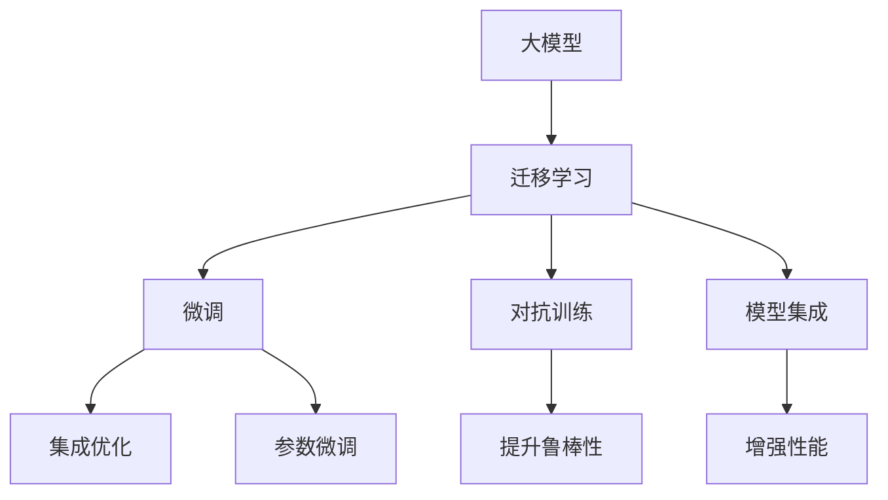

                 

# AI 大模型创业：如何利用竞争优势？

> 关键词：AI大模型,创业策略,竞争优势,自然语言处理(NLP),深度学习,创业成功案例

## 1. 背景介绍

### 1.1 问题由来

随着人工智能技术的快速发展和应用，大模型（Large Models）在各个领域展示了卓越的表现，推动了技术创新和产业变革。然而，大模型开发和部署的技术门槛高、成本昂贵，对创业企业而言，如何利用这些先进技术形成竞争优势，成为亟待解决的问题。本博客将从大模型的应用和创业策略两方面出发，探讨如何通过AI大模型在市场中占据优势，实现可持续发展。

### 1.2 问题核心关键点

大模型通常指基于深度学习的大规模神经网络模型，例如BERT、GPT系列、T5等，这些模型在自然语言处理（NLP）、计算机视觉、语音识别等领域展现了强大的能力。创业企业利用大模型，可以大幅提升其产品或服务的智能化水平，但同时也面临着高成本、高风险等挑战。因此，本文将从以下几个方面探讨如何利用大模型形成竞争优势：

- **选择合适的模型和框架**：根据企业需求选择合适的预训练模型和开发框架。
- **数据准备与预处理**：利用数据增强和预处理技术提升模型效果。
- **模型微调和优化**：通过参数微调、正则化、对抗训练等技术优化模型性能。
- **业务集成与部署**：将模型集成到实际应用中，提升用户体验。
- **持续学习和更新**：建立机制，使模型能持续学习新数据和新知识。

### 1.3 问题研究意义

利用大模型进行创业，可以显著提升产品竞争力，缩短产品开发周期，降低人工成本。同时，大模型在自然语言处理、图像识别等领域的应用前景广阔，能够帮助企业开拓新的市场空间。然而，大模型的开发和维护成本高，创业企业需要寻找合适的技术和策略，确保投资回报。

## 2. 核心概念与联系

### 2.1 核心概念概述

为了深入理解大模型创业的竞争优势，我们首先梳理几个核心概念：

- **大模型（Large Models）**：指基于深度学习的大规模神经网络模型，如BERT、GPT等，通过在大规模无标签数据上自监督学习，获得强大的表示能力。
- **迁移学习（Transfer Learning）**：指将大模型在预训练任务上学习到的知识迁移到新任务上，减少标注样本需求，提升模型性能。
- **微调（Fine-tuning）**：在预训练大模型的基础上，通过少量标注数据进行有监督学习，优化模型在新任务上的表现。
- **模型集成（Model Ensemble）**：通过组合多个模型输出，提升模型整体性能和鲁棒性。
- **对抗训练（Adversarial Training）**：通过引入对抗样本，提高模型鲁棒性，避免过拟合。

这些概念构成了大模型创业的核心技术和方法，相互之间存在紧密联系。例如，迁移学习和大模型微调是相辅相成的，微调基于迁移学习，而对抗训练和模型集成则是对微调的补充。

### 2.2 概念间的关系

通过Mermaid流程图，我们可以清晰展示这些概念之间的逻辑关系：



此图展示了从大模型到微调、对抗训练、模型集成的整个过程，及其相互之间的逻辑关系。

## 3. 核心算法原理 & 具体操作步骤

### 3.1 算法原理概述

大模型创业的核心是利用大模型的预训练知识，通过微调和优化，提升其在特定任务上的表现。这通常包括以下步骤：

1. **选择合适的预训练模型**：根据应用需求选择最适合的预训练模型。
2. **数据准备与预处理**：收集并预处理标注数据，准备微调训练。
3. **模型微调和优化**：在少量标注数据上微调模型，提升模型性能。
4. **模型集成与部署**：将微调后的模型集成到实际应用中，并进行持续优化。

### 3.2 算法步骤详解

#### 3.2.1 选择合适的预训练模型

选择合适的预训练模型是创业成功的第一步。一般而言，可以考虑以下几种策略：

- **基于任务的预训练模型**：如BERT在文本分类任务上的微调效果较好，GPT在生成任务上表现优异。
- **开源模型**：利用开源社区提供的预训练模型，如Hugging Face的Transformers库，可以快速部署。
- **定制化模型**：根据具体需求，使用自监督预训练技术构建定制化模型。

#### 3.2.2 数据准备与预处理

数据准备与预处理是确保模型效果的关键步骤：

- **数据收集**：收集与任务相关的标注数据，确保数据质量。
- **数据增强**：通过回译、数据扰动等方式扩充训练集，提升模型鲁棒性。
- **数据预处理**：对数据进行标准化、归一化处理，减少噪声干扰。

#### 3.2.3 模型微调和优化

模型微调和优化通常包括以下步骤：

- **选择微调框架**：如TensorFlow、PyTorch等，提供强大的深度学习库支持。
- **设定微调参数**：如学习率、批量大小、迭代次数等。
- **微调模型**：在标注数据上微调模型，提升模型在新任务上的表现。
- **对抗训练**：引入对抗样本，提高模型鲁棒性。
- **模型集成**：通过组合多个模型的输出，提升整体性能。

### 3.3 算法优缺点

大模型创业的优势在于其强大的表示能力和泛化能力，能够快速提升产品竞争力。然而，也存在以下缺点：

- **高成本**：大模型开发和部署成本高昂，包括计算资源、存储成本等。
- **高风险**：模型过拟合、泛化能力不足等问题，可能影响产品效果。
- **技术门槛高**：需要专业技术人员进行模型设计和优化，创业门槛较高。

### 3.4 算法应用领域

大模型创业技术广泛应用于多个领域，如自然语言处理、计算机视觉、语音识别等。以下列举几个典型应用场景：

- **NLP应用**：如智能客服、机器翻译、情感分析等，利用大模型进行文本分类、生成等任务。
- **计算机视觉**：如图像识别、物体检测、人脸识别等，利用大模型进行图像处理和分析。
- **语音识别**：如语音转文字、语音合成等，利用大模型进行语音信号处理和生成。

## 4. 数学模型和公式 & 详细讲解 & 举例说明

### 4.1 数学模型构建

假设我们选择BERT作为预训练模型，其在某个分类任务上的微调模型可以表示为：

$$ M_{\theta} = M_{pre} \odot M_{fine} $$

其中，$M_{pre}$为预训练模型，$M_{fine}$为微调模型，$\odot$为模型组合操作。

### 4.2 公式推导过程

BERT的微调过程如下：

1. **输入编码**：将输入文本$x$转换为BERT模型的输入表示。
2. **模型前向传播**：通过预训练模型$M_{pre}$计算出表示向量$h$。
3. **分类器计算**：使用微调模型$M_{fine}$计算分类输出$p$。
4. **损失函数计算**：使用交叉熵损失函数$\ell$计算模型预测与真实标签之间的差异。
5. **梯度下降更新**：通过梯度下降算法更新模型参数$\theta$，最小化损失函数$\ell$。

具体公式如下：

$$ h = M_{pre}(x) $$
$$ p = M_{fine}(h) $$
$$ \ell = -\frac{1}{N}\sum_{i=1}^N \ell(y_i, p_i) $$
$$ \theta \leftarrow \theta - \eta \nabla_{\theta}\ell $$

其中，$\eta$为学习率，$y_i$为真实标签，$p_i$为模型预测输出。

### 4.3 案例分析与讲解

以BERT在情感分析任务上的微调为例：

1. **数据准备**：收集情感标注数据，将其划分为训练集、验证集和测试集。
2. **模型选择**：选择BERT作为预训练模型。
3. **模型微调**：使用微调模型对BERT进行微调，提升其在情感分析任务上的表现。
4. **效果评估**：在测试集上评估模型效果，对比微调前后性能提升。

## 5. 项目实践：代码实例和详细解释说明

### 5.1 开发环境搭建

- **安装Python环境**：选择Anaconda或Miniconda，配置虚拟环境。
- **安装深度学习框架**：如TensorFlow、PyTorch等，支持大模型的开发和训练。
- **数据准备**：收集标注数据，准备预处理。

### 5.2 源代码详细实现

以下是一个基于BERT的情感分析微调的Python代码示例：

```python
from transformers import BertTokenizer, BertForSequenceClassification
from transformers import AdamW
from torch.utils.data import Dataset, DataLoader

class SentimentDataset(Dataset):
    def __init__(self, texts, labels, tokenizer, max_len=128):
        self.texts = texts
        self.labels = labels
        self.tokenizer = tokenizer
        self.max_len = max_len
        
    def __len__(self):
        return len(self.texts)
    
    def __getitem__(self, item):
        text = self.texts[item]
        label = self.labels[item]
        
        encoding = self.tokenizer(text, return_tensors='pt', max_length=self.max_len, padding='max_length', truncation=True)
        input_ids = encoding['input_ids'][0]
        attention_mask = encoding['attention_mask'][0]
        
        # 对标签进行编码
        encoded_labels = label2id[label] 
        encoded_labels.extend([label2id['O']] * (self.max_len - len(encoded_labels)))
        labels = torch.tensor(encoded_labels, dtype=torch.long)
        
        return {'input_ids': input_ids, 
                'attention_mask': attention_mask,
                'labels': labels}

# 初始化模型和优化器
model = BertForSequenceClassification.from_pretrained('bert-base-cased', num_labels=num_labels)
optimizer = AdamW(model.parameters(), lr=2e-5)

# 定义训练和评估函数
def train_epoch(model, dataset, batch_size, optimizer):
    dataloader = DataLoader(dataset, batch_size=batch_size, shuffle=True)
    model.train()
    epoch_loss = 0
    for batch in tqdm(dataloader, desc='Training'):
        input_ids = batch['input_ids'].to(device)
        attention_mask = batch['attention_mask'].to(device)
        labels = batch['labels'].to(device)
        model.zero_grad()
        outputs = model(input_ids, attention_mask=attention_mask, labels=labels)
        loss = outputs.loss
        epoch_loss += loss.item()
        loss.backward()
        optimizer.step()
    return epoch_loss / len(dataloader)

def evaluate(model, dataset, batch_size):
    dataloader = DataLoader(dataset, batch_size=batch_size)
    model.eval()
    preds, labels = [], []
    with torch.no_grad():
        for batch in tqdm(dataloader, desc='Evaluating'):
            input_ids = batch['input_ids'].to(device)
            attention_mask = batch['attention_mask'].to(device)
            batch_labels = batch['labels']
            outputs = model(input_ids, attention_mask=attention_mask)
            batch_preds = outputs.logits.argmax(dim=2).to('cpu').tolist()
            batch_labels = batch_labels.to('cpu').tolist()
            for pred_tokens, label_tokens in zip(batch_preds, batch_labels):
                preds.append(pred_tokens[:len(label_tokens)])
                labels.append(label_tokens)
                
    print(classification_report(labels, preds))

# 训练和评估
epochs = 5
batch_size = 16

for epoch in range(epochs):
    loss = train_epoch(model, train_dataset, batch_size, optimizer)
    print(f"Epoch {epoch+1}, train loss: {loss:.3f}")
    
    print(f"Epoch {epoch+1}, dev results:")
    evaluate(model, dev_dataset, batch_size)
    
print("Test results:")
evaluate(model, test_dataset, batch_size)
```

### 5.3 代码解读与分析

此代码示例中，我们利用BERT模型进行情感分析任务的微调。首先定义了一个`SentimentDataset`类，用于处理标注数据。然后，初始化模型和优化器，并定义了训练和评估函数。在训练函数中，我们通过DataLoader对数据进行批处理，计算模型损失并反向传播更新模型参数。在评估函数中，我们利用classification_report对模型性能进行评估，并打印结果。

## 6. 实际应用场景

### 6.1 智能客服系统

智能客服系统是应用大模型创业技术的典型场景。通过微调BERT等大模型，可以实现自然语言理解、智能问答等功能，提升客户服务体验和效率。

### 6.2 金融舆情监测

金融领域需要实时监测舆情动态，识别负面新闻和风险提示。利用BERT等大模型，可以构建舆情监测系统，及时发现风险并采取应对措施。

### 6.3 个性化推荐系统

推荐系统是创业企业的重要应用方向。通过微调BERT等大模型，可以根据用户历史行为和兴趣，生成个性化推荐内容，提升用户满意度。

## 7. 工具和资源推荐

### 7.1 学习资源推荐

- **TensorFlow官方文档**：提供深度学习框架的详细文档和示例代码。
- **PyTorch官方文档**：提供深度学习框架的详细文档和示例代码。
- **Hugging Face Transformers库**：提供预训练模型和微调工具，支持多种NLP任务。
- **CS224N课程**：斯坦福大学开设的自然语言处理课程，涵盖深度学习基本概念和应用。

### 7.2 开发工具推荐

- **Anaconda**：Python环境管理工具，支持虚拟环境配置。
- **Jupyter Notebook**：交互式Python代码开发环境，支持实时查看代码运行结果。
- **Google Colab**：免费提供GPU/TPU算力的云平台，方便进行大规模深度学习实验。
- **Weights & Biases**：模型训练的实验跟踪工具，提供可视化功能。

### 7.3 相关论文推荐

- **Attention is All You Need**：Transformer模型原论文，开创了NLP领域的预训练大模型时代。
- **BERT: Pre-training of Deep Bidirectional Transformers for Language Understanding**：提出BERT模型，引入掩码语言模型预训练任务。
- **Parameter-Efficient Transfer Learning for NLP**：提出 Adapter等参数高效微调方法，提升微调效果。

## 8. 总结：未来发展趋势与挑战

### 8.1 研究成果总结

大模型创业技术在NLP、计算机视觉、语音识别等领域展示了强大的应用潜力，能够显著提升企业产品性能和市场竞争力。然而，该技术也面临高成本、高风险等挑战。未来研究应关注以下几个方向：

- **模型压缩与优化**：提高模型效率，降低计算资源和存储成本。
- **自监督学习**：利用无标签数据进行预训练，降低对标注数据的依赖。
- **多模态学习**：结合文本、图像、语音等多模态信息，提升模型表现。

### 8.2 未来发展趋势

未来，大模型创业技术将呈现以下趋势：

- **模型规模不断增大**：预训练模型参数量将持续增加，提升模型表示能力。
- **迁移学习与微调技术不断进步**：引入更多微调方法和技术，提升模型效果。
- **多模态融合**：结合多种模态信息，提升模型在复杂场景下的表现。
- **智能化和普适化应用**：将大模型应用于更多垂直领域，提升智能系统的普及性。

### 8.3 面临的挑战

尽管大模型创业技术前景广阔，但也面临诸多挑战：

- **数据获取与标注成本高**：大模型需要大量标注数据，获取成本高昂。
- **模型泛化能力不足**：模型在特定任务上的表现可能不如预期的泛化。
- **计算资源消耗大**：大模型需要大量计算资源进行训练和推理。

### 8.4 研究展望

未来研究应关注以下几个方面：

- **自监督学习与少样本学习**：利用无标签数据进行预训练，减少对标注数据的需求。
- **持续学习与知识融合**：建立模型持续学习机制，结合专家知识提升模型性能。
- **鲁棒性与可解释性**：提高模型的鲁棒性和可解释性，增强用户信任。

## 9. 附录：常见问题与解答

**Q1: 大模型创业的技术难点是什么？**

A: 大模型创业的主要技术难点包括数据获取与标注成本高、模型泛化能力不足、计算资源消耗大。克服这些难点需要采用自监督学习、知识融合等技术。

**Q2: 如何选择合适的预训练模型？**

A: 应根据具体应用需求选择最适合的预训练模型。例如，对于文本分类任务，可以选择BERT或GPT等大模型。

**Q3: 数据增强在微调过程中有何作用？**

A: 数据增强可以通过回译、数据扰动等方式扩充训练集，提升模型鲁棒性，减少过拟合风险。

**Q4: 对抗训练如何提高模型鲁棒性？**

A: 对抗训练通过引入对抗样本，训练模型对噪声和扰动具有更强的抵抗能力，提高模型鲁棒性。

**Q5: 大模型创业如何降低成本？**

A: 可以采用自监督学习、知识融合等技术，减少对标注数据的需求，降低数据获取成本。同时，利用云平台等资源进行分布式训练，降低计算成本。

通过本文的系统梳理，相信读者对大模型创业技术和应用有了更深入的理解。利用大模型创业技术，可以在多个领域形成竞争优势，开拓新的市场空间。然而，也需注意技术难度和资源成本，合理选择技术和方法，确保创业成功。

