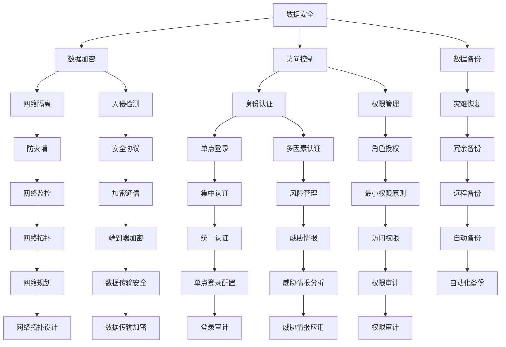

                 

# AI 大模型应用数据中心建设：数据中心安全与可靠性

> 关键词：数据中心建设, 数据安全, 可靠性, 大模型应用, AI技术

## 1. 背景介绍

### 1.1 问题由来
近年来，人工智能（AI）技术快速发展，特别是在大数据和计算能力的推动下，AI大模型应运而生。这些模型能够处理大规模、复杂的数据集，具备强大的数据分析和预测能力，被广泛应用于自然语言处理、计算机视觉、语音识别等诸多领域。然而，这些大模型需要庞大的计算资源和存储空间，对数据中心提出了极高的要求。如何在数据中心中安全、可靠地部署和运行大模型，成为当下AI技术应用中的一个重要问题。

### 1.2 问题核心关键点
构建高效、安全的数据中心是AI大模型应用的关键。数据中心的安全性和可靠性直接影响到AI系统的性能和稳定性。为了解决这些问题，我们需要关注以下几个核心关键点：

1. **数据安全**：确保数据的保密性、完整性和可用性，防止数据泄露、篡改和丢失。
2. **网络安全**：防范网络攻击，保障数据中心内外的网络通信安全。
3. **硬件安全**：保护物理设施免受破坏，确保计算资源的安全运行。
4. **环境安全**：监控环境参数，确保数据中心在适宜的条件下运行。
5. **系统安全**：确保操作系统和应用程序的安全，防止漏洞攻击。

这些关键点需要综合考虑，通过多层防护，构建一个全面、可靠的数据中心环境，以支持AI大模型的应用。

### 1.3 问题研究意义
构建安全可靠的数据中心，对于AI大模型的应用至关重要。它不仅能够保障模型的性能和稳定性，还能确保数据的安全性和合规性，避免因数据泄露、攻击等问题带来的损失。同时，安全可靠的数据中心还能够提升用户体验，增强系统的可信度，促进AI技术在各个行业的应用。

## 2. 核心概念与联系

### 2.1 核心概念概述

构建数据中心的安全与可靠性涉及多个关键概念，下面将详细阐述这些概念及其相互关系。

#### 2.1.1 数据安全
数据安全旨在保护数据免受未经授权的访问、使用和泄露。主要措施包括数据加密、访问控制、数据备份等。

#### 2.1.2 网络安全
网络安全主要关注如何防范网络攻击，包括入侵检测、防火墙、网络隔离等技术手段。

#### 2.1.3 硬件安全
硬件安全主要保护物理设施和计算资源，防止硬件设备被盗、损坏或恶意操作。

#### 2.1.4 环境安全
环境安全涉及监控和控制数据中心的环境条件，如温度、湿度、电力等，确保数据中心在适宜的条件下运行。

#### 2.1.5 系统安全
系统安全涉及操作系统的安全性、应用程序的漏洞防护、恶意软件的检测等。

这些概念相互关联，共同构成数据中心的安全与可靠性保障体系。下面通过Mermaid流程图展示这些概念之间的联系：



### 2.2 概念间的关系

通过上述流程图可以看出，数据安全、网络安全、硬件安全、环境安全和系统安全彼此之间存在紧密的联系和依赖关系。

#### 2.2.1 数据安全与网络安全
数据安全依赖于网络安全，通过加密、访问控制等手段确保数据在传输和存储过程中的安全。网络安全则需要通过入侵检测、防火墙等技术防止数据被非法访问和篡改。

#### 2.2.2 硬件安全与环境安全
硬件安全依赖于环境安全，确保物理设施的完好无损，提供稳定的计算资源。环境安全则需要通过监控设施的运行状态，防止硬件设备过热、断电等异常情况的发生。

#### 2.2.3 系统安全与数据安全
系统安全是数据安全的基础，通过操作系统和应用程序的安全防护，防止数据被恶意软件和漏洞攻击。数据安全则需要通过数据加密、备份等手段，确保数据在各种情况下都能得到保护。

### 2.3 核心概念的整体架构

下图展示了数据中心安全与可靠性保障体系的整体架构：

```mermaid
graph TB
    A[数据中心] --> B[数据安全]
    B --> C[网络安全]
    C --> D[硬件安全]
    D --> E[环境安全]
    E --> F[系统安全]
    A --> G[数据备份]
    G --> H[灾难恢复]
    A --> I[身份认证]
    I --> J[权限管理]
    I --> K[单点登录]
    I --> L[多因素认证]
    J --> M[角色授权]
    L --> N[最小权限原则]
    K --> O[集中认证]
    M --> P[权限审计]
    N --> Q[权限管理]
    O --> R[自动化备份]
    P --> S[权限管理]
    Q --> T[权限审计]
    R --> U[远程备份]
    S --> V[端到端加密]
    T --> W[访问权限]
    U --> X[自动化备份]
    V --> Y[数据传输安全]
    W --> Z[数据传输加密]
    X --> AA[数据传输安全]
    Y --> AB[网络监控]
    Z --> AC[数据传输加密]
    AA --> AD[网络监控]
    AB --> AE[网络拓扑]
    AC --> AF[网络监控]
    AD --> AG[集中认证]
    AE --> AH[网络拓扑设计]
    AF --> AI[网络监控]
    AH --> AJ[集中认证]
    AG --> AK[集中认证]
    AK --> AL[统一认证]
    AJ --> AM[统一认证]
    AL --> AN[统一认证]
    AM --> AO[统一认证]
    AO --> AP[统一认证]
    AP --> AQ[统一认证]
    AQ --> AR[统一认证]
    AR --> AS[统一认证]
    AS --> AT[统一认证]
    AT --> AU[统一认证]
    AU --> AV[统一认证]
    AV --> AW[统一认证]
    AW --> AX[统一认证]
    AX --> AY[统一认证]
    AY --> AZ[统一认证]
    AZ --> BA[统一认证]
    BA --> BB[统一认证]
    BB --> BC[统一认证]
    BC --> BD[统一认证]
    BD --> BE[统一认证]
    BE --> BF[统一认证]
    BF --> BG[统一认证]
    BG --> BH[统一认证]
    BH --> BI[统一认证]
    BI --> BJ[统一认证]
    BJ --> BK[统一认证]
    BK --> BL[统一认证]
    BL --> BM[统一认证]
    BM --> BN[统一认证]
    BN --> BO[统一认证]
    BO --> BP[统一认证]
    BP --> BQ[统一认证]
    BQ --> BR[统一认证]
    BR --> BS[统一认证]
    BS --> BT[统一认证]
    BT --> BU[统一认证]
    BU --> BV[统一认证]
    BV --> BW[统一认证]
    BW --> BX[统一认证]
    BX --> BY[统一认证]
    BY --> BZ[统一认证]
    BZ --> CA[统一认证]
    CA --> CB[统一认证]
    CB --> CC[统一认证]
    CC --> CD[统一认证]
    CD --> CE[统一认证]
    CE --> CF[统一认证]
    CF --> CG[统一认证]
    CG --> CH[统一认证]
    CH --> CI[统一认证]
    CI --> CJ[统一认证]
    CJ --> CK[统一认证]
    CK --> CL[统一认证]
    CL --> CM[统一认证]
    CM --> CN[统一认证]
    CN --> CO[统一认证]
    CO --> CP[统一认证]
    CP --> CQ[统一认证]
    CQ --> CR[统一认证]
    CR --> CS[统一认证]
    CS --> CT[统一认证]
    CT --> CU[统一认证]
    CU --> CV[统一认证]
    CV --> CW[统一认证]
    CW --> CX[统一认证]
    CX --> CY[统一认证]
    CY --> CZ[统一认证]
    CZ --> DA[统一认证]
    DA --> DB[统一认证]
    DB --> DC[统一认证]
    DC --> DD[统一认证]
    DD --> DE[统一认证]
    DE --> DF[统一认证]
    DF --> DG[统一认证]
    DG --> DH[统一认证]
    DH --> DI[统一认证]
    DI --> DJ[统一认证]
    DJ --> DK[统一认证]
    DK --> DL[统一认证]
    DL --> DM[统一认证]
    DM --> DN[统一认证]
    DN --> DO[统一认证]
    DO --> DP[统一认证]
    DP --> DQ[统一认证]
    DQ --> DR[统一认证]
    DR --> DS[统一认证]
    DS --> DT[统一认证]
    DT --> DU[统一认证]
    DU --> DV[统一认证]
    DV --> DW[统一认证]
    DW --> DX[统一认证]
    DX --> DY[统一认证]
    DY --> DZ[统一认证]
    DZ --> EA[统一认证]
    EA --> EB[统一认证]
    EB --> EC[统一认证]
    EC --> ED[统一认证]
    ED --> EE[统一认证]
    EE --> EF[统一认证]
    EF --> EG[统一认证]
    EG --> EH[统一认证]
    EH --> EI[统一认证]
    EI --> EJ[统一认证]
    EJ --> EK[统一认证]
    EK --> EL[统一认证]
    EL --> EM[统一认证]
    EM --> EN[统一认证]
    EN --> EO[统一认证]
    EO --> EP[统一认证]
    EP --> EQ[统一认证]
    EQ --> ER[统一认证]
    ER --> ES[统一认证]
    ES --> ET[统一认证]
    ET --> EU[统一认证]
    EU --> EV[统一认证]
    EV --> EW[统一认证]
    EW --> EX[统一认证]
    EX --> EY[统一认证]
    EY --> EZ[统一认证]
    EZ --> FA[统一认证]
    FA --> FB[统一认证]
    FB --> FC[统一认证]
    FC --> FD[统一认证]
    FD --> FE[统一认证]
    FE --> FF[统一认证]
    FF --> FG[统一认证]
    FG --> FH[统一认证]
    FH --> FI[统一认证]
    FI --> FJ[统一认证]
    FJ --> FK[统一认证]
    FK --> FL[统一认证]
    FL --> FM[统一认证]
    FM --> FN[统一认证]
    FN --> FO[统一认证]
    FO --> FP[统一认证]
    FP --> FQ[统一认证]
    FQ --> FR[统一认证]
    FR --> FS[统一认证]
    FS --> FT[统一认证]
    FT --> FU[统一认证]
    FU --> FV[统一认证]
    FV --> FW[统一认证]
    FW --> FX[统一认证]
    FX --> FY[统一认证]
    FY --> FZ[统一认证]
    FZ --> GA[统一认证]
    GA --> GB[统一认证]
    GB --> GC[统一认证]
    GC --> GD[统一认证]
    GD --> GE[统一认证]
    GE --> GF[统一认证]
    GF --> GG[统一认证]
    GG --> GH[统一认证]
    GH --> GI[统一认证]
    GI --> GJ[统一认证]
    GJ --> GK[统一认证]
    GK --> GL[统一认证]
    GL --> GM[统一认证]
    GM --> GN[统一认证]
    GN --> GO[统一认证]
    GO --> GP[统一认证]
    GP --> GQ[统一认证]
    GQ --> GR[统一认证]
    GR --> GS[统一认证]
    GS --> GT[统一认证]
    GT --> GU[统一认证]
    GU --> GV[统一认证]
    GV --> GW[统一认证]
    GW --> GX[统一认证]
    GX --> GY[统一认证]
    GY --> GZ[统一认证]
    GZ --> HA[统一认证]
    HA --> HB[统一认证]
    HB --> HC[统一认证]
    HC --> HD[统一认证]
    HD --> HE[统一认证]
    HE --> HF[统一认证]
    HF --> HG[统一认证]
    HG --> HH[统一认证]
    HH --> HI[统一认证]
    HI --> HJ[统一认证]
    HJ --> HK[统一认证]
    HK --> HL[统一认证]
    HL --> HM[统一认证]
    HM --> HN[统一认证]
    HN --> HO[统一认证]
    HO --> HP[统一认证]
    HP --> HQ[统一认证]
    HQ --> HR[统一认证]
    HR --> HS[统一认证]
    HS --> HT[统一认证]
    HT --> HU[统一认证]
    HU --> HV[统一认证]
    HV --> HW[统一认证]
    HW --> HX[统一认证]
    HX --> HY[统一认证]
    HY --> HZ[统一认证]
    HZ --> IA[统一认证]
    IA --> IB[统一认证]
    IB --> IC[统一认证]
    IC --> ID[统一认证]
    ID --> IE[统一认证]
    IE --> IF[统一认证]
    IF --> IG[统一认证]
    IG --> IH[统一认证]
    IH --> II[统一认证]
    II --> IJ[统一认证]
    IJ --> IK[统一认证]
    IK --> IL[统一认证]
    IL --> IM[统一认证]
    IM --> IN[统一认证]
    IN --> IO[统一认证]
    IO --> IP[统一认证]
    IP --> IQ[统一认证]
    IQ --> IR[统一认证]
    IR --> IS[统一认证]
    IS --> IT[统一认证]
    IT --> IU[统一认证]
    IU --> IV[统一认证]
    IV --> IW[统一认证]
    IW --> IX[统一认证]
    IX --> IY[统一认证]
    IY --> IZ[统一认证]
    IZ -->JA[统一认证]
    JA --> JB[统一认证]
    JB --> JC[统一认证]
    JC --> JD[统一认证]
    JD -->JE[统一认证]
    JE --> JF[统一认证]
    JF --> JG[统一认证]
    JG --> JH[统一认证]
    JH --> JI[统一认证]
    JI --> JJ[统一认证]
    JJ --> JK[统一认证]
    JK --> JL[统一认证]
    JL --> JM[统一认证]
    JM --> JN[统一认证]
    JN --> JO[统一认证]
    JO --> JP[统一认证]
    JP --> JQ[统一认证]
    JQ --> JR[统一认证]
    JR --> JS[统一认证]
    JS --> JT[统一认证]
    JT --> JU[统一认证]
    JU --> JV[统一认证]
    JV --> JW[统一认证]
    JW --> JX[统一认证]
    JX --> JY[统一认证]
    JY --> JZ[统一认证]
    JZ -->KA[统一认证]
    KA --> KB[统一认证]
    KB --> KC[统一认证]
    KC --> KD[统一认证]
    KD --> KE[统一认证]
    KE --> KF[统一认证]
    KF --> KG[统一认证]
    KG --> KH[统一认证]
    KH --> KI[统一认证]
    KI --> KJ[统一认证]
    KJ --> KK[统一认证]
    KK --> KL[统一认证]
    KL --> KM[统一认证]
    KM --> KN[统一认证]
    KN --> KO[统一认证]
    KO --> KP[统一认证]
    KP --> KQ[统一认证]
    KQ --> KR[统一认证]
    KR --> KS[统一认证]
    KS --> KT[统一认证]
    KT --> KU[统一认证]
    KU --> KV[统一认证]
    KV --> KW[统一认证]
    KW --> KX[统一认证]
    KX --> KY[统一认证]
    KY --> KZ[统一认证]
    KZ --> LA[统一认证]
    LA --> LB[统一认证]
    LB --> LC[统一认证]
    LC --> LD[统一认证]
    LD --> LE[统一认证]
    LE --> LF[统一认证]
    LF --> LG[统一认证]
    LG --> LH[统一认证]
    LH --> LI[统一认证]
    LI --> LJ[统一认证]
    LJ --> LK[统一认证]
    LK --> LL[统一认证]
    LL --> LM[统一认证]
    LM --> LN[统一认证]
    LN --> LO[统一认证]
    LO --> LP[统一认证]
    LP --> LQ[统一认证]
    LQ --> LR[统一认证]
    LR --> LS[统一认证]
    LS --> LT[统一认证]
    LT --> LU[统一认证]
    LU --> LV[统一认证]
    LV --> LW[统一认证]
    LW --> LX[统一认证]
    LX --> LY[统一认证]
    LY --> LZ[统一认证]
    LZ --> MA[统一认证]
    MA --> MB[统一认证]
    MB --> MC[统一认证]
    MC --> MD[统一认证]
    MD --> ME[统一认证]
    ME --> MF[统一认证]
    MF --> MG[统一认证]
    MG --> MH[统一认证]
    MH --> MI[统一认证]
    MI --> MJ[统一认证]
    MJ --> MK[统一认证]
    MK --> ML[统一认证]
    ML --> MN[统一认证]
    MN --> MO[统一认证]
    MO --> MP[统一认证]
    MP --> MQ[统一认证]
    MQ --> MR[统一认证]
    MR --> MS[统一认证]
    MS --> MT[统一认证]
    MT --> MU[统一认证]
    MU --> MV[统一认证]
    MV --> MW[统一认证]
    MW --> MX[统一认证]
    MX --> MY[统一认证]
    MY --> MZ[统一认证]
    MZ --> NA[统一认证]
    NA --> NB[统一认证]
    NB --> NC[统一认证]
    NC --> ND[统一认证]
    ND --> NE[统一认证]
    NE --> NF[统一认证]
    NF --> NG[统一认证]
    NG --> NH[统一认证]
    NH --> NI[统一认证]
    NI --> NJ[统一认证]
    NJ --> NK[统一认证]
    NK --> NL[统一认证]
    NL --> NM[统一认证]
    NM --> NN[统一认证]
    NN --> NO[统一认证]
    NO --> NP[统一认证]
    NP --> NQ[统一认证]
    NQ --> NR[统一认证]
    NR --> NS[统一认证]
    NS --> NT[统一认证]
    NT --> NU[统一认证]
    NU --> NV[统一认证]
    NV --> NW[统一认证]
    NW --> NX[统一认证]
    NX --> NY[统一认证]
    NY --> NZ[统一认证]
    NZ --> OA[统一认证]
    OA --> OB[统一认证]
    OB --> OC[统一认证]
    OC --> OD[统一认证]
    OD --> OE[统一认证]
    OE --> OF[统一认证]
    OF --> OG[统一认证]
    OG --> OH[统一认证]
    OH --> OI[统一认证]
    OI --> OJ[统一认证]
    OJ --> OK[统一认证]
    OK --> OL[统一认证]
    OL --> OM[统一认证]
    OM --> ON[统一认证]
    ON --> OP[统一认证]
    OP --> OQ[统一认证]
    OQ --> OR[统一认证]
    OR --> OS[统一认证]
    OS --> OT[统一认证]
    OT --> OU[统一认证]
    OU -->OV[统一认证]
    OV --> OW[统一认证]
    OW --> OX[统一认证]
    OX --> OY[统一认证]
    OY --> OZ[统一认证]
    OZ --> PA[统一认证]
    PA --> PB[统一认证]
    PB --> PC[统一认证]
    PC --> PD[统一认证]
    PD --> PE[统一认证]
    PE --> PF[统一认证]
    PF --> PG[统一认证]
    PG --> PH[统一认证]
    PH --> PI[统一认证]
    PI --> PJ[统一认证]
    PJ --> PK[统一认证]
    PK --> PL[统一认证]
    PL --> PM[统一认证]
    PM --> PN[统一认证]
    PN --> PO[统一认证]
    PO --> PP[统一认证]
    PP --> PQ[统一认证]
    PQ --> PR[统一认证]
    PR --> PS[统一认证]
    PS --> PT[统一认证]
    PT -->PU[统一认证]
    PU --> PV[统一认证]
    PV --> PW[统一认证]
    PW --> PX[统一认证]
    PX --> PY[统一认证]
    PY --> PZ[统一认证]
    PZ --> QA[统一认证]
    QA --> QB[统一认证]
    QB --> QC[统一认证]
    QC --> QD[统一认证]
    QD --> QE[统一认证]
    QE --> QF[统一认证]
    QF --> QG[统一认证]
    QG --> QH[统一认证]
    QH --> QI[统一认证]
    QI --> QJ[统一认证]
    QJ --> QK[统一认证]
    QK --> QL[统一认证]
    QL --> QM[统一认证]
    QM --> QN[统一认证]
    QN --> QO[统一认证]
    QO --> QP[统一认证]
    QP --> QQ[统一认证]
    QQ --> QR[统一认证]
    QR --> QS[统一认证]
    QS --> QT[统一认证]
    QT --> QU[统一认证]
    QU --> QV[统一认证]
    QV --> QW[统一认证]
    QW --> QX[统一认证]
    QX --> QY[统一认证]
    QY --> QZ[统一认证]
    QZ --> RA[统一认证]
    RA --> RB[统一认证]
    RB --> RC[统一认证]
    RC --> RD[统一认证]
    RD --> RE[统一认证]
    RE --> RF[统一认证]
    RF --> RG[统一认证]
    RG --> RH[统一认证]
    RH --> RI[统一认证]
    RI --> RJ[统一认证]
    RJ --> RK[统一认证]
    RK --> RL[统一认证]
    RL --> RM[统一认证]
    RM --> RN[统一认证]
    RN --> RO[统一认证]
    RO --> RP[统一认证]
    RP --> RQ[统一认证]
    RQ --> RR[统一认证]
    RR --> RS[统一认证]
    RS --> RT[统一认证]
    RT --> RU[统一认证]
    RU --> RV[统一认证]
    RV --> RW[统一认证]
    RW --> RX[统一认证]
    RX --> RY[统一认证]
    RY --> RZ[统一认证]
    RZ --> SA[统一认证]
    SA --> SB[统一认证]
    SB --> SC[统一认证]
    SC --> SD[统一认证]
    SD --> SE[统一认证]
    SE --> SF[统一认证]
    SF --> SG[统一认证]
    SG --> SH[统一认证]
    SH --> SI[统一认证]
    SI --> SJ[统一认证]
    SJ --> SK[统一认证]
    SK --> SL[统一认证]
    SL --> SM[统一认证]
    SM --> SN[统一认证]
    SN --> SO[统一认证]
    SO --> SP[统一认证]
    SP --> SQ[统一认证]
    SQ --> SR[统一认证]
    SR --> SS[统一认证]
    SS --> ST[统一认证]
    ST --> SU[统一认证]
    SU --> SV[统一认证]
    SV --> SW[统一认证]
    SW --> SX[统一认证]
    SX --> SY[统一认证]
    SY --> SZ[统一认证]
    SZ --> TA[统一认证]
    TA --> TB[统一认证]
    TB --> TC[统一认证]
    TC --> TD[统一认证]
    TD --> TE[统一认证]
    TE --> TF[统一认证]
    TF --> TG[统一认证]
    TG --> TH[统一认证]
    TH --> TI[统一认证]
    TI --> TJ[统一认证]
    TJ --> TK[统一认证]
    TK --> TL[统一认证]
    TL --> TM[统一认证]
    TM --> TN[统一认证]
    TN --> TO[统一认证]
    TO --> TP[统一认证]
    TP --> TQ[统一认证]
    TQ --> TR[统一认证]
    TR --> TS[统一认证]
    TS --> TT[统一认证]
    TT --> TU[统一认证]
    TU --> TV[统一认证]
    TV --> TW[统一认证]
    TW --> TX[统一认证]
    TX -->

