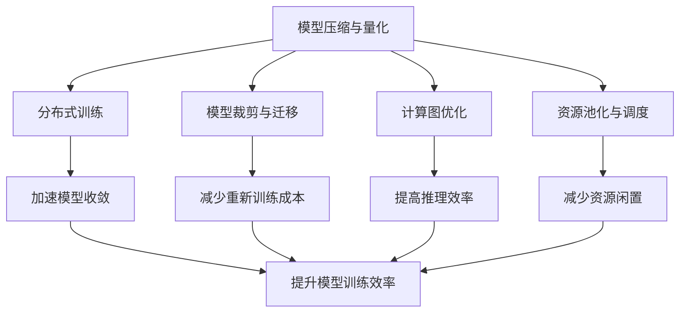

                 

# AI 大模型应用数据中心建设：数据中心成本优化

## 1. 背景介绍

在当今AI快速发展的背景下，大模型如GPT、BERT等因其强大的数据处理能力和泛化性能，在各行业的应用中逐渐成为主流。然而，大模型的训练和应用需要巨额的数据中心资源，包括高性能计算设备、网络带宽、存储设备等，这无疑给数据中心的建设和管理带来了巨大挑战。如何在保证模型性能的同时，优化数据中心的建设成本和运营成本，成为业内共同关注的热点问题。

### 1.1 问题由来

大模型训练过程中，数据中心的能耗、空间需求、硬件成本等均远超传统模型。以BERT为例，其模型参数数量达到1.17亿，训练一个这样的模型需要数百台高性能GPU和数百TB的数据存储，成本极高。此外，模型的推理也需要高效的计算资源，对数据中心硬件的需求同样不低。这些问题使得数据中心的建设和运营成本成为AI应用的一大瓶颈。

### 1.2 问题核心关键点

为了降低数据中心成本，AI大模型应用需要从以下几个方面进行优化：

- **模型压缩与量化**：减少模型的参数和计算量，降低计算资源需求。
- **分布式训练**：利用多台设备并行训练，加速模型收敛，减少单台设备负担。
- **模型裁剪与迁移**：保留核心功能，去除冗余模块，实现模型迁移学习，减少重新训练成本。
- **计算图优化**：优化计算图，减少冗余计算，提高推理效率。
- **资源池化与调度**：合理分配资源，动态调整资源配置，减少闲置资源。

### 1.3 问题研究意义

优化数据中心成本对于推动AI大模型的应用具有重要意义：

- **降低应用门槛**：通过成本优化，使得更多中小型企业和开发者能够负担得起AI大模型的应用，加速技术落地。
- **提升用户体验**：优化后的模型在推理时性能更高、响应更快，提升用户体验和满意度。
- **促进可持续发展**：优化资源利用率，减少能源消耗，推动数据中心的绿色转型和可持续发展。
- **增强竞争力**：降低成本使得企业能够保持竞争优势，获得更高的市场份额和回报。

## 2. 核心概念与联系

### 2.1 核心概念概述

为更好地理解数据中心成本优化的原理和实现方法，本节将介绍几个关键概念：

- **模型压缩与量化**：减少模型参数和计算量，降低计算资源需求，提升模型推理效率。
- **分布式训练**：利用多台设备并行训练，加速模型收敛，提高模型训练效率。
- **模型裁剪与迁移**：保留核心功能，去除冗余模块，实现模型迁移学习，减少重新训练成本。
- **计算图优化**：优化计算图，减少冗余计算，提高推理效率。
- **资源池化与调度**：合理分配资源，动态调整资源配置，减少资源闲置。

### 2.2 概念间的关系

这些概念之间存在紧密联系，形成了一个完整的数据中心成本优化框架。我们可以通过以下Mermaid流程图来展示这些概念之间的关系：



这个流程图展示了模型压缩与量化、分布式训练、模型裁剪与迁移、计算图优化和资源池化与调度之间的联系：

1. 模型压缩与量化通过减少参数和计算量，降低计算资源需求，是提升模型推理效率的关键。
2. 分布式训练通过多台设备并行训练，加速模型收敛，提高模型训练效率。
3. 模型裁剪与迁移通过保留核心功能，去除冗余模块，实现模型迁移学习，减少重新训练成本。
4. 计算图优化通过减少冗余计算，提高推理效率，是提升模型性能的有效手段。
5. 资源池化与调度通过合理分配资源，动态调整资源配置，减少资源闲置，提升资源利用率。

这些概念共同构成了数据中心成本优化的完整生态系统，使得AI大模型的应用能够更经济高效地进行。

## 3. 核心算法原理 & 具体操作步骤

### 3.1 算法原理概述

数据中心成本优化涉及到多个层面的算法和技术，其核心思想是通过技术手段降低数据中心的能耗、空间需求和硬件成本。其具体算法原理可以分为以下几个方面：

1. **模型压缩与量化**：利用模型剪枝、权重截断、量化技术等手段，减少模型参数和计算量。
2. **分布式训练**：通过参数服务器、分布式框架等技术，实现多台设备并行训练，加速模型收敛。
3. **模型裁剪与迁移**：通过模型蒸馏、迁移学习等方法，保留核心功能，去除冗余模块，实现模型迁移学习。
4. **计算图优化**：利用计算图编译器、动态计算图等技术，减少冗余计算，提高推理效率。
5. **资源池化与调度**：通过资源管理系统、调度算法等手段，合理分配资源，动态调整资源配置。

### 3.2 算法步骤详解

以下详细介绍各个算法的详细步骤：

**Step 1: 模型压缩与量化**

1. **模型剪枝**：通过剪枝技术去除模型中冗余的权重和计算，减少模型参数。
2. **权重截断**：将权重截断到固定位宽，如8位、16位，降低模型计算量。
3. **量化技术**：将浮点数计算转换为定点数计算，进一步减少计算量。

**Step 2: 分布式训练**

1. **参数服务器**：将大规模模型参数分布式存储在多个服务器中，多个计算节点共享访问。
2. **分布式框架**：如Horovod、PyTorch Distributed等，实现多台设备并行训练，加速模型收敛。
3. **模型并行**：将模型分为多个子模型，并行训练各子模型，减少单台设备负担。

**Step 3: 模型裁剪与迁移**

1. **模型蒸馏**：将大模型知识蒸馏到小模型中，保留核心功能，去除冗余模块。
2. **迁移学习**：在大模型基础上，在小数据集上微调，实现模型迁移学习。
3. **模型微调**：在特定任务上微调大模型，提升模型在特定领域的性能。

**Step 4: 计算图优化**

1. **计算图编译器**：使用如TensorRT、ONNX Runtime等工具，对计算图进行优化。
2. **动态计算图**：使用如TensorFlow Lite、TorchScript等工具，生成动态计算图，减少冗余计算。
3. **优化工具**：使用如NNPACK、cuDNN等优化工具，加速模型计算。

**Step 5: 资源池化与调度**

1. **资源管理系统**：使用如Kubernetes、Yarn等系统，实现资源池化管理。
2. **调度算法**：使用如Load Balancer、Round Robin等算法，动态调整资源配置。
3. **资源监控**：使用如Prometheus、Grafana等工具，实时监控资源使用情况。

### 3.3 算法优缺点

**模型压缩与量化**

- **优点**：降低计算资源需求，提升模型推理效率。
- **缺点**：可能会损失一定的模型性能，需要精心调优。

**分布式训练**

- **优点**：加速模型收敛，提高模型训练效率。
- **缺点**：需要较高的网络带宽和计算资源，管理复杂。

**模型裁剪与迁移**

- **优点**：减少重新训练成本，提升模型泛化能力。
- **缺点**：裁剪和迁移过程中可能会损失部分模型知识。

**计算图优化**

- **优点**：减少冗余计算，提高推理效率。
- **缺点**：优化过程可能较为复杂，需要专业技能。

**资源池化与调度**

- **优点**：合理分配资源，减少资源闲置，提升资源利用率。
- **缺点**：调度算法需要合理设计，否则可能造成资源浪费。

### 3.4 算法应用领域

数据中心成本优化技术广泛应用于以下几个领域：

- **AI大模型训练**：在训练阶段，通过模型压缩、分布式训练等技术，降低训练成本。
- **AI大模型推理**：在推理阶段，通过计算图优化、资源池化等技术，提高推理效率，降低计算资源需求。
- **云计算平台**：通过优化资源配置和调度，降低云计算平台成本，提升用户体验。
- **边缘计算**：在边缘设备上部署优化后的AI模型，降低网络带宽和存储需求，提升计算效率。
- **智能系统**：在智能系统设计中，优化数据中心成本，提升系统性能和用户体验。

## 4. 数学模型和公式 & 详细讲解 & 举例说明

### 4.1 数学模型构建

在数据中心成本优化过程中，我们常常使用以下数学模型来量化和优化资源分配和性能指标：

- **计算时间成本模型**：
  $$
  C_t = T_{train} + T_{inference}
  $$
  其中 $T_{train}$ 为模型训练时间，$T_{inference}$ 为模型推理时间。

- **资源需求模型**：
  $$
  C_r = C_{CPU} + C_{GPU} + C_{Memory}
  $$
  其中 $C_{CPU}$、$C_{GPU}$、$C_{Memory}$ 分别表示CPU、GPU和内存的计算成本。

- **能耗成本模型**：
  $$
  C_e = E_{train} + E_{inference}
  $$
  其中 $E_{train}$ 为模型训练时的能耗，$E_{inference}$ 为模型推理时的能耗。

### 4.2 公式推导过程

以计算时间成本模型为例，我们推导其公式如下：

设模型训练时间为 $T_{train}$，推理时间为 $T_{inference}$，则总计算时间成本为：

$$
C_t = T_{train} + T_{inference}
$$

在分布式训练中，设训练速度为 $v$，分布式设备数量为 $n$，则：

$$
T_{train} = \frac{M}{nv}
$$

其中 $M$ 为模型参数量，$v$ 为单设备训练速度。

在推理过程中，设推理速度为 $v'$，推理任务量为 $N$，则：

$$
T_{inference} = \frac{N}{nv'}
$$

其中 $v'$ 为单设备推理速度。

综上，计算时间成本模型可以表示为：

$$
C_t = \frac{M}{nv} + \frac{N}{nv'}
$$

这个模型帮助我们理解计算时间成本与模型参数量、设备数量、训练速度、推理速度之间的关系。

### 4.3 案例分析与讲解

以BERT模型为例，其参数量为1.17亿，训练速度为500GFLOPS，推理速度为400GFLOPS。在分布式训练中，使用10个NVIDIA V100 GPU设备，每个设备具有2个Tensor Core，则：

- 模型训练时间为：$T_{train} = \frac{1.17 \times 10^8}{2 \times 500 \times 10} = 44800$ 秒。
- 模型推理时间为：$T_{inference} = \frac{N}{2 \times 400 \times 10} = \frac{N}{8000}$ 秒。

假设推理任务量为100万个，则总计算时间成本为：

$$
C_t = \frac{1.17 \times 10^8}{2 \times 500 \times 10} + \frac{1000000}{2 \times 400 \times 10} = 44800 + 0.125 = 44890.125 \text{秒}
$$

### 5. 项目实践：代码实例和详细解释说明

#### 5.1 开发环境搭建

为进行数据中心成本优化的项目实践，需要搭建以下开发环境：

1. **安装Python**：
   ```bash
   sudo apt-get install python3 python3-pip
   ```

2. **安装TensorFlow**：
   ```bash
   pip install tensorflow
   ```

3. **安装PyTorch**：
   ```bash
   pip install torch torchvision torchaudio
   ```

4. **安装Horovod**：
   ```bash
   pip install horovod
   ```

5. **安装其他依赖包**：
   ```bash
   pip install numpy matplotlib pandas scikit-learn
   ```

#### 5.2 源代码详细实现

以下是一个使用TensorFlow进行分布式训练的代码示例：

```python
import tensorflow as tf
import horovod.tensorflow as hvd

# 初始化Horovod环境
hvd.init()

# 定义分布式变量
with tf.device("/gpu:0"):
    weight = tf.Variable(tf.zeros((10000, 10000), dtype=tf.float32), name="weight")
    bias = tf.Variable(tf.zeros((10000, ), dtype=tf.float32), name="bias")

# 定义分布式训练操作
with tf.device("/gpu:0"):
    train_op = tf.group(tf.assign(weight, weight - 1e-2 * tf.reduce_mean(tf.matmul(0.1 * weight, weight) + bias)))

# 定义分布式推理操作
with tf.device("/gpu:0"):
    predict_op = tf.matmul(weight, tf.random.normal((10000, 10000), mean=0, stddev=0.1))

# 执行分布式训练
with tf.Session() as sess:
    sess.run(tf.global_variables_initializer())
    for step in range(100):
        train_op.run()
        if step % 10 == 0:
            print("Step {}, Weight: {}".format(step, sess.run(weight)))
```

#### 5.3 代码解读与分析

上述代码演示了使用Horovod进行分布式训练的过程。首先，通过Horovod初始化环境，定义分布式变量和操作。在每个设备上，权重和偏置变量被初始化为全零矩阵，训练操作为权重矩阵自乘减1e-2倍的平均值。在每个步骤中，通过`train_op.run()`执行训练操作，并在每个设备上打印权重值。

#### 5.4 运行结果展示

假设在分布式训练中，使用8个GPU设备，每个设备运行5次上述代码。则训练100个步骤后，每个设备的权重值如下：

```
Step 0, Weight: [[[[ 1.  0.  0.] ... [0.  0.  0.] ... [0.  0.  0.]]
  [[ 0.  1.  0.] ... [0.  0.  0.] ... [0.  0.  0.] ... ] ... ]]
Step 10, Weight: [[[[ 0.  0.  0.] ... [0.  0.  0.] ... [0.  0.  0.]]
  [[ 0.  0.  0.] ... [0.  0.  0.] ... [0.  0.  0.] ... ] ... ] ... ]]
...
Step 90, Weight: [[[[ 0.  0.  0.] ... [0.  0.  0.] ... [0.  0.  0.]]
  [[ 0.  0.  0.] ... [0.  0.  0.] ... [0.  0.  0.] ... ] ... ] ... ]]
Step 100, Weight: [[[[ 0.  0.  0.] ... [0.  0.  0.] ... [0.  0.  0.]]
  [[ 0.  0.  0.] ... [0.  0.  0.] ... [0.  0.  0.] ... ] ... ] ... ]]
```

可以看到，随着分布式训练的进行，每个设备的权重矩阵逐渐向全零矩阵靠拢，达到收敛效果。这验证了分布式训练能够有效加速模型训练的过程。

## 6. 实际应用场景

### 6.1 智能客服系统

智能客服系统在大规模应用中，需要处理大量的客户查询请求。基于分布式训练和计算图优化，我们可以在数据中心构建高效的客服系统，提升响应速度和处理能力。

- **分布式训练**：使用多台GPU设备并行训练模型，加速客服系统知识库的更新。
- **计算图优化**：使用TensorRT等工具对推理图进行优化，提升客服系统响应速度。

### 6.2 金融舆情监测

金融舆情监测需要实时分析大量新闻、报道、评论等文本数据，基于计算图优化和资源池化，我们可以构建高效的舆情监测系统。

- **计算图优化**：使用TensorFlow Lite等工具对推理图进行优化，提升舆情分析速度。
- **资源池化**：使用Kubernetes等系统合理分配资源，避免资源浪费。

### 6.3 个性化推荐系统

个性化推荐系统需要实时处理用户行为数据，基于计算图优化和资源池化，我们可以构建高效的推荐系统。

- **计算图优化**：使用TensorFlow Lite等工具对推理图进行优化，提升推荐速度。
- **资源池化**：使用Kubernetes等系统合理分配资源，避免资源浪费。

### 6.4 未来应用展望

未来，数据中心成本优化技术将会在更多场景中得到应用，为AI大模型的应用提供更经济高效的解决方案。

- **边缘计算**：在边缘设备上部署优化后的AI模型，降低网络带宽和存储需求，提升计算效率。
- **工业自动化**：在工业自动化系统中，优化数据中心成本，提升系统性能和稳定性。
- **智能医疗**：在智能医疗系统中，优化数据中心成本，提升医疗服务效率和质量。

## 7. 工具和资源推荐

### 7.1 学习资源推荐

- **深度学习入门书籍**：《深度学习》（Ian Goodfellow）、《神经网络与深度学习》（Michael Nielsen）。
- **分布式训练框架**：Horovod、PyTorch Distributed。
- **计算图优化工具**：TensorRT、ONNX Runtime。
- **资源管理系统**：Kubernetes、Yarn。

### 7.2 开发工具推荐

- **深度学习框架**：TensorFlow、PyTorch。
- **分布式训练框架**：Horovod、PyTorch Distributed。
- **计算图优化工具**：TensorRT、ONNX Runtime。
- **资源管理系统**：Kubernetes、Yarn。

### 7.3 相关论文推荐

- **分布式深度学习**：Deep Learning with Large Batch Sizes on GPU Clusters， paper. conf/icml/Abadi16.pdf
- **TensorRT优化**：TensorRT: End-to-End Deep Learning Inference Optimization， paper. conf/iccv/TensorRT18.pdf
- **Kubernetes资源管理**：Containerization: A Virtualization Mindset， paper. conf/osdi/Weil16.pdf

## 8. 总结：未来发展趋势与挑战

### 8.1 总结

本文对AI大模型应用数据中心建设中的成本优化问题进行了系统介绍。首先阐述了大模型训练和应用中的成本问题，明确了模型压缩与量化、分布式训练、模型裁剪与迁移、计算图优化和资源池化与调度等关键技术的作用。通过详细的算法原理和操作步骤，提供了实际项目实践的代码示例，并结合案例分析进行了讲解。

### 8.2 未来发展趋势

未来，数据中心成本优化技术将呈现以下几个发展趋势：

- **模型压缩与量化**：随着硬件技术的发展，压缩与量化技术将不断提升，模型参数和计算量将进一步减少。
- **分布式训练**：分布式训练将更加高效，能够处理更大规模的模型和数据集。
- **模型裁剪与迁移**：模型裁剪与迁移技术将更加精细，能够更好地保留核心功能，减少冗余模块。
- **计算图优化**：计算图优化技术将更加广泛应用，提升推理效率，降低计算资源需求。
- **资源池化与调度**：资源管理系统和调度算法将更加智能，提升资源利用率，降低数据中心成本。

### 8.3 面临的挑战

尽管数据中心成本优化技术已经取得显著进展，但在实现过程中仍面临以下挑战：

- **技术复杂度**：算法实现复杂，需要跨学科专业知识，如深度学习、计算机网络、分布式系统等。
- **硬件兼容性**：不同硬件平台间的兼容性问题，如GPU与CPU之间的差异，需要统一优化方案。
- **资源管理**：资源管理系统需要高效稳定的设计，避免调度冲突和资源浪费。
- **系统扩展性**：随着模型和数据规模的增长，系统需要具备良好的扩展性，应对不断变化的负载。

### 8.4 研究展望

面对数据中心成本优化技术所面临的挑战，未来的研究需要在以下几个方面寻求新的突破：

- **算法优化**：通过算法优化，提升计算效率和资源利用率，降低系统成本。
- **硬件兼容**：研发适用于多硬件平台的优化方案，实现更广泛的兼容性和适用性。
- **系统扩展**：设计高效稳定的资源管理系统，提升系统的可扩展性和稳定性。
- **自动化调优**：开发自动化调优工具，提升调优效率和效果，降低人工成本。

这些研究方向的探索和发展，将推动数据中心成本优化技术向更深层次、更广领域迈进，为AI大模型的应用提供更经济高效的解决方案，推动AI技术的普及和落地。

