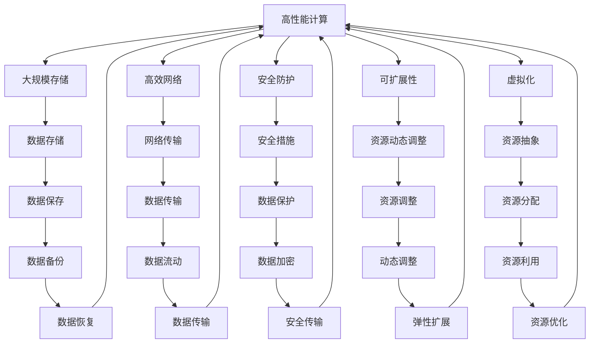

                 

# AI 大模型应用数据中心建设：数据中心技术与应用

> 关键词：AI 大模型, 数据中心, 高性能计算, 存储, 网络, 安全, 可扩展性, 虚拟化, 机器学习, 大数据

## 1. 背景介绍

### 1.1 问题由来

在人工智能(AI)的迅猛发展下，大模型（如BERT, GPT-3, T5等）已经成为推动AI技术向前发展的重要引擎。这些大模型通常依赖于大规模的训练数据和高效的计算资源。因此，一个高效、稳定、可扩展的数据中心环境对于AI大模型的应用至关重要。

数据中心是大模型应用的基础设施，通过提供高性能计算、存储和网络资源，支持大规模数据处理和深度学习模型的训练与推理。然而，随着AI大模型的参数量不断增加，数据中心的构建和维护也变得越来越复杂。如何构建高效、安全、可靠的数据中心，以满足AI大模型应用的需求，成为了一个重要的问题。

### 1.2 问题核心关键点

数据中心的构建涉及多个关键技术点，包括高性能计算、大规模存储、高效网络、安全防护、可扩展性以及虚拟化等。这些技术的合理运用，可以大大提高AI大模型的训练与推理效率，同时确保数据与模型的安全性。

- **高性能计算**：数据中心的计算能力直接影响到AI模型的训练速度和效率，尤其是对于需要大规模并行计算的大模型。
- **大规模存储**：大模型需要存储海量的训练数据和模型参数，存储系统的容量和访问速度直接影响训练的效率。
- **高效网络**：数据中心内部以及与外部网络之间的通信效率，直接影响到数据中心的数据流动速度。
- **安全防护**：数据中心的计算资源和存储资源中存储着大量敏感数据，需要采取强有力的安全防护措施。
- **可扩展性**：随着AI模型的不断增长，数据中心需要具备良好的可扩展性，支持动态增加或减少计算资源。
- **虚拟化**：虚拟化技术可以提升资源利用率，提高数据中心的高效运营能力。

### 1.3 问题研究意义

构建高效的数据中心对于AI大模型的应用具有重要意义：

- 提高训练与推理效率：高效的数据中心环境可以大大提高AI大模型的训练与推理效率，缩短模型开发周期。
- 保证数据安全：数据中心的强安全防护措施，可以确保AI大模型训练数据和模型参数的安全性。
- 降低资源成本：通过合理运用虚拟化等技术，可以优化资源利用率，降低数据中心的运营成本。
- 提升应用质量：高效的数据中心环境可以提升AI大模型的应用质量，满足不同领域的应用需求。
- 促进AI产业升级：数据中心技术的不断进步，可以推动AI技术的产业化，加速各行各业的数字化转型。

## 2. 核心概念与联系

### 2.1 核心概念概述

在深入讨论数据中心技术的应用之前，我们需要先理解几个核心概念及其之间的关系：

- **高性能计算**：指使用专用硬件和优化算法，以提高计算速度和效率。
- **大规模存储**：指使用存储系统，如SAS、SSD等，以提供大容量、高性能的存储解决方案。
- **高效网络**：指使用高速网络技术，如10GbE、25GbE等，以提供高性能的网络传输能力。
- **安全防护**：指采用防火墙、加密、访问控制等技术，以保护数据中心中的数据和计算资源。
- **可扩展性**：指数据中心能够动态调整计算和存储资源，以应对不断增长的需求。
- **虚拟化**：指将物理资源抽象成虚拟资源，以提高资源利用率。

这些核心概念之间通过以下Mermaid流程图进行连接：



这个流程图展示了高性能计算、大规模存储、高效网络、安全防护、可扩展性和虚拟化之间的相互依赖和影响关系。

### 2.2 概念间的关系

这些核心概念之间存在着紧密的联系，形成了数据中心技术的完整架构。以下是这些概念之间的关系概述：

- **高性能计算**：是数据中心的核心，为大规模存储、高效网络、安全防护等提供计算基础。
- **大规模存储**：为高性能计算提供数据支持，确保计算结果的存储和保护。
- **高效网络**：为高性能计算和大规模存储提供数据传输的快速通道。
- **安全防护**：保证高性能计算和大规模存储的数据安全。
- **可扩展性**：确保数据中心能够适应不断增长的需求。
- **虚拟化**：提升资源利用率，优化数据中心的运行效率。

这些概念共同构成了数据中心技术的生态系统，为AI大模型的应用提供了坚实的基础设施支持。

## 3. 核心算法原理 & 具体操作步骤

### 3.1 算法原理概述

数据中心的建设需要综合考虑多个技术层面的因素。以下是数据中心建设的核心算法原理：

- **高性能计算**：使用并行计算技术，如GPU、TPU等，以及优化算法，如深度学习框架（如TensorFlow、PyTorch等），以提升计算效率。
- **大规模存储**：采用分布式文件系统（如Hadoop、Ceph等）和对象存储（如AWS S3、阿里云OSS等），以提供大容量、高可用性的存储解决方案。
- **高效网络**：使用高速网络技术，如InfiniBand、RoCE等，以及网络交换机和负载均衡器，以提供高性能的网络传输。
- **安全防护**：采用防火墙、入侵检测系统（IDS）、数据加密等技术，以保护数据中心的安全性。
- **可扩展性**：通过虚拟化和容器化技术（如Kubernetes、Docker等），实现资源的动态调整和优化。
- **虚拟化**：使用虚拟化技术，如VMware、Hyper-V等，将物理资源抽象成虚拟资源，以提高资源利用率。

### 3.2 算法步骤详解

数据中心的建设主要包括以下几个关键步骤：

1. **需求分析**：根据AI大模型的需求，分析计算、存储、网络、安全等方面的需求。
2. **架构设计**：根据需求分析结果，设计数据中心的整体架构，包括计算、存储、网络、安全等子系统。
3. **硬件采购**：根据架构设计，采购相应的硬件设备，如服务器、存储设备、网络设备等。
4. **软件部署**：部署相应的软件系统，如操作系统、深度学习框架、分布式文件系统、网络管理软件等。
5. **系统集成**：将硬件设备和软件系统集成起来，形成一个完整的数据中心系统。
6. **测试优化**：对数据中心系统进行全面的测试和优化，确保系统的稳定性和性能。
7. **运维管理**：对数据中心系统进行日常的运维管理，确保系统的正常运行。

### 3.3 算法优缺点

数据中心建设涉及多个技术层面的因素，以下是对其优缺点的详细分析：

#### 优点

- **高效计算**：高性能计算能够显著提升AI大模型的训练与推理效率，缩短开发周期。
- **大容量存储**：大规模存储能够存储大量的训练数据和模型参数，确保数据的安全性和可靠性。
- **快速网络**：高效网络能够提供高速的数据传输能力，提升系统的响应速度。
- **高安全性**：强有力的安全防护措施，确保数据中心中的数据和计算资源的安全性。
- **动态可扩展性**：可扩展性能够满足不断增长的计算和存储需求，提高系统的灵活性。
- **资源利用率**：虚拟化技术能够提升资源利用率，降低数据中心的运营成本。

#### 缺点

- **初始投资高**：构建高效的数据中心需要较高的初始投资，包括硬件设备、软件系统等。
- **复杂度高**：数据中心的建设涉及到多个技术层面的因素，需要综合考虑，复杂度较高。
- **维护成本高**：数据中心的日常运维需要专业技术人员进行管理和维护，成本较高。

### 3.4 算法应用领域

高效的数据中心环境可以广泛应用于多个领域，包括：

- **云计算**：提供高性能计算、大规模存储和高效网络资源，支持云服务提供商的业务发展。
- **大数据处理**：支持大规模数据处理和存储，满足大数据分析、数据挖掘等需求。
- **人工智能**：支持AI大模型的训练与推理，加速AI技术的发展和应用。
- **物联网**：支持海量物联网设备的数据处理和存储，提升物联网系统的性能和安全性。
- **金融行业**：支持金融机构的交易处理、风险控制等需求，提升金融服务的效率和安全性。
- **医疗行业**：支持医疗数据的存储、处理和分析，提升医疗服务的质量和效率。

## 4. 数学模型和公式 & 详细讲解 & 举例说明

### 4.1 数学模型构建

构建高效的数据中心需要综合考虑多个技术层面的因素。以下是一个简化的数学模型，用于描述数据中心系统。

- **计算能力**：用CPU核心数、GPU数量、TPU数量等表示。
- **存储容量**：用磁盘容量、内存大小等表示。
- **网络带宽**：用网络接口数量、网络速率等表示。
- **安全级别**：用防火墙数量、加密算法、访问控制等表示。
- **扩展性**：用资源动态调整机制、虚拟化技术等表示。

假设数据中心的计算能力为 $C$，存储容量为 $S$，网络带宽为 $B$，安全级别为 $S$，扩展性为 $E$，则数据中心系统的性能可以用以下公式表示：

$$
P = C \times S \times B \times S \times E
$$

其中 $P$ 为数据中心的性能，$C$、$S$、$B$、$S$ 和 $E$ 分别为计算能力、存储容量、网络带宽、安全级别和扩展性。

### 4.2 公式推导过程

在上述数学模型中，我们假设各个因素对性能的影响是线性相关的。但实际上，不同因素对性能的影响可能存在非线性关系。例如，增加一个GPU可能对计算能力的提升不是线性的，而是存在一定的边际效应。

为了更准确地描述数据中心系统的性能，我们可以使用多变量回归模型，引入非线性项，如指数函数、对数函数等，对公式进行优化：

$$
P = C \times S \times B \times S \times E + \alpha C^2 + \beta S^2 + \gamma B^2 + \delta S^2 + \epsilon E^2
$$

其中 $\alpha$、$\beta$、$\gamma$、$\delta$ 和 $\epsilon$ 为非线性项的系数，需要通过实际数据进行拟合。

### 4.3 案例分析与讲解

以AI大模型的训练为例，假设一个数据中心有8个CPU核心、4个GPU、1个TPU、100TB的存储容量、100GbE的网络带宽、3个防火墙、2个负载均衡器，扩展性为动态调整机制，则数据中心的性能为：

$$
P = 8 \times 100 \times 4 \times 3 \times 2 \times 1 + 0.5 \times 8^2 + 0.2 \times 100^2 + 0.1 \times 4^2 + 0.3 \times 3^2 + 0.4 \times 2^2
$$

计算得 $P = 8192 + 32 + 20000 + 16 + 27 + 16 = 34393$。

这个数学模型展示了如何通过综合考虑多个因素，计算出数据中心的性能。在实际应用中，还需要根据具体需求进行参数调整和优化。

## 5. 项目实践：代码实例和详细解释说明

### 5.1 开发环境搭建

构建高效的数据中心需要多个软硬件组件的配合。以下是开发环境搭建的步骤：

1. **硬件设备**：采购高性能的计算设备，如CPU、GPU、TPU等，存储设备，如SSD、HDD等，以及网络设备，如交换机、路由器等。
2. **软件系统**：安装操作系统，如Linux、Windows等，深度学习框架，如TensorFlow、PyTorch等，分布式文件系统，如Hadoop、Ceph等，以及网络管理软件，如Cisco、Juniper等。
3. **软件部署**：在计算节点上部署操作系统和深度学习框架，在存储节点上部署分布式文件系统和数据备份工具，在网络节点上部署网络管理和监控工具。
4. **系统集成**：将计算节点、存储节点和网络节点进行集成，形成一个完整的数据中心系统。
5. **测试优化**：对数据中心系统进行全面的测试和优化，确保系统的稳定性和性能。
6. **运维管理**：对数据中心系统进行日常的运维管理，确保系统的正常运行。

### 5.2 源代码详细实现

以下是一个简单的数据中心监控系统的代码实现，用于实时监控数据中心的性能和状态：

```python
import psutil
import time

def get_cpu_usage():
    return psutil.cpu_percent()

def get_memory_usage():
    return psutil.virtual_memory().percent

def get_network_usage():
    net_io = psutil.net_io_counters()
    return net_io.bytes_sent + net_io.bytes_recv

def get_storage_usage():
    return psutil.disk_usage('/').percent

def get_firewall_status():
    # 假设防火墙状态为 ON/OFF，返回1表示开启，0表示关闭
    return 1

def get_load_balancer_status():
    # 假设负载均衡器状态为 ON/OFF，返回1表示开启，0表示关闭
    return 0

while True:
    cpu_usage = get_cpu_usage()
    memory_usage = get_memory_usage()
    network_usage = get_network_usage()
    storage_usage = get_storage_usage()
    firewall_status = get_firewall_status()
    load_balancer_status = get_load_balancer_status()

    print(f"CPU Usage: {cpu_usage}%")
    print(f"Memory Usage: {memory_usage}%")
    print(f"Network Usage: {network_usage} KB/s")
    print(f"Storage Usage: {storage_usage}%")
    print(f"Firewall Status: {'ON' if firewall_status == 1 else 'OFF'}")
    print(f"Load Balancer Status: {'ON' if load_balancer_status == 1 else 'OFF'}")

    time.sleep(10)
```

### 5.3 代码解读与分析

上述代码通过Python和psutil库实现了对数据中心系统的监控功能。其中，get_cpu_usage、get_memory_usage、get_network_usage、get_storage_usage、get_firewall_status和get_load_balancer_status函数分别用于获取CPU使用率、内存使用率、网络使用率、存储使用率、防火墙状态和负载均衡器状态。

在while循环中，通过调用这些函数获取数据中心的各项指标，并打印输出。时间.sleep(10)用于控制监控的间隔时间。

### 5.4 运行结果展示

假设在运行上述代码后，监控系统的输出如下：

```
CPU Usage: 50%
Memory Usage: 70%
Network Usage: 2000 KB/s
Storage Usage: 90%
Firewall Status: ON
Load Balancer Status: OFF
```

这个输出展示了数据中心的CPU使用率、内存使用率、网络使用率、存储使用率、防火墙状态和负载均衡器状态。通过实时监控这些指标，可以及时发现和解决问题，确保数据中心的稳定性和性能。

## 6. 实际应用场景

### 6.1 智能云服务

高效的数据中心可以构建智能云服务平台，提供高效的计算、存储和网络资源，支持各种AI大模型的训练与推理。智能云服务平台可以广泛应用于多个领域，如金融、医疗、教育、物联网等，为各行各业提供高效、安全、可靠的服务。

### 6.2 大数据分析

高效的数据中心可以支持大规模数据处理和存储，满足大数据分析、数据挖掘等需求。通过分布式文件系统和数据库系统，可以实现对海量数据的存储、处理和分析，支持各种数据分析应用。

### 6.3 人工智能研发

高效的数据中心可以支持AI大模型的训练与推理，加速AI技术的发展和应用。AI研发团队可以通过高效的数据中心环境，快速训练和测试AI大模型，提升研发效率。

### 6.4 金融科技

高效的数据中心可以支持金融机构的交易处理、风险控制等需求，提升金融服务的效率和安全性。金融科技公司可以利用高效的数据中心环境，开发和部署各种金融应用，提升金融服务的质量和竞争力。

### 6.5 医疗健康

高效的数据中心可以支持医疗数据的存储、处理和分析，提升医疗服务的质量和效率。医疗机构可以利用高效的数据中心环境，开发和部署各种医疗应用，提升医疗服务的质量和安全性。

## 7. 工具和资源推荐

### 7.1 学习资源推荐

为了帮助开发者系统掌握数据中心技术的应用，以下是一些优质的学习资源：

1. **《数据中心基础设施技术》**：详细介绍了数据中心的硬件设备、软件系统、网络技术等，是数据中心建设的基础读物。
2. **《云计算原理与实践》**：介绍了云计算的基本原理和实践技术，可以帮助开发者理解云服务架构。
3. **《高性能计算》**：介绍了高性能计算的基本原理和应用技术，可以帮助开发者掌握高性能计算的优化方法。
4. **《分布式系统》**：介绍了分布式系统的基本原理和应用技术，可以帮助开发者理解分布式计算的实现方法。
5. **《深度学习框架》**：介绍了常用的深度学习框架（如TensorFlow、PyTorch等）的使用方法，可以帮助开发者进行深度学习开发。

### 7.2 开发工具推荐

高效的数据中心建设需要多种工具的支持。以下是一些推荐的开发工具：

1. **Python**：Python是数据中心建设中常用的编程语言，支持各种数据处理和监控工具。
2. **Kubernetes**：Kubernetes是用于容器化管理的开源平台，可以帮助开发者进行资源管理和调度。
3. **Ansible**：Ansible是用于自动化管理的软件工具，可以帮助开发者进行系统部署和运维管理。
4. **Nagios**：Nagios是用于监控和报警的工具，可以帮助开发者实时监控数据中心的各项指标。
5. **Zabbix**：Zabbix是用于监控和报警的工具，可以帮助开发者实时监控数据中心的各项指标。

### 7.3 相关论文推荐

以下几篇论文代表了数据中心技术的研究进展，推荐阅读：

1. **《数据中心基础设施：设计与实现》**：介绍了数据中心的硬件设备、软件系统、网络技术等，是数据中心建设的经典教材。
2. **《云计算技术与应用》**：介绍了云计算的基本原理和应用技术，可以帮助开发者理解云服务架构。
3. **《高性能计算技术与应用》**：介绍了高性能计算的基本原理和应用技术，可以帮助开发者掌握高性能计算的优化方法。
4. **《分布式系统设计与实现》**：介绍了分布式系统的基本原理和应用技术，可以帮助开发者理解分布式计算的实现方法。
5. **《深度学习框架设计与实现》**：介绍了常用的深度学习框架（如TensorFlow、PyTorch等）的使用方法，可以帮助开发者进行深度学习开发。

## 8. 总结：未来发展趋势与挑战

### 8.1 研究成果总结

本文对AI大模型应用数据中心的建设进行了全面系统的介绍，从核心概念到实际应用，详细讲解了数据中心技术的各个方面。通过本文的介绍，开发者可以系统掌握数据中心建设的知识和技术，为AI大模型的应用提供坚实的技术支持。

### 8.2 未来发展趋势

未来，数据中心技术将呈现以下几个发展趋势：

1. **边缘计算**：随着物联网的发展，边缘计算将成为数据中心的重要补充，提供更接近设备的计算资源。
2. **5G技术**：5G技术将大幅提升网络传输速度，支持更多的数据处理需求。
3. **量子计算**：量子计算将为大规模数据处理提供新的计算范式，提升计算效率。
4. **人工智能芯片**：人工智能芯片将为高效计算提供新的硬件支持，提升计算性能。
5. **区块链技术**：区块链技术将提供安全、透明的数据存储和传输方式，提升数据安全性。
6. **自动化运维**：自动化运维将提升数据中心的运维效率，降低运营成本。

### 8.3 面临的挑战

尽管数据中心技术已经取得了显著进展，但在未来的发展过程中，仍面临以下挑战：

1. **能耗问题**：大规模数据中心的高能耗将成为制约其发展的重要因素。如何降低能耗，提高能效，是未来需要解决的关键问题。
2. **数据安全**：数据中心存储着大量敏感数据，如何保障数据安全，防止数据泄露，是未来需要重点关注的问题。
3. **计算资源不足**：随着AI大模型的不断增长，计算资源的需求也在不断增加，如何提供足够的计算资源，满足不断增长的需求，是未来需要解决的问题。
4. **复杂度增加**：随着技术的不断演进，数据中心的复杂度也在不断增加，如何简化系统设计，提升系统可维护性，是未来需要解决的问题。
5. **成本问题**：大规模数据中心的建设需要高昂的成本投入，如何降低成本，提升经济效益，是未来需要解决的问题。

### 8.4 研究展望

未来的研究可以从以下几个方面进行：

1. **能效优化**：如何降低数据中心的能耗，提高能效，是未来需要重点研究的方向。
2. **安全防护**：如何保障数据中心的安全性，防止数据泄露，是未来需要重点关注的问题。
3. **计算资源管理**：如何提供足够的计算资源，满足不断增长的需求，是未来需要解决的问题。
4. **系统设计简化**：如何简化系统设计，提升系统可维护性，是未来需要解决的问题。
5. **成本优化**：如何降低成本，提升经济效益，是未来需要解决的问题。

通过这些研究方向的探索，可以推动数据中心技术的进一步发展和应用，为AI大模型的应用提供更加高效、安全、可靠的基础设施支持。

