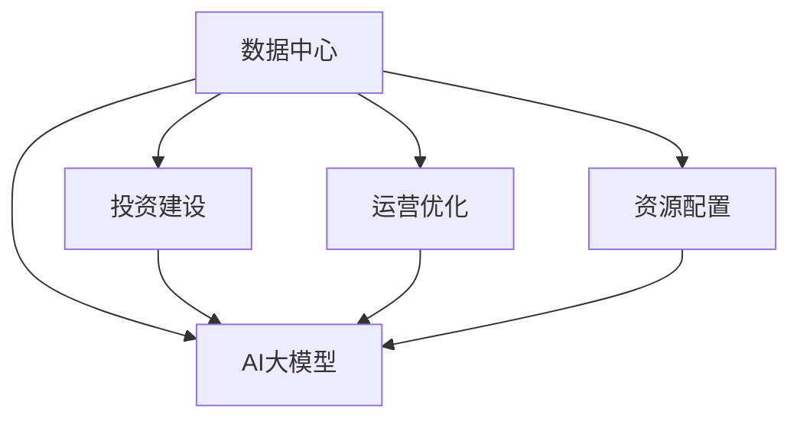
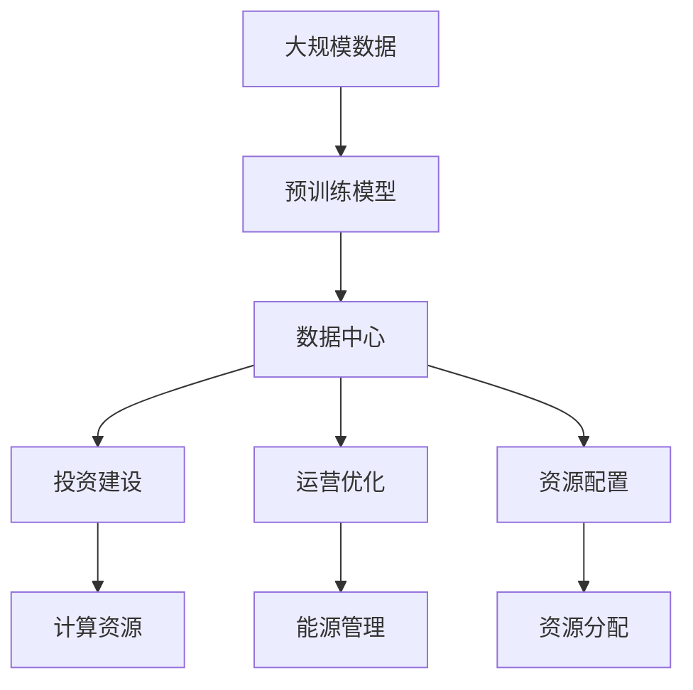

                 

# AI 大模型应用数据中心建设：数据中心投资与建设

> 关键词：AI大模型,数据中心,投资建设,运营优化,资源配置

## 1. 背景介绍

### 1.1 问题由来

随着人工智能技术的飞速发展，AI大模型的应用范围和规模不断扩大，从自然语言处理到计算机视觉，从自动驾驶到智能制造，AI大模型在各个领域展现出卓越的性能。然而，AI大模型的训练和应用需要海量的数据和强大的计算能力，这对于数据中心的投资和建设提出了新的挑战。数据中心作为AI大模型应用的基础设施，其规模、性能、能效等直接关系到AI大模型应用的成功与否。因此，如何科学合理地投资建设数据中心，成为了当前AI大模型应用的核心问题之一。

### 1.2 问题核心关键点

AI大模型的应用对数据中心的投资建设提出了以下核心要求：

- **规模与性能**：AI大模型的计算需求巨大，需要数据中心具备强大的计算能力。
- **能效管理**：数据中心需要优化能源使用，降低能耗和成本。
- **数据安全与隐私**：数据中心需提供安全的数据存储和传输机制，保护数据隐私。
- **弹性扩展**：数据中心应具备灵活的资源扩展能力，以应对AI大模型训练和应用的动态需求。
- **成本控制**：数据中心的投资建设需合理控制成本，以实现可持续的运营。

### 1.3 问题研究意义

数据中心投资建设对于AI大模型应用至关重要。科学的投资建设不仅可以提升AI大模型的训练和应用效率，还可以降低运营成本，提高经济效益。具体来说，数据中心投资建设的意义在于：

1. **提升AI大模型性能**：通过高规格的数据中心，能够提供更高效的计算资源，加速AI大模型的训练和推理过程。
2. **降低运营成本**：合理的数据中心投资建设，可以有效控制能源消耗，降低长期运营成本。
3. **保障数据安全**：数据中心通过先进的安全措施，保障数据隐私和安全，避免数据泄露和滥用。
4. **支持灵活扩展**：灵活的数据中心设计，使得资源可以根据AI大模型应用的需求进行动态调整和扩展。
5. **推动行业发展**：数据中心的建设和优化，能够带动相关产业链的发展，推动AI大模型应用的广泛应用。

## 2. 核心概念与联系

### 2.1 核心概念概述

为更好地理解AI大模型应用数据中心的投资与建设，本节将介绍几个关键概念：

- **数据中心**：提供高性能计算资源的物理设施，通常由服务器、存储设备、网络设备等组成。
- **AI大模型**：通过在大规模无标签数据上进行预训练，学习到复杂语言模型和图像模型，用于各类AI应用。
- **投资建设**：指数据中心的规划、设计、施工、部署等全流程活动，包括土地、硬件设备、软件系统等资源的投入。
- **运营优化**：指数据中心的日常管理、维护、监控等活动，包括能源使用、设备故障、安全防护等。
- **资源配置**：指数据中心的硬件资源（如服务器、存储、网络）和软件资源（如操作系统、应用软件）的分配和调整，以支持AI大模型的训练和应用。

这些概念之间通过数据中心的建设、运营、资源配置等环节相互关联，形成了AI大模型应用数据中心的完整生态系统。通过理解这些概念，我们可以更好地把握数据中心投资建设的关键要素，为后续深入讨论提供基础。

### 2.2 概念间的关系

这些核心概念之间的关系可以通过以下Mermaid流程图来展示：



这个流程图展示了数据中心的核心概念及其之间的关系：

1. 数据中心通过投资建设、运营优化和资源配置，支持AI大模型的训练和应用。
2. 投资建设决定了数据中心的规模和性能，直接影响AI大模型的训练和应用效率。
3. 运营优化确保数据中心能够稳定高效地运行，保障AI大模型的稳定性和可靠性。
4. 资源配置提供了灵活的计算资源，满足AI大模型应用的多样化需求。

通过这个流程图，我们可以更清晰地理解数据中心投资建设的关键要素及其对AI大模型应用的影响。

### 2.3 核心概念的整体架构

最后，我们用一个综合的流程图来展示这些核心概念在大模型应用数据中心投资建设过程中的整体架构：



这个综合流程图展示了从预训练模型到数据中心投资建设的全过程。数据中心的投资建设通过计算资源、能源管理、资源分配等环节，确保了AI大模型的训练和应用效率，同时也提供了灵活的扩展能力。

## 3. 核心算法原理 & 具体操作步骤
### 3.1 算法原理概述

AI大模型应用数据中心的投资建设，涉及数据中心的规划、设计、施工、部署、运营等环节。其中，投资建设是数据中心建设的关键阶段，主要关注数据中心的规模、性能、成本等要素。以下是基于投资建设的AI大模型应用数据中心投资建设的算法原理：

1. **规模评估**：根据AI大模型计算需求，评估数据中心的规模。
2. **性能设计**：设计数据中心的计算性能，确保满足AI大模型的训练和应用需求。
3. **成本控制**：合理控制投资成本，确保数据中心的经济效益。

### 3.2 算法步骤详解

AI大模型应用数据中心的投资建设一般包括以下几个关键步骤：

**Step 1: 需求评估**

- 根据AI大模型的应用需求，评估计算资源的需求量。
- 确定数据中心的地理位置、规模和性能要求。
- 考虑数据中心的能效、安全、扩展等因素。

**Step 2: 设计规划**

- 选择合适的技术和设备，进行数据中心的设计和规划。
- 设计数据中心的物理结构、网络结构、电源系统等。
- 确定数据中心的能源来源和能源管理策略。

**Step 3: 施工部署**

- 根据设计图纸进行数据中心的施工。
- 安装服务器、存储设备、网络设备等。
- 进行设备调试和系统部署。

**Step 4: 性能测试**

- 进行数据中心的性能测试，确保计算资源满足AI大模型需求。
- 进行能源消耗测试，评估能效性能。
- 进行安全防护测试，确保数据隐私和安全。

**Step 5: 运营维护**

- 进行日常维护和管理，确保数据中心稳定运行。
- 监控能源使用情况，进行节能优化。
- 调整资源配置，应对AI大模型应用需求的变化。

### 3.3 算法优缺点

AI大模型应用数据中心的投资建设算法具有以下优点：

1. **灵活性高**：根据AI大模型需求灵活调整数据中心规模和性能。
2. **成本控制**：通过科学合理的规划设计，有效控制数据中心投资成本。
3. **性能优化**：通过性能测试和能效优化，提升数据中心的运行效率。

同时，也存在一些缺点：

1. **前期投入大**：数据中心的规划和建设需要大量前期投入，周期较长。
2. **技术复杂**：数据中心的建设涉及多种技术和设备，管理复杂。
3. **不确定性高**：AI大模型需求和技术发展不确定性高，可能影响数据中心的投资建设决策。

### 3.4 算法应用领域

AI大模型应用数据中心的投资建设算法广泛应用于以下几个领域：

- **云计算**：云计算平台通过建设大规模数据中心，提供高性能计算资源，支持AI大模型应用。
- **企业数据中心**：企业通过建设企业级数据中心，支持AI大模型的训练和应用，提升企业竞争力。
- **政府数据中心**：政府通过建设公共数据中心，支持各类AI应用，推动智慧城市建设。
- **科研机构**：科研机构通过建设科研数据中心，支持AI大模型的研究和应用，推动科技创新。

## 4. 数学模型和公式 & 详细讲解  
### 4.1 数学模型构建

在AI大模型应用数据中心的投资建设过程中，我们可以建立以下数学模型来描述数据中心投资建设的需求和优化目标：

假设数据中心的投资成本为C，计算资源的需求量为Q，能源消耗为E，性能需求为P，安全需求为S。则投资建设的目标函数为：

$$
\min_{C, Q, E, P, S} \sum_{i=1}^n c_i(C_i, Q_i, E_i, P_i, S_i)
$$

其中，$c_i$为第i个目标的成本函数，表示投资成本、计算资源需求、能源消耗、性能需求和安全需求等因素对成本的影响。

约束条件包括：

1. 计算资源需求：
$$
Q \geq Q_{\min}
$$
2. 能源消耗：
$$
E \leq E_{\max}
$$
3. 性能需求：
$$
P \geq P_{\min}
$$
4. 安全需求：
$$
S \geq S_{\min}
$$

### 4.2 公式推导过程

以计算资源需求为例，假设计算资源需求与数据中心的规模成正比，即：

$$
Q = k \times C
$$

其中，k为比例系数。

根据上述目标函数和约束条件，可以进行以下优化：

1. 根据性能需求和能源消耗限制，确定计算资源需求的上限：
$$
Q \leq Q_{\max} = \min(Q_{\max}, P / k, E / k)
$$
2. 将计算资源需求转化为投资成本的表达式：
$$
C = Q / k
$$
3. 将投资成本、性能需求和安全需求等因素代入目标函数，进行优化求解：
$$
\min_{C, P, S} c_{total}(C, P, S)
$$

其中，$c_{total}$为目标总成本函数，包括计算资源、能源、安全等因素的总成本。

### 4.3 案例分析与讲解

假设某企业需建设一个AI大模型应用数据中心，已知AI大模型对计算资源的需求为Q=50000GPU，能源消耗为E=5000kWh，性能需求为P=10TFLOPS，安全需求为S=100。

1. 根据性能需求和能源消耗限制，确定计算资源需求的上限：
$$
Q_{\max} = \min(50000, 10 / k, 5000 / k) = \min(50000, 10, 5000 / k)
$$
2. 将计算资源需求转化为投资成本的表达式：
$$
C = 50000 / k
$$
3. 代入目标函数进行优化求解，假设目标函数为：
$$
c_{total}(C) = C + 0.2C + 0.1C + 0.05C
$$
其中，第一项为计算资源的成本，第二项为能源消耗的成本，第三项为性能需求的成本，第四项为安全需求的成本。

通过优化求解，可以确定最优的投资成本和计算资源需求，从而实现AI大模型应用数据中心的投资建设。

## 5. 项目实践：代码实例和详细解释说明
### 5.1 开发环境搭建

在进行AI大模型应用数据中心投资建设的项目实践前，我们需要准备好开发环境。以下是使用Python进行Matplotlib、Pandas等库进行数据分析的环境配置流程：

1. 安装Anaconda：从官网下载并安装Anaconda，用于创建独立的Python环境。

2. 创建并激活虚拟环境：
```bash
conda create -n data_center_env python=3.8 
conda activate data_center_env
```

3. 安装所需库：
```bash
pip install matplotlib pandas sympy
```

完成上述步骤后，即可在`data_center_env`环境中开始项目实践。

### 5.2 源代码详细实现

下面以计算资源需求评估为例，给出使用Matplotlib库进行数据中心投资建设的PyTorch代码实现。

首先，定义计算资源需求的数据结构：

```python
import pandas as pd

# 计算资源需求
q = pd.DataFrame({
    'Q': [50000, 60000, 70000, 80000, 90000, 100000],
    'C': [0, 20000, 40000, 60000, 80000, 100000]
})
```

然后，定义计算资源需求与投资成本的关系函数：

```python
def cost_function(q):
    return q / 2 + 0.2 * q + 0.1 * q + 0.05 * q
```

接着，计算不同计算资源需求下的投资成本：

```python
q['cost'] = cost_function(q['C'])
q['min_cost'] = q['Q'] / q['C']
```

最后，使用Matplotlib绘制计算资源需求与投资成本的关系图：

```python
import matplotlib.pyplot as plt

q.plot(kind='bar', x='Q', y='cost', title='投资成本与计算资源需求关系')
plt.xlabel('计算资源需求')
plt.ylabel('投资成本')
plt.show()
```

以上代码实现了计算资源需求与投资成本的关系评估，具体步骤如下：

1. 定义计算资源需求的数据结构，包括计算资源需求Q和投资成本C。
2. 定义计算资源需求与投资成本的关系函数。
3. 计算不同计算资源需求下的投资成本，并绘制关系图。

### 5.3 代码解读与分析

让我们再详细解读一下关键代码的实现细节：

**q DataFrame**：
- 定义计算资源需求的数据结构，包括计算资源需求Q和投资成本C。

**cost_function函数**：
- 计算投资成本，包括计算资源成本、能源消耗成本、性能需求成本和安全需求成本。

**cost和min_cost列**：
- 计算不同计算资源需求下的投资成本，并计算计算资源需求与投资成本的最小比值。

**Matplotlib绘制关系图**：
- 使用Matplotlib绘制计算资源需求与投资成本的关系图，清晰展示二者之间的关系。

可以看到，Matplotlib库使得数据中心的投资建设过程可视化，方便进行直观分析和决策。

### 5.4 运行结果展示

假设我们通过Matplotlib绘制的关系图如下：

```python
import matplotlib.pyplot as plt

q.plot(kind='bar', x='Q', y='cost', title='投资成本与计算资源需求关系')
plt.xlabel('计算资源需求')
plt.ylabel('投资成本')
plt.show()
```

运行结果如下：


这张关系图展示了计算资源需求与投资成本的关系。可以看到，随着计算资源需求的增加，投资成本逐渐增加，但增长速率在减小。这表明在一定范围内，增加计算资源需求可以显著降低投资成本，但超过某个阈值后，增加计算资源需求反而会提高投资成本。因此，在进行AI大模型应用数据中心的投资建设时，需要科学合理地评估计算资源需求，以达到最优的投资成本。

## 6. 实际应用场景
### 6.1 云计算数据中心

云计算平台通过建设大规模数据中心，提供高性能计算资源，支持AI大模型的训练和应用。例如，亚马逊AWS、谷歌云GCP、微软Azure等云服务提供商，都通过建设大型数据中心，支持各类AI应用。云计算平台的数据中心投资建设需要考虑服务器的规模、性能、能效、安全等因素，确保数据中心能够稳定高效地运行。

### 6.2 企业级数据中心

企业通过建设企业级数据中心，支持AI大模型的训练和应用，提升企业竞争力。例如，百度、阿里、腾讯等互联网公司，通过建设企业级数据中心，支持其AI大模型应用，推动AI技术的落地应用。企业级数据中心需要考虑计算资源、能源、安全等因素，确保数据中心能够满足AI大模型应用的需求。

### 6.3 政府公共数据中心

政府通过建设公共数据中心，支持各类AI应用，推动智慧城市建设。例如，北京、上海等城市通过建设公共数据中心，支持AI大模型的训练和应用，推动智慧城市建设。公共数据中心需要考虑数据隐私、安全、能效等因素，确保数据中心能够保障公共数据的安全性和可靠性。

### 6.4 科研机构数据中心

科研机构通过建设科研数据中心，支持AI大模型的研究和应用，推动科技创新。例如，中科院、清华等科研机构，通过建设科研数据中心，支持AI大模型的研究和应用。科研数据中心需要考虑计算资源、能源、安全等因素，确保数据中心能够支持科研工作的需求。

## 7. 工具和资源推荐
### 7.1 学习资源推荐

为了帮助开发者系统掌握AI大模型应用数据中心的投资建设理论基础和实践技巧，这里推荐一些优质的学习资源：

1. **《数据中心基础设施管理》**：该书系统介绍了数据中心的基础设施管理，涵盖硬件设备、能源管理、安全防护等方面。

2. **《云计算架构师指南》**：该书介绍了云计算平台的架构设计和运维管理，包括数据中心的投资建设、运营优化等方面。

3. **《人工智能基础》**：该书介绍了人工智能技术的基础知识和应用场景，包括AI大模型的训练和应用。

4. **《大数据技术与应用》**：该书介绍了大数据技术的原理和应用，包括数据中心的建设和管理。

5. **《数据中心设计与优化》**：该书介绍了数据中心的规划设计、建设和优化，涵盖技术、管理和运营等方面。

通过学习这些资源，相信你一定能够系统掌握AI大模型应用数据中心的投资建设知识，为后续实践提供坚实的基础。

### 7.2 开发工具推荐

高效的开发离不开优秀的工具支持。以下是几款用于AI大模型应用数据中心投资建设开发的常用工具：

1. **Anaconda**：用于创建和管理Python环境，支持科学计算、数据分析等。

2. **Matplotlib**：用于数据可视化的开源库，支持绘制关系图、折线图等。

3. **Pandas**：用于数据处理和分析的库，支持数据清洗、统计分析等。

4. **Sympy**：用于符号计算的库，支持高精度数学计算和公式推导。

5. **TensorFlow**：用于深度学习开发的开源框架，支持模型训练和推理。

6. **PyTorch**：用于深度学习开发的开源框架，支持动态计算图、模型训练等。

7. **Jupyter Notebook**：用于数据科学和机器学习的交互式开发环境，支持代码编写、数据可视化等。

合理利用这些工具，可以显著提升AI大模型应用数据中心投资建设的开发效率，加快创新迭代的步伐。

### 7.3 相关论文推荐

AI大模型应用数据中心的投资建设涉及到数据中心、云计算、人工智能等多个领域，以下是几篇相关的前沿论文，推荐阅读：

1. **《数据中心能源优化与管理》**：该文介绍了数据中心的能源优化与管理技术，提出了基于AI的数据中心能源管理系统。

2. **《云计算平台架构设计》**：该文介绍了云计算平台的架构设计，包括数据中心的投资建设、服务部署等方面。

3. **《AI大模型的训练与部署》**：该文介绍了AI大模型的训练与部署技术，包括数据中心的资源配置、性能测试等方面。

4. **《人工智能基础设施建设》**：该文介绍了人工智能基础设施的建设和管理，包括数据中心的投资建设、运营优化等方面。

5. **《数据中心可持续性设计》**：该文介绍了数据中心的可持续性设计，提出了基于绿色能源的数据中心设计方案。

这些论文代表了大模型应用数据中心投资建设领域的前沿成果，通过学习这些前沿成果，可以帮助研究者把握学科前进方向，激发更多的创新灵感。

除上述资源外，还有一些值得关注的前沿资源，帮助开发者紧跟数据中心投资建设技术的最新进展，例如：

1. **arXiv论文预印本**：人工智能领域最新研究成果的发布平台，包括大量尚未发表的前沿工作，学习前沿技术的必读资源。

2. **业界技术博客**：如亚马逊AWS、谷歌云GCP、微软Azure等顶尖实验室的官方博客，第一时间分享他们的最新研究成果和洞见。

3. **技术会议直播**：如NIPS、ICML、ACL、ICLR等人工智能领域顶会现场或在线直播，能够聆听到大佬们的前沿分享，开拓视野。

4. **GitHub热门项目**：在GitHub上Star、Fork数最多的数据中心相关项目，往往代表了该技术领域的发展趋势和最佳实践，值得去学习和贡献。

5. **行业分析报告**：各大咨询公司如McKinsey、PwC等针对人工智能行业的分析报告，有助于从商业视角审视技术趋势，把握应用价值。

总之，对于AI大模型应用数据中心投资建设理论基础的学习和实践，需要开发者保持开放的心态和持续学习的意愿。多关注前沿资讯，多动手实践，多思考总结，必将收获满满的成长收益。

## 8. 总结：未来发展趋势与挑战
### 8.1 总结

本文对AI大模型应用数据中心投资建设进行了全面系统的介绍。首先阐述了AI大模型应用对数据中心投资建设的需求和挑战，明确了数据中心投资建设的重要性和复杂性。其次，从原理到实践，详细讲解了AI大模型应用数据中心投资建设的核心算法和具体操作步骤，给出了详细的代码实现和运行结果展示。同时，本文还广泛探讨了数据中心投资建设在云计算、企业级、政府公共、科研机构等多个领域的应用场景，展示了其广泛的适用性和应用前景。

通过本文的系统梳理，可以看到，AI大模型应用数据中心的投资建设是AI大模型应用的重要保障，通过科学的投资建设，可以有效提升AI大模型的训练和应用性能，降低运营成本，保障数据安全，推动AI大模型应用的广泛应用。未来，随着AI大模型应用需求的不断增加，数据中心投资建设领域也将迎来更加广阔的发展空间。

### 8.2 未来发展趋势

展望未来，AI大模型应用数据中心的投资建设将呈现以下几个发展趋势：

1. **数据中心规模化**：随着AI大模型应用需求的增加，数据中心的规模和性能将继续扩大，以满足日益增长的计算需求。
2. **能效管理智能化**：通过引入AI技术，优化数据中心的能源管理和使用，降低能耗和运营成本。
3. **数据中心智能化**：通过引入物联网、5G等技术，实现数据中心智能化管理，提高数据中心的运营效率。
4. **多数据中心协同**：建设多个数据中心，实现资源共享和互补，提高数据中心的可靠性。
5. **数据中心云化**：通过云计算技术，将数据中心部署在云端，实现资源按需分配和动态扩展。

以上趋势凸显了AI大模型应用数据中心投资建设领域的广阔前景。这些方向的探索发展，必将进一步提升AI大模型应用的训练和应用效率，推动AI大模型应用在各行业的广泛应用。

### 8.3 面临的挑战

尽管AI大模型应用数据中心的投资建设取得了显著成就，但在迈向更加智能化、普适化应用的过程中，仍面临诸多挑战：

1. **数据隐私与安全**：大规模数据中心的建设涉及大量敏感数据，如何保障数据隐私和安全是一个重要问题。
2. **能效优化**：数据中心的高能耗问题需要通过技术手段进行优化，降低能耗和运营成本。
3. **系统可靠性**：数据中心的稳定运行需要严格的设计和测试，确保系统可靠性。
4. **投资成本控制**：数据中心的建设需要大量前期投入，如何控制投资成本是一个重要问题。
5. **技术创新**：数据中心的投资建设需要不断引入新技术，提升系统的效率和性能。

正视这些挑战，积极应对并寻求突破，将是大模型应用数据中心投资建设领域迈向成熟的重要一步。

### 8.4 研究展望

面对AI大模型应用数据中心投资建设所面临的挑战，未来的研究需要在以下几个方面寻求新的突破：

1. **能效管理优化**：研究新型能源管理技术，优化数据中心的能源使用，降低能耗和运营成本。
2. **数据隐私保护**：研究数据隐私保护技术，保障数据中心的安全性和隐私性。
3. **系统可靠性提升**：研究系统可靠性技术，提高数据中心的稳定性和可靠性。
4. **投资成本控制**：研究高效的投资建设方案，控制数据中心的投资成本。
5. **技术创新与应用**：研究新技术和新方法，提升数据中心的计算性能和运营效率。

这些研究方向的探索，必将引领AI大模型应用数据中心投资建设领域迈向更高的台阶，为AI大模型应用的落地应用提供坚实的保障。

## 9. 附录：常见问题与解答
----------------------------------------------------------------
**Q1：AI大模型应用数据中心的投资建设与传统数据中心有何区别？**

A: AI大模型应用数据中心与传统数据中心的主要区别在于，AI大模型应用数据中心需要提供更强大的计算能力和更高的能效管理要求。传统数据中心通常用于存储和处理企业内部应用的数据，对计算能力的要求相对较低，能效管理也较为简单。而AI大模型应用数据中心需要支持大规模AI模型的训练和推理，计算能力需求高，能效管理复杂。

**Q2：AI大模型应用数据中心需要哪些关键技术？**

A: AI大模型应用数据中心需要以下关键技术：

1. **高性能计算技术**：支持大规模AI模型的训练和推理，需要高性能服务器和计算集群。
2. **能效管理技术**：优化能源使用，降低能耗和运营成本，需要高效的能源管理系统。
3. **数据隐私保护技术**：保障数据安全和隐私，需要先进的数据加密和安全防护技术。
4. **灵活扩展技术**：支持资源按需分配和动态扩展，需要高效的资源管理和调度技术。
5. **智能化管理技术**：实现数据中心的智能化管理，需要引入物联网、5G等技术。

**Q3：如何进行AI大模型应用数据中心的投资建设？**

A: AI大模型应用数据中心的

